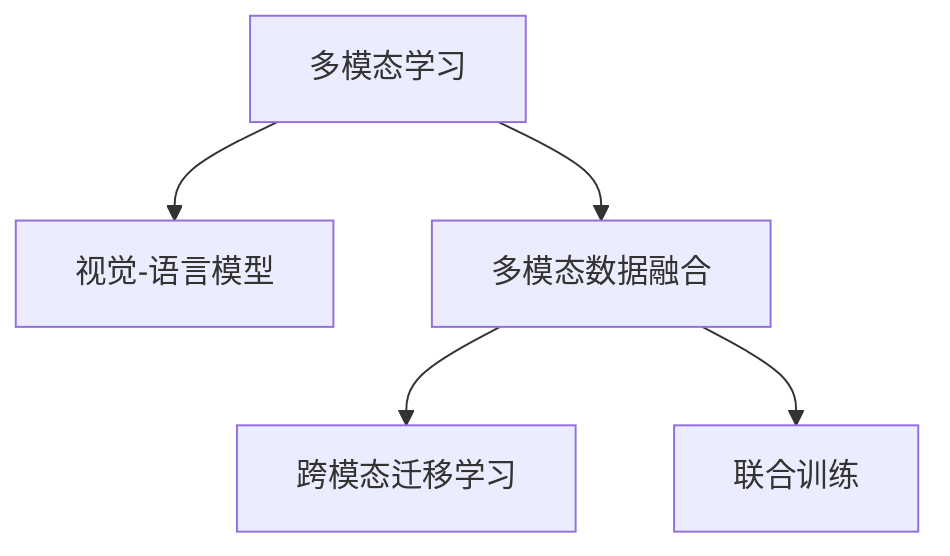

                 

## 1. 背景介绍

### 1.1 问题由来
在过去的十年中，自然语言处理(Natural Language Processing, NLP)技术取得了显著进展。特别是大语言模型的发展，使得AI在理解和生成自然语言方面达到了新的高度。然而，语言作为人类主要的交流手段之一，常常需要结合视觉信息以提供更丰富的语境和细节。

近年来，随着计算机视觉技术的发展，深度学习在图像识别、分类和语义理解方面也取得了重大突破。但由于语言和视觉信息之间存在着显著的差异，单纯依赖单一模态难以充分理解复杂的场景。因此，将图像和文本相结合的多模态AI（Multimodal AI）成为研究热点，旨在构建能够同时理解和处理图像与文本的综合智能系统。

### 1.2 问题核心关键点
多模态AI的核心在于如何构建一个系统，使其既能理解图像信息，又能处理文本信息，并能将这两种信息有效地融合在一起，进行推理和生成。这种融合不仅可以提升AI系统的理解和表达能力，还能在多个领域中实现更高效的交互和决策。

## 2. 核心概念与联系

### 2.1 核心概念概述

为更好地理解多模态AI的概念和原理，本节将介绍几个密切相关的核心概念：

- **多模态学习（Multimodal Learning）**：指利用多种不同类型的数据（如文本、图像、音频等）进行学习，旨在提升模型的泛化能力和准确性。
- **视觉-语言模型（Visual-Language Models, VLMs）**：结合图像和文本，通过深度学习技术学习二者的关联与交互，从而提升模型的理解与推理能力。
- **多模态数据融合（Multimodal Data Fusion）**：将不同模态的数据（如文本和图像）进行融合，提取共同的特征表示，进而提升模型的综合能力。
- **跨模态迁移学习（Cross-Modal Transfer Learning）**：利用单一模态的预训练模型在另一模态的数据上进行微调，以实现跨模态的知识迁移和共享。
- **联合训练（Joint Training）**：在一个模型中同时训练图像和文本数据的联合表示，使得模型能够同时处理和理解两种模态的信息。

这些概念之间的逻辑关系可以通过以下Mermaid流程图来展示：



这个流程图展示出多模态AI的核心概念及其之间的关系：

1. 多模态学习：利用多种数据类型进行学习。
2. 视觉-语言模型：结合图像和文本学习联合表示。
3. 多模态数据融合：将不同模态的数据融合，提取共同特征。
4. 跨模态迁移学习：单一模态模型跨模态知识迁移。
5. 联合训练：同时训练多模态数据，学习联合表示。

## 3. 核心算法原理 & 具体操作步骤
### 3.1 算法原理概述

多模态AI的算法原理主要基于深度学习中的编码器-解码器框架，通过联合训练学习视觉和文本的联合表示。假设有一个包含图像 $X$ 和文本 $Y$ 的多模态数据集 $\mathcal{D}=\{(X_i,Y_i)\}_{i=1}^N$，我们的目标是学习一个映射函数 $F$，将视觉和文本数据映射到一个共同的表示空间 $\mathcal{Z}$。具体的目标函数如下：

$$
\min_{F} \mathcal{L}(F(X),F(Y)) + \mathcal{R}(F(X),F(Y))
$$

其中，$\mathcal{L}$ 表示联合特征的损失函数，$\mathcal{R}$ 表示正则化项，旨在避免过拟合。通过最小化这个损失函数，模型可以学习到一种新的表示，使得图像和文本的特征在某种程度上更加相似，从而促进两种模态信息的融合。

### 3.2 算法步骤详解

多模态AI的算法步骤主要包括以下几个关键步骤：

**Step 1: 数据预处理与分割**
- 收集多模态数据集 $\mathcal{D}$，包含图像和文本数据。
- 对图像和文本进行预处理，如调整大小、归一化、分词等。
- 将数据集划分为训练集、验证集和测试集，一般要求三者之间的分布一致。

**Step 2: 选择编码器和解码器**
- 选择适合的视觉编码器和文本编码器，如ResNet、VGG、LSTM、GRU等，对图像和文本分别进行特征提取。
- 对视觉和文本编码器的输出进行拼接或叠加，形成一个联合表示 $Z$。

**Step 3: 设计联合表示层**
- 设计一个全连接层或卷积神经网络，将视觉和文本编码器的输出映射到一个共同的表示空间 $Z$。
- 通过softmax层或其他分类器对联合表示 $Z$ 进行分类或回归，得到最终输出。

**Step 4: 损失函数设计**
- 选择合适的损失函数，如交叉熵损失、均方误差损失、对比损失等，用于衡量模型在联合表示上的性能。
- 设计正则化项，如L2正则、Dropout、Early Stopping等，防止模型过拟合。

**Step 5: 模型训练与优化**
- 使用梯度下降等优化算法，如Adam、SGD等，最小化联合特征的损失函数。
- 在训练集上进行迭代训练，并在验证集上定期评估模型性能，避免过拟合。
- 根据验证集的表现调整学习率、批次大小等超参数。

**Step 6: 模型评估与部署**
- 在测试集上评估模型性能，计算准确率、召回率、F1值等指标。
- 将模型部署到实际应用中，进行推理和决策。
- 持续收集新的数据，定期重新训练和优化模型。

### 3.3 算法优缺点

多模态AI的算法具有以下优点：

1. **提升模型泛化能力**：多模态学习能够利用多种数据源的信息，提升模型的泛化能力和鲁棒性。
2. **丰富语境信息**：图像和文本信息的融合，可以提供更加丰富的语境信息，提升理解能力。
3. **多样化的应用场景**：多模态AI可以应用于图像描述、视觉问答、智能客服等多个领域，提升用户体验。
4. **易于实现**：现有的深度学习框架（如TensorFlow、PyTorch等）提供了丰富的多模态API和预训练模型，易于实现和部署。

同时，多模态AI也存在一些局限性：

1. **数据获取成本高**：多模态数据获取成本较高，尤其是高质量、多样化的数据集。
2. **数据标注难度大**：多模态数据的标注需要同时考虑图像和文本，工作量较大且复杂。
3. **模型复杂度高**：多模态模型通常比单模态模型复杂，训练和推理速度较慢。
4. **缺乏标准化**：多模态AI的标准化和评估方法尚未完全成熟，难以进行统一的衡量。

尽管存在这些局限性，但多模态AI的潜力和应用前景不容忽视，已成为推动AI技术发展的重要方向。

### 3.4 算法应用领域

多模态AI的应用领域广泛，涵盖了以下几个主要方向：

- **图像描述生成**：将图像转换为自然语言描述，用于图像搜索、推荐系统等。
- **视觉问答**：给定图片和问题，系统能够自动回答相关问题，用于教育、娱乐等领域。
- **智能客服**：结合图像和文本信息，提供更加智能和个性化的客服体验。
- **医学影像分析**：利用医学图像和病历文本，辅助医生进行疾病诊断和患者治疗。
- **自动驾驶**：结合视觉、雷达和传感器数据，实现更精确的定位和路径规划。
- **机器人控制**：通过视觉和自然语言交互，实现智能机器人的控制和任务执行。

这些应用领域展示了多模态AI的广泛潜力和实际价值。随着技术的进步，多模态AI将进一步推动人工智能在各个领域的普及和应用。

## 4. 数学模型和公式 & 详细讲解 & 举例说明

### 4.1 数学模型构建

假设有一个包含图像 $X$ 和文本 $Y$ 的多模态数据集 $\mathcal{D}=\{(X_i,Y_i)\}_{i=1}^N$。我们的目标是学习一个映射函数 $F$，将视觉和文本数据映射到一个共同的表示空间 $\mathcal{Z}$。假设图像编码器的输出为 $X' \in \mathbb{R}^d$，文本编码器的输出为 $Y' \in \mathbb{R}^d$。定义联合表示 $Z$ 如下：

$$
Z = W_X X' + W_Y Y'
$$

其中 $W_X, W_Y$ 分别为图像和文本编码器的权重矩阵。

联合表示层可以使用全连接层或卷积神经网络实现。例如，使用全连接层进行联合表示时，假设输出层有 $k$ 个神经元，则联合表示层的损失函数如下：

$$
\mathcal{L} = \frac{1}{N} \sum_{i=1}^N \ell(F(X_i),F(Y_i))
$$

其中 $\ell$ 为损失函数，如交叉熵损失。

### 4.2 公式推导过程

以图像描述生成任务为例，假设输入为一幅图像 $X$，我们的目标是学习一个联合表示 $Z$，使得 $Z$ 能够最大化与真实文本描述 $Y$ 的相似度。假设图像编码器输出 $X' \in \mathbb{R}^d$，文本编码器输出 $Y' \in \mathbb{R}^d$，联合表示层为全连接层，输出层为softmax层。联合表示层的输出为：

$$
Z = W_X X' + W_Y Y'
$$

其中 $W_X, W_Y$ 分别为图像和文本编码器的权重矩阵。假设输出层有 $k$ 个神经元，则联合表示层的损失函数如下：

$$
\mathcal{L} = \frac{1}{N} \sum_{i=1}^N \log \sigma(Z_i, Y_i)
$$

其中 $\sigma$ 为softmax函数，$Z_i$ 为第 $i$ 个样本的联合表示，$Y_i$ 为真实的文本描述。目标是最小化这个损失函数，使模型能够生成与真实描述最接近的文本。

### 4.3 案例分析与讲解

假设有一个包含手写数字图像和其文本描述的多模态数据集，如图像描述生成任务。图像描述生成任务的目标是给定一张图片，生成一个描述该图片的自然语言文本。以下是多模态AI在图像描述生成任务中的具体实现：

**Step 1: 数据预处理与分割**
- 收集手写数字图像及其文本描述，并进行预处理和标注。
- 将数据集划分为训练集、验证集和测试集。

**Step 2: 选择编码器和解码器**
- 选择卷积神经网络（CNN）作为图像编码器，提取图像的特征。
- 选择循环神经网络（RNN）或Transformer作为文本编码器，提取文本的特征。

**Step 3: 设计联合表示层**
- 设计一个全连接层，将图像和文本编码器的输出进行拼接，形成联合表示。
- 使用softmax层进行文本分类，输出最有可能的文本描述。

**Step 4: 损失函数设计**
- 使用交叉熵损失函数，衡量模型生成的文本与真实文本的相似度。
- 使用L2正则化，防止模型过拟合。

**Step 5: 模型训练与优化**
- 使用梯度下降等优化算法，最小化联合特征的损失函数。
- 在训练集上进行迭代训练，并在验证集上定期评估模型性能。
- 根据验证集的表现调整学习率、批次大小等超参数。

**Step 6: 模型评估与部署**
- 在测试集上评估模型性能，计算准确率、召回率、F1值等指标。
- 将模型部署到实际应用中，进行推理和决策。
- 持续收集新的数据，定期重新训练和优化模型。

## 5. 项目实践：代码实例和详细解释说明

### 5.1 开发环境搭建

在进行多模态AI的开发实践前，我们需要准备好开发环境。以下是使用Python进行PyTorch开发的环境配置流程：

1. 安装Anaconda：从官网下载并安装Anaconda，用于创建独立的Python环境。

2. 创建并激活虚拟环境：
```bash
conda create -n multimodal-env python=3.8 
conda activate multimodal-env
```

3. 安装PyTorch：根据CUDA版本，从官网获取对应的安装命令。例如：
```bash
conda install pytorch torchvision torchaudio cudatoolkit=11.1 -c pytorch -c conda-forge
```

4. 安装TensorFlow：
```bash
pip install tensorflow==2.7.0
```

5. 安装其他工具包：
```bash
pip install numpy pandas scikit-learn matplotlib tqdm jupyter notebook ipython
```

完成上述步骤后，即可在`multimodal-env`环境中开始多模态AI的实践。

### 5.2 源代码详细实现

下面我们以图像描述生成任务为例，给出使用PyTorch进行多模态AI开发的PyTorch代码实现。

首先，定义图像和文本的编码器：

```python
import torch
import torch.nn as nn
import torchvision.transforms as transforms

# 图像编码器（使用卷积神经网络）
class ImageEncoder(nn.Module):
    def __init__(self):
        super(ImageEncoder, self).__init__()
        self.encoder = nn.Sequential(
            nn.Conv2d(1, 64, kernel_size=3, stride=1, padding=1),
            nn.ReLU(),
            nn.MaxPool2d(kernel_size=2, stride=2),
            nn.Conv2d(64, 128, kernel_size=3, stride=1, padding=1),
            nn.ReLU(),
            nn.MaxPool2d(kernel_size=2, stride=2),
            nn.Conv2d(128, 256, kernel_size=3, stride=1, padding=1),
            nn.ReLU(),
            nn.MaxPool2d(kernel_size=2, stride=2),
            nn.Flatten()
        )
    
    def forward(self, x):
        return self.encoder(x)

# 文本编码器（使用循环神经网络）
class TextEncoder(nn.Module):
    def __init__(self, embedding_dim, hidden_size, num_layers):
        super(TextEncoder, self).__init__()
        self.embedding = nn.Embedding(num_words, embedding_dim)
        self.rnn = nn.LSTM(embedding_dim, hidden_size, num_layers)
    
    def forward(self, x):
        x = self.embedding(x)
        x, (h, _) = self.rnn(x)
        return x
```

接着，定义联合表示层和输出层：

```python
class JointEncoder(nn.Module):
    def __init__(self, image_dim, text_dim, joint_dim):
        super(JointEncoder, self).__init__()
        self.image_encoder = ImageEncoder()
        self.text_encoder = TextEncoder(text_dim, joint_dim, 1)
        self.fc = nn.Linear(joint_dim * 2, joint_dim)
    
    def forward(self, x, y):
        x = self.image_encoder(x)
        y = self.text_encoder(y)
        z = torch.cat([x, y], dim=1)
        z = self.fc(z)
        return z
```

最后，定义损失函数和优化器：

```python
class MultimodalLoss(nn.Module):
    def __init__(self):
        super(MultimodalLoss, self).__init__()
        self.criterion = nn.CrossEntropyLoss()
    
    def forward(self, output, target):
        return self.criterion(output, target)

# 定义训练和评估函数
def train_epoch(model, data_loader, optimizer):
    model.train()
    loss_sum = 0
    correct = 0
    for batch in data_loader:
        inputs, targets = batch['inputs'], batch['targets']
        optimizer.zero_grad()
        output = model(inputs, targets)
        loss = loss_fn(output, targets)
        loss_sum += loss.item()
        loss.backward()
        optimizer.step()
    return loss_sum / len(data_loader)

def evaluate(model, data_loader):
    model.eval()
    loss_sum = 0
    correct = 0
    with torch.no_grad():
        for batch in data_loader:
            inputs, targets = batch['inputs'], batch['targets']
            output = model(inputs, targets)
            loss = loss_fn(output, targets)
            loss_sum += loss.item()
            correct += torch.sum(output.argmax(dim=1) == targets)
    return loss_sum / len(data_loader), correct.item() / len(data_loader.dataset)
```

最后，启动训练流程并在测试集上评估：

```python
epochs = 10
batch_size = 16

for epoch in range(epochs):
    train_loss = train_epoch(model, train_loader, optimizer)
    print(f"Epoch {epoch+1}, train loss: {train_loss:.4f}")
    
    val_loss, acc = evaluate(model, val_loader)
    print(f"Epoch {epoch+1}, validation loss: {val_loss:.4f}, accuracy: {acc:.4f}")
    
print("Test results:")
test_loss, acc = evaluate(model, test_loader)
print(f"Test loss: {test_loss:.4f}, accuracy: {acc:.4f}")
```

以上就是使用PyTorch进行图像描述生成任务的多模态AI代码实现。可以看到，PyTorch提供了强大的深度学习API，使得多模态AI的实现变得相对简单。

### 5.3 代码解读与分析

让我们再详细解读一下关键代码的实现细节：

**ImageEncoder类**：
- 定义了一个使用卷积神经网络的图像编码器，提取图像特征。
- 包含多个卷积层、ReLU激活函数和池化层，最终将图像特征展开成向量。

**TextEncoder类**：
- 定义了一个使用循环神经网络的文本编码器，提取文本特征。
- 包含嵌入层、LSTM层和输出层，将文本转换为向量表示。

**JointEncoder类**：
- 定义了一个联合表示层，将图像和文本特征拼接并映射到共同的向量空间。
- 使用全连接层进行线性变换，得到联合表示。

**MultimodalLoss类**：
- 定义了一个多模态损失函数，使用交叉熵损失衡量模型输出的文本与真实文本的相似度。

**训练和评估函数**：
- 使用PyTorch的DataLoader对数据集进行批次化加载，供模型训练和推理使用。
- 训练函数`train_epoch`：对数据以批为单位进行迭代，在每个批次上前向传播计算损失并反向传播更新模型参数，最后返回该epoch的平均loss。
- 评估函数`evaluate`：与训练类似，不同点在于不更新模型参数，并在每个batch结束后将预测和标签结果存储下来，最后使用softmax函数对输出进行分类。

**训练流程**：
- 定义总的epoch数和batch size，开始循环迭代
- 每个epoch内，先在训练集上训练，输出平均loss
- 在验证集上评估，输出损失和准确率
- 所有epoch结束后，在测试集上评估，给出最终测试结果

## 6. 实际应用场景

### 6.1 智能医疗诊断

多模态AI在智能医疗诊断中具有广泛的应用前景。结合医学影像和病历文本，智能诊断系统能够辅助医生进行疾病诊断和治疗决策。例如，将CT图像和放射科医生的报告结合起来，可以提供更准确的肿瘤诊断。

在技术实现上，可以收集大量的医学影像和病历文本数据，构建多模态数据集。结合图像编码器和文本编码器，训练多模态模型，使其能够理解医学影像中的细节，并结合病历文本进行综合判断。在实际应用中，医生可以通过系统输入医学影像和病历文本，系统自动生成诊断报告，辅助医生进行决策。

### 6.2 智能安防监控

在安防监控领域，多模态AI可以通过结合图像和传感器数据，实现更高效的异常检测和行为识别。例如，将视频监控图像和声音信号结合起来，可以更准确地识别异常行为。

在技术实现上，可以收集大量的监控视频和声音数据，构建多模态数据集。结合图像编码器和声学编码器，训练多模态模型，使其能够理解声音和图像中的异常行为。在实际应用中，系统可以实时监控视频和声音信号，并自动检测异常行为，及时发出警报。

### 6.3 智能客服系统

在智能客服领域，多模态AI可以通过结合图像和文本信息，提供更智能和个性化的客服体验。例如，将客户上传的图片和文字描述结合起来，可以更准确地理解客户需求。

在技术实现上，可以收集大量的客户咨询数据，构建多模态数据集。结合图像编码器和文本编码器，训练多模态模型，使其能够理解图像和文本中的客户需求。在实际应用中，客户可以通过上传图片和文字描述，系统自动生成回复，提供个性化的服务。

### 6.4 未来应用展望

未来，多模态AI将在更多领域得到应用，为各个行业带来新的变革。

在智慧城市治理中，多模态AI可以通过结合图像和传感器数据，实现更精细化的城市管理。例如，结合无人机图像和城市交通数据，可以实现更智能的城市交通管理。

在智能家居领域，多模态AI可以通过结合图像和语音信息，实现更智能的家庭交互。例如，结合图像和语音指令，可以实现更智能的家居控制和娱乐。

在智能制造领域，多模态AI可以通过结合图像和传感器数据，实现更智能的生产监控和故障预测。例如，结合图像和设备传感器数据，可以实现更智能的设备和生产线监控。

总之，随着技术的不断进步，多模态AI将在各个领域得到更广泛的应用，为社会各个领域带来新的变革和创新。

## 7. 工具和资源推荐
### 7.1 学习资源推荐

为了帮助开发者系统掌握多模态AI的理论基础和实践技巧，这里推荐一些优质的学习资源：

1. 《Multimodal Learning for Multimodal Machine Learning》系列博文：由多模态AI领域的专家撰写，深入浅出地介绍了多模态学习的基本概念和常用方法。

2. CS224N《Multimodal Learning》课程：斯坦福大学开设的多模态学习课程，涵盖图像描述、视觉问答、跨模态迁移学习等内容，是学习多模态AI的重要资源。

3. 《Multimodal Learning in NLP》书籍：全面介绍了多模态AI在NLP中的应用，包括图像描述、视觉问答、情感分析等任务。

4. HuggingFace官方文档：提供了丰富的多模态预训练模型和API，方便开发者进行多模态AI的开发和部署。

5. CLUE开源项目：包含多模态AI任务的数据集和预训练模型，助力多模态AI技术发展。

通过对这些资源的学习实践，相信你一定能够快速掌握多模态AI的精髓，并用于解决实际的NLP问题。
### 7.2 开发工具推荐

高效的开发离不开优秀的工具支持。以下是几款用于多模态AI开发的常用工具：

1. PyTorch：基于Python的开源深度学习框架，灵活动态的计算图，适合快速迭代研究。提供了丰富的多模态API和预训练模型。

2. TensorFlow：由Google主导开发的开源深度学习框架，生产部署方便，适合大规模工程应用。提供了丰富的多模态API和预训练模型。

3. Transformers库：HuggingFace开发的NLP工具库，集成了多种预训练模型，支持多模态数据融合和联合训练。

4. Weights & Biases：模型训练的实验跟踪工具，可以记录和可视化模型训练过程中的各项指标，方便对比和调优。

5. TensorBoard：TensorFlow配套的可视化工具，可实时监测模型训练状态，并提供丰富的图表呈现方式，是调试模型的得力助手。

6. Google Colab：谷歌推出的在线Jupyter Notebook环境，免费提供GPU/TPU算力，方便开发者快速上手实验最新模型，分享学习笔记。

合理利用这些工具，可以显著提升多模态AI的开发效率，加快创新迭代的步伐。

### 7.3 相关论文推荐

多模态AI的研究源于学界的持续研究。以下是几篇奠基性的相关论文，推荐阅读：

1. Multimodal Feature Learning with Deep Learning: A New Generative Model for Multi-Modal Description & Segmentation：提出多模态特征学习算法，用于图像描述和语义分割。

2. Show and Tell: A Neural Image Caption Generator：提出了一种使用CNN和LSTM结合的神经网络架构，用于生成图像描述。

3. Multimodal Image Caption Generation with Attention：提出了一种结合注意力机制的神经网络架构，用于生成图像描述。

4. Multimodal Retriever: An Attention-Based Multimodal Retrieval Framework：提出了一种基于注意力机制的多模态检索框架，用于在多模态数据中检索相关数据。

5. Multimodal Transformers for Image Captioning and Video Description：提出了一种基于Transformer的多模态模型，用于图像描述和视频描述。

这些论文代表了大模态AI的发展脉络。通过学习这些前沿成果，可以帮助研究者把握学科前进方向，激发更多的创新灵感。

## 8. 总结：未来发展趋势与挑战

### 8.1 总结

本文对多模态AI的概念和实践进行了全面系统的介绍。首先阐述了多模态AI的研究背景和应用前景，明确了多模态AI在融合图像和文本信息，提升智能系统理解能力方面的独特价值。其次，从原理到实践，详细讲解了多模态AI的算法原理和实现步骤，给出了多模态AI开发的完整代码实例。同时，本文还广泛探讨了多模态AI在医疗、安防、客服等多个领域的应用场景，展示了多模态AI的广泛潜力和实际价值。

通过本文的系统梳理，可以看到，多模态AI在图像和文本的融合上取得了显著进展，显著提升了AI系统的综合理解能力。未来，随着多模态AI技术的不断进步，其在更多领域的应用前景将更加广阔，有望在智慧城市、智能家居、智能制造等多个方向实现突破。

### 8.2 未来发展趋势

展望未来，多模态AI的发展趋势如下：

1. **多模态学习框架的完善**：随着多模态学习框架的不断完善，将支持更多种类的模态数据融合和联合训练，提升系统的综合能力。

2. **跨模态迁移学习的提升**：通过跨模态迁移学习，将单一模态的预训练模型应用于另一模态的数据，提升模型泛化能力。

3. **联合训练方法的创新**：引入新的联合训练方法，如对比学习、自监督学习等，提升模型对不同模态信息的理解和融合。

4. **跨模态融合方法的优化**：优化跨模态融合方法，如引入注意力机制、融合多级特征表示等，提升融合效果。

5. **多模态应用场景的拓展**：多模态AI将在更多领域得到应用，如医疗、安防、客服等，提升这些领域的智能化水平。

6. **实时性要求的提高**：随着实时性要求的提高，多模态AI的推理和推理速度将进一步优化，提升用户体验。

### 8.3 面临的挑战

尽管多模态AI在应用前景上具有广阔空间，但仍面临以下挑战：

1. **数据获取成本高**：多模态数据获取成本较高，尤其是高质量、多样化的数据集。如何高效获取和标注数据，是一个需要解决的问题。

2. **数据标注难度大**：多模态数据的标注需要同时考虑图像和文本，工作量较大且复杂。如何简化标注过程，提高标注效率，是一个亟待解决的问题。

3. **模型复杂度高**：多模态模型通常比单模态模型复杂，训练和推理速度较慢。如何降低模型复杂度，提高模型训练和推理效率，是一个需要解决的问题。

4. **缺乏标准化**：多模态AI的标准化和评估方法尚未完全成熟，难以进行统一的衡量。如何制定统一的标准和评估方法，是一个需要解决的问题。

5. **多模态数据的噪声干扰**：多模态数据通常包含噪声和冗余信息，如何处理和消除这些噪声，是一个需要解决的问题。

### 8.4 研究展望

面对多模态AI所面临的挑战，未来的研究需要在以下几个方面寻求新的突破：

1. **无监督和半监督多模态学习**：探索无监督和半监督多模态学习方法，利用自监督学习、主动学习等方法，减少对大规模标注数据的依赖。

2. **高效的多模态特征融合**：引入高效的多模态特征融合方法，如注意力机制、融合多级特征表示等，提升跨模态信息的融合效果。

3. **跨模态迁移学习算法**：开发新的跨模态迁移学习算法，提升单一模态模型在另一模态数据上的泛化能力。

4. **多模态表示学习**：探索多模态表示学习方法，学习更加普适、鲁棒的多模态表示，提升模型的泛化能力和鲁棒性。

5. **多模态数据增强**：引入多模态数据增强技术，提升模型的泛化能力和鲁棒性。

6. **多模态模型的可解释性**：探索多模态模型的可解释性，提高模型输出的透明性和可理解性。

这些研究方向的探索，必将引领多模态AI技术迈向更高的台阶，为构建安全、可靠、可解释、可控的智能系统铺平道路。

## 9. 附录：常见问题与解答

**Q1：多模态AI是否适用于所有多模态任务？**

A: 多模态AI在大多数多模态任务上都能取得不错的效果，特别是对于数据量较大的任务。但对于一些特定领域的任务，如医学、法律等，单一模态的预训练模型可能更有效。此时需要在特定领域语料上进一步预训练，再进行多模态微调。

**Q2：多模态AI的损失函数如何选择？**

A: 多模态AI的损失函数通常包括图像和文本的联合损失。常见的多模态损失函数有对比损失、因果损失、对数似然损失等。选择适合的损失函数，需要根据具体任务和数据特点进行调整。

**Q3：多模态AI的模型训练过程中如何避免过拟合？**

A: 多模态AI的模型训练过程中，通常需要引入正则化技术，如L2正则、Dropout等。还可以采用数据增强、对抗训练等方法，提升模型的泛化能力和鲁棒性。

**Q4：多模态AI的推理速度如何优化？**

A: 多模态AI的推理速度可以通过优化模型结构和优化推理过程进行提升。例如，使用Transformer架构进行推理，可以显著提升推理速度。还可以采用量化加速、剪枝优化等方法，减少模型参数量和计算量。

**Q5：多模态AI的部署有哪些注意事项？**

A: 多模态AI的部署需要考虑模型的可解释性、安全性、实时性等因素。通常需要将模型封装成标准化的服务接口，进行动态资源配置和监控告警，确保系统的稳定性和可靠性。

本文全面系统地介绍了多模态AI的概念和实践，帮助开发者快速掌握多模态AI的理论基础和实现技巧。希望通过对多模态AI的理解和实践，能够推动多模态AI技术在更多领域的应用，为人类社会的智能化进程贡献力量。

---

作者：禅与计算机程序设计艺术 / Zen and the Art of Computer Programming

