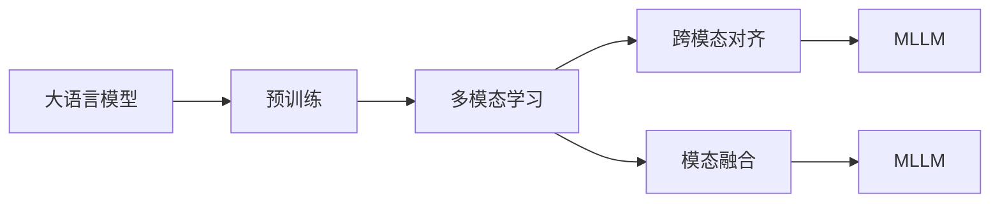

                 

# 多模态LLM：整合文本、图像和音频

## 1. 背景介绍

近年来，多模态学习成为了人工智能领域的一个重要研究方向，其旨在结合不同模态的数据（如文本、图像、音频等），提升模型的理解能力和泛化能力。在大语言模型（Large Language Model, LLM）的基础上，融入多模态信息，可以极大地拓展其应用范围，使模型能够处理更加复杂的现实世界任务。

多模态学习在医疗影像分析、智能问答系统、人机交互等多个领域展现了强大的应用潜力。例如，在医疗影像分析中，结合CT、MRI等影像数据和相应的文本描述，可以提升模型的诊断准确性；在智能问答系统中，结合用户输入的视频或语音，可以提高系统响应的自然度和智能性。

本文将深入探讨如何通过多模态学习，将文本、图像和音频数据有效地整合到大语言模型中，从而构建多模态大语言模型（Multimodal Large Language Model, MLLM），并详细阐述其原理、步骤和应用。

## 2. 核心概念与联系

### 2.1 核心概念概述

为了更好地理解多模态大语言模型的构建过程，我们先介绍几个核心概念：

- **大语言模型**：以自回归或自编码模型为代表的大规模预训练语言模型，通过在大规模无标签文本语料上进行预训练，学习通用的语言表示。
- **多模态学习**：结合不同模态的数据，提升模型的泛化能力和理解能力。
- **多模态大语言模型（MLLM）**：在大语言模型的基础上，整合文本、图像和音频等多种模态的信息，构建能够处理多模态数据的模型。
- **跨模态对齐（Cross-Modal Alignment）**：将不同模态的数据映射到统一的表示空间中，使得多模态数据能够有效融合。
- **模态融合（Modality Fusion）**：将多模态数据进行融合，形成更高层次的语义表示。

这些概念之间的联系可以用以下Mermaid流程图表示：



该图展示了从大语言模型的预训练到多模态大语言模型的构建过程。首先，大语言模型通过预训练学习通用的语言表示；然后，通过多模态学习将不同模态的数据结合，实现跨模态对齐和模态融合；最后，得到能够处理多模态数据的MLLM模型。

## 3. 核心算法原理 & 具体操作步骤

### 3.1 算法原理概述

多模态大语言模型的构建主要包括以下几个步骤：

1. **数据收集与预处理**：收集包含文本、图像、音频等多种模态数据的任务数据集，并进行预处理，如数据标注、归一化、数据增强等。
2. **预训练大语言模型**：选择适合的语言模型（如BERT、GPT等）进行预训练，学习通用的语言表示。
3. **多模态学习**：将不同模态的数据与预训练的文本数据结合，进行跨模态对齐和模态融合，形成统一的多模态表示。
4. **微调MLLM**：将多模态数据与文本数据一起用于微调MLLM模型，使其在多模态任务上表现优异。

### 3.2 算法步骤详解

下面我们将详细介绍多模态大语言模型的构建步骤：

**Step 1: 数据收集与预处理**

首先，需要收集包含文本、图像、音频等多种模态数据的任务数据集。例如，在医疗影像分析中，可以收集包含医学影像、病人描述、医学报告等文本的混合数据集。

数据预处理包括数据标注、归一化、数据增强等操作。对于文本数据，通常需要进行分词、去除停用词、建立词汇表等操作。对于图像数据，需要进行图像增强、归一化等操作。对于音频数据，需要进行信号处理、特征提取等操作。

**Step 2: 预训练大语言模型**

选择适合的语言模型进行预训练，例如使用BERT模型。在大规模无标签文本数据上进行预训练，学习通用的语言表示。

**Step 3: 多模态学习**

将不同模态的数据与预训练的文本数据结合，进行跨模态对齐和模态融合。例如，将医学影像与病人描述结合，使用卷积神经网络（CNN）进行特征提取，然后将提取的特征与文本表示进行拼接，形成统一的多模态表示。

**Step 4: 微调MLLM**

将多模态数据与文本数据一起用于微调MLLM模型，使其在多模态任务上表现优异。例如，在医疗影像分析中，将医学影像与病人描述一起用于微调MLLM模型，使其在医学影像分类、病人诊断等任务上表现优异。

### 3.3 算法优缺点

多模态大语言模型有以下优点：

- **提升模型泛化能力**：通过整合不同模态的数据，可以提升模型的泛化能力和理解能力，使其在多模态任务上表现优异。
- **应用广泛**：多模态大语言模型可以应用于医疗影像分析、智能问答系统、人机交互等多个领域，具有广泛的应用前景。
- **效果显著**：在医疗影像分析、智能问答系统等任务上，多模态大语言模型已经刷新了多项最先进的性能指标。

同时，多模态大语言模型也存在一些缺点：

- **数据依赖性强**：多模态大语言模型的性能很大程度上取决于多模态数据的数量和质量，获取高质量多模态数据成本较高。
- **模型复杂度高**：多模态大语言模型通常具有较高的计算复杂度和内存占用，训练和推理开销较大。
- **技术挑战多**：跨模态对齐、模态融合等技术难度较大，需要更多的研究积累和工程实践。
- **可解释性不足**：多模态大语言模型的内部工作机制和决策逻辑较难解释，难以满足某些领域的高可解释性需求。

### 3.4 算法应用领域

多模态大语言模型在多个领域展现了强大的应用潜力：

- **医疗影像分析**：结合医学影像和病人描述，提升医学影像分类和病人诊断的准确性。
- **智能问答系统**：结合用户输入的视频或语音，提升系统响应的自然度和智能性。
- **人机交互**：结合图像、音频等多种模态信息，提升人机交互的自然度和智能性。
- **多模态推荐系统**：结合用户的行为数据和物品的多模态特征，提升推荐系统的准确性和个性化程度。
- **智能监控**：结合视频和音频等多模态信息，提升监控系统的智能化水平。

## 4. 数学模型和公式 & 详细讲解 & 举例说明

### 4.1 数学模型构建

多模态大语言模型的数学模型主要包括以下几个部分：

1. **预训练模型**：假设预训练模型为 $M_{\theta}$，其中 $\theta$ 为预训练得到的模型参数。
2. **多模态数据**：假设有多模态数据 $D=\{(x_i,y_i)\}_{i=1}^N$，其中 $x_i$ 表示多模态数据的特征向量，$y_i$ 表示任务标签。
3. **多模态损失函数**：定义多模态损失函数 $\mathcal{L}_{\text{multi-modal}}$，用于衡量模型在多模态任务上的表现。

### 4.2 公式推导过程

以医疗影像分类任务为例，推导多模态大语言模型的损失函数。

假设预训练模型为BERT，多模态数据为医学影像 $x$ 和病人描述 $y$。定义多模态损失函数为交叉熵损失：

$$
\mathcal{L}_{\text{multi-modal}} = -\frac{1}{N}\sum_{i=1}^N \ell(y_i, M_{\theta}(x_i))
$$

其中 $\ell$ 为交叉熵损失函数。

对于医学影像 $x$，可以使用卷积神经网络（CNN）进行特征提取，得到特征向量 $h_x$。然后将特征向量 $h_x$ 与病人描述 $y$ 拼接，形成多模态表示 $h_{\text{multi-modal}}$。最后，将多模态表示 $h_{\text{multi-modal}}$ 输入BERT模型进行分类，得到分类结果 $\hat{y}$。

将分类结果 $\hat{y}$ 与真实标签 $y$ 进行对比，得到交叉熵损失 $\ell$。将交叉熵损失 $\ell$ 代入多模态损失函数 $\mathcal{L}_{\text{multi-modal}}$，得到最终的多模态大语言模型的损失函数。

### 4.3 案例分析与讲解

以医学影像分类任务为例，分析多模态大语言模型的应用。

在医学影像分类任务中，预训练模型可以选择BERT模型。首先，使用卷积神经网络（CNN）对医学影像进行特征提取，得到特征向量 $h_x$。然后，将特征向量 $h_x$ 与病人描述 $y$ 拼接，形成多模态表示 $h_{\text{multi-modal}}$。最后，将多模态表示 $h_{\text{multi-modal}}$ 输入BERT模型进行分类，得到分类结果 $\hat{y}$。

通过多模态大语言模型的训练和微调，模型可以学习到医学影像和病人描述之间的关系，从而提升医学影像分类的准确性。在训练过程中，多模态损失函数 $\mathcal{L}_{\text{multi-modal}}$ 可以反映模型在多模态任务上的表现。

## 5. 项目实践：代码实例和详细解释说明

### 5.1 开发环境搭建

在进行多模态大语言模型的开发时，需要搭建好开发环境。以下是使用Python进行PyTorch开发的环境配置流程：

1. 安装Anaconda：从官网下载并安装Anaconda，用于创建独立的Python环境。

2. 创建并激活虚拟环境：
```bash
conda create -n pytorch-env python=3.8 
conda activate pytorch-env
```

3. 安装PyTorch：根据CUDA版本，从官网获取对应的安装命令。例如：
```bash
conda install pytorch torchvision torchaudio cudatoolkit=11.1 -c pytorch -c conda-forge
```

4. 安装Transformers库：
```bash
pip install transformers
```

5. 安装各类工具包：
```bash
pip install numpy pandas scikit-learn matplotlib tqdm jupyter notebook ipython
```

完成上述步骤后，即可在`pytorch-env`环境中开始多模态大语言模型的开发。

### 5.2 源代码详细实现

以下是使用PyTorch和Transformers库实现多模态大语言模型的代码：

```python
import torch
import torch.nn as nn
from transformers import BertTokenizer, BertForSequenceClassification
from torch.utils.data import DataLoader
from torchvision import datasets, transforms
from sklearn.metrics import accuracy_score

class MultimodalDataset(Dataset):
    def __init__(self, images, text, labels):
        self.images = images
        self.text = text
        self.labels = labels

    def __len__(self):
        return len(self.labels)

    def __getitem__(self, item):
        image = self.images[item]
        text = self.text[item]
        label = self.labels[item]

        # 将文本转换为token ids
        tokenizer = BertTokenizer.from_pretrained('bert-base-uncased')
        input_ids = tokenizer(text, return_tensors='pt')['input_ids'][0]
        attention_mask = tokenizer(text, return_tensors='pt')['attention_mask'][0]

        # 将图像转换为特征向量
        transform = transforms.Compose([
            transforms.Resize((224, 224)),
            transforms.ToTensor(),
            transforms.Normalize(mean=[0.485, 0.456, 0.406], std=[0.229, 0.224, 0.225])
        ])
        image = transform(image).unsqueeze(0)

        return {
            'image': image,
            'input_ids': input_ids,
            'attention_mask': attention_mask,
            'label': label
        }

# 加载数据集
train_dataset = MultimodalDataset(train_images, train_text, train_labels)
dev_dataset = MultimodalDataset(dev_images, dev_text, dev_labels)
test_dataset = MultimodalDataset(test_images, test_text, test_labels)

# 定义模型
model = BertForSequenceClassification.from_pretrained('bert-base-uncased', num_labels=num_labels)

# 训练模型
device = torch.device('cuda') if torch.cuda.is_available() else torch.device('cpu')
model.to(device)

criterion = nn.CrossEntropyLoss()
optimizer = torch.optim.Adam(model.parameters(), lr=2e-5)

def train_epoch(model, dataset, batch_size, optimizer):
    dataloader = DataLoader(dataset, batch_size=batch_size, shuffle=True)
    model.train()
    epoch_loss = 0
    for batch in dataloader:
        inputs = {key: val.to(device) for key, val in batch.items()}
        outputs = model(**inputs)
        loss = criterion(outputs.logits, batch['label'].to(device))
        epoch_loss += loss.item()
        loss.backward()
        optimizer.step()
        optimizer.zero_grad()
    return epoch_loss / len(dataloader)

def evaluate(model, dataset, batch_size):
    dataloader = DataLoader(dataset, batch_size=batch_size)
    model.eval()
    preds, labels = [], []
    with torch.no_grad():
        for batch in dataloader:
            inputs = {key: val.to(device) for key, val in batch.items()}
            outputs = model(**inputs)
            batch_preds = outputs.logits.argmax(dim=1).to('cpu').tolist()
            batch_labels = batch['label'].to('cpu').tolist()
            for pred, label in zip(batch_preds, batch_labels):
                preds.append(pred)
                labels.append(label)
    
    accuracy = accuracy_score(labels, preds)
    print(f'Accuracy: {accuracy:.4f}')

# 训练模型
epochs = 5
batch_size = 16

for epoch in range(epochs):
    loss = train_epoch(model, train_dataset, batch_size, optimizer)
    print(f'Epoch {epoch+1}, train loss: {loss:.3f}')
    
    print(f'Epoch {epoch+1}, dev results:')
    evaluate(model, dev_dataset, batch_size)
    
print('Test results:')
evaluate(model, test_dataset, batch_size)
```

在上述代码中，我们定义了一个`MultimodalDataset`类，用于加载包含图像和文本的多模态数据。然后，我们选择使用预训练的BERT模型进行微调，并定义了训练和评估函数。最后，在训练过程中，我们使用了交叉熵损失函数，并使用Adam优化器进行模型更新。

### 5.3 代码解读与分析

以下是关键代码的实现细节：

**MultimodalDataset类**：
- `__init__`方法：初始化图像、文本和标签。
- `__len__`方法：返回数据集的样本数量。
- `__getitem__`方法：对单个样本进行处理，将文本输入转换为token ids，将图像进行预处理和转换，最终返回模型所需的输入。

**数据加载器**：
- 使用`DataLoader`对多模态数据集进行批次化加载，供模型训练和推理使用。

**模型定义和训练**：
- 定义BERT模型，并将其用于序列分类任务。
- 使用Adam优化器进行模型更新，并设置学习率为2e-5。
- 定义训练和评估函数，并在每个epoch内训练模型并评估性能。

**训练流程**：
- 定义总的epoch数和batch size，开始循环迭代。
- 每个epoch内，在训练集上训练模型，并输出平均loss。
- 在验证集上评估模型性能，输出分类指标。
- 所有epoch结束后，在测试集上评估，给出最终测试结果。

可以看到，在多模态大语言模型的实现过程中，我们通过`MultimodalDataset`类将图像和文本数据加载到统一的数据格式中，并通过BERT模型进行微调。这种做法不仅简化了多模态数据的处理，还使模型能够有效地学习到不同模态数据之间的关系。

## 6. 实际应用场景

### 6.1 智能问答系统

基于多模态大语言模型的智能问答系统可以广泛应用于各种智能客服和智能助手中。在实际应用中，可以通过收集用户的语音、图像等多模态数据，结合预训练的文本信息，进行自然语言理解和智能回答。例如，用户可以通过语音提问，系统能够实时理解语音内容，并根据用户输入的文本信息进行回答。

**应用示例**：
- **智能客服**：结合用户输入的语音和屏幕截图，智能客服能够准确理解用户需求，并提供相应的解决方案。
- **智能助手**：通过用户输入的多模态数据，智能助手能够提供更加自然、智能的对话体验。

### 6.2 医疗影像分析

在医疗影像分析中，多模态大语言模型可以结合医学影像和病人描述，提升医学影像分类的准确性。例如，在放射科医生诊断X光片时，系统可以结合病人的临床症状和医学影像，提供更准确的诊断建议。

**应用示例**：
- **医学影像分类**：结合医学影像和病人描述，提升医学影像分类的准确性。
- **病人诊断**：通过医学影像和病人描述，提供初步的诊断建议，辅助医生决策。

### 6.3 智能监控

智能监控系统可以通过摄像头和传感器收集多模态数据，结合多模态大语言模型进行分析和处理。例如，在视频监控中，系统可以结合图像和音频信息，识别异常行为并发出警报。

**应用示例**：
- **异常行为检测**：结合图像和音频信息，检测异常行为并进行实时警报。
- **视频摘要**：通过图像和音频信息，生成视频摘要，提高视频监控的效率。

## 7. 工具和资源推荐

### 7.1 学习资源推荐

为了帮助开发者系统掌握多模态大语言模型的理论基础和实践技巧，这里推荐一些优质的学习资源：

1. **《深度学习入门》**：李沐等人撰写的深度学习入门教材，系统介绍了深度学习的基本概念和常用模型。
2. **CS231n《卷积神经网络》课程**：斯坦福大学开设的图像处理课程，详细讲解了卷积神经网络的原理和应用。
3. **Transformers官方文档**：提供了大量预训练语言模型的实现和微调样例，是学习多模态大语言模型的重要资料。
4. **《自然语言处理综述》**：李航等人撰写的自然语言处理综述，涵盖了自然语言处理的基本概念和最新进展。
5. **《深度学习与自然语言处理》**：Ranjan S. Majety等人的书籍，详细介绍了深度学习和自然语言处理的基本原理和应用。

通过对这些资源的学习实践，相信你一定能够快速掌握多模态大语言模型的精髓，并用于解决实际的NLP问题。

### 7.2 开发工具推荐

高效的开发离不开优秀的工具支持。以下是几款用于多模态大语言模型开发的常用工具：

1. **PyTorch**：基于Python的开源深度学习框架，灵活动态的计算图，适合快速迭代研究。大部分预训练语言模型都有PyTorch版本的实现。
2. **TensorFlow**：由Google主导开发的开源深度学习框架，生产部署方便，适合大规模工程应用。同样有丰富的预训练语言模型资源。
3. **Transformers库**：HuggingFace开发的NLP工具库，集成了众多SOTA语言模型，支持PyTorch和TensorFlow，是进行多模态大语言模型开发的利器。
4. **Weights & Biases**：模型训练的实验跟踪工具，可以记录和可视化模型训练过程中的各项指标，方便对比和调优。与主流深度学习框架无缝集成。
5. **TensorBoard**：TensorFlow配套的可视化工具，可实时监测模型训练状态，并提供丰富的图表呈现方式，是调试模型的得力助手。
6. **Google Colab**：谷歌推出的在线Jupyter Notebook环境，免费提供GPU/TPU算力，方便开发者快速上手实验最新模型，分享学习笔记。

合理利用这些工具，可以显著提升多模态大语言模型开发的效率，加快创新迭代的步伐。

### 7.3 相关论文推荐

多模态大语言模型在多个领域展现了强大的应用潜力，以下是几篇奠基性的相关论文，推荐阅读：

1. **Attention is All You Need**：提出了Transformer结构，开启了NLP领域的预训练大模型时代。
2. **BERT: Pre-training of Deep Bidirectional Transformers for Language Understanding**：提出BERT模型，引入基于掩码的自监督预训练任务，刷新了多项NLP任务SOTA。
3. **Multimodal Feature Learning with Deep Attention**：提出了多模态特征学习的方法，结合视觉和文本信息，提升了图像分类任务的性能。
4. **CoAtT: Multimodal Attention Network for Textual Image Annotation**：提出CoAtT模型，将文本和图像信息结合，提高了图像注释的准确性。
5. **Audio-Visual Scene Understanding from Captions**：提出音频-视觉场景理解的方法，结合文本和音频信息，提升了视频理解任务的性能。

这些论文代表了大语言模型多模态学习的发展脉络。通过学习这些前沿成果，可以帮助研究者把握学科前进方向，激发更多的创新灵感。

## 8. 总结：未来发展趋势与挑战

### 8.1 研究成果总结

本文对多模态大语言模型的构建过程进行了详细介绍，包括数据收集与预处理、预训练大语言模型、多模态学习、微调MLLM等步骤。通过实例分析，展示了多模态大语言模型在智能问答系统、医疗影像分析、智能监控等领域的广泛应用。

### 8.2 未来发展趋势

展望未来，多模态大语言模型将呈现以下几个发展趋势：

1. **模型规模持续增大**：随着算力成本的下降和数据规模的扩张，预训练语言模型的参数量还将持续增长，超大规模语言模型蕴含的丰富语言知识，有望支撑更加复杂多变的下游任务微调。
2. **多模态学习范式多样化**：除了传统的跨模态对齐和模态融合外，未来将涌现更多多模态学习范式，如深度交叉注意力（Deep Cross-Attention）、多任务学习（Multi-Task Learning）等。
3. **跨模态对齐和模态融合技术进步**：跨模态对齐和模态融合是实现多模态大语言模型的关键技术，未来将有更多优化方法被提出，提升多模态信息的整合能力。
4. **多模态大语言模型在更多领域的应用**：除了医疗影像分析、智能问答系统、智能监控等任务外，多模态大语言模型将在更多领域展现出强大的应用潜力，如智能交通、智能制造等。
5. **跨领域和多模态迁移学习**：将预训练语言模型的知识迁移到其他领域，如将文本知识迁移到图像领域，提升模型的跨领域迁移能力。

以上趋势凸显了多模态大语言模型在NLP领域的重要地位，其广阔的应用前景和潜在价值将推动人工智能技术的进一步发展。

### 8.3 面临的挑战

尽管多模态大语言模型已经取得了瞩目成就，但在迈向更加智能化、普适化应用的过程中，它仍面临着诸多挑战：

1. **数据依赖性强**：多模态大语言模型的性能很大程度上取决于多模态数据的数量和质量，获取高质量多模态数据成本较高。
2. **模型复杂度高**：多模态大语言模型通常具有较高的计算复杂度和内存占用，训练和推理开销较大。
3. **技术挑战多**：跨模态对齐、模态融合等技术难度较大，需要更多的研究积累和工程实践。
4. **可解释性不足**：多模态大语言模型的内部工作机制和决策逻辑较难解释，难以满足某些领域的高可解释性需求。
5. **安全性有待保障**：多模态大语言模型可能学习到有偏见、有害的信息，通过微调传递到下游任务，产生误导性、歧视性的输出，给实际应用带来安全隐患。

### 8.4 研究展望

面对多模态大语言模型所面临的挑战，未来的研究需要在以下几个方面寻求新的突破：

1. **探索无监督和半监督学习范式**：摆脱对大规模标注数据的依赖，利用自监督学习、主动学习等无监督和半监督范式，最大限度利用非结构化数据，实现更加灵活高效的多模态学习。
2. **研究参数高效和计算高效的多模态学习范式**：开发更加参数高效和多模态融合的方法，在固定大部分预训练参数的同时，只更新极少量的任务相关参数。同时优化多模态大语言模型的计算图，减少前向传播和反向传播的资源消耗，实现更加轻量级、实时性的部署。
3. **融合因果和对比学习范式**：通过引入因果推断和对比学习思想，增强多模态大语言模型建立稳定因果关系的能力，学习更加普适、鲁棒的多模态表示。
4. **引入更多先验知识**：将符号化的先验知识，如知识图谱、逻辑规则等，与神经网络模型进行巧妙融合，引导多模态大语言模型学习更准确、合理的语义表示。
5. **结合因果分析和博弈论工具**：将因果分析方法引入多模态大语言模型，识别出模型决策的关键特征，增强输出解释的因果性和逻辑性。借助博弈论工具刻画人机交互过程，主动探索并规避模型的脆弱点，提高系统稳定性。
6. **纳入伦理道德约束**：在模型训练目标中引入伦理导向的评估指标，过滤和惩罚有偏见、有害的输出倾向。同时加强人工干预和审核，建立模型行为的监管机制，确保输出符合人类价值观和伦理道德。

这些研究方向的探索，必将引领多模态大语言模型技术迈向更高的台阶，为构建安全、可靠、可解释、可控的智能系统铺平道路。面向未来，多模态大语言模型还需要与其他人工智能技术进行更深入的融合，如知识表示、因果推理、强化学习等，多路径协同发力，共同推动自然语言理解和智能交互系统的进步。只有勇于创新、敢于突破，才能不断拓展语言模型的边界，让智能技术更好地造福人类社会。

## 9. 附录：常见问题与解答

**Q1：多模态大语言模型是否适用于所有NLP任务？**

A: 多模态大语言模型在大多数NLP任务上都能取得不错的效果，特别是对于数据量较小的任务。但对于一些特定领域的任务，如医学、法律等，仅仅依靠通用语料预训练的模型可能难以很好地适应。此时需要在特定领域语料上进一步预训练，再进行多模态学习，才能获得理想效果。

**Q2：多模态大语言模型如何实现跨模态对齐和模态融合？**

A: 跨模态对齐和模态融合是多模态大语言模型的关键技术。具体实现过程如下：
1. **跨模态对齐**：使用Transformer等深度学习模型，将不同模态的数据映射到统一的表示空间中。例如，将医学影像和病人描述映射到同一特征空间中，使用Transformer进行对齐。
2. **模态融合**：将不同模态的数据进行融合，形成更高层次的语义表示。例如，将医学影像和病人描述的特征向量进行拼接，形成多模态表示。

**Q3：多模态大语言模型在实际应用中需要注意哪些问题？**

A: 在多模态大语言模型的实际应用中，需要注意以下问题：
1. **数据质量**：多模态大语言模型的性能很大程度上取决于多模态数据的数量和质量，获取高质量多模态数据成本较高。
2. **模型复杂度**：多模态大语言模型通常具有较高的计算复杂度和内存占用，训练和推理开销较大。
3. **技术挑战**：跨模态对齐和模态融合等技术难度较大，需要更多的研究积累和工程实践。
4. **可解释性**：多模态大语言模型的内部工作机制和决策逻辑较难解释，难以满足某些领域的高可解释性需求。

**Q4：多模态大语言模型在医疗影像分析中的应用示例是什么？**

A: 在医疗影像分析中，多模态大语言模型可以结合医学影像和病人描述，提升医学影像分类的准确性。具体应用示例如下：
1. **医学影像分类**：结合医学影像和病人描述，提升医学影像分类的准确性。例如，在放射科医生诊断X光片时，系统可以结合病人的临床症状和医学影像，提供更准确的诊断建议。
2. **病人诊断**：通过医学影像和病人描述，提供初步的诊断建议，辅助医生决策。例如，在乳腺癌筛查中，系统可以结合X光片和病人描述，提供初步的诊断建议，辅助医生进行进一步检查和治疗。

**Q5：多模态大语言模型在智能问答系统中的应用示例是什么？**

A: 在智能问答系统中，多模态大语言模型可以结合用户输入的多模态数据，进行自然语言理解和智能回答。具体应用示例如下：
1. **智能客服**：结合用户输入的语音和屏幕截图，智能客服能够准确理解用户需求，并提供相应的解决方案。例如，用户可以通过语音提问，系统能够实时理解语音内容，并根据用户输入的文本信息进行回答。
2. **智能助手**：通过用户输入的多模态数据，智能助手能够提供更加自然、智能的对话体验。例如，在智能家居中，系统可以结合用户输入的视频和语音，提供智能控制和建议。

---

作者：禅与计算机程序设计艺术 / Zen and the Art of Computer Programming

