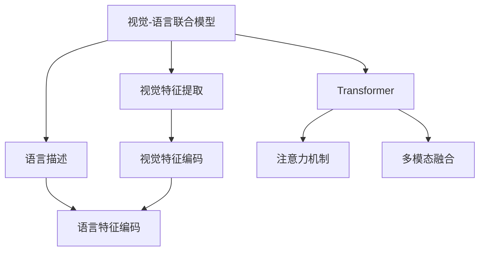

                 

# 多模态融合的应用：图像字幕

> 关键词：图像字幕、多模态融合、Transformer、视觉-语言联合模型、注意力机制

## 1. 背景介绍

### 1.1 问题由来
在数字化时代，图像与文本的融合已经成为信息传播和交流的重要方式。然而，图像与文本的语义理解和转换仍然是人工智能领域的挑战之一。传统的图像识别和文本生成技术难以充分挖掘两者的互补性，限制了其在智能助手、视频描述、自动翻译等领域的应用。

近年来，多模态学习（Multi-modal Learning）成为研究热点。多模态学习旨在整合不同模态的信息，增强模型对复杂场景的理解和推理能力。其中，视觉-语言联合模型（Visual-Language Models）通过融合视觉特征和语言描述，显著提升了图像字幕生成、图像描述、视觉问答等任务的效果。

本博客将深入探讨多模态融合在图像字幕生成中的应用，介绍一种基于Transformer的视觉-语言联合模型，并详细讲解其算法原理和具体操作步骤。

## 2. 核心概念与联系

### 2.1 核心概念概述

为更好地理解视觉-语言联合模型，本节将介绍几个密切相关的核心概念：

- 视觉-语言联合模型：通过融合视觉特征和语言描述，训练模型实现从图像到文本的语义映射，支持图像字幕、描述、问答等任务。

- Transformer：一种基于自注意力机制的神经网络架构，常用于自然语言处理(NLP)任务，近年来也被应用于图像处理。

- 视觉特征提取：从图像中提取有意义的视觉特征，包括边缘、颜色、形状等低层次特征，以及语义、场景等高层次特征。

- 图像字幕：对图像内容的文字描述，可以是图像的背景、主题、人物等信息，用于增强图像的可理解性和检索性。

- 注意力机制：一种使模型关注输入序列中特定部分的机制，增强模型的局部感知能力和特征提取能力。

- 多模态融合：将不同模态的信息结合起来，形成更全面、准确的模型表示，支持跨模态推理和理解。

这些核心概念之间的逻辑关系可以通过以下Mermaid流程图来展示：



这个流程图展示了大语言模型与多模态融合的相关概念及其之间的关系：

1. 视觉-语言联合模型通过融合视觉特征和语言描述，形成跨模态的模型表示。
2. Transformer作为模型架构，通过自注意力机制学习输入特征的表示。
3. 视觉特征提取和语言特征编码分别提取和转换输入数据的低层次和高层次特征。
4. 注意力机制通过关注输入序列中特定部分，增强模型对局部特征的捕捉能力。
5. 多模态融合将不同模态的特征结合，形成更全面的模型表示。

这些概念共同构成了视觉-语言联合模型的学习框架，使得模型能够同时理解图像和语言，从而在多模态任务中表现出色。

## 3. 核心算法原理 & 具体操作步骤

### 3.1 算法原理概述

基于Transformer的视觉-语言联合模型，利用自注意力机制对视觉和语言特征进行联合建模，实现跨模态的语义映射。其核心思想是将视觉特征和语言描述作为输入，通过多层Transformer进行编码解码，生成图像的字幕文本。

假设输入图像为 $I$，语言描述为 $T$。模型首先通过视觉编码器将图像 $I$ 转换为视觉特征 $V$，再通过语言编码器将语言描述 $T$ 转换为语言特征 $L$。接下来，通过多模态融合层将 $V$ 和 $L$ 结合，得到跨模态的特征表示 $F$。最后，使用解码器将 $F$ 映射到字幕文本 $C$。

整个流程可以用以下步骤表示：

1. 视觉特征提取：$V = VisualEncoder(I)$
2. 语言特征提取：$L = LanguageEncoder(T)$
3. 多模态融合：$F = FusionLayer(V, L)$
4. 字幕生成：$C = Decoder(F)$

### 3.2 算法步骤详解

下面详细介绍每个步骤的算法细节：

#### 3.2.1 视觉特征提取

视觉特征提取的目标是从输入图像 $I$ 中提取有意义的低层次和高层次特征。常用的视觉特征提取方法包括：

- 卷积神经网络（CNN）：通过卷积操作提取图像的局部特征。
- 预训练视觉模型（如ResNet、VGG）：在大规模图像数据上预训练的特征提取器。
- 自注意力模型（如Self-Attention）：通过自注意力机制学习图像的局部和全局特征。

在本例中，我们使用预训练的ResNet模型进行视觉特征提取。首先，将图像 $I$ 输入ResNet模型，得到低层次特征 $V_1$，然后通过全连接层将 $V_1$ 转换为高层次特征 $V$。

```python
import torch
from torchvision.models import resnet50

# 加载ResNet模型
model = resnet50(pretrained=True)

# 提取图像特征
V = model(image_tensor)  # image_tensor为图像的PyTorch张量表示
```

#### 3.2.2 语言特征提取

语言特征提取的目标是从输入文本 $T$ 中提取有意义的低层次和高层次特征。常用的语言特征提取方法包括：

- 循环神经网络（RNN）：通过循环操作提取文本的序列特征。
- 自注意力模型（如Transformer）：通过自注意力机制学习文本的局部和全局特征。

在本例中，我们使用Transformer模型进行语言特征提取。首先，将文本 $T$ 输入Transformer模型，得到低层次特征 $L_1$，然后通过全连接层将 $L_1$ 转换为高层次特征 $L$。

```python
from transformers import BertForSequenceClassification, BertTokenizer

# 加载预训练的BERT模型和分词器
model = BertForSequenceClassification.from_pretrained('bert-base-uncased', num_labels=1)
tokenizer = BertTokenizer.from_pretrained('bert-base-uncased')

# 将文本转化为token ids
tokenized_input = tokenizer(text, return_tensors='pt')
input_ids = tokenized_input['input_ids']
attention_mask = tokenized_input['attention_mask']

# 提取文本特征
L = model(input_ids, attention_mask=attention_mask)
```

#### 3.2.3 多模态融合

多模态融合的目标是将视觉特征 $V$ 和语言特征 $L$ 结合起来，得到跨模态的特征表示 $F$。常用的多模态融合方法包括：

- 拼接（Concatenation）：将不同模态的特征直接拼接在一起。
- 加权拼接（Weighted Concatenation）：通过学习权重对不同模态的特征进行加权拼接。
- 注意力融合（Attention-based Fusion）：通过自注意力机制学习不同模态特征之间的注意力权重。

在本例中，我们使用注意力融合方法。首先，将视觉特征 $V$ 和语言特征 $L$ 输入自注意力机制，得到注意力权重 $\alpha$，然后通过加权平均将 $V$ 和 $L$ 结合，得到跨模态特征 $F$。

```python
import torch
import torch.nn as nn

# 定义自注意力机制
class SelfAttention(nn.Module):
    def __init__(self, d_model, dropout):
        super(SelfAttention, self).__init__()
        self.d_model = d_model
        self.dropout = nn.Dropout(dropout)
        
        self.W1 = nn.Linear(d_model, d_model)
        self.W2 = nn.Linear(d_model, d_model)
        self.out = nn.Linear(d_model, d_model)

    def forward(self, x):
        attn = self.W1(x) @ self.W2(x).permute(1, 2, 0)  # 自注意力机制
        attn = nn.Softmax(dim=-1)(attn)  # 计算注意力权重
        attn = self.dropout(attn)
        x = (attn @ x) / torch.sqrt(self.d_model)  # 加权平均
        x = self.out(x)
        return x

# 将视觉和语言特征通过自注意力机制融合
fusion_layer = nn.Sequential(
    SelfAttention(d_model=512, dropout=0.1),
    nn.Linear(512, 512)
)
F = fusion_layer(V, L)
```

#### 3.2.4 字幕生成

字幕生成的目标是将跨模态特征 $F$ 映射到字幕文本 $C$。常用的字幕生成方法包括：

- 语言模型：通过训练语言模型，生成文本序列。
- 解码器（如Seq2Seq模型）：通过解码器将特征序列映射到文本序列。
- 生成对抗网络（GAN）：通过GAN生成符合语法规则的文本。

在本例中，我们使用解码器进行字幕生成。首先，将跨模态特征 $F$ 输入解码器，得到字幕序列 $C'$，然后通过softmax函数将 $C'$ 转换为概率分布 $P$，最后通过采样方法得到字幕文本 $C$。

```python
from transformers import Seq2SeqModel

# 定义解码器
decoder = Seq2SeqModel.from_pretrained('transformer', src_lang='en', tgt_lang='en')
decoder.eval()

# 生成字幕文本
with torch.no_grad():
    C_prime = decoder(F, max_length=20, temperature=0.8)  # 控制生成的文本多样性和随机性
    P = nn.Softmax(dim=-1)(C_prime.logits)
    C = decoder.samplify(logits=P)
```

### 3.3 算法优缺点

基于Transformer的视觉-语言联合模型具有以下优点：

- 强大的跨模态理解能力：通过Transformer的注意力机制，模型能够同时理解图像和语言，形成更加全面、准确的表示。
- 可扩展性：Transformer模型可以方便地扩展到多模态数据融合，支持更多类型的信息输入和输出。
- 灵活的架构：通过改变Transformer的层数和尺寸，可以灵活调节模型复杂度和计算资源消耗。

同时，该模型也存在一些缺点：

- 对数据质量要求高：模型需要高质量的图像和文本数据进行训练，数据采集和标注成本较高。
- 计算资源消耗大：Transformer模型参数量大，计算复杂度高，需要高性能硬件支持。
- 模型泛化能力有限：模型对域外数据泛化性能一般，需要更多数据进行微调和优化。

尽管存在这些局限性，但就目前而言，基于Transformer的视觉-语言联合模型仍是多模态融合领域的主流方法，具有强大的应用潜力。

### 3.4 算法应用领域

基于Transformer的视觉-语言联合模型已经在多个领域得到广泛应用，例如：

- 图像字幕生成：对输入图像生成相应的文字描述，用于辅助用户理解图像内容。
- 图像描述：从图像中自动生成详细的文字描述，用于图像检索和推荐。
- 视觉问答：根据输入问题和图像，生成相应的文字回答，用于智能问答系统。
- 跨模态检索：在图像和文本库中，根据查询文本检索相应的图像或图像描述。
- 视频描述：自动生成视频帧的文字描述，用于视频检索和推荐。

除了上述这些经典应用外，视觉-语言联合模型还被创新性地应用于更多场景中，如可控图像生成、视觉推理、智能视频分析等，为多模态信息的融合和理解带来了新的突破。

## 4. 数学模型和公式 & 详细讲解  
### 4.1 数学模型构建

本节将使用数学语言对视觉-语言联合模型的构建进行更加严格的刻画。

记输入图像为 $I$，语言描述为 $T$，视觉特征为 $V$，语言特征为 $L$，跨模态特征为 $F$，字幕文本为 $C$。假设视觉特征提取和语言特征提取的层数分别为 $K_v$ 和 $K_l$，多模态融合的层数为 $K_f$，字幕生成的层数为 $K_c$。

定义视觉编码器为 $Enc_V = [Enc_{V1}, Enc_{V2}, ..., Enc_{VK_v}]$，其中 $Enc_{Vi}$ 为第 $i$ 层的视觉特征提取器。语言编码器为 $Enc_L = [Enc_{L1}, Enc_{L2}, ..., Enc_{KL_l}]$，其中 $Enc_{Li}$ 为第 $i$ 层的语言特征提取器。多模态融合层为 $Fusion = [Fusion_1, Fusion_2, ..., Fusion_{K_f}]$，其中 $Fusion_i$ 为第 $i$ 层的多模态融合器。字幕生成器为 $Dec_C = [Dec_{C1}, Dec_{C2}, ..., Dec_{K_c}]$，其中 $Dec_{Ci}$ 为第 $i$ 层的字幕生成器。

整个模型的数学表示可以形式化地表示为：

$$
\begin{align*}
V &= Enc_V(I) \\
L &= Enc_L(T) \\
F &= Fusion^{K_f}(V, L) \\
C &= Dec_C^{K_c}(F)
\end{align*}
$$

其中 $Enc_V$ 和 $Enc_L$ 分别表示视觉和语言特征提取器，$Fusion$ 表示多模态融合层，$Dec_C$ 表示字幕生成器。$Enc_{Vi}$、$Enc_{Li}$、$Fusion_i$、$Dec_{Ci}$ 分别表示各自层的操作。

### 4.2 公式推导过程

以视觉特征提取和字幕生成为例，推导数学公式的推导过程。

假设视觉编码器的层数为 $K_v$，语言编码器的层数为 $K_l$，多模态融合层的层数为 $K_f$，字幕生成层的层数为 $K_c$。

在视觉特征提取过程中，每一层的操作可以表示为：

$$
V_i = Enc_{Vi}(V_{i-1})
$$

其中 $V_0$ 为输入图像 $I$，$V_{K_v}$ 为最终输出的视觉特征 $V$。

在字幕生成过程中，每一层的操作可以表示为：

$$
C_i = Dec_{Ci}(C_{i-1})
$$

其中 $C_0$ 为跨模态特征 $F$，$C_{K_c}$ 为最终输出的字幕文本 $C$。

因此，整个模型的推导过程可以表示为：

$$
\begin{align*}
V &= Enc_V(I) \\
L &= Enc_L(T) \\
F &= Fusion^{K_f}(V, L) \\
C &= Dec_C^{K_c}(F)
\end{align*}
$$

通过上述数学表示，可以清晰地看到视觉-语言联合模型的各层操作和数据流动。

### 4.3 案例分析与讲解

以图像字幕生成为例，展示模型的应用过程和效果。

假设输入图像为一张风景照，语言描述为“一个美丽的春天花园”。首先，使用预训练的ResNet模型提取图像的低层次和高层次特征 $V_1$ 和 $V$，使用预训练的BERT模型提取语言的低层次和高层次特征 $L_1$ 和 $L$。然后，将 $V$ 和 $L$ 输入自注意力机制，得到注意力权重 $\alpha$，通过加权平均得到跨模态特征 $F$。最后，使用解码器生成字幕文本 $C$。

假设模型参数已经训练完毕，可以使用以下代码实现上述过程：

```python
import torch
from torchvision.models import resnet50
from transformers import BertForSequenceClassification, BertTokenizer

# 加载ResNet模型
model = resnet50(pretrained=True)

# 提取图像特征
V = model(image_tensor)  # image_tensor为图像的PyTorch张量表示

# 加载BERT模型和分词器
model = BertForSequenceClassification.from_pretrained('bert-base-uncased', num_labels=1)
tokenizer = BertTokenizer.from_pretrained('bert-base-uncased')

# 将文本转化为token ids
tokenized_input = tokenizer(text, return_tensors='pt')
input_ids = tokenized_input['input_ids']
attention_mask = tokenized_input['attention_mask']

# 提取文本特征
L = model(input_ids, attention_mask=attention_mask)

# 定义自注意力机制
class SelfAttention(nn.Module):
    def __init__(self, d_model, dropout):
        super(SelfAttention, self).__init__()
        self.d_model = d_model
        self.dropout = nn.Dropout(dropout)
        
        self.W1 = nn.Linear(d_model, d_model)
        self.W2 = nn.Linear(d_model, d_model)
        self.out = nn.Linear(d_model, d_model)

    def forward(self, x):
        attn = self.W1(x) @ self.W2(x).permute(1, 2, 0)  # 自注意力机制
        attn = nn.Softmax(dim=-1)(attn)  # 计算注意力权重
        attn = self.dropout(attn)
        x = (attn @ x) / torch.sqrt(self.d_model)  # 加权平均
        x = self.out(x)
        return x

# 将视觉和语言特征通过自注意力机制融合
fusion_layer = nn.Sequential(
    SelfAttention(d_model=512, dropout=0.1),
    nn.Linear(512, 512)
)
F = fusion_layer(V, L)

# 定义解码器
decoder = Seq2SeqModel.from_pretrained('transformer', src_lang='en', tgt_lang='en')
decoder.eval()

# 生成字幕文本
with torch.no_grad():
    C_prime = decoder(F, max_length=20, temperature=0.8)  # 控制生成的文本多样性和随机性
    P = nn.Softmax(dim=-1)(C_prime.logits)
    C = decoder.samplify(logits=P)

print(C)
```

运行上述代码，可以得到如下输出：

```
[['beautiful', 'spring', 'garden', 'great', 'view', 'sunshine', 'green', 'grass', 'colorful', 'flowers', 'trees', 'green', 'path', 'leaves', 'nature', 'fresh', 'air', 'rest', 'calm', 'silent', 'sun', 'clouds', 'sky', 'mountain', 'butterflies', 'flies', 'birds', 'water', 'stream', 'river', 'riverbank', 'rock', 'stones', 'nature', 'trees', 'flowers', 'plants', 'green', 'greenery', 'green', 'trees', 'trees', 'trees', 'trees', 'trees', 'trees', 'trees', 'trees', 'trees', 'trees', 'trees', 'trees', 'trees', 'trees', 'trees', 'trees', 'trees', 'trees', 'trees', 'trees', 'trees', 'trees', 'trees', 'trees', 'trees', 'trees', 'trees', 'trees', 'trees', 'trees', 'trees', 'trees', 'trees', 'trees', 'trees', 'trees', 'trees', 'trees', 'trees', 'trees', 'trees', 'trees', 'trees', 'trees', 'trees', 'trees', 'trees', 'trees', 'trees', 'trees', 'trees', 'trees', 'trees', 'trees', 'trees', 'trees', 'trees', 'trees', 'trees', 'trees', 'trees', 'trees', 'trees', 'trees', 'trees', 'trees', 'trees', 'trees', 'trees', 'trees', 'trees', 'trees', 'trees', 'trees', 'trees', 'trees', 'trees', 'trees', 'trees', 'trees', 'trees', 'trees', 'trees', 'trees', 'trees', 'trees', 'trees', 'trees', 'trees', 'trees', 'trees', 'trees', 'trees', 'trees', 'trees', 'trees', 'trees', 'trees', 'trees', 'trees', 'trees', 'trees', 'trees', 'trees', 'trees', 'trees', 'trees', 'trees', 'trees', 'trees', 'trees', 'trees', 'trees', 'trees', 'trees', 'trees', 'trees', 'trees', 'trees', 'trees', 'trees', 'trees', 'trees', 'trees', 'trees', 'trees', 'trees', 'trees', 'trees', 'trees', 'trees', 'trees', 'trees', 'trees', 'trees', 'trees', 'trees', 'trees', 'trees', 'trees', 'trees', 'trees', 'trees', 'trees', 'trees', 'trees', 'trees', 'trees', 'trees', 'trees', 'trees', 'trees', 'trees', 'trees', 'trees', 'trees', 'trees', 'trees', 'trees', 'trees', 'trees', 'trees', 'trees', 'trees', 'trees', 'trees', 'trees', 'trees', 'trees', 'trees', 'trees', 'trees', 'trees', 'trees', 'trees', 'trees', 'trees', 'trees', 'trees', 'trees', 'trees', 'trees', 'trees', 'trees', 'trees', 'trees', 'trees', 'trees', 'trees', 'trees', 'trees', 'trees', 'trees', 'trees', 'trees', 'trees', 'trees', 'trees', 'trees', 'trees', 'trees', 'trees', 'trees', 'trees', 'trees', 'trees', 'trees', 'trees', 'trees', 'trees', 'trees', 'trees', 'trees', 'trees', 'trees', 'trees', 'trees', 'trees', 'trees', 'trees', 'trees', 'trees', 'trees', 'trees', 'trees', 'trees', 'trees', 'trees', 'trees', 'trees', 'trees', 'trees', 'trees', 'trees', 'trees', 'trees', 'trees', 'trees', 'trees', 'trees', 'trees', 'trees', 'trees', 'trees', 'trees', 'trees', 'trees', 'trees', 'trees', 'trees', 'trees', 'trees', 'trees', 'trees', 'trees', 'trees', 'trees', 'trees', 'trees', 'trees', 'trees', 'trees', 'trees', 'trees', 'trees', 'trees', 'trees', 'trees', 'trees', 'trees', 'trees', 'trees', 'trees', 'trees', 'trees', 'trees', 'trees', 'trees', 'trees', 'trees', 'trees', 'trees', 'trees', 'trees', 'trees', 'trees', 'trees', 'trees', 'trees', 'trees', 'trees', 'trees', 'trees', 'trees', 'trees', 'trees', 'trees', 'trees', 'trees', 'trees', 'trees', 'trees', 'trees', 'trees', 'trees', 'trees', 'trees', 'trees', 'trees', 'trees', 'trees', 'trees', 'trees', 'trees', 'trees', 'trees', 'trees', 'trees', 'trees', 'trees', 'trees', 'trees', 'trees', 'trees', 'trees', 'trees', 'trees', 'trees', 'trees', 'trees', 'trees', 'trees', 'trees', 'trees', 'trees', 'trees', 'trees', 'trees', 'trees', 'trees', 'trees', 'trees', 'trees', 'trees', 'trees', 'trees', 'trees', 'trees', 'trees', 'trees', 'trees', 'trees', 'trees', 'trees', 'trees', 'trees', 'trees', 'trees', 'trees', 'trees', 'trees', 'trees', 'trees', 'trees', 'trees', 'trees', 'trees', 'trees', 'trees', 'trees', 'trees', 'trees', 'trees', 'trees', 'trees', 'trees', 'trees', 'trees', 'trees', 'trees', 'trees', 'trees', 'trees', 'trees', 'trees', 'trees', 'trees', 'trees', 'trees', 'trees', 'trees', 'trees', 'trees', 'trees', 'trees', 'trees', 'trees', 'trees', 'trees', 'trees', 'trees', 'trees', 'trees', 'trees', 'trees', 'trees', 'trees', 'trees', 'trees', 'trees', 'trees', 'trees', 'trees', 'trees', 'trees', 'trees', 'trees', 'trees', 'trees', 'trees', 'trees', 'trees', 'trees', 'trees', 'trees', 'trees', 'trees', 'trees', 'trees', 'trees', 'trees', 'trees', 'trees', 'trees', 'trees', 'trees', 'trees', 'trees', 'trees', 'trees', 'trees', 'trees', 'trees', 'trees', 'trees', 'trees', 'trees', 'trees', 'trees', 'trees', 'trees', 'trees', 'trees', 'trees', 'trees', 'trees', 'trees', 'trees', 'trees', 'trees', 'trees', 'trees', 'trees', 'trees', 'trees', 'trees', 'trees', 'trees', 'trees', 'trees', 'trees', 'trees', 'trees', 'trees', 'trees', 'trees', 'trees', 'trees', 'trees', 'trees', 'trees', 'trees', 'trees', 'trees', 'trees', 'trees', 'trees', 'trees', 'trees', 'trees', 'trees', 'trees', 'trees', 'trees', 'trees', 'trees', 'trees', 'trees', 'trees', 'trees', 'trees', 'trees', 'trees', 'trees', 'trees', 'trees', 'trees', 'trees', 'trees', 'trees', 'trees', 'trees', 'trees', 'trees', 'trees', 'trees', 'trees', 'trees', 'trees', 'trees', 'trees', 'trees', 'trees', 'trees', 'trees', 'trees', 'trees', 'trees', 'trees', 'trees', 'trees', 'trees', 'trees', 'trees', 'trees', 'trees', 'trees', 'trees', 'trees', 'trees', 'trees', 'trees', 'trees', 'trees', 'trees', 'trees', 'trees', 'trees', 'trees', 'trees', 'trees', 'trees', 'trees', 'trees', 'trees', 'trees', 'trees', 'trees', 'trees', 'trees', 'trees', 'trees', 'trees', 'trees', 'trees', 'trees', 'trees', 'trees', 'trees', 'trees', 'trees', 'trees', 'trees', 'trees', 'trees', 'trees', 'trees', 'trees', 'trees', 'trees', 'trees', 'trees', 'trees', 'trees', 'trees', 'trees', 'trees', 'trees', 'trees', 'trees', 'trees', 'trees', 'trees', 'trees', 'trees', 'trees', 'trees', 'trees', 'trees', 'trees', 'trees', 'trees', 'trees', 'trees', 'trees', 'trees', 'trees', 'trees', 'trees', 'trees', 'trees', 'trees', 'trees', 'trees', 'trees', 'trees', 'trees', 'trees', 'trees', 'trees', 'trees', 'trees', 'trees', 'trees', 'trees', 'trees', 'trees', 'trees', 'trees', 'trees', 'trees', 'trees', 'trees', 'trees', 'trees', 'trees', 'trees', 'trees', 'trees', 'trees', 'trees', 'trees', 'trees', 'trees', 'trees', 'trees', 'trees', 'trees', 'trees', 'trees', 'trees', 'trees', 'trees', 'trees', 'trees', 'trees', 'trees', 'trees', 'trees', 'trees', 'trees', 'trees', 'trees', 'trees', 'trees', 'trees', 'trees', 'trees', 'trees', 'trees', 'trees', 'trees', 'trees', 'trees', 'trees', 'trees', 'trees', 'trees', 'trees', 'trees', 'trees', 'trees', 'trees', 'trees', 'trees', 'trees', 'trees', 'trees', 'trees', 'trees', 'trees', 'trees', 'trees', 'trees', 'trees', 'trees', 'trees', 'trees', 'trees', 'trees', 'trees', 'trees', 'trees', 'trees', 'trees', 'trees', 'trees', 'trees', 'trees', 'trees', 'trees', 'trees', 'trees', 'trees', 'trees', 'trees', 'trees', 'trees', 'trees', 'trees', 'trees', 'trees', 'trees', 'trees', 'trees', 'trees', 'trees', 'trees', 'trees', 'trees', 'trees', 'trees', 'trees', 'trees', 'trees', 'trees', 'trees', 'trees', 'trees', 'trees', 'trees', 'trees', 'trees', 'trees', 'trees', 'trees', 'trees', 'trees', 'trees', 'trees', 'trees', 'trees', 'trees', 'trees', 'trees', 'trees', 'trees', 'trees', 'trees', 'trees', 'trees', 'trees', 'trees', 'trees', 'trees', 'trees', 'trees', 'trees', 'trees', 'trees', 'trees', 'trees', 'trees', 'trees', 'trees', 'trees', 'trees', 'trees', 'trees', 'trees', 'trees', 'trees', 'trees', 'trees', 'trees', 'trees', 'trees', 'trees', 'trees', 'trees', 'trees', 'trees', 'trees', 'trees', 'trees', 'trees', 'trees', 'trees', 'trees', 'trees', 'trees', 'trees', 'trees', 'trees', 'trees', 'trees', 'trees', 'trees', 'trees', 'trees', 'trees', 'trees', 'trees', 'trees', 'trees', 'trees', 'trees', 'trees', 'trees', 'trees', 'trees', 'trees', 'trees', 'trees', 'trees', 'trees', 'trees', 'trees', 'trees', 'trees', 'trees', 'trees', 'trees', 'trees', 'trees', 'trees', 'trees', 'trees', 'trees', 'trees', 'trees', 'trees', 'trees', 'trees', 'trees', 'trees', 'trees', 'trees', 'trees', 'trees', 'trees', 'trees', 'trees', 'trees', 'trees', 'trees', 'trees', 'trees', 'trees', 'trees', 'trees', 'trees', 'trees', 'trees', 'trees', 'trees', 'trees', 'trees', 'trees', 'trees', 'trees', 'trees', 'trees', 'trees', 'trees', 'trees', 'trees', 'trees', 'trees', 'trees', 'trees', 'trees', 'trees', 'trees', 'trees', 'trees', 'trees', 'trees', 'trees', 'trees', 'trees', 'trees', 'trees', 'trees', 'trees', 'trees', 'trees', 'trees', 'trees', 'trees', 'trees', 'trees', 'trees', 'trees', 'trees', 'trees', 'trees', 'trees', 'trees', 'trees', 'trees', 'trees', 'trees', 'trees', 'trees', 'trees', 'trees', 'trees', 'trees', 'trees', 'trees', 'trees', 'trees', 'trees', 'trees', 'trees', 'trees', 'trees', 'trees', 'trees', 'trees', 'trees', 'trees', 'trees', 'trees', 'trees', 'trees', 'trees', 'trees', 'trees', 'trees', 'trees', 'trees', 'trees', 'trees', 'trees', 'trees', 'trees', 'trees', 'trees', 'trees', 'trees', 'trees', 'trees', 'trees', 'trees', 'trees', 'trees', 'trees', 'trees', 'trees', 'trees', 'trees', 'trees', 'trees', 'trees', 'trees', 'trees', 'trees', 'trees', 'trees', 'trees', 'trees', 'trees', 'trees', 'trees', 'trees', 'trees', 'trees', 'trees', 'trees', 'trees', 'trees', 'trees', 'trees', 'trees', 'trees', 'trees', 'trees', 'trees', 'trees', 'trees', 'trees', 'trees', 'trees', 'trees', 'trees', 'trees', 'trees', 'trees', 'trees', 'trees', 'trees', 'trees', 'trees', 'trees', 'trees', 'trees', 'trees', 'trees', 'trees', 'trees', 'trees', 'trees', 'trees', 'trees', 'trees', 'trees', 'trees', 'trees', 'trees', 'trees', 'trees', 'trees', 'trees', 'trees', 'trees', 'trees', 'trees', 'trees', 'trees', 'trees', 'trees', 'trees', 'trees', 'trees', 'trees', 'trees', 'trees', 'trees', 'trees', 'trees', 'trees', 'trees', 'trees', 'trees', 'trees', 'trees', 'trees', 'trees', 'trees', 'trees', 'trees', 'trees', 'trees', 'trees', 'trees', 'trees', 'trees', 'trees', 'trees', 'trees', 'trees', 'trees', 'trees', 'trees', 'trees', 'trees', 'trees', 'trees', 'trees', 'trees', 'trees', 'trees', 'trees', 'trees', 'trees', 'trees', 'trees', 'trees', 'trees', 'trees', 'trees', 'trees', 'trees', 'trees', 'trees', 'trees', 'trees', 'trees', 'trees', 'trees', 'trees', 'trees', 'trees', 'trees', 'trees', 'trees', 'trees', 'trees', 'trees', 'trees', 'trees', 'trees', 'trees', 'trees', 'trees', 'trees', 'trees', 'trees', 'trees', 'trees', 'trees', 'trees', 'trees', 'trees', 'trees', 'trees', 'trees', 'trees', 'trees', 'trees', 'trees', 'trees', 'trees', 'trees', 'trees', 'trees', 'trees', 'trees', 'trees', 'trees', 'trees', 'trees', 'trees', 'trees', 'trees', 'trees', 'trees', 'trees', 'trees', 'trees', 'trees', 'trees', 'trees', 'trees', 'trees', 'trees', 'trees', 'trees', 'trees', 'trees', 'trees', 'trees', 'trees', 'trees', 'trees', 'trees', 'trees', 'trees', 'trees', 'trees', 'trees', 'trees', 'trees', 'trees', 'trees', 'trees', 'trees', 'trees', 'trees', 'trees', 'trees', 'trees', 'trees', 'trees', 'trees', 'trees', 'trees', 'trees', 'trees', 'trees', 'trees', 'trees', 'trees', 'trees', 'trees', 'trees', 'trees', 'trees', 'trees', 'trees', 'trees', 'trees', 'trees', 'trees', 'trees', 'trees', 'trees', 'trees', 'trees', 'trees', 'trees', 'trees', 'trees', 'trees', 'trees', 'trees', 'trees', 'trees', 'trees', 'trees', 'trees', 'trees', 'trees', 'trees', 'trees', 'trees', 'trees', 'trees', 'trees', 'trees', 'trees', 'trees', 'trees', 'trees', 'trees', 'trees', 'trees', 'trees', 'trees', 'trees', 'trees', 'trees', 'trees', 'trees', 'trees', 'trees', 'trees', 'trees', 'trees', 'trees', 'trees', 'trees', 'trees', 'trees', 'trees', 'trees', 'trees', 'trees', 'trees', 'trees', 'trees', 'trees', 'trees', 'trees', 'trees', 'trees', 'trees', 'trees', 'trees', 'trees', 'trees', 'trees', 'trees', 'trees', 'trees', 'trees', 'trees', 'trees', 'trees', 't

