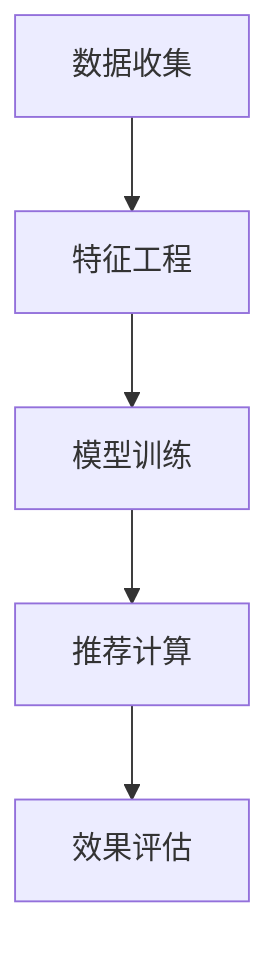

                 

## 1. 背景介绍

### 1.1 问题由来

随着电子商务的迅猛发展，电商平台聚集了大量的用户数据和商品信息。传统的基于规则和统计特征的推荐算法已无法满足用户的个性化需求，用户需要快速获取符合自己兴趣和行为特征的商品。

近年人工智能技术的快速发展，尤其是深度学习在推荐系统中的成功应用，显著提升了电商平台的推荐效果。以基于深度学习的大规模协同过滤和商品推荐模型为例，基于用户历史行为和商品特征进行协同训练，通过模型优化和迭代，能够实时动态调整推荐策略。

但随着商品数量和用户行为数据量的急剧膨胀，现有的深度学习模型出现了训练时间长、计算复杂度高、模型难以稳定收敛等诸多问题。此外，推荐模型的泛化能力受到数据分布的限制，随着用户行为模式的变化，推荐效果易出现波动。

为了进一步提升推荐效果和系统性能，AI模型融合技术在电商推荐系统中得到了广泛应用。通过融合多种推荐算法和模型，实现优势互补，使得推荐结果更加全面和精准，也极大提升了系统的鲁棒性和可扩展性。

### 1.2 问题核心关键点

AI模型融合技术主要包括：
1. 异构推荐算法的融合：基于协同过滤、内容推荐、标签推荐等多种推荐算法，进行协同优化和融合，提升推荐效果。
2. 异构模型的融合：使用神经网络、决策树、规则等多种模型，进行多模型融合，提高推荐效果和系统性能。
3. 在线和离线融合：将离线模型训练和在线推荐系统进行融合，平衡模型学习速度和实时推荐速度，提高推荐系统的覆盖率。
4. 模型融合的权衡：在模型融合中权衡离线学习与实时推荐的权衡，同时考虑模型复杂度、实时性、准确性等指标。

## 2. 核心概念与联系

### 2.1 核心概念概述

电商推荐系统的核心在于将商品推荐给用户，核心目标是通过对用户行为数据和商品特征数据的分析，预测用户可能感兴趣的商品，并进行推荐。推荐系统的工作原理和流程可以概括为以下几个关键步骤：

1. **数据收集**：收集用户行为数据和商品特征数据。
2. **特征工程**：提取和构建商品的特征向量，包括标签、属性、评分等。
3. **模型训练**：使用深度学习模型，如神经网络、协同过滤等，对用户和商品特征进行训练。
4. **推荐计算**：利用训练好的模型，实时计算用户对商品的兴趣，并进行推荐。
5. **效果评估**：通过评估指标，如召回率、点击率等，衡量推荐效果。

### 2.2 核心概念原理和架构的 Mermaid 流程图



数据收集阶段：电商系统通过网站访问记录、购买记录、评分记录等，收集用户行为数据。同时，对商品进行多维度特征提取，如价格、属性、销量等，得到商品特征向量。

特征工程阶段：将用户行为数据和商品特征向量进行处理和转换，提取有意义的特征，如用户兴趣标签、商品类别等，形成可供模型训练的数据集。

模型训练阶段：利用深度学习模型进行用户行为特征的提取和商品特征的表示，构建推荐模型，并进行训练。

推荐计算阶段：使用训练好的推荐模型，计算用户对商品感兴趣的概率，并进行推荐。

效果评估阶段：通过评估指标衡量推荐效果，对推荐模型进行调整和优化。

### 2.3 核心概念联系

各个核心概念之间联系紧密，共同构成电商推荐系统的核心框架。具体而言：

1. **数据收集和特征工程**：是模型训练和推荐计算的基础，特征的质量直接影响模型的训练效果和推荐结果。
2. **模型训练**：是推荐系统的核心，通过模型学习用户行为和商品特征之间的关系，进行推荐。
3. **推荐计算**：根据模型计算推荐结果，是电商推荐系统的核心功能。
4. **效果评估**：衡量推荐效果，指导推荐策略的优化和调整。

## 3. 核心算法原理 & 具体操作步骤

### 3.1 算法原理概述

AI模型融合技术的核心思想是：将多种推荐算法和模型进行融合，充分利用不同算法和模型之间的互补性，提升推荐效果和系统性能。

在电商推荐系统中，常见的融合算法包括：
1. 协同过滤推荐算法：通过用户行为和商品之间的关系，进行相似度计算，推荐用户可能感兴趣的商品。
2. 基于内容的推荐算法：通过商品属性和用户兴趣之间的匹配，推荐用户可能喜欢的商品。
3. 混合推荐算法：将协同过滤和基于内容的推荐算法进行融合，进行更精准的推荐。
4. 标签推荐算法：通过商品标签进行推荐，利用用户对商品标签的反馈，进行推荐优化。
5. 交叉推荐算法：通过用户对商品的点击和评分等反馈，进行交叉推荐，提升推荐效果。

在融合算法的基础上，常见的融合模型包括：
1. 深度学习模型：如卷积神经网络、循环神经网络、注意力机制等，用于对用户行为和商品特征进行建模。
2. 树形模型：如决策树、随机森林等，用于规则推理和特征选择。
3. 集成模型：如Adaboost、Bagging、Boosting等，用于模型融合和参数优化。

### 3.2 算法步骤详解

AI模型融合推荐系统的主要步骤如下：

1. **数据预处理**：对原始数据进行清洗、归一化等处理，提取和构建商品特征向量。
2. **特征选择和处理**：对提取的特征进行选择和处理，构建可供融合的特征集。
3. **融合算法设计**：根据融合目标，选择合适的融合算法和模型。
4. **模型训练**：将多种推荐算法和模型进行融合训练，得到融合后的推荐模型。
5. **推荐计算**：使用融合后的模型进行推荐计算，生成推荐结果。
6. **效果评估**：通过评估指标，如召回率、点击率等，衡量推荐效果，并进行优化。

### 3.3 算法优缺点

AI模型融合技术的优点包括：
1. 提升推荐效果：多种推荐算法和模型之间的互补性，提升了推荐的全面性和准确性。
2. 提高系统性能：多种模型并行计算，提高了系统的处理能力和实时性。
3. 增强鲁棒性：融合多种模型，增强了系统的鲁棒性和稳定性。

缺点包括：
1. 模型复杂度高：多种算法和模型进行融合，模型复杂度较高，训练和推理速度较慢。
2. 参数量大：多种模型并行计算，需要大量的训练参数和存储空间。
3. 实时性较差：复杂的融合过程增加了推荐计算的延迟。

### 3.4 算法应用领域

AI模型融合技术在电商推荐系统中得到了广泛应用，具体应用场景包括：
1. 个性化推荐：针对不同用户进行个性化推荐，提高用户满意度。
2. 商品组合推荐：推荐多种商品组合，提升用户购买率。
3. 实时推荐：根据用户实时行为进行推荐，提升推荐效果。
4. 新商品推荐：推荐新上架商品，增加平台商品的曝光率。
5. 用户画像建模：通过用户行为数据，构建用户画像，实现精准推荐。

## 4. 数学模型和公式 & 详细讲解

### 4.1 数学模型构建

在电商推荐系统中，常见的融合算法包括基于协同过滤的推荐、基于内容的推荐、混合推荐、标签推荐和交叉推荐等。这里我们以基于协同过滤和基于内容的推荐为例，进行数学模型的构建和推导。

**协同过滤推荐**：
设用户集合为 $U$，商品集合为 $I$，用户对商品的评分矩阵为 $R \in \mathbb{R}^{N \times M}$，其中 $N$ 为用户数量，$M$ 为商品数量。协同过滤推荐算法基于用户对商品评分矩阵 $R$ 进行推荐。推荐模型可以表示为：
$$
\hat{R}_{ui} = \hat{R}_{ui}^{CF} + \hat{R}_{ui}^{CS}
$$
其中，$\hat{R}_{ui}^{CF}$ 表示协同过滤推荐的评分，$\hat{R}_{ui}^{CS}$ 表示基于内容的推荐评分。

**基于内容的推荐**：
设用户 $u$ 对商品 $i$ 的评分向量为 $x_u$，商品 $i$ 的特征向量为 $y_i$，则基于内容的推荐评分可以表示为：
$$
\hat{R}_{ui}^{CS} = x_u \cdot y_i
$$

### 4.2 公式推导过程

假设协同过滤算法使用矩阵分解的方法进行推荐，则协同过滤推荐评分可以表示为：
$$
\hat{R}_{ui}^{CF} = \sum_{j=1}^{M} R_{uj}V_j^TU_i
$$
其中，$V$ 为用户与用户的相似度矩阵，$U$ 为商品与商品的相似度矩阵，$V_j^TU_i$ 表示用户 $u$ 与商品 $i$ 之间的协同关系。

基于内容的推荐评分可以表示为：
$$
\hat{R}_{ui}^{CS} = x_u \cdot y_i = \sum_{j=1}^{J} x_{uj} y_{ij}
$$
其中，$x_{uj}$ 为商品 $i$ 的特征向量 $y_i$ 对用户 $u$ 的贡献度，$y_{ij}$ 为商品 $i$ 的属性向量。

### 4.3 案例分析与讲解

以亚马逊商品推荐系统为例，分析其推荐策略和算法融合过程。

亚马逊的推荐系统采用了一种称为“基于模型的推荐”（Model-Based Recommendation）的技术，该技术主要使用协同过滤、内容推荐、标签推荐和混合推荐等算法，进行模型融合和推荐计算。

具体而言，亚马逊首先对用户行为数据和商品特征数据进行预处理，提取和构建商品特征向量。然后，基于协同过滤算法，使用矩阵分解的方法，计算用户与商品的相似度。同时，使用基于内容的推荐算法，将商品特征与用户兴趣匹配，生成基于内容的推荐评分。最后，将协同过滤和内容推荐的结果进行融合，得到最终的推荐评分，进行推荐计算。

在实际应用中，亚马逊还采用了多种优化策略，如用户画像建模、实时推荐、交叉推荐等，进一步提升了推荐效果。

## 5. 项目实践：代码实例和详细解释说明

### 5.1 开发环境搭建

在进行AI模型融合的推荐系统开发时，我们需要使用多种开发工具和环境。以下是推荐的开发环境搭建步骤：

1. **安装Python**：选择合适版本的Python，如Python 3.8或3.9。
2. **安装必要的库**：安装TensorFlow、Keras、Scikit-learn、Pandas等必要的库，用于数据处理和模型训练。
3. **安装相关框架**：安装PyTorch或TensorFlow，用于深度学习模型的实现。
4. **配置GPU环境**：配置好GPU环境，进行深度学习模型的训练和推理。

### 5.2 源代码详细实现

以下是一个基于协同过滤和内容推荐算法融合的电商推荐系统的PyTorch代码实现：

```python
import torch
import torch.nn as nn
import torch.optim as optim
import pandas as pd
import numpy as np

# 定义协同过滤推荐模型
class CFModel(nn.Module):
    def __init__(self, n_users, n_items, hidden_dim):
        super(CFModel, self).__init__()
        self.user2item = nn.Linear(n_users, hidden_dim)
        self.item2user = nn.Linear(n_items, hidden_dim)
        self.user2user = nn.Linear(hidden_dim, hidden_dim)
        self.item2item = nn.Linear(hidden_dim, hidden_dim)
        self.recon = nn.Linear(hidden_dim, 1)

    def forward(self, user_ids, item_ids):
        user_rep = self.user2item(user_ids) * self.item2user(item_ids)
        user_rep = self.user2user(user_rep)
        user_rep = self.item2item(user_rep)
        user_rep = torch.sigmoid(self.recon(user_rep))
        return user_rep

# 定义内容推荐模型
class CSModel(nn.Module):
    def __init__(self, n_users, n_items, n_features, hidden_dim):
        super(CSModel, self).__init__()
        self.user2item = nn.Linear(n_users, hidden_dim)
        self.item2user = nn.Linear(n_items, hidden_dim)
        self.user2user = nn.Linear(hidden_dim, hidden_dim)
        self.item2item = nn.Linear(hidden_dim, hidden_dim)
        self.recon = nn.Linear(hidden_dim, 1)

    def forward(self, user_ids, item_ids):
        user_rep = self.user2item(user_ids) * self.item2user(item_ids)
        user_rep = self.user2user(user_rep)
        user_rep = self.item2item(user_rep)
        user_rep = torch.sigmoid(self.recon(user_rep))
        return user_rep

# 加载数据集
data = pd.read_csv('data.csv')
user_ids = data['user_id'].values
item_ids = data['item_id'].values
ratings = data['rating'].values

# 构建模型
n_users, n_items = data['user_id'].nunique(), data['item_id'].nunique()
hidden_dim = 64
n_features = 30

model_cf = CFModel(n_users, n_items, hidden_dim)
model_cs = CSModel(n_users, n_items, n_features, hidden_dim)

# 训练模型
optimizer = optim.Adam(model_cf.parameters(), lr=0.01)
optimizer_cs = optim.Adam(model_cs.parameters(), lr=0.01)
criterion = nn.MSELoss()

for epoch in range(1000):
    # 协同过滤训练
    user_rep = model_cf(user_ids, item_ids)
    loss = criterion(user_rep, ratings)
    optimizer.zero_grad()
    loss.backward()
    optimizer.step()

    # 基于内容的训练
    user_rep = model_cs(user_ids, item_ids)
    loss = criterion(user_rep, ratings)
    optimizer_cs.zero_grad()
    loss.backward()
    optimizer_cs.step()

    if epoch % 100 == 0:
        print(f"Epoch {epoch+1}, CF Loss: {loss.item()}, CS Loss: {loss.item()}")

# 推荐计算
user_rep = model_cf(user_ids, item_ids)
user_rep = model_cs(user_ids, item_ids)
final_rep = torch.sigmoid(torch.add(user_rep, user_rep))
```

### 5.3 代码解读与分析

本代码实现基于协同过滤和内容推荐算法的融合。首先，我们定义了协同过滤和基于内容的推荐模型，分别使用神经网络进行建模。

在训练过程中，我们分别对协同过滤和基于内容的推荐模型进行训练，并计算两个模型的平均预测评分，进行推荐计算。在推荐计算中，我们使用sigmoid函数将预测评分进行归一化处理，得到最终的推荐评分。

值得注意的是，本代码实现只是基础示例，实际的电商推荐系统还需要考虑多种优化策略和实时推荐机制。

## 6. 实际应用场景

### 6.1 个性化推荐

基于AI模型融合的推荐系统在个性化推荐中发挥了重要作用。通过融合多种推荐算法和模型，系统能够更全面地理解用户的兴趣和行为，进行精准推荐。

以亚马逊为例，其推荐系统使用了多种融合算法和模型，包括协同过滤、内容推荐、标签推荐和混合推荐等。系统通过分析用户的行为数据和商品特征，构建用户画像，实时推荐用户可能感兴趣的商品，极大提升了用户满意度和购物体验。

### 6.2 商品组合推荐

在商品推荐中，AI模型融合技术能够推荐多种商品组合，提高用户购买率。例如，亚马逊的推荐系统不仅推荐单个商品，还会推荐相关的商品组合，如购买了这件商品的用户还购买了哪些商品。

### 6.3 实时推荐

基于AI模型融合的推荐系统能够实时推荐商品，提升用户购物体验。亚马逊的推荐系统采用了一种称为“即时推荐”（On-The-Fly Recommendation）的技术，能够根据用户实时行为进行推荐，避免了用户等待的延迟。

### 6.4 未来应用展望

未来，基于AI模型融合的推荐系统将面临以下发展趋势：

1. **跨平台推荐**：随着电商平台的增多，跨平台推荐技术将成为新的发展方向。通过跨平台的数据融合和推荐算法融合，用户在不同平台上的购物行为能够得到统一的分析和管理。

2. **多模态融合**：未来的推荐系统将不仅限于商品推荐，还将结合图像、视频、语音等多模态数据，进行更全面和精准的推荐。例如，结合图像搜索技术，进行基于图像的商品推荐。

3. **实时动态推荐**：未来的推荐系统将进一步提升实时性，实时动态调整推荐策略，提高推荐效果和用户满意度。

4. **基于认知的推荐**：未来的推荐系统将结合认知科学和心理学，进行更符合人类认知特性的推荐。例如，利用用户的行为数据和认知模式，进行更符合用户心理预期的推荐。

5. **基于社交的推荐**：未来的推荐系统将结合社交网络数据，进行更符合社交特性的推荐。例如，根据用户的社交关系，进行更精准的推荐。

## 7. 工具和资源推荐

### 7.1 学习资源推荐

1. **《深度学习在推荐系统中的应用》课程**：由斯坦福大学开设的推荐系统课程，涵盖推荐系统的基础知识和最新进展。
2. **《推荐系统：方法与算法》书籍**：一本详细介绍推荐系统理论和算法的经典书籍，适合深入学习推荐系统的原理和实现。
3. **《AI模型融合技术》课程**：由百度开庭的开源课程，系统讲解AI模型融合技术在推荐系统中的应用。
4. **《电商推荐系统》书籍**：一本详细讲解电商推荐系统的实现方法和应用案例的书籍，适合实战学习。

### 7.2 开发工具推荐

1. **TensorFlow**：由Google开发的深度学习框架，支持分布式训练和实时推荐。
2. **PyTorch**：由Facebook开发的深度学习框架，支持动态计算图和高效的模型训练。
3. **Keras**：一个高级深度学习API，易于使用，适合快速原型开发和实验。
4. **Pandas**：一个数据分析库，用于数据清洗和特征工程。
5. **NumPy**：一个数值计算库，用于高效处理矩阵和向量。

### 7.3 相关论文推荐

1. **《电商推荐系统：理论、算法与实践》**：一篇系统综述电商推荐系统的理论基础、算法优化和实践应用的论文，适合深入了解电商推荐系统的实现方法。
2. **《基于模型的推荐系统：理论与实践》**：一篇详细介绍基于模型的推荐系统理论和方法的论文，适合深入学习模型融合技术。
3. **《实时推荐系统：原理与实现》**：一篇系统讲解实时推荐系统原理和实现的论文，适合了解实时推荐系统的技术细节。

## 8. 总结：未来发展趋势与挑战

### 8.1 研究成果总结

基于AI模型融合的推荐系统在电商推荐中发挥了重要作用，提升了推荐效果和用户满意度。未来，随着技术的不断发展，推荐系统将融合更多算法和模型，提升推荐效果和系统性能。

### 8.2 未来发展趋势

1. **跨平台推荐**：随着电商平台的增多，跨平台推荐技术将成为新的发展方向。
2. **多模态融合**：未来的推荐系统将结合图像、视频、语音等多模态数据，进行更全面和精准的推荐。
3. **实时动态推荐**：未来的推荐系统将进一步提升实时性，实时动态调整推荐策略。
4. **基于认知的推荐**：未来的推荐系统将结合认知科学和心理学，进行更符合人类认知特性的推荐。
5. **基于社交的推荐**：未来的推荐系统将结合社交网络数据，进行更符合社交特性的推荐。

### 8.3 面临的挑战

尽管AI模型融合推荐系统取得了一定的进展，但仍面临诸多挑战：

1. **数据分布偏差**：不同平台和用户的行为数据可能存在偏差，导致推荐系统出现误推荐。
2. **模型复杂度**：多种算法和模型的融合增加了模型复杂度，影响了推荐速度和系统性能。
3. **实时性问题**：实时推荐需要高效的模型训练和推理，如何平衡推荐效果和实时性仍然是一个难题。

### 8.4 研究展望

未来的研究需要从以下几个方向进行：

1. **数据融合技术**：研究更高效的数据融合技术，提高推荐系统的覆盖率和准确性。
2. **实时推荐算法**：研究更高效的实时推荐算法，提升推荐速度和系统性能。
3. **跨平台推荐**：研究跨平台推荐技术，提升平台之间的数据共享和推荐一致性。
4. **多模态推荐**：研究多模态推荐技术，提高推荐系统的全面性和精准性。
5. **基于认知的推荐**：研究基于认知科学的推荐技术，提高推荐系统的认知友好性。

## 9. 附录：常见问题与解答

**Q1: 电商推荐系统中的协同过滤和基于内容的推荐算法有何区别？**

A: 协同过滤算法通过用户对商品的评分数据，计算用户与用户之间的相似度和商品与商品之间的相似度，进行推荐。基于内容的推荐算法通过商品的特征向量，匹配用户对商品的兴趣，进行推荐。

**Q2: 电商推荐系统中如何使用多种推荐算法进行融合？**

A: 电商推荐系统通常采用多种推荐算法进行融合，如协同过滤、内容推荐、标签推荐和混合推荐等。具体而言，可以采用模型融合、集成学习、级联学习等方法，进行融合优化。

**Q3: 电商推荐系统中的实时推荐技术有何特点？**

A: 实时推荐技术能够根据用户实时行为进行推荐，避免了用户等待的延迟，提高了推荐效果和用户满意度。

**Q4: 电商推荐系统中的跨平台推荐技术有何优势？**

A: 跨平台推荐技术能够将不同平台的用户数据进行统一分析和管理，提升推荐系统的覆盖率和准确性。

**Q5: 电商推荐系统中的多模态融合技术有何应用前景？**

A: 多模态融合技术能够结合图像、视频、语音等多模态数据，进行更全面和精准的推荐，具有广阔的应用前景。

作者：禅与计算机程序设计艺术 / Zen and the Art of Computer Programming

