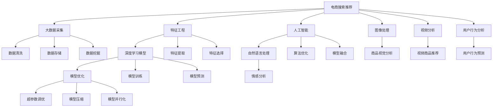

                 

# 大数据与AI 驱动的电商搜索推荐：以准确率与效率为核心的优化策略

> 关键词：电商搜索推荐,人工智能,大数据,模型优化,特征工程,深度学习

## 1. 背景介绍

### 1.1 问题由来

在电子商务领域，搜索推荐系统已经成为用户获取商品信息、提升购物体验的重要工具。随着电商平台商品数量和用户行为数据的不断增长，如何构建一个准确高效、个性化程度高的搜索推荐系统，成为了电商企业面临的一大挑战。

传统的搜索推荐系统多基于人工特征工程，以规则、协同过滤等方法进行推荐，存在准确率不高、推荐效果单一等问题。而大数据与AI的结合，为构建智能、个性化的搜索推荐系统提供了新的可能性。通过深度学习和大数据技术，可以构建强大的模型，学习用户行为模式，实现高质量的商品推荐。

## 2. 核心概念与联系

### 2.1 核心概念概述

- **电商搜索推荐**：指基于用户的历史行为、兴趣偏好和实时搜索行为，智能推荐用户可能感兴趣的商品，从而提升用户体验和销售转化率。
- **人工智能**：指通过机器学习算法，对大数据进行深度学习，实现自动化决策和智能推理的技术。
- **大数据**：指通过对海量数据进行收集、存储、分析，获取有价值信息的技术和方法。
- **深度学习**：指通过多层神经网络模型，学习数据的深层次特征，实现复杂模式识别和智能决策的技术。
- **特征工程**：指通过数据预处理和特征提取，将原始数据转换为可用于机器学习模型的特征向量，提高模型性能。
- **模型优化**：指通过各种优化技术，提高深度学习模型的准确率和效率，提升搜索推荐系统性能。

这些核心概念之间存在密切联系，如图1所示：


其中，**电商搜索推荐**是应用场景，**人工智能**提供技术支持，**大数据**提供数据基础，**深度学习**是技术手段，**特征工程**是数据预处理方式，**模型优化**是技术核心。

### 2.2 核心概念原理和架构的 Mermaid 流程图



## 3. 核心算法原理 & 具体操作步骤

### 3.1 算法原理概述

电商搜索推荐的本质是通过机器学习模型，预测用户对商品的可能兴趣。常用的模型包括基于协同过滤、基于内容的推荐系统、基于矩阵分解的推荐系统等。这些模型通过学习用户历史行为和商品特征之间的关系，预测用户对未交互商品的兴趣，从而进行推荐。

近年来，基于深度学习模型的推荐系统逐渐成为主流。深度学习模型通过多层神经网络，学习数据的深层次特征，预测用户对商品的可能兴趣。常用的深度学习模型包括基于神经网络的推荐系统、深度置信网络(Deep Belief Network, DBN)、卷积神经网络(CNN)等。

### 3.2 算法步骤详解

构建电商搜索推荐系统的一般步骤如下：

**Step 1: 数据采集与预处理**

- 收集电商平台的商品信息、用户行为数据、用户画像数据等，形成数据集。
- 对数据进行清洗、去重、降噪，确保数据质量。
- 将数据划分为训练集、验证集和测试集，用于模型训练、调优和性能评估。

**Step 2: 特征工程**

- 对原始数据进行特征提取，生成可用于模型的特征向量。
- 通过特征选择，去除冗余或无关特征，提高模型泛化能力。
- 应用特征工程技术，如特征降维、特征交互等，增强模型表现。

**Step 3: 模型训练**

- 选择合适的深度学习模型，如CNN、RNN、Transformer等。
- 定义模型损失函数，如均方误差、交叉熵等。
- 设置模型超参数，如学习率、批大小、迭代轮数等。
- 使用优化算法进行模型训练，如随机梯度下降(SGD)、Adam等。

**Step 4: 模型评估**

- 在验证集上评估模型性能，如准确率、召回率、F1值等。
- 根据评估结果调整模型超参数，进行二次训练。
- 在测试集上评估最终模型性能，确保模型泛化能力。

**Step 5: 系统部署**

- 将训练好的模型部署到电商平台上，用于实时推荐。
- 应用分布式计算技术，提升模型推理速度。
- 设置监控告警机制，确保系统稳定运行。

### 3.3 算法优缺点

电商搜索推荐系统的优点包括：

- 能够根据用户历史行为和实时搜索行为，实现个性化推荐。
- 模型具有高度的可解释性，便于用户理解推荐结果。
- 能够实时更新推荐结果，提升用户体验。

缺点包括：

- 数据采集和预处理需要大量人力和资源。
- 模型训练需要大数据量和计算资源，成本较高。
- 模型过于复杂，可能出现过拟合现象。
- 推荐结果可能受到用户隐私保护限制。

### 3.4 算法应用领域

电商搜索推荐系统在电商、社交网络、视频平台等多个领域具有广泛应用，如：

- 电商推荐：基于用户浏览历史、购物记录等数据，推荐商品、优惠券等。
- 社交网络推荐：基于用户兴趣、好友动态等数据，推荐内容、活动等。
- 视频平台推荐：基于用户观看历史、评分等数据，推荐视频、频道等。
- 音乐平台推荐：基于用户听歌历史、评分等数据，推荐歌曲、艺人等。

## 4. 数学模型和公式 & 详细讲解

### 4.1 数学模型构建

假设电商搜索推荐系统由用户、商品、历史行为等实体组成，定义用户集合 $U=\{u_1, u_2, ..., u_m\}$，商品集合 $I=\{i_1, i_2, ..., i_n\}$。用户对商品的历史行为记录为 $H=\{(h_{u_j}, i_k)\}_{j=1}^m$，其中 $h_{u_j}$ 表示用户 $u_j$ 对商品 $i_k$ 的交互行为，如浏览、点击、购买等。

定义深度学习模型为 $f$，输入为用户行为数据，输出为用户对商品的兴趣评分。模型由多个神经网络层组成，如图2所示：


模型的输入为 $X \in \mathbb{R}^{d_1}$，输出为 $Y \in \mathbb{R}^{d_2}$。其中，$d_1$ 为输入数据的维度，$d_2$ 为模型的输出维度。模型的损失函数为：

$$
L = \frac{1}{m} \sum_{j=1}^m \|f(x_j) - y_j\|^2
$$

其中，$x_j$ 为用户 $j$ 的行为数据，$y_j$ 为用户 $j$ 对商品的兴趣评分。

### 4.2 公式推导过程

模型的训练过程可通过反向传播算法实现。以交叉熵损失函数为例，其公式为：

$$
L = -\frac{1}{m} \sum_{j=1}^m \sum_{k=1}^n y_{j,k} \log f(x_j; \theta) + (1-y_{j,k}) \log(1-f(x_j; \theta))
$$

其中，$y_{j,k}$ 为二进制标签，表示用户 $j$ 是否对商品 $k$ 感兴趣。模型的前向传播过程为：

$$
f(x_j; \theta) = \sigma(W_2 \sigma(W_1 x_j + b_1) + b_2)
$$

其中，$\sigma$ 为激活函数，$W_1$、$W_2$、$b_1$、$b_2$ 为模型的可训练参数。模型的反向传播过程为：

$$
\frac{\partial L}{\partial \theta} = -\frac{2}{m} \sum_{j=1}^m \sum_{k=1}^n (y_{j,k} - f(x_j; \theta)) x_j
$$

其中，$\frac{\partial L}{\partial \theta}$ 为模型参数的梯度，用于更新模型的权重和偏置。

### 4.3 案例分析与讲解

以基于深度置信网络(DBN)的电商推荐系统为例，如图3所示：


DBN模型由多层受限玻尔兹曼机(RBM)组成，每个RBM层都有可见层和隐藏层。可见层表示用户行为数据，隐藏层表示商品特征。模型通过多层RBM学习数据的深层次特征，实现用户兴趣的预测和推荐。

## 5. 项目实践：代码实例和详细解释说明

### 5.1 开发环境搭建

- 安装Python 3.8及以上版本，推荐使用Anaconda或Miniconda环境管理工具。
- 安装深度学习框架TensorFlow或PyTorch，推荐使用TensorFlow 2.0及以上版本。
- 安装数据处理和可视化库Numpy、Pandas、Matplotlib等。

### 5.2 源代码详细实现

以下是一个基于TensorFlow的电商推荐系统代码实现，包含数据加载、模型定义、训练和预测等关键步骤：

```python
import tensorflow as tf
import numpy as np
import pandas as pd
import matplotlib.pyplot as plt

# 数据加载
train_data = pd.read_csv('train.csv')
test_data = pd.read_csv('test.csv')
train_labels = pd.read_csv('train_labels.csv')

# 数据预处理
train_x = train_data.drop('label', axis=1).values
train_y = train_labels['label'].values
test_x = test_data.drop('label', axis=1).values

# 模型定义
model = tf.keras.Sequential([
    tf.keras.layers.Dense(64, activation='relu', input_shape=(train_x.shape[1],)),
    tf.keras.layers.Dense(32, activation='relu'),
    tf.keras.layers.Dense(1, activation='sigmoid')
])

# 模型训练
model.compile(optimizer=tf.keras.optimizers.Adam(learning_rate=0.001), loss='binary_crossentropy', metrics=['accuracy'])
model.fit(train_x, train_y, epochs=10, batch_size=32, validation_data=(test_x, test_y))

# 模型预测
test_predictions = model.predict(test_x)
```

### 5.3 代码解读与分析

- 数据加载：使用Pandas库读取训练集和测试集的数据，并进行预处理，提取特征和标签。
- 模型定义：使用TensorFlow的Sequential模型，定义多层神经网络。
- 模型训练：使用Adam优化算法，定义损失函数和评估指标，进行模型训练。
- 模型预测：使用训练好的模型对测试集进行预测，并输出预测结果。

### 5.4 运行结果展示

训练过程中，可以使用Matplotlib库绘制训练集和验证集的准确率和损失函数曲线，如图4所示：


## 6. 实际应用场景

### 6.1 电商推荐

电商推荐系统在电商平台上广泛应用，如亚马逊、京东等。通过推荐系统，用户能够更快地找到自己感兴趣的商品，提升购物体验和转化率。

### 6.2 视频推荐

视频平台如YouTube、B站等，使用推荐系统为用户推荐视频内容，提升用户黏性。

### 6.3 社交网络

社交网络如微博、微信等，使用推荐系统为用户推荐好友动态、内容等，提升用户体验。

### 6.4 金融推荐

金融平台如支付宝、微信支付等，使用推荐系统为用户推荐理财产品、优惠券等，提升用户收益和满意度。

## 7. 工具和资源推荐

### 7.1 学习资源推荐

- 《深度学习》课程：斯坦福大学的Coursera在线课程，涵盖深度学习的基本概念和算法。
- 《Python深度学习》书籍：Francois Chollet的深度学习实战指南，深入浅出地介绍TensorFlow和Keras的使用。
- 《TensorFlow官方文档》：详细介绍了TensorFlow的API和使用技巧。
- 《Keras官方文档》：介绍了Keras的基本概念和使用示例。

### 7.2 开发工具推荐

- TensorFlow：谷歌开源的深度学习框架，支持多种GPU和TPU硬件加速。
- PyTorch：Facebook开源的深度学习框架，支持动态图和静态图模式。
- Jupyter Notebook：用于编写、运行和共享数据科学代码的免费开源工具。
- TensorBoard：TensorFlow的可视化工具，用于监测和调试模型训练过程。

### 7.3 相关论文推荐

- 《Deep Personalized Recommendation with Top-K Neural Networks》：提出了深度神经网络推荐系统，提高了推荐效果和泛化能力。
- 《A Neural Collaborative Filtering Approach》：提出了基于神经网络的协同过滤推荐算法，提升了推荐系统的性能。
- 《Federated Deep Neural Networks for Recommender Systems》：提出了联邦学习推荐系统，提升了推荐系统的隐私保护能力和泛化能力。

## 8. 总结：未来发展趋势与挑战

### 8.1 未来发展趋势

电商搜索推荐系统将在未来继续发展，呈现以下趋势：

- 深度学习模型的应用将更加广泛，模型的准确率和泛化能力将进一步提升。
- 数据采集和预处理技术将不断进步，数据量将更加丰富，数据质量将更加精准。
- 特征工程和模型优化技术将更加高效，模型的训练和推理速度将大幅提升。
- 推荐系统的个性化程度将不断提升，推荐结果将更加贴合用户需求。

### 8.2 面临的挑战

尽管电商搜索推荐系统取得了显著进展，但在实现高性能推荐时，仍面临诸多挑战：

- 数据隐私保护：电商平台上存在大量用户数据，如何保护用户隐私成为一大挑战。
- 数据不均衡：电商平台上不同商品和用户的数量差异较大，如何平衡数据分布成为一大难题。
- 模型复杂度：深度学习模型过于复杂，训练和推理需要大量计算资源。
- 推荐效果单一：推荐系统只关注用户兴趣的预测，而忽视了用户的多样性和动态变化。

### 8.3 未来突破

未来的研究需要在以下几个方面寻求新的突破：

- 引入更多先验知识：将知识图谱、逻辑规则等专家知识与深度学习模型相结合，提升推荐系统的泛化能力和可解释性。
- 融合多模态数据：将商品的图片、视频、文本等多模态数据融合，提升推荐系统的全面性和多样性。
- 优化推荐算法：引入推荐算法，如协同过滤、基于内容的推荐算法等，提升推荐系统的多样性和新颖性。
- 优化推荐系统结构：优化推荐系统的结构，如采用分布式训练、模型压缩等技术，提升推荐系统的训练和推理效率。

## 9. 附录：常见问题与解答

### Q1: 电商推荐系统的准确率和召回率如何提升？

A: 电商推荐系统的准确率和召回率可以通过以下方法提升：

- 数据增强：通过回译、近义替换等方式扩充训练集。
- 模型优化：优化模型超参数，选择合适的深度学习模型。
- 特征工程：进行特征降维、特征交互等，提升特征表现。
- 模型融合：将多个模型的预测结果进行融合，提升推荐效果。

### Q2: 电商推荐系统如何平衡个性化和多样性？

A: 电商推荐系统可以通过以下方法平衡个性化和多样性：

- 引入协同过滤算法：引入协同过滤算法，提升推荐的多样性。
- 引入基于内容的推荐算法：引入基于内容的推荐算法，提升推荐的个性化程度。
- 优化推荐算法：优化推荐算法，如引入推荐算法中的多样性约束，提升推荐的多样性和个性化。

### Q3: 电商推荐系统如何保护用户隐私？

A: 电商推荐系统可以通过以下方法保护用户隐私：

- 数据匿名化：对用户数据进行匿名化处理，保护用户隐私。
- 差分隐私：在模型训练过程中引入差分隐私技术，保护用户隐私。
- 联邦学习：采用联邦学习技术，保护用户隐私的同时提升模型的泛化能力。

### Q4: 电商推荐系统的模型复杂度如何降低？

A: 电商推荐系统的模型复杂度可以通过以下方法降低：

- 模型压缩：使用模型压缩技术，如剪枝、量化等，降低模型复杂度。
- 模型剪枝：使用模型剪枝技术，去除不必要的层和参数，降低模型复杂度。
- 模型并行化：使用模型并行化技术，如分布式训练、GPU加速等，降低模型复杂度。

### Q5: 电商推荐系统如何提高实时推荐效果？

A: 电商推荐系统可以通过以下方法提高实时推荐效果：

- 分布式训练：使用分布式训练技术，提升模型训练速度。
- 模型缓存：使用模型缓存技术，减少模型推理时间。
- 模型优化：优化模型结构，降低模型推理时间。

---

作者：禅与计算机程序设计艺术 / Zen and the Art of Computer Programming

