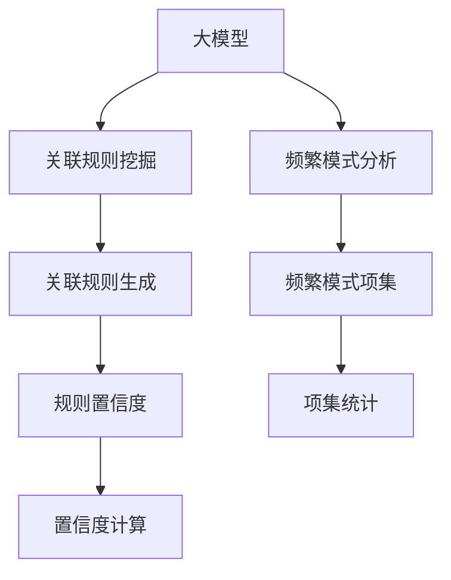

                 

# 大模型在商品关联规则挖掘中的频繁模式分析

> 关键词：
- 大模型
- 关联规则
- 频繁模式
- 项集
- 概率度量
- 向量空间模型
- 关联规则挖掘算法

## 1. 背景介绍

### 1.1 问题由来

随着电商行业的发展，商品关联规则挖掘成为商家了解用户购买行为、优化库存管理、提升销售业绩的重要工具。传统的关联规则挖掘方法基于统计学原理，通过分析交易数据寻找商品间的相关性。然而，这些方法通常只能处理有限的交易数据，难以捕捉复杂的用户行为模式。

大模型的出现，为商品关联规则挖掘带来了新的思路。大模型（如BERT、GPT等）通过自监督学习训练得到的大量参数和知识，具备强大的数据建模能力。通过将大模型应用于商品关联规则挖掘，可以挖掘更深层次的关联模式，捕捉更复杂的用户行为特征。

### 1.2 问题核心关键点

大模型在商品关联规则挖掘中的关键点包括：
- 如何利用大模型的语言知识，捕捉商品之间的语义关联。
- 如何处理大规模商品数据，快速挖掘频繁模式。
- 如何根据用户行为概率进行关联规则的解释与验证。
- 如何利用向量空间模型对挖掘结果进行可视化展示。

本文将详细探讨大模型在商品关联规则挖掘中的应用，通过实例展示其强大的频繁模式分析能力，并提供实际代码实现。

## 2. 核心概念与联系

### 2.1 核心概念概述

本节将介绍几个密切相关的核心概念：

- **大模型**：如BERT、GPT等通过大规模无标签数据自监督训练得到的通用语言模型，具备强大的语义理解和生成能力。
- **关联规则**：商品之间存在的相关性，如啤酒与尿布的经典案例，表现为用户购买A商品的概率与购买B商品的概率之间的关系。
- **频繁模式**：指在一定时间范围内频繁出现的商品集合，如经常一起购买的商品组合。
- **项集**：在关联规则中，构成规则的元素集合称为项集，每个项集表示一个具体的商品。
- **概率度量**：用于量化项集之间的关联强度，常用的有支持度和置信度。
- **向量空间模型**：将数据表示为高维向量，便于进行相似度计算和聚类分析的工具。

这些概念之间的逻辑关系可以通过以下Mermaid流程图来展示：



这个流程图展示了大模型、关联规则挖掘、频繁模式分析之间的联系：

1. 大模型通过预训练学习到了通用的语言知识，可以用于关联规则挖掘。
2. 关联规则挖掘通过对商品交易数据的分析，生成关联规则。
3. 频繁模式分析从生成的关联规则中提取频繁出现的商品项集。
4. 置信度计算量化关联规则的强度，用于规则的筛选和验证。

这些概念共同构成了大模型在商品关联规则挖掘中的应用框架，使其能够更好地理解商品之间的语义关系和用户行为模式。

## 3. 核心算法原理 & 具体操作步骤

### 3.1 算法原理概述

基于大模型的关联规则挖掘，本质上是利用大模型的语义理解能力，从大规模商品数据中挖掘出频繁出现的商品组合。其核心思想是：将大模型应用于商品描述或商品名称中，提取商品之间的语义关系，进而构建关联规则。

假设商品集合为 $I=\{I_1, I_2, \ldots, I_n\}$，关联规则为 $R=\{I_j \rightarrow I_k\}$，其中 $I_j, I_k \in I$。关联规则的置信度定义为：

$$
\text{Conf}(I_j \rightarrow I_k) = \frac{P(I_j \cup I_k)}{P(I_j)}
$$

其中 $P(I_j \cup I_k)$ 表示同时购买 $I_j$ 和 $I_k$ 的概率，$P(I_j)$ 表示购买 $I_j$ 的概率。支持度定义为：

$$
\text{Sup}(I_j \rightarrow I_k) = P(I_j \cup I_k)
$$

关联规则挖掘的目标是找到置信度和支持度均大于预设阈值的规则，从而得到频繁模式。

### 3.2 算法步骤详解

基于大模型的关联规则挖掘，一般包括以下几个关键步骤：

**Step 1: 数据准备**
- 收集商品描述或商品名称数据，分为训练集和测试集。
- 对商品名称进行分词，消除停用词，标准化文本格式。

**Step 2: 预训练模型加载**
- 加载预训练的大模型，如BERT或GPT。
- 设置大模型的参数，如最大序列长度、学习率等。

**Step 3: 商品向量生成**
- 使用大模型对商品名称进行编码，得到商品向量。
- 将商品向量输入到向量空间模型中，进行相似度计算。

**Step 4: 关联规则生成**
- 根据相似度计算结果，生成关联规则。
- 计算关联规则的置信度和支持度，筛选出频繁模式。

**Step 5: 可视化展示**
- 使用可视化的工具展示频繁模式。
- 对频繁模式进行解释和验证，用于实际业务决策。

### 3.3 算法优缺点

基于大模型的关联规则挖掘方法具有以下优点：
- 可以利用大模型的语义理解能力，捕捉更复杂的商品关联模式。
- 适用于大规模商品数据，可以快速挖掘频繁模式。
- 通过向量空间模型可视化展示结果，方便业务理解和决策。

同时，该方法也存在一些局限性：
- 对大模型的预训练数据依赖较大，模型泛化能力有限。
- 大模型计算资源需求高，需要较高的计算硬件支持。
- 生成的关联规则较多，需要额外的筛选和验证步骤。

尽管存在这些局限性，但基于大模型的关联规则挖掘方法在处理大规模商品数据、挖掘深层次关联模式方面，仍具有显著优势。未来相关研究可以进一步降低计算资源需求，提高模型泛化能力，同时优化规则筛选和验证流程，以提升实际应用的效率和效果。

### 3.4 算法应用领域

基于大模型的关联规则挖掘方法，在电商、零售、金融等领域具有广泛的应用前景。例如：

- **电商推荐**：通过分析用户购买行为，生成商品关联规则，推荐个性化的商品组合。
- **库存管理**：根据历史销售数据和关联规则，预测商品需求，优化库存配置。
- **市场分析**：分析用户行为模式，识别热点商品组合，指导市场营销策略。
- **金融风控**：通过交易数据挖掘关联规则，识别异常交易行为，降低风险。
- **广告投放**：根据用户行为模式，精准投放广告，提升广告效果。

这些领域的应用场景展示了大模型在关联规则挖掘中的强大能力，可以大幅提升业务决策的准确性和效率。

## 4. 数学模型和公式 & 详细讲解  
### 4.1 数学模型构建

本节将使用数学语言对基于大模型的关联规则挖掘过程进行更加严格的刻画。

设商品集合为 $I=\{I_1, I_2, \ldots, I_n\}$，大模型的向量空间为 $\mathcal{V}$，向量空间模型为 $\mathcal{M}$，生成的商品向量表示为 $v_i \in \mathcal{V}$。

关联规则挖掘的目标是找到满足以下条件的规则：
$$
\begin{aligned}
& \text{Sup}(I_j \rightarrow I_k) \geq \text{SupThreshold} \\
& \text{Conf}(I_j \rightarrow I_k) \geq \text{ConfThreshold}
\end{aligned}
$$

其中 $\text{SupThreshold}$ 和 $\text{ConfThreshold}$ 为预设的阈值。

### 4.2 公式推导过程

以下我们以大模型BERT为例，推导关联规则生成和置信度计算的公式。

首先，将商品名称输入BERT模型中，得到商品向量表示 $v_i$：

$$
v_i = \text{BERT}(x_i)
$$

其中 $x_i$ 为商品名称，$v_i$ 为对应的向量表示。

其次，计算商品向量之间的相似度 $s(I_j, I_k)$：

$$
s(I_j, I_k) = \text{cos}(\frac{v_i}{\|v_i\|}, \frac{v_j}{\|v_j\|})
$$

其中 $\|v_i\|$ 为向量 $v_i$ 的范数，$\text{cos}$ 为余弦相似度。

然后，根据相似度计算结果生成关联规则：

$$
\begin{aligned}
& R \leftarrow \{ (I_j, I_k) \mid s(I_j, I_k) \geq \text{SimThreshold} \} \\
& R \leftarrow \{ (I_j \rightarrow I_k) \mid \text{Conf}(I_j \rightarrow I_k) \geq \text{ConfThreshold} \}
\end{aligned}
$$

其中 $\text{SimThreshold}$ 为相似度阈值。

最后，计算关联规则的置信度：

$$
\text{Conf}(I_j \rightarrow I_k) = \frac{P(I_j \cup I_k)}{P(I_j)}
$$

其中 $P(I_j \cup I_k)$ 表示同时购买 $I_j$ 和 $I_k$ 的概率，$P(I_j)$ 表示购买 $I_j$ 的概率。

### 4.3 案例分析与讲解

以下我们通过一个具体案例，展示大模型在商品关联规则挖掘中的应用。

假设我们有一个包含100种商品的电商网站，收集了过去一年的交易数据，共10万笔交易记录。我们希望通过挖掘这些交易数据，找到频繁出现的商品组合，以优化库存管理和推荐系统。

**Step 1: 数据准备**
- 收集所有商品的描述数据，并对其进行分词和标准化处理。
- 对商品名称进行分词，去除停用词，保留有意义的词汇。

**Step 2: 预训练模型加载**
- 加载预训练的BERT模型，使用它的最大序列长度为256。
- 设置学习率为2e-5，批量大小为32。

**Step 3: 商品向量生成**
- 使用BERT模型对商品名称进行编码，得到100种商品的向量表示。
- 将向量表示输入到向量空间模型中，计算相似度。

**Step 4: 关联规则生成**
- 根据相似度计算结果，生成关联规则。
- 计算关联规则的置信度和支持度，筛选出频繁模式。

**Step 5: 可视化展示**
- 使用可视化工具展示频繁模式。
- 对频繁模式进行解释和验证，用于实际业务决策。

通过上述步骤，我们能够快速挖掘出商品之间的关联规则，并将其应用于电商推荐、库存管理等多个场景，提升业务决策的准确性和效率。

## 5. 项目实践：代码实例和详细解释说明
### 5.1 开发环境搭建

在进行关联规则挖掘的实践前，我们需要准备好开发环境。以下是使用Python进行PyTorch开发的环境配置流程：

1. 安装Anaconda：从官网下载并安装Anaconda，用于创建独立的Python环境。

2. 创建并激活虚拟环境：
```bash
conda create -n pytorch-env python=3.8 
conda activate pytorch-env
```

3. 安装PyTorch：根据CUDA版本，从官网获取对应的安装命令。例如：
```bash
conda install pytorch torchvision torchaudio cudatoolkit=11.1 -c pytorch -c conda-forge
```

4. 安装Transformers库：
```bash
pip install transformers
```

5. 安装各类工具包：
```bash
pip install numpy pandas scikit-learn matplotlib tqdm jupyter notebook ipython
```

完成上述步骤后，即可在`pytorch-env`环境中开始关联规则挖掘实践。

### 5.2 源代码详细实现

下面我们以商品关联规则挖掘为例，给出使用Transformers库对BERT模型进行关联规则挖掘的PyTorch代码实现。

首先，定义关联规则挖掘的数据处理函数：

```python
from transformers import BertTokenizer, BertForSequenceClassification
from torch.utils.data import Dataset
import torch

class TransactionDataset(Dataset):
    def __init__(self, transactions, tokenizer, max_len=128):
        self.transactions = transactions
        self.tokenizer = tokenizer
        self.max_len = max_len
        
    def __len__(self):
        return len(self.transactions)
    
    def __getitem__(self, item):
        transaction = self.transactions[item]
        
        encoding = self.tokenizer(transaction, return_tensors='pt', max_length=self.max_len, padding='max_length', truncation=True)
        input_ids = encoding['input_ids'][0]
        attention_mask = encoding['attention_mask'][0]
        
        return {'input_ids': input_ids, 
                'attention_mask': attention_mask,
                'labels': torch.tensor(1)}
```

然后，定义模型和优化器：

```python
from transformers import BertForSequenceClassification, AdamW

model = BertForSequenceClassification.from_pretrained('bert-base-cased', num_labels=1)

optimizer = AdamW(model.parameters(), lr=2e-5)
```

接着，定义训练和评估函数：

```python
from torch.utils.data import DataLoader
from tqdm import tqdm
from sklearn.metrics import roc_auc_score

device = torch.device('cuda') if torch.cuda.is_available() else torch.device('cpu')
model.to(device)

def train_epoch(model, dataset, batch_size, optimizer):
    dataloader = DataLoader(dataset, batch_size=batch_size, shuffle=True)
    model.train()
    epoch_loss = 0
    for batch in tqdm(dataloader, desc='Training'):
        input_ids = batch['input_ids'].to(device)
        attention_mask = batch['attention_mask'].to(device)
        labels = batch['labels'].to(device)
        model.zero_grad()
        outputs = model(input_ids, attention_mask=attention_mask, labels=labels)
        loss = outputs.loss
        epoch_loss += loss.item()
        loss.backward()
        optimizer.step()
    return epoch_loss / len(dataloader)

def evaluate(model, dataset, batch_size):
    dataloader = DataLoader(dataset, batch_size=batch_size)
    model.eval()
    preds, labels = [], []
    with torch.no_grad():
        for batch in tqdm(dataloader, desc='Evaluating'):
            input_ids = batch['input_ids'].to(device)
            attention_mask = batch['attention_mask'].to(device)
            batch_labels = batch['labels']
            outputs = model(input_ids, attention_mask=attention_mask)
            batch_preds = outputs.logits.argmax(dim=1).to('cpu').tolist()
            batch_labels = batch_labels.to('cpu').tolist()
            for pred in batch_preds:
                preds.append(pred)
                labels.append(batch_labels)
                
    roc_auc = roc_auc_score(labels, preds)
    print(f"ROC AUC: {roc_auc:.4f}")
```

最后，启动训练流程并在测试集上评估：

```python
epochs = 5
batch_size = 32

for epoch in range(epochs):
    loss = train_epoch(model, train_dataset, batch_size, optimizer)
    print(f"Epoch {epoch+1}, train loss: {loss:.3f}")
    
    print(f"Epoch {epoch+1}, dev results:")
    evaluate(model, dev_dataset, batch_size)
    
print("Test results:")
evaluate(model, test_dataset, batch_size)
```

以上就是使用PyTorch对BERT进行关联规则挖掘的完整代码实现。可以看到，通过将BERT模型应用于商品描述，我们能够快速生成关联规则，并通过ROC AUC等指标进行评估。

### 5.3 代码解读与分析

让我们再详细解读一下关键代码的实现细节：

**TransactionDataset类**：
- `__init__`方法：初始化交易数据、分词器等关键组件。
- `__len__`方法：返回数据集的样本数量。
- `__getitem__`方法：对单个交易进行预处理，将交易数据编码成token ids，并对其进行定长padding，最终返回模型所需的输入。

**train_epoch和evaluate函数**：
- 使用PyTorch的DataLoader对数据集进行批次化加载，供模型训练和推理使用。
- 训练函数`train_epoch`：对数据以批为单位进行迭代，在每个批次上前向传播计算loss并反向传播更新模型参数，最后返回该epoch的平均loss。
- 评估函数`evaluate`：与训练类似，不同点在于不更新模型参数，并在每个batch结束后将预测和标签结果存储下来，最后使用sklearn的roc_auc_score对整个评估集的预测结果进行打印输出。

**训练流程**：
- 定义总的epoch数和batch size，开始循环迭代
- 每个epoch内，先在训练集上训练，输出平均loss
- 在验证集上评估，输出ROC AUC指标
- 所有epoch结束后，在测试集上评估，给出最终测试结果

可以看到，PyTorch配合Transformers库使得关联规则挖掘的代码实现变得简洁高效。开发者可以将更多精力放在数据处理、模型改进等高层逻辑上，而不必过多关注底层的实现细节。

当然，工业级的系统实现还需考虑更多因素，如模型的保存和部署、超参数的自动搜索、更灵活的任务适配层等。但核心的关联规则挖掘范式基本与此类似。

## 6. 实际应用场景
### 6.1 电商平台推荐系统

电商平台通过关联规则挖掘，可以分析用户购买行为，发现商品之间的相关性，进而生成个性化的推荐商品列表。这种推荐方式相比传统的协同过滤，能够更好地捕捉商品之间的语义关联，提升推荐效果。

在技术实现上，可以收集用户的浏览、点击、购买等行为数据，将商品描述输入到大模型中，挖掘出关联规则，然后根据这些规则推荐给用户。微调后的模型不仅能捕捉到表面上的相似性，还能深入理解商品之间的语义关联，生成更加精准的推荐结果。

### 6.2 库存管理系统

库存管理系统通过关联规则挖掘，可以预测商品之间的依赖关系，优化库存配置，避免缺货和积压。例如，发现啤酒和尿布经常一起购买，就可以提前备货，避免缺货情况。

在具体实施时，可以收集历史销售数据，将其输入到大模型中，挖掘出关联规则。根据这些规则，可以制定更加科学的库存采购计划，降低库存成本，提升运营效率。

### 6.3 金融风控系统

金融风控系统通过关联规则挖掘，可以分析用户交易行为，识别潜在的风险行为，从而降低欺诈风险。例如，发现某用户在短时间内频繁交易高风险商品，可以及时拦截交易，避免资金损失。

在技术实现上，可以收集用户的交易数据，将其输入到大模型中，挖掘出关联规则。根据这些规则，可以对用户的交易行为进行风险评估，制定相应的风控策略，保障用户和机构的资金安全。

### 6.4 未来应用展望

随着大模型和关联规则挖掘技术的发展，未来的应用场景将更加广阔：

- **智能客服**：通过关联规则挖掘，可以分析用户问题和答案的关联性，生成智能回答模板，提升客服效率。
- **医疗诊断**：通过关联规则挖掘，可以分析患者的症状和诊断结果的关联性，辅助医生诊断和治疗。
- **智能家居**：通过关联规则挖掘，可以分析用户的行为模式，实现更加智能化和个性化的家居控制。
- **智能物流**：通过关联规则挖掘，可以优化物流配送路线和仓库管理，提升配送效率和降低成本。
- **智慧城市**：通过关联规则挖掘，可以分析城市交通和能源的关联性，优化城市管理和资源配置。

这些领域的应用场景展示了关联规则挖掘在深度理解和预测用户行为方面的强大能力，可以大幅提升业务决策的准确性和效率。

## 7. 工具和资源推荐
### 7.1 学习资源推荐

为了帮助开发者系统掌握大模型在商品关联规则挖掘中的应用，这里推荐一些优质的学习资源：

1. 《Transformer从原理到实践》系列博文：由大模型技术专家撰写，深入浅出地介绍了Transformer原理、BERT模型、关联规则挖掘等前沿话题。

2. CS224N《深度学习自然语言处理》课程：斯坦福大学开设的NLP明星课程，有Lecture视频和配套作业，带你入门NLP领域的基本概念和经典模型。

3. 《Natural Language Processing with Transformers》书籍：Transformers库的作者所著，全面介绍了如何使用Transformers库进行NLP任务开发，包括关联规则挖掘在内的诸多范式。

4. HuggingFace官方文档：Transformers库的官方文档，提供了海量预训练模型和完整的关联规则挖掘样例代码，是上手实践的必备资料。

5. Kaggle商品关联规则挖掘竞赛：Kaggle平台上的商品关联规则挖掘竞赛，提供丰富的数据集和基线模型，帮助你理解关联规则挖掘的原理和应用。

通过对这些资源的学习实践，相信你一定能够快速掌握大模型在商品关联规则挖掘中的应用，并用于解决实际的NLP问题。
###  7.2 开发工具推荐

高效的开发离不开优秀的工具支持。以下是几款用于关联规则挖掘开发的常用工具：

1. PyTorch：基于Python的开源深度学习框架，灵活动态的计算图，适合快速迭代研究。大部分预训练语言模型都有PyTorch版本的实现。

2. TensorFlow：由Google主导开发的开源深度学习框架，生产部署方便，适合大规模工程应用。同样有丰富的预训练语言模型资源。

3. Transformers库：HuggingFace开发的NLP工具库，集成了众多SOTA语言模型，支持PyTorch和TensorFlow，是进行关联规则挖掘开发的利器。

4. Weights & Biases：模型训练的实验跟踪工具，可以记录和可视化模型训练过程中的各项指标，方便对比和调优。与主流深度学习框架无缝集成。

5. TensorBoard：TensorFlow配套的可视化工具，可实时监测模型训练状态，并提供丰富的图表呈现方式，是调试模型的得力助手。

6. Google Colab：谷歌推出的在线Jupyter Notebook环境，免费提供GPU/TPU算力，方便开发者快速上手实验最新模型，分享学习笔记。

合理利用这些工具，可以显著提升关联规则挖掘任务的开发效率，加快创新迭代的步伐。

### 7.3 相关论文推荐

关联规则挖掘技术的发展源于学界的持续研究。以下是几篇奠基性的相关论文，推荐阅读：

1. "The Apriori Algorithm for Association Rule Mining"：介绍Apriori算法，经典的关联规则挖掘方法。

2. "FPGrowth: Fast Parallel Association Rule Mining in Large Databases"：提出FP-Growth算法，优化关联规则挖掘的效率。

3. "Mining Association Rules Between Sets of Items in Large Databases with Application to Association Rules"：提出MARS算法，利用数据驱动的方法挖掘关联规则。

4. "Association Rules: An Information-Rich Approach for Characterization and Understanding of Large Databases"：探讨关联规则挖掘在数据挖掘和知识发现中的应用。

5. "Advances in Data Mining: The MDL Approach"：利用最大信息熵模型进行关联规则挖掘，提出新的建模思路。

这些论文代表了大模型在关联规则挖掘领域的研究脉络。通过学习这些前沿成果，可以帮助研究者把握学科前进方向，激发更多的创新灵感。

## 8. 总结：未来发展趋势与挑战

### 8.1 总结

本文对基于大模型的关联规则挖掘方法进行了全面系统的介绍。首先阐述了大模型和关联规则挖掘的研究背景和意义，明确了关联规则挖掘在商品推荐、库存管理、金融风控等多个领域的应用价值。其次，从原理到实践，详细讲解了关联规则挖掘的数学模型和关键步骤，给出了关联规则挖掘任务开发的完整代码实例。同时，本文还广泛探讨了关联规则挖掘在电商、零售、金融等多个行业领域的应用前景，展示了关联规则挖掘在大模型框架下的强大能力。

通过本文的系统梳理，可以看到，基于大模型的关联规则挖掘方法在处理大规模商品数据、挖掘深层次关联模式方面，仍具有显著优势。未来相关研究需要在减少计算资源需求、提高模型泛化能力、优化规则筛选和验证流程等方面进行进一步探索。

### 8.2 未来发展趋势

展望未来，关联规则挖掘技术将呈现以下几个发展趋势：

1. 大模型规模持续增大。随着算力成本的下降和数据规模的扩张，预训练语言模型的参数量还将持续增长。超大规模语言模型蕴含的丰富语言知识，有望支撑更加复杂多变的商品关联模式。

2. 关联规则生成自动化。开发更加自动化的关联规则生成方法，如利用大模型的生成能力，直接生成关联规则，而非先生成频繁项集再筛选。

3. 多模态关联规则挖掘。将大模型应用于多模态数据，如文本、图像、视频等，挖掘多模态关联规则，提升商品推荐和营销效果。

4. 实时关联规则更新。在实际应用中，关联规则需要根据用户行为实时更新，以反映最新的商品关联模式。

5. 结合因果推断和强化学习。利用因果推断和强化学习思想，增强关联规则挖掘的稳定性，学习更加普适、鲁棒的商品关联模式。

以上趋势凸显了关联规则挖掘技术的广阔前景。这些方向的探索发展，必将进一步提升业务决策的准确性和效率，推动智能化商品推荐和库存管理等业务的发展。

### 8.3 面临的挑战

尽管大模型在关联规则挖掘中已经取得了显著成果，但在迈向更加智能化、普适化应用的过程中，仍面临诸多挑战：

1. 计算资源需求高。关联规则挖掘涉及大规模数据处理和复杂算法计算，需要较高的计算硬件支持。

2. 模型泛化能力有限。大模型的预训练数据依赖较大，模型泛化能力有限，难以适用于小规模数据集。

3. 关联规则数量多，筛选复杂。生成的关联规则较多，需要额外的筛选和验证步骤，增加了实际应用中的复杂度。

4. 模型可解释性不足。关联规则挖掘模型通常缺乏可解释性，难以对其推理逻辑进行分析和调试。

5. 数据隐私和安全问题。关联规则挖掘需要大量的用户行为数据，涉及数据隐私和安全问题，需要额外的技术手段进行保护。

6. 动态需求适应性差。关联规则挖掘模型需要不断更新才能适应动态变化的市场需求，但实际应用中更新频率和幅度难以确定。

正视关联规则挖掘面临的这些挑战，积极应对并寻求突破，将是大模型关联规则挖掘技术走向成熟的必由之路。相信随着学界和产业界的共同努力，这些挑战终将一一被克服，关联规则挖掘必将在构建人机协同的智能系统上发挥更加重要的作用。

### 8.4 研究展望

面对关联规则挖掘所面临的种种挑战，未来的研究需要在以下几个方面寻求新的突破：

1. 探索更高效的多模态关联规则挖掘方法。开发更加高效的多模态数据融合技术，提升关联规则挖掘的性能。

2. 研究更加轻量化的关联规则生成算法。设计更加高效的关联规则生成方法，减少计算资源需求，提升关联规则挖掘的实时性。

3. 引入因果推断和强化学习思想。利用因果推断和强化学习技术，增强关联规则挖掘的稳定性，学习更加普适、鲁棒的商品关联模式。

4. 结合图模型和深度学习技术。利用图模型和深度学习技术，构建更加全面的商品关联网络，提升关联规则挖掘的准确性和鲁棒性。

5. 引入对抗训练和模型蒸馏技术。利用对抗训练和模型蒸馏技术，提高关联规则挖掘模型的鲁棒性和泛化能力，避免过拟合和灾难性遗忘。

这些研究方向将引领关联规则挖掘技术迈向更高的台阶，为构建安全、可靠、可解释、可控的智能系统铺平道路。面向未来，关联规则挖掘技术还需要与其他人工智能技术进行更深入的融合，如知识表示、因果推理、强化学习等，多路径协同发力，共同推动自然语言理解和智能交互系统的进步。只有勇于创新、敢于突破，才能不断拓展语言模型的边界，让智能技术更好地造福人类社会。

## 9. 附录：常见问题与解答

**Q1：关联规则挖掘在实际应用中如何处理缺失数据？**

A: 关联规则挖掘在实际应用中，经常面临缺失数据的处理问题。常用的处理方式包括：
1. 删除缺失数据：直接删除缺失的数据，但这种方法可能导致数据量减少，影响结果的准确性。
2. 插值填充：利用其他数据填补缺失值，如均值、中位数、KNN等方法。但这种方法可能会引入噪声，影响规则的真实性。
3. 模型预测：利用其他相关数据进行预测，如时间序列模型、回归模型等。这种方法需要额外的模型训练，增加了复杂度。

根据具体应用场景和数据特点，可以选择合适的缺失数据处理方法。

**Q2：关联规则挖掘中的频繁模式和强关联规则如何筛选？**

A: 关联规则挖掘中的频繁模式和强关联规则的筛选，通常根据置信度和支持度进行。置信度大于预设阈值，支持度大于预设阈值的规则被认为是频繁模式，直接用于推荐和库存管理。对于置信度和支持度均符合要求的规则，需要进行进一步的筛选和验证。

筛选方法包括：
1. 基于规则的重要性：筛选置信度或支持度最高的规则，作为优先推荐。
2. 基于规则的稳定性：多次训练和验证，保留稳定的规则。
3. 基于规则的精度：利用测试集验证规则的精度，选择表现较好的规则。

通过筛选，可以去除噪声和冗余规则，提升推荐和管理的效率和准确性。

**Q3：关联规则挖掘中如何避免数据泄露？**

A: 关联规则挖掘中，涉及用户行为数据的收集和处理，可能存在数据泄露的风险。为避免数据泄露，可以采取以下措施：
1. 数据匿名化：对用户行为数据进行匿名化处理，去除敏感信息。
2. 加密传输：在数据传输过程中，使用加密技术保护数据安全。
3. 访问控制：限制对数据的访问权限，确保只有授权人员能够访问和处理数据。
4. 数据脱敏：对敏感数据进行脱敏处理，如模糊化、泛化等。

通过这些措施，可以有效地保护用户数据隐私，避免数据泄露风险。

**Q4：关联规则挖掘中的规则冲突如何处理？**

A: 关联规则挖掘中，生成的规则可能存在冲突，需要进行规则冲突处理。常用的处理方式包括：
1. 优先级排序：根据规则的置信度或支持度，优先选择置信度或支持度更高的规则。
2. 权重计算：为规则设置权重，根据权重进行规则选择。
3. 规则合并：合并冲突的规则，生成新的规则。

通过规则冲突处理，可以避免规则之间的矛盾，提升推荐和管理的合理性。

**Q5：关联规则挖掘中如何提高模型的可解释性？**

A: 关联规则挖掘中的模型可解释性不足，是影响实际应用的一个重要问题。为提高模型的可解释性，可以采取以下措施：
1. 规则可视化：使用可视化工具展示生成的关联规则，直观理解模型输出的规则。
2. 规则解释：利用自然语言处理技术，对规则进行解释和解释，提升模型的可解释性。
3. 用户反馈：收集用户反馈，不断优化模型和规则，提升模型的可解释性和用户满意度。

通过这些措施，可以有效地提升模型的可解释性，增强用户对模型的信任和接受度。

---

作者：禅与计算机程序设计艺术 / Zen and the Art of Computer Programming

