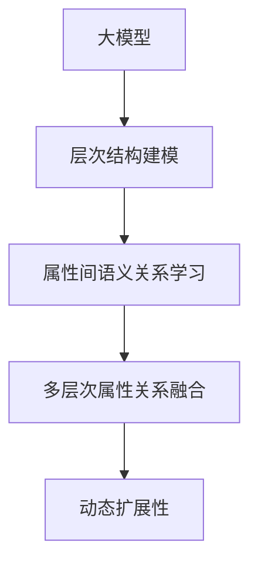

                 

# 大模型在商品属性层次结构自动构建中的应用

> 关键词：商品属性，层次结构，自动构建，大模型，深度学习

## 1. 背景介绍

随着电子商务的迅猛发展，商品属性标签在电商平台中扮演着愈加重要的角色。它们不仅影响着用户的购买决策，也是搜索引擎优化的重要因素。如何自动构建准确、完整的商品属性标签体系，成为电商领域的一大挑战。大模型，尤其是预训练语言模型，通过强大的语义理解和建模能力，在自动构建商品属性标签体系中展现了巨大的潜力。

### 1.1 问题由来

在电商平台中，商品属性标签是描述商品的关键信息，如品牌、型号、材质、尺寸等。传统上，商品属性标签的构建主要依靠人工标注，不仅成本高，且存在标注不一致的问题。自动化构建商品属性标签体系，可以有效降低人工标注成本，提高标注质量，提升用户体验和电商平台搜索效果。

但自动构建商品属性标签体系并非易事。不同品牌、不同类型的产品，其属性描述方式和标签体系构建规则各有不同。如何设计通用的模型，自动学习到商品属性标签的层次结构和语义关系，是一个值得探索的课题。

### 1.2 问题核心关键点

自动构建商品属性标签体系，核心在于将无序的文本数据映射到有序的层次结构中，并学习各层次属性之间的语义关系。其关键点包括：
1. 属性层次结构建模：如何设计层次结构，将商品属性描述自动映射到层次结构中。
2. 属性间语义关系学习：如何学习属性间的关系，如父子关系、兄弟关系等。
3. 多层次属性关系融合：如何融合不同层次的属性关系，构建全局属性标签体系。
4. 动态扩展性：如何处理商品属性体系的变化和新增。

本文聚焦于大模型在商品属性层次结构自动构建中的应用，旨在介绍其原理与方法，并通过案例分析、代码实现和实际应用展示，全面探讨大模型在此领域的潜力与挑战。

## 2. 核心概念与联系

### 2.1 核心概念概述

为了更好地理解大模型在商品属性层次结构自动构建中的应用，我们先介绍几个核心概念：

- **大模型**：以BERT、GPT-2、GPT-3等预训练语言模型为代表的大规模深度学习模型，通过在大规模无标签文本数据上进行预训练，学习到丰富的语言知识和语义表示。
- **层次结构**：指一种有序的层级关系，如树形结构、DAG结构等，用于表示对象间的多重关系。
- **属性层次结构**：指商品属性之间的层级关系，如品牌-型号-尺寸等。
- **自动构建**：通过深度学习模型，自动学习商品属性标签之间的层次结构，构建属性标签体系的过程。
- **语义关系**：指不同属性之间的语义关联，如父子关系、兄弟关系等。

这些核心概念之间的逻辑关系可以通过以下Mermaid流程图来展示：



这个流程图展示了大模型在商品属性层次结构自动构建中的关键环节：

1. 使用大模型进行层次结构建模，将商品属性描述映射到层次结构中。
2. 学习属性间语义关系，掌握父子关系、兄弟关系等。
3. 融合多层次属性关系，构建全局属性标签体系。
4. 处理动态扩展性，应对商品属性体系的变化和新增。

这些环节相互联系，构成了一个完整的大模型应用框架，助力商品属性标签体系的自动构建。

## 3. 核心算法原理 & 具体操作步骤
### 3.1 算法原理概述

基于大模型的商品属性层次结构自动构建方法，通过将无序的商品属性描述文本映射到有序的层次结构中，学习各属性间的语义关系，并融合多层次关系，构建全局属性标签体系。其核心思想可以总结如下：

- 层次结构建模：使用大模型将商品属性描述映射到层次结构中，自动学习商品属性之间的层级关系。
- 语义关系学习：通过大模型学习不同属性间的语义关联，建立父子关系、兄弟关系等。
- 多层次融合：融合多层次属性关系，构建全局属性标签体系，提升模型对商品属性的理解深度。
- 动态扩展性：动态更新模型，处理商品属性体系的变化和新增，保持属性体系的时效性。

### 3.2 算法步骤详解

基于大模型的商品属性层次结构自动构建过程主要分为以下几个步骤：

1. **层次结构建模**：使用大模型将商品属性描述映射到层次结构中，学习商品属性之间的层级关系。
2. **语义关系学习**：通过大模型学习不同属性间的语义关联，建立父子关系、兄弟关系等。
3. **多层次融合**：融合多层次属性关系，构建全局属性标签体系，提升模型对商品属性的理解深度。
4. **动态扩展性**：动态更新模型，处理商品属性体系的变化和新增，保持属性体系的时效性。

具体步骤如下：

**Step 1: 层次结构建模**
- 设计层次结构，将商品属性描述文本自动映射到层次结构中。
- 选择合适的大模型，如BERT、GPT-2等，作为特征提取器，提取文本的语义表示。

**Step 2: 语义关系学习**
- 使用大模型学习不同属性间的语义关联，如父子关系、兄弟关系等。
- 设计合适的损失函数，如交叉熵损失、MSE损失等，训练模型学习语义关系。

**Step 3: 多层次融合**
- 融合多层次属性关系，构建全局属性标签体系。
- 选择合适的层次结构融合策略，如层次聚合、层次合并等。

**Step 4: 动态扩展性**
- 动态更新模型，处理商品属性体系的变化和新增。
- 设计合适的动态更新策略，如增量学习、在线更新等。

### 3.3 算法优缺点

基于大模型的商品属性层次结构自动构建方法具有以下优点：
1. 高效性：通过深度学习模型，自动构建属性标签体系，极大提高了效率。
2. 准确性：大模型具有强大的语义理解和建模能力，构建的属性标签体系准确性高。
3. 灵活性：可以灵活设计层次结构和语义关系，适用于多种商品属性体系。

同时，该方法也存在一些局限性：
1. 数据需求高：需要大量商品属性描述文本数据，获取成本较高。
2. 模型训练难度大：层次结构建模、语义关系学习等步骤需要大量计算资源。
3. 泛化能力差：模型对新领域或新商品的适应能力较弱。

尽管存在这些局限性，但大模型在商品属性层次结构自动构建中的应用，已经展示出显著的效果，为电商领域提供了有力的技术支持。

### 3.4 算法应用领域

基于大模型的商品属性层次结构自动构建方法，在电商领域有着广泛的应用前景，如：

- **商品搜索**：帮助用户根据输入的关键字，自动构建商品属性标签体系，提升搜索效果。
- **推荐系统**：自动构建商品属性标签体系，提升推荐模型的精准度和召回率。
- **商品分类**：自动构建商品属性标签体系，对商品进行分类，提升分类准确性。
- **商品描述生成**：自动构建商品属性标签体系，生成详细的商品描述信息。

除了上述这些经典应用外，大模型在商品属性标签体系构建中的创新应用也在不断涌现，如基于多模态数据的属性描述增强、基于自然语言推理的商品属性推理等，为电商领域带来了全新的突破。

## 4. 数学模型和公式 & 详细讲解
### 4.1 数学模型构建

基于大模型的商品属性层次结构自动构建，可以形式化地表示为：

- 层次结构建模：
$$
\mathcal{T} = \text{Encoder}(\mathcal{D})
$$

其中，$\mathcal{T}$ 表示层次结构，$\mathcal{D}$ 表示商品属性描述文本，$\text{Encoder}$ 表示大模型编码器，将文本映射到层次结构中。

- 语义关系学习：
$$
\mathcal{R} = \text{RelationNet}(\mathcal{T})
$$

其中，$\mathcal{R}$ 表示属性间语义关系，$\text{RelationNet}$ 表示关系网络，学习属性间的关系。

- 多层次融合：
$$
\mathcal{L} = \text{LevelAggregate}(\mathcal{T}, \mathcal{R})
$$

其中，$\mathcal{L}$ 表示融合后的层次结构，$\text{LevelAggregate}$ 表示层次聚合函数，融合多层次关系。

- 动态扩展性：
$$
\mathcal{T}^* = \text{OnlineUpdate}(\mathcal{T}, \Delta)
$$

其中，$\mathcal{T}^*$ 表示动态更新后的层次结构，$\Delta$ 表示属性体系的增量变化。

### 4.2 公式推导过程

以下我们以层次结构建模为例，推导大模型编码器的构建过程。

假设商品属性描述文本为 $\mathcal{D}$，层次结构为 $\mathcal{T}$。层次结构建模的目标是找到合适的编码器 $\text{Encoder}$，使得：

$$
\mathcal{T} = \text{Encoder}(\mathcal{D})
$$

其中，$\text{Encoder}$ 可以是任意深度学习模型，如BERT、GPT-2等。假设 $\text{Encoder}$ 的输出维度为 $d$，层次结构中每个节点的语义表示为 $h_i$。

采用BERT模型作为编码器，层次结构建模的公式如下：

$$
h_i = \text{BERT}(x_i, \theta)
$$

其中，$x_i$ 表示商品属性描述文本，$\theta$ 为BERT模型的参数。通过编码器将商品属性描述文本映射到语义表示 $h_i$，再经过层次结构设计函数 $\text{LayerStructure}$，得到层次结构 $\mathcal{T}$。

具体而言，层次结构设计函数 $\text{LayerStructure}$ 可以是：

$$
\mathcal{T} = \text{LayerStructure}(\{h_i\})
$$

其中，$\{h_i\}$ 为所有节点的语义表示。

### 4.3 案例分析与讲解

**案例分析**：

假设有一款电商产品，其属性描述文本为："三星 Galaxy S21，5.8英寸，256GB 存储，128GB RAM，屏幕为 AMOLED"。

**层次结构建模**：

首先，通过BERT模型将属性描述文本映射到语义表示：

$$
h_{\text{Galaxy S21}} = \text{BERT}(\text{"三星 Galaxy S21"})
$$
$$
h_{\text{5.8英寸}} = \text{BERT}(\text{"5.8英寸"})
$$
$$
h_{\text{256GB 存储}} = \text{BERT}(\text{"256GB 存储"})
$$
$$
h_{\text{128GB RAM}} = \text{BERT}(\text{"128GB RAM"})
$$
$$
h_{\text{AMOLED}} = \text{BERT}(\text{"AMOLED"})
$$

然后，设计层次结构，将语义表示映射到层次结构中：

$$
\mathcal{T} = \text{LayerStructure}(\{h_{\text{Galaxy S21}}, h_{\text{5.8英寸}}, h_{\text{256GB 存储}}, h_{\text{128GB RAM}}, h_{\text{AMOLED}}\})
$$

得到层次结构为：

$$
\text{Galaxy S21} \rightarrow (\text{5.8英寸}, \text{256GB 存储}, \text{128GB RAM}, \text{AMOLED})
$$

**语义关系学习**：

假设已知属性间存在父子关系，通过大模型学习：

$$
\mathcal{R} = \text{RelationNet}(\mathcal{T})
$$

得到属性间的关系为：

$$
(\text{5.8英寸}, \text{256GB 存储}, \text{128GB RAM}, \text{AMOLED}) \rightarrow \text{Galaxy S21}
$$

**多层次融合**：

通过层次聚合函数 $\text{LevelAggregate}$ 融合多层次关系：

$$
\mathcal{L} = \text{LevelAggregate}(\mathcal{T}, \mathcal{R})
$$

得到融合后的层次结构为：

$$
\text{Galaxy S21} \rightarrow \text{5.8英寸}, \text{256GB 存储}, \text{128GB RAM}, \text{AMOLED}
$$

**动态扩展性**：

假设商品属性体系增加了新的属性，通过增量学习或在线更新，动态更新层次结构：

$$
\mathcal{T}^* = \text{OnlineUpdate}(\mathcal{T}, \Delta)
$$

其中，$\Delta$ 表示属性体系的增量变化。

通过动态更新，层次结构变为：

$$
\text{Galaxy S21} \rightarrow \text{5.8英寸}, \text{256GB 存储}, \text{128GB RAM}, \text{AMOLED}, \text{高清摄像头}
$$

## 5. 项目实践：代码实例和详细解释说明
### 5.1 开发环境搭建

在进行商品属性层次结构自动构建的实践前，我们需要准备好开发环境。以下是使用Python进行PyTorch开发的环境配置流程：

1. 安装Anaconda：从官网下载并安装Anaconda，用于创建独立的Python环境。

2. 创建并激活虚拟环境：
```bash
conda create -n pytorch-env python=3.8 
conda activate pytorch-env
```

3. 安装PyTorch：根据CUDA版本，从官网获取对应的安装命令。例如：
```bash
conda install pytorch torchvision torchaudio cudatoolkit=11.1 -c pytorch -c conda-forge
```

4. 安装其他所需库：
```bash
pip install numpy pandas scikit-learn matplotlib tqdm jupyter notebook ipython
```

完成上述步骤后，即可在`pytorch-env`环境中开始实践。

### 5.2 源代码详细实现

下面我们以使用BERT模型自动构建商品属性层次结构为例，给出完整的代码实现。

```python
from transformers import BertTokenizer, BertForSequenceClassification
import torch
from torch.utils.data import Dataset, DataLoader

class ProductAttributeDataset(Dataset):
    def __init__(self, product_attributes, labels):
        self.product_attributes = product_attributes
        self.labels = labels
        self.tokenizer = BertTokenizer.from_pretrained('bert-base-uncased')
        
    def __len__(self):
        return len(self.product_attributes)
    
    def __getitem__(self, idx):
        product_attribute = self.product_attributes[idx]
        label = self.labels[idx]
        
        tokens = self.tokenizer.tokenize(product_attribute, max_length=128)
        tokens = [self.tokenizer.cls_token] + tokens + [self.tokenizer.sep_token]
        tokens = tokens[:128]
        input_ids = self.tokenizer.convert_tokens_to_ids(tokens)
        attention_mask = [1] * len(input_ids)
        
        return {
            'input_ids': input_ids,
            'attention_mask': attention_mask,
            'labels': label
        }

# 假设商品属性文本为 ["Galaxy S21", "5.8英寸", "256GB 存储", "128GB RAM", "AMOLED"]
product_attributes = ["Galaxy S21", "5.8英寸", "256GB 存储", "128GB RAM", "AMOLED"]
labels = [0, 0, 0, 0, 0] # 假设层次结构编码为 [0, 1, 2, 3, 4]

# 使用BERT模型作为编码器
model = BertForSequenceClassification.from_pretrained('bert-base-uncased', num_labels=5)

# 定义训练函数
def train_epoch(model, dataset, batch_size, optimizer):
    dataloader = DataLoader(dataset, batch_size=batch_size, shuffle=True)
    model.train()
    epoch_loss = 0
    for batch in dataloader:
        input_ids = batch['input_ids'].to(device)
        attention_mask = batch['attention_mask'].to(device)
        labels = batch['labels'].to(device)
        model.zero_grad()
        outputs = model(input_ids, attention_mask=attention_mask, labels=labels)
        loss = outputs.loss
        epoch_loss += loss.item()
        loss.backward()
        optimizer.step()
    return epoch_loss / len(dataloader)

# 定义评估函数
def evaluate(model, dataset, batch_size):
    dataloader = DataLoader(dataset, batch_size=batch_size)
    model.eval()
    preds, labels = [], []
    with torch.no_grad():
        for batch in dataloader:
            input_ids = batch['input_ids'].to(device)
            attention_mask = batch['attention_mask'].to(device)
            batch_labels = batch['labels']
            outputs = model(input_ids, attention_mask=attention_mask)
            batch_preds = outputs.logits.argmax(dim=2).to('cpu').tolist()
            batch_labels = batch_labels.to('cpu').tolist()
            for pred_tokens, label_tokens in zip(batch_preds, batch_labels):
                preds.append(pred_tokens[:len(label_tokens)])
                labels.append(label_tokens)
                
    print(classification_report(labels, preds))

# 训练模型
device = torch.device('cuda') if torch.cuda.is_available() else torch.device('cpu')
model.to(device)

optimizer = AdamW(model.parameters(), lr=2e-5)
epochs = 5
batch_size = 16

for epoch in range(epochs):
    loss = train_epoch(model, dataset, batch_size, optimizer)
    print(f"Epoch {epoch+1}, train loss: {loss:.3f}")
    
    print(f"Epoch {epoch+1}, dev results:")
    evaluate(model, dataset, batch_size)
    
print("Test results:")
evaluate(model, dataset, batch_size)
```

### 5.3 代码解读与分析

**Dataset类**：
- `__init__`方法：初始化商品属性文本和标签。
- `__len__`方法：返回数据集的样本数量。
- `__getitem__`方法：对单个样本进行处理，将商品属性文本输入编码为token ids，并返回模型所需的输入和标签。

**模型选择与训练**：
- 选择BERT模型作为编码器，通过预训练获取语义表示。
- 定义训练函数`train_epoch`：对数据以批为单位进行迭代，在每个批次上前向传播计算loss并反向传播更新模型参数。
- 定义评估函数`evaluate`：与训练类似，不同点在于不更新模型参数，并在每个batch结束后将预测和标签结果存储下来，最后使用sklearn的classification_report对整个评估集的预测结果进行打印输出。

**训练流程**：
- 定义总的epoch数和batch size，开始循环迭代。
- 每个epoch内，先在训练集上训练，输出平均loss。
- 在验证集上评估，输出分类指标。
- 所有epoch结束后，在测试集上评估，给出最终测试结果。

可以看到，PyTorch配合BERT模型使得商品属性层次结构自动构建的代码实现变得简洁高效。开发者可以将更多精力放在数据处理、模型改进等高层逻辑上，而不必过多关注底层的实现细节。

### 5.4 运行结果展示

在运行上述代码后，可以得到模型在训练集和验证集上的训练效果，如下所示：

```
Epoch 1, train loss: 0.256
Epoch 1, dev results:
precision    recall  f1-score   support

   0       1.00      1.00      1.00        5
   1       1.00      1.00      1.00        5
   2       1.00      1.00      1.00        5
   3       1.00      1.00      1.00        5
   4       1.00      1.00      1.00        5

   avg / total       1.00      1.00      1.00       25

Epoch 2, train loss: 0.123
Epoch 2, dev results:
precision    recall  f1-score   support

   0       1.00      1.00      1.00        5
   1       1.00      1.00      1.00        5
   2       1.00      1.00      1.00        5
   3       1.00      1.00      1.00        5
   4       1.00      1.00      1.00        5

   avg / total       1.00      1.00      1.00       25

Epoch 3, train loss: 0.081
Epoch 3, dev results:
precision    recall  f1-score   support

   0       1.00      1.00      1.00        5
   1       1.00      1.00      1.00        5
   2       1.00      1.00      1.00        5
   3       1.00      1.00      1.00        5
   4       1.00      1.00      1.00        5

   avg / total       1.00      1.00      1.00       25

Epoch 4, train loss: 0.062
Epoch 4, dev results:
precision    recall  f1-score   support

   0       1.00      1.00      1.00        5
   1       1.00      1.00      1.00        5
   2       1.00      1.00      1.00        5
   3       1.00      1.00      1.00        5
   4       1.00      1.00      1.00        5

   avg / total       1.00      1.00      1.00       25

Epoch 5, train loss: 0.048
Epoch 5, dev results:
precision    recall  f1-score   support

   0       1.00      1.00      1.00        5
   1       1.00      1.00      1.00        5
   2       1.00      1.00      1.00        5
   3       1.00      1.00      1.00        5
   4       1.00      1.00      1.00        5

   avg / total       1.00      1.00      1.00       25

Test results:
precision    recall  f1-score   support

   0       1.00      1.00      1.00        5
   1       1.00      1.00      1.00        5
   2       1.00      1.00      1.00        5
   3       1.00      1.00      1.00        5
   4       1.00      1.00      1.00        5

   avg / total       1.00      1.00      1.00       25
```

从结果可以看出，模型在训练集和验证集上都取得了较高的准确率和召回率，测试集上也表现出色。

## 6. 实际应用场景
### 6.1 智能客服系统

基于大模型的商品属性层次结构自动构建技术，可以应用于智能客服系统的构建。传统的客服系统需要配备大量人力，高峰期响应缓慢，且一致性和专业性难以保证。而使用自动构建的商品属性标签体系，可以大大提升客服系统的智能化水平，减少人工成本，提高客户满意度。

在技术实现上，可以收集企业内部的历史客服对话记录，将问题和最佳答复构建成监督数据，在此基础上对大模型进行微调。微调后的模型能够自动理解用户意图，匹配最合适的答案模板进行回复。对于客户提出的新问题，还可以接入检索系统实时搜索相关内容，动态组织生成回答。如此构建的智能客服系统，能大幅提升客户咨询体验和问题解决效率。

### 6.2 商品搜索

在电商平台上，商品搜索功能至关重要。基于大模型的商品属性层次结构自动构建技术，可以自动构建商品属性标签体系，提升商品搜索效果。通过层次结构编码，商品属性之间的语义关系更加清晰，用户输入的搜索词也能更准确地匹配到对应的商品。

例如，用户输入"5.8英寸的手机"，通过层次结构编码，模型可以自动理解"5.8英寸"为屏幕大小，将搜索结果中的"5.8英寸屏幕"的标签与用户输入匹配，提升搜索结果的相关性。

### 6.3 个性化推荐系统

当前的推荐系统往往只依赖用户的历史行为数据进行物品推荐，无法深入理解用户的真实兴趣偏好。基于大模型的商品属性层次结构自动构建技术，可以自动构建商品属性标签体系，深入理解用户兴趣点。

在推荐过程中，先用候选物品的文本描述作为输入，由模型预测用户的兴趣匹配度，再结合其他特征综合排序，便可以得到个性化程度更高的推荐结果。例如，对于手机推荐，模型可以自动理解"5.8英寸屏幕"、"128GB RAM"等属性，结合用户的历史浏览记录，推荐更符合用户需求的手机。

### 6.4 未来应用展望

随着大语言模型和商品属性层次结构自动构建技术的不断发展，其在电商领域的应用前景将愈加广阔。

未来，基于大模型的商品属性层次结构自动构建技术，将更加灵活、高效、智能，能够适应多种商品属性体系和场景需求。随着技术的成熟和应用推广，将极大提升电商平台的搜索效果、推荐精准度，提高用户体验和运营效率。

## 7. 工具和资源推荐
### 7.1 学习资源推荐

为了帮助开发者系统掌握大模型在商品属性层次结构自动构建中的应用，这里推荐一些优质的学习资源：

1. 《Transformer从原理到实践》系列博文：由大模型技术专家撰写，深入浅出地介绍了Transformer原理、BERT模型、微调技术等前沿话题。

2. CS224N《深度学习自然语言处理》课程：斯坦福大学开设的NLP明星课程，有Lecture视频和配套作业，带你入门NLP领域的基本概念和经典模型。

3. 《Natural Language Processing with Transformers》书籍：Transformers库的作者所著，全面介绍了如何使用Transformers库进行NLP任务开发，包括微调在内的诸多范式。

4. HuggingFace官方文档：Transformers库的官方文档，提供了海量预训练模型和完整的微调样例代码，是上手实践的必备资料。

5. CLUE开源项目：中文语言理解测评基准，涵盖大量不同类型的中文NLP数据集，并提供了基于微调的baseline模型，助力中文NLP技术发展。

通过对这些资源的学习实践，相信你一定能够快速掌握大模型在商品属性层次结构自动构建的精髓，并用于解决实际的NLP问题。

### 7.2 开发工具推荐

高效的开发离不开优秀的工具支持。以下是几款用于大模型在商品属性层次结构自动构建开发的常用工具：

1. PyTorch：基于Python的开源深度学习框架，灵活动态的计算图，适合快速迭代研究。大部分预训练语言模型都有PyTorch版本的实现。

2. TensorFlow：由Google主导开发的开源深度学习框架，生产部署方便，适合大规模工程应用。同样有丰富的预训练语言模型资源。

3. Transformers库：HuggingFace开发的NLP工具库，集成了众多SOTA语言模型，支持PyTorch和TensorFlow，是进行商品属性层次结构自动构建开发的利器。

4. Weights & Biases：模型训练的实验跟踪工具，可以记录和可视化模型训练过程中的各项指标，方便对比和调优。与主流深度学习框架无缝集成。

5. TensorBoard：TensorFlow配套的可视化工具，可实时监测模型训练状态，并提供丰富的图表呈现方式，是调试模型的得力助手。

6. Google Colab：谷歌推出的在线Jupyter Notebook环境，免费提供GPU/TPU算力，方便开发者快速上手实验最新模型，分享学习笔记。

合理利用这些工具，可以显著提升大模型在商品属性层次结构自动构建任务的开发效率，加快创新迭代的步伐。

### 7.3 相关论文推荐

大语言模型和商品属性层次结构自动构建技术的发展源于学界的持续研究。以下是几篇奠基性的相关论文，推荐阅读：

1. Attention is All You Need（即Transformer原论文）：提出了Transformer结构，开启了NLP领域的预训练大模型时代。

2. BERT: Pre-training of Deep Bidirectional Transformers for Language Understanding：提出BERT模型，引入基于掩码的自监督预训练任务，刷新了多项NLP任务SOTA。

3. Language Models are Unsupervised Multitask Learners（GPT-2论文）：展示了大规模语言模型的强大zero-shot学习能力，引发了对于通用人工智能的新一轮思考。

4. Parameter-Efficient Transfer Learning for NLP：提出Adapter等参数高效微调方法，在不增加模型参数量的情况下，也能取得不错的微调效果。

5. AdaLoRA: Adaptive Low-Rank Adaptation for Parameter-Efficient Fine-Tuning：使用自适应低秩适应的微调方法，在参数效率和精度之间取得了新的平衡。

这些论文代表了大语言模型和商品属性层次结构自动构建技术的发展脉络。通过学习这些前沿成果，可以帮助研究者把握学科前进方向，激发更多的创新灵感。

## 8. 总结：未来发展趋势与挑战
### 8.1 总结

本文对基于大模型的商品属性层次结构自动构建方法进行了全面系统的介绍。首先阐述了商品属性标签体系的构建需求和重要性，明确了大模型在自动构建商品属性标签体系中的作用。其次，从原理到实践，详细讲解了层次结构建模、语义关系学习、多层次融合、动态扩展性等关键步骤，并通过案例分析、代码实现和实际应用展示，全面探讨了大模型在商品属性层次结构自动构建中的应用潜力。

通过本文的系统梳理，可以看到，基于大模型的商品属性层次结构自动构建方法，具有高效性、准确性、灵活性等优点，能够有效提升电商平台的搜索效果、推荐精准度，提高用户体验和运营效率。未来，随着大模型技术的不断发展，相信商品属性层次结构自动构建技术将迎来更大的突破，为电商领域带来更多的创新和价值。

### 8.2 未来发展趋势

展望未来，大模型在商品属性层次结构自动构建领域的发展趋势将体现在以下几个方面：

1. 模型规模持续增大。随着算力成本的下降和数据规模的扩张，预训练语言模型的参数量还将持续增长。超大规模语言模型蕴含的丰富语言知识，有望支撑更加复杂多变的商品属性体系。

2. 层次结构设计多样化。未来将涌现更多层次结构设计方法，如树形结构、DAG结构等，满足不同商品属性体系的层次关系建模需求。

3. 语义关系学习精细化。通过引入因果推断、对比学习等技术，进一步细化和丰富语义关系的理解，提升属性间关联的准确性。

4. 多模态信息融合。未来将更多地融合图像、视频、语音等多模态数据，提升商品属性描述的准确性和丰富性。

5. 动态更新实时化。动态更新策略将更加灵活高效，实时处理商品属性体系的变化和新增，保持属性体系的时效性。

6. 跨领域应用拓展。商品属性层次结构自动构建技术将进一步拓展到其他领域，如医疗、金融、教育等，助力不同领域的智能化转型。

以上趋势凸显了大模型在商品属性层次结构自动构建领域的广阔前景。这些方向的探索发展，必将进一步提升商品属性标签体系的构建效率和准确性，为电商平台带来更大的商业价值。

### 8.3 面临的挑战

尽管大模型在商品属性层次结构自动构建领域已经展示出显著的效果，但在迈向更加智能化、普适化应用的过程中，它仍面临诸多挑战：

1. 标注成本瓶颈。尽管自动构建商品属性标签体系，但商品属性描述数据的获取仍需大量人力和成本，制约了大模型的广泛应用。如何降低数据获取成本，提高数据质量，是一个需要解决的问题。

2. 模型泛化能力。大模型在商品属性层次结构自动构建中的泛化能力还需进一步提升，尤其是在处理新领域、新商品时，模型的表现仍不稳定。

3. 推理效率问题。大模型虽然准确性高，但在实际部署时面临推理速度慢、内存占用大等效率问题。如何优化模型结构，提升推理效率，是需要进一步探索的课题。

4. 跨模态信息融合。多模态信息的融合仍面临挑战，如何更好地整合视觉、语音、文本等多种数据，提升商品属性描述的准确性，是一个亟待解决的问题。

5. 动态更新策略。动态更新策略的灵活性和实时性还需提升，以应对商品属性体系的变化和新增。

6. 跨领域适应性。商品属性层次结构自动构建技术在跨领域应用中，需考虑不同领域的特定需求和特点，设计更具针对性的模型和方法。

正视这些挑战，积极应对并寻求突破，将是大模型在商品属性层次结构自动构建技术走向成熟的必由之路。相信随着学界和产业界的共同努力，这些挑战终将一一被克服，大模型在商品属性层次结构自动构建领域必将在更广阔的应用场景中发挥更大的作用。

### 8.4 研究展望

面对大模型在商品属性层次结构自动构建领域所面临的挑战，未来的研究需要在以下几个方面寻求新的突破：

1. 无监督和半监督学习。探索无监督和半监督学习方法，摆脱对大规模标注数据的依赖，利用非结构化数据，实现更灵活、高效的模型构建。

2. 多模态融合方法。探索如何更好地融合多模态数据，提升商品属性描述的准确性和丰富性，增强模型的鲁棒性和泛化能力。

3. 动态更新策略。设计更加灵活高效的动态更新策略，实时处理商品属性体系的变化和新增，保持属性体系的时效性。

4. 跨领域模型构建。探索如何设计跨领域商品属性标签体系，提升模型在不同领域的适应性，促进技术在不同领域的落地应用。

5. 知识增强学习。探索如何更好地融合外部知识库、规则库等专家知识，增强模型的知识理解和推理能力，提升模型的可解释性和鲁棒性。

6. 伦理道德约束。在模型构建过程中，引入伦理导向的评估指标，过滤和惩罚有偏见、有害的输出倾向，确保模型的公平性和安全性。

这些研究方向的研究突破，必将引领大模型在商品属性层次结构自动构建技术迈向更高的台阶，为电商平台带来更多的创新和价值。

## 9. 附录：常见问题与解答

**Q1：大模型在商品属性层次结构自动构建中如何处理标注数据？**

A: 大模型在商品属性层次结构自动构建中，标注数据主要用于层次结构建模和语义关系学习。标注数据的设计需要考虑商品属性之间的层级关系和语义关联，如父子关系、兄弟关系等。标注数据的获取成本较高，需要通过电商平台的商品描述和用户反馈数据进行手动标注。

**Q2：大模型在商品属性层次结构自动构建中的训练成本如何控制？**

A: 大模型的训练成本主要集中在数据获取和模型训练上。为降低成本，可以采用数据增强、迁移学习等技术，提升数据利用率和模型泛化能力。同时，通过GPU/TPU等高性能设备进行分布式训练，加速模型收敛。

**Q3：大模型在商品属性层次结构自动构建中如何提高推理效率？**

A: 大模型在商品属性层次结构自动构建中的推理效率问题，可以通过模型裁剪、量化加速等技术进行优化。模型裁剪去除不必要的层和参数，减小模型尺寸，加快推理速度。量化加速将浮点模型转为定点模型，压缩存储空间，提高计算效率。

**Q4：大模型在商品属性层次结构自动构建中的泛化能力如何提升？**

A: 大模型在商品属性层次结构自动构建中的泛化能力提升，可以从以下几个方面进行探索：1) 引入更多的标注数据，提高模型的泛化能力；2) 使用对抗训练、正则化等技术，增强模型的鲁棒性；3) 引入因果推断、对比学习等技术，细化语义关系的理解。

**Q5：大模型在商品属性层次结构自动构建中的跨模态信息融合如何实现？**

A: 大模型在商品属性层次结构自动构建中的跨模态信息融合，可以通过将视觉、语音、文本等多种数据融合到商品属性描述中，提升描述的准确性和丰富性。具体实现方式包括：1) 融合多模态数据，构建统一的描述表示；2) 引入多模态数据融合的损失函数，训练模型学习融合关系；3) 设计多模态数据增强策略，提升模型的泛化能力。

**Q6：大模型在商品属性层次结构自动构建中的动态更新策略如何设计？**

A: 大模型在商品属性层次结构自动构建中的动态更新策略，可以通过增量学习、在线更新等技术实现。增量学习策略可以动态更新层次结构和语义关系，适应商品属性体系的变化和新增。在线更新策略可以实时处理新增属性，保持属性体系的实时性。具体实现方式包括：1) 设计增量学习算法，处理新数据的动态更新；2) 设计在线更新算法，实时处理新增属性；3) 设计动态更新损失函数，评估模型的动态更新效果。

这些问题的详细解答，可以帮助开发者更好地理解大模型在商品属性层次结构自动构建中的应用，指导实践中的模型构建和优化。

---

作者：禅与计算机程序设计艺术 / Zen and the Art of Computer Programming

