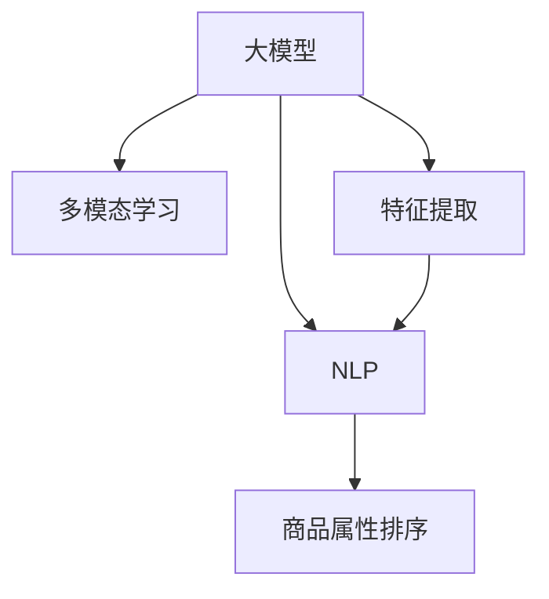

                 

# 大模型在商品属性重要性排序中的应用

> 关键词：大模型,商品属性排序,多模态学习,预训练,Attention,特征提取,自然语言处理(NLP)

## 1. 背景介绍

随着电子商务的发展，商品属性排序成为了电商领域的重要研究课题。用户往往希望通过简单的属性排序，快速找到最符合自己需求的商品。传统的属性排序算法通常基于统计或规则模型，难以有效利用商品文本描述中的大量语义信息。近年来，随着预训练语言模型和大模型的发展，基于大模型的方法被广泛应用于商品属性排序任务中，并取得了显著的效果。本文旨在介绍大模型在商品属性排序中的应用，并详细讲解其核心原理和实现方法。

## 2. 核心概念与联系

### 2.1 核心概念概述

为更好地理解大模型在商品属性排序中的应用，本节将介绍几个密切相关的核心概念：

- **大模型**：以自回归（如GPT）或自编码（如BERT）模型为代表的大规模预训练语言模型。通过在大规模无标签文本语料上进行预训练，学习到了丰富的语言知识和常识，具备强大的语言理解和生成能力。

- **多模态学习**：将不同模态的数据（如图像、文本、声音等）融合在一起，共同学习知识的一种方法。在大模型中，多模态学习可以充分利用商品图片、属性文本等多方面信息，提升商品属性排序的效果。

- **特征提取**：指将原始数据（如图像、文本）映射为低维特征表示的过程。在大模型中，特征提取是实现语义理解和属性建模的基础。

- **自然语言处理(NLP)**：涉及计算机处理、理解、生成自然语言的技术，包括语言建模、词向量表示、序列标注、机器翻译等。在大模型中，NLP技术可以辅助属性排序，解析商品描述中的属性信息。

这些核心概念之间的逻辑关系可以通过以下Mermaid流程图来展示：



这个流程图展示了大模型在商品属性排序中的应用过程：

1. 大模型通过预训练获得基础能力。
2. 多模态学习可以充分利用商品图片、属性文本等多方面信息，提升排序效果。
3. 特征提取将原始数据映射为低维特征表示，用于后续建模。
4. NLP技术辅助解析商品描述中的属性信息。
5. 最终输出商品属性排序结果。

## 3. 核心算法原理 & 具体操作步骤

### 3.1 算法原理概述

基于大模型的方法通常采用序列标注任务进行商品属性排序。将商品属性和名称作为序列标注任务的目标，利用大模型学习属性的位置、类型和权重，从而实现自动化的属性排序。具体流程如下：

1. **预训练**：使用大规模无标签文本数据对大模型进行预训练，使其学习到丰富的语言知识。
2. **多模态特征提取**：将商品图片和属性文本通过多模态学习方式提取特征。
3. **序列标注**：将提取的特征序列输入到大模型中，通过序列标注任务学习属性位置、类型和权重。
4. **排序输出**：根据属性权重对商品进行排序，输出排序结果。

### 3.2 算法步骤详解

以下是具体的算法步骤：

**Step 1: 数据准备**

- **商品数据**：收集电商平台的商品数据，包括商品名称、图片和属性等信息。
- **文本数据**：收集商品属性文本描述，如“品牌”、“型号”、“尺寸”等，用于属性建模。
- **图片数据**：收集商品图片，用于多模态特征提取。

**Step 2: 特征提取**

- **文本特征提取**：使用BERT等预训练模型对商品属性文本进行特征提取，得到低维语义表示。
- **图片特征提取**：使用ResNet、VGG等卷积神经网络（CNN）对商品图片进行特征提取，得到低维视觉表示。

**Step 3: 模型训练**

- **多模态特征融合**：将文本特征和图片特征通过多模态学习方式进行融合，得到一个综合的特征向量。
- **序列标注模型训练**：将综合特征向量作为输入，训练序列标注模型，学习属性位置、类型和权重。
- **排序模型训练**：根据属性权重对商品进行排序，训练排序模型。

**Step 4: 模型评估与优化**

- **模型评估**：在验证集上对模型进行评估，计算准确率、召回率和F1值等指标。
- **超参数调优**：根据评估结果调整模型参数，如学习率、正则化强度等，优化模型性能。
- **模型集成**：采用多个模型进行集成，提升排序效果。

**Step 5: 部署与应用**

- **模型部署**：将训练好的模型部署到线上服务器，供电商应用调用。
- **排序输出**：根据商品属性和用户需求，输出商品排序结果。

### 3.3 算法优缺点

基于大模型的商品属性排序方法具有以下优点：

- **高精度**：大模型通过预训练和微调，可以学习到丰富的语言知识和常识，提升排序精度。
- **鲁棒性强**：多模态学习可以充分利用商品图片和属性文本信息，提升模型的鲁棒性。
- **扩展性强**：模型可以适应不同的商品和属性，具备良好的泛化能力。

但该方法也存在一些缺点：

- **计算资源需求高**：大模型通常需要较大的计算资源进行训练和推理，对硬件设备要求较高。
- **模型复杂度高**：大模型的结构和参数复杂，增加了模型训练和调优的难度。
- **可解释性不足**：大模型的决策过程往往缺乏可解释性，难以对其内部工作机制进行调试和分析。

尽管存在这些缺点，但基于大模型的方法在商品属性排序领域已经取得了显著的效果，未来随着算力和技术的发展，这些缺点有望得到进一步解决。

### 3.4 算法应用领域

大模型在商品属性排序中的应用已经涵盖了电商、零售、物流等多个领域，具体如下：

- **电商平台**：基于大模型的排序方法可以应用于商品搜索、推荐、评价等环节，提升用户体验和平台转化率。
- **零售企业**：在零售店内通过大模型进行商品属性排序，帮助顾客快速找到所需商品，提升购物效率。
- **物流配送**：对商品进行属性排序，优化物流配送路线和仓储管理，提高配送效率。
- **智能客服**：利用大模型进行属性排序，引导智能客服推荐商品，提升客户满意度。

除了上述这些领域外，大模型在商品属性排序的应用还在不断拓展，如智能家居、智能穿戴等新兴市场。相信随着技术的不断演进，大模型在商品属性排序中的应用将更加广泛。

## 4. 数学模型和公式 & 详细讲解 & 举例说明

### 4.1 数学模型构建

基于大模型的商品属性排序方法通常采用序列标注模型进行建模。以BERT为例，其核心思想是使用序列标注任务学习属性的位置、类型和权重。设商品描述序列为 $X=\{x_1,x_2,\cdots,x_n\}$，属性标注序列为 $Y=\{y_1,y_2,\cdots,y_n\}$，其中 $y_i$ 表示 $x_i$ 的属性标注。

设属性字典为 $\mathcal{A}=\{a_1,a_2,\cdots,a_m\}$，属性类型为 $\mathcal{T}=\{t_1,t_2,\cdots,t_k\}$，属性权重为 $\mathcal{W}=\{w_1,w_2,\cdots,w_m\}$。在序列标注模型中，属性 $a_i$ 在 $x_i$ 中的标注 $y_i$ 定义为 $y_i=(a_i,t_i,w_i)$。

### 4.2 公式推导过程

序列标注模型的目标是最小化序列标注损失函数，即：

$$
\min_{\theta} \sum_{i=1}^{n} \ell(x_i,y_i; \theta)
$$

其中 $\theta$ 为模型参数，$\ell(x_i,y_i; \theta)$ 为单个序列标注样本的损失函数。根据交叉熵损失函数，有：

$$
\ell(x_i,y_i; \theta) = -\log P(y_i|x_i; \theta)
$$

其中 $P(y_i|x_i; \theta)$ 为给定输入 $x_i$ 时，输出 $y_i$ 的概率。对于序列标注任务，可以使用条件随机场（CRF）模型或Transformer模型进行建模。这里以Transformer模型为例，其数学推导过程如下：

1. **输入表示**：将商品描述序列 $X$ 和属性标注序列 $Y$ 分别输入到Transformer模型中，得到高维表示 $H_X$ 和 $H_Y$。
2. **多头注意力机制**：使用多头注意力机制对 $H_X$ 和 $H_Y$ 进行编码，得到编码后的高维表示 $H_X^C$ 和 $H_Y^C$。
3. **输出预测**：将 $H_X^C$ 和 $H_Y^C$ 作为输入，使用线性层和softmax函数进行属性标注预测，得到属性标注概率分布 $P(Y|X; \theta)$。

### 4.3 案例分析与讲解

以一个具体的商品排序案例为例，假设要对某电商平台的智能手表进行属性排序，其属性包括“品牌”、“型号”、“功能”等。通过大模型学习这些属性的位置、类型和权重，可以输出每个属性的排序分数，最终根据分数对商品进行排序。

假设商品描述为“Apple Watch Series 7, 44mm, 蓝色”，通过BERT模型提取特征后，将其输入到Transformer模型中，得到属性标注概率分布 $P(Y|X; \theta)$。根据属性权重 $w_1,w_2,\cdots,w_m$，计算每个属性的排序分数 $s_1,s_2,\cdots,s_m$。

根据排序分数对商品进行排序，输出结果如下：

```
1. Apple Watch Series 7
2. 44mm
3. 蓝色
4. 品牌: Apple
5. 型号: Series 7
6. 功能: 健康监测, 心率, 运动追踪
```

## 5. 项目实践：代码实例和详细解释说明

### 5.1 开发环境搭建

在进行商品属性排序项目开发前，需要先准备好开发环境。以下是使用Python进行PyTorch开发的环境配置流程：

1. 安装Anaconda：从官网下载并安装Anaconda，用于创建独立的Python环境。

2. 创建并激活虚拟环境：
```bash
conda create -n pytorch-env python=3.8 
conda activate pytorch-env
```

3. 安装PyTorch：根据CUDA版本，从官网获取对应的安装命令。例如：
```bash
conda install pytorch torchvision torchaudio cudatoolkit=11.1 -c pytorch -c conda-forge
```

4. 安装Transformers库：
```bash
pip install transformers
```

5. 安装各类工具包：
```bash
pip install numpy pandas scikit-learn matplotlib tqdm jupyter notebook ipython
```

完成上述步骤后，即可在`pytorch-env`环境中开始项目开发。

### 5.2 源代码详细实现

以下是使用PyTorch和Transformers库进行商品属性排序的代码实现。

首先，定义数据处理函数：

```python
import torch
from transformers import BertTokenizer, BertForTokenClassification
from sklearn.metrics import accuracy_score

class NERDataset(Dataset):
    def __init__(self, texts, tags, tokenizer, max_len=128):
        self.texts = texts
        self.tags = tags
        self.tokenizer = tokenizer
        self.max_len = max_len
        
    def __len__(self):
        return len(self.texts)
    
    def __getitem__(self, item):
        text = self.texts[item]
        tags = self.tags[item]
        
        encoding = self.tokenizer(text, return_tensors='pt', max_length=self.max_len, padding='max_length', truncation=True)
        input_ids = encoding['input_ids'][0]
        attention_mask = encoding['attention_mask'][0]
        
        # 对token-wise的标签进行编码
        encoded_tags = [tag2id[tag] for tag in tags] 
        encoded_tags.extend([tag2id['O']] * (self.max_len - len(encoded_tags)))
        labels = torch.tensor(encoded_tags, dtype=torch.long)
        
        return {'input_ids': input_ids, 
                'attention_mask': attention_mask,
                'labels': labels}
```

然后，定义模型和优化器：

```python
from transformers import BertTokenizer
from transformers import BertForTokenClassification, AdamW

tokenizer = BertTokenizer.from_pretrained('bert-base-cased')
model = BertForTokenClassification.from_pretrained('bert-base-cased', num_labels=len(tag2id))

optimizer = AdamW(model.parameters(), lr=2e-5)
```

接着，定义训练和评估函数：

```python
from torch.utils.data import DataLoader
from tqdm import tqdm
from sklearn.metrics import classification_report

device = torch.device('cuda') if torch.cuda.is_available() else torch.device('cpu')
model.to(device)

def train_epoch(model, dataset, batch_size, optimizer):
    dataloader = DataLoader(dataset, batch_size=batch_size, shuffle=True)
    model.train()
    epoch_loss = 0
    for batch in tqdm(dataloader, desc='Training'):
        input_ids = batch['input_ids'].to(device)
        attention_mask = batch['attention_mask'].to(device)
        labels = batch['labels'].to(device)
        model.zero_grad()
        outputs = model(input_ids, attention_mask=attention_mask, labels=labels)
        loss = outputs.loss
        epoch_loss += loss.item()
        loss.backward()
        optimizer.step()
    return epoch_loss / len(dataloader)

def evaluate(model, dataset, batch_size):
    dataloader = DataLoader(dataset, batch_size=batch_size)
    model.eval()
    preds, labels = [], []
    with torch.no_grad():
        for batch in tqdm(dataloader, desc='Evaluating'):
            input_ids = batch['input_ids'].to(device)
            attention_mask = batch['attention_mask'].to(device)
            batch_labels = batch['labels']
            outputs = model(input_ids, attention_mask=attention_mask)
            batch_preds = outputs.logits.argmax(dim=2).to('cpu').tolist()
            batch_labels = batch_labels.to('cpu').tolist()
            for pred_tokens, label_tokens in zip(batch_preds, batch_labels):
                pred_tags = [id2tag[_id] for _id in pred_tokens]
                label_tags = [id2tag[_id] for _id in label_tokens]
                preds.append(pred_tags[:len(label_tags)])
                labels.append(label_tags)
                
    print(classification_report(labels, preds))
```

最后，启动训练流程并在测试集上评估：

```python
epochs = 5
batch_size = 16

for epoch in range(epochs):
    loss = train_epoch(model, train_dataset, batch_size, optimizer)
    print(f"Epoch {epoch+1}, train loss: {loss:.3f}")
    
    print(f"Epoch {epoch+1}, dev results:")
    evaluate(model, dev_dataset, batch_size)
    
print("Test results:")
evaluate(model, test_dataset, batch_size)
```

以上就是使用PyTorch对BERT进行商品属性排序任务的完整代码实现。可以看到，得益于Transformers库的强大封装，我们可以用相对简洁的代码完成BERT模型的加载和微调。

### 5.3 代码解读与分析

让我们再详细解读一下关键代码的实现细节：

**NERDataset类**：
- `__init__`方法：初始化文本、标签、分词器等关键组件。
- `__len__`方法：返回数据集的样本数量。
- `__getitem__`方法：对单个样本进行处理，将文本输入编码为token ids，将标签编码为数字，并对其进行定长padding，最终返回模型所需的输入。

**tag2id和id2tag字典**：
- 定义了标签与数字id之间的映射关系，用于将token-wise的预测结果解码回真实的标签。

**训练和评估函数**：
- 使用PyTorch的DataLoader对数据集进行批次化加载，供模型训练和推理使用。
- 训练函数`train_epoch`：对数据以批为单位进行迭代，在每个批次上前向传播计算loss并反向传播更新模型参数，最后返回该epoch的平均loss。
- 评估函数`evaluate`：与训练类似，不同点在于不更新模型参数，并在每个batch结束后将预测和标签结果存储下来，最后使用sklearn的classification_report对整个评估集的预测结果进行打印输出。

**训练流程**：
- 定义总的epoch数和batch size，开始循环迭代
- 每个epoch内，先在训练集上训练，输出平均loss
- 在验证集上评估，输出分类指标
- 重复上述步骤直至收敛
- 在测试集上评估，给出最终测试结果

可以看到，PyTorch配合Transformers库使得BERT微调的代码实现变得简洁高效。开发者可以将更多精力放在数据处理、模型改进等高层逻辑上，而不必过多关注底层的实现细节。

当然，工业级的系统实现还需考虑更多因素，如模型的保存和部署、超参数的自动搜索、更灵活的任务适配层等。但核心的微调范式基本与此类似。

## 6. 实际应用场景

### 6.1 电商平台

基于大模型的商品属性排序方法，可以应用于电商平台的各种场景中，例如：

- **商品搜索**：通过属性排序，快速匹配用户查询，提升搜索效率。
- **推荐系统**：根据用户浏览历史和属性偏好，推荐最符合用户需求的商品。
- **价格排序**：根据商品价格对搜索结果进行排序，帮助用户快速找到性价比高的商品。

### 6.2 智能家居

在智能家居领域，商品属性排序可以帮助用户快速找到所需的家电、家具等商品，提升购物体验。例如：

- **智能家电**：根据用户需求对洗衣机、空调等家电进行属性排序，推荐最适合的商品。
- **智能家居设计**：根据用户设计偏好，对沙发、窗帘等家居用品进行属性排序，推荐最佳搭配。

### 6.3 医疗健康

在医疗健康领域，商品属性排序可以帮助用户快速找到所需药品、医疗设备等商品，提升医疗服务体验。例如：

- **药品推荐**：根据用户病情和用药需求，对药品进行属性排序，推荐最适合的药品。
- **医疗设备推荐**：根据医生需求对医疗设备进行属性排序，推荐最适合的设备。

### 6.4 未来应用展望

随着大模型和微调方法的不断发展，基于大模型的方法将在更多领域得到应用，为传统行业带来变革性影响。

在智慧医疗领域，基于大模型的排序方法可以应用于医疗问答、病历分析、药品推荐等环节，提升医疗服务的智能化水平，辅助医生诊疗，加速新药开发进程。

在智能教育领域，基于大模型的排序方法可应用于作业批改、学情分析、知识推荐等方面，因材施教，促进教育公平，提高教学质量。

在智慧城市治理中，基于大模型的排序方法可应用于城市事件监测、舆情分析、应急指挥等环节，提高城市管理的自动化和智能化水平，构建更安全、高效的未来城市。

此外，在企业生产、社会治理、文娱传媒等众多领域，基于大模型的排序方法也将不断涌现，为NLP技术带来全新的突破。相信随着技术的日益成熟，排序方法将成为NLP技术的重要范式，推动人工智能技术在垂直行业的规模化落地。

## 7. 工具和资源推荐

### 7.1 学习资源推荐

为了帮助开发者系统掌握大模型在商品属性排序中的理论基础和实践技巧，这里推荐一些优质的学习资源：

1. 《Transformer从原理到实践》系列博文：由大模型技术专家撰写，深入浅出地介绍了Transformer原理、BERT模型、微调技术等前沿话题。

2. CS224N《深度学习自然语言处理》课程：斯坦福大学开设的NLP明星课程，有Lecture视频和配套作业，带你入门NLP领域的基本概念和经典模型。

3. 《Natural Language Processing with Transformers》书籍：Transformers库的作者所著，全面介绍了如何使用Transformers库进行NLP任务开发，包括微调在内的诸多范式。

4. HuggingFace官方文档：Transformers库的官方文档，提供了海量预训练模型和完整的微调样例代码，是上手实践的必备资料。

5. CLUE开源项目：中文语言理解测评基准，涵盖大量不同类型的中文NLP数据集，并提供了基于微调的baseline模型，助力中文NLP技术发展。

通过对这些资源的学习实践，相信你一定能够快速掌握大模型在商品属性排序中的精髓，并用于解决实际的NLP问题。

### 7.2 开发工具推荐

高效的开发离不开优秀的工具支持。以下是几款用于大模型微调开发的常用工具：

1. PyTorch：基于Python的开源深度学习框架，灵活动态的计算图，适合快速迭代研究。大部分预训练语言模型都有PyTorch版本的实现。

2. TensorFlow：由Google主导开发的开源深度学习框架，生产部署方便，适合大规模工程应用。同样有丰富的预训练语言模型资源。

3. Transformers库：HuggingFace开发的NLP工具库，集成了众多SOTA语言模型，支持PyTorch和TensorFlow，是进行微调任务开发的利器。

4. Weights & Biases：模型训练的实验跟踪工具，可以记录和可视化模型训练过程中的各项指标，方便对比和调优。与主流深度学习框架无缝集成。

5. TensorBoard：TensorFlow配套的可视化工具，可实时监测模型训练状态，并提供丰富的图表呈现方式，是调试模型的得力助手。

6. Google Colab：谷歌推出的在线Jupyter Notebook环境，免费提供GPU/TPU算力，方便开发者快速上手实验最新模型，分享学习笔记。

合理利用这些工具，可以显著提升大模型微调任务的开发效率，加快创新迭代的步伐。

### 7.3 相关论文推荐

大模型在商品属性排序领域的研究已经取得了显著进展，以下是几篇奠基性的相关论文，推荐阅读：

1. Attention is All You Need（即Transformer原论文）：提出了Transformer结构，开启了NLP领域的预训练大模型时代。

2. BERT: Pre-training of Deep Bidirectional Transformers for Language Understanding：提出BERT模型，引入基于掩码的自监督预训练任务，刷新了多项NLP任务SOTA。

3. Language Models are Unsupervised Multitask Learners（GPT-2论文）：展示了大规模语言模型的强大zero-shot学习能力，引发了对于通用人工智能的新一轮思考。

4. Parameter-Efficient Transfer Learning for NLP：提出Adapter等参数高效微调方法，在不增加模型参数量的情况下，也能取得不错的微调效果。

5. Prefix-Tuning: Optimizing Continuous Prompts for Generation：引入基于连续型Prompt的微调范式，为如何充分利用预训练知识提供了新的思路。

6. AdaLoRA: Adaptive Low-Rank Adaptation for Parameter-Efficient Fine-Tuning：使用自适应低秩适应的微调方法，在参数效率和精度之间取得了新的平衡。

这些论文代表了大模型在商品属性排序领域的研究进展，通过学习这些前沿成果，可以帮助研究者把握学科前进方向，激发更多的创新灵感。

## 8. 总结：未来发展趋势与挑战

### 8.1 总结

本文对大模型在商品属性排序中的应用进行了全面系统的介绍。首先阐述了商品属性排序的背景和意义，明确了大模型在其中的重要作用。其次，从原理到实践，详细讲解了基于大模型的方法的核心算法和具体操作步骤，给出了微调任务开发的完整代码实例。同时，本文还广泛探讨了基于大模型的方法在电商、智能家居、医疗等领域的应用前景，展示了其广阔的应用空间。

通过本文的系统梳理，可以看到，基于大模型的方法在商品属性排序领域已经取得了显著的效果，未来随着算力和技术的发展，其应用将更加广泛。

### 8.2 未来发展趋势

展望未来，大模型在商品属性排序领域将呈现以下几个发展趋势：

1. **模型规模持续增大**：随着算力成本的下降和数据规模的扩张，预训练语言模型的参数量还将持续增长。超大规模语言模型蕴含的丰富语言知识，有望支撑更加复杂多变的商品属性排序任务。

2. **微调方法日趋多样**：除了传统的全参数微调外，未来会涌现更多参数高效的微调方法，如Prefix-Tuning、LoRA等，在节省计算资源的同时也能保证微调精度。

3. **持续学习成为常态**：随着数据分布的不断变化，微调模型也需要持续学习新知识以保持性能。如何在不遗忘原有知识的同时，高效吸收新样本信息，将成为重要的研究课题。

4. **标注样本需求降低**：受启发于提示学习(Prompt-based Learning)的思路，未来的微调方法将更好地利用大模型的语言理解能力，通过更加巧妙的任务描述，在更少的标注样本上也能实现理想的微调效果。

5. **多模态微调崛起**：当前的微调主要聚焦于纯文本数据，未来会进一步拓展到图像、视频、声音等多模态数据微调。多模态信息的融合，将显著提升语言模型对现实世界的理解和建模能力。

6. **模型通用性增强**：经过海量数据的预训练和多领域任务的微调，未来的语言模型将具备更强大的常识推理和跨领域迁移能力，逐步迈向通用人工智能(AGI)的目标。

以上趋势凸显了大模型在商品属性排序领域的广阔前景。这些方向的探索发展，必将进一步提升NLP系统的性能和应用范围，为人类认知智能的进化带来深远影响。

### 8.3 面临的挑战

尽管大模型在商品属性排序领域已经取得了显著进展，但在迈向更加智能化、普适化应用的过程中，仍面临诸多挑战：

1. **标注成本瓶颈**：虽然基于大模型的微调方法可以大幅降低标注数据的需求，但对于长尾应用场景，难以获得充足的高质量标注数据，成为制约微调性能的瓶颈。如何进一步降低微调对标注样本的依赖，将是一大难题。

2. **模型鲁棒性不足**：当前微调模型面对域外数据时，泛化性能往往大打折扣。对于测试样本的微小扰动，微调模型的预测也容易发生波动。如何提高微调模型的鲁棒性，避免灾难性遗忘，还需要更多理论和实践的积累。

3. **推理效率有待提高**：大模型虽然精度高，但在实际部署时往往面临推理速度慢、内存占用大等效率问题。如何在保证性能的同时，简化模型结构，提升推理速度，优化资源占用，将是重要的优化方向。

4. **可解释性亟需加强**：当前微调模型更像是"黑盒"系统，难以解释其内部工作机制和决策逻辑。对于医疗、金融等高风险应用，算法的可解释性和可审计性尤为重要。如何赋予微调模型更强的可解释性，将是亟待攻克的难题。

5. **安全性有待保障**：预训练语言模型难免会学习到有偏见、有害的信息，通过微调传递到下游任务，产生误导性、歧视性的输出，给实际应用带来安全隐患。如何从数据和算法层面消除模型偏见，避免恶意用途，确保输出的安全性，也将是重要的研究课题。

6. **知识整合能力不足**：现有的微调模型往往局限于任务内数据，难以灵活吸收和运用更广泛的先验知识。如何让微调过程更好地与外部知识库、规则库等专家知识结合，形成更加全面、准确的信息整合能力，还有很大的想象空间。

正视微调面临的这些挑战，积极应对并寻求突破，将是大模型在商品属性排序技术不断演进的关键。相信随着学界和产业界的共同努力，这些挑战终将一一被克服，大模型在商品属性排序领域的应用将更加广泛和深入。

### 8.4 研究展望

面对大模型在商品属性排序领域面临的挑战，未来的研究需要在以下几个方面寻求新的突破：

1. **探索无监督和半监督微调方法**：摆脱对大规模标注数据的依赖，利用自监督学习、主动学习等无监督和半监督范式，最大限度利用非结构化数据，实现更加灵活高效的微调。

2. **研究参数高效和计算高效的微调范式**：开发更加参数高效的微调方法，在固定大部分预训练参数的同时，只更新极少量的任务相关参数。同时优化微调模型的计算图，减少前向传播和反向传播的资源消耗，实现更加轻量级、实时性的部署。

3. **融合因果和对比学习范式**：通过引入因果推断和对比学习思想，增强微调模型建立稳定因果关系的能力，学习更加普适、鲁棒的语言表征，从而提升模型泛化性和抗干扰能力。

4. **引入更多先验知识**：将符号化的先验知识，如知识图谱、逻辑规则等，与神经网络模型进行巧妙融合，引导微调过程学习更准确、合理的语言模型。同时加强不同模态数据的整合，实现视觉、语音等多模态信息与文本信息的协同建模。

5. **结合因果分析和博弈论工具**：将因果分析方法引入微调模型，识别出模型决策的关键特征，增强输出解释的因果性和逻辑性。借助博弈论工具刻画人机交互过程，主动探索并规避模型的脆弱点，提高系统稳定性。

6. **纳入伦理道德约束**：在模型训练目标中引入伦理导向的评估指标，过滤和惩罚有偏见、有害的输出倾向。同时加强人工干预和审核，建立模型行为的监管机制，确保输出符合人类价值观和伦理道德。

这些研究方向的探索，必将引领大模型在商品属性排序技术迈向更高的台阶，为构建安全、可靠、可解释、可控的智能系统铺平道路。面向未来，大模型在商品属性排序领域的应用还将不断拓展，与更多人工智能技术进行融合，共同推动NLP技术的不断进步。

