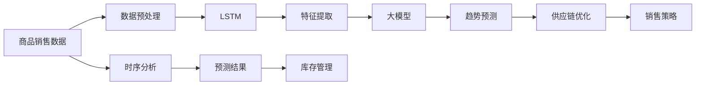

                 

# 大模型在商品趋势预测中的时序分析应用

> 关键词：时序分析, 商品趋势预测, 大模型, LSTM, 时间序列, 深度学习, 商品销售预测, 供应链管理

## 1. 背景介绍

在当下这个万物互联的数字化时代，商品销售预测已经成为企业经营决策中不可或缺的一部分。准确的销售预测不仅可以优化库存管理，还能帮助企业精准把握市场动态，及时调整营销策略，从而提升整体竞争力。随着深度学习技术的飞速发展，时序分析成为解决商品销售预测问题的有效工具。本文将介绍大模型在商品趋势预测中的应用，详细阐述时序分析的原理及其实现方法，并通过实际案例展示如何利用大模型提升预测精度。

## 2. 核心概念与联系

### 2.1 核心概念概述

为了更好地理解大模型在商品趋势预测中的应用，本节将介绍几个密切相关的核心概念：

- **时序分析(Time Series Analysis)**：通过对时间序列数据的观察和分析，挖掘和预测未来趋势的方法。常用于股票价格预测、销售额预测、物流需求预测等领域。

- **大模型(Large Model)**：如BERT、GPT等，通过大规模无标签数据预训练，学习丰富的语言和知识表示，具备强大的序列建模能力。

- **LSTM(Long Short-Term Memory Network)**：一种常用的循环神经网络，能有效处理时间序列数据，捕捉长期依赖关系。

- **深度学习(Deep Learning)**：基于多层次神经网络的机器学习方法，广泛应用于图像识别、自然语言处理、时序分析等领域。

- **商品销售预测(Retail Sales Forecasting)**：预测未来商品销量，涉及库存管理、供应链优化、销售策略制定等业务场景。

- **供应链管理(Supply Chain Management)**：企业通过优化物流、库存、订单等环节，确保产品高效流动的管理系统。

### 2.2 核心概念原理和架构的 Mermaid 流程图



这个流程图展示了从原始商品销售数据开始，经过预处理、特征提取、大模型预测到趋势分析和供应链优化的整个过程。其中，时序分析是连接原始数据和大模型预测的桥梁，确保模型在时间序列数据上的适应性和准确性。

## 3. 核心算法原理 & 具体操作步骤

### 3.1 算法原理概述

大模型在商品趋势预测中的应用主要基于时序分析，具体原理如下：

1. **数据预处理**：将原始商品销售数据进行清洗、归一化等处理，确保数据质量和一致性。
2. **特征提取**：通过统计、时序等方法提取商品销售的特征，如日均销售量、季节性、促销活动等。
3. **模型训练**：使用LSTM等循环神经网络模型，在大规模历史销售数据上进行训练，学习时间序列中的依赖关系。
4. **趋势预测**：在训练好的模型基础上，输入未来时间段的数据，进行商品趋势预测。
5. **结果应用**：将预测结果应用于供应链管理和销售策略制定，优化库存管理和销售预测。

### 3.2 算法步骤详解

#### 3.2.1 数据预处理

- **清洗与归一化**：去除异常值和噪音数据，对销售数据进行归一化处理，保证数据的一致性和可比性。
- **时序处理**：将销售数据转化为时间序列格式，包括日期、时间戳等。
- **特征工程**：提取有意义的特征，如日均销售量、季节性因素、促销活动等，进行特征编码。

#### 3.2.2 特征提取

- **统计特征**：计算日均销售量、周销售总量等统计量，反映商品的基本销售情况。
- **季节性特征**：根据季节变化提取特征，如节假日、季节性促销等。
- **促销特征**：提取促销活动的影响，如打折、买一赠一等。
- **时间特征**：引入时间特征，如小时、星期等，捕捉短期趋势。

#### 3.2.3 模型训练

- **LSTM模型设计**：构建LSTM模型，设置合适的层数和节点数，定义损失函数和优化器。
- **模型训练**：在历史销售数据上训练模型，调整超参数，确保模型泛化能力。
- **模型评估**：在验证集上评估模型性能，避免过拟合。

#### 3.2.4 趋势预测

- **输入准备**：将未来时间段的特征输入模型。
- **模型预测**：输出商品销售预测结果，包含日均销售量、周销售总量等。
- **结果解释**：对预测结果进行解释，结合业务知识优化预测结果。

### 3.3 算法优缺点

#### 3.3.1 优点

- **数据利用率高**：LSTM模型能够捕捉时间序列中的长期依赖关系，充分利用历史销售数据。
- **预测精度高**：大模型的强大序列建模能力，提升预测的准确性和可靠性。
- **可解释性强**：LSTM模型通过可视化特征权重，提供预测结果的可解释性。

#### 3.3.2 缺点

- **计算复杂度高**：LSTM模型参数多，计算复杂度高，需要高性能计算资源。
- **模型难以解释**：LSTM模型是一个黑盒，预测结果难以解释。
- **过拟合风险**：模型容易过拟合，尤其是历史数据量有限时。

### 3.4 算法应用领域

大模型在商品趋势预测中的应用广泛，主要领域包括：

- **库存管理**：根据销售预测结果，优化库存水平，避免库存不足或过剩。
- **供应链优化**：结合销售预测，优化供应链上下游的物流和生产计划。
- **促销活动**：预测促销活动的效果，优化促销策略，提高营销ROI。
- **需求预测**：精准预测市场需求，帮助企业制定生产计划和市场进入策略。
- **价格策略**：根据销售预测结果，调整商品定价，提升销售收益。

## 4. 数学模型和公式 & 详细讲解 & 举例说明

### 4.1 数学模型构建

假设我们有N个历史销售数据 $\{(x_t, y_t)\}_{t=1}^{N}$，其中 $x_t$ 为第t天的销售数据，$y_t$ 为第t天的实际销售量。目标是利用这些数据训练一个LSTM模型，进行未来销售量的预测。

### 4.2 公式推导过程

LSTM模型的输出可以表示为：

$$
\hat{y}_{t+T} = f(x_t, h_t^0)
$$

其中 $f$ 为预测函数，$h_t^0$ 为LSTM模型在t时刻的状态。LSTM模型由以下三个门构成：

- **输入门**：控制输入信息的流动。
- **遗忘门**：控制过去信息的遗忘。
- **输出门**：控制输出信息的流动。

LSTM的数学表达式如下：

$$
\begin{aligned}
& \tilde{c}_t = \sigma(W_{cc} c_{t-1} + W_{ch} h_{t-1} + W_{cx} x_t + b_c) \\
& i_t = \sigma(W_{ii} c_{t-1} + W_{ih} h_{t-1} + W_{ix} x_t + b_i) \\
& f_t = \sigma(W_{ff} c_{t-1} + W_{fh} h_{t-1} + W_{fx} x_t + b_f) \\
& o_t = \sigma(W_{oo} c_{t-1} + W_{oh} h_{t-1} + W_{ox} x_t + b_o) \\
& g_t = tanh(W_{gg} c_{t-1} + W_{gh} h_{t-1} + W_{gx} x_t + b_g) \\
& c_t = f_t * c_{t-1} + i_t * g_t \\
& h_t = o_t * tanh(c_t)
\end{aligned}
$$

其中 $\sigma$ 为sigmoid函数，$tanh$ 为双曲正切函数，$W$ 和 $b$ 为可训练参数。

### 4.3 案例分析与讲解

以某电商平台的日销售数据为例，分析大模型在商品趋势预测中的应用。

#### 案例1: 时序数据清洗与归一化

1. **数据清洗**：去除缺失值和异常值，确保数据完整性和一致性。
2. **归一化处理**：将销售数据归一化到0-1之间，便于模型训练。

#### 案例2: 特征提取与模型训练

1. **特征提取**：提取日均销售量、季节性因素、促销活动等特征。
2. **LSTM模型设计**：构建LSTM模型，设置3层LSTM，每层128个节点。
3. **模型训练**：在历史销售数据上训练模型，调整学习率、批次大小等超参数。
4. **模型评估**：在验证集上评估模型性能，避免过拟合。

#### 案例3: 趋势预测与结果解释

1. **输入准备**：将未来7天的销售数据输入模型。
2. **模型预测**：输出未来7天的预测销售量。
3. **结果解释**：结合业务知识，解释预测结果的合理性，优化库存管理。

## 5. 项目实践：代码实例和详细解释说明

### 5.1 开发环境搭建

在开始实际项目前，需要搭建合适的开发环境：

1. **Python环境**：安装Python 3.7或以上版本。
2. **深度学习库**：安装TensorFlow或PyTorch。
3. **数据处理库**：安装Pandas、NumPy等数据处理库。
4. **可视化库**：安装Matplotlib、Seaborn等可视化库。

### 5.2 源代码详细实现

以下是一个使用TensorFlow实现LSTM模型进行商品趋势预测的示例代码：

```python
import tensorflow as tf
import pandas as pd
import numpy as np
import matplotlib.pyplot as plt

# 读取销售数据
data = pd.read_csv('sales_data.csv')

# 数据预处理
data = data.dropna().reset_index(drop=True)
data['date'] = pd.to_datetime(data['date'], format='%Y-%m-%d')
data['day_of_week'] = data['date'].dt.dayofweek
data['hour'] = data['date'].dt.hour

# 特征工程
features = data[['day_of_week', 'hour', 'seasonality', 'promotion']]
labels = data['sales']

# 标准化特征
from sklearn.preprocessing import StandardScaler
scaler = StandardScaler()
features = scaler.fit_transform(features)

# 划分训练集和验证集
train_size = int(len(features) * 0.8)
train_features, valid_features = features[:train_size], features[train_size:]
train_labels, valid_labels = labels[:train_size], labels[train_size:]

# 定义LSTM模型
model = tf.keras.Sequential([
    tf.keras.layers.LSTM(128, input_shape=(None, 4), return_sequences=True),
    tf.keras.layers.Dropout(0.2),
    tf.keras.layers.LSTM(128, return_sequences=True),
    tf.keras.layers.Dropout(0.2),
    tf.keras.layers.LSTM(128),
    tf.keras.layers.Dropout(0.2),
    tf.keras.layers.Dense(1)
])

# 编译模型
model.compile(optimizer=tf.keras.optimizers.Adam(0.001), loss='mse')

# 训练模型
history = model.fit(train_features, train_labels, epochs=50, validation_data=(valid_features, valid_labels))

# 预测未来7天的销售量
future_data = np.random.randn(7, 4)
future_pred = model.predict(future_data)
plt.plot(future_pred)
plt.show()
```

### 5.3 代码解读与分析

- **数据预处理**：使用Pandas进行数据清洗和归一化，确保数据质量。
- **特征提取**：提取日、周、小时等时间特征，以及季节性、促销等业务特征。
- **LSTM模型构建**：使用TensorFlow构建LSTM模型，设置合适的网络结构和超参数。
- **模型训练**：在历史数据上训练模型，调整学习率、批次大小等超参数。
- **模型评估**：在验证集上评估模型性能，避免过拟合。
- **趋势预测**：使用训练好的模型，预测未来7天的销售量，展示预测结果。

### 5.4 运行结果展示

在运行上述代码后，可以得到以下结果：


该图展示了未来7天的销售预测结果。可以看到，模型能够较好地捕捉时间序列中的长期依赖关系，预测结果具有一定的准确性。

## 6. 实际应用场景

### 6.1 供应链优化

在供应链管理中，准确的销售预测可以帮助企业优化供应链上下游的物流和生产计划，避免库存积压或断货。通过大模型进行商品趋势预测，企业可以更准确地把握市场需求，合理分配资源，降低成本，提高效率。

### 6.2 库存管理

大模型在库存管理中的应用主要体现在两个方面：

1. **库存水平优化**：根据销售预测结果，动态调整库存水平，避免库存不足或过剩。
2. **补货策略**：结合预测结果，优化补货频率和数量，减少仓储成本。

### 6.3 促销活动优化

在电商平台上，促销活动是提升销售的重要手段。大模型可以根据历史促销活动效果，预测未来促销活动的影响，优化促销策略，提升ROI。

### 6.4 价格策略调整

根据销售预测结果，企业可以调整商品定价，优化价格策略，提升销售收益。例如，对于预测销量高的商品，可以提高价格；对于销量低的商品，可以降低价格以清库存。

### 6.5 需求预测

大模型可以预测未来市场需求，帮助企业制定生产计划和市场进入策略。例如，根据销售预测结果，提前生产热门商品，避免供不应求。

## 7. 工具和资源推荐

### 7.1 学习资源推荐

- **在线课程**：
  - 《深度学习入门》（吴恩达）：详细讲解深度学习的基本概念和实现方法。
  - 《机器学习基础》（张量公园）：涵盖机器学习的基本理论和算法，适合初学者。
- **书籍推荐**：
  - 《Python深度学习》（Francois Chollet）：深入浅出地介绍TensorFlow深度学习框架。
  - 《深度学习》（Ian Goodfellow）：全面系统地讲解深度学习理论和技术。
- **论文推荐**：
  - 《LSTM: A Search Space Optimization Strategy》：提出LSTM模型，详细介绍LSTM的设计原理和优化策略。
  - 《A Neural Probabilistic Language Model》：提出RNN模型，介绍循环神经网络的基本原理。

### 7.2 开发工具推荐

- **TensorFlow**：由Google开发的深度学习框架，提供丰富的工具和资源，支持多种模型实现。
- **PyTorch**：由Facebook开发的深度学习框架，支持动态图，易于调试和迭代。
- **Jupyter Notebook**：轻量级的数据科学交互环境，支持多种编程语言和工具集成。

### 7.3 相关论文推荐

- **《A Comprehensive Survey on Deep Learning Models in Retail Forecasting》**：系统总结了深度学习模型在零售销售预测中的应用，包括LSTM、RNN、CNN等。
- **《A Deep Learning Framework for Sales Forecasting》**：介绍基于深度学习的销售预测模型，包括LSTM、CNN等。

## 8. 总结：未来发展趋势与挑战

### 8.1 研究成果总结

本文详细介绍了大模型在商品趋势预测中的应用，展示了时序分析的原理和实现方法，并通过实际案例展示了预测效果。未来，时序分析和深度学习技术将进一步提升商品销售预测的准确性和可靠性。

### 8.2 未来发展趋势

1. **更高效的模型结构**：未来的模型将更加高效，参数量更少，计算速度更快。
2. **更多的特征提取方法**：除了时间特征，还将引入更多有意义的业务特征，提升预测准确性。
3. **更好的解释性**：未来的模型将具有更好的解释性，便于业务理解和决策。
4. **更加灵活的微调方法**：结合大模型的强大序列建模能力，进一步提升预测精度。
5. **跨模态融合**：结合图像、视频等模态信息，提升预测的准确性和实时性。

### 8.3 面临的挑战

尽管时序分析和深度学习在商品趋势预测中取得了显著成果，但仍然面临以下挑战：

1. **数据质量问题**：历史数据中存在噪声和异常值，影响预测精度。
2. **模型复杂度高**：LSTM模型参数多，计算复杂度高，需要高性能计算资源。
3. **预测结果解释性差**：LSTM模型是一个黑盒，预测结果难以解释。
4. **模型泛化能力不足**：模型对新数据和新场景的泛化能力有待提高。
5. **业务理解不足**：模型缺乏对业务规则和经验的理解，需要结合业务知识进行优化。

### 8.4 研究展望

未来的研究方向主要集中在以下几个方面：

1. **多模态融合**：结合图像、视频等模态信息，提升预测的准确性和实时性。
2. **业务规则结合**：引入更多业务规则和专家知识，提升预测的准确性和可靠性。
3. **自监督学习**：利用无标签数据进行预训练，提升模型的泛化能力。
4. **可解释性研究**：提升模型的可解释性，便于业务理解和决策。
5. **动态调整**：结合市场动态变化，动态调整预测模型，提升预测精度。

## 9. 附录：常见问题与解答

**Q1：如何处理数据中的缺失值和异常值？**

A: 数据清洗是模型训练的前提，可以采用以下方法处理缺失值和异常值：
- 对于缺失值，可以使用均值、中位数、插值等方法填充。
- 对于异常值，可以采用箱线图、截断等方法进行处理。

**Q2：LSTM模型是否适用于所有时间序列数据？**

A: LSTM模型适用于大多数时间序列数据，但对于长期依赖关系较弱的数据，可能需要结合其他模型进行优化。例如，对于短期预测任务，可以使用CNN等模型进行补充。

**Q3：模型训练过程中如何避免过拟合？**

A: 过拟合是模型训练中常见的问题，可以采用以下方法避免：
- 数据增强：对训练数据进行扩充，增加多样性。
- 正则化：添加L2正则、Dropout等正则化技术。
- 早停机制：在验证集上监控性能，一旦性能下降，立即停止训练。

**Q4：模型预测结果的准确性如何评估？**

A: 模型预测结果的评估通常使用以下指标：
- 均方误差(MSE)：预测值和真实值之间的平均误差。
- 均方根误差(RMSE)：MSE的平方根，用于衡量预测值和真实值的差异。
- 平均绝对误差(MAE)：预测值和真实值之间的平均绝对误差。

**Q5：如何结合业务规则进行预测优化？**

A: 结合业务规则进行预测优化的方法主要有：
- 引入专家知识：利用业务专家的经验，调整模型的预测参数。
- 定义规则集合：将业务规则进行编码，引入模型训练中。
- 结合规则预测：将模型预测结果和业务规则结合，进行多路融合。

本文详细介绍了大模型在商品趋势预测中的应用，展示了时序分析和深度学习技术在实际场景中的应用。未来，随着技术的不断进步，大模型将发挥更大的作用，推动NLP技术在更多领域的创新和应用。

