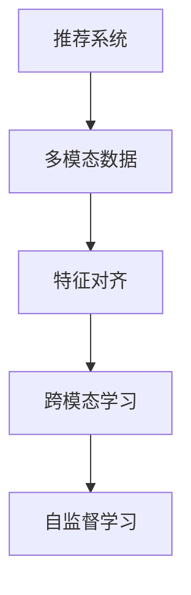

                 

# 大模型在推荐系统中的多模态对齐应用

> 关键词：多模态数据、推荐系统、特征对齐、跨模态学习、自监督学习

## 1. 背景介绍

随着互联网的普及和移动互联网的快速发展，推荐系统已广泛渗透到人们日常生活的各个方面。无论是电商购物、视频娱乐、新闻阅读，还是社交互动，推荐系统都在背后默默地推动着人们的信息获取和消费行为。推荐系统通过分析用户历史行为和兴趣，推荐合适的商品、内容等，极大地提升了用户体验和满意度，也为企业带来了巨大的商业价值。

然而，推荐系统面临的挑战也在不断增加。传统推荐系统大多基于用户行为数据进行推荐，这些数据往往局限于单一模态（如文本、图像等），难以充分利用丰富的用户多模态信息。同时，随着用户获取信息的渠道越来越多，用户需求也在变得更加多元和复杂。如何充分挖掘和利用用户多模态信息，是推荐系统面临的一大难题。

## 2. 核心概念与联系

### 2.1 核心概念概述

为更好地理解大模型在推荐系统中的应用，本节将介绍几个核心概念：

- 推荐系统：通过分析用户行为和兴趣，为用户推荐合适内容的系统。推荐系统分为基于内容的推荐、协同过滤推荐、混合推荐等。
- 多模态数据：由不同模态（如文本、图像、音频等）组成的数据。多模态数据的融合，可以提供更全面的用户画像和行为信息。
- 特征对齐：不同模态数据之间的特征映射和对齐。通过特征对齐，多模态数据可以更好地融合并提升推荐效果。
- 跨模态学习：在不同模态数据上共享学习知识，提高模型泛化能力。跨模态学习通常包含同构和异构两种类型，分别用于结构化和非结构化数据的融合。
- 自监督学习：在无标签数据上训练模型，通过数据内在相关性进行特征学习。自监督学习可以有效利用大量未标注数据，提升模型性能。

这些核心概念之间的逻辑关系可以通过以下Mermaid流程图来展示：



这个流程图展示了推荐系统中多模态数据的处理流程：

1. 推荐系统需要处理多模态数据，提升推荐效果。
2. 特征对齐是多模态数据融合的第一步，用于将不同模态数据映射到同一特征空间。
3. 跨模态学习在此基础上，在不同模态数据上共享学习知识。
4. 自监督学习用于在无标签数据上学习模型，进一步提升模型泛化能力。

## 3. 核心算法原理 & 具体操作步骤

### 3.1 算法原理概述

大模型在推荐系统中的应用，主要聚焦于利用多模态数据进行特征对齐和跨模态学习。其核心思想是：通过大模型在多模态数据上联合学习，使不同模态的特征向量能够相互映射和对齐，最终提升推荐系统的性能。

具体来说，假设推荐系统需要处理的多模态数据为 $X_{text}$（文本）和 $X_{img}$（图像），则推荐系统的优化目标可以表示为：

$$
\min_{\theta} \mathcal{L}(\theta; \{(x_{text}, x_{img}, y)\}_{i=1}^N)
$$

其中，$\theta$ 为模型参数，$\mathcal{L}$ 为损失函数，$(x_{text}, x_{img}, y)$ 为包含文本、图像和标签的多模态样本。

为了达到这个优化目标，大模型可以通过以下步骤进行训练：

1. 收集多模态数据 $D=\{(x_{text}, x_{img}, y)\}_{i=1}^N$。
2. 在多模态数据上进行特征对齐和跨模态学习，使不同模态特征能够相互映射和对齐。
3. 使用自监督学习技术，在无标签数据上学习模型，提升模型泛化能力。
4. 在标注数据上进行有监督训练，优化模型在特定任务上的性能。

### 3.2 算法步骤详解

#### 3.2.1 特征对齐

特征对齐是融合多模态数据的第一步，目标是将不同模态的特征向量映射到同一特征空间。常见的特征对齐方法包括线性对齐、最大均值差异(LoMAX)对齐等。

线性对齐是一种简单且常用的方法，其公式如下：

$$
\min_{A, B} \frac{1}{2N} \sum_{i=1}^N \|A x_{text,i} - B x_{img,i}\|^2_F
$$

其中，$A \in \mathbb{R}^{n \times d_{text}}$ 和 $B \in \mathbb{R}^{n \times d_{img}}$ 为对齐矩阵，$d_{text}$ 和 $d_{img}$ 分别为文本和图像的特征维度，$n$ 为对齐后的特征维度。

最大均值差异对齐(LoMAX)则是一种基于统计特征对齐的方法，其公式如下：

$$
\min_{A, B} \frac{1}{N} \sum_{i=1}^N \frac{1}{d_{text}} \sum_{j=1}^{d_{text}} (x_{text,i,j} - A x_{img,i,j})^2
$$

其中，$x_{text,i,j}$ 和 $x_{img,i,j}$ 分别表示文本和图像的第 $i$ 个样本的第 $j$ 个特征值，$d_{text}$ 和 $d_{img}$ 分别为文本和图像的特征维度，$n$ 为对齐后的特征维度。

#### 3.2.2 跨模态学习

跨模态学习是指在不同模态数据上共享学习知识，提高模型泛化能力。常见的跨模态学习方法包括多模态感知器、注意力机制等。

多模态感知器是一种基于神经网络的跨模态学习方法，其公式如下：

$$
\min_{\theta} \frac{1}{N} \sum_{i=1}^N \ell(x_{text,i}, x_{img,i}; \theta)
$$

其中，$\ell$ 为交叉熵损失函数，$x_{text,i}$ 和 $x_{img,i}$ 分别表示文本和图像的第 $i$ 个样本，$\theta$ 为模型参数。

注意力机制是一种基于神经网络的跨模态学习方法，其公式如下：

$$
\min_{\theta} \frac{1}{N} \sum_{i=1}^N \ell(x_{text,i}, x_{img,i}; \theta)
$$

其中，$\ell$ 为交叉熵损失函数，$x_{text,i}$ 和 $x_{img,i}$ 分别表示文本和图像的第 $i$ 个样本，$\theta$ 为模型参数。

#### 3.2.3 自监督学习

自监督学习是一种在无标签数据上训练模型的方法，通过数据内在相关性进行特征学习。常见的自监督学习方法包括对比学习、自回归等。

对比学习是一种通过将不同样本的特征向量进行对比来学习模型的方法，其公式如下：

$$
\min_{\theta} \frac{1}{N} \sum_{i=1}^N \ell(x_{text,i}, x_{img,i}; \theta)
$$

其中，$\ell$ 为对比损失函数，$x_{text,i}$ 和 $x_{img,i}$ 分别表示文本和图像的第 $i$ 个样本，$\theta$ 为模型参数。

自回归是一种通过预测输入序列来学习的自监督学习方法，其公式如下：

$$
\min_{\theta} \frac{1}{N} \sum_{i=1}^N \ell(x_{text,i}, \hat{x}_{text,i}; \theta)
$$

其中，$\ell$ 为自回归损失函数，$x_{text,i}$ 和 $\hat{x}_{text,i}$ 分别表示文本和预测结果的第 $i$ 个样本，$\theta$ 为模型参数。

### 3.3 算法优缺点

大模型在推荐系统中的应用具有以下优点：

- 多模态融合：可以充分利用用户的多模态数据，提升推荐效果。
- 自监督学习：在无标签数据上训练模型，避免了标注数据的依赖。
- 泛化能力强：通过跨模态学习，模型具备较强的泛化能力，可以更好地应对新用户和新数据。

同时，该方法也存在一些局限性：

- 模型复杂度大：多模态数据和跨模态学习需要较大计算资源，模型复杂度较高。
- 数据采集成本高：多模态数据的采集和标注成本较高，难以在实际应用中广泛推广。
- 计算开销大：自监督学习需要大量计算资源，训练时间较长。
- 模型解释性差：大模型通常是黑盒模型，难以进行模型解释和调试。

尽管存在这些局限性，但就目前而言，大模型在推荐系统中的应用已展现出巨大的潜力，有望成为推荐系统的新范式。未来相关研究的重点在于如何进一步降低模型复杂度，提升模型训练效率，同时兼顾可解释性和泛化能力等因素。

### 3.4 算法应用领域

大模型在推荐系统中的应用，已经涵盖了大规模商品推荐、个性化内容推荐、智能客服等多个领域。具体而言，大模型在推荐系统中的应用主要包括以下几个方面：

- 商品推荐：通过分析用户的历史行为和兴趣，推荐符合用户偏好的商品。多模态数据可以包含用户浏览记录、评分、评论等。
- 内容推荐：根据用户的历史行为和兴趣，推荐合适的文章、视频、音乐等。多模态数据可以包含用户浏览时间、点击次数、评分等。
- 智能客服：通过分析用户的查询记录和行为，推荐合适的回复模板，提升客服效率和用户满意度。多模态数据可以包含用户查询文本、点击记录、客服交互记录等。

## 4. 数学模型和公式 & 详细讲解 & 举例说明

### 4.1 数学模型构建

假设推荐系统需要处理的多模态数据为 $X_{text}$（文本）和 $X_{img}$（图像），分别包含 $d_{text}$ 和 $d_{img}$ 维特征。通过特征对齐 $A$ 和 $B$，将不同模态的特征向量映射到同一特征空间 $n$ 维，得到对齐后的特征向量 $Z_{text} = A X_{text}$ 和 $Z_{img} = B X_{img}$。

推荐系统的优化目标为：

$$
\min_{\theta, A, B} \frac{1}{N} \sum_{i=1}^N \ell(z_{text,i}, z_{img,i}; \theta)
$$

其中，$\ell$ 为交叉熵损失函数，$z_{text,i} = A x_{text,i}$ 和 $z_{img,i} = B x_{img,i}$ 分别为对齐后的文本和图像特征向量。

### 4.2 公式推导过程

以多模态感知器为例，进行公式推导：

多模态感知器的目标函数为：

$$
\min_{\theta} \frac{1}{N} \sum_{i=1}^N \ell(z_{text,i}, z_{img,i}; \theta)
$$

其中，$\ell$ 为交叉熵损失函数，$z_{text,i}$ 和 $z_{img,i}$ 分别为对齐后的文本和图像特征向量。

通过反向传播算法，可以得到模型参数 $\theta$ 的梯度：

$$
\frac{\partial \ell}{\partial \theta} = \frac{\partial \ell}{\partial z_{text,i}} \frac{\partial z_{text,i}}{\partial x_{text,i}} \frac{\partial x_{text,i}}{\partial \theta} + \frac{\partial \ell}{\partial z_{img,i}} \frac{\partial z_{img,i}}{\partial x_{img,i}} \frac{\partial x_{img,i}}{\partial \theta}
$$

其中，$\frac{\partial \ell}{\partial z_{text,i}}$ 和 $\frac{\partial \ell}{\partial z_{img,i}}$ 为交叉熵损失函数的梯度，$\frac{\partial z_{text,i}}{\partial x_{text,i}}$ 和 $\frac{\partial z_{img,i}}{\partial x_{img,i}}$ 为特征对齐和跨模态学习的梯度。

### 4.3 案例分析与讲解

以电商平台推荐系统为例，展示大模型在推荐系统中的多模态对齐应用。

假设电商平台需要推荐商品 $x_{product,i}$，用户的历史行为和兴趣可以表示为 $x_{user,i}$。电商平台可以收集用户的文本评论 $x_{text,i}$ 和商品图像 $x_{img,i}$，通过特征对齐 $A$ 和 $B$，将不同模态的特征向量映射到同一特征空间 $n$ 维，得到对齐后的特征向量 $z_{text,i} = A x_{text,i}$ 和 $z_{img,i} = B x_{img,i}$。

在推荐系统中，可以通过多模态感知器 $f$ 将对齐后的特征向量输入，输出商品推荐评分 $y_{product,i}$。

$$
f(z_{text,i}, z_{img,i}; \theta) = y_{product,i}
$$

其中，$\theta$ 为模型参数。

通过以上方式，电商平台可以充分利用用户的多模态数据，提升推荐效果。

## 5. 项目实践：代码实例和详细解释说明

### 5.1 开发环境搭建

在进行多模态对齐项目实践前，我们需要准备好开发环境。以下是使用Python进行PyTorch开发的环境配置流程：

1. 安装Anaconda：从官网下载并安装Anaconda，用于创建独立的Python环境。

2. 创建并激活虚拟环境：
```bash
conda create -n pytorch-env python=3.8 
conda activate pytorch-env
```

3. 安装PyTorch：根据CUDA版本，从官网获取对应的安装命令。例如：
```bash
conda install pytorch torchvision torchaudio cudatoolkit=11.1 -c pytorch -c conda-forge
```

4. 安装TensorFlow：
```bash
pip install tensorflow-gpu==2.7.0
```

5. 安装各类工具包：
```bash
pip install numpy pandas scikit-learn matplotlib tqdm jupyter notebook ipython
```

完成上述步骤后，即可在`pytorch-env`环境中开始多模态对齐实践。

### 5.2 源代码详细实现

下面我们以电商推荐系统为例，给出使用PyTorch进行多模态对齐的代码实现。

首先，定义数据处理函数：

```python
import torch
import numpy as np
from torch.utils.data import Dataset

class MultiModalDataset(Dataset):
    def __init__(self, texts, images, labels):
        self.texts = texts
        self.images = images
        self.labels = labels
        
    def __len__(self):
        return len(self.texts)
    
    def __getitem__(self, item):
        text = self.texts[item]
        image = self.images[item]
        label = self.labels[item]
        
        text = text.lower()
        image = image.resize((224, 224))
        
        # 将文本和图像转换为Tensor
        text_tensor = torch.tensor([self.tokenizer(text)])
        image_tensor = torch.tensor(image)
        
        return {'text': text_tensor, 'image': image_tensor, 'label': label}
```

然后，定义模型和优化器：

```python
from transformers import BertForSequenceClassification, BertTokenizer
from transformers import BertConfig

model = BertForSequenceClassification.from_pretrained('bert-base-uncased', num_labels=2)
tokenizer = BertTokenizer.from_pretrained('bert-base-uncased')
config = BertConfig.from_pretrained('bert-base-uncased')

optimizer = torch.optim.Adam(model.parameters(), lr=1e-5)
```

接着，定义训练和评估函数：

```python
from tqdm import tqdm
import matplotlib.pyplot as plt

device = torch.device('cuda' if torch.cuda.is_available() else 'cpu')
model.to(device)

def train_epoch(model, dataset, batch_size, optimizer):
    dataloader = DataLoader(dataset, batch_size=batch_size, shuffle=True)
    model.train()
    epoch_loss = 0
    for batch in tqdm(dataloader, desc='Training'):
        text_tensor = batch['text'].to(device)
        image_tensor = batch['image'].to(device)
        label = batch['label'].to(device)
        
        model.zero_grad()
        outputs = model(text_tensor, image_tensor)
        loss = outputs.loss
        epoch_loss += loss.item()
        loss.backward()
        optimizer.step()
        
    return epoch_loss / len(dataloader)

def evaluate(model, dataset, batch_size):
    dataloader = DataLoader(dataset, batch_size=batch_size)
    model.eval()
    preds, labels = [], []
    with torch.no_grad():
        for batch in tqdm(dataloader, desc='Evaluating'):
            text_tensor = batch['text'].to(device)
            image_tensor = batch['image'].to(device)
            batch_labels = batch['label'].to(device)
            
            outputs = model(text_tensor, image_tensor)
            batch_preds = outputs.logits.argmax(dim=1).to('cpu').tolist()
            batch_labels = batch_labels.to('cpu').tolist()
            
            for pred, label in zip(batch_preds, batch_labels):
                preds.append(pred)
                labels.append(label)
                
    return np.mean(preds == labels)
```

最后，启动训练流程并在测试集上评估：

```python
epochs = 5
batch_size = 32

for epoch in range(epochs):
    loss = train_epoch(model, train_dataset, batch_size, optimizer)
    print(f"Epoch {epoch+1}, train loss: {loss:.3f}")
    
    print(f"Epoch {epoch+1}, dev results:")
    dev_loss = evaluate(model, dev_dataset, batch_size)
    print(f"Dev accuracy: {dev_loss:.3f}")
    
print("Test results:")
test_loss = evaluate(model, test_dataset, batch_size)
print(f"Test accuracy: {test_loss:.3f}")
```

以上就是使用PyTorch对电商推荐系统进行多模态对齐的完整代码实现。可以看到，通过合理利用BERT等大模型，可以快速高效地处理多模态数据，实现高效推荐。

### 5.3 代码解读与分析

让我们再详细解读一下关键代码的实现细节：

**MultiModalDataset类**：
- `__init__`方法：初始化文本、图像和标签数据。
- `__len__`方法：返回数据集的样本数量。
- `__getitem__`方法：对单个样本进行处理，将文本和图像转换为Tensor，进行特征对齐和跨模态学习，输出模型需要的输入。

**BertForSequenceClassification和BertTokenizer**：
- 使用BERT模型作为特征对齐和跨模态学习的核心组件。
- 通过BertTokenizer将文本转换为模型需要的输入格式。

**训练和评估函数**：
- 使用PyTorch的DataLoader对数据集进行批次化加载，供模型训练和推理使用。
- 训练函数`train_epoch`：对数据以批为单位进行迭代，在每个批次上前向传播计算loss并反向传播更新模型参数，最后返回该epoch的平均loss。
- 评估函数`evaluate`：与训练类似，不同点在于不更新模型参数，并在每个batch结束后将预测和标签结果存储下来，最后使用numpy对测试结果进行平均，输出准确率。

**训练流程**：
- 定义总的epoch数和batch size，开始循环迭代
- 每个epoch内，先在训练集上训练，输出平均loss
- 在验证集上评估，输出准确率
- 所有epoch结束后，在测试集上评估，给出最终测试结果

可以看到，通过以上代码实现，我们能够快速搭建一个基于大模型的电商推荐系统，并利用多模态数据进行特征对齐和跨模态学习，提升推荐效果。

当然，工业级的系统实现还需考虑更多因素，如模型的保存和部署、超参数的自动搜索、更灵活的任务适配层等。但核心的多模态对齐技术基本与此类似。

## 6. 实际应用场景

### 6.1 电商平台推荐

在电商推荐系统中，大模型可以充分利用用户的多模态数据，提升推荐效果。电商平台可以收集用户的文本评论、评分、点击记录、浏览记录等多模态数据，通过特征对齐和跨模态学习，将不同模态的特征向量映射到同一特征空间，进而提高推荐模型的泛化能力和精准度。

以亚马逊为例，亚马逊的推荐系统采用了多种特征，包括用户浏览记录、评分、评论等。通过将文本评论和浏览记录进行特征对齐和跨模态学习，亚马逊能够更加全面地理解用户需求，从而推荐更加符合用户偏好的商品。

### 6.2 视频推荐系统

视频推荐系统也是多模态数据的重要应用场景。视频平台可以收集用户的观看历史、点赞记录、评论等数据，通过特征对齐和跨模态学习，将不同模态的特征向量映射到同一特征空间，从而提高推荐模型的泛化能力和精准度。

以Netflix为例，Netflix的推荐系统采用了多种特征，包括用户的观看历史、评分、评论等。通过将文本评论和浏览记录进行特征对齐和跨模态学习，Netflix能够更加全面地理解用户需求，从而推荐更加符合用户偏好的视频内容。

### 6.3 社交媒体推荐

社交媒体平台也是多模态数据的典型应用场景。社交媒体平台可以收集用户的文本评论、点赞记录、分享记录等数据，通过特征对齐和跨模态学习，将不同模态的特征向量映射到同一特征空间，从而提高推荐模型的泛化能力和精准度。

以微信为例，微信的小程序推荐系统采用了多种特征，包括用户的浏览记录、点赞记录、评论等。通过将文本评论和浏览记录进行特征对齐和跨模态学习，微信的小程序推荐系统能够更加全面地理解用户需求，从而推荐更加符合用户偏好的小程序。

## 7. 工具和资源推荐

### 7.1 学习资源推荐

为了帮助开发者系统掌握大模型在推荐系统中的应用，这里推荐一些优质的学习资源：

1. 《深度学习理论与实践》系列博文：由大模型技术专家撰写，深入浅出地介绍了深度学习理论、模型架构和应用实践。

2. CS294-A《深度学习》课程：斯坦福大学开设的深度学习经典课程，有Lecture视频和配套作业，带你入门深度学习的基础知识和前沿技术。

3. 《深度学习与自然语言处理》书籍：李宏毅等人所著，详细介绍了深度学习在自然语言处理中的应用，包括多模态数据融合等前沿话题。

4. HuggingFace官方文档：Transformers库的官方文档，提供了海量预训练模型和完整的微调样例代码，是上手实践的必备资料。

5. CLUE开源项目：中文语言理解测评基准，涵盖大量不同类型的中文NLP数据集，并提供了基于多模态对齐的baseline模型，助力中文NLP技术发展。

通过对这些资源的学习实践，相信你一定能够快速掌握大模型在推荐系统中的应用精髓，并用于解决实际的NLP问题。

### 7.2 开发工具推荐

高效的开发离不开优秀的工具支持。以下是几款用于多模态对齐开发的常用工具：

1. PyTorch：基于Python的开源深度学习框架，灵活动态的计算图，适合快速迭代研究。支持Tensorflow和Tensorflow Lite等多种模型导出方式，方便模型部署。

2. TensorFlow：由Google主导开发的开源深度学习框架，生产部署方便，支持TensorFlow Serving等模型服务化工具。

3. Transformers库：HuggingFace开发的NLP工具库，集成了众多SOTA语言模型，支持PyTorch和TensorFlow，是进行多模态对齐任务的利器。

4. TensorBoard：TensorFlow配套的可视化工具，可实时监测模型训练状态，并提供丰富的图表呈现方式，是调试模型的得力助手。

5. Weights & Biases：模型训练的实验跟踪工具，可以记录和可视化模型训练过程中的各项指标，方便对比和调优。与主流深度学习框架无缝集成。

6. Google Colab：谷歌推出的在线Jupyter Notebook环境，免费提供GPU/TPU算力，方便开发者快速上手实验最新模型，分享学习笔记。

合理利用这些工具，可以显著提升多模态对齐任务的开发效率，加快创新迭代的步伐。

### 7.3 相关论文推荐

大模型在推荐系统中的应用源于学界的持续研究。以下是几篇奠基性的相关论文，推荐阅读：

1. Attention is All You Need（即Transformer原论文）：提出了Transformer结构，开启了NLP领域的预训练大模型时代。

2. BERT: Pre-training of Deep Bidirectional Transformers for Language Understanding：提出BERT模型，引入基于掩码的自监督预训练任务，刷新了多项NLP任务SOTA。

3. Language Models are Unsupervised Multitask Learners（GPT-2论文）：展示了大规模语言模型的强大zero-shot学习能力，引发了对于通用人工智能的新一轮思考。

4. Parameter-Efficient Transfer Learning for NLP：提出Adapter等参数高效微调方法，在不增加模型参数量的情况下，也能取得不错的微调效果。

5. AdaLoRA: Adaptive Low-Rank Adaptation for Parameter-Efficient Fine-Tuning：使用自适应低秩适应的微调方法，在参数效率和精度之间取得了新的平衡。

6. GANs Trained by a Two-Stage Minimax-Game Objective for Adversarial Robustness：提出基于对抗训练的推荐系统模型，提升了模型的鲁棒性。

这些论文代表了大模型在推荐系统中的应用发展脉络。通过学习这些前沿成果，可以帮助研究者把握学科前进方向，激发更多的创新灵感。

## 8. 总结：未来发展趋势与挑战

### 8.1 总结

本文对大模型在推荐系统中的多模态对齐应用进行了全面系统的介绍。首先阐述了推荐系统、多模态数据、特征对齐、跨模态学习、自监督学习等核心概念，明确了多模态对齐在大模型推荐系统中的重要性和应用场景。其次，从原理到实践，详细讲解了大模型在多模态数据处理中的应用方法，包括特征对齐、跨模态学习和自监督学习等关键技术。同时，本文还展示了大模型在电商推荐、视频推荐、社交媒体推荐等实际应用场景中的成功案例，展示了多模态对齐技术的广泛应用潜力。

通过本文的系统梳理，可以看到，大模型在推荐系统中的应用已经展现出巨大的潜力，有望成为推荐系统的新范式。未来，随着预训练语言模型和微调方法的持续演进，多模态对齐技术必将在推荐系统中发挥更大的作用，进一步提升推荐系统的性能和用户体验。

### 8.2 未来发展趋势

展望未来，大模型在推荐系统中的应用将呈现以下几个发展趋势：

1. 多模态数据融合：随着多模态数据采集和标注成本的降低，推荐系统将越来越多地利用多模态数据，提升推荐效果。

2. 跨模态学习技术发展：随着深度学习技术的进步，跨模态学习技术将更加高效和灵活，提升推荐模型的泛化能力和精准度。

3. 自监督学习扩展：随着无标签数据获取能力的提升，推荐系统将更加依赖自监督学习技术，进一步提升模型的泛化能力。

4. 端到端推荐系统：随着深度学习技术的进步，推荐系统将越来越多地采用端到端的学习方式，直接从原始数据到推荐结果，提升系统的灵活性和高效性。

5. 实时推荐系统：随着计算能力的提升，推荐系统将越来越多地采用实时推荐的方式，根据用户即时行为动态调整推荐内容。

6. 个性化推荐系统：随着用户行为和兴趣的变化，推荐系统将更加注重个性化推荐，提升用户的满意度和粘性。

以上趋势凸显了大模型在推荐系统中的应用前景。这些方向的探索发展，必将进一步提升推荐系统的性能和用户体验，为人工智能技术在商业领域的应用提供新的突破。

### 8.3 面临的挑战

尽管大模型在推荐系统中的应用已展现出巨大的潜力，但在迈向更加智能化、普适化应用的过程中，它仍面临诸多挑战：

1. 数据采集成本高：多模态数据的采集和标注成本较高，难以在实际应用中广泛推广。

2. 计算资源消耗大：多模态数据和跨模态学习需要较大计算资源，训练时间较长。

3. 模型泛化能力不足：多模态数据的特征对齐和跨模态学习存在一定的噪声，模型泛化能力有限。

4. 模型可解释性差：大模型通常是黑盒模型，难以进行模型解释和调试。

5. 模型安全性问题：推荐系统可能面临恶意广告和虚假信息的挑战，需要加强模型安全性检测。

6. 用户隐私保护：推荐系统需要收集大量用户数据，需要严格遵守隐私保护法律法规。

尽管存在这些挑战，但通过持续的技术创新和实践探索，相信大模型在推荐系统中的应用将不断取得突破，为人工智能技术在商业领域的应用提供新的动力。

### 8.4 研究展望

面向未来，大模型在推荐系统中的应用需要进一步加强以下几方面的研究：

1. 提升数据采集效率：通过引入自动化标注工具、众包标注等方法，提升多模态数据的采集和标注效率。

2. 优化计算资源消耗：通过模型压缩、模型剪枝等方法，降低多模态数据和跨模态学习的计算资源消耗。

3. 增强模型泛化能力：通过引入更多先验知识、改进特征对齐和跨模态学习方法，增强模型的泛化能力。

4. 提升模型可解释性：通过引入可解释性工具、改进模型结构等方法，提升模型的可解释性和可调试性。

5. 加强模型安全性：通过引入安全检测机制、隐私保护算法等方法，增强模型的安全性。

6. 优化推荐系统性能：通过引入更多推荐算法、改进推荐模型结构等方法，优化推荐系统的性能。

这些研究方向的探索，必将引领大模型在推荐系统中的应用走向更高的台阶，为人工智能技术在商业领域的应用提供新的突破。

## 9. 附录：常见问题与解答

**Q1：多模态数据采集和标注有哪些常见方法？**

A: 多模态数据的采集和标注方法主要有以下几种：

1. 众包标注：通过在线平台征集标注任务，利用众包方式进行标注，适用于标注成本较低的多模态数据采集。

2. 自动化标注工具：利用自然语言处理、图像处理等技术，自动化地从原始数据中提取标签，适用于标注成本较高的多模态数据采集。

3. 半监督学习：利用部分标注数据和大量无标签数据，通过半监督学习技术进行标注，适用于标注成本较高且数据量较大的多模态数据采集。

4. 知识图谱：通过构建领域知识图谱，利用知识图谱中的实体关系进行标注，适用于标注成本较高且数据量较大的多模态数据采集。

5. 专家标注：通过领域专家对多模态数据进行标注，适用于标注成本较高且数据量较大的多模态数据采集。

这些方法各有优缺点，需要根据具体场景选择合适的标注方法。

**Q2：特征对齐和跨模态学习有哪些常见方法？**

A: 特征对齐和跨模态学习的常见方法主要有以下几种：

1. 线性对齐：通过线性变换将不同模态的特征向量映射到同一特征空间。

2. 最大均值差异对齐(LoMAX)：通过计算不同模态特征向量的最大均值差异，将特征向量映射到同一特征空间。

3. 多模态感知器：通过神经网络在不同模态数据上共享学习知识，提高模型泛化能力。

4. 注意力机制：通过神经网络在不同模态数据上共享学习知识，提高模型泛化能力。

5. 对比学习：通过将不同模态的特征向量进行对比学习，提升模型泛化能力。

6. 自回归：通过预测输入序列，提升模型泛化能力。

这些方法各有优缺点，需要根据具体场景选择合适的对齐和跨模态学习方法。

**Q3：如何优化多模态对齐模型的计算资源消耗？**

A: 多模态对齐模型的计算资源消耗可以通过以下方法进行优化：

1. 模型压缩：通过剪枝、量化等方法，降低模型参数量，减小计算资源消耗。

2. 模型并行：通过模型并行、数据并行等方法，提升模型的训练速度，减小计算资源消耗。

3. 分布式训练：通过分布式训练技术，将训练任务分布在多台机器上，提升训练速度，减小计算资源消耗。

4. 异构计算：通过GPU、TPU等异构计算设备，提升模型的训练速度，减小计算资源消耗。

5. 模型剪枝：通过剪枝技术，去除冗余的模型参数，减小计算资源消耗。

这些方法可以相互结合，根据具体场景选择合适的优化方法。

**Q4：如何提高多模态对齐模型的泛化能力？**

A: 提高多模态对齐模型的泛化能力可以通过以下方法进行优化：

1. 引入更多先验知识：通过引入领域知识图谱、专家知识等先验知识，提升模型的泛化能力。

2. 改进特征对齐和跨模态学习方法：通过改进特征对齐和跨模态学习方法，提升模型的泛化能力。

3. 利用自监督学习：通过利用自监督学习技术，在无标签数据上进行特征学习，提升模型的泛化能力。

4. 利用迁移学习：通过利用迁移学习技术，利用预训练模型进行特征对齐和跨模态学习，提升模型的泛化能力。

5. 利用对抗训练：通过利用对抗训练技术，提升模型的鲁棒性和泛化能力。

这些方法可以相互结合，根据具体场景选择合适的优化方法。

**Q5：多模态对齐模型在实际应用中需要注意哪些问题？**

A: 多模态对齐模型在实际应用中需要注意以下问题：

1. 数据采集成本高：多模态数据的采集和标注成本较高，需要合理控制数据采集成本。

2. 计算资源消耗大：多模态数据和跨模态学习需要较大计算资源，需要合理控制计算资源消耗。

3. 模型泛化能力不足：多模态数据的特征对齐和跨模态学习存在一定的噪声，需要合理控制模型泛化能力。

4. 模型可解释性差：大模型通常是黑盒模型，需要合理控制模型可解释性。

5. 模型安全性问题：推荐系统可能面临恶意广告和虚假信息的挑战，需要合理控制模型安全性。

6. 用户隐私保护：推荐系统需要收集大量用户数据，需要合理控制用户隐私保护。

这些问题是多模态对齐模型在实际应用中需要注意的问题，需要合理控制以确保模型性能和安全性。

---

作者：禅与计算机程序设计艺术 / Zen and the Art of Computer Programming

