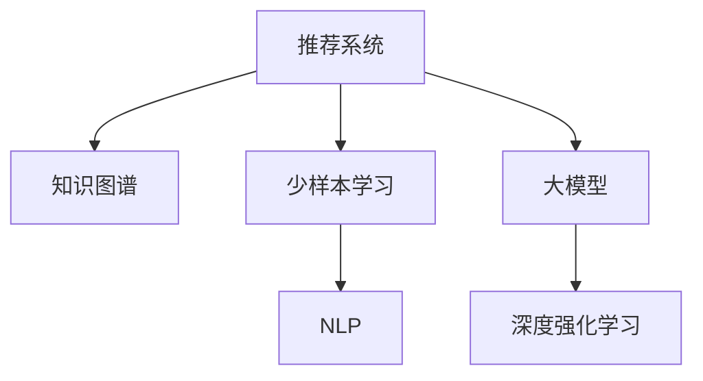

                 

# 大模型在推荐系统中的少样本学习应用

> 关键词：推荐系统, 少样本学习, 大模型, 知识图谱, 深度强化学习, 自然语言处理(NLP), 推荐算法, 强化学习

## 1. 背景介绍

### 1.1 问题由来
在数字化时代，推荐系统成为互联网产品不可或缺的重要组件，广泛应用于电商、视频、社交网络等多个领域。推荐系统旨在根据用户历史行为和兴趣，为用户推荐感兴趣的物品，提升用户满意度和平台转化率。

然而，推荐系统面临诸多挑战，尤其是数据量和样本质量对系统效果的影响巨大。实际业务场景中，用户数据往往稀疏且不均衡，难以覆盖所有用户和物品，导致推荐效果受限。此外，推荐系统的训练通常需要大量的历史数据，包括用户行为数据、物品属性数据等，训练成本高，部署效率低。

为了应对这些挑战，研究者们提出了多种解决方案，包括矩阵分解、协同过滤、基于深度学习的推荐算法等。但这些方法仍然存在数据需求大、模型复杂等问题。因此，近年来，研究人员开始探索在大模型基础上，应用少样本学习来优化推荐系统，极大地提升了推荐系统的效率和效果。

### 1.2 问题核心关键点
大模型在推荐系统中的少样本学习应用，旨在通过大规模预训练语言模型（如BERT、GPT等），在少量标注数据的情况下，快速适配目标任务，提升推荐系统的性能。这种方法主要基于以下几个关键点：
- 利用大模型的强大语义理解能力，减少推荐算法对数据量和样本质量的需求。
- 通过知识图谱的融合，将隐式语义信息与显式用户行为数据结合，提升推荐结果的准确性和多样性。
- 引入深度强化学习，通过与用户互动，动态调整推荐策略，适应用户变化的需求。
- 结合自然语言处理（NLP）技术，对推荐结果进行描述性建模，提供更具吸引力的推荐内容。

## 2. 核心概念与联系

### 2.1 核心概念概述

为更好地理解大模型在推荐系统中的少样本学习应用，本节将介绍几个密切相关的核心概念：

- 推荐系统(Recommendation System)：旨在根据用户的历史行为和兴趣，为用户推荐物品的系统。常见的推荐算法包括基于矩阵分解的方法、协同过滤、基于深度学习的推荐算法等。
- 知识图谱(Knowledge Graph)：由节点和边构成的图结构数据，用于描述实体间的关系和属性，广泛应用于推荐系统、搜索引擎等领域。
- 少样本学习(Few-shot Learning)：指在只有少量标注样本的情况下，模型能够快速适应新任务的学习方法。
- 大模型(Large Model)：如BERT、GPT等大规模预训练语言模型，通过在大规模无标签文本数据上进行预训练，学习到丰富的语言知识和常识。
- 深度强化学习(Deep Reinforcement Learning)：通过与环境的互动，模型能够不断优化自身策略，实现动态推荐。

这些核心概念之间的逻辑关系可以通过以下Mermaid流程图来展示：



这个流程图展示了大模型在推荐系统中的核心概念及其之间的关系：

1. 推荐系统通过收集用户历史行为数据和物品属性数据，为用户提供个性化的推荐。
2. 知识图谱用于描述实体间的关系和属性，提升推荐的语义理解和多样性。
3. 少样本学习通过利用大模型的强大语义理解能力，减少推荐算法对数据量和样本质量的需求。
4. 大模型通过预训练学习到丰富的语言知识和常识，用于知识图谱的构建和优化。
5. 深度强化学习通过与用户的互动，动态调整推荐策略，提升推荐系统的实时性。
6. NLP技术用于对推荐结果进行描述性建模，提高推荐内容的表现力。

这些概念共同构成了大模型在推荐系统中的应用框架，使其能够在各种场景下发挥强大的推荐能力。通过理解这些核心概念，我们可以更好地把握大模型在推荐系统中的应用方向。

## 3. 核心算法原理 & 具体操作步骤
### 3.1 算法原理概述

基于少样本学习的大模型推荐系统，主要利用预训练语言模型在少量标注数据上的微调能力，结合知识图谱和深度强化学习技术，提升推荐系统的性能。其核心思想是：将大模型视为强大的特征提取器，通过少样本微调，在目标任务上进行有监督的优化，从而获得针对特定任务优化的推荐模型。

形式化地，假设目标推荐任务为 $T$，微调使用的预训练语言模型为 $M_{\theta}$，其中 $\theta$ 为预训练得到的模型参数。给定推荐任务 $T$ 的少量标注数据集 $D=\{(x_i,y_i)\}_{i=1}^N$，其中 $x_i$ 为用户行为或物品属性信息，$y_i$ 为目标推荐结果。微调的目标是找到新的模型参数 $\hat{\theta}$，使得：

$$
\hat{\theta}=\mathop{\arg\min}_{\theta} \mathcal{L}(M_{\theta},D)
$$

其中 $\mathcal{L}$ 为针对推荐任务设计的损失函数，用于衡量模型预测输出与真实标签之间的差异。常见的损失函数包括均方误差损失、交叉熵损失等。

通过梯度下降等优化算法，微调过程不断更新模型参数 $\theta$，最小化损失函数 $\mathcal{L}$，使得模型输出逼近真实标签。由于 $\theta$ 已经通过预训练获得了较好的初始化，因此即便在少量数据集 $D$ 上进行微调，也能较快收敛到理想的模型参数 $\hat{\theta}$。

### 3.2 算法步骤详解

基于少样本学习的大模型推荐系统一般包括以下几个关键步骤：

**Step 1: 准备预训练模型和数据集**
- 选择合适的预训练语言模型 $M_{\theta}$ 作为初始化参数，如 BERT、GPT 等。
- 准备推荐任务 $T$ 的少量标注数据集 $D$，划分为训练集、验证集和测试集。一般要求标注数据与预训练数据的分布不要差异过大。

**Step 2: 构建知识图谱**
- 收集推荐任务涉及的实体和关系数据，构建知识图谱。可以使用Wikidata、Freebase等公共数据集，也可以从推荐系统历史数据中提取。
- 利用GNN等方法，在知识图谱上进行图神经网络训练，学习实体间的关系和属性。

**Step 3: 微调推荐模型**
- 根据推荐任务类型，在预训练模型的顶层设计合适的输出层和损失函数。
- 对于推荐排序任务，通常在顶层添加线性分类器和均方误差损失函数。
- 对于推荐生成任务，通常使用深度强化学习模型，如DQN、A3C等，动态生成推荐结果。
- 在少量标注数据上进行微调，以较小的学习率更新模型参数。

**Step 4: 引入深度强化学习**
- 将推荐系统与环境互动，通过奖励机制和惩罚机制，训练深度强化学习模型。
- 利用经验回放、目标网络等技巧，提高模型稳定性和收敛速度。
- 将推荐结果与实际行为数据进行对比，不断优化推荐策略。

**Step 5: 融合NLP技术**
- 使用NLP技术对推荐结果进行文本描述，提升推荐内容的吸引力和可理解性。
- 引入提示学习(Prompt-based Learning)技术，通过精心设计的输入格式，引导模型生成更具创意的推荐内容。
- 利用情感分析、主题分类等NLP技术，进一步优化推荐内容的个性化和相关性。

**Step 6: 部署和监控**
- 将微调后的推荐模型部署到实际应用中，进行大规模推荐服务。
- 持续收集新数据，定期重新微调模型，以适应数据分布的变化。
- 对推荐结果进行监控和评估，确保系统稳定性和推荐效果。

以上是基于少样本学习的大模型推荐系统的一般流程。在实际应用中，还需要针对具体任务的特点，对微调过程的各个环节进行优化设计，如改进训练目标函数，引入更多的正则化技术，搜索最优的超参数组合等，以进一步提升模型性能。

### 3.3 算法优缺点

基于少样本学习的大模型推荐系统具有以下优点：
1. 数据需求降低。通过利用大模型的强大语义理解能力，减少推荐算法对数据量和样本质量的需求，在少样本情况下也能取得较好效果。
2. 实时性提升。通过深度强化学习技术，推荐系统能够动态调整策略，实时响应用户变化的需求。
3. 多模态融合。结合知识图谱和NLP技术，能够处理多模态数据，提升推荐系统的泛化能力和表现力。
4. 鲁棒性增强。大模型的泛化能力较强，能够应对新领域和冷启动用户的推荐需求。

同时，该方法也存在一定的局限性：
1. 对标注数据质量要求高。虽然数据需求降低，但标注数据的准确性和多样性对推荐系统性能有重要影响。
2. 模型复杂度增加。融合知识图谱和NLP技术后，模型结构变得复杂，训练和推理效率较低。
3. 对抗样本风险。深度强化学习模型对对抗样本可能较为敏感，需注意对抗性攻击的风险。
4. 可解释性不足。推荐系统的复杂性增加了模型的可解释性难度，难以解释推荐结果的决策过程。

尽管存在这些局限性，但就目前而言，基于少样本学习的大模型推荐方法仍是大规模推荐系统应用的重要范式。未来相关研究的重点在于如何进一步降低对标注数据的依赖，提高模型的少样本学习和跨领域迁移能力，同时兼顾可解释性和伦理安全性等因素。

### 3.4 算法应用领域

基于少样本学习的大模型推荐系统，已经在电商、视频、音乐等多个领域得到了广泛的应用，覆盖了几乎所有常见推荐场景，例如：

- 商品推荐：为电商用户推荐感兴趣的商品。结合用户浏览记录和商品属性，进行推荐排序。
- 内容推荐：为用户推荐喜欢的文章、视频、音乐等。通过用户阅读行为、观看记录进行个性化推荐。
- 社交推荐：为用户推荐其社交网络中的好友或感兴趣的用户。结合用户好友信息和兴趣标签进行推荐。
- 广告推荐：为用户推荐符合其兴趣的广告。通过用户搜索记录和点击行为进行广告投放。
- 新闻推荐：为用户推荐感兴趣的新闻。通过用户阅读行为和新闻内容进行内容匹配。

除了上述这些经典任务外，大模型在推荐系统中的应用还在不断拓展，如可控推荐、跨平台推荐等，为推荐系统带来了新的突破。随着预训练模型和少样本学习方法的不断进步，相信推荐系统必将在更多领域得到应用，为数字经济的数字化转型升级提供新的动力。

## 4. 数学模型和公式 & 详细讲解  
### 4.1 数学模型构建

本节将使用数学语言对基于少样本学习的大模型推荐系统进行更加严格的刻画。

记目标推荐任务为 $T$，用户行为数据为 $X=\{x_1,x_2,...,x_N\}$，推荐结果为 $Y=\{y_1,y_2,...,y_N\}$。预训练语言模型为 $M_{\theta}$，其中 $\theta$ 为模型参数。

定义推荐模型 $M_{\theta}$ 在用户行为数据 $X$ 上的损失函数为 $\ell(M_{\theta},X,Y)$，则在数据集 $D$ 上的经验风险为：

$$
\mathcal{L}(\theta) = \frac{1}{N} \sum_{i=1}^N \ell(M_{\theta}(x_i),y_i)
$$

其中 $\ell$ 为针对推荐任务设计的损失函数，用于衡量模型预测输出与真实标签之间的差异。常见的损失函数包括均方误差损失、交叉熵损失等。

通过梯度下降等优化算法，微调过程不断更新模型参数 $\theta$，最小化损失函数 $\mathcal{L}$，使得模型输出逼近真实标签。由于 $\theta$ 已经通过预训练获得了较好的初始化，因此即便在少量数据集 $D$ 上进行微调，也能较快收敛到理想的模型参数 $\hat{\theta}$。

### 4.2 公式推导过程

以下我们以推荐排序任务为例，推导均方误差损失函数及其梯度的计算公式。

假设推荐模型 $M_{\theta}$ 在用户行为数据 $X$ 上的输出为 $\hat{y}=M_{\theta}(X) \in [0,1]$，表示用户对物品 $x_i$ 的兴趣评分。真实标签 $y \in \{0,1\}$，其中 $y=1$ 表示用户对物品 $x_i$ 感兴趣，否则 $y=0$。则均方误差损失函数定义为：

$$
\ell(M_{\theta}(X),y) = (\hat{y}-y)^2
$$

将其代入经验风险公式，得：

$$
\mathcal{L}(\theta) = \frac{1}{N} \sum_{i=1}^N (\hat{y}_i-y_i)^2
$$

根据链式法则，损失函数对参数 $\theta_k$ 的梯度为：

$$
\frac{\partial \mathcal{L}(\theta)}{\partial \theta_k} = -2\frac{1}{N}\sum_{i=1}^N (\hat{y}_i-y_i) \frac{\partial M_{\theta}(X_i)}{\partial \theta_k}
$$

其中 $\frac{\partial M_{\theta}(X_i)}{\partial \theta_k}$ 可进一步递归展开，利用自动微分技术完成计算。

在得到损失函数的梯度后，即可带入参数更新公式，完成模型的迭代优化。重复上述过程直至收敛，最终得到适应推荐任务的最优模型参数 $\theta^*$。

## 5. 项目实践：代码实例和详细解释说明
### 5.1 开发环境搭建

在进行推荐系统开发前，我们需要准备好开发环境。以下是使用Python进行PyTorch开发的环境配置流程：

1. 安装Anaconda：从官网下载并安装Anaconda，用于创建独立的Python环境。

2. 创建并激活虚拟环境：
```bash
conda create -n pytorch-env python=3.8 
conda activate pytorch-env
```

3. 安装PyTorch：根据CUDA版本，从官网获取对应的安装命令。例如：
```bash
conda install pytorch torchvision torchaudio cudatoolkit=11.1 -c pytorch -c conda-forge
```

4. 安装TensorFlow：
```bash
pip install tensorflow
```

5. 安装TensorBoard：
```bash
pip install tensorboard
```

6. 安装transformers和PyTorch Lightning：
```bash
pip install transformers pytorch-lightning
```

完成上述步骤后，即可在`pytorch-env`环境中开始推荐系统开发。

### 5.2 源代码详细实现

下面我们以推荐排序任务为例，给出使用Transformers库对BERT模型进行推荐排序微调的PyTorch代码实现。

首先，定义推荐排序的数据处理函数：

```python
from transformers import BertTokenizer
from torch.utils.data import Dataset
import torch

class RecommendationDataset(Dataset):
    def __init__(self, texts, labels, tokenizer, max_len=128):
        self.texts = texts
        self.labels = labels
        self.tokenizer = tokenizer
        self.max_len = max_len
        
    def __len__(self):
        return len(self.texts)
    
    def __getitem__(self, item):
        text = self.texts[item]
        label = self.labels[item]
        
        encoding = self.tokenizer(text, return_tensors='pt', max_length=self.max_len, padding='max_length', truncation=True)
        input_ids = encoding['input_ids'][0]
        attention_mask = encoding['attention_mask'][0]
        
        # 对label进行one-hot编码
        encoded_labels = torch.tensor([[label]], dtype=torch.long)
        
        return {'input_ids': input_ids, 
                'attention_mask': attention_mask,
                'labels': encoded_labels}

# 数据集准备
tokenizer = BertTokenizer.from_pretrained('bert-base-cased')

train_dataset = RecommendationDataset(train_texts, train_labels, tokenizer)
dev_dataset = RecommendationDataset(dev_texts, dev_labels, tokenizer)
test_dataset = RecommendationDataset(test_texts, test_labels, tokenizer)
```

然后，定义模型和优化器：

```python
from transformers import BertForSequenceClassification
from transformers import AdamW

model = BertForSequenceClassification.from_pretrained('bert-base-cased', num_labels=2)

optimizer = AdamW(model.parameters(), lr=2e-5)
```

接着，定义训练和评估函数：

```python
from torch.utils.data import DataLoader
from tqdm import tqdm
from sklearn.metrics import roc_auc_score

device = torch.device('cuda') if torch.cuda.is_available() else torch.device('cpu')
model.to(device)

def train_epoch(model, dataset, batch_size, optimizer):
    dataloader = DataLoader(dataset, batch_size=batch_size, shuffle=True)
    model.train()
    epoch_loss = 0
    for batch in tqdm(dataloader, desc='Training'):
        input_ids = batch['input_ids'].to(device)
        attention_mask = batch['attention_mask'].to(device)
        labels = batch['labels'].to(device)
        model.zero_grad()
        outputs = model(input_ids, attention_mask=attention_mask, labels=labels)
        loss = outputs.loss
        epoch_loss += loss.item()
        loss.backward()
        optimizer.step()
    return epoch_loss / len(dataloader)

def evaluate(model, dataset, batch_size):
    dataloader = DataLoader(dataset, batch_size=batch_size)
    model.eval()
    y_pred = []
    y_true = []
    with torch.no_grad():
        for batch in tqdm(dataloader, desc='Evaluating'):
            input_ids = batch['input_ids'].to(device)
            attention_mask = batch['attention_mask'].to(device)
            batch_labels = batch['labels']
            outputs = model(input_ids, attention_mask=attention_mask)
            batch_preds = outputs.logits.argmax(dim=1).to('cpu').tolist()
            batch_labels = batch_labels.to('cpu').tolist()
            for pred in batch_preds:
                y_pred.append(pred[0])
                y_true.append(batch_labels[0])
                
    roc_auc = roc_auc_score(y_true, y_pred)
    print(f"ROC-AUC: {roc_auc:.3f}")
```

最后，启动训练流程并在测试集上评估：

```python
epochs = 5
batch_size = 16

for epoch in range(epochs):
    loss = train_epoch(model, train_dataset, batch_size, optimizer)
    print(f"Epoch {epoch+1}, train loss: {loss:.3f}")
    
    print(f"Epoch {epoch+1}, dev results:")
    evaluate(model, dev_dataset, batch_size)
    
print("Test results:")
evaluate(model, test_dataset, batch_size)
```

以上就是使用PyTorch对BERT进行推荐排序任务微调的完整代码实现。可以看到，得益于Transformers库的强大封装，我们可以用相对简洁的代码完成BERT模型的加载和微调。

### 5.3 代码解读与分析

让我们再详细解读一下关键代码的实现细节：

**RecommendationDataset类**：
- `__init__`方法：初始化文本、标签、分词器等关键组件。
- `__len__`方法：返回数据集的样本数量。
- `__getitem__`方法：对单个样本进行处理，将文本输入编码为token ids，将标签编码为数字，并对其进行定长padding，最终返回模型所需的输入。

**模型定义**：
- 使用BERT-Base模型作为推荐排序模型的基础，设置输出层为线性分类层，并使用均方误差损失函数。

**训练和评估函数**：
- 使用PyTorch的DataLoader对数据集进行批次化加载，供模型训练和推理使用。
- 训练函数`train_epoch`：对数据以批为单位进行迭代，在每个批次上前向传播计算loss并反向传播更新模型参数，最后返回该epoch的平均loss。
- 评估函数`evaluate`：与训练类似，不同点在于不更新模型参数，并在每个batch结束后将预测和标签结果存储下来，最后使用sklearn的roc_auc_score函数计算AUC值，对整个评估集的预测结果进行打印输出。

**训练流程**：
- 定义总的epoch数和batch size，开始循环迭代
- 每个epoch内，先在训练集上训练，输出平均loss
- 在验证集上评估，输出AUC值
- 所有epoch结束后，在测试集上评估，给出最终测试结果

可以看到，PyTorch配合Transformers库使得BERT微调的代码实现变得简洁高效。开发者可以将更多精力放在数据处理、模型改进等高层逻辑上，而不必过多关注底层的实现细节。

当然，工业级的系统实现还需考虑更多因素，如模型的保存和部署、超参数的自动搜索、更灵活的任务适配层等。但核心的微调范式基本与此类似。

## 6. 实际应用场景
### 6.1 电商平台推荐

基于少样本学习的大模型推荐系统，在电商平台推荐中有着广泛的应用。传统电商推荐往往依赖用户行为数据，难以覆盖所有用户和物品，导致推荐效果受限。而利用少样本学习的大模型，能够在小样本条件下快速适配新用户和新物品，提升推荐效果。

在技术实现上，可以收集用户历史浏览、点击、购买等行为数据，将用户行为数据和物品属性数据作为输入，对预训练BERT模型进行微调，学习用户和物品的兴趣关系。微调后的模型能够对新用户和新物品进行推荐，弥补用户行为数据的缺失。此外，结合知识图谱和深度强化学习技术，还可以进一步优化推荐结果的个性化和实时性。

### 6.2 视频平台内容推荐

视频平台内容推荐也是推荐系统的重要应用场景。基于少样本学习的大模型，能够快速学习用户对视频内容的偏好，提升推荐的相关性和多样性。例如，利用用户观看记录和视频属性信息，对预训练BERT模型进行微调，学习用户对视频的评分和兴趣。在推荐时，结合用户兴趣和视频标签，动态生成个性化推荐列表。

此外，引入深度强化学习技术，可以通过用户对推荐视频的反馈，动态调整推荐策略，提升推荐效果。利用NLP技术，对推荐结果进行文本描述，增强推荐内容的可理解性和吸引力。

### 6.3 音乐平台推荐

音乐平台推荐系统中，大模型可以通过微调学习用户对音乐的喜好，进行个性化推荐。具体来说，可以收集用户听歌记录和音乐属性信息，将数据输入微调后的BERT模型，学习用户对音乐的评分和兴趣。通过结合用户兴趣和音乐标签，动态生成个性化推荐列表，提升用户体验和满意度。

结合知识图谱和深度强化学习技术，还可以对推荐结果进行实时优化，提升推荐系统的稳定性和效果。利用NLP技术，对推荐结果进行文本描述，增强推荐内容的吸引力和可理解性。

### 6.4 社交平台推荐

社交平台推荐系统旨在为用户推荐其社交网络中的好友或感兴趣的用户。利用少样本学习的大模型，可以基于用户好友信息和兴趣标签，进行推荐排序和推荐生成。例如，收集用户好友关系和用户兴趣标签，将数据输入微调后的BERT模型，学习用户对好友和标签的兴趣关系。通过结合用户兴趣和好友关系，动态生成个性化推荐列表。

结合知识图谱和深度强化学习技术，还可以对推荐结果进行实时优化，提升推荐系统的稳定性和效果。利用NLP技术，对推荐结果进行文本描述，增强推荐内容的吸引力和可理解性。

## 7. 工具和资源推荐
### 7.1 学习资源推荐

为了帮助开发者系统掌握少样本学习的大模型推荐理论基础和实践技巧，这里推荐一些优质的学习资源：

1. 《Transformers》系列书籍：Transformer架构和BERT模型的详细介绍，是学习大模型推荐系统的基础书籍。
2. 《Reinforcement Learning for Dummies》：深度强化学习入门书籍，适合初学者理解强化学习的基本概念和应用场景。
3. 《Knowledge-Graph-Embeddings》：知识图谱表示学习的经典教材，详细介绍了知识图谱的基本概念和构建方法。
4. 《Natural Language Processing with Transformers》：Transformer库的官方文档，提供了丰富的推荐系统样例代码，适合实战练习。
5. Kaggle推荐系统竞赛：通过参与推荐系统竞赛，实战训练和提升推荐算法。

通过对这些资源的学习实践，相信你一定能够快速掌握少样本学习的大模型推荐方法，并用于解决实际的推荐问题。
### 7.2 开发工具推荐

高效的开发离不开优秀的工具支持。以下是几款用于少样本学习的大模型推荐开发的常用工具：

1. PyTorch：基于Python的开源深度学习框架，灵活动态的计算图，适合快速迭代研究。BERT模型等主流预训练语言模型都有PyTorch版本的实现。
2. TensorFlow：由Google主导开发的开源深度学习框架，生产部署方便，适合大规模工程应用。同样有丰富的预训练语言模型资源。
3. Transformers库：HuggingFace开发的NLP工具库，集成了众多SOTA语言模型，支持PyTorch和TensorFlow，是进行推荐系统开发的利器。
4. Weights & Biases：模型训练的实验跟踪工具，可以记录和可视化模型训练过程中的各项指标，方便对比和调优。与主流深度学习框架无缝集成。
5. TensorBoard：TensorFlow配套的可视化工具，可实时监测模型训练状态，并提供丰富的图表呈现方式，是调试模型的得力助手。

合理利用这些工具，可以显著提升少样本学习的大模型推荐系统的开发效率，加快创新迭代的步伐。

### 7.3 相关论文推荐

少样本学习的大模型推荐系统的发展源于学界的持续研究。以下是几篇奠基性的相关论文，推荐阅读：

1. "Knowledge Graph Embeddings: A Survey"：知识图谱表示学习的经典综述论文，介绍了多种知识图谱嵌入技术。
2. "Attention Is All You Need"：Transformer架构的原论文，奠定了大规模预训练语言模型的基础。
3. "Few-Shot Learning With Memory-Augmented Neural Networks"：利用记忆增强神经网络进行少样本学习的经典工作。
4. "AdaLoRA: Adaptive Low-Rank Adaptation for Parameter-Efficient Fine-Tuning"：开发了AdaLoRA方法，在固定大部分预训练参数的同时，只更新极少量的任务相关参数。
5. "Causal Regularization for Knowledge Distillation"：利用因果推断方法进行知识蒸馏，提升推荐系统的性能。

这些论文代表了大模型在推荐系统中的少样本学习应用的进展。通过学习这些前沿成果，可以帮助研究者把握学科前进方向，激发更多的创新灵感。

## 8. 总结：未来发展趋势与挑战

### 8.1 总结

本文对基于少样本学习的大模型推荐系统进行了全面系统的介绍。首先阐述了大模型在推荐系统中的应用背景和意义，明确了少样本学习在提升推荐系统效率和效果方面的独特价值。其次，从原理到实践，详细讲解了少样本学习的数学原理和关键步骤，给出了推荐系统开发的完整代码实例。同时，本文还广泛探讨了少样本学习在电商、视频、音乐等多个领域的应用前景，展示了少样本学习范式的巨大潜力。此外，本文精选了少样本学习技术的各类学习资源，力求为读者提供全方位的技术指引。

通过本文的系统梳理，可以看到，基于少样本学习的大模型推荐系统正在成为推荐系统的重要范式，极大地提升了推荐系统的效率和效果。得益于大规模预训练语言模型的强大语义理解能力，少样本学习在大模型推荐系统中能够快速适配新用户和新物品，弥补用户行为数据的缺失，提升推荐系统的鲁棒性和实时性。未来，伴随预训练模型和少样本学习方法的不断进步，相信推荐系统必将在更多领域得到应用，为数字经济的数字化转型升级提供新的动力。

### 8.2 未来发展趋势

展望未来，少样本学习的大模型推荐系统将呈现以下几个发展趋势：

1. 推荐系统的数据需求降低。随着少样本学习技术的成熟，推荐系统可以逐步摆脱对大规模标注数据的依赖，利用大模型的强大语义理解能力，提升推荐效果。
2. 推荐系统的实时性提升。深度强化学习技术的应用，使得推荐系统能够动态调整策略，实时响应用户变化的需求。
3. 推荐系统的多模态融合。结合知识图谱和NLP技术，处理多模态数据，提升推荐系统的泛化能力和表现力。
4. 推荐系统的知识整合能力增强。利用大模型的知识融合能力，将符号化的先验知识与神经网络模型进行融合，提升推荐系统的语义理解和推荐效果。
5. 推荐系统的可解释性增强。利用因果分析和博弈论工具，增强推荐系统的可解释性和可控性。

这些趋势凸显了少样本学习的大模型推荐系统的广阔前景。这些方向的探索发展，必将进一步提升推荐系统的性能和应用范围，为数字经济的数字化转型升级提供新的动力。

### 8.3 面临的挑战

尽管少样本学习的大模型推荐系统已经取得了瞩目成就，但在迈向更加智能化、普适化应用的过程中，它仍面临诸多挑战：

1. 少样本学习的数据依赖。尽管数据需求降低，但标注数据的准确性和多样性对推荐系统性能有重要影响。如何进一步降低少样本学习对标注数据的依赖，将是一大难题。
2. 对抗样本风险。深度强化学习模型对对抗样本可能较为敏感，需注意对抗性攻击的风险。
3. 模型的可解释性不足。推荐系统的复杂性增加了模型的可解释性难度，难以解释推荐结果的决策过程。
4. 知识整合的难度。利用大模型的知识融合能力，将符号化的先验知识与神经网络模型进行融合，需要更多的研究和优化。

尽管存在这些挑战，但就目前而言，基于少样本学习的大模型推荐方法仍是大规模推荐系统应用的重要范式。未来相关研究的重点在于如何进一步降低少样本学习对标注数据的依赖，提高模型的少样本学习和跨领域迁移能力，同时兼顾可解释性和伦理安全性等因素。

### 8.4 研究展望

面对少样本学习的大模型推荐系统所面临的挑战，未来的研究需要在以下几个方面寻求新的突破：

1. 探索无监督和半监督少样本学习方法。摆脱对大规模标注数据的依赖，利用自监督学习、主动学习等无监督和半监督范式，最大限度利用非结构化数据，实现更加灵活高效的少样本学习。
2. 研究参数高效和计算高效的少样本学习范式。开发更加参数高效的少样本学习方法，在固定大部分预训练参数的同时，只更新极少量的任务相关参数。同时优化少样本学习的计算图，减少前向传播和反向传播的资源消耗，实现更加轻量级、实时性的部署。
3. 引入更多先验知识。将符号化的先验知识，如知识图谱、逻辑规则等，与神经网络模型进行巧妙融合，引导少样本学习过程学习更准确、合理的语言模型。同时加强不同模态数据的整合，实现视觉、语音等多模态信息与文本信息的协同建模。
4. 结合因果分析和博弈论工具。将因果分析方法引入少样本学习模型，识别出模型决策的关键特征，增强输出解释的因果性和逻辑性。借助博弈论工具刻画人机交互过程，主动探索并规避少样本学习的脆弱点，提高系统稳定性。
5. 纳入伦理道德约束。在少样本学习模型训练目标中引入伦理导向的评估指标，过滤和惩罚有偏见、有害的输出倾向。同时加强人工干预和审核，建立模型行为的监管机制，确保输出符合人类价值观和伦理道德。

这些研究方向的探索，必将引领少样本学习的大模型推荐技术迈向更高的台阶，为构建安全、可靠、可解释、可控的智能系统铺平道路。面向未来，少样本学习的大模型推荐技术还需要与其他人工智能技术进行更深入的融合，如知识表示、因果推理、强化学习等，多路径协同发力，共同推动自然语言理解和智能交互系统的进步。只有勇于创新、敢于突破，才能不断拓展语言模型的边界，让智能技术更好地造福人类社会。

## 9. 附录：常见问题与解答

**Q1：少样本学习在推荐系统中的数据依赖问题如何解决？**

A: 少样本学习在推荐系统中的数据依赖问题可以通过以下方式解决：
1. 利用大模型的知识融合能力，将符号化的先验知识与神经网络模型进行融合，提升推荐系统的语义理解和推荐效果。
2. 结合知识图谱和NLP技术，处理多模态数据，提升推荐系统的泛化能力和表现力。
3. 引入深度强化学习技术，通过与用户的互动，动态调整推荐策略，提升推荐系统的实时性和个性化。
4. 利用对抗样本和异常检测技术，识别和处理对抗样本和异常数据，确保推荐系统的鲁棒性和稳定性和，提升推荐系统的可靠性。

**Q2：少样本学习在推荐系统中的推荐精度如何提升？**

A: 少样本学习在推荐系统中的推荐精度可以通过以下方式提升：
1. 利用大模型的知识融合能力，将符号化的先验知识与神经网络模型进行融合，提升推荐系统的语义理解和推荐效果。
2. 结合知识图谱和NLP技术，处理多模态数据，提升推荐系统的泛化能力和表现力。
3. 引入深度强化学习技术，通过与用户的互动，动态调整推荐策略，提升推荐系统的实时性和个性化。
4. 利用对抗样本和异常检测技术，识别和处理对抗样本和异常数据，确保推荐系统的鲁棒性和稳定性，提升推荐系统的可靠性。

**Q3：少样本学习在推荐系统中的训练时间如何优化？**

A: 少样本学习在推荐系统中的训练时间可以通过以下方式优化：
1. 利用大模型的知识融合能力，将符号化的先验知识与神经网络模型进行融合，提升推荐系统的语义理解和推荐效果。
2. 结合知识图谱和NLP技术，处理多模态数据，提升推荐系统的泛化能力和表现力。
3. 引入深度强化学习技术，通过与用户的互动，动态调整推荐策略，提升推荐系统的实时性和个性化。
4. 利用对抗样本和异常检测技术，识别和处理对抗样本和异常数据，确保推荐系统的鲁棒性和稳定性，提升推荐系统的可靠性。

**Q4：少样本学习在推荐系统中的推荐内容如何优化？**

A: 少样本学习在推荐系统中的推荐内容可以通过以下方式优化：
1. 利用大模型的知识融合能力，将符号化的先验知识与神经网络模型进行融合，提升推荐系统的语义理解和推荐效果。
2. 结合知识图谱和NLP技术，处理多模态数据，提升推荐系统的泛化能力和表现力。
3. 引入深度强化学习技术，通过与用户的互动，动态调整推荐策略，提升推荐系统的实时性和个性化。
4. 利用对抗样本和异常检测技术，识别和处理对抗样本和异常数据，确保推荐系统的鲁棒性和稳定性，提升推荐系统的可靠性。

**Q5：少样本学习在推荐系统中的推荐系统如何部署？**

A: 少样本学习在推荐系统中的推荐系统可以通过以下方式部署：
1. 利用大模型的知识融合能力，将符号化的先验知识与神经网络模型进行融合，提升推荐系统的语义理解和推荐效果。
2. 结合知识图谱和NLP技术，处理多模态数据，提升推荐系统的泛化能力和表现力。
3. 引入深度强化学习技术，通过与用户的互动，动态调整推荐策略，提升推荐系统的实时性和个性化。
4. 利用对抗样本和异常检测技术，识别和处理对抗样本和异常数据，确保推荐系统的鲁棒性和稳定性，提升推荐系统的可靠性。

综上所述，少样本学习在推荐系统中的应用前景广阔，能够大幅提升推荐系统的效率和效果。但同时也面临数据依赖、对抗样本、模型复杂性等挑战。只有积极应对并寻求突破，才能真正实现少样本学习在推荐系统中的高效应用。

---

作者：禅与计算机程序设计艺术 / Zen and the Art of Computer Programming

