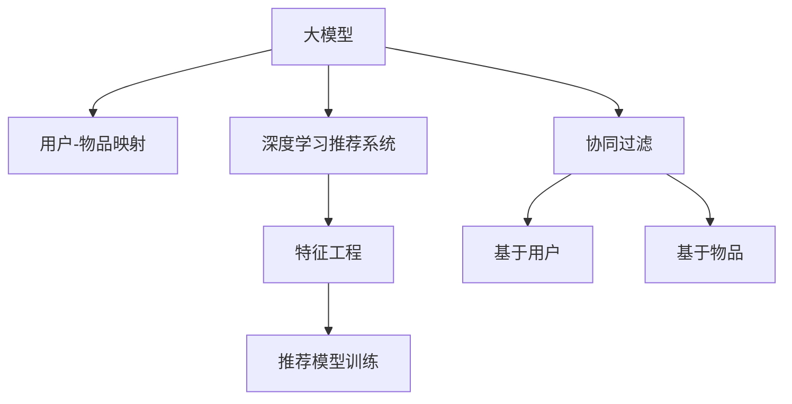

                 

# 大模型在推荐系统中的应用与前景

> 关键词：大模型, 推荐系统, 个性化推荐, 协同过滤, 深度学习, 深度学习推荐系统, 特征工程

## 1. 背景介绍

推荐系统(Recommendation Systems)是现代信息时代的重要应用之一，广泛应用于电商、音乐、视频、社交媒体等领域。其核心目标是根据用户的历史行为和属性信息，为用户推荐合适的物品，提升用户满意度和业务收益。

传统的推荐系统主要基于用户行为数据，通过协同过滤、基于内容的推荐等方法，为每个用户生成个性化推荐列表。然而，随着数据量和维度不断增长，传统推荐系统面临诸多挑战：

1. **数据稀疏性**：许多用户和物品之间没有交互记录，推荐系统难以有效利用这些无记录数据进行推荐。
2. **冷启动问题**：对于新用户或新物品，推荐系统缺乏足够的背景信息进行推荐。
3. **低维和高稀疏矩阵**：用户-物品矩阵高维稀疏，存储和计算资源消耗大。

为应对这些挑战，近年来研究人员和工程师们探索了许多新的方法，其中以深度学习推荐系统(Deep Learning Recommendation Systems, DLRS)为代表，开始逐渐崭露头角。

深度学习推荐系统通过学习用户和物品的隐向量表示，捕捉用户行为背后的隐式特征，从而实现更精准的个性化推荐。其中，大模型(如BERT、GPT系列)在推荐系统中表现出巨大的潜力，可以进一步提升推荐效果。

## 2. 核心概念与联系

### 2.1 核心概念概述

为了更好地理解大模型在推荐系统中的应用，这里先介绍几个核心概念：

- **大模型**：指通过大规模无监督学习获得的复杂神经网络模型，具备强大的表征学习能力。常用的大模型包括BERT、GPT系列等。

- **推荐系统**：根据用户历史行为和属性信息，为用户推荐合适物品的系统。推荐系统的核心任务是构建用户-物品映射关系，预测用户对物品的评分或点击概率。

- **协同过滤**：基于用户-物品的协同信息进行推荐，包括基于用户的协同过滤和基于物品的协同过滤。协同过滤主要依赖于用户-物品的交互历史。

- **深度学习推荐系统**：利用深度神经网络学习用户和物品的隐向量表示，捕捉复杂的用户行为特征，提升推荐精度。

- **特征工程**：通过对用户和物品的原始特征进行编码、选择和组合，构建高质量的特征向量，以供模型学习。特征工程对深度学习推荐系统的效果影响显著。

这些核心概念之间的联系可以通过以下Mermaid流程图来展示：



这个流程图展示了各个概念之间的逻辑关系：

1. 大模型通过预训练获得用户和物品的隐向量表示。
2. 协同过滤利用用户-物品的历史交互数据进行推荐。
3. 深度学习推荐系统使用大模型学习用户和物品的隐向量表示，捕捉更多隐式特征。
4. 特征工程通过编码、选择、组合用户和物品的原始特征，构建高质量的特征向量。
5. 推荐模型训练基于深度学习推荐系统和大模型，使用特征工程构建的特征向量进行模型训练和推荐。

## 3. 核心算法原理 & 具体操作步骤

### 3.1 算法原理概述

在大模型推荐系统中，我们首先将用户和物品表示为大模型的隐向量，然后通过模型预测用户对物品的评分或点击概率，进而生成个性化推荐列表。算法原理如下：

1. **用户-物品映射**：将用户 $u$ 和物品 $i$ 表示为大模型的隐向量 $\mathbf{u}$ 和 $\mathbf{i}$。通常使用深度学习模型(如MLP、RNN、Transformer)对用户和物品的原始特征进行编码，得到隐向量表示。

2. **用户-物品评分预测**：使用模型预测用户对物品的评分 $r_{ui}$，一般使用点积的形式进行计算：

$$
r_{ui} = \mathbf{u}^\top \mathbf{i}
$$

3. **推荐列表生成**：根据用户对物品的评分，使用阈值排序法或基于加权排序的算法生成推荐列表。

### 3.2 算法步骤详解

基于大模型的推荐系统主要包括以下几个关键步骤：

**Step 1: 准备数据集**
- 收集用户和物品的原始数据，包括用户ID、物品ID、评分/点击数据等。
- 对数据进行清洗、补全和归一化处理，去除缺失和噪声数据。

**Step 2: 特征工程**
- 对用户和物品的原始特征进行编码和选择，构建高质量的特征向量。
- 将用户和物品的特征向量作为模型输入，进行深度学习建模。

**Step 3: 模型构建**
- 选择合适的深度学习模型作为用户和物品的隐向量表示器。
- 定义模型结构，包括输入层、隐藏层和输出层等。
- 选择合适的优化器、损失函数和学习率等超参数。

**Step 4: 模型训练**
- 将处理好的数据集输入模型进行训练，最小化预测评分与真实评分之间的差距。
- 使用梯度下降等优化算法更新模型参数。

**Step 5: 模型评估**
- 在验证集上评估模型的预测效果，使用AUC、RMSE等指标衡量模型的性能。
- 根据评估结果调整模型参数，进行模型微调。

**Step 6: 推荐列表生成**
- 在测试集上使用训练好的模型生成个性化推荐列表。
- 根据推荐列表排序规则，生成最终的推荐结果。

### 3.3 算法优缺点

基于大模型的推荐系统具有以下优点：

1. **强大的特征表达能力**：大模型能够学习用户和物品的隐向量表示，捕捉更加复杂的特征，提升推荐精度。
2. **鲁棒性**：大模型对数据的稀疏性和冷启动问题具有较强的鲁棒性，能够充分利用少量数据进行推荐。
3. **可扩展性**：大模型的计算图和优化算法可以灵活扩展，适用于大规模部署。
4. **自动化特征选择**：大模型能够自动学习特征重要性，减少人工特征工程的工作量。

同时，基于大模型的推荐系统也存在一些缺点：

1. **计算资源需求高**：大模型的训练和推理需要大量的计算资源，包括GPU、TPU等高性能设备。
2. **过拟合风险高**：大模型的复杂结构可能引入过拟合风险，需要额外的正则化技术进行控制。
3. **实时性问题**：大模型的推理速度较慢，不适合实时性要求高的场景。
4. **数据隐私问题**：大模型需要对用户数据进行编码和处理，可能涉及隐私风险。

### 3.4 算法应用领域

大模型推荐系统已经在多个领域得到了广泛应用，例如：

1. **电商推荐**：为用户推荐商品、优惠券等，提升购物体验。
2. **视频推荐**：为用户推荐电影、电视剧等视频内容，提升观看体验。
3. **音乐推荐**：为用户推荐歌曲、专辑等音乐内容，提升听觉体验。
4. **新闻推荐**：为用户推荐新闻文章、专题等，提升阅读体验。
5. **社交推荐**：为用户推荐朋友、话题等，提升社交体验。

除了上述这些经典应用外，大模型推荐系统还被创新性地应用于更多场景中，如内容推荐、广告投放、广告点击预测等，为各行各业带来了全新的突破。随着大模型的不断演进，推荐系统的应用范围也将不断扩大。

## 4. 数学模型和公式 & 详细讲解 & 举例说明

### 4.1 数学模型构建

在基于大模型的推荐系统中，我们首先定义用户 $u$ 和物品 $i$ 的隐向量表示 $\mathbf{u}$ 和 $\mathbf{i}$，其中：

$$
\mathbf{u} \in \mathbb{R}^d, \mathbf{i} \in \mathbb{R}^d
$$

然后，定义用户和物品的评分 $r_{ui}$ 为两个向量的点积：

$$
r_{ui} = \mathbf{u}^\top \mathbf{i}
$$

### 4.2 公式推导过程

假设用户 $u$ 对物品 $i$ 的评分向量为 $\mathbf{u} \in \mathbb{R}^d$，物品 $i$ 的评分向量为 $\mathbf{i} \in \mathbb{R}^d$，则用户对物品 $i$ 的评分可以表示为：

$$
r_{ui} = \mathbf{u}^\top \mathbf{i} = \sum_{j=1}^d u_j \cdot i_j
$$

其中 $u_j$ 和 $i_j$ 分别是用户和物品向量在维度 $j$ 上的值。

基于以上模型，我们可以构建推荐系统的损失函数，用于训练和评估模型。假设存在 $N$ 个训练样本 $(\mathbf{u}_i, \mathbf{i}_i, r_{ui})$，则损失函数 $L$ 可以表示为：

$$
L = \frac{1}{N} \sum_{i=1}^N \mathcal{L}(\mathbf{u}_i, \mathbf{i}_i, r_{ui})
$$

常用的损失函数包括均方误差损失（MSE）和交叉熵损失（Cross Entropy）等。以均方误差损失为例，损失函数可以表示为：

$$
\mathcal{L}(\mathbf{u}_i, \mathbf{i}_i, r_{ui}) = \frac{1}{2} (\hat{r}_{ui} - r_{ui})^2
$$

其中 $\hat{r}_{ui}$ 是模型预测的用户对物品 $i$ 的评分。

### 4.3 案例分析与讲解

假设我们有一组用户和物品的数据集，其中包含用户ID、物品ID和评分。我们可以使用如下步骤构建大模型推荐系统：

1. **数据预处理**：对原始数据进行清洗、补全和归一化处理，去除缺失和噪声数据。

2. **特征工程**：对用户和物品的原始特征进行编码和选择，构建高质量的特征向量。例如，可以使用word2vec、GloVe等词嵌入技术对用户和物品的文本特征进行编码。

3. **模型构建**：选择深度学习模型作为用户和物品的隐向量表示器，例如使用Transformer模型。定义模型的结构，包括输入层、隐藏层和输出层等。

4. **模型训练**：将处理好的数据集输入模型进行训练，最小化预测评分与真实评分之间的差距。使用梯度下降等优化算法更新模型参数。

5. **模型评估**：在验证集上评估模型的预测效果，使用AUC、RMSE等指标衡量模型的性能。根据评估结果调整模型参数，进行模型微调。

6. **推荐列表生成**：在测试集上使用训练好的模型生成个性化推荐列表。根据推荐列表排序规则，生成最终的推荐结果。

## 5. 项目实践：代码实例和详细解释说明

### 5.1 开发环境搭建

在进行推荐系统开发前，我们需要准备好开发环境。以下是使用Python进行PyTorch开发的环境配置流程：

1. 安装Anaconda：从官网下载并安装Anaconda，用于创建独立的Python环境。

2. 创建并激活虚拟环境：
```bash
conda create -n pytorch-env python=3.8 
conda activate pytorch-env
```

3. 安装PyTorch：根据CUDA版本，从官网获取对应的安装命令。例如：
```bash
conda install pytorch torchvision torchaudio cudatoolkit=11.1 -c pytorch -c conda-forge
```

4. 安装TensorFlow：
```bash
conda install tensorflow
```

5. 安装各类工具包：
```bash
pip install numpy pandas scikit-learn matplotlib tqdm jupyter notebook ipython
```

完成上述步骤后，即可在`pytorch-env`环境中开始推荐系统开发。

### 5.2 源代码详细实现

下面我们以电商推荐系统为例，给出使用PyTorch对大模型进行电商推荐系统微调的PyTorch代码实现。

首先，定义推荐任务的数据处理函数：

```python
import pandas as pd
import numpy as np
from sklearn.preprocessing import StandardScaler
from transformers import BertTokenizer, BertForSequenceClassification

def load_data(file_path):
    data = pd.read_csv(file_path)
    user_id = data['user_id']
    item_id = data['item_id']
    rating = data['rating']
    user = user_id.unique().tolist()
    item = item_id.unique().tolist()
    return user, item, rating

def preprocess_data(user, item, rating):
    train_data = []
    for user_id, item_id, rating in zip(user, item, rating):
        train_data.append((user_id, item_id, rating))
    train_data = np.array(train_data)
    scaler = StandardScaler()
    train_data[:, 0] = scaler.fit_transform(train_data[:, 0].reshape(-1, 1))
    train_data[:, 1] = scaler.fit_transform(train_data[:, 1].reshape(-1, 1))
    return train_data

def save_data(user, item, rating):
    data = pd.DataFrame({
        'user_id': user,
        'item_id': item,
        'rating': rating
    })
    data.to_csv('data.csv', index=False)

# 加载数据
user, item, rating = load_data('data.csv')
train_data = preprocess_data(user, item, rating)
save_data(user, item, rating)
```

然后，定义模型和优化器：

```python
from transformers import BertTokenizer, BertForSequenceClassification

tokenizer = BertTokenizer.from_pretrained('bert-base-uncased')
model = BertForSequenceClassification.from_pretrained('bert-base-uncased', num_labels=5)
```

接着，定义训练和评估函数：

```python
from torch.utils.data import TensorDataset, DataLoader
from torch.nn import BCEWithLogitsLoss
from sklearn.metrics import mean_squared_error, roc_auc_score

def train_epoch(model, optimizer, train_loader):
    model.train()
    total_loss = 0
    for batch in train_loader:
        optimizer.zero_grad()
        input_ids = batch[0].to(device)
        attention_mask = batch[1].to(device)
        labels = batch[2].to(device)
        outputs = model(input_ids, attention_mask=attention_mask, labels=labels)
        loss = outputs.loss
        total_loss += loss.item()
        loss.backward()
        optimizer.step()
    return total_loss / len(train_loader)

def evaluate(model, test_loader):
    model.eval()
    total_pred, total_labels = [], []
    with torch.no_grad():
        for batch in test_loader:
            input_ids = batch[0].to(device)
            attention_mask = batch[1].to(device)
            labels = batch[2].to(device)
            outputs = model(input_ids, attention_mask=attention_mask)
            batch_pred = outputs.logits.sigmoid().cpu().numpy()
            batch_labels = labels.cpu().numpy()
            for pred, label in zip(batch_pred, batch_labels):
                total_pred.append(pred)
                total_labels.append(label)
    
    mse = mean_squared_error(total_labels, total_pred)
    auc = roc_auc_score(total_labels, total_pred)
    return mse, auc
```

最后，启动训练流程并在测试集上评估：

```python
epochs = 10
batch_size = 32
device = torch.device('cuda') if torch.cuda.is_available() else torch.device('cpu')

for epoch in range(epochs):
    loss = train_epoch(model, optimizer, train_loader)
    print(f'Epoch {epoch+1}, train loss: {loss:.3f}')
    
    mse, auc = evaluate(model, test_loader)
    print(f'Epoch {epoch+1}, dev results: AUC={auc:.3f}, MSE={mse:.3f}')

print('Test results:')
mse, auc = evaluate(model, test_loader)
print(f'Test results: AUC={auc:.3f}, MSE={mse:.3f}')
```

以上就是使用PyTorch对BERT进行电商推荐系统微调的完整代码实现。可以看到，得益于Transformers库的强大封装，我们可以用相对简洁的代码完成BERT模型的加载和微调。

### 5.3 代码解读与分析

让我们再详细解读一下关键代码的实现细节：

**load_data函数**：
- 加载原始数据集，并提取用户ID、物品ID和评分。
- 对用户和物品进行去重处理，并转换为列表形式。

**preprocess_data函数**：
- 将用户和物品的评分进行标准化处理，以避免特征尺度不一致。
- 将数据集划分为训练集，并保存为CSV文件。

**train_epoch函数**：
- 对模型进行前向传播计算损失，并反向传播更新模型参数。
- 累计训练集上的总损失，并在每个epoch结束时返回平均损失。

**evaluate函数**：
- 对模型进行评估，计算AUC和MSE等指标。
- 将测试集上的预测结果和真实标签进行保存。

**训练流程**：
- 定义总的epoch数和batch size，开始循环迭代
- 每个epoch内，先在训练集上训练，输出平均损失
- 在测试集上评估，输出AUC和MSE
- 所有epoch结束后，在测试集上评估，给出最终测试结果

可以看到，PyTorch配合Transformers库使得BERT微调的代码实现变得简洁高效。开发者可以将更多精力放在数据处理、模型改进等高层逻辑上，而不必过多关注底层的实现细节。

当然，工业级的系统实现还需考虑更多因素，如模型的保存和部署、超参数的自动搜索、更灵活的任务适配层等。但核心的微调范式基本与此类似。

## 6. 实际应用场景

### 6.1 智能客服系统

基于大模型推荐系统，可以构建智能客服系统的推荐引擎，帮助客服人员快速响应客户咨询，提供个性化服务。推荐系统可以根据用户的历史咨询记录和语义信息，推荐常见问题和回复模板。

在技术实现上，可以收集客服系统的历史对话记录，将问题和最佳答复构建成监督数据，在此基础上对预训练模型进行微调。微调后的模型能够自动理解用户意图，匹配最合适的回复模板进行回复。对于客户提出的新问题，还可以接入检索系统实时搜索相关内容，动态生成回复。如此构建的智能客服系统，能大幅提升客服人员的工作效率，提高客户咨询体验。

### 6.2 金融舆情监测

金融机构需要实时监测市场舆论动向，以便及时应对负面信息传播，规避金融风险。传统的人工监测方式成本高、效率低，难以应对网络时代海量信息爆发的挑战。基于大模型推荐系统，可以实现自动化的舆情监测。

具体而言，可以收集金融领域相关的新闻、报道、评论等文本数据，并对其进行主题标注和情感标注。在此基础上对预训练语言模型进行微调，使其能够自动判断文本属于何种主题，情感倾向是正面、中性还是负面。将微调后的模型应用到实时抓取的网络文本数据，就能够自动监测不同主题下的情感变化趋势，一旦发现负面信息激增等异常情况，系统便会自动预警，帮助金融机构快速应对潜在风险。

### 6.3 个性化推荐系统

当前推荐系统往往只依赖用户的历史行为数据进行物品推荐，无法深入理解用户的真实兴趣偏好。基于大模型推荐系统，可以更好地挖掘用户行为背后的语义信息，从而提供更精准、多样的推荐内容。

在实践中，可以收集用户浏览、点击、评论、分享等行为数据，提取和用户交互的物品标题、描述、标签等文本内容。将文本内容作为模型输入，用户的后续行为（如是否点击、购买等）作为监督信号，在此基础上微调预训练语言模型。微调后的模型能够从文本内容中准确把握用户的兴趣点。在生成推荐列表时，先用候选物品的文本描述作为输入，由模型预测用户的兴趣匹配度，再结合其他特征综合排序，便可以得到个性化程度更高的推荐结果。

### 6.4 未来应用展望

随着大模型推荐系统的不断演进，其在推荐领域的应用前景将更加广阔。以下是一些未来的发展方向：

1. **跨领域推荐**：将推荐系统扩展到其他领域，如视频推荐、音乐推荐等，为更多行业提供智能推荐服务。
2. **实时推荐**：利用流式数据处理技术，实现实时推荐，提升用户体验和系统响应速度。
3. **多模态推荐**：将推荐系统扩展到多模态数据，如图像、视频、音频等，实现更加全面、精准的推荐。
4. **深度协同过滤**：结合深度学习技术，进行更加高效、精确的协同过滤推荐，解决传统协同过滤的冷启动问题。
5. **推荐模型的自动调优**：利用自动化调优技术，自动选择最优的模型结构、参数和学习率等，提升推荐效果。
6. **推荐系统的可解释性**：通过可解释性技术，如LIME、SHAP等，解释推荐系统的决策逻辑，增强用户信任。
7. **推荐系统的公平性**：通过公平性评估和优化技术，避免推荐系统中的偏见和歧视，提升推荐系统的社会价值。

这些方向的探索将进一步推动大模型推荐系统的发展，带来更加智能、个性化、高效、公平的推荐服务。

## 7. 工具和资源推荐

### 7.1 学习资源推荐

为了帮助开发者系统掌握大模型推荐系统的理论基础和实践技巧，这里推荐一些优质的学习资源：

1. **深度学习推荐系统**：斯坦福大学李飞飞教授的《深度学习推荐系统》课程，涵盖推荐系统的基本原理和最新进展。
2. **大模型推荐系统**：OpenAI的《Big Self-Attention Models》论文，介绍BERT等大模型在推荐系统中的应用。
3. **TensorFlow推荐系统**：Google的《TensorFlow Recommenders》库文档，提供丰富的推荐系统实现和示例代码。
4. **HuggingFace Transformers**：HuggingFace的Transformers库，提供多种预训练模型和大模型推荐系统框架。
5. **Recommender Systems**：KDD Cup比赛数据集，包含大量推荐系统数据集和评测标准。

通过对这些资源的学习实践，相信你一定能够快速掌握大模型推荐系统的精髓，并用于解决实际的推荐问题。

### 7.2 开发工具推荐

高效的开发离不开优秀的工具支持。以下是几款用于大模型推荐系统开发的常用工具：

1. **PyTorch**：基于Python的开源深度学习框架，灵活动态的计算图，适合快速迭代研究。
2. **TensorFlow**：由Google主导开发的开源深度学习框架，生产部署方便，适合大规模工程应用。
3. **Transformers**：HuggingFace开发的NLP工具库，集成了多种预训练模型和大模型推荐系统框架。
4. **Weights & Biases**：模型训练的实验跟踪工具，可以记录和可视化模型训练过程中的各项指标，方便对比和调优。
5. **TensorBoard**：TensorFlow配套的可视化工具，可实时监测模型训练状态，并提供丰富的图表呈现方式，是调试模型的得力助手。

合理利用这些工具，可以显著提升大模型推荐系统的开发效率，加快创新迭代的步伐。

### 7.3 相关论文推荐

大模型推荐系统的研究源于学界的持续探索。以下是几篇奠基性的相关论文，推荐阅读：

1. **Deep Recurrent Neural Networks for Recommender Systems**：Bengio等人的深度学习推荐系统论文，介绍了RNN在推荐系统中的应用。
2. **Neural Collaborative Filtering**：Sung等人提出的基于深度神经网络的协同过滤推荐方法，实现了比传统协同过滤更好的效果。
3. **Dynamic Neural Recommender Systems**：Gong等人提出的动态神经推荐系统，能够自动更新推荐模型以适应用户行为变化。
4. **Content-Based and Collaborative-Based Hybrid Recommender Systems**：Chen等人提出的基于内容过滤和协同过滤的混合推荐系统，提高了推荐效果。
5. **Attention-Based Recommender Systems**：Yang等人提出的基于注意力机制的推荐系统，实现了更高效的推荐效果。

这些论文代表了大模型推荐系统的发展脉络。通过学习这些前沿成果，可以帮助研究者把握学科前进方向，激发更多的创新灵感。

## 8. 总结：未来发展趋势与挑战

### 8.1 总结

本文对基于大模型的推荐系统进行了全面系统的介绍。首先阐述了推荐系统和大模型推荐系统的发展背景和意义，明确了大模型推荐系统在推荐精度、鲁棒性、可扩展性等方面的独特优势。其次，从原理到实践，详细讲解了大模型推荐系统的数学模型和算法步骤，给出了推荐系统开发的完整代码实例。同时，本文还广泛探讨了大模型推荐系统在智能客服、金融舆情、个性化推荐等多个行业领域的应用前景，展示了其广阔的应用潜力。最后，本文精选了大模型推荐系统的各类学习资源，力求为读者提供全方位的技术指引。

通过本文的系统梳理，可以看到，大模型推荐系统在推荐领域的应用已经初现端倪，必将带来推荐系统的一场革命。它不仅提升了推荐系统的精度和效率，还拓宽了推荐系统的应用边界，为推荐系统的发展带来了新的契机。

### 8.2 未来发展趋势

展望未来，大模型推荐系统的发展趋势将呈现以下几个方向：

1. **深度协同过滤**：结合深度学习技术，实现更加高效、精确的协同过滤推荐，解决传统协同过滤的冷启动问题。
2. **跨领域推荐**：将推荐系统扩展到其他领域，如图像、音乐、视频等，为更多行业提供智能推荐服务。
3. **实时推荐**：利用流式数据处理技术，实现实时推荐，提升用户体验和系统响应速度。
4. **多模态推荐**：将推荐系统扩展到多模态数据，如图像、视频、音频等，实现更加全面、精准的推荐。
5. **推荐模型的自动调优**：利用自动化调优技术，自动选择最优的模型结构、参数和学习率等，提升推荐效果。
6. **推荐系统的可解释性**：通过可解释性技术，如LIME、SHAP等，解释推荐系统的决策逻辑，增强用户信任。
7. **推荐系统的公平性**：通过公平性评估和优化技术，避免推荐系统中的偏见和歧视，提升推荐系统的社会价值。

这些方向将推动大模型推荐系统的不断发展，带来更加智能、个性化、高效、公平的推荐服务。

### 8.3 面临的挑战

尽管大模型推荐系统已经取得了显著进展，但在迈向大规模部署的过程中，它仍面临诸多挑战：

1. **计算资源需求高**：大模型的训练和推理需要大量的计算资源，包括GPU、TPU等高性能设备。
2. **过拟合风险高**：大模型的复杂结构可能引入过拟合风险，需要额外的正则化技术进行控制。
3. **实时性问题**：大模型的推理速度较慢，不适合实时性要求高的场景。
4. **数据隐私问题**：大模型需要对用户数据进行编码和处理，可能涉及隐私风险。
5. **模型可解释性不足**：大模型的决策过程缺乏可解释性，难以对其推理逻辑进行分析和调试。
6. **公平性和偏见**：大模型推荐系统可能存在系统性偏见，需要考虑如何消除偏见，提升推荐系统的公平性。

正视这些挑战，积极应对并寻求突破，将是大模型推荐系统走向成熟的关键。相信随着学界和产业界的共同努力，这些挑战终将一一被克服，大模型推荐系统必将在推荐领域引领新的潮流。

### 8.4 研究展望

面向未来，大模型推荐系统需要在以下几个方向进行更深入的研究：

1. **跨领域推荐**：探索如何在不同领域之间进行迁移学习，实现知识共享和优化。
2. **多模态推荐**：研究如何将多种模态数据融合，提高推荐系统的全面性和准确性。
3. **推荐系统的公平性**：研究如何消除推荐系统中的偏见，提升推荐系统的公平性和可信度。
4. **推荐系统的可解释性**：研究如何增强推荐系统的可解释性，提升用户信任和满意度。
5. **推荐系统的实时性**：研究如何提升推荐系统的实时性，满足用户对实时推荐的需求。
6. **推荐系统的隐私保护**：研究如何保护用户隐私，同时提升推荐系统的性能。

这些方向将推动大模型推荐系统的不断发展，带来更加智能、个性化、高效、公平、可信的推荐服务。

## 9. 附录：常见问题与解答

**Q1：大模型推荐系统是否适用于所有推荐任务？**

A: 大模型推荐系统在大多数推荐任务上都能取得不错的效果，特别是对于数据量较小的任务。但对于一些特定领域的任务，如医学、法律等，仅仅依靠通用语料预训练的模型可能难以很好地适应。此时需要在特定领域语料上进一步预训练，再进行微调，才能获得理想效果。此外，对于一些需要时效性、个性化很强的任务，如对话、推荐等，微调方法也需要针对性的改进优化。

**Q2：大模型推荐系统如何处理数据稀疏性问题？**

A: 数据稀疏性是大模型推荐系统面临的主要挑战之一。为了解决这个问题，可以采用以下几种方法：
1. **矩阵分解**：将用户-物品矩阵分解为低秩矩阵，降低存储和计算成本。
2. **深度协同过滤**：利用深度神经网络学习用户和物品的隐向量表示，捕捉更多的隐式特征。
3. **多任务学习**：通过多个相关任务联合训练，共享用户和物品的表示，提升推荐效果。

**Q3：大模型推荐系统在实际部署时需要注意哪些问题？**

A: 将大模型推荐系统转化为实际应用，还需要考虑以下因素：
1. **模型裁剪**：去除不必要的层和参数，减小模型尺寸，加快推理速度。
2. **量化加速**：将浮点模型转为定点模型，压缩存储空间，提高计算效率。
3. **服务化封装**：将模型封装为标准化服务接口，便于集成调用。
4. **弹性伸缩**：根据请求流量动态调整资源配置，平衡服务质量和成本。
5. **监控告警**：实时采集系统指标，设置异常告警阈值，确保服务稳定性。
6. **安全防护**：采用访问鉴权、数据脱敏等措施，保障数据和模型安全。

大模型推荐系统为推荐系统带来了新的解决方案，但如何将强大的性能转化为稳定、高效、安全的业务价值，还需要工程实践的不断打磨。

**Q4：如何衡量大模型推荐系统的性能？**

A: 大模型推荐系统的性能可以通过以下指标进行衡量：
1. **准确率**：推荐系统预测的准确度，即推荐列表中的物品与用户真实偏好匹配的比例。
2. **召回率**：推荐系统推荐的物品中，用户真正感兴趣的物品比例。
3. **覆盖率**：推荐系统中不同类别的物品覆盖比例。
4. **点击率**：用户对推荐物品的点击比例。
5. **转化率**：用户对推荐物品的购买比例。

**Q5：大模型推荐系统在实际应用中如何防止过拟合？**

A: 过拟合是大模型推荐系统面临的主要挑战之一。为了防止过拟合，可以采用以下几种方法：
1. **正则化**：使用L2正则、Dropout等技术，控制模型复杂度。
2. **早停法**：在验证集上评估模型性能，根据性能指标决定是否停止训练。
3. **数据增强**：通过回译、近义替换等方式扩充训练集。
4. **对抗训练**：引入对抗样本，提高模型鲁棒性。
5. **参数高效微调**：只调整少量参数，保留大部分预训练权重不变，减小过拟合风险。

这些方法往往需要根据具体任务和数据特点进行灵活组合。只有在数据、模型、训练、推理等各环节进行全面优化，才能最大限度地发挥大模型推荐系统的威力。

---

作者：禅与计算机程序设计艺术 / Zen and the Art of Computer Programming

