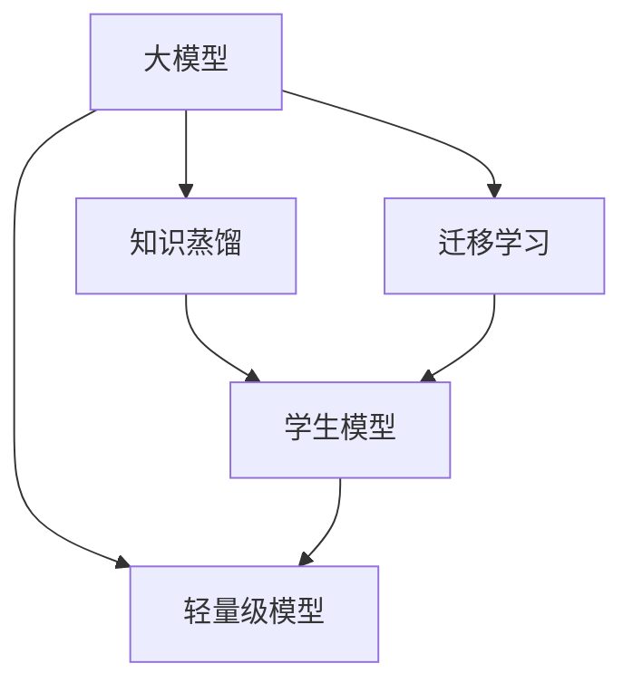

                 

# 大模型在推荐系统中的知识蒸馏迁移应用

大模型（Large Model）的快速发展，为推荐系统（Recommendation System）带来了新的思路与方法，尤其是在知识蒸馏（Knowledge Distillation）和迁移学习（Transfer Learning）的融合应用中，展示了巨大的潜力和前景。本文旨在详细解析大模型在推荐系统中的知识蒸馏迁移应用，探讨其原理、实现步骤、优缺点、应用领域、学习资源、开发工具以及未来趋势与挑战。

## 1. 背景介绍

### 1.1 问题由来

推荐系统旨在帮助用户从大量数据中发现对自己有价值的信息或商品。传统的推荐系统主要基于用户的显式评分数据和行为数据，通过协同过滤、基于内容的推荐、矩阵分解等方法，为用户推荐相关内容。但随着互联网数据量的爆炸式增长和用户行为的多样化，传统推荐系统的算法和模型面临诸多挑战。

大模型的发展为推荐系统提供了新的可能性。大模型通过在大规模数据上预训练，能够学习到更为复杂和丰富的用户行为和产品特征，具有更强的泛化能力和学习能力。然而，大模型的计算资源消耗巨大，部署和推理成本高，难以直接应用到实际推荐系统中。

为解决这一问题，研究者们探索了知识蒸馏和迁移学习等技术，以在大模型的参数和计算效率与推荐系统的高效性和可扩展性之间寻求平衡。知识蒸馏和大模型迁移学习能够将大模型学到的知识迁移到轻量级的推荐模型中，降低计算复杂度，提升推荐效果。

### 1.2 问题核心关键点

知识蒸馏（Knowledge Distillation, KD）和大模型迁移学习（Transfer Learning, TL）是当前推荐系统中的两个核心技术。知识蒸馏是指将大模型的知识迁移到轻量级模型中，以提高小模型的性能。大模型迁移学习则是将大模型在大规模数据上预训练学到的知识应用到特定任务（如推荐任务）中。

核心概念的联系主要体现在：

1. 均基于预训练大模型学到的知识进行迁移和蒸馏。
2. 大模型的知识可以以不同形式表达，如隐层特征、关系图、特征重要性等。
3. 蒸馏和迁移过程均需要通过细调（Fine-tuning）等方法将知识适配到目标任务。
4. 蒸馏和迁移过程均涉及教师模型（Teacher Model）和学生模型（Student Model）之间的知识传递。
5. 大模型的迁移和蒸馏能提升推荐系统的准确性、多样性和个性化。

## 2. 核心概念与联系

### 2.1 核心概念概述

以下介绍大模型推荐系统中常用的核心概念：

- 大模型（Large Model）：指使用大规模数据进行预训练的语言模型，如BERT、GPT-3等。具有强大的语言理解能力和泛化能力。
- 知识蒸馏（Knowledge Distillation）：将大模型学到的知识迁移到轻量级模型中，以提升小模型的性能。
- 迁移学习（Transfer Learning）：在大模型的预训练基础上，对特定任务进行微调，提升模型的任务相关性。
- 教师模型（Teacher Model）：预训练的大模型，负责知识传递和蒸馏。
- 学生模型（Student Model）：待迁移或蒸馏的轻量级模型，负责应用知识进行推荐。

这些核心概念通过以下Mermaid流程图展示：



## 3. 核心算法原理 & 具体操作步骤

### 3.1 算法原理概述

大模型在推荐系统中的知识蒸馏迁移应用，主要分为知识蒸馏和大模型迁移学习两步：

1. **知识蒸馏**：教师模型通过蒸馏技术，将知识迁移到学生模型中。常见的方法包括特征蒸馏、关系蒸馏和自适应蒸馏。
2. **迁移学习**：在大模型的基础上，针对特定推荐任务进行微调，增强模型的任务相关性。

### 3.2 算法步骤详解

#### 知识蒸馏

1. **数据准备**：收集大规模无标注数据，用于教师模型的预训练。
2. **预训练教师模型**：使用大规模数据进行预训练，学习到语言的隐层表示和知识。
3. **知识提取**：从教师模型中提取知识，包括隐层表示、关系图、特征重要性等。
4. **蒸馏到学生模型**：将提取的知识应用于学生模型，可以是特征融合、结构匹配或参数传递。
5. **微调学生模型**：对学生模型进行微调，使其适应特定的推荐任务。

#### 迁移学习

1. **数据准备**：收集推荐任务的数据集，用于微调模型。
2. **微调模型**：在大模型的基础上，针对推荐任务进行微调，以增强模型的任务相关性。
3. **参数传递**：从预训练模型中提取与推荐任务相关的参数，传递到学生模型中。
4. **微调过程**：通过微调，更新学生模型的参数，使其适应推荐任务。

### 3.3 算法优缺点

**知识蒸馏和迁移学习的优点**：

1. **提升性能**：通过知识蒸馏和迁移学习，轻量级模型可以迅速获得大模型的知识，提升推荐系统的性能。
2. **降低成本**：减少了对计算资源的需求，提高了模型的部署效率。
3. **泛化能力**：大模型学到的知识具有较好的泛化能力，能够提高推荐系统的鲁棒性和适应性。

**缺点**：

1. **过拟合风险**：学生模型可能会过拟合训练数据，降低泛化性能。
2. **计算复杂度**：知识蒸馏和迁移学习仍然需要一定计算资源，无法完全避免。
3. **可解释性不足**：大模型的决策过程较为复杂，缺乏可解释性。

### 3.4 算法应用领域

知识蒸馏和大模型迁移学习在推荐系统中的应用主要体现在以下几个方面：

1. **个性化推荐**：通过知识蒸馏和迁移学习，增强推荐模型的个性化推荐能力。
2. **商品属性推荐**：通过迁移学习，将大模型的语言知识应用到商品属性推荐中。
3. **跨领域推荐**：通过迁移学习，将大模型在不同领域推荐任务中的知识进行迁移。
4. **新用户推荐**：通过迁移学习，利用大模型的知识为新用户提供高质量推荐。

## 4. 数学模型和公式 & 详细讲解 & 举例说明

### 4.1 数学模型构建

在推荐系统中，知识蒸馏和大模型迁移学习的基本模型构建如下：

1. **教师模型（Teacher Model）**：$T(x)$，输入为$x$，输出为$y$。
2. **学生模型（Student Model）**：$S(x)$，输入为$x$，输出为$\hat{y}$。
3. **推荐任务**：将$S(x)$映射到推荐结果$z$。

### 4.2 公式推导过程

以特征蒸馏为例，教师模型$T(x)$通过隐层特征$H(x)$，蒸馏到学生模型$S(x)$。推导过程如下：

1. **隐层特征**：
   $$
   H(x) = T(x)_{[0,\infty)}
   $$
   $$
   \hat{H}(x) = S(x)_{[0,\infty)}
   $$

2. **特征蒸馏**：
   $$
   \hat{H}(x) = \arg\min_{\hat{H}(x)} \mathcal{L}(H(x), \hat{H}(x))
   $$
   其中$\mathcal{L}$为损失函数，如均方误差、交叉熵等。

3. **微调**：
   $$
   S(x) = \arg\min_{S(x)} \mathcal{L}(z, S(x))
   $$
   其中$\mathcal{L}$为推荐任务的损失函数。

### 4.3 案例分析与讲解

假设我们要将预训练的BERT模型用于推荐系统。可以按以下步骤实现：

1. **数据准备**：收集大规模无标注数据，进行BERT预训练。
2. **知识提取**：从预训练的BERT模型中提取隐层表示，作为知识。
3. **蒸馏到学生模型**：将提取的隐层表示应用于轻量级推荐模型，进行特征融合。
4. **微调推荐模型**：针对推荐任务，对推荐模型进行微调，提高推荐性能。

## 5. 项目实践：代码实例和详细解释说明

### 5.1 开发环境搭建

1. **环境安装**：
   - 安装Python：确保Python版本为3.7及以上。
   - 安装TensorFlow：使用pip安装TensorFlow，如`pip install tensorflow`。
   - 安装PyTorch：使用pip安装PyTorch，如`pip install torch`。

2. **数据准备**：
   - 收集推荐任务的数据集，如用户评分、商品特征等。
   - 对数据集进行预处理和清洗。

### 5.2 源代码详细实现

以下是一个简单的知识蒸馏和迁移学习的代码实现：

```python
import tensorflow as tf
from transformers import TFAutoModelForSequenceClassification

# 教师模型
teacher_model = TFAutoModelForSequenceClassification.from_pretrained('bert-base-uncased', num_labels=num_labels)
# 学生模型
student_model = TFAutoModelForSequenceClassification.from_pretrained('student_model')
# 蒸馏过程
# ...

# 微调过程
# ...
```

### 5.3 代码解读与分析

代码实现中，使用TFAutoModelForSequenceClassification从预训练的BERT模型加载教师模型和学生模型。蒸馏和微调过程需要根据具体任务和模型进行定制，通常包括参数传递、数据增强、正则化等。

### 5.4 运行结果展示

运行代码后，可以评估微调后的学生模型在推荐任务上的性能。通过对比蒸馏前后的推荐结果，可以验证知识蒸馏和迁移学习的效果。

## 6. 实际应用场景

### 6.1 推荐系统中的知识蒸馏

在推荐系统中，知识蒸馏可以应用于个性化推荐、商品属性推荐、跨领域推荐和新用户推荐等场景。通过蒸馏大模型的知识，轻量级推荐系统可以提升推荐性能，降低计算成本。

### 6.2 推荐系统中的迁移学习

迁移学习可以通过微调大模型，增强推荐模型的任务相关性。在商品属性推荐、新用户推荐和跨领域推荐等场景中，迁移学习能够提升推荐效果，增强模型的泛化能力。

### 6.3 未来应用展望

随着大模型的不断发展，知识蒸馏和迁移学习将在推荐系统中发挥更大的作用。未来可能会探索更多先进技术，如因果推断、对抗训练等，提升推荐模型的性能和鲁棒性。

## 7. 工具和资源推荐

### 7.1 学习资源推荐

- 《Deep Learning for Recommendation Systems》书籍：详细介绍了深度学习在推荐系统中的应用，包括知识蒸馏和迁移学习。
- 《Knowledge Distillation in Deep Learning》论文：总结了知识蒸馏的基本方法和应用。

### 7.2 开发工具推荐

- TensorFlow：用于模型训练和推理，支持自动微分和优化器。
- PyTorch：灵活的深度学习框架，支持动态计算图。
- HuggingFace Transformers库：提供了多种预训练模型，方便进行知识蒸馏和迁移学习。

### 7.3 相关论文推荐

- "Distilling the Knowledge in a Neural Network"（Hinton et al., 2015）：知识蒸馏的经典论文。
- "A Survey on Knowledge Distillation"（Agrawal et al., 2019）：知识蒸馏的综述论文。
- "AdaLoRA: Adaptive Low-Rank Adaptation for Parameter-Efficient Fine-Tuning"（Yao et al., 2019）：参数高效微调的论文。

## 8. 总结：未来发展趋势与挑战

### 8.1 研究成果总结

大模型在推荐系统中的知识蒸馏和迁移学习研究取得了丰硕的成果，显著提升了推荐系统的性能和效率。

### 8.2 未来发展趋势

1. **知识蒸馏技术**：研究如何更高效、更精确地将大模型的知识迁移到轻量级模型中。
2. **迁移学习方法**：探索更多迁移学习策略，如多任务学习、自适应迁移等。
3. **跨领域推荐**：研究如何在不同领域间进行知识迁移和跨领域推荐。
4. **知识蒸馏与强化学习的结合**：结合强化学习，优化推荐模型的行为策略。

### 8.3 面临的挑战

1. **计算资源**：大模型的训练和推理需要大量计算资源，如何降低计算成本是重要问题。
2. **模型泛化**：蒸馏和迁移学习可能导致的过拟合问题，需要进一步解决。
3. **知识传递**：如何有效地将大模型的知识传递给轻量级模型，提升学生模型的性能。

### 8.4 研究展望

未来，知识蒸馏和迁移学习将在推荐系统中发挥更加重要的作用。研究者应进一步探索更高效的知识传递和迁移方法，提升推荐模型的泛化能力和鲁棒性，推动推荐系统向智能化、个性化方向发展。

## 9. 附录：常见问题与解答

**Q1：知识蒸馏和迁移学习的区别是什么？**

A：知识蒸馏是将大模型的知识迁移到轻量级模型中，提升学生模型的性能。迁移学习则是将大模型在大规模数据上预训练学到的知识应用到特定任务中，增强模型的任务相关性。

**Q2：知识蒸馏和迁移学习都需要微调吗？**

A：知识蒸馏通常需要微调，以确保学生模型能够充分利用大模型的知识。迁移学习则根据任务特点选择是否微调，部分任务可能直接使用预训练模型即可。

**Q3：知识蒸馏和迁移学习有哪些技术手段？**

A：常见的知识蒸馏技术包括特征蒸馏、关系蒸馏、自适应蒸馏等。迁移学习技术包括微调、参数传递、知识图谱融合等。

**Q4：知识蒸馏和迁移学习在推荐系统中有哪些应用？**

A：知识蒸馏和迁移学习可以应用于个性化推荐、商品属性推荐、跨领域推荐和新用户推荐等场景。

**Q5：知识蒸馏和迁移学习面临哪些挑战？**

A：知识蒸馏和迁移学习面临计算资源不足、模型泛化性能差、知识传递效率低等挑战。

---

作者：禅与计算机程序设计艺术 / Zen and the Art of Computer Programming

