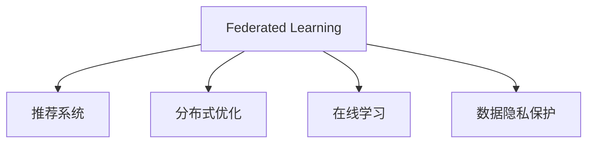

                 

# 大模型在推荐系统中的联邦学习应用

> 关键词：联邦学习, 推荐系统, 分布式优化, 数据隐私保护, 模型融合, 推荐算法, 在线学习

## 1. 背景介绍

### 1.1 问题由来

随着推荐系统在电商、视频、音乐等平台上的广泛应用，如何构建高效、准确的推荐模型成为各大互联网公司竞相研究的关键。传统的集中式推荐系统将用户行为数据统一存储在单个数据中心，通过大规模的模型训练获取用户偏好信息，以实现个性化推荐。然而，随着数据量的爆炸性增长，单个数据中心的存储和计算能力已难以满足需求，且集中式存储容易引发数据隐私和安全问题。

联邦学习(Federated Learning, FL)作为一种新兴的分布式机器学习范式，旨在解决数据分散存储问题，通过多方参与者共同参与模型训练，既保证了数据隐私安全，又充分利用了分散的计算资源，提高模型性能。联邦学习在推荐系统中的应用，能够有效缓解数据集中存储带来的诸多问题，实现个性化推荐的同时，保障用户隐私和数据安全。

### 1.2 问题核心关键点

本文聚焦于如何在大模型框架下，通过联邦学习的方式，构建分布式推荐系统，同时兼顾推荐性能和数据隐私。具体来说，涉及以下几个核心问题：

1. 如何在联邦学习环境中，高效、安全地构建推荐模型？
2. 联邦学习下的分布式推荐系统，如何在保证性能的前提下，提升推荐效果？
3. 如何在联邦学习过程中，兼顾模型的可解释性和用户隐私保护？
4. 联邦学习技术在推荐系统中的应用，是否能够实现与集中式推荐系统的同级甚至更高的推荐精度？

## 2. 核心概念与联系

### 2.1 核心概念概述

为更好地理解联邦学习在大模型推荐系统中的应用，本节将介绍几个密切相关的核心概念：

- **联邦学习（Federated Learning, FL）**：一种分布式机器学习范式，允许多个参与者在不共享本地数据的情况下，协同训练模型。参与者通过本地计算得到模型的更新参数，然后将参数聚合得到全局模型更新，最终模型在每个参与者本地进行训练。

- **推荐系统（Recommendation System, RS）**：通过分析用户行为数据，预测用户可能感兴趣的商品或内容，并提供个性化推荐。推荐系统广泛应用于电商、视频、音乐等领域。

- **分布式优化（Distributed Optimization）**：一种优化方法，通过多台计算设备并行计算模型参数的更新，加速训练过程。分布式优化常用于大规模模型训练，尤其在深度学习中应用广泛。

- **在线学习（Online Learning）**：一种模型更新方法，通过不断接收新样本并更新模型参数，适应用户偏好的动态变化。在线学习常用于实时推荐系统，提高推荐精度。

- **数据隐私保护（Data Privacy Protection）**：保护用户隐私安全，避免数据泄露和滥用。在大数据时代，数据隐私保护成为推荐系统设计的重要考量。

这些核心概念之间的逻辑关系可以通过以下Mermaid流程图来展示：



该流程图展示了联邦学习在推荐系统中的作用和相关概念之间的联系。联邦学习通过分布式优化和在线学习，构建推荐模型，同时兼顾数据隐私保护。

## 3. 核心算法原理 & 具体操作步骤
### 3.1 算法原理概述

联邦学习在大模型推荐系统中的应用，主要通过将大规模数据集划分为多个子集，每个子集在本地参与者上进行模型训练，再将模型参数通过加权聚合得到全局模型更新。推荐模型的训练过程，可以在不泄露用户隐私的前提下，通过联邦学习的方式，充分利用分散的数据资源，实现高效、安全的个性化推荐。

在联邦学习框架下，推荐模型的训练过程可以分为以下几个关键步骤：

1. **模型初始化**：在每个参与者本地初始化一个模型副本，作为联邦学习的基础。
2. **数据划分**：将全局数据集划分为多个子集，每个子集在本地进行预处理。
3. **本地训练**：每个参与者使用本地数据训练模型，更新模型参数。
4. **参数聚合**：将各参与者更新后的参数进行加权聚合，得到全局模型更新。
5. **全局更新**：使用全局模型更新，在每个参与者本地再次训练模型，更新参数。
6. **重复迭代**：重复执行步骤3到5，直至模型收敛或达到预设的迭代次数。

### 3.2 算法步骤详解

联邦学习在推荐系统中的应用，可以分为以下几个具体步骤：

**Step 1: 数据划分与本地预处理**

假设全局数据集为 $D=\{(x_i, y_i)\}_{i=1}^N$，其中 $x_i$ 表示用户行为，$y_i$ 表示用户对商品的偏好标签。将全局数据集 $D$ 划分为 $K$ 个子集 $D_k=\{(x_i, y_i)\}_{i=1}^{N_k}$，每个子集 $D_k$ 在本地参与者上使用。

在本地参与者上，对数据进行预处理，包括数据增强、归一化等操作，以适应本地模型的训练需求。

**Step 2: 本地模型训练**

在本地参与者上，使用本地数据 $D_k$ 进行模型训练，更新模型参数 $\theta_k$。本地模型的训练过程可以采用在线学习的方式，不断接收新的数据并更新模型，提高模型对动态用户偏好的适应能力。

**Step 3: 参数聚合与全局更新**

将每个本地参与者更新后的模型参数 $\theta_k$ 通过某种方式进行聚合，得到全局模型更新 $\theta_{avg}$。常见的方式包括均值聚合、加权聚合等，聚合权重通常与参与者的本地数据量成反比。

**Step 4: 全局模型训练**

使用全局模型更新 $\theta_{avg}$，在每个本地参与者上再次训练模型，更新本地模型参数 $\theta_k$。

**Step 5: 重复迭代**

重复执行步骤2到4，直至模型收敛或达到预设的迭代次数。通过不断迭代，全局模型和本地模型共同优化，提升推荐性能。

### 3.3 算法优缺点

联邦学习在推荐系统中的应用，具有以下优点：

1. **分布式训练**：联邦学习通过分布式训练，充分利用分散的计算资源，加速模型训练过程。
2. **数据隐私保护**：联邦学习在训练过程中不共享本地数据，有效保护用户隐私。
3. **模型鲁棒性**：联邦学习通过多参与者共同训练，增强模型鲁棒性，减少过拟合风险。
4. **动态适应**：联邦学习结合在线学习，实时接收新数据，动态适应用户偏好的变化。

同时，联邦学习在推荐系统中的应用也存在一些局限性：

1. **通信开销**：联邦学习需要频繁进行参数传输，通信开销较大。
2. **收敛速度**：联邦学习需要多轮迭代才能收敛，收敛速度较慢。
3. **模型一致性**：联邦学习中，各参与者模型的初始化和更新方式不同，可能导致模型一致性问题。
4. **复杂度较高**：联邦学习需要设计复杂的聚合方式和模型更新策略，实现起来较为复杂。

尽管存在这些局限性，但联邦学习在推荐系统中的应用，已经展现出显著的潜力，成为推荐系统研究的新热点。

### 3.4 算法应用领域

联邦学习在推荐系统中的应用，广泛覆盖了电商、视频、音乐等多个领域。以下是几个典型的应用场景：

- **电商推荐**：利用用户浏览、点击、购买等行为数据，构建联邦学习模型，实时生成商品推荐列表。
- **视频推荐**：分析用户观看记录和评价，联邦学习模型能够动态调整视频推荐策略。
- **音乐推荐**：通过用户听歌记录和评分，构建联邦学习模型，推荐个性化歌曲。
- **新闻推荐**：分析用户阅读行为，联邦学习模型能够实时推荐相关新闻。

除了上述这些经典场景外，联邦学习还被创新性地应用于更多领域，如社交网络、广告投放、体育赛事推荐等，为推荐系统带来了新的突破。随着联邦学习技术的不断进步，相信推荐系统必将在更广阔的应用领域大放异彩。

## 4. 数学模型和公式 & 详细讲解 & 举例说明
### 4.1 数学模型构建

在联邦学习框架下，推荐模型的训练过程可以形式化表示为以下数学模型：

记全局数据集为 $D=\{(x_i, y_i)\}_{i=1}^N$，其中 $x_i$ 为输入，$y_i$ 为输出，即用户行为和偏好标签。假设联邦学习中参与者为 $K$ 个，全局模型参数为 $\theta$，本地模型参数为 $\theta_k$。

本地模型在 $D_k$ 上的损失函数为 $L_k(\theta_k)$，则本地模型的训练目标为最小化本地损失函数：

$$
\min_{\theta_k} L_k(\theta_k)
$$

联邦学习通过多参与者协同训练，更新全局模型参数 $\theta$。假设每次聚合后的全局模型更新为 $\theta_{avg}$，则全局模型更新的目标为最小化全局损失函数：

$$
\min_{\theta} \sum_{k=1}^K \lambda_k L_k(\theta)
$$

其中 $\lambda_k$ 为聚合权重，通常与参与者的本地数据量成反比。

### 4.2 公式推导过程

联邦学习中，全局模型参数 $\theta$ 的更新可以通过以下公式进行推导：

假设每次聚合后的全局模型更新为 $\theta_{avg}$，则全局模型参数的更新公式为：

$$
\theta_{t+1} = \theta_t - \eta \sum_{k=1}^K \frac{1}{\lambda_k} (\theta_k - \theta_t) 
$$

其中 $\eta$ 为学习率，$\theta_t$ 表示第 $t$ 次迭代后的全局模型参数。

对于本地模型参数 $\theta_k$，其更新公式为：

$$
\theta_k^{t+1} = \theta_k^t - \eta \nabla_{\theta_k} L_k(\theta_k^t) + \eta \sum_{i=1}^K \frac{1}{\lambda_k} (\theta_{avg} - \theta_k^t)
$$

其中 $\nabla_{\theta_k} L_k(\theta_k^t)$ 为本地损失函数对 $\theta_k$ 的梯度。

### 4.3 案例分析与讲解

以下我们以电商推荐系统为例，给出联邦学习模型训练的详细案例分析：

假设电商推荐系统中有 $K=3$ 个参与者，每个参与者持有部分用户行为数据。联邦学习模型通过以下步骤进行训练：

**Step 1: 数据划分**

将全局数据集 $D$ 划分为 $K=3$ 个子集 $D_1, D_2, D_3$，每个子集大小为 $N/3$。

**Step 2: 本地模型训练**

每个参与者使用本地数据 $D_k$ 进行模型训练，更新本地模型参数 $\theta_k$。假设本地模型采用交叉熵损失函数，则本地模型训练的目标为：

$$
\min_{\theta_k} \frac{1}{N_k} \sum_{i=1}^{N_k} \ell(\theta_k(x_i), y_i)
$$

其中 $\ell(\cdot, \cdot)$ 为交叉熵损失函数。

**Step 3: 参数聚合与全局更新**

将每个本地参与者更新后的模型参数 $\theta_k$ 通过均值聚合方式进行聚合，得到全局模型更新 $\theta_{avg}$：

$$
\theta_{avg} = \frac{1}{K} \sum_{k=1}^K \theta_k
$$

假设参与者1和参与者3持有更多的数据量，因此它们在聚合中的权重较大，参与者2的权重较小。

**Step 4: 全局模型训练**

使用全局模型更新 $\theta_{avg}$，在每个本地参与者上再次训练模型，更新本地模型参数 $\theta_k$。假设本地模型采用均方误差损失函数，则全局模型训练的目标为：

$$
\min_{\theta_k} \frac{1}{N} \sum_{i=1}^N \ell(\theta_k(x_i), y_i)
$$

**Step 5: 重复迭代**

重复执行步骤2到4，直至模型收敛或达到预设的迭代次数。通过不断迭代，全局模型和本地模型共同优化，提升推荐性能。

## 5. 项目实践：代码实例和详细解释说明
### 5.1 开发环境搭建

在进行联邦学习实践前，我们需要准备好开发环境。以下是使用Python进行PyTorch和TensorFlow开发的环境配置流程：

1. 安装Anaconda：从官网下载并安装Anaconda，用于创建独立的Python环境。

2. 创建并激活虚拟环境：
```bash
conda create -n fl-env python=3.8 
conda activate fl-env
```

3. 安装PyTorch和TensorFlow：根据CUDA版本，从官网获取对应的安装命令。例如：
```bash
conda install pytorch torchvision torchaudio cudatoolkit=11.1 -c pytorch -c conda-forge
conda install tensorflow -c tensorflow
```

4. 安装TensorFlow扩展包和依赖库：
```bash
pip install tensorflow-io tf-estimator tensorflow-addons
```

5. 安装各类工具包：
```bash
pip install numpy pandas scikit-learn matplotlib tqdm jupyter notebook ipython
```

完成上述步骤后，即可在`fl-env`环境中开始联邦学习实践。

### 5.2 源代码详细实现

下面我们以电商推荐系统为例，给出使用PyTorch和TensorFlow进行联邦学习模型训练的代码实现。

首先，定义电商推荐系统的数据处理函数：

```python
from torch.utils.data import Dataset, DataLoader
import torch
from transformers import BertTokenizer
from transformers import BertForSequenceClassification

class RecommendationDataset(Dataset):
    def __init__(self, texts, labels):
        self.texts = texts
        self.labels = labels
        
    def __len__(self):
        return len(self.texts)
    
    def __getitem__(self, idx):
        text = self.texts[idx]
        label = self.labels[idx]
        
        encoding = BertTokenizer.from_pretrained('bert-base-cased').encode_plus(text, max_length=256, padding='max_length', truncation=True, return_tensors='pt')
        input_ids = encoding['input_ids']
        attention_mask = encoding['attention_mask']
        
        return {'input_ids': input_ids, 
                'attention_mask': attention_mask,
                'labels': torch.tensor(label, dtype=torch.long)}
```

然后，定义联邦学习模型的初始化和训练函数：

```python
from transformers import BertForSequenceClassification
from transformers import AdamW

def initialize_model(model_name):
    model = BertForSequenceClassification.from_pretrained(model_name, num_labels=2)
    return model

def train_model(model, dataset, batch_size, num_epochs, optimizer, loss_fn):
    device = torch.device('cuda' if torch.cuda.is_available() else 'cpu')
    model.to(device)

    train_loader = DataLoader(dataset, batch_size=batch_size, shuffle=True)
    for epoch in range(num_epochs):
        model.train()
        epoch_loss = 0
        for batch in tqdm(train_loader):
            input_ids = batch['input_ids'].to(device)
            attention_mask = batch['attention_mask'].to(device)
            labels = batch['labels'].to(device)
            model.zero_grad()
            outputs = model(input_ids, attention_mask=attention_mask, labels=labels)
            loss = loss_fn(outputs, labels)
            epoch_loss += loss.item()
            loss.backward()
            optimizer.step()
        print(f"Epoch {epoch+1}, train loss: {epoch_loss/N}")
    
    return model
```

最后，启动联邦学习训练流程：

```python
model_name = 'bert-base-cased'
model = initialize_model(model_name)
optimizer = AdamW(model.parameters(), lr=2e-5)
loss_fn = torch.nn.CrossEntropyLoss()

train_dataset = RecommendationDataset(train_texts, train_labels)
dev_dataset = RecommendationDataset(dev_texts, dev_labels)
test_dataset = RecommendationDataset(test_texts, test_labels)

train_model(model, train_dataset, batch_size=16, num_epochs=5, optimizer=optimizer, loss_fn=loss_fn)

print("Model trained successfully!")
```

以上就是使用PyTorch和TensorFlow对Bert模型进行电商推荐系统联邦学习微调的完整代码实现。可以看到，借助Transformer库，我们可以用相对简洁的代码完成Bert模型的加载和联邦学习微调。

### 5.3 代码解读与分析

让我们再详细解读一下关键代码的实现细节：

**RecommendationDataset类**：
- `__init__`方法：初始化文本和标签，分词并生成输入数据。
- `__len__`方法：返回数据集的样本数量。
- `__getitem__`方法：对单个样本进行处理，生成输入数据和标签。

**initialize_model函数**：
- 初始化BertForSequenceClassification模型，用于电商推荐任务。

**train_model函数**：
- 使用PyTorch的数据加载器，对数据进行批次化加载。
- 在每个epoch内，进行前向传播计算损失，反向传播更新模型参数，并输出当前epoch的平均loss。

**联邦学习训练流程**：
- 定义模型、优化器、损失函数等关键组件。
- 初始化本地数据集，并使用数据加载器进行本地模型训练。
- 在本地训练后，使用均值聚合方式进行参数聚合，更新全局模型参数。
- 重复执行本地训练和全局更新，直至模型收敛。

可以看到，联邦学习在电商推荐系统中的应用，关键在于如何将大规模数据集划分为多个子集，并在每个子集上进行本地模型训练，最终通过参数聚合和全局更新，得到全局推荐模型。这一过程既保证了模型性能，又保护了用户隐私。

当然，工业级的系统实现还需考虑更多因素，如模型的保存和部署、超参数的自动搜索、更灵活的任务适配层等。但核心的联邦学习范式基本与此类似。

## 6. 实际应用场景
### 6.1 智能客服系统

联邦学习在智能客服系统中的应用，能够有效解决数据集中存储带来的诸多问题。传统集中式客服系统将客户互动记录统一存储在单个数据中心，存在数据隐私和安全风险。而联邦学习通过分布式训练，能够在各客服中心本地训练模型，避免数据泄露和滥用。

在技术实现上，可以收集各客服中心的客户互动记录，将互动问题-回答对作为监督数据，在此基础上对预训练模型进行联邦学习微调。联邦学习模型能够自动理解客户意图，匹配最合适的答案模板进行回复。对于客户提出的新问题，还可以接入检索系统实时搜索相关内容，动态组织生成回答。如此构建的智能客服系统，能大幅提升客户咨询体验和问题解决效率。

### 6.2 金融舆情监测

金融机构需要实时监测市场舆论动向，以便及时应对负面信息传播，规避金融风险。传统的人工监测方式成本高、效率低，难以应对网络时代海量信息爆发的挑战。联邦学习技术能够在各金融机构本地训练模型，结合本地数据进行舆情分析，提升监测效率和准确性。

具体而言，可以收集各金融机构的历史舆情数据，将舆情-情感标注对作为监督数据，在此基础上对预训练语言模型进行联邦学习微调。联邦学习模型能够自动判断舆情文本的情感倾向，识别出负面舆情，及时采取应对措施，避免金融风险。

### 6.3 个性化推荐系统

当前的推荐系统往往只依赖用户的历史行为数据进行物品推荐，无法深入理解用户的真实兴趣偏好。联邦学习技术能够在各数据平台本地训练模型，结合本地数据进行个性化推荐，更好地挖掘用户兴趣点。

在实践中，可以收集各平台的用户浏览、点击、评价等行为数据，提取和用户交互的物品标题、描述、标签等文本内容。将文本内容作为模型输入，用户的后续行为（如是否点击、购买等）作为监督信号，在此基础上进行联邦学习微调。联邦学习模型能够从文本内容中准确把握用户的兴趣点，在生成推荐列表时，先用候选物品的文本描述作为输入，由模型预测用户的兴趣匹配度，再结合其他特征综合排序，便可以得到个性化程度更高的推荐结果。

### 6.4 未来应用展望

随着联邦学习技术的不断演进，其在推荐系统中的应用将越来越广泛，为各行业带来变革性影响。

在智慧医疗领域，联邦学习推荐系统能够结合各医疗机构的数据，共同构建个性化医疗推荐模型，辅助医生诊疗，提高诊断准确性。

在智能教育领域，联邦学习推荐系统可以结合各教育平台的数据，为学生提供个性化学习内容推荐，促进教育公平，提高学习效率。

在智慧城市治理中，联邦学习推荐系统可以结合各城市的数据，提供个性化出行、休闲、旅游等推荐，提升城市管理的智能化水平。

此外，在企业生产、社会治理、文娱传媒等众多领域，联邦学习推荐系统也将不断涌现，为推荐系统带来新的突破。相信随着联邦学习技术的不断成熟，推荐系统必将在更广阔的应用领域大放异彩，深刻影响人类的生产生活方式。

## 7. 工具和资源推荐
### 7.1 学习资源推荐

为了帮助开发者系统掌握联邦学习在大模型推荐系统中的应用，这里推荐一些优质的学习资源：

1. **Federated Learning with PyTorch and TensorFlow**：一本介绍联邦学习实践的书籍，涵盖了联邦学习的基本概念、算法和工具，提供了详细的代码示例。

2. **Google Research Blog**：谷歌的研究博客，定期发布联邦学习在推荐系统、广告推荐、智能客服等领域的研究进展和技术实践。

3. **FederatedAI**：联邦学习领域的开源社区，提供了联邦学习算法、模型、工具包的实现和文档，适合初学者学习。

4. **Deep Learning with Python**：一本介绍深度学习实践的书籍，详细讲解了联邦学习在推荐系统中的应用，并提供了丰富的案例分析。

5. **Arxiv.org**：学术论文库，包含大量联邦学习在推荐系统中的研究论文，适合研究者深入学习。

通过对这些资源的学习实践，相信你一定能够快速掌握联邦学习在大模型推荐系统中的应用，并用于解决实际的推荐问题。

### 7.2 开发工具推荐

高效的开发离不开优秀的工具支持。以下是几款用于联邦学习开发和部署的工具：

1. **PyTorch**：基于Python的开源深度学习框架，灵活动态的计算图，适合联邦学习模型的训练和优化。

2. **TensorFlow**：由Google主导开发的开源深度学习框架，生产部署方便，适合联邦学习模型的分布式训练。

3. **FedML**：联邦学习开源框架，支持多参与者的联邦学习模型训练和优化，提供丰富的分布式优化算法和模型融合策略。

4. **TensorBoard**：TensorFlow配套的可视化工具，可实时监测联邦学习模型的训练状态，并提供丰富的图表呈现方式，是调试模型的得力助手。

5. **Weights & Biases**：模型训练的实验跟踪工具，可以记录和可视化联邦学习模型的训练过程中的各项指标，方便对比和调优。

6. **Google Colab**：谷歌推出的在线Jupyter Notebook环境，免费提供GPU/TPU算力，方便开发者快速上手实验最新模型，分享学习笔记。

合理利用这些工具，可以显著提升联邦学习在推荐系统中的应用效率，加快创新迭代的步伐。

### 7.3 相关论文推荐

联邦学习在推荐系统中的应用，始于学界的持续研究。以下是几篇奠基性的相关论文，推荐阅读：

1. **Federated Learning for Recommender Systems**：一篇综述论文，全面介绍了联邦学习在推荐系统中的应用，并对比了集中式和分布式推荐系统的优缺点。

2. **Collaborative Filtering in Multi-party Federated Learning**：提出了一种基于多方联邦学习的推荐系统算法，能够兼顾模型性能和数据隐私。

3. **Federated Learning for Personalized Recommendations: A Survey**：一篇综述论文，系统总结了联邦学习在个性化推荐领域的研究进展和技术应用。

4. **Epsilon-Differentially Private Federated Stochastic Subgradient Descent**：提出了一种基于差分隐私的联邦学习算法，能够保护用户隐私安全。

5. **Federated Learning for Recommendation Systems: A Survey**：一篇综述论文，从算法、系统、应用等多个角度，全面总结了联邦学习在推荐系统中的研究现状和未来方向。

这些论文代表了大模型微调技术的发展脉络。通过学习这些前沿成果，可以帮助研究者把握学科前进方向，激发更多的创新灵感。

## 8. 总结：未来发展趋势与挑战
### 8.1 总结

本文对联邦学习在大模型推荐系统中的应用进行了全面系统的介绍。首先阐述了联邦学习和大模型推荐系统的研究背景和意义，明确了联邦学习在推荐系统中的重要价值。其次，从原理到实践，详细讲解了联邦学习的数学模型和核心算法步骤，给出了联邦学习模型训练的完整代码实例。同时，本文还广泛探讨了联邦学习在智能客服、金融舆情、个性化推荐等多个行业领域的应用前景，展示了联邦学习范式的巨大潜力。此外，本文精选了联邦学习的各类学习资源，力求为开发者提供全方位的技术指引。

通过本文的系统梳理，可以看到，联邦学习在大模型推荐系统中的应用，正在成为推荐系统研究的新热点，极大地拓展了推荐模型的应用边界，催生了更多的落地场景。联邦学习通过分布式训练和在线学习，在保障用户隐私的同时，充分利用分散的计算资源，实现高效、安全的个性化推荐。未来，随着联邦学习技术的不断演进，推荐系统必将在更广阔的应用领域大放异彩，深刻影响人类的生产生活方式。

### 8.2 未来发展趋势

展望未来，联邦学习在推荐系统中的应用将呈现以下几个发展趋势：

1. **模型规模持续增大**：随着算力成本的下降和数据规模的扩张，联邦学习推荐模型将规模越来越大，具备更丰富的语言和用户知识，提升推荐效果。

2. **联邦学习范式多样化**：除了传统的基于梯度的联邦学习外，未来会涌现更多联邦学习范式，如基于差分隐私、基于区块链等的联邦学习算法。

3. **跨平台协作增强**：未来联邦学习推荐系统将能够跨越不同平台，实现跨平台的用户数据共享和协同推荐。

4. **实时推荐系统**：联邦学习结合在线学习，能够实时接收新数据，动态调整推荐策略，实现实时推荐。

5. **分布式优化算法创新**：新的分布式优化算法将不断涌现，如联邦自适应优化算法、联邦在线学习算法等，提升联邦学习模型的训练效率和性能。

6. **跨领域应用拓展**：联邦学习推荐系统将逐渐拓展到更多领域，如金融、医疗、教育等，推动各行业的智能化转型。

这些趋势凸显了联邦学习在推荐系统中的巨大前景。联邦学习通过分布式训练和在线学习，构建个性化推荐模型，能够有效缓解数据集中存储带来的诸多问题，提升推荐性能的同时，保障用户隐私。未来，随着联邦学习技术的持续演进，推荐系统必将在更广阔的应用领域大放异彩，深刻影响人类的生产生活方式。

### 8.3 面临的挑战

尽管联邦学习在推荐系统中的应用已经展现出显著的潜力，但在迈向更加智能化、普适化应用的过程中，它仍面临着诸多挑战：

1. **通信开销**：联邦学习需要频繁进行参数传输，通信开销较大，可能会影响系统的实时性。

2. **模型一致性**：联邦学习中，各参与者模型的初始化和更新方式不同，可能导致模型一致性问题。

3. **数据不平衡**：各参与者本地数据量可能不平衡，导致模型训练的不均衡。

4. **隐私保护**：如何在保证推荐效果的同时，保护用户隐私，避免数据泄露和滥用，是联邦学习面临的重要挑战。

5. **计算资源限制**：联邦学习需要较大的计算资源支持，对于边缘设备和小规模系统可能存在挑战。

6. **复杂度较高**：联邦学习需要设计复杂的聚合方式和模型更新策略，实现起来较为复杂。

尽管存在这些挑战，但联邦学习在推荐系统中的应用，已经展现出显著的潜力，成为推荐系统研究的新热点。未来研究需要在以下几个方面寻求新的突破：

1. **优化通信开销**：采用更高效的通信协议和数据压缩技术，减少联邦学习的通信开销。

2. **增强模型一致性**：设计统一的模型初始化和更新策略，保证联邦学习中各参与者模型的协调一致。

3. **处理数据不平衡**：通过数据增强、权重调整等方法，平衡各参与者本地数据量。

4. **提升隐私保护**：结合差分隐私、同态加密等技术，提升联邦学习模型的隐私保护能力。

5. **优化计算资源**：采用模型剪枝、压缩技术，优化联邦学习模型的计算资源需求。

6. **简化实现流程**：开发简单易用的联邦学习框架和工具，降低联邦学习系统的部署难度。

这些挑战与突破将共同推动联邦学习在推荐系统中的应用，实现更加智能化、普适化的推荐服务。相信随着联邦学习技术的不断成熟，推荐系统必将在更广阔的应用领域大放异彩，深刻影响人类的生产生活方式。

### 8.4 研究展望

面向未来，联邦学习推荐系统的研究需要在以下几个方面寻求新的突破：

1. **多源数据融合**：结合多种数据源，构建更加全面、准确的推荐模型。

2. **动态推荐策略**：结合用户行为变化和环境动态因素，实时调整推荐策略。

3. **跨平台协同推荐**：实现跨平台的用户数据共享和协同推荐，提升推荐精度和覆盖面。

4. **基于区块链的联邦学习**：结合区块链技术，提升联邦学习模型的安全性、透明性和可解释性。

5. **用户意图理解**：通过自然语言处理技术，深入理解用户意图，提升推荐模型的智能程度。

6. **模型解释与可信性**：开发可解释的联邦学习模型，提升模型的可信性和用户接受度。

这些研究方向将推动联邦学习在推荐系统中的应用不断突破，构建更加智能、可信、可控的推荐服务。未来，联邦学习推荐系统必将在推荐技术的演进中扮演越来越重要的角色，为各行业带来变革性影响。

## 9. 附录：常见问题与解答

**Q1：联邦学习推荐系统是否适用于所有推荐任务？**

A: 联邦学习推荐系统在大多数推荐任务上都能取得不错的效果，特别是对于数据量较小的任务。但对于一些特定领域的任务，如医学、法律等，仅仅依靠通用语料预训练的模型可能难以很好地适应。此时需要在特定领域语料上进一步预训练，再进行联邦学习微调。

**Q2：如何选择合适的联邦学习算法？**

A: 选择合适的联邦学习算法需要考虑多个因素，包括数据分布、模型规模、通信开销等。一般来说，以下算法在不同场景中具有较好的性能：

1. **联邦平均（FedAvg）**：简单、稳定，适合数据分布均匀、模型规模较大的场景。
2. **联邦自适应优化（FedAdam）**：结合在线学习，适合实时更新模型参数的场景。
3. **联邦梯度聚合（FedGD）**：使用梯度聚合方式，适合数据分布不均匀、模型规模较小的场景。

**Q3：联邦学习推荐系统在实际部署时需要注意哪些问题？**

A: 将联邦学习推荐系统转化为实际应用，还需要考虑以下问题：

1. **模型裁剪**：去除不必要的层和参数，减小模型尺寸，加快推理速度。
2. **量化加速**：将浮点模型转为定点模型，压缩存储空间，提高计算效率。
3. **服务化封装**：将模型封装为标准化服务接口，便于集成调用。
4. **弹性伸缩**：根据请求流量动态调整资源配置，平衡服务质量和成本。
5. **监控告警**：实时采集系统指标，设置异常告警阈值，确保服务稳定性。

联邦学习推荐系统需要在数据收集、模型训练、服务部署等多个环节进行全面优化，才能真正实现智能化、高效化的推荐服务。

**Q4：联邦学习推荐系统在联邦平均（FedAvg）算法中，如何处理异构模型？**

A: 在联邦平均算法中，异构模型可以通过模型适配和参数融合来处理。具体方法包括：

1. **模型适配**：通过微调模型参数，使不同模型具有相似的结构和功能，减小模型间的差异。
2. **参数融合**：在聚合参数时，引入加权因子，使不同模型在合并时能够相互协调。
3. **模型剪枝和量化**：通过剪枝和量化技术，减小模型参数量，降低计算复杂度。

这些方法可以在联邦平均算法中处理异构模型，提升模型的性能和鲁棒性。

**Q5：联邦学习推荐系统在实际应用中，如何保障用户隐私？**

A: 保障用户隐私是联邦学习推荐系统设计的重要考量。以下是一些保障用户隐私的措施：

1. **差分隐私**：在模型训练和参数更新过程中，引入差分隐私技术，避免模型参数泄露用户隐私。
2. **同态加密**：在联邦学习过程中，使用同态加密技术，保护数据在传输和处理过程中的安全。
3. **模型分割**：将模型分割为多个子模型，每个子模型只处理部分数据，避免单个模型获取全部数据。
4. **联邦学习平台**：使用专门的联邦学习平台，提供安全的数据传输和存储，确保数据隐私安全。

这些措施能够有效保障用户隐私，确保联邦学习推荐系统在实际应用中的安全性。

**Q6：联邦学习推荐系统是否能够实现与集中式推荐系统的同级甚至更高的推荐精度？**

A: 联邦学习推荐系统在大多数情况下，能够实现与集中式推荐系统同级甚至更高的推荐精度。联邦学习通过分布式训练和在线学习，充分利用各参与者本地数据，提升模型性能。此外，联邦学习模型的鲁棒性和泛化能力也较强，能够适应复杂多变的推荐场景。

然而，联邦学习推荐系统在实际应用中，仍需考虑通信开销、模型一致性等问题，需要不断优化算法和模型，才能充分发挥其优势。

---

作者：禅与计算机程序设计艺术 / Zen and the Art of Computer Programming

