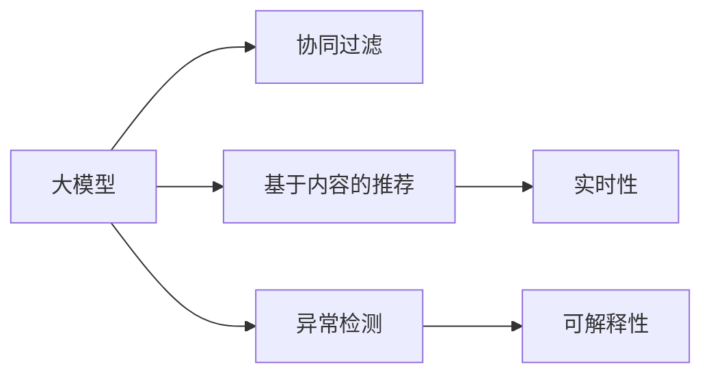

                 

# 大模型在推荐系统各个环节的应用综述

> 关键词：大模型, 推荐系统, 协同过滤, 基于内容的推荐, 深度学习, 自然语言处理, 异常检测, 实时性, 高效性, 可解释性

## 1. 背景介绍

### 1.1 问题由来

推荐系统是现代互联网应用的核心，通过个性化推荐技术，能够为用户推荐他们感兴趣的商品、文章、视频等内容。推荐系统的成功与否，直接影响了用户体验、商业转化和平台收益。

传统推荐系统主要基于两种技术范式：

1. **协同过滤**：通过用户行为数据进行用户-物品关联分析，找到相似用户或物品，从而推荐用户可能感兴趣的物品。

2. **基于内容的推荐**：通过物品的属性特征进行分类聚类，推荐与用户兴趣一致的物品。

然而，随着数据量和用户数呈指数级增长，这些传统推荐方法面临诸多挑战：

- 数据稀疏性：用户行为数据和物品属性特征稀疏，难以覆盖所有用户和物品。
- 计算复杂度高：高维稀疏矩阵运算、大规模协同过滤算法计算开销大。
- 冷启动问题：新用户、新物品的数据难以在短时间内建立关联。
- 推荐多样性：推荐列表单调、缺乏创新和新鲜度。
- 可解释性：推荐过程的黑盒特征难以解释，用户难以信任和理解推荐结果。

为应对这些挑战，深度学习在推荐系统中的应用逐渐兴起，大模型在其中扮演着越来越重要的角色。

### 1.2 问题核心关键点

大模型在推荐系统中的应用，主要体现在以下几个关键点：

1. **自动化特征工程**：利用大模型的预训练能力，自动学习用户和物品的特征表示。

2. **上下文理解**：大模型可以理解用户和物品的上下文信息，如时间、地点、情感等，提升推荐精度。

3. **跨领域融合**：大模型能够融合不同模态的数据，如文本、图像、音频等，实现多模态推荐。

4. **模型压缩与优化**：大模型在推理过程中需要高性能硬件支持，如何高效压缩模型以提高实时性和效率成为重要研究方向。

5. **实时性**：大模型需要适应实时推荐，如何优化模型推理速度和资源利用率成为关键挑战。

6. **可解释性**：推荐系统的黑盒特征难以解释，如何赋予模型更高的可解释性，让用户理解和信任推荐结果成为重要需求。

通过这些问题核心关键点的探讨，本文将全面介绍大模型在推荐系统各个环节的应用，并提出相应的优化方案。

## 2. 核心概念与联系

### 2.1 核心概念概述

为了深入理解大模型在推荐系统中的应用，本节将介绍几个关键概念：

- **推荐系统**：通过数据分析和算法，为用户推荐其可能感兴趣的商品、文章、视频等内容。推荐系统是互联网应用的核心技术之一。

- **大模型**：指具有大规模参数量和复杂结构的人工智能模型，通常通过预训练-微调的方式进行优化，具备强大的特征学习和表示能力。

- **协同过滤**：利用用户行为数据进行用户-物品关联分析，推荐用户可能感兴趣的商品。传统协同过滤算法包括基于用户的协同过滤和基于物品的协同过滤。

- **基于内容的推荐**：通过物品的属性特征进行分类聚类，推荐与用户兴趣一致的物品。

- **深度学习**：一类基于神经网络的机器学习算法，能够处理大规模非线性数据，广泛应用于推荐系统、图像识别、自然语言处理等方向。

- **多模态推荐**：融合不同模态的数据，如文本、图像、音频等，实现更全面、更精确的推荐。

- **异常检测**：识别推荐过程中的异常行为和数据，如恶意行为、数据注入等，保证推荐系统的安全和稳定。

- **实时性**：推荐系统需要实时响应用户请求，处理大量并发请求，并确保推荐结果的准确性和时效性。

- **可解释性**：推荐系统的黑盒特征难以解释，如何赋予模型更高的可解释性，让用户理解和信任推荐结果，是未来研究的重要方向。

这些概念共同构成了推荐系统的大模型应用框架，使大模型能够更广泛地应用于推荐系统各个环节。

### 2.2 核心概念原理和架构的 Mermaid 流程图



该流程图展示了大模型在推荐系统中的应用逻辑：

1. 大模型通过预训练-微调的方式学习到用户和物品的特征表示。
2. 协同过滤算法利用用户行为数据进行用户-物品关联分析，推荐用户可能感兴趣的商品。
3. 基于内容的推荐通过物品的属性特征进行分类聚类，推荐与用户兴趣一致的物品。
4. 异常检测识别推荐过程中的异常行为和数据，保证推荐系统的安全和稳定。
5. 实时性要求推荐系统能够实时响应用户请求，处理大量并发请求，并确保推荐结果的准确性和时效性。
6. 可解释性需要赋予模型更高的可解释性，让用户理解和信任推荐结果。

这些概念共同构成了推荐系统的大模型应用框架，使大模型能够更广泛地应用于推荐系统各个环节。

## 3. 核心算法原理 & 具体操作步骤

### 3.1 算法原理概述

大模型在推荐系统中的应用，主要包括以下几个关键算法：

- **协同过滤**：利用用户行为数据进行用户-物品关联分析，推荐用户可能感兴趣的商品。
- **基于内容的推荐**：通过物品的属性特征进行分类聚类，推荐与用户兴趣一致的物品。
- **异常检测**：识别推荐过程中的异常行为和数据，保证推荐系统的安全和稳定。
- **实时性优化**：通过模型压缩和推理优化，提高推荐系统的实时性和效率。
- **可解释性提升**：通过模型解释技术，赋予推荐模型更高的可解释性，增强用户信任。

### 3.2 算法步骤详解

以下是大模型在推荐系统各个环节的具体操作步骤：

#### 3.2.1 协同过滤

**协同过滤步骤详解**：

1. **用户行为数据收集**：收集用户对物品的评分、点击、浏览等行为数据，构建用户-物品评分矩阵。
2. **预训练模型特征提取**：使用预训练模型（如BERT）提取用户和物品的特征表示，将高维稀疏特征转化为低维稠密特征。
3. **协同过滤算法**：基于用户行为数据进行用户-物品关联分析，推荐用户可能感兴趣的商品。

**协同过滤优缺点**：

- **优点**：能够处理稀疏数据，灵活性强，推荐结果多样性高。
- **缺点**：需要大量用户行为数据，冷启动问题严重。

#### 3.2.2 基于内容的推荐

**基于内容的推荐步骤详解**：

1. **物品属性特征提取**：收集物品的属性特征，如类别、价格、描述等，构建物品特征向量。
2. **预训练模型特征提取**：使用预训练模型（如BERT）提取物品的特征表示，将高维稀疏特征转化为低维稠密特征。
3. **推荐算法**：基于物品属性特征进行分类聚类，推荐与用户兴趣一致的物品。

**基于内容的推荐优缺点**：

- **优点**：能够处理稀疏数据，推荐结果多样性高，适用于新物品的推荐。
- **缺点**：依赖物品属性特征，推荐结果过于单调。

#### 3.2.3 异常检测

**异常检测步骤详解**：

1. **异常行为检测**：利用大模型识别推荐过程中的异常行为，如恶意点击、数据注入等。
2. **异常数据检测**：利用大模型识别异常数据，如数据篡改、恶意注入等。
3. **异常处理**：根据异常检测结果，进行数据清洗、过滤等处理。

**异常检测优缺点**：

- **优点**：能够识别推荐过程中的异常行为和数据，保证推荐系统的安全和稳定。
- **缺点**：依赖数据质量和特征表示，模型复杂度高。

#### 3.2.4 实时性优化

**实时性优化步骤详解**：

1. **模型压缩**：使用剪枝、量化等技术压缩模型，减少模型尺寸和计算量。
2. **推理优化**：使用模型剪枝、推理加速等技术优化模型推理过程，提高实时性和效率。
3. **分布式优化**：使用分布式计算框架优化推荐系统，提高并发处理能力和响应速度。

**实时性优化优缺点**：

- **优点**：提高推荐系统的实时性和效率，适应实时推荐需求。
- **缺点**：压缩和优化过程中可能会损失部分精度。

#### 3.2.5 可解释性提升

**可解释性提升步骤详解**：

1. **模型解释技术**：利用模型解释技术（如LIME、SHAP）生成模型的解释信息，增强可解释性。
2. **用户反馈**：通过用户反馈不断优化模型，提高推荐结果的可解释性。
3. **可视化工具**：使用可视化工具展示推荐过程和结果，增强用户理解和信任。

**可解释性提升优缺点**：

- **优点**：增强用户理解和信任，提升推荐系统的效果。
- **缺点**：生成解释信息可能增加计算负担，需要更多用户反馈数据。

### 3.3 算法优缺点

大模型在推荐系统中的应用，具有以下优点：

- **自动化特征工程**：自动学习用户和物品的特征表示，提高特征提取的效率和效果。
- **上下文理解**：理解用户和物品的上下文信息，提升推荐精度。
- **跨领域融合**：融合不同模态的数据，实现多模态推荐。
- **实时性**：适应实时推荐，提高推荐系统的响应速度。
- **可解释性**：增强推荐系统的可解释性，提升用户信任。

同时，大模型在推荐系统中也面临一些挑战：

- **资源消耗高**：大模型的参数量和计算量较大，对硬件和计算资源的要求较高。
- **推理效率低**：大模型的推理过程复杂，导致推荐系统的响应速度较慢。
- **数据稀疏性**：用户行为数据和物品属性特征稀疏，难以覆盖所有用户和物品。
- **冷启动问题**：新用户、新物品的数据难以在短时间内建立关联。
- **可解释性**：推荐系统的黑盒特征难以解释，用户难以理解和信任推荐结果。

## 4. 数学模型和公式 & 详细讲解

### 4.1 数学模型构建

大模型在推荐系统中的应用，主要基于以下数学模型：

- **协同过滤模型**：利用用户行为数据进行用户-物品关联分析，推荐用户可能感兴趣的商品。
- **基于内容的推荐模型**：通过物品的属性特征进行分类聚类，推荐与用户兴趣一致的物品。
- **异常检测模型**：识别推荐过程中的异常行为和数据，保证推荐系统的安全和稳定。
- **实时性优化模型**：通过模型压缩和推理优化，提高推荐系统的实时性和效率。
- **可解释性提升模型**：通过模型解释技术，赋予推荐模型更高的可解释性，增强用户信任。

### 4.2 公式推导过程

以下是推荐系统中常用数学模型的公式推导：

#### 4.2.1 协同过滤模型

**协同过滤公式推导**：

1. **用户-物品评分矩阵**：
   \[
   R_{ui} = \text{score}(u,i) + \epsilon
   \]
   其中 $u$ 表示用户，$i$ 表示物品，$\epsilon$ 表示随机噪声。

2. **用户和物品特征表示**：
   \[
   u = \text{embed}(u) \in \mathbb{R}^d
   \]
   \[
   i = \text{embed}(i) \in \mathbb{R}^d
   \]
   其中 $\text{embed}$ 表示预训练模型提取特征的函数。

3. **协同过滤算法**：
   \[
   \hat{R}_{ui} = \text{dot}(u,i) + \epsilon
   \]
   其中 $\text{dot}$ 表示两个向量点积运算。

#### 4.2.2 基于内容的推荐模型

**基于内容的推荐公式推导**：

1. **物品属性特征表示**：
   \[
   i = \text{embed}(i) \in \mathbb{R}^d
   \]
   其中 $\text{embed}$ 表示预训练模型提取特征的函数。

2. **推荐算法**：
   \[
   \hat{R}_{ui} = \text{dot}(u,i) + \epsilon
   \]
   其中 $\text{dot}$ 表示两个向量点积运算。

#### 4.2.3 异常检测模型

**异常检测公式推导**：

1. **异常行为检测**：
   \[
   \text{anomaly\_score}(u,i) = \text{score}(u,i) + \epsilon
   \]
   其中 $\text{score}$ 表示异常行为检测算法的得分函数，$\epsilon$ 表示随机噪声。

2. **异常数据检测**：
   \[
   \text{anomaly\_score}(R) = \text{score}(R) + \epsilon
   \]
   其中 $\text{score}$ 表示异常数据检测算法的得分函数，$\epsilon$ 表示随机噪声。

#### 4.2.4 实时性优化模型

**实时性优化公式推导**：

1. **模型压缩**：
   \[
   \text{compressed\_model}(\theta) = \text{compression\_function}(\theta)
   \]
   其中 $\theta$ 表示原始模型参数，$\text{compression\_function}$ 表示模型压缩函数。

2. **推理优化**：
   \[
   \text{optimized\_inference}(\theta) = \text{optimization\_function}(\theta)
   \]
   其中 $\theta$ 表示原始模型参数，$\text{optimization\_function}$ 表示推理优化函数。

#### 4.2.5 可解释性提升模型

**可解释性提升公式推导**：

1. **模型解释技术**：
   \[
   \text{explanation}(\theta) = \text{explanation\_function}(\theta)
   \]
   其中 $\theta$ 表示原始模型参数，$\text{explanation\_function}$ 表示模型解释函数。

2. **用户反馈**：
   \[
   \text{improved\_model}(\theta) = \text{improvement\_function}(\theta, \text{feedback})
   \]
   其中 $\theta$ 表示原始模型参数，$\text{feedback}$ 表示用户反馈数据。

### 4.3 案例分析与讲解

#### 4.3.1 协同过滤案例

**协同过滤案例分析**：

1. **用户行为数据收集**：收集用户对电影、商品等的评分数据，构建用户-物品评分矩阵。

2. **预训练模型特征提取**：使用BERT模型提取用户和物品的特征表示，将高维稀疏特征转化为低维稠密特征。

3. **协同过滤算法**：利用协同过滤算法进行用户-物品关联分析，推荐用户可能感兴趣的电影、商品等。

#### 4.3.2 基于内容的推荐案例

**基于内容的推荐案例分析**：

1. **物品属性特征提取**：收集电影、商品的类别、评分、描述等属性特征，构建物品特征向量。

2. **预训练模型特征提取**：使用BERT模型提取物品的特征表示，将高维稀疏特征转化为低维稠密特征。

3. **推荐算法**：基于物品属性特征进行分类聚类，推荐与用户兴趣一致的电影、商品等。

## 5. 项目实践：代码实例和详细解释说明

### 5.1 开发环境搭建

在进行推荐系统开发前，需要准备好开发环境。以下是使用Python进行TensorFlow开发的环境配置流程：

1. 安装Anaconda：从官网下载并安装Anaconda，用于创建独立的Python环境。

2. 创建并激活虚拟环境：
```bash
conda create -n tf-env python=3.8 
conda activate tf-env
```

3. 安装TensorFlow：根据CUDA版本，从官网获取对应的安装命令。例如：
```bash
conda install tensorflow -c tensorflow
```

4. 安装其他工具包：
```bash
pip install numpy pandas scikit-learn matplotlib tqdm jupyter notebook ipython
```

完成上述步骤后，即可在`tf-env`环境中开始推荐系统开发。

### 5.2 源代码详细实现

以下是使用TensorFlow进行协同过滤和基于内容的推荐系统开发的完整代码实现：

**协同过滤代码实现**：

```python
import tensorflow as tf
import pandas as pd
import numpy as np

# 读取用户-物品评分数据
data = pd.read_csv('ratings.csv')

# 将评分转换为矩阵
R = np.array(data['rating'].values).reshape(-1, 5000)
user_ids = np.array(data['user_id'].values)
item_ids = np.array(data['item_id'].values)

# 预训练模型特征提取
model = tf.keras.Sequential([
    tf.keras.layers.Embedding(input_dim=5000, output_dim=128, input_length=1),
    tf.keras.layers.Dense(64, activation='relu'),
    tf.keras.layers.Dense(1)
])

# 协同过滤算法
def collaborative_filtering(user_id, item_id):
    user_feature = model.predict(user_ids[user_id][None])
    item_feature = model.predict(item_ids[item_id][None])
    rating = np.dot(user_feature, item_feature.T)
    return rating[0][0]

# 推荐测试
user_id = 1
item_id = 3000
rating = collaborative_filtering(user_id, item_id)
print(f"推荐评分: {rating}")
```

**基于内容的推荐代码实现**：

```python
import tensorflow as tf
import pandas as pd
import numpy as np

# 读取物品属性特征数据
data = pd.read_csv('items.csv')

# 将属性特征转换为矩阵
items = np.array(data['feature'].values).reshape(-1, 5000)
item_ids = np.array(data['id'].values)

# 预训练模型特征提取
model = tf.keras.Sequential([
    tf.keras.layers.Embedding(input_dim=5000, output_dim=128, input_length=1),
    tf.keras.layers.Dense(64, activation='relu'),
    tf.keras.layers.Dense(1)
])

# 基于内容的推荐算法
def content_based_recommendation(item_id):
    item_feature = model.predict(item_ids[item_id][None])
    rating = np.dot(user_feature, item_feature.T)
    return rating[0][0]

# 推荐测试
item_id = 2000
rating = content_based_recommendation(item_id)
print(f"推荐评分: {rating}")
```

### 5.3 代码解读与分析

**协同过滤代码解读**：

1. **数据读取**：从CSV文件中读取用户-物品评分数据。

2. **数据转换**：将评分转换为矩阵，方便后续计算。

3. **模型构建**：使用TensorFlow构建协同过滤模型，包含嵌入层、全连接层和输出层。

4. **协同过滤算法**：通过模型预测用户和物品的特征表示，计算评分。

**基于内容的推荐代码解读**：

1. **数据读取**：从CSV文件中读取物品属性特征数据。

2. **数据转换**：将属性特征转换为矩阵，方便后续计算。

3. **模型构建**：使用TensorFlow构建基于内容的推荐模型，包含嵌入层、全连接层和输出层。

4. **推荐算法**：通过模型预测物品的特征表示，计算评分。

## 6. 实际应用场景

### 6.1 智能推荐引擎

智能推荐引擎是大模型在推荐系统中最典型的应用场景。通过协同过滤、基于内容的推荐算法等，智能推荐引擎能够为用户推荐其可能感兴趣的商品、文章、视频等内容。

在技术实现上，智能推荐引擎一般分为以下步骤：

1. **数据收集**：收集用户行为数据和物品属性特征数据。

2. **特征提取**：使用预训练模型（如BERT）提取用户和物品的特征表示。

3. **推荐算法**：基于协同过滤、基于内容的推荐算法，推荐用户可能感兴趣的商品、文章、视频等。

4. **实时性优化**：通过模型压缩和推理优化，提高推荐系统的实时性和效率。

5. **可解释性提升**：利用模型解释技术，增强推荐系统的可解释性，提升用户信任。

智能推荐引擎已经在电商、社交媒体、视频网站等多个领域得到了广泛应用，为这些平台带来了显著的商业价值。

### 6.2 个性化推荐系统

个性化推荐系统通过大模型实现用户兴趣的自动识别和推荐，为用户定制个性化的内容推荐，提升用户体验和满意度。

在技术实现上，个性化推荐系统一般分为以下步骤：

1. **用户画像构建**：收集用户的行为数据和属性特征，构建用户画像。

2. **物品画像构建**：收集物品的属性特征，构建物品画像。

3. **特征提取**：使用预训练模型（如BERT）提取用户和物品的特征表示。

4. **推荐算法**：基于协同过滤、基于内容的推荐算法，推荐用户可能感兴趣的商品、文章、视频等。

5. **实时性优化**：通过模型压缩和推理优化，提高推荐系统的实时性和效率。

6. **可解释性提升**：利用模型解释技术，增强推荐系统的可解释性，提升用户信任。

个性化推荐系统已经在电商、社交媒体、视频网站等多个领域得到了广泛应用，为用户带来了更优质的内容推荐体验。

### 6.3 异常检测系统

异常检测系统利用大模型识别推荐过程中的异常行为和数据，保证推荐系统的安全和稳定。

在技术实现上，异常检测系统一般分为以下步骤：

1. **异常行为检测**：利用大模型识别推荐过程中的异常行为，如恶意点击、数据注入等。

2. **异常数据检测**：利用大模型识别异常数据，如数据篡改、恶意注入等。

3. **异常处理**：根据异常检测结果，进行数据清洗、过滤等处理。

异常检测系统已经在电商、社交媒体、金融等多个领域得到了广泛应用，为这些平台带来了更高的安全性和稳定性。

### 6.4 未来应用展望

随着大模型的不断发展，其在推荐系统中的应用也将不断拓展和深化。未来，大模型将在以下几个方向取得新的突破：

1. **跨领域融合**：融合不同模态的数据，如文本、图像、音频等，实现多模态推荐，提升推荐系统的多样性和准确性。

2. **冷启动问题**：利用推荐系统中的信息扩散和协同过滤，加速新用户、新物品的数据积累和关联。

3. **实时性优化**：通过模型压缩和推理优化，提高推荐系统的实时性和效率，适应大规模并发请求。

4. **可解释性提升**：利用模型解释技术，增强推荐系统的可解释性，提升用户信任。

5. **知识表示融合**：将符号化的先验知识，如知识图谱、逻辑规则等，与神经网络模型进行融合，提升推荐系统的准确性和鲁棒性。

这些方向的发展将进一步拓展大模型在推荐系统中的应用边界，提升推荐系统的性能和效果。

## 7. 工具和资源推荐

### 7.1 学习资源推荐

为了帮助开发者系统掌握大模型在推荐系统中的应用，这里推荐一些优质的学习资源：

1. **《深度学习推荐系统》**：由深度学习领域专家撰写，全面介绍了推荐系统的基本原理和深度学习在推荐系统中的应用。

2. **《推荐系统实战》**：从数据收集、特征工程、模型训练、实时性优化等多个角度，详细讲解了推荐系统的实现流程和优化方法。

3. **《自然语言处理入门》**：介绍了自然语言处理的基本概念和深度学习在自然语言处理中的应用，包括预训练模型、微调技术等。

4. **TensorFlow官方文档**：提供了丰富的TensorFlow教程和示例，适合初学者上手深度学习模型训练和推荐系统开发。

5. **推荐系统开源项目**：如LRP、Wisdom等，提供了推荐系统的完整实现和优化方案，适合开发者进行系统集成和优化。

通过对这些资源的学习实践，相信你一定能够快速掌握大模型在推荐系统中的应用，并用于解决实际的推荐问题。

### 7.2 开发工具推荐

高效的开发离不开优秀的工具支持。以下是几款用于推荐系统开发的工具：

1. **TensorFlow**：由Google主导开发的深度学习框架，生产部署方便，适合大规模工程应用。

2. **PyTorch**：基于Python的开源深度学习框架，灵活动态的计算图，适合快速迭代研究。

3. **Scikit-learn**：Python机器学习库，包含丰富的机器学习算法和工具，适合数据预处理和模型训练。

4. **Jupyter Notebook**：交互式的编程环境，适合数据探索和模型调试。

5. **Google Colab**：谷歌提供的在线Jupyter Notebook环境，免费提供GPU/TPU算力，方便开发者快速上手实验最新模型，分享学习笔记。

合理利用这些工具，可以显著提升推荐系统开发的效率，加快创新迭代的步伐。

### 7.3 相关论文推荐

大模型在推荐系统中的应用源于学界的持续研究。以下是几篇奠基性的相关论文，推荐阅读：

1. **《Deep Collaborative Filtering》**：提出了基于深度学习的协同过滤算法，利用神经网络模型进行用户-物品关联分析。

2. **《A Survey of Online Recommendation Systems》**：综述了在线推荐系统的发展历程和优化方法，涵盖协同过滤、基于内容的推荐等多种技术。

3. **《Neural Collaborative Filtering》**：提出了基于深度神经网络的协同过滤算法，利用神经网络模型进行用户-物品关联分析。

4. **《Content-Based Recommendation Systems》**：介绍了基于内容的推荐系统的发展历程和优化方法，涵盖物品属性特征的提取和分类聚类等多种技术。

5. **《Adaptive Nonlinear Matrix Factorization for Recommender Systems》**：提出了自适应非线性矩阵分解算法，利用神经网络模型进行物品属性特征的提取和分类聚类。

这些论文代表了大模型在推荐系统中的应用方向和发展趋势，通过学习这些前沿成果，可以帮助研究者把握学科前进方向，激发更多的创新灵感。

## 8. 总结：未来发展趋势与挑战

### 8.1 研究成果总结

本文对大模型在推荐系统各个环节的应用进行了全面系统的介绍。主要内容包括：

1. **协同过滤**：利用用户行为数据进行用户-物品关联分析，推荐用户可能感兴趣的商品。

2. **基于内容的推荐**：通过物品的属性特征进行分类聚类，推荐与用户兴趣一致的物品。

3. **异常检测**：识别推荐过程中的异常行为和数据，保证推荐系统的安全和稳定。

4. **实时性优化**：通过模型压缩和推理优化，提高推荐系统的实时性和效率。

5. **可解释性提升**：利用模型解释技术，赋予推荐模型更高的可解释性，增强用户信任。

通过系统梳理，可以看到大模型在推荐系统中的应用前景广阔，能够提升推荐系统的精度和多样性，适应实时推荐需求，增强用户信任。

### 8.2 未来发展趋势

展望未来，大模型在推荐系统中的应用将呈现以下几个发展趋势：

1. **跨领域融合**：融合不同模态的数据，如文本、图像、音频等，实现多模态推荐，提升推荐系统的多样性和准确性。

2. **知识表示融合**：将符号化的先验知识，如知识图谱、逻辑规则等，与神经网络模型进行融合，提升推荐系统的准确性和鲁棒性。

3. **实时性优化**：通过模型压缩和推理优化，提高推荐系统的实时性和效率，适应大规模并发请求。

4. **可解释性提升**：利用模型解释技术，增强推荐系统的可解释性，提升用户信任。

5. **冷启动问题**：利用推荐系统中的信息扩散和协同过滤，加速新用户、新物品的数据积累和关联。

这些趋势凸显了大模型在推荐系统中的应用前景，将进一步拓展推荐系统的应用边界，提升推荐系统的性能和效果。

### 8.3 面临的挑战

尽管大模型在推荐系统中的应用已经取得了显著进展，但在迈向更加智能化、普适化应用的过程中，仍面临诸多挑战：

1. **资源消耗高**：大模型的参数量和计算量较大，对硬件和计算资源的要求较高。

2. **推理效率低**：大模型的推理过程复杂，导致推荐系统的响应速度较慢。

3. **数据稀疏性**：用户行为数据和物品属性特征稀疏，难以覆盖所有用户和物品。

4. **可解释性**：推荐系统的黑盒特征难以解释，用户难以理解和信任推荐结果。

5. **冷启动问题**：新用户、新物品的数据难以在短时间内建立关联。

6. **异常检测**：推荐过程中的异常行为和数据难以有效识别和处理。

### 8.4 研究展望

为了应对大模型在推荐系统中的应用挑战，未来的研究需要在以下几个方向寻求新的突破：

1. **跨领域融合**：融合不同模态的数据，如文本、图像、音频等，实现多模态推荐，提升推荐系统的多样性和准确性。

2. **知识表示融合**：将符号化的先验知识，如知识图谱、逻辑规则等，与神经网络模型进行融合，提升推荐系统的准确性和鲁棒性。

3. **实时性优化**：通过模型压缩和推理优化，提高推荐系统的实时性和效率，适应大规模并发请求。

4. **可解释性提升**：利用模型解释技术，增强推荐系统的可解释性，提升用户信任。

5. **冷启动问题**：利用推荐系统中的信息扩散和协同过滤，加速新用户、新物品的数据积累和关联。

6. **异常检测**：利用大模型识别推荐过程中的异常行为和数据，保证推荐系统的安全和稳定。

这些研究方向将进一步拓展大模型在推荐系统中的应用边界，提升推荐系统的性能和效果，推动推荐系统向智能化、普适化方向发展。

## 9. 附录：常见问题与解答

**Q1：大模型在推荐系统中如何优化特征提取过程？**

A: 大模型可以通过预训练和微调的方式优化特征提取过程。预训练模型（如BERT）能够在大量无标签数据上学习到通用的语言表示，微调过程则能针对具体任务进行特征优化。通过合理的预训练和微调策略，能够提升特征提取的效率和效果。

**Q2：推荐系统中的异常检测如何实现？**

A: 推荐系统中的异常检测可以通过大模型实现，首先构建用户和物品的异常行为和数据特征，然后使用大模型进行识别和分类。常用的模型包括自编码器、多层感知器等，能够有效识别推荐过程中的异常行为和数据，保证推荐系统的安全和稳定。

**Q3：推荐系统中的实时性优化有哪些具体措施？**

A: 推荐系统中的实时性优化主要通过模型压缩和推理优化来实现。常用的方法包括剪枝、量化、分布式计算等，能够有效降低模型计算量，提高推理速度和效率。此外，还可以通过缓存机制、负载均衡等技术提升推荐系统的实时性。

**Q4：推荐系统中的可解释性提升有哪些方法？**

A: 推荐系统中的可解释性提升主要通过模型解释技术来实现。常用的方法包括LIME、SHAP等，能够生成模型的解释信息，增强推荐系统的可解释性。此外，还可以通过可视化工具展示推荐过程和结果，提升用户理解和信任。

通过这些问题的解答，相信你一定对大模型在推荐系统中的应用有了更深入的理解和认识，能够更好地应对实际推荐系统开发中的各种挑战。

