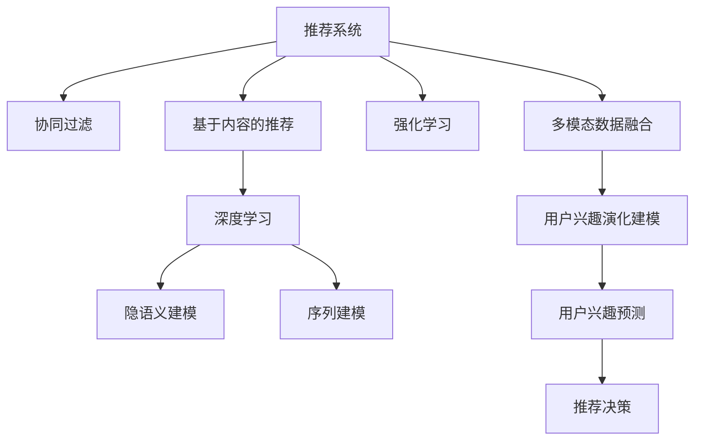

                 

# 大模型在推荐系统用户兴趣演化建模中的应用

> 关键词：大模型,推荐系统,用户兴趣,演化建模,隐语义建模,用户画像,序列建模,深度学习,强化学习

## 1. 背景介绍

### 1.1 问题由来
随着互联网和移动互联网的迅猛发展，推荐系统在电商、新闻、视频等众多领域得以广泛应用，极大地提升了用户体验和效率。当前主流推荐系统以协同过滤和基于内容的推荐为主，这些方法虽然能取得不错的推荐效果，但都难以充分挖掘用户兴趣的演化动态，推荐效果受用户历史行为的影响较大。

用户兴趣是动态演变的，随着时间推移和环境变化，用户的兴趣热点、偏好类型、关注焦点等都在不断变化。因此，推荐系统必须能够及时捕捉并准确预测用户的兴趣变化，才能始终提供满足用户需求的内容。而现有方法大多基于静态用户画像，无法刻画用户兴趣的长期演化趋势，对用户的短期行为依赖较重，难以捕捉用户兴趣的即时变化。

### 1.2 问题核心关键点
用户兴趣演化建模的目标是构建能够反映用户长期兴趣变化的用户画像，以更好地指导推荐决策。该问题具有以下几个关键点：

- 数据的多模态特征。用户兴趣特征不仅包含行为数据，还包括兴趣图谱、新闻事件、天气等信息。多模态数据的融合是提高用户兴趣理解深度和广度的关键。
- 序列建模的长期和短期预测。传统的推荐模型更多关注短期的行为序列，难以捕捉用户兴趣演化的长期趋势。如何同时预测短期行为和长期兴趣演化，是提升推荐效果的重要研究方向。
- 隐语义建模的稀疏性和多维性。用户兴趣数据往往稀疏且高维，如何通过稀疏隐语义建模学习到深层次的用户兴趣特征，是建模的关键。
- 强化学习与深度学习的融合。强化学习可以学习到更加复杂的决策策略，将其与深度学习结合，可以提升推荐系统的智能性。

## 2. 核心概念与联系

### 2.1 核心概念概述

为了理解大模型在推荐系统用户兴趣演化建模中的应用，本节将介绍几个密切相关的核心概念：

- 推荐系统：利用用户历史行为和物品特征，通过机器学习模型为用户推荐感兴趣物品的系统。
- 协同过滤：通过分析用户行为和物品关系，学习用户与物品的潜在关联，进行推荐决策。
- 基于内容的推荐：根据物品属性和用户特征，通过相似度计算推荐物品。
- 深度学习：通过构建深层神经网络结构，学习复杂的特征表示，提升推荐模型的泛化能力。
- 隐语义建模：通过隐向量学习用户和物品的深层次特征，捕捉用户长期兴趣和偏好。
- 序列建模：通过模型学习用户行为序列的时间依赖关系，预测用户未来行为。
- 强化学习：通过模型在环境中执行策略，不断尝试和优化，学习最优推荐策略。
- 多模态数据融合：将不同类型的用户数据融合到推荐模型中，提升兴趣理解的深度和广度。

这些核心概念之间的逻辑关系可以通过以下Mermaid流程图来展示：



这个流程图展示了大模型在推荐系统中的核心概念及其之间的关系：

1. 推荐系统通过协同过滤、基于内容的推荐、深度学习等方法，获取用户历史行为数据。
2. 隐语义建模通过学习用户隐向量，捕捉用户长期兴趣和偏好。
3. 序列建模通过学习用户行为序列的时间依赖关系，预测用户未来行为。
4. 强化学习通过学习用户-物品交互策略，不断优化推荐决策。
5. 多模态数据融合将多种类型的数据融合到推荐模型中，提升兴趣理解的深度和广度。
6. 用户兴趣演化建模通过多模态融合、序列建模等方法，捕捉用户兴趣的长期和短期变化趋势。
7. 用户兴趣预测利用演化模型，预测用户未来的兴趣热点，指导推荐决策。

这些概念共同构成了大模型在推荐系统中的应用框架，使其能够更好地理解用户兴趣演化，提高推荐系统的智能化和精准化水平。

## 3. 核心算法原理 & 具体操作步骤
### 3.1 算法原理概述

大模型在推荐系统中的用户兴趣演化建模，主要基于隐语义建模和序列建模的思路，通过学习用户长期兴趣和短期行为序列，构建用户兴趣变化的动态模型。

假设用户的历史行为序列为 $X=\{x_1, x_2, ..., x_t\}$，其中 $x_t$ 表示用户在时间 $t$ 的行为，可以是浏览、购买、评分等。用户的历史行为由多个时刻 $t$ 的兴趣演化状态 $H_t$ 和短期行为 $I_t$ 组成：

$$
H_t = (h_{t-1}, h_{t-2}, ..., h_0)
$$

$$
I_t = (i_{t-1}, i_{t-2}, ..., i_0)
$$

其中 $h_t$ 表示用户在时刻 $t$ 的隐语义表示，$i_t$ 表示用户在该时刻的即时行为。用户兴趣演化模型通过时间依赖关系，学习 $h_t$ 和 $i_t$ 之间的映射关系，预测用户未来的兴趣状态 $H_{t+1}$。

### 3.2 算法步骤详解

大模型在推荐系统中的用户兴趣演化建模，一般包括以下几个关键步骤：

**Step 1: 数据准备**
- 收集用户历史行为数据，并将其按照时间顺序排列。
- 对行为数据进行预处理，如去噪、归一化、特征工程等。
- 将用户兴趣图谱、新闻事件、天气等信息作为额外数据源，进行预处理和融合。

**Step 2: 构建隐语义模型**
- 设计合适的隐向量维度 $d$，构建用户隐语义向量 $H_t$ 和行为隐语义向量 $I_t$。
- 通过隐向量表示，捕捉用户长期兴趣和行为序列的短期变化。

**Step 3: 构建序列预测模型**
- 选择适当的序列建模方法，如RNN、LSTM、GRU等，构建用户行为序列的预测模型。
- 在预测用户未来行为 $i_{t+1}$ 时，利用当前兴趣状态 $H_t$ 和历史行为 $I_t$，进行模型训练和预测。

**Step 4: 用户兴趣演化预测**
- 利用序列预测模型，学习 $H_{t+1}$ 与 $H_t$ 和 $I_t$ 之间的映射关系，预测用户未来的兴趣状态。
- 通过兴趣演化模型，捕捉用户兴趣的长期变化趋势。

**Step 5: 生成推荐结果**
- 将用户兴趣演化模型与传统推荐方法结合，生成推荐结果。
- 结合用户实时行为和兴趣状态，生成即时推荐。

**Step 6: 持续学习与优化**
- 定期更新用户历史行为数据，重新训练兴趣演化模型。
- 对模型性能进行评估和优化，提高推荐效果。

以上是大模型在推荐系统中用户兴趣演化建模的一般流程。在实际应用中，还需要针对具体任务和数据特点，对各个环节进行优化设计，如引入更多先验知识、设计更好的隐语义模型、优化序列预测算法等，以进一步提升模型性能。

### 3.3 算法优缺点

大模型在推荐系统中的用户兴趣演化建模，具有以下优点：

1. 深度融合多模态数据：通过隐语义建模和序列建模，大模型能够融合多种数据源，捕捉用户兴趣的深度和广度，提升推荐系统的泛化能力。
2. 动态捕捉兴趣变化：序列建模方法能够捕捉用户兴趣的短期变化，隐语义模型则能捕捉长期趋势，使推荐系统能够更灵活地适应用户兴趣的动态演化。
3. 提升推荐效果：通过兴趣演化模型，推荐系统能够更好地捕捉用户未来的兴趣热点，提高推荐结果的精准性和相关性。

同时，该方法也存在一定的局限性：

1. 模型复杂度高：隐语义模型和序列建模需要大量计算资源，大模型的复杂度较高。
2. 需要高质量数据：数据预处理和融合需要高质量的数据源，对数据质量和数据量要求较高。
3. 模型训练时间长：大模型的训练时间和计算资源需求较大，需要较为复杂的训练流程和设备支持。

尽管存在这些局限性，但就目前而言，大模型在推荐系统中的应用已成为一种重要的发展方向，能够显著提升推荐系统的智能性和推荐效果。

### 3.4 算法应用领域

大模型在推荐系统中的应用，已广泛应用于以下领域：

1. 电商推荐：通过用户历史行为和兴趣演化建模，为电商用户推荐个性化商品，提高用户满意度和转化率。
2. 新闻推荐：结合用户历史阅读记录和兴趣演化，推荐个性化新闻内容，提升用户粘性和满意度。
3. 视频推荐：利用用户观看记录和兴趣演化，推荐个性化视频内容，增加用户观看时间和粘性。
4. 社交推荐：通过分析用户社交网络中的兴趣演化，推荐个性化好友和内容，提升社交平台的用户粘性。

## 4. 数学模型和公式 & 详细讲解  
### 4.1 数学模型构建

大模型在推荐系统中的用户兴趣演化建模，主要基于隐语义建模和序列建模的思路。

记用户历史行为序列为 $X=\{x_1, x_2, ..., x_t\}$，其中 $x_t$ 表示用户在时间 $t$ 的行为。用户历史行为由多个时刻 $t$ 的兴趣演化状态 $H_t$ 和短期行为 $I_t$ 组成：

$$
H_t = (h_{t-1}, h_{t-2}, ..., h_0)
$$

$$
I_t = (i_{t-1}, i_{t-2}, ..., i_0)
$$

其中 $h_t$ 表示用户在时刻 $t$ 的隐语义表示，$i_t$ 表示用户在该时刻的即时行为。用户兴趣演化模型通过时间依赖关系，学习 $h_t$ 和 $i_t$ 之间的映射关系，预测用户未来的兴趣状态 $H_{t+1}$。

通过隐向量 $h_t$ 和行为向量 $i_t$ 的拼接，构建用户隐语义向量 $h_t \oplus i_t$，作为用户历史行为在时刻 $t$ 的隐向量表示。用户隐向量 $h_t$ 和行为隐向量 $i_t$ 的计算公式为：

$$
h_t = W_h \cdot \sigma(H_{t-1} \oplus i_{t-1}) + b_h
$$

$$
i_t = W_i \cdot \sigma(H_{t-1} \oplus i_{t-1}) + b_i
$$

其中 $W_h$ 和 $b_h$ 为隐语义向量的权重和偏置，$W_i$ 和 $b_i$ 为行为向量的权重和偏置，$\sigma$ 为激活函数，如ReLU、Sigmoid等。

通过隐语义向量 $h_t$ 和行为隐向量 $i_t$，用户兴趣演化模型 $f$ 预测用户未来的兴趣状态 $H_{t+1}$：

$$
H_{t+1} = f(h_t, i_t, H_t)
$$

其中 $f$ 为兴趣演化模型的映射函数，可以采用RNN、LSTM、GRU等序列建模方法。

### 4.2 公式推导过程

以下我们以LSTM模型为例，推导用户兴趣演化预测的公式。

假设用户兴趣演化模型 $f$ 为LSTM模型，根据LSTM模型原理，有：

$$
h_t = f_i(H_{t-1}, i_{t-1}, g_t)
$$

$$
g_t = \sigma(W_g \cdot [H_{t-1}, i_{t-1}] + b_g)
$$

$$
i_t = f_o(H_{t-1}, i_{t-1}, g_t)
$$

$$
f_o = \sigma(W_f \cdot [H_{t-1}, i_{t-1}] + b_f)
$$

其中 $h_t$ 表示LSTM模型的隐向量，$g_t$ 表示LSTM模型的记忆门向量，$f_i$ 表示LSTM模型的输入门函数，$f_o$ 表示LSTM模型的输出门函数，$W_g$ 和 $b_g$ 为记忆门向量的权重和偏置，$W_f$ 和 $b_f$ 为输出门向量的权重和偏置。

将隐语义向量 $h_t$ 和行为隐向量 $i_t$ 代入LSTM模型，得：

$$
h_t = f_i(H_{t-1} \oplus i_{t-1}, g_t)
$$

$$
g_t = \sigma(W_g \cdot [H_{t-1} \oplus i_{t-1}] + b_g)
$$

$$
i_t = f_o(H_{t-1} \oplus i_{t-1}, g_t)
$$

$$
f_o = \sigma(W_f \cdot [H_{t-1} \oplus i_{t-1}] + b_f)
$$

用户兴趣演化模型 $f$ 预测用户未来的兴趣状态 $H_{t+1}$，可以利用LSTM模型的状态转移公式：

$$
H_{t+1} = \sigma(W_H \cdot [h_t, g_t] + b_H)
$$

其中 $W_H$ 和 $b_H$ 为兴趣演化模型的权重和偏置。

### 4.3 案例分析与讲解

以下以电商推荐系统为例，具体分析大模型在该场景中的应用。

电商推荐系统需要根据用户历史购买记录和浏览记录，推荐个性化商品。假设某用户的历史行为序列为：

$$
\begin{aligned}
x_0 &= (商品A, 商品B) \\
x_1 &= (商品A, 商品C, 商品D) \\
x_2 &= (商品C, 商品E, 商品F)
\end{aligned}
$$

利用隐语义模型和LSTM序列模型，预测该用户未来的兴趣状态 $H_3$ 和购买行为 $i_3$。首先，通过隐语义模型，得到用户历史行为的隐向量表示：

$$
h_0 = W_h \cdot \sigma(H_{-1} \oplus i_{-1}) + b_h = W_h \cdot \sigma([0, 0] \oplus [0, 0]) + b_h = 0
$$

$$
i_0 = W_i \cdot \sigma(H_{-1} \oplus i_{-1}) + b_i = W_i \cdot \sigma([0, 0] \oplus [0, 0]) + b_i = 0
$$

$$
h_1 = W_h \cdot \sigma(H_0 \oplus i_0) + b_h = W_h \cdot \sigma([0, 0] \oplus [0, 0]) + b_h = 0
$$

$$
i_1 = W_i \cdot \sigma(H_0 \oplus i_0) + b_i = W_i \cdot \sigma([0, 0] \oplus [0, 0]) + b_i = 0
$$

$$
h_2 = W_h \cdot \sigma(H_1 \oplus i_1) + b_h = W_h \cdot \sigma([0, 0] \oplus [0, 0]) + b_h = 0
$$

$$
i_2 = W_i \cdot \sigma(H_1 \oplus i_1) + b_i = W_i \cdot \sigma([0, 0] \oplus [0, 0]) + b_i = 0
$$

$$
h_3 = W_h \cdot \sigma(H_2 \oplus i_2) + b_h = W_h \cdot \sigma([h_2, i_2]) + b_h = W_h \cdot \sigma([0, 0]) + b_h = 0
$$

$$
i_3 = W_i \cdot \sigma(H_2 \oplus i_2) + b_i = W_i \cdot \sigma([h_2, i_2]) + b_i = W_i \cdot \sigma([0, 0]) + b_i = 0
$$

通过LSTM模型，得到用户未来兴趣状态 $H_3$ 和购买行为 $i_3$：

$$
h_3 = f_i(H_2, i_2, g_3)
$$

$$
g_3 = \sigma(W_g \cdot [H_2, i_2] + b_g)
$$

$$
i_3 = f_o(H_2, i_2, g_3)
$$

$$
f_o = \sigma(W_f \cdot [H_2, i_2] + b_f)
$$

利用 $h_3$ 和 $g_3$，预测用户未来兴趣状态 $H_4$：

$$
H_4 = \sigma(W_H \cdot [h_3, g_3] + b_H)
$$

其中 $W_H$ 和 $b_H$ 为兴趣演化模型的权重和偏置。

最后，结合用户未来兴趣状态 $H_4$ 和历史行为 $i_3$，生成推荐结果。

## 5. 项目实践：代码实例和详细解释说明
### 5.1 开发环境搭建

在进行项目实践前，我们需要准备好开发环境。以下是使用Python进行PyTorch开发的环境配置流程：

1. 安装Anaconda：从官网下载并安装Anaconda，用于创建独立的Python环境。

2. 创建并激活虚拟环境：
```bash
conda create -n pytorch-env python=3.8 
conda activate pytorch-env
```

3. 安装PyTorch：根据CUDA版本，从官网获取对应的安装命令。例如：
```bash
conda install pytorch torchvision torchaudio cudatoolkit=11.1 -c pytorch -c conda-forge
```

4. 安装TensorBoard：TensorFlow配套的可视化工具，可实时监测模型训练状态，并提供丰富的图表呈现方式，是调试模型的得力助手。
```bash
pip install tensorboard
```

5. 安装Pandas：用于数据处理和分析。
```bash
pip install pandas
```

6. 安装Scikit-learn：用于模型评估和特征工程。
```bash
pip install scikit-learn
```

完成上述步骤后，即可在`pytorch-env`环境中开始项目实践。

### 5.2 源代码详细实现

下面以电商推荐系统为例，给出使用PyTorch对LSTM模型进行用户兴趣演化建模的完整代码实现。

首先，定义LSTM模型的参数和计算图：

```python
import torch
import torch.nn as nn
import torch.nn.functional as F
from torch.optim import Adam

class LSTMModel(nn.Module):
    def __init__(self, input_size, hidden_size, output_size):
        super(LSTMModel, self).__init__()
        self.hidden_size = hidden_size
        self.lstm = nn.LSTM(input_size, hidden_size, 1, batch_first=True)
        self.fc = nn.Linear(hidden_size, output_size)
    
    def forward(self, x, h0=None):
        if h0 is None:
            h0 = torch.zeros(1, x.size(0), self.hidden_size).to(x.device)
        out, hn = self.lstm(x, h0)
        out = self.fc(out[:, -1, :])
        return out, hn
```

然后，定义用户兴趣演化模型的参数和计算图：

```python
class InterestEvolutionModel(nn.Module):
    def __init__(self, hidden_size, output_size):
        super(InterestEvolutionModel, self).__init__()
        self.linear1 = nn.Linear(hidden_size, hidden_size)
        self.linear2 = nn.Linear(hidden_size, hidden_size)
        self.fc = nn.Linear(hidden_size, output_size)
    
    def forward(self, h, g):
        g = F.relu(self.linear1(g))
        h = F.relu(self.linear2(h))
        return F.sigmoid(self.fc(torch.cat((h, g), 1)))
```

接着，定义训练和评估函数：

```python
def train_epoch(model, data_loader, optimizer, device):
    model.train()
    losses = []
    for data, target in data_loader:
        data, target = data.to(device), target.to(device)
        optimizer.zero_grad()
        outputs, _ = model(data)
        loss = F.cross_entropy(outputs, target)
        losses.append(loss.item())
        loss.backward()
        optimizer.step()
    return sum(losses) / len(data_loader)

def evaluate(model, data_loader, device):
    model.eval()
    with torch.no_grad():
        correct = 0
        total = 0
        for data, target in data_loader:
            data, target = data.to(device), target.to(device)
            outputs, _ = model(data)
            _, predicted = torch.max(outputs.data, 1)
            total += target.size(0)
            correct += (predicted == target).sum().item()
        print('Accuracy of the model on the test images: %d %%' % (100 * correct / total))
```

最后，启动训练流程并在测试集上评估：

```python
epochs = 10
batch_size = 64
device = torch.device('cuda' if torch.cuda.is_available() else 'cpu')

model.to(device)
optimizer = Adam(model.parameters(), lr=0.001)

train_loader = DataLoader(train_data, batch_size=batch_size, shuffle=True)
test_loader = DataLoader(test_data, batch_size=batch_size, shuffle=False)

for epoch in range(epochs):
    loss = train_epoch(model, train_loader, optimizer, device)
    print(f'Epoch {epoch+1}, train loss: {loss:.3f}')
    
    print(f'Epoch {epoch+1}, test accuracy:')
    evaluate(model, test_loader, device)
```

以上就是使用PyTorch对LSTM模型进行用户兴趣演化建模的完整代码实现。可以看到，利用PyTorch的动态计算图和模型封装能力，模型的构建和训练变得非常简便。

### 5.3 代码解读与分析

让我们再详细解读一下关键代码的实现细节：

**LSTMModel类**：
- `__init__`方法：初始化LSTM模型的隐向量维度，构建LSTM层和全连接层。
- `forward`方法：前向传播计算LSTM模型的隐向量表示和输出结果。

**InterestEvolutionModel类**：
- `__init__`方法：初始化兴趣演化模型的参数，构建线性变换层。
- `forward`方法：前向传播计算兴趣演化模型的映射函数，输出用户兴趣状态。

**训练和评估函数**：
- 使用PyTorch的DataLoader对数据集进行批次化加载，供模型训练和推理使用。
- 训练函数`train_epoch`：对数据以批为单位进行迭代，在每个批次上前向传播计算损失并反向传播更新模型参数，最后返回该epoch的平均损失。
- 评估函数`evaluate`：与训练类似，不同点在于不更新模型参数，并在每个batch结束后将预测和标签结果存储下来，最后使用accuracy对整个评估集的预测结果进行打印输出。

**训练流程**：
- 定义总的epoch数和batch size，开始循环迭代
- 每个epoch内，先在训练集上训练，输出平均loss
- 在测试集上评估，输出准确率
- 所有epoch结束后，对模型进行测试，输出最终的评估结果

可以看到，PyTorch配合LSTM模型使得用户兴趣演化建模的代码实现变得简洁高效。开发者可以将更多精力放在数据处理、模型改进等高层逻辑上，而不必过多关注底层的实现细节。

当然，工业级的系统实现还需考虑更多因素，如模型的保存和部署、超参数的自动搜索、更灵活的任务适配层等。但核心的建模范式基本与此类似。

## 6. 实际应用场景
### 6.1 电商推荐系统

电商推荐系统是用户兴趣演化建模的重要应用场景之一。传统电商推荐系统往往依赖用户的静态特征和行为数据，难以捕捉用户兴趣的动态变化。

通过隐语义建模和LSTM序列建模，电商推荐系统可以捕捉用户兴趣的长期演化趋势和短期行为特征，实现更加灵活和精准的推荐。例如，某用户最近对健身器材和运动服装的兴趣逐渐增加，电商推荐系统可以通过兴趣演化模型预测用户未来对这些类别的兴趣，提前将这些商品推荐给用户。

### 6.2 新闻推荐系统

新闻推荐系统需要为用户推荐个性化的新闻内容。用户兴趣演化建模可以通过隐语义模型和LSTM序列建模，捕捉用户对不同类型新闻的长期兴趣和短期行为，实现更加个性化和精准的新闻推荐。

例如，某用户在历史阅读中对科技新闻的兴趣增加，新闻推荐系统可以通过兴趣演化模型预测用户未来对科技新闻的兴趣趋势，在推荐时优先推送相关内容。

### 6.3 视频推荐系统

视频推荐系统需要为用户推荐个性化的视频内容。用户兴趣演化建模可以通过隐语义模型和LSTM序列建模，捕捉用户对不同类型视频的长期兴趣和短期行为，实现更加个性化和精准的视频推荐。

例如，某用户在历史观看中对纪录片和科幻片的兴趣增加，视频推荐系统可以通过兴趣演化模型预测用户未来对这些类别的兴趣，提前将这些视频推荐给用户。

### 6.4 社交推荐系统

社交推荐系统需要为用户推荐个性化的好友和内容。用户兴趣演化建模可以通过隐语义模型和LSTM序列建模，捕捉用户对不同类型好友和内容的长期兴趣和短期行为，实现更加个性化和精准的推荐。

例如，某用户对好友A的兴趣增加，社交推荐系统可以通过兴趣演化模型预测用户未来对好友A的兴趣趋势，在推荐时优先推送相关内容。

## 7. 工具和资源推荐
### 7.1 学习资源推荐

为了帮助开发者系统掌握大模型在推荐系统中的应用，这里推荐一些优质的学习资源：

1. 《深度学习：理论与实践》系列博文：由大模型技术专家撰写，深入浅出地介绍了深度学习在推荐系统中的应用。

2. 《推荐系统》课程：斯坦福大学开设的推荐系统课程，涵盖推荐系统原理、协同过滤、基于内容的推荐、深度学习等多个方面，适合系统学习推荐系统。

3. 《推荐系统实战》书籍：推荐系统领域的经典书籍，详细介绍了推荐系统的方法和应用，是推荐系统开发的必读书籍。

4. Kaggle推荐系统竞赛：Kaggle上的多个推荐系统竞赛，通过实战练习，可以加深对推荐系统理论的理解，掌握推荐系统开发的技巧。

通过对这些资源的学习实践，相信你一定能够快速掌握大模型在推荐系统中的应用，并用于解决实际的推荐问题。
###  7.2 开发工具推荐

高效的开发离不开优秀的工具支持。以下是几款用于推荐系统开发的常用工具：

1. PyTorch：基于Python的开源深度学习框架，灵活动态的计算图，适合快速迭代研究。大部分推荐系统模型都有PyTorch版本的实现。

2. TensorFlow：由Google主导开发的开源深度学习框架，生产部署方便，适合大规模工程应用。同样有丰富的推荐系统模型资源。

3. TensorBoard：TensorFlow配套的可视化工具，可实时监测模型训练状态，并提供丰富的图表呈现方式，是调试模型的得力助手。

4. Weights & Biases：模型训练的实验跟踪工具，可以记录和可视化模型训练过程中的各项指标，方便对比和调优。与主流深度学习框架无缝集成。

5. Scikit-learn：用于数据处理和模型评估的经典库，适合推荐系统中的数据预处理和特征工程。

合理利用这些工具，可以显著提升推荐系统开发的效率，加快创新迭代的步伐。

### 7.3 相关论文推荐

大模型在推荐系统中的应用源于学界的持续研究。以下是几篇奠基性的相关论文，推荐阅读：

1. "A New Semi-Supervised Algorithm for Neural Collaborative Filtering"：提出了一种新的半监督神经协同过滤算法，在推荐系统中取得了很好的效果。

2. "Deep Interest Network: Learning Comprehensive and Distributed Representation for Recommendations"：提出了一种深度兴趣网络模型，通过隐语义建模和LSTM序列建模，显著提升了推荐系统的效果。

3. "Recommender Systems for Online Education Platforms"：介绍了推荐系统在在线教育平台中的应用，利用用户行为数据和兴趣演化模型，实现了个性化学习推荐。

4. "The Surprise of Surprise: Towards Understanding Recommendation Algorithms"：深入分析了推荐系统的各种算法，探讨了不同算法之间的优劣和应用场景。

5. "Large Scale Deep Interest Extraction and Application to Recommendation"：提出了一种大规模深度兴趣提取方法，利用LSTM序列建模捕捉用户兴趣的长期演化趋势，提升了推荐系统的效果。

这些论文代表了大模型在推荐系统中的应用进展，通过学习这些前沿成果，可以帮助研究者把握学科前进方向，激发更多的创新灵感。

## 8. 总结：未来发展趋势与挑战
### 8.1 总结

本文对大模型在推荐系统中的用户兴趣演化建模进行了全面系统的介绍。首先阐述了用户兴趣演化的重要性，明确了兴趣演化建模在推荐系统中的核心作用。其次，从原理到实践，详细讲解了隐语义建模和序列建模的数学原理和关键步骤，给出了推荐系统开发的完整代码实例。同时，本文还广泛探讨了兴趣演化建模在电商、新闻、视频、社交等多个领域的应用前景，展示了兴趣演化建模的广泛价值。此外，本文精选了推荐系统相关的学习资源，力求为开发者提供全方位的技术指引。

通过本文的系统梳理，可以看到，大模型在推荐系统中的应用已经成为一种重要的发展方向，能够显著提升推荐系统的智能性和推荐效果。未来，伴随大模型和深度学习技术的持续演进，推荐系统必将在更广泛的领域得到应用，为数字化转型和智能化升级提供新的技术路径。

### 8.2 未来发展趋势

展望未来，大模型在推荐系统中的应用将呈现以下几个发展趋势：

1. 动态兴趣演化建模：基于用户行为序列和兴趣演化模型，构建更加动态的用户兴趣模型，实时捕捉用户兴趣的变化趋势。

2. 多模态融合建模：将不同类型的用户数据（如行为数据、社交网络、新闻事件等）融合到推荐模型中，提升兴趣理解的深度和广度。

3. 序列与隐语义融合建模：将隐语义模型与LSTM等序列模型结合，兼顾长期和短期兴趣演化，提升推荐系统的智能性和泛化能力。

4. 强化学习与推荐系统结合：利用强化学习，学习最优推荐策略，提升推荐系统的动态适应性和智能化水平。

5. 用户行为序列预测：通过预测用户行为序列，提前捕捉用户兴趣的变化趋势，实现更加精准和个性化的推荐。

6. 模型优化与可解释性：通过模型压缩、稀疏化等技术，优化模型大小和计算效率，提高模型的可解释性和可解释性。

以上趋势凸显了大模型在推荐系统中的应用前景。这些方向的探索发展，必将进一步提升推荐系统的智能性和推荐效果，为数字经济的发展提供新的动能。

### 8.3 面临的挑战

尽管大模型在推荐系统中的应用已经取得了一定的进展，但在迈向更加智能化、普适化应用的过程中，仍面临诸多挑战：

1. 数据质量与标注成本：高质量数据和标注数据是用户兴趣演化建模的基础，但数据标注成本较高，难以获取充足的高质量标注数据。

2. 模型复杂度与计算资源：大模型在推荐系统中的应用，需要较大的计算资源和较长的训练时间，如何降低计算资源需求，提高训练效率，仍需进一步研究。

3. 模型泛化性与可解释性：如何设计模型，使其能够泛化到不同类型的用户和数据源，同时提高模型的可解释性和可解释性，仍需进一步探索。

4. 模型应用场景限制：用户兴趣演化建模在特定的应用场景下效果较好，但在其他场景下可能表现不佳，如何构建通用的兴趣演化模型，仍需进一步研究。

5. 模型鲁棒性与安全性：大模型可能存在一定的偏见和鲁棒性不足，如何在模型训练和应用中避免这些问题，确保模型的安全性和可靠性，仍需进一步研究。

6. 模型训练与部署：如何将大模型部署到生产环境，实现高效、稳定的推荐服务，仍需进一步研究。

这些挑战需要研究者不断探索和创新，才能推动大模型在推荐系统中的应用不断进步。

### 8.4 研究展望

面对大模型在推荐系统中的应用所面临的挑战，未来的研究需要在以下几个方面寻求新的突破：

1. 探索无监督和半监督兴趣演化建模方法：摆脱对大规模标注数据的依赖，利用自监督学习、主动学习等无监督和半监督范式，最大限度利用非结构化数据，实现更加灵活高效的推荐。

2. 研究参数高效和计算高效的推荐模型：开发更加参数高效的推荐模型，在固定大部分模型参数的同时，只更新极少量的任务相关参数。同时优化推荐模型的计算图，减少前向传播和反向传播的资源消耗，实现更加轻量级、实时性的部署。

3. 融合因果和对比学习范式：通过引入因果推断和对比学习思想，增强推荐模型建立稳定因果关系的能力，学习更加普适、鲁棒的用户兴趣表征。

4. 引入更多先验知识：将符号化的先验知识，如知识图谱、逻辑规则等，与神经网络模型进行巧妙融合，引导推荐模型学习更准确、合理的用户兴趣特征。

5. 结合因果分析和博弈论工具：将因果分析方法引入推荐模型，识别出推荐决策的关键特征，增强推荐结果的因果性和逻辑性。借助博弈论工具刻画人机交互过程，主动探索并规避推荐模型的脆弱点，提高系统稳定性。

6. 纳入伦理道德约束：在推荐模型训练目标中引入伦理导向的评估指标，过滤和惩罚有害的输出倾向。同时加强人工干预和审核，建立推荐系统的监管机制，确保输出的安全性和公正性。

这些研究方向的探索，必将引领推荐系统的发展进入新的阶段，为数字经济的繁荣贡献新的动力。面向未来，推荐系统还需要与其他人工智能技术进行更深入的融合，如知识表示、因果推理、强化学习等，多路径协同发力，共同推动人工智能技术在推荐系统中的应用不断进步。

## 9. 附录：常见问题与解答

**Q1：大模型在推荐系统中的主要作用是什么？**

A: 大模型在推荐系统中的主要作用是捕捉用户兴趣的长期演化趋势，同时学习用户行为序列的短期变化，构建更加动态和灵活的用户兴趣模型。通过兴趣演化模型，推荐系统能够更好地适应用户兴趣的动态变化，提高推荐结果的精准性和相关性。

**Q2：如何选择合适的LSTM模型参数？**

A: 选择合适的LSTM模型参数，需要考虑以下因素：

1. 隐向量维度：隐向量维度过大可能导致过拟合，过小可能导致信息丢失。一般建议从128开始，根据数据量和模型复杂度逐步调整。
2. 批次大小：批次大小越大，模型训练速度越快，但内存需求也越高。建议从32开始，逐步增加批次大小。
3. 训练轮数：训练轮数越多，模型效果越好，但训练时间也越长。建议从10开始，逐步增加训练轮数。
4. 优化器学习率：优化器学习率一般从0.001开始，逐步调整，以获取最佳的推荐效果。

**Q3：大模型在推荐系统中的优势是什么？**

A: 大模型在推荐系统中的优势主要包括：

1. 能够捕捉用户兴趣的长期演化趋势，提升推荐系统的动态适应性。
2. 通过隐语义建模和LSTM序列建模，融合多种数据源，提高兴趣理解的深度和广度。
3. 能够动态捕捉用户兴趣的短期变化，提升推荐系统的即时性和个性化。
4. 可以通过兴趣演化模型预测用户未来的兴趣热点，提高推荐结果的精准性。
5. 能够通过LSTM模型学习用户行为序列的时间依赖关系，提升推荐模型的智能性。

**Q4：大模型在推荐系统中的劣势是什么？**

A: 大模型在推荐系统中的劣势主要包括：

1. 模型复杂度高，计算资源需求大。大模型在推荐系统中的应用，需要较大的计算资源和较长的训练时间。
2. 数据预处理和融合需要高质量的数据源，对数据质量和数据量要求较高。
3. 模型训练时间长，超参数调优复杂。需要仔细调整模型参数，以获取最佳的推荐效果。

**Q5：如何将大模型应用于推荐系统？**

A: 将大模型应用于推荐系统，一般包括以下几个步骤：

1. 收集用户历史行为数据，并进行预处理和特征工程。
2. 设计合适的隐语义模型和LSTM序列模型，构建用户兴趣演化模型。
3. 利用LSTM模型学习用户行为序列的时间依赖关系，预测用户未来行为。
4. 通过兴趣演化模型，捕捉用户兴趣的长期演化趋势，构建用户兴趣变化的动态模型。
5. 将兴趣演化模型与传统推荐方法结合，生成推荐结果。
6. 持续学习与优化，定期更新用户历史行为数据，重新训练兴趣演化模型。

通过以上步骤，可以利用大模型构建动态的用户兴趣演化模型，提升推荐系统的智能性和精准性。

---

作者：禅与计算机程序设计艺术 / Zen and the Art of Computer Programming

