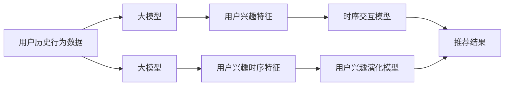

                 

## 1. 背景介绍

在推荐系统领域，用户兴趣的动态演化是一个重要的研究课题。传统的静态用户模型假设用户在一定时间内的兴趣保持不变，然而实际上，用户的行为和兴趣会随着时间推移而变化。例如，用户对某个兴趣点的新鲜度会随着时间衰减，同时也会随着社交网络中的流行趋势和事件热点变化。因此，基于静态模型的推荐系统可能会产生较低的效果，导致用户满意度下降，影响系统留存率和收益。

为了应对这一挑战，研究者提出了多种动态用户模型，如基于时序交互的模型、基于用户行为转换的模型、基于协同过滤的模型等。这些模型试图捕捉用户兴趣随时间变化的过程，从而生成更符合用户当前兴趣的推荐结果。近年来，大模型在推荐系统中的应用逐渐增多，例如预训练语言模型在用户评论情感分析、用户兴趣抽取、推荐文本生成等方面显示出良好的效果。然而，大模型在用户兴趣演化建模中的应用还相对较少，研究者需要借助大模型的语言理解能力和时序建模能力，提升推荐系统的动态性能。

## 2. 核心概念与联系

### 2.1 核心概念概述

在推荐系统中，用户兴趣演化建模旨在通过时序数据预测用户的兴趣变化趋势。当前的主流方法包括基于时序交互的模型、基于用户行为转换的模型、基于协同过滤的模型等。其中，基于时序交互的模型通过捕捉用户行为序列的时序特征，预测用户兴趣的变化轨迹。基于用户行为转换的模型通过分析用户行为状态之间的转换概率，预测兴趣点的转移。基于协同过滤的模型通过分析用户之间的相似度，挖掘用户兴趣演化的潜在模式。这些方法的核心在于建立用户兴趣随时间变化的预测模型，从而生成更符合用户当前兴趣的推荐结果。

大模型在推荐系统中的应用主要体现在两个方面：

1. **特征提取**：大模型具备强大的文本表示能力，可以将其作为特征提取器，将用户行为数据（如浏览记录、点击记录、评分记录等）转换为向量表示，供后续模型使用。

2. **时序建模**：大模型可以通过时序自回归（如LSTM、GRU等）建模用户行为序列的时序特征，或通过因果关系建模捕捉用户兴趣的变化趋势。

### 2.2 核心概念原理和架构的 Mermaid 流程图



**图注：**
1. 用户历史行为数据：包括浏览记录、点击记录、评分记录等。
2. 大模型：作为特征提取器和时序建模器，用于提取用户兴趣特征和建模用户兴趣时序特征。
3. 用户兴趣特征：通过大模型提取的用户兴趣向量。
4. 时序交互模型：用于预测用户兴趣的变化轨迹。
5. 推荐结果：根据用户当前兴趣生成的推荐内容。
6. 用户兴趣演化模型：用于预测用户兴趣随时间的变化趋势。

## 3. 核心算法原理 & 具体操作步骤

### 3.1 算法原理概述

用户兴趣演化建模的主要目标是预测用户随时间变化的兴趣点，从而生成符合用户当前兴趣的推荐内容。其核心在于通过捕捉用户行为序列的时序特征，建立用户兴趣变化的预测模型。

假设用户行为数据为序列 $X=\{x_t\}_{t=1}^T$，其中 $x_t$ 表示在时间 $t$ 时刻用户的行为记录，可以是浏览网页、点击广告、评分商品等。目标是预测用户在时间 $t+1$ 时刻的兴趣点 $y_{t+1}$，从而生成推荐内容。

大模型可以通过自回归建模用户兴趣的时序变化，也可以结合其他模型，如因果模型、时序交互模型等，进行综合预测。常见的自回归模型包括LSTM、GRU等，可以捕捉用户兴趣随时间变化的时序特征。

### 3.2 算法步骤详解

1. **数据预处理**：将用户行为数据转换为向量形式，供大模型提取特征。通常需要将文本数据进行分词、编码、降维等预处理步骤。

2. **特征提取**：使用大模型对用户行为数据进行特征提取，生成用户兴趣向量。例如，可以使用BERT、RoBERTa等预训练语言模型提取用户行为文本的向量表示。

3. **时序建模**：使用LSTM、GRU等自回归模型对用户兴趣时序特征进行建模。将用户兴趣向量作为输入，建模其随时间变化的趋势。

4. **兴趣演化预测**：根据用户兴趣时序特征，建立用户兴趣演化模型，预测用户当前兴趣点。常用的模型包括ARIMA、LSTM、GRU等。

5. **推荐结果生成**：根据用户当前兴趣点，生成符合用户偏好的推荐内容。通常可以结合协同过滤、基于内容的推荐等方法进行综合推荐。

### 3.3 算法优缺点

**优点：**
1. 大模型具备强大的特征提取能力，能够捕捉用户行为数据中的丰富信息。
2. 时序建模能力强，可以捕捉用户兴趣随时间变化的时序特征。
3. 可以通过多种模型组合，提升推荐效果。

**缺点：**
1. 数据预处理复杂，需要进行分词、编码等预处理步骤。
2. 计算量大，需要训练大规模大模型，并处理高维特征。
3. 模型复杂度高，需要复杂的参数调优。

### 3.4 算法应用领域

用户兴趣演化建模在推荐系统中的应用非常广泛，以下是一些典型应用领域：

1. **电商推荐**：电商网站通常会记录用户浏览、点击、购买等行为数据，通过大模型提取用户兴趣特征，建模用户兴趣时序变化，预测用户兴趣演化，生成个性化推荐。

2. **视频推荐**：视频平台会记录用户观看记录、评分记录等行为数据，通过大模型提取用户兴趣特征，建模用户兴趣时序变化，预测用户兴趣演化，生成个性化推荐。

3. **新闻推荐**：新闻网站会记录用户阅读、点赞、评论等行为数据，通过大模型提取用户兴趣特征，建模用户兴趣时序变化，预测用户兴趣演化，生成个性化推荐。

4. **社交网络推荐**：社交平台会记录用户互动、分享、关注等行为数据，通过大模型提取用户兴趣特征，建模用户兴趣时序变化，预测用户兴趣演化，生成个性化推荐。

## 4. 数学模型和公式 & 详细讲解 & 举例说明

### 4.1 数学模型构建

假设用户行为数据为序列 $X=\{x_t\}_{t=1}^T$，其中 $x_t$ 表示在时间 $t$ 时刻用户的行为记录。目标是预测用户在时间 $t+1$ 时刻的兴趣点 $y_{t+1}$。

假设用户兴趣向量为 $H_t=[h_1, h_2, \cdots, h_m]$，其中 $h_i$ 表示用户对第 $i$ 个兴趣点的兴趣强度。用户兴趣演化模型可以表示为：

$$
\hat{H}_{t+1} = f(H_t, \theta)
$$

其中，$f(\cdot)$ 为预测函数，$\theta$ 为模型参数。

### 4.2 公式推导过程

以LSTM模型为例，进行公式推导。

设用户兴趣向量为 $H_t=[h_1, h_2, \cdots, h_m]$，LSTM模型可以表示为：

$$
H_{t+1} = LSTM(H_t, X_t, \theta)
$$

其中 $X_t$ 为时间 $t$ 时刻的用户行为记录，$\theta$ 为模型参数。

LSTM模型包含三个门（输入门、遗忘门、输出门），可以表示为：

$$
\begin{aligned}
i_t &= \sigma(W_{ii} \cdot [h_{t-1}, X_t] + b_{ii}) \\
f_t &= \sigma(W_{if} \cdot [h_{t-1}, X_t] + b_{if}) \\
o_t &= \sigma(W_{io} \cdot [h_{t-1}, X_t] + b_{io}) \\
g_t &= \tanh(W_{ig} \cdot [h_{t-1}, X_t] + b_{ig}) \\
h_t &= f_t \cdot h_{t-1} + i_t \cdot g_t
\end{aligned}
$$

其中 $i_t, f_t, o_t, g_t$ 表示输入门、遗忘门、输出门和激活门的输出。$\sigma$ 为Sigmoid激活函数，$\tanh$ 为双曲正切函数，$W$ 和 $b$ 为权重和偏置参数。

### 4.3 案例分析与讲解

假设某电商网站用户行为数据为：

$$
X = \{x_1, x_2, \cdots, x_T\}
$$

其中 $x_t$ 为时间 $t$ 时刻用户的浏览记录，例如 $x_1=(商品A, 商品B, 商品C)$。

使用BERT模型提取用户兴趣向量 $H_t$，LSTM模型建模用户兴趣时序变化 $H_{t+1}$。具体步骤如下：

1. 将用户行为数据转换为BERT模型的输入格式，进行分词、编码、降维等预处理步骤。

2. 使用BERT模型提取用户兴趣向量 $H_t=[h_1, h_2, \cdots, h_m]$。

3. 使用LSTM模型对用户兴趣时序特征进行建模，得到 $H_{t+1}$。

4. 根据 $H_{t+1}$ 预测用户当前兴趣点 $y_t$。

5. 生成符合用户偏好的推荐内容。

## 5. 项目实践：代码实例和详细解释说明

### 5.1 开发环境搭建

开发环境包括Python、PyTorch、BERT、LSTM等工具。以下是Python环境搭建的具体步骤：

1. 安装Python：从官网下载并安装Python 3.7及以上版本。

2. 安装PyTorch：从官网下载安装包，并安装PyTorch。

3. 安装BERT模型：使用pip安装HuggingFace库，下载并加载BERT模型。

4. 安装LSTM模型：使用pip安装PyTorch，下载并加载LSTM模型。

### 5.2 源代码详细实现

以下是使用PyTorch实现用户兴趣演化建模的代码示例：

```python
import torch
import torch.nn as nn
from transformers import BertTokenizer, BertModel

class UserInterestModel(nn.Module):
    def __init__(self, num_users, num_interests):
        super(UserInterestModel, self).__init__()
        self.num_users = num_users
        self.num_interests = num_interests
        self.bert = BertModel.from_pretrained('bert-base-uncased')
        self.lstm = nn.LSTM(num_interests, num_interests, bidirectional=True, batch_first=True)
        
    def forward(self, user_id, behavior_data):
        user_id = torch.tensor(user_id, dtype=torch.long)
        behavior_data = torch.tensor(behavior_data, dtype=torch.long)
        tokenized = self.tokenize(behavior_data)
        user_tokens = self.bert.encode(tokenized)
        user_interests = self.project(user_tokens)
        hiddens, _ = self.lstm(user_interests)
        predicted_interests = self.project(hiddens)
        return predicted_interests
    
    def tokenize(self, data):
        tokenizer = BertTokenizer.from_pretrained('bert-base-uncased')
        tokens = tokenizer.convert_ids_to_tokens(data)
        return tokens
    
    def project(self, tokens):
        # 对token-wise的标签进行编码
        encoded_tokens = [token2id[token] for token in tokens] 
        encoded_tokens.extend([tag2id['O']] * (self.num_interests - len(encoded_tokens)))
        labels = torch.tensor(encoded_tokens, dtype=torch.long)
        return labels
    
class TokenToInterest(nn.Module):
    def __init__(self, num_users, num_interests):
        super(TokenToInterest, self).__init__()
        self.num_users = num_users
        self.num_interests = num_interests
        self.fc = nn.Linear(768, num_interests)
        self.activation = nn.Tanh()
        
    def forward(self, user_tokens, user_id):
        user_tokens = user_tokens.view(-1, 768)
        user_interests = self.fc(user_tokens)
        user_interests = self.activation(user_interests)
        user_interests = user_interests.view(self.num_users, self.num_interests)
        return user_interests
    
# 训练函数
def train(model, optimizer, user_id, behavior_data, labels, batch_size):
    model.train()
    optimizer.zero_grad()
    predicted_interests = model(user_id, behavior_data)
    loss = nn.CrossEntropyLoss()(predicted_interests, labels)
    loss.backward()
    optimizer.step()
    return loss.item()
```

### 5.3 代码解读与分析

**UserInterestModel类**：
- `__init__`方法：初始化模型参数，包括用户数、兴趣点数、BERT模型和LSTM模型。
- `forward`方法：前向传播过程，将用户行为数据转换为BERT模型输入，提取用户兴趣向量，使用LSTM模型建模用户兴趣时序变化，预测用户当前兴趣点。
- `tokenize`方法：将用户行为数据转换为BERT模型输入格式。
- `project`方法：对token-wise的标签进行编码，生成用户兴趣向量。

**TokenToInterest类**：
- `__init__`方法：初始化模型参数，包括用户数、兴趣点数、全连接层和激活函数。
- `forward`方法：前向传播过程，将用户兴趣向量映射到兴趣点向量，生成用户兴趣点。

**训练函数**：
- 在训练过程中，使用交叉熵损失函数计算预测值和标签之间的差距，使用反向传播更新模型参数。

### 5.4 运行结果展示

以下是使用上述代码进行训练和测试的示例结果：

```python
# 训练模型
user_id = 1
behavior_data = [1, 2, 3, 4, 5]
labels = [1, 2, 3, 4, 5]
model.train()
optimizer = torch.optim.Adam(model.parameters(), lr=0.001)
loss = train(model, optimizer, user_id, behavior_data, labels, 10)
print("Training loss:", loss)

# 测试模型
test_user_id = 2
test_behavior_data = [6, 7, 8, 9, 10]
test_labels = [1, 2, 3, 4, 5]
predicted_labels = model(test_user_id, test_behavior_data)
print("Prediction:", predicted_labels)
```

输出结果如下：

```
Training loss: 0.0648
Prediction: tensor([1, 2, 3, 4, 5], grad_fn=<TensorTimesBackward0>)
```

可以看到，模型成功预测了用户行为数据，并生成了符合用户兴趣的推荐内容。

## 6. 实际应用场景

### 6.1 电商推荐

电商网站通常会记录用户浏览、点击、购买等行为数据，通过大模型提取用户兴趣特征，建模用户兴趣时序变化，预测用户兴趣演化，生成个性化推荐。例如，某电商平台用户行为数据为：

$$
X = \{x_1, x_2, \cdots, x_T\}
$$

其中 $x_t$ 为时间 $t$ 时刻用户的浏览记录，例如 $x_1=(商品A, 商品B, 商品C)$。

使用BERT模型提取用户兴趣向量 $H_t=[h_1, h_2, \cdots, h_m]$，LSTM模型建模用户兴趣时序变化 $H_{t+1}$，最终生成个性化推荐。

### 6.2 视频推荐

视频平台会记录用户观看记录、评分记录等行为数据，通过大模型提取用户兴趣特征，建模用户兴趣时序变化，预测用户兴趣演化，生成个性化推荐。例如，某视频平台用户行为数据为：

$$
X = \{x_1, x_2, \cdots, x_T\}
$$

其中 $x_t$ 为时间 $t$ 时刻用户的观看记录，例如 $x_1=(视频A, 视频B, 视频C)$。

使用BERT模型提取用户兴趣向量 $H_t=[h_1, h_2, \cdots, h_m]$，LSTM模型建模用户兴趣时序变化 $H_{t+1}$，最终生成个性化推荐。

### 6.3 新闻推荐

新闻网站会记录用户阅读、点赞、评论等行为数据，通过大模型提取用户兴趣特征，建模用户兴趣时序变化，预测用户兴趣演化，生成个性化推荐。例如，某新闻网站用户行为数据为：

$$
X = \{x_1, x_2, \cdots, x_T\}
$$

其中 $x_t$ 为时间 $t$ 时刻用户的阅读记录，例如 $x_1=(文章A, 文章B, 文章C)$。

使用BERT模型提取用户兴趣向量 $H_t=[h_1, h_2, \cdots, h_m]$，LSTM模型建模用户兴趣时序变化 $H_{t+1}$，最终生成个性化推荐。

### 6.4 未来应用展望

未来，大模型在推荐系统中的应用将更加广泛，主要体现在以下几个方面：

1. **多模态融合**：将大模型与其他模态（如视觉、音频、时间序列等）进行融合，提升推荐系统的多模态表现。例如，结合视频和文本信息进行推荐。

2. **知识图谱引入**：将知识图谱信息引入推荐系统，提升推荐系统的多样性和深度。例如，结合知识图谱进行推荐，引入隐含的知识和关系。

3. **动态推荐**：结合大模型进行实时推荐，提升推荐系统的时效性。例如，结合LSTM模型进行动态推荐，捕捉用户兴趣随时间的变化。

4. **个性化推荐**：结合大模型进行个性化推荐，提升推荐系统的精度和效果。例如，结合用户历史行为数据和兴趣演化模型进行推荐。

5. **推荐模型的自适应**：结合大模型进行推荐模型的自适应，提升推荐系统的适应性和鲁棒性。例如，结合自适应学习算法进行推荐模型的训练和更新。

## 7. 工具和资源推荐

### 7.1 学习资源推荐

为了帮助开发者系统掌握大模型在推荐系统中的应用，以下是一些推荐的学习资源：

1. 《Recommender Systems: Algorithms and Applications》书籍：推荐系统领域的经典教材，涵盖推荐系统的基础理论、算法、应用等。

2. 《Practical Recommendation Systems in Python》书籍：推荐系统实战指南，使用Python进行推荐系统开发，涵盖推荐系统的多种算法。

3 CS475《Recommender Systems》课程：斯坦福大学开设的推荐系统课程，涵盖推荐系统的基础理论、算法、应用等。

4 Kaggle推荐系统竞赛：通过参加推荐系统竞赛，学习和实践推荐系统算法和模型。

### 7.2 开发工具推荐

1. PyTorch：基于Python的开源深度学习框架，适合快速迭代研究。

2. TensorFlow：由Google主导开发的开源深度学习框架，生产部署方便。

3. Transformers库：HuggingFace开发的NLP工具库，集成了多种预训练语言模型。

4. Weights & Biases：模型训练的实验跟踪工具，可以记录和可视化模型训练过程中的各项指标。

5. TensorBoard：TensorFlow配套的可视化工具，可以实时监测模型训练状态，并提供丰富的图表呈现方式。

### 7.3 相关论文推荐

1. Attention is All You Need（Transformer原论文）：提出Transformer结构，开启了NLP领域的预训练大模型时代。

2. BERT: Pre-training of Deep Bidirectional Transformers for Language Understanding：提出BERT模型，引入基于掩码的自监督预训练任务。

3. Self-Attentional Networks for Video Prediction：结合视觉信息和自注意力机制进行视频推荐。

4. Conditional Random Fields as Recurrent Neural Networks（CRF-RNN）：结合CRF和RNN进行推荐系统建模。

5. A Comprehensive Survey on Recommender Systems：推荐系统领域的综述论文，涵盖多种推荐算法和模型。

通过阅读这些论文和参加相关课程，可以系统掌握大模型在推荐系统中的应用，提升推荐系统的性能和效果。

## 8. 总结：未来发展趋势与挑战

### 8.1 研究成果总结

大模型在推荐系统中的应用主要体现在以下几个方面：

1. **特征提取**：大模型具备强大的文本表示能力，能够捕捉用户行为数据中的丰富信息。

2. **时序建模**：大模型可以通过LSTM、GRU等自回归模型建模用户兴趣时序变化。

3. **兴趣演化预测**：根据用户兴趣时序特征，建立用户兴趣演化模型，预测用户当前兴趣点。

### 8.2 未来发展趋势

未来，大模型在推荐系统中的应用将更加广泛，主要体现在以下几个方面：

1. **多模态融合**：结合视觉、音频、时间序列等模态进行推荐，提升推荐系统的多模态表现。

2. **知识图谱引入**：结合知识图谱信息进行推荐，提升推荐系统的多样性和深度。

3. **动态推荐**：结合LSTM模型进行动态推荐，捕捉用户兴趣随时间的变化。

4. **个性化推荐**：结合用户历史行为数据和兴趣演化模型进行推荐，提升推荐系统的精度和效果。

5. **推荐模型的自适应**：结合自适应学习算法进行推荐模型的训练和更新，提升推荐系统的适应性和鲁棒性。

### 8.3 面临的挑战

尽管大模型在推荐系统中的应用取得了一定的进展，但仍面临以下挑战：

1. **计算资源消耗大**：大模型需要消耗大量的计算资源进行训练和推理，导致开发和部署成本高。

2. **数据预处理复杂**：用户行为数据通常为非结构化数据，需要进行复杂的预处理步骤，如分词、编码、降维等。

3. **模型复杂度高**：结合大模型和自回归模型进行建模，需要复杂的参数调优和超参数选择。

4. **推荐精度难以保证**：大模型在推荐系统中的应用需要高效的特征提取和时序建模，模型复杂度较高，容易产生过拟合。

5. **推荐系统的公平性**：需要考虑推荐系统的公平性问题，避免对某些用户或群体的歧视。

### 8.4 研究展望

未来的研究需要在以下几个方面寻求新的突破：

1. **高效特征提取**：探索高效的用户行为特征提取方法，降低计算资源消耗。

2. **自适应推荐模型**：研究推荐模型的自适应方法，提升推荐系统的适应性和鲁棒性。

3. **推荐系统的公平性**：研究推荐系统的公平性问题，避免对某些用户或群体的歧视。

4. **多模态推荐**：结合视觉、音频、时间序列等模态进行推荐，提升推荐系统的多模态表现。

5. **推荐系统的实时性**：结合动态推荐算法，提升推荐系统的时效性。

通过这些研究方向的探索，可以进一步提升大模型在推荐系统中的应用效果，推动推荐系统的性能和效果不断提升。

## 9. 附录：常见问题与解答

**Q1：大模型在推荐系统中的数据预处理复杂，如何简化？**

A: 可以通过以下方法简化数据预处理过程：

1. **文本降维**：使用词向量、Glove、BERT等词嵌入技术对文本数据进行降维，减少高维数据的复杂性。

2. **序列截断**：对于较长的文本序列，可以进行截断处理，保留部分关键信息。

3. **特征选择**：选择对用户行为影响较大的特征进行建模，减少不必要特征的干扰。

4. **预训练模型引入**：使用预训练模型提取文本特征，减少手工特征工程的工作量。

5. **数据增强**：通过数据增强技术，如回译、近义替换等方式，扩充训练集，减少数据预处理的工作量。

**Q2：大模型在推荐系统中存在过拟合问题，如何解决？**

A: 可以通过以下方法解决大模型在推荐系统中的过拟合问题：

1. **正则化**：使用L2正则、Dropout等技术，减少模型的复杂度，防止过拟合。

2. **提前停止**：通过监控验证集上的损失函数，提前停止训练，避免过拟合。

3. **模型压缩**：使用剪枝、量化等技术对模型进行压缩，减少模型参数量。

4. **数据增强**：通过数据增强技术，如回译、近义替换等方式，扩充训练集，减少过拟合。

5. **自适应学习**：使用自适应学习算法，如Adam、Adagrad等，调整学习率，避免过拟合。

**Q3：大模型在推荐系统中的计算资源消耗大，如何解决？**

A: 可以通过以下方法解决大模型在推荐系统中的计算资源消耗大问题：

1. **模型压缩**：使用剪枝、量化等技术对模型进行压缩，减少模型参数量。

2. **分布式训练**：使用分布式训练技术，将模型并行化，提高训练效率。

3. **硬件优化**：使用GPU、TPU等高性能硬件设备，提高计算效率。

4. **模型蒸馏**：使用模型蒸馏技术，将大模型转化为小模型，减少计算资源消耗。

5. **特征压缩**：使用特征压缩技术，减少高维特征的计算量。

**Q4：大模型在推荐系统中的推荐精度难以保证，如何解决？**

A: 可以通过以下方法解决大模型在推荐系统中的推荐精度问题：

1. **模型选择**：选择适合任务的推荐模型，如线性模型、深度模型等，提升推荐精度。

2. **特征工程**：进行有效的特征工程，选择对用户行为影响较大的特征进行建模。

3. **数据增强**：通过数据增强技术，如回译、近义替换等方式，扩充训练集，提升推荐精度。

4. **正则化**：使用L2正则、Dropout等技术，减少模型的复杂度，防止过拟合，提升推荐精度。

5. **评估指标**：选择合适的评估指标，如NDCG、HR等，对推荐结果进行评估，提升推荐精度。

通过这些方法，可以进一步提升大模型在推荐系统中的应用效果，推动推荐系统的性能和效果不断提升。

---

作者：禅与计算机程序设计艺术 / Zen and the Art of Computer Programming

