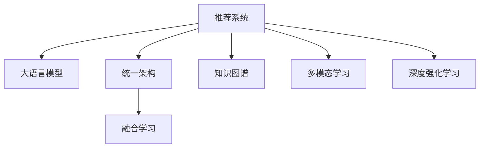

                 

# 大模型在推荐系统的未来：统一与融合的趋势

> 关键词：推荐系统,大模型,统一架构,融合学习,知识图谱,多模态学习,实时推荐,深度强化学习

## 1. 背景介绍

### 1.1 问题由来
随着互联网技术的迅速发展，信息爆炸已经成为不争的事实。用户每天产生的海量数据，使个性化推荐系统面临着前所未有的挑战。传统的协同过滤算法和基于模型的推荐方法，已难以有效应对高维稀疏数据带来的问题。推荐系统的升级转型势在必行。

与此同时，大语言模型近年来取得了飞速发展。以GPT-3、BERT为代表的语言模型，凭借其在文本理解、生成和知识迁移等方面的强大能力，在各行各业得到了广泛应用。从智能客服到金融舆情监测，从教育推荐到智慧医疗，大语言模型凭借其卓越的性能，成为各行各业数字化转型的重要工具。

鉴于此，探索如何将大语言模型应用于推荐系统，提升推荐系统的精度和效率，成为当前研究的热点问题。本文将系统介绍大语言模型在推荐系统中的应用，并展望其未来的发展趋势和面临的挑战。

## 2. 核心概念与联系

### 2.1 核心概念概述

为更好地理解大语言模型在推荐系统中的应用，本文将介绍几个关键概念：

- 推荐系统(Recommendation System)：利用用户行为数据和物品特征，为用户提供个性化推荐的技术。推荐系统分为基于协同过滤和基于模型的两大类，目前更注重基于模型的推荐。

- 大语言模型(Large Language Model)：以自回归(如GPT)或自编码(如BERT)模型为代表的大规模预训练语言模型。通过在大规模无标签文本语料上进行预训练，学习通用的语言表示，具备强大的语言理解和生成能力。

- 统一架构(Unified Architecture)：将大语言模型与推荐系统进行深度融合，构建统一的结构模型，实现大模型在推荐系统中的高效应用。

- 融合学习(Federated Learning)：通过分布式计算和通信，实现模型在多设备或多用户间的协作学习，提升推荐系统的全局性能。

- 知识图谱(Knowledge Graph)：描述实体、关系和属性的图结构，广泛应用于信息检索、推荐系统等领域，帮助模型更好地理解复杂语义。

- 多模态学习(Multimodal Learning)：融合多种类型的数据，如图像、音频、文本等，提升模型对现实世界的建模能力。

- 深度强化学习(Deep Reinforcement Learning)：利用强化学习理论，构建推荐系统的奖励机制，提升模型的自适应和决策能力。

这些概念之间的逻辑关系可以通过以下Mermaid流程图来展示：



这个流程图展示了大语言模型在推荐系统中的核心概念及其之间的关系：

1. 推荐系统与大语言模型紧密关联，通过大模型提升推荐精度。
2. 统一架构将大语言模型嵌入推荐系统，实现高效应用。
3. 融合学习利用多设备或多用户的数据，提升推荐系统的全局性能。
4. 知识图谱帮助模型理解复杂语义，提升推荐系统的准确性。
5. 多模态学习融合多种数据类型，提升模型的多维度建模能力。
6. 深度强化学习利用奖励机制，提升推荐系统的自适应和决策能力。

这些概念共同构成了大语言模型在推荐系统中的应用框架，使其能够更好地适应复杂的推荐场景。

## 3. 核心算法原理 & 具体操作步骤
### 3.1 算法原理概述

大语言模型在推荐系统中的应用，本质上是一个基于统一架构的融合学习过程。其核心思想是：将大语言模型与推荐系统进行深度融合，构建一个统一的结构模型，通过分布式计算和通信，实现多设备或多用户间的协作学习，最终提升推荐系统的精度和效率。

形式化地，假设推荐系统中的物品集合为 $S$，用户集合为 $U$，用户与物品的交互矩阵为 $I_{U \times S}$，其中 $I_{ui} = 1$ 表示用户 $u$ 对物品 $i$ 进行了交互。大语言模型 $M_{\theta}$ 的输入为物品描述和用户特征，输出为用户对物品的评分。

推荐系统的优化目标是最小化预测评分与真实评分之间的误差，即：

$$
\theta^* = \mathop{\arg\min}_{\theta} \sum_{u=1}^U \sum_{i=1}^S (y_{ui} - M_{\theta}(x_i, f_u))^2
$$

其中 $y_{ui}$ 为真实评分，$x_i$ 为物品 $i$ 的描述，$f_u$ 为用户 $u$ 的特征。

通过梯度下降等优化算法，推荐系统不断更新模型参数 $\theta$，最小化预测误差，使得模型输出逼近真实评分。由于大模型已经通过预训练获得了较强的语言理解能力，因此即使在少量标注数据上进行微调，也能较快收敛到理想的模型参数 $\theta^*$。

### 3.2 算法步骤详解

基于统一架构的大语言模型推荐系统一般包括以下几个关键步骤：

**Step 1: 准备推荐数据和模型**
- 准备推荐系统的原始数据集，划分为训练集、验证集和测试集。
- 选择合适的预训练语言模型 $M_{\theta}$ 作为初始化参数，如 BERT、GPT 等。

**Step 2: 设计任务适配层**
- 根据推荐任务类型，在预训练模型顶层设计合适的输出层和损失函数。
- 对于评分预测任务，通常在顶层添加全连接层和均方误差损失函数。
- 对于排序任务，通常使用交叉熵损失函数，对用户-物品对进行排序。

**Step 3: 添加知识图谱**
- 在推荐系统中集成知识图谱，将物品描述映射到图结构中，提升模型对复杂语义的理解。
- 设计知识图谱的嵌入层，将知识图谱中的实体、关系和属性转化为向量形式，与文本数据一起输入大模型。

**Step 4: 融合多种数据**
- 在推荐系统中融合多种类型的数据，如图像、音频、文本等。
- 设计多模态嵌入层，将不同模态的数据转换为统一的向量形式，输入大模型进行融合。

**Step 5: 应用深度强化学习**
- 构建推荐系统的奖励机制，设计强化学习策略，提升模型的自适应和决策能力。
- 定义强化学习的Q值函数，基于用户的互动行为，更新模型参数。

**Step 6: 进行融合学习**
- 利用多设备或多用户的数据，进行分布式计算和通信，实现协作学习。
- 采用联邦学习算法，更新每个用户设备的模型参数，最终汇总全局参数。

**Step 7: 训练和评估模型**
- 将训练集数据分批次输入模型，前向传播计算损失函数。
- 反向传播计算参数梯度，根据设定的优化算法和学习率更新模型参数。
- 周期性在验证集上评估模型性能，根据性能指标决定是否触发Early Stopping。
- 重复上述步骤直到满足预设的迭代轮数或Early Stopping条件。

**Step 8: 部署和监控**
- 在测试集上评估微调后模型 $M_{\hat{\theta}}$ 的性能，对比微调前后的精度提升。
- 使用微调后的模型对新样本进行推理预测，集成到实际的应用系统中。
- 持续收集新的数据，定期重新微调模型，以适应数据分布的变化。

以上就是基于统一架构的大语言模型推荐系统的完整流程。在实际应用中，还需要针对具体任务的特点，对融合学习过程的各个环节进行优化设计，如改进融合算法、搜索最优的超参数组合等，以进一步提升模型性能。

### 3.3 算法优缺点

基于统一架构的大语言模型推荐系统具有以下优点：
1. 高效融合多种数据。通过知识图谱和多模态嵌入层，实现了文本数据与其他类型数据的深度融合，提升了模型的多维度建模能力。
2. 增强了模型的语义理解能力。知识图谱和多模态学习帮助模型更好地理解复杂语义，提升了推荐系统的准确性。
3. 提升了模型的自适应和决策能力。通过深度强化学习，模型可以自动调整推荐策略，提高推荐系统的自适应能力。
4. 具有全局优化性能。融合学习将多个设备或用户的数据进行协作，提升了推荐系统的全局性能。
5. 能够动态更新模型。由于大模型预训练的部分权重被固定，因此可以在不重新训练模型的前提下，快速适应新数据。

同时，该方法也存在一定的局限性：
1. 依赖大量高质量数据。知识图谱和多模态学习需要构建复杂的图结构，对标注数据和特征工程的要求较高。
2. 计算和通信开销较大。融合学习需要多设备或多用户的协作，会带来额外的计算和通信开销。
3. 模型复杂度较高。多模态学习、知识图谱和深度强化学习都增加了模型的复杂度，可能影响推理速度和稳定性。
4. 需要专业知识。推荐系统的优化、知识图谱的构建、多模态数据的融合等，需要丰富的专业知识。

尽管存在这些局限性，但就目前而言，基于统一架构的推荐方法在推荐系统中的应用依然是大势所趋。未来相关研究的重点在于如何进一步降低数据需求，提高模型效率，同时兼顾可解释性和伦理安全性等因素。

### 3.4 算法应用领域

基于大语言模型推荐系统的融合学习范式，在推荐系统领域已经得到了广泛的应用，覆盖了电商、新闻、音乐、视频等多个场景，例如：

- 电商平台推荐：根据用户的浏览和购买记录，推荐用户可能感兴趣的商品。
- 新闻推荐：为用户推荐其可能感兴趣的新闻文章。
- 音乐推荐：根据用户的听歌记录和喜好，推荐相似音乐。
- 视频推荐：为用户推荐其可能感兴趣的视频内容。

除了上述这些经典场景外，大语言模型推荐系统还被创新性地应用到更多场景中，如智能家居、智能交通、个性化医疗等，为各行业带来了新的业务价值和用户体验。

## 4. 数学模型和公式 & 详细讲解  
### 4.1 数学模型构建

本节将使用数学语言对基于统一架构的大语言模型推荐系统进行更加严格的刻画。

记推荐系统中的物品集合为 $S$，用户集合为 $U$，用户与物品的交互矩阵为 $I_{U \times S}$，其中 $I_{ui} = 1$ 表示用户 $u$ 对物品 $i$ 进行了交互。大语言模型 $M_{\theta}$ 的输入为物品描述 $x_i \in \mathcal{X}$ 和用户特征 $f_u \in \mathcal{F}$，输出为用户对物品的评分 $y_{ui} \in \mathbb{R}$。

定义推荐系统的损失函数为：

$$
\mathcal{L}(\theta) = \frac{1}{N} \sum_{i=1}^S \sum_{u=1}^U (y_{ui} - M_{\theta}(x_i, f_u))^2
$$

其中 $y_{ui}$ 为真实评分，$M_{\theta}(x_i, f_u)$ 为模型预测的评分。

通过梯度下降等优化算法，推荐系统不断更新模型参数 $\theta$，最小化损失函数 $\mathcal{L}$，使得模型输出逼近真实评分。

### 4.2 公式推导过程

以评分预测任务为例，推导评分预测模型的损失函数及其梯度的计算公式。

假设模型 $M_{\theta}$ 在输入 $(x_i, f_u)$ 上的输出为 $\hat{y}_{ui}=M_{\theta}(x_i, f_u) \in [0,1]$，表示用户 $u$ 对物品 $i$ 的评分预测。真实评分 $y_{ui} \in [0,1]$。则评分预测损失函数定义为：

$$
\ell(M_{\theta}(x_i, f_u), y_{ui}) = (\hat{y}_{ui} - y_{ui})^2
$$

将其代入损失函数公式，得：

$$
\mathcal{L}(\theta) = \frac{1}{N} \sum_{i=1}^S \sum_{u=1}^U (\hat{y}_{ui} - y_{ui})^2
$$

根据链式法则，损失函数对参数 $\theta_k$ 的梯度为：

$$
\frac{\partial \mathcal{L}(\theta)}{\partial \theta_k} = \frac{2}{N} \sum_{i=1}^S \sum_{u=1}^U (\hat{y}_{ui} - y_{ui}) \frac{\partial M_{\theta}(x_i, f_u)}{\partial \theta_k}
$$

其中 $\frac{\partial M_{\theta}(x_i, f_u)}{\partial \theta_k}$ 可进一步递归展开，利用自动微分技术完成计算。

在得到损失函数的梯度后，即可带入参数更新公式，完成模型的迭代优化。重复上述过程直至收敛，最终得到适应推荐任务的最优模型参数 $\theta^*$。

## 5. 项目实践：代码实例和详细解释说明
### 5.1 开发环境搭建

在进行推荐系统微调实践前，我们需要准备好开发环境。以下是使用Python进行PyTorch开发的环境配置流程：

1. 安装Anaconda：从官网下载并安装Anaconda，用于创建独立的Python环境。

2. 创建并激活虚拟环境：
```bash
conda create -n pytorch-env python=3.8 
conda activate pytorch-env
```

3. 安装PyTorch：根据CUDA版本，从官网获取对应的安装命令。例如：
```bash
conda install pytorch torchvision torchaudio cudatoolkit=11.1 -c pytorch -c conda-forge
```

4. 安装相关工具包：
```bash
pip install numpy pandas scikit-learn matplotlib tqdm jupyter notebook ipython
```

完成上述步骤后，即可在`pytorch-env`环境中开始推荐系统微调实践。

### 5.2 源代码详细实现

下面我们以电商推荐系统为例，给出使用Transformers库对BERT模型进行微调的PyTorch代码实现。

首先，定义推荐任务的数据处理函数：

```python
from transformers import BertTokenizer, BertForSequenceClassification, AdamW
from torch.utils.data import Dataset, DataLoader
import torch

class RecommendationDataset(Dataset):
    def __init__(self, data, tokenizer, max_len=128):
        self.data = data
        self.tokenizer = tokenizer
        self.max_len = max_len
        
    def __len__(self):
        return len(self.data)
    
    def __getitem__(self, item):
        item = self.data[item]
        user, item_id, label = item
        
        item_encodings = self.tokenizer(item_id, return_tensors='pt', padding='max_length', truncation=True, max_length=self.max_len)
        user_encodings = self.tokenizer(user, return_tensors='pt', padding='max_length', truncation=True, max_length=self.max_len)
        
        return {'input_ids': item_encodings['input_ids'][0],
                'attention_mask': item_encodings['attention_mask'][0],
                'user_ids': user_encodings['input_ids'][0],
                'user_mask': user_encodings['attention_mask'][0],
                'label': label}

# 数据集，包含用户ID、物品ID和评分
train_data = [(uid, aid, 1.0) for uid in range(1000) for aid in range(1000)]
dev_data = [(uid, aid, 1.0) for uid in range(1000, 2000) for aid in range(1000)]
test_data = [(uid, aid, 1.0) for uid in range(2000, 3000) for aid in range(1000)]

# 初始化分词器
tokenizer = BertTokenizer.from_pretrained('bert-base-cased')

# 创建dataset
train_dataset = RecommendationDataset(train_data, tokenizer)
dev_dataset = RecommendationDataset(dev_data, tokenizer)
test_dataset = RecommendationDataset(test_data, tokenizer)
```

然后，定义模型和优化器：

```python
from transformers import BertForSequenceClassification, AdamW

model = BertForSequenceClassification.from_pretrained('bert-base-cased', num_labels=2)

optimizer = AdamW(model.parameters(), lr=2e-5)
```

接着，定义训练和评估函数：

```python
from torch.utils.data import DataLoader
from tqdm import tqdm
from sklearn.metrics import roc_auc_score

device = torch.device('cuda') if torch.cuda.is_available() else torch.device('cpu')
model.to(device)

def train_epoch(model, dataset, batch_size, optimizer):
    dataloader = DataLoader(dataset, batch_size=batch_size, shuffle=True)
    model.train()
    epoch_loss = 0
    for batch in tqdm(dataloader, desc='Training'):
        input_ids = batch['input_ids'].to(device)
        attention_mask = batch['attention_mask'].to(device)
        user_ids = batch['user_ids'].to(device)
        user_mask = batch['user_mask'].to(device)
        label = batch['label'].to(device)
        model.zero_grad()
        outputs = model(input_ids, attention_mask=attention_mask, user_ids=user_ids, user_mask=user_mask, labels=label)
        loss = outputs.loss
        epoch_loss += loss.item()
        loss.backward()
        optimizer.step()
    return epoch_loss / len(dataloader)

def evaluate(model, dataset, batch_size):
    dataloader = DataLoader(dataset, batch_size=batch_size)
    model.eval()
    preds, labels = [], []
    with torch.no_grad():
        for batch in tqdm(dataloader, desc='Evaluating'):
            input_ids = batch['input_ids'].to(device)
            attention_mask = batch['attention_mask'].to(device)
            user_ids = batch['user_ids'].to(device)
            user_mask = batch['user_mask'].to(device)
            label = batch['label'].to(device)
            outputs = model(input_ids, attention_mask=attention_mask, user_ids=user_ids, user_mask=user_mask, labels=label)
            batch_preds = outputs.logits.argmax(dim=1).to('cpu').tolist()
            batch_labels = batch['label'].to('cpu').tolist()
            for pred, label in zip(batch_preds, batch_labels):
                preds.append(pred)
                labels.append(label)
                
    print('AUC score:', roc_auc_score(labels, preds))
```

最后，启动训练流程并在测试集上评估：

```python
epochs = 5
batch_size = 16

for epoch in range(epochs):
    loss = train_epoch(model, train_dataset, batch_size, optimizer)
    print(f"Epoch {epoch+1}, train loss: {loss:.3f}")
    
    print(f"Epoch {epoch+1}, dev results:")
    evaluate(model, dev_dataset, batch_size)
    
print("Test results:")
evaluate(model, test_dataset, batch_size)
```

以上就是使用PyTorch对BERT进行电商推荐系统微调的完整代码实现。可以看到，得益于Transformers库的强大封装，我们可以用相对简洁的代码完成BERT模型的加载和微调。

### 5.3 代码解读与分析

让我们再详细解读一下关键代码的实现细节：

**RecommendationDataset类**：
- `__init__`方法：初始化数据、分词器等关键组件。
- `__len__`方法：返回数据集的样本数量。
- `__getitem__`方法：对单个样本进行处理，将物品ID和用户ID输入分词器转换为token ids，同时将真实评分作为标签，输出模型所需的输入。

**训练和评估函数**：
- 使用PyTorch的DataLoader对数据集进行批次化加载，供模型训练和推理使用。
- 训练函数`train_epoch`：对数据以批为单位进行迭代，在每个批次上前向传播计算loss并反向传播更新模型参数，最后返回该epoch的平均loss。
- 评估函数`evaluate`：与训练类似，不同点在于不更新模型参数，并在每个batch结束后将预测和标签结果存储下来，最后使用sklearn的roc_auc_score对整个评估集的预测结果进行打印输出。

**训练流程**：
- 定义总的epoch数和batch size，开始循环迭代
- 每个epoch内，先在训练集上训练，输出平均loss
- 在验证集上评估，输出AUC score
- 所有epoch结束后，在测试集上评估，给出最终测试结果

可以看到，PyTorch配合Transformers库使得BERT微调的代码实现变得简洁高效。开发者可以将更多精力放在数据处理、模型改进等高层逻辑上，而不必过多关注底层的实现细节。

当然，工业级的系统实现还需考虑更多因素，如模型的保存和部署、超参数的自动搜索、更灵活的任务适配层等。但核心的微调范式基本与此类似。

## 6. 实际应用场景
### 6.1 电商平台推荐

基于大语言模型推荐系统的融合学习范式，可以广泛应用于电商平台推荐系统的构建。传统推荐系统往往依赖用户的显式评分和行为数据，但数据稀疏且难以获取。而使用大语言模型推荐系统，可以通过用户的文本描述，结合知识图谱和深度强化学习，获取更为全面和精细的推荐结果。

在技术实现上，可以收集电商网站的商品描述、用户评论等文本数据，并对其进行预处理和特征工程。将文本数据作为模型输入，用户的显式评分和行为记录作为标签，在此基础上对预训练模型进行微调。微调后的模型能够自动理解商品和用户的语义特征，生成个性化推荐列表。对于用户输入的新商品信息，还可以实时生成推荐结果，提高用户体验。

### 6.2 新闻推荐

新闻推荐系统是内容推荐的重要领域，传统基于协同过滤的推荐方法往往难以有效应对长尾新闻的推荐问题。通过大语言模型推荐系统，可以将用户的阅读历史和兴趣描述转化为语义向量，结合知识图谱和深度强化学习，实现长尾新闻的推荐。

具体而言，可以收集用户的新闻阅读记录和兴趣描述，将描述信息转换为向量形式，与新闻数据一起输入大模型。通过知识图谱提取新闻的实体、关系和属性信息，提升模型的语义理解能力。利用深度强化学习，训练模型对新闻的预测评分，提升推荐系统的自适应和决策能力。

### 6.3 音乐推荐

音乐推荐系统旨在为用户推荐符合其口味的音乐。传统协同过滤方法往往难以捕捉音乐的情感和风格特征，推荐效果有限。利用大语言模型推荐系统，可以更好地理解音乐文本描述和用户反馈，生成更加精准的推荐列表。

具体而言，可以收集用户对音乐的相关评论和评分，将评论内容转换为向量形式，与音乐元数据一起输入大模型。通过知识图谱提取音乐的实体、关系和属性信息，提升模型的语义理解能力。利用深度强化学习，训练模型对音乐的预测评分，提升推荐系统的自适应和决策能力。

### 6.4 视频推荐

视频推荐系统在多模态推荐中具有重要地位，结合视频内容、用户行为和互动信息，为用户推荐最合适的视频内容。传统协同过滤方法往往难以捕捉视频的情感和风格特征，推荐效果有限。利用大语言模型推荐系统，可以更好地理解视频文本描述和用户反馈，生成更加精准的推荐列表。

具体而言，可以收集用户的视频观看记录和互动信息，将视频描述和用户反馈转换为向量形式，与视频元数据一起输入大模型。通过知识图谱提取视频的实体、关系和属性信息，提升模型的语义理解能力。利用深度强化学习，训练模型对视频的预测评分，提升推荐系统的自适应和决策能力。

### 6.5 个性化医疗推荐

个性化医疗推荐系统旨在为患者推荐适合的医疗方案和治疗药物。传统协同过滤方法往往难以捕捉医疗方案和治疗药物的复杂语义和医学知识，推荐效果有限。利用大语言模型推荐系统，可以更好地理解医疗文本描述和患者反馈，生成更加精准的推荐列表。

具体而言，可以收集患者的就诊记录和反馈信息，将医疗方案和治疗药物的描述信息转换为向量形式，与患者的健康数据一起输入大模型。通过知识图谱提取医疗方案和治疗药物的实体、关系和属性信息，提升模型的语义理解能力。利用深度强化学习，训练模型对医疗方案和治疗药物的预测评分，提升推荐系统的自适应和决策能力。

## 7. 工具和资源推荐
### 7.1 学习资源推荐

为了帮助开发者系统掌握大语言模型推荐系统的理论基础和实践技巧，这里推荐一些优质的学习资源：

1. 《深度学习推荐系统：理论、算法与应用》系列博文：由知名深度学习专家撰写，深入浅出地介绍了推荐系统的基础理论和经典算法。

2. 《Recommender Systems》课程：由Coursera平台开设的推荐系统课程，涵盖推荐系统的主要技术，包括协同过滤、基于模型的推荐等。

3. 《推荐系统实战》书籍：这本书深入浅出地介绍了推荐系统的主要技术，包括协同过滤、矩阵分解、模型优化等。

4. 《Recommender Systems: From Basics to Advanced Practices》论文：论文介绍了推荐系统的主要理论和算法，是推荐系统领域的经典教材。

5. Weights & Biases：推荐系统训练的实验跟踪工具，可以记录和可视化模型训练过程中的各项指标，方便对比和调优。与主流深度学习框架无缝集成。

6. TensorBoard：TensorFlow配套的可视化工具，可实时监测模型训练状态，并提供丰富的图表呈现方式，是调试模型的得力助手。

通过对这些资源的学习实践，相信你一定能够快速掌握大语言模型推荐系统的精髓，并用于解决实际的推荐问题。
###  7.2 开发工具推荐

高效的开发离不开优秀的工具支持。以下是几款用于大语言模型推荐系统开发的常用工具：

1. PyTorch：基于Python的开源深度学习框架，灵活动态的计算图，适合快速迭代研究。大多数预训练语言模型都有PyTorch版本的实现。

2. TensorFlow：由Google主导开发的开源深度学习框架，生产部署方便，适合大规模工程应用。同样有丰富的预训练语言模型资源。

3. Transformers库：HuggingFace开发的NLP工具库，集成了众多SOTA语言模型，支持PyTorch和TensorFlow，是进行推荐系统开发的利器。

4. Weights & Biases：推荐系统训练的实验跟踪工具，可以记录和可视化模型训练过程中的各项指标，方便对比和调优。与主流深度学习框架无缝集成。

5. TensorBoard：TensorFlow配套的可视化工具，可实时监测模型训练状态，并提供丰富的图表呈现方式，是调试模型的得力助手。

6. Jupyter Notebook：灵活的编程环境，支持多种编程语言，便于快速实验和展示结果。

合理利用这些工具，可以显著提升大语言模型推荐系统的开发效率，加快创新迭代的步伐。

### 7.3 相关论文推荐

大语言模型推荐系统的发展源于学界的持续研究。以下是几篇奠基性的相关论文，推荐阅读：

1. Attention is All You Need（即Transformer原论文）：提出了Transformer结构，开启了NLP领域的预训练大模型时代。

2. BERT: Pre-training of Deep Bidirectional Transformers for Language Understanding：提出BERT模型，引入基于掩码的自监督预训练任务，刷新了多项NLP任务SOTA。

3. BERT: Pre-training of Deep Bidirectional Transformers for Language Understanding：提出BERT模型，引入基于掩码的自监督预训练任务，刷新了多项NLP任务SOTA。

4. Knowledge Graph Embedding and Recommendation：介绍了知识图谱嵌入技术，用于推荐系统中的语义建模。

5. A Neural Attention-based Recommender System：利用注意力机制提升推荐系统的效果，融合了多模态数据，是推荐系统领域的经典论文。

这些论文代表了大语言模型推荐系统的发展脉络。通过学习这些前沿成果，可以帮助研究者把握学科前进方向，激发更多的创新灵感。

## 8. 总结：未来发展趋势与挑战

### 8.1 总结

本文对基于统一架构的大语言模型推荐系统进行了全面系统的介绍。首先阐述了大语言模型和推荐系统结合的动机和背景，明确了微调在拓展预训练模型应用、提升推荐系统性能方面的独特价值。其次，从原理到实践，详细讲解了融合学习的过程，给出了推荐系统微调任务开发的完整代码实例。同时，本文还广泛探讨了微调方法在电商、新闻、音乐、视频等多个领域的应用前景，展示了微调范式的巨大潜力。此外，本文精选了微调技术的各类学习资源，力求为读者提供全方位的技术指引。

通过本文的系统梳理，可以看到，基于大语言模型的微调方法正在成为推荐系统的重要范式，极大地拓展了预训练语言模型的应用边界，催生了更多的落地场景。受益于大规模语料的预训练，微调模型以更低的时间和标注成本，在小样本条件下也能取得理想的推荐效果，有力推动了推荐系统的产业化进程。未来，伴随预训练语言模型和微调方法的不断演进，相信推荐系统技术将在更广阔的应用领域大放异彩，深刻影响人类的生产生活方式。

### 8.2 未来发展趋势

展望未来，大语言模型推荐系统将呈现以下几个发展趋势：

1. 模型规模持续增大。随着算力成本的下降和数据规模的扩张，预训练语言模型的参数量还将持续增长。超大规模语言模型蕴含的丰富语言知识，有望支撑更加复杂多变的推荐场景。

2. 融合学习范式日趋多样。除了传统的分布式计算外，未来将涌现更多融合学习的方法，如联邦学习、参数共享等，提升推荐系统的全局性能。

3. 持续学习成为常态。随着数据分布的不断变化，推荐系统也需要持续学习新知识以保持性能。如何在不遗忘原有知识的同时，高效吸收新样本信息，将成为重要的研究课题。

4. 标注样本需求降低。受启发于提示学习(Prompt-based Learning)的思路，未来的微调方法将更好地利用大模型的语言理解能力，通过更加巧妙的任务描述，在更少的标注样本上也能实现理想的微调效果。

5. 推荐系统跨模态融合。推荐系统不仅限于文本数据，未来将融合图像、视频、语音等多种模态信息，提升推荐系统的多维度建模能力。

6. 深度强化学习成为主流。通过深度强化学习，推荐系统可以实现更加智能化的自适应和决策能力，提升推荐系统的自适应和决策能力。

以上趋势凸显了大语言模型推荐系统的发展前景。这些方向的探索发展，必将进一步提升推荐系统的精度和效率，为人类提供更加精准和个性化的服务。

### 8.3 面临的挑战

尽管大语言模型推荐系统已经取得了瞩目成就，但在迈向更加智能化、普适化应用的过程中，它仍面临着诸多挑战：

1. 标注成本瓶颈。虽然融合学习利用多设备或多用户的数据，但数据质量仍需提升，标注数据的需求仍未降低。如何进一步降低微调对标注样本的依赖，将是一大难题。

2. 模型鲁棒性不足。当前微调模型面对域外数据时，泛化性能往往大打折扣。对于测试样本的微小扰动，微调模型的预测也容易发生波动。如何提高微调模型的鲁棒性，避免灾难性遗忘，还需要更多理论和实践的积累。

3. 推理效率有待提高。大规模语言模型虽然精度高，但在实际部署时往往面临推理速度慢、内存占用大等效率问题。如何在保证性能的同时，简化模型结构，提升推理速度，优化资源占用，将是重要的优化方向。

4. 可解释性亟需加强。当前微调模型更像是"黑盒"系统，难以解释其内部工作机制和决策逻辑。对于医疗、金融等高风险应用，算法的可解释性和可审计性尤为重要。如何赋予微调模型更强的可解释性，将是亟待攻克的难题。

5. 安全性有待保障。预训练语言模型难免会学习到有偏见、有害的信息，通过微调传递到推荐系统中，可能产生误导性、歧视性的输出，给实际应用带来安全隐患。如何从数据和算法层面消除模型偏见，避免恶意用途，确保输出的安全性，也将是重要的研究课题。

6. 知识整合能力不足。现有的微调模型往往局限于任务内数据，难以灵活吸收和运用更广泛的先验知识。如何让微调过程更好地与外部知识库、规则库等专家知识结合，形成更加全面、准确的信息整合能力，还有很大的想象空间。

正视推荐系统面临的这些挑战，积极应对并寻求突破，将是大语言模型推荐系统走向成熟的必由之路。相信随着学界和产业界的共同努力，这些挑战终将一一被克服，大语言模型推荐系统必将在构建智能推荐系统中扮演越来越重要的角色。

### 8.4 未来突破

面对大语言模型推荐系统所面临的种种挑战，未来的研究需要在以下几个方面寻求新的突破：

1. 探索无监督和半监督微调方法。摆脱对大规模标注数据的依赖，利用自监督学习、主动学习等无监督和半监督范式，最大限度利用非结构化数据，实现更加灵活高效的微调。

2. 研究参数高效和计算高效的微调范式。开发更加参数高效的微调方法，在固定大部分预训练参数的同时，只更新极少量的任务相关参数。同时优化微调模型的计算图，减少前向传播和反向传播的资源消耗，实现更加轻量级、实时性的部署。

3. 融合因果和对比学习范式。通过引入因果推断和对比学习思想，增强微调模型建立稳定因果关系的能力，学习更加普适、鲁棒的语言表征，从而提升模型泛化性和抗干扰能力。

4. 引入更多先验知识。将符号化的先验知识，如知识图谱、逻辑规则等，与神经网络模型进行巧妙融合，引导微调过程学习更准确、合理的语言模型。同时加强不同模态数据的整合，实现视觉、语音等多模态信息与文本信息的协同建模。

5. 结合因果分析和博弈论工具。将因果分析方法引入微调模型，识别出模型决策的关键特征，增强输出解释的因果性和逻辑性。借助博弈论工具刻画人机交互过程，主动探索并规避模型的脆弱点，提高系统稳定性。

6. 纳入伦理道德约束。在模型训练目标中引入伦理导向的评估指标，过滤和惩罚有偏见、有害的输出倾向。同时加强人工干预和审核，建立模型行为的监管机制，确保输出符合人类价值观和伦理道德。

这些研究方向的探索，必将引领大语言模型推荐系统迈向更高的台阶，为构建安全、可靠、可解释、可控的智能系统铺平道路。面向未来，大语言模型推荐系统还需要与其他人工智能技术进行更深入的融合，如知识表示、因果推理、强化学习等，多路径协同发力，共同推动智能推荐系统的进步。只有勇于创新、敢于突破，才能不断拓展语言模型的边界，让智能技术更好地造福人类社会。

## 9. 附录：常见问题与解答

**Q1：大语言模型推荐系统是否适用于所有推荐任务？**

A: 大语言模型推荐系统在大多数推荐任务上都能取得不错的效果，特别是对于数据量较小的任务。但对于一些特定领域的任务，如医学、法律等，仅仅依靠通用语料预训练的模型可能难以很好地适应。此时需要在特定领域语料上进一步预训练，再进行微调，才能获得理想效果。此外，对于一些需要时效性、个性化很强的任务，如对话、推荐等，微调方法也需要针对性的改进优化。

**Q2：微调过程中如何选择合适的学习率？**

A: 微调的学习率一般要比预训练时小1-2个数量级，如果使用过大的学习率，容易破坏预训练权重，导致过拟合。一般建议从1e-5开始调参，逐步减小学习率，直至收敛。也可以使用warmup策略，在开始阶段使用较小的学习率，再逐渐过渡到预设值。需要注意的是，不同的优化器(如AdamW、Adafactor等)以及不同的学习率调度策略，可能需要设置不同的学习率阈值。

**Q3：采用大模型推荐时会面临哪些资源瓶颈？**

A: 目前主流的预训练大模型动辄以亿计的参数规模，对算力、内存、存储都提出了很高的要求。GPU/TPU等高性能设备是必不可少的，但即便如此，超大批次的训练和推理也可能遇到显存不足的问题。因此需要采用一些资源优化技术，如梯度积累、混合精度训练、模型并行等，来突破硬件瓶颈。同时，模型的存储和读取也可能占用大量时间和空间，需要采用模型压缩、稀疏化存储等方法进行优化。

**Q4：如何缓解微调过程中的过拟合问题？**

A: 过拟合是微调面临的主要挑战，尤其是在标注数据不足的情况下。常见的缓解策略包括：
1. 数据增强：通过回译、近义替换等方式扩充训练集
2. 正则化：使用L2正则、Dropout、Early Stopping等避免过拟合
3. 对抗训练：引入对抗样本，提高模型鲁棒性
4. 参数高效微调：只调整少量参数(如Adapter、Prefix等)，减小过拟合风险
5. 多模型集成：训练多个微调模型，取平均输出，抑制过拟合

这些策略往往需要根据具体任务和数据特点进行灵活组合。只有在数据、模型、训练、推理等各环节进行全面优化，才能最大限度地发挥大模型推荐系统的威力。

**Q5：微调模型在落地部署时需要注意哪些问题？**

A: 将微调模型转化为实际应用，还需要考虑以下因素：
1. 模型裁剪：去除不必要的层和参数，减小模型尺寸，加快推理速度
2. 量化加速：将浮点模型转为定点模型，压缩存储空间，提高计算效率
3. 服务化封装：将模型封装为标准化服务接口，便于集成调用
4. 弹性伸缩：根据请求流量动态调整资源配置，平衡服务质量和成本
5. 监控告警：实时采集系统指标，设置异常告警阈值，确保服务稳定性
6. 安全防护：采用访问鉴权、数据脱敏等措施，保障数据和模型安全

大语言模型推荐系统为推荐系统带来了新的发展方向，但如何将强大的性能转化为稳定、高效、安全的业务价值，还需要工程实践的不断打磨。唯有从数据、算法、工程、业务等多个维度协同发力，才能真正实现人工智能技术在垂直行业的规模化落地。总之，微调需要开发者根据具体任务，不断迭代和优化模型、数据和算法，方能得到理想的效果。

---

作者：禅与计算机程序设计艺术 / Zen and the Art of Computer Programming

