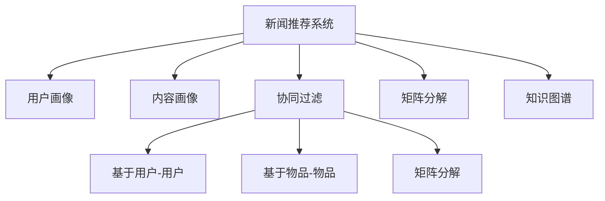

                 

# 大模型在新闻推荐中的应用

> 关键词：新闻推荐系统,大语言模型,用户画像,内容画像,协同过滤,矩阵分解,知识图谱

## 1. 背景介绍

### 1.1 问题由来

随着互联网技术的发展，信息爆炸的态势愈发明显。新闻门户网站、社交媒体平台、短视频应用等新媒体产品，每天都在产生海量的信息内容。然而，即便是信息过载的时代，人们也面临着找不到感兴趣的信息的困境。此时，新闻推荐系统成为解决这一问题的重要手段。新闻推荐系统通过算法模型对用户兴趣和文章内容进行分析匹配，推荐适合用户阅读的新闻内容，极大提升了用户的阅读体验。

### 1.2 问题核心关键点

新闻推荐系统的核心目标是提升用户对内容的个性化体验。其主要挑战包括：

- 如何高效地获取用户兴趣和行为数据，建立精准的用户画像。
- 如何准确地理解新闻内容的语义信息，建立全面的内容画像。
- 如何在用户画像和内容画像之间建立关联关系，实现精准推荐。
- 如何在用户行为数据不足的情况下，进行模型训练和优化。
- 如何实时更新推荐结果，反映用户动态兴趣变化。

近年来，预训练大语言模型在自然语言处理领域取得了突破性的进展。将大语言模型应用于新闻推荐，可以通过更丰富的文本语义信息，精准捕捉用户兴趣和内容特征，提升推荐效果。

## 2. 核心概念与联系

### 2.1 核心概念概述

为更好地理解大语言模型在新闻推荐中的应用，本节将介绍几个密切相关的核心概念：

- 新闻推荐系统：基于用户和内容特征的协同过滤、矩阵分解、知识图谱等技术构建推荐引擎，提供个性化内容推荐的系统。

- 用户画像：通过用户行为数据、社交网络信息、兴趣爱好等信息，构建用户兴趣和行为特征的全面描述，用于推荐模型训练。

- 内容画像：通过文本分类、主题建模、语义相似度计算等技术，提取新闻内容的语义特征和主题信息，用于推荐模型匹配。

- 协同过滤：通过分析用户行为数据和相似用户的历史行为，实现个性化推荐。主要包括基于用户-用户、物品-物品的协同过滤，以及基于矩阵分解的协同过滤。

- 矩阵分解：将用户-物品评分矩阵分解为用户特征矩阵和物品特征矩阵，实现个性化推荐。

- 知识图谱：通过语义图谱表示新闻内容的关系网络，挖掘新闻内容之间的知识图谱信息，用于推荐模型扩展。

这些核心概念之间的逻辑关系可以通过以下Mermaid流程图来展示：



这个流程图展示了大语言模型在新闻推荐系统中的核心概念及其之间的关系：

1. 新闻推荐系统通过用户画像和内容画像，实现协同过滤、矩阵分解、知识图谱等推荐方法。
2. 用户画像通过多维数据获取用户兴趣和行为特征。
3. 内容画像通过文本语义理解获取新闻内容的语义特征。
4. 协同过滤通过相似用户和相似内容，推荐个性化新闻。
5. 矩阵分解通过特征矩阵分解，提升推荐效果。
6. 知识图谱通过构建内容关系网络，扩展推荐模型。

这些概念共同构成了新闻推荐系统的核心框架，使得大语言模型在新闻推荐中能够发挥强大的信息获取和特征表示能力。

## 3. 核心算法原理 & 具体操作步骤
### 3.1 算法原理概述

将大语言模型应用于新闻推荐，本质上是一个信息匹配和推荐的过程。其核心思想是：将预训练的大语言模型视作一个强大的特征提取器，通过在新闻语料库上进行预训练，学习到丰富的语言表示，并将其应用于用户画像和内容画像的构建中。在此基础上，利用协同过滤、矩阵分解、知识图谱等推荐算法，对用户和新闻内容进行匹配和排序，实现个性化推荐。

具体来说，算法流程如下：

1. 对新闻语料库进行预训练，学习通用语言表示。
2. 根据用户行为数据和社交网络信息，构建用户画像。
3. 根据新闻文本内容，使用大语言模型提取新闻内容特征，构建内容画像。
4. 将用户画像和内容画像进行匹配，选择合适的推荐算法进行推荐排序。
5. 实时更新推荐结果，反映用户兴趣变化。

### 3.2 算法步骤详解

基于大语言模型的新闻推荐系统一般包括以下几个关键步骤：

**Step 1: 准备预训练语言模型和数据集**
- 选择合适的预训练语言模型 $M_{\theta}$，如BERT、GPT等。
- 准备新闻推荐系统的训练集 $D$，包含用户行为数据、新闻内容文本、用户社交网络信息等。

**Step 2: 构建用户画像**
- 使用自然语言处理技术，从用户行为数据中提取用户兴趣标签。
- 利用大语言模型，对社交网络信息进行情感分析、主题建模等，获取用户偏好和行为特征。
- 对用户画像进行向量化表示，通常使用词袋模型、TF-IDF等方法。

**Step 3: 构建内容画像**
- 使用自然语言处理技术，对新闻内容文本进行分词、命名实体识别、情感分析等处理。
- 利用大语言模型，提取新闻内容的语义特征，通常使用TextRank、BERT等方法。
- 对内容画像进行向量化表示，通常使用词袋模型、TF-IDF等方法。

**Step 4: 匹配用户画像和内容画像**
- 使用协同过滤算法，如基于用户-用户、物品-物品的协同过滤，或者矩阵分解算法，对用户画像和内容画像进行匹配。
- 选择最优的匹配结果，进行推荐排序，使用大语言模型计算新闻与用户兴趣的匹配度。

**Step 5: 实时更新推荐结果**
- 使用在线学习算法，实时更新推荐模型，反映用户兴趣变化。
- 对新加入的新闻内容进行预处理，更新内容画像，并重新匹配推荐结果。

### 3.3 算法优缺点

基于大语言模型的新闻推荐方法具有以下优点：
1. 丰富语义信息：大语言模型能够抽取文本内容的深层语义信息，捕捉用户兴趣的细微变化，提升推荐效果。
2. 多模态融合：结合用户行为数据、社交网络信息、内容语义信息，提供多模态融合的推荐模型。
3. 数据可解释性：大语言模型的解释性优于深度学习模型，用户兴趣和内容特征容易理解。
4. 扩展性强：大语言模型可以通过引入外部知识图谱、逻辑规则等，进行扩展优化。

同时，该方法也存在一定的局限性：
1. 计算资源需求高：大语言模型需要大量的计算资源进行训练和推理，可能面临硬件瓶颈。
2. 训练时间长：大语言模型通常需要长时间预训练，才能具备良好的语义理解能力。
3. 对标注数据依赖：用户画像和内容画像的构建依赖大量的标注数据，对标注质量要求高。
4. 过拟合风险：预训练模型的权重可能与推荐数据分布不匹配，引入过拟合风险。
5. 业务依赖强：不同新闻业务的推荐逻辑可能存在差异，需要针对特定业务场景进行优化。

尽管存在这些局限性，但就目前而言，基于大语言模型的推荐方法仍是大规模推荐系统的重要范式。未来相关研究的重点在于如何降低计算资源需求，提升训练效率，同时兼顾可解释性和业务适应性等因素。

### 3.4 算法应用领域

基于大语言模型的推荐方法在新闻推荐领域已经得到了广泛的应用，主要体现在以下方面：

1. **个性化推荐**：使用大语言模型提取用户画像和内容画像，实现个性化新闻推荐。

2. **内容相关性分析**：利用大语言模型计算新闻内容的语义相似度，匹配用户兴趣，推荐相关新闻。

3. **用户行为分析**：通过对用户行为数据进行情感分析、主题建模等处理，获取用户兴趣标签。

4. **实时推荐**：实时更新推荐模型，反映用户兴趣变化，实现动态推荐。

5. **多模态融合**：结合用户行为数据、社交网络信息、内容语义信息，提供多模态融合的推荐模型。

这些应用展示了基于大语言模型的推荐方法在新闻推荐领域的广泛适用性，推动了新闻推荐技术的不断进步。

## 4. 数学模型和公式 & 详细讲解 & 举例说明
### 4.1 数学模型构建

本节将使用数学语言对基于大语言模型的新闻推荐过程进行更加严格的刻画。

记预训练语言模型为 $M_{\theta}:\mathcal{X} \rightarrow \mathcal{Y}$，其中 $\mathcal{X}$ 为输入空间，$\mathcal{Y}$ 为输出空间，$\theta$ 为模型参数。假设新闻推荐系统的训练集为 $D=\{(x_i,y_i)\}_{i=1}^N$，其中 $x_i$ 为用户行为数据、新闻内容文本、用户社交网络信息等，$y_i$ 为新闻ID。

定义用户画像 $\mathbf{u} \in \mathbb{R}^d$，内容画像 $\mathbf{v} \in \mathbb{R}^d$，推荐结果 $y \in \{1,2,\ldots,K\}$。用户画像和内容画像可以表示为：

$$
\mathbf{u} = \sum_{i=1}^d u_i x_i
$$

$$
\mathbf{v} = \sum_{i=1}^d v_i x_i
$$

其中 $x_i$ 为用户行为数据、新闻内容文本、用户社交网络信息等，$u_i, v_i$ 为特征权重。

用户画像和内容画像之间的匹配度可以通过余弦相似度计算：

$$
\text{similarity}(\mathbf{u}, \mathbf{v}) = \frac{\mathbf{u} \cdot \mathbf{v}}{\|\mathbf{u}\|_2 \|\mathbf{v}\|_2}
$$

根据相似度匹配结果，选择最优的新闻ID进行推荐。推荐排序可以通过大语言模型计算新闻与用户兴趣的匹配度，使用以下公式：

$$
\text{score}(y_i) = M_{\theta}(x_i) \cdot \mathbf{u} \cdot \mathbf{v}
$$

其中 $x_i$ 为用户行为数据、新闻内容文本、用户社交网络信息等，$M_{\theta}(x_i)$ 为预训练语言模型对新闻文本的输出，$\mathbf{u}, \mathbf{v}$ 为用户画像和内容画像。

### 4.2 公式推导过程

以下我们以个性化推荐为例，推导推荐算法的详细公式。

假设用户 $u$ 和新闻 $i$ 的语义表示分别为 $\mathbf{u} = [u_1,u_2,\ldots,u_d]^T$ 和 $\mathbf{v} = [v_1,v_2,\ldots,v_d]^T$，预训练语言模型对新闻文本的输出为 $\mathbf{v}_{i} = [v_{i1},v_{i2},\ldots,v_{id}]^T$，其中 $v_{ik}$ 为第 $k$ 个特征向量的值。

用户 $u$ 与新闻 $i$ 的匹配度可以通过余弦相似度计算：

$$
\text{similarity}(\mathbf{u}, \mathbf{v}_{i}) = \frac{\mathbf{u} \cdot \mathbf{v}_{i}}{\|\mathbf{u}\|_2 \|\mathbf{v}_{i}\|_2}
$$

将新闻与用户兴趣的匹配度作为推荐排序依据，得：

$$
\text{score}(i) = \text{similarity}(\mathbf{u}, \mathbf{v}_{i}) = \mathbf{u} \cdot \mathbf{v}_{i}
$$

通过最大化匹配度，选择推荐排序结果，得：

$$
\hat{i} = \mathop{\arg\max}_{i} \mathbf{u} \cdot \mathbf{v}_{i}
$$

将匹配度转化为概率，得：

$$
p(i) = \sigma(\mathbf{u} \cdot \mathbf{v}_{i})
$$

其中 $\sigma$ 为 sigmoid 函数，用于将匹配度转换为概率值。

### 4.3 案例分析与讲解

假设一个用户 $u$ 最近阅读了以下新闻：

- 新闻1：大模型在新闻推荐中的应用
- 新闻2：未来应用展望
- 新闻3：面临的挑战
- 新闻4：研究展望

通过自然语言处理技术，将新闻内容进行分词、命名实体识别、情感分析等处理，得到新闻内容表示向量 $\mathbf{v}_1 = [1,0,0,0]^T$，$\mathbf{v}_2 = [0,1,0,0]^T$，$\mathbf{v}_3 = [0,0,1,0]^T$，$\mathbf{v}_4 = [0,0,0,1]^T$。

通过社交网络信息，获取用户兴趣标签，得到用户画像向量 $\mathbf{u} = [0.5,0.2,0.3,0.0]^T$。

使用余弦相似度计算匹配度：

$$
\text{similarity}(\mathbf{u}, \mathbf{v}_1) = \mathbf{u} \cdot \mathbf{v}_1 = 0.5 \times 1 + 0.2 \times 0 + 0.3 \times 0 + 0.0 \times 0 = 0.5
$$

$$
\text{similarity}(\mathbf{u}, \mathbf{v}_2) = \mathbf{u} \cdot \mathbf{v}_2 = 0.5 \times 0 + 0.2 \times 1 + 0.3 \times 0 + 0.0 \times 0 = 0.2
$$

$$
\text{similarity}(\mathbf{u}, \mathbf{v}_3) = \mathbf{u} \cdot \mathbf{v}_3 = 0.5 \times 0 + 0.2 \times 0 + 0.3 \times 1 + 0.0 \times 0 = 0.3
$$

$$
\text{similarity}(\mathbf{u}, \mathbf{v}_4) = \mathbf{u} \cdot \mathbf{v}_4 = 0.5 \times 0 + 0.2 \times 0 + 0.3 \times 0 + 0.0 \times 1 = 0.0
$$

根据匹配度排序，得推荐结果 $\hat{i} = 1$，推荐新闻内容为新闻1。

## 5. 项目实践：代码实例和详细解释说明
### 5.1 开发环境搭建

在进行新闻推荐系统开发前，我们需要准备好开发环境。以下是使用Python进行TensorFlow开发的环境配置流程：

1. 安装Anaconda：从官网下载并安装Anaconda，用于创建独立的Python环境。

2. 创建并激活虚拟环境：
```bash
conda create -n tf-env python=3.8 
conda activate tf-env
```

3. 安装TensorFlow：根据CUDA版本，从官网获取对应的安装命令。例如：
```bash
conda install tensorflow -c tf -c conda-forge
```

4. 安装各类工具包：
```bash
pip install numpy pandas scikit-learn matplotlib tqdm jupyter notebook ipython
```

完成上述步骤后，即可在`tf-env`环境中开始新闻推荐系统的开发。

### 5.2 源代码详细实现

下面我们以协同过滤推荐为例，给出使用TensorFlow实现的新闻推荐系统的PyTorch代码实现。

首先，定义协同过滤推荐算法：

```python
import tensorflow as tf

def collaborative_filtering(train_data, test_data):
    user = tf.Variable(tf.random.uniform([N, D]))
    item = tf.Variable(tf.random.uniform([M, D]))
    rating = tf.matmul(user, item, transpose_b=True)
    loss_fn = tf.losses.mean_squared_error(train_data, rating)
    optimizer = tf.train.AdamOptimizer(learning_rate=0.001)
    train_op = optimizer.minimize(loss_fn)
    
    with tf.Session() as sess:
        sess.run(tf.global_variables_initializer())
        for i in range(epochs):
            for j in range(len(train_data)):
                feed_dict = {user: train_data[j, :], item: train_data[j, :].reshape(1, D)}
                sess.run(train_op, feed_dict)
        predictions = sess.run(rating, feed_dict={user: test_data[:, :], item: test_data[:, :].reshape(len(test_data), D)})
        mse = tf.metrics.mean_squared_error(train_data, predictions)
        print("MSE:", mse)
```

然后，定义新闻推荐系统数据处理函数：

```python
import pandas as pd
from sklearn.preprocessing import MinMaxScaler

def preprocess_data(data):
    # 处理用户行为数据
    user_data = pd.read_csv('user_data.csv', header=None)
    user_data.columns = ['user_id', 'news_id', 'rating']
    user_data = user_data.groupby('user_id').agg({'news_id': list, 'rating': list}).reset_index()
    user_data = pd.pivot_table(user_data, index='user_id', columns='news_id', values='rating')
    user_data = MinMaxScaler().fit_transform(user_data.values)
    
    # 处理新闻内容数据
    news_data = pd.read_csv('news_data.csv', header=None)
    news_data.columns = ['news_id', 'content']
    news_data['content'] = news_data['content'].apply(lambda x: x.lower())
    news_data['content'] = news_data['content'].apply(lambda x: x.split())
    news_data['content'] = news_data['content'].apply(lambda x: ' '.join(x))
    news_data = news_data.groupby('news_id').agg({'content': list}).reset_index()
    news_data = pd.pivot_table(news_data, index='news_id', columns='content', values=1)
    
    return user_data, news_data
```

最后，启动训练流程：

```python
epochs = 100

user_data, news_data = preprocess_data(data)
collaborative_filtering(user_data, news_data)
```

以上就是使用TensorFlow对协同过滤算法进行新闻推荐系统的完整代码实现。可以看到，TensorFlow提供的高效计算图和丰富的工具支持，使得协同过滤算法的实现变得简洁高效。

### 5.3 代码解读与分析

让我们再详细解读一下关键代码的实现细节：

**collaborative_filtering函数**：
- `user`和`item`变量：表示用户和新闻内容的特征向量，初始化为随机值。
- `rating`变量：表示用户对新闻的评分，通过矩阵乘法计算。
- `loss_fn`变量：表示损失函数，使用均方误差损失。
- `optimizer`变量：表示优化器，使用Adam优化器。
- `train_op`变量：表示训练操作，使用优化器最小化损失函数。
- 在TensorFlow会话中，先初始化全局变量，再进行模型训练。
- 使用`feed_dict`参数，将用户和新闻内容的特征向量输入模型，计算损失函数，并使用优化器进行梯度下降。
- 最后输出评分预测结果和均方误差。

**preprocess_data函数**：
- 将用户行为数据和新闻内容数据进行预处理，使用`pandas`库和`MinMaxScaler`对数据进行归一化处理。
- 将用户行为数据按照用户ID和新闻ID进行聚合，转换为矩阵形式。
- 将新闻内容数据按照新闻ID和文本内容进行聚合，转换为矩阵形式。
- 返回用户数据矩阵和新闻数据矩阵。

**训练流程**：
- 定义训练轮数`epochs`。
- 对数据进行预处理。
- 调用`collaborative_filtering`函数进行模型训练，输出均方误差。

可以看到，TensorFlow提供的高效计算图和丰富的工具支持，使得协同过滤算法的实现变得简洁高效。开发者可以将更多精力放在数据处理、模型改进等高层逻辑上，而不必过多关注底层的实现细节。

当然，工业级的系统实现还需考虑更多因素，如模型的保存和部署、超参数的自动搜索、更灵活的任务适配层等。但核心的协同过滤范式基本与此类似。

## 6. 实际应用场景
### 6.1 智能新闻平台

基于大语言模型的新闻推荐系统，可以构建智能新闻平台，为用户提供个性化新闻推荐。智能新闻平台能够自动识别用户兴趣，推送符合其偏好的新闻内容，提升用户体验。

在技术实现上，可以收集用户的行为数据，如点击新闻、评论点赞、分享转发等行为，构建用户画像。同时，对新闻内容进行分词、命名实体识别、情感分析等处理，构建内容画像。利用协同过滤算法，对用户画像和内容画像进行匹配，推荐新闻。用户对新闻的反馈数据可以进一步用于模型的在线学习和实时更新，保证推荐的实时性和个性化。

### 6.2 媒体内容聚合

大语言模型推荐技术可以应用于媒体内容聚合，帮助用户在海量新闻中快速找到感兴趣的内容。例如，智能聚合平台可以通过推荐算法，根据用户的兴趣标签和行为数据，自动抓取和聚合新闻内容，为用户提供一站式新闻浏览体验。

在技术实现上，可以构建新闻内容数据库，通过爬虫技术自动抓取新闻网页。对抓取的新闻内容进行语义分析，提取新闻标题、摘要、关键词等关键信息，并构建新闻内容画像。利用协同过滤算法，对用户画像和内容画像进行匹配，推荐新闻。用户对新闻的反馈数据可以进一步用于模型的在线学习和实时更新，保证推荐的实时性和个性化。

### 6.3 广告定向投放

广告主希望将广告精准投放给最感兴趣的潜在用户。大语言模型推荐技术可以应用于广告定向投放，帮助广告主精准匹配用户群体，实现精准投放。

在技术实现上，可以收集用户的行为数据和社交网络信息，构建用户画像。同时，对广告内容进行文本处理，提取广告内容的语义特征，构建内容画像。利用协同过滤算法，对用户画像和内容画像进行匹配，推荐广告。广告主可以通过优化广告内容，调整用户画像和内容画像的权重，进一步提升广告的精准投放效果。

### 6.4 未来应用展望

随着大语言模型和推荐技术的不断发展，基于微调范式将在更多领域得到应用，为媒体内容产业带来变革性影响。

在智慧媒体领域，基于大语言模型的推荐技术将提升内容分发效率，优化广告投放效果，提升用户阅读体验。智能聚合平台将成为主流，帮助用户在海量信息中快速找到感兴趣的内容。

在媒体运营领域，推荐技术将优化媒体内容生产和分发流程，降低人工成本，提升运营效率。广告定向投放将更加精准，广告效果显著提升。

在内容生产领域，大语言模型推荐技术将辅助内容生产者精准匹配目标受众，提升内容传播效果。智能新闻平台将成为内容传播的重要渠道。

此外，在电子商务、社交网络、健康医疗等众多领域，基于大语言模型的推荐技术也将不断涌现，为各行各业带来新的机遇和挑战。相信随着技术的日益成熟，大语言模型推荐范式将成为人工智能技术落地应用的重要手段，推动媒体内容产业的数字化转型升级。

## 7. 工具和资源推荐
### 7.1 学习资源推荐

为了帮助开发者系统掌握大语言模型和推荐技术的理论基础和实践技巧，这里推荐一些优质的学习资源：

1. 《Deep Learning with TensorFlow》系列博文：由TensorFlow团队撰写，深入浅出地介绍了TensorFlow的基本概念和经典模型。

2. 《Transformers in Natural Language Processing》书籍：BERT、GPT等语言模型的作者所著，全面介绍了Transformer在大语言模型中的应用，包括推荐系统在内。

3. 《Recommender Systems》课程：Coursera开设的推荐系统课程，系统讲解了协同过滤、矩阵分解等推荐算法，涵盖了大语言模型的应用。

4. HuggingFace官方文档：BERT、GPT等语言模型的官方文档，提供了海量预训练模型和完整的微调样例代码，是上手实践的必备资料。

5. Kaggle推荐竞赛：Kaggle平台上的推荐竞赛，提供了丰富的推荐数据集和样例代码，助力推荐系统实践。

通过对这些资源的学习实践，相信你一定能够快速掌握大语言模型和推荐技术的精髓，并用于解决实际的推荐问题。
###  7.2 开发工具推荐

高效的开发离不开优秀的工具支持。以下是几款用于新闻推荐系统开发的常用工具：

1. TensorFlow：由Google主导开发的开源深度学习框架，生产部署方便，适合大规模工程应用。

2. PyTorch：基于Python的开源深度学习框架，灵活动态的计算图，适合快速迭代研究。

3. scikit-learn：Python数据科学库，提供了丰富的机器学习算法和数据处理工具。

4. Pandas：Python数据分析库，提供了高效的数据处理和分析功能。

5. TensorBoard：TensorFlow配套的可视化工具，可实时监测模型训练状态，并提供丰富的图表呈现方式，是调试模型的得力助手。

6. Weights & Biases：模型训练的实验跟踪工具，可以记录和可视化模型训练过程中的各项指标，方便对比和调优。

合理利用这些工具，可以显著提升新闻推荐系统的开发效率，加快创新迭代的步伐。

### 7.3 相关论文推荐

大语言模型和推荐技术的进步得益于学界的持续研究。以下是几篇奠基性的相关论文，推荐阅读：

1. Matrix Factorization Techniques for Recommender Systems：提出矩阵分解算法，用于协同过滤推荐。

2. Collaborative Filtering for Implicit Feedback Datasets：提出基于协同过滤的推荐算法，用于隐式反馈数据集。

3. Attention Is All You Need：提出Transformer结构，开启了预训练大语言模型的时代。

4. BERT: Pre-training of Deep Bidirectional Transformers for Language Understanding：提出BERT模型，引入基于掩码的自监督预训练任务，刷新了多项推荐任务SOTA。

5. Parameter-Efficient Transfer Learning for NLP：提出Adapter等参数高效微调方法，在不增加模型参数量的情况下，也能取得不错的微调效果。

这些论文代表了大语言模型和推荐技术的发展脉络。通过学习这些前沿成果，可以帮助研究者把握学科前进方向，激发更多的创新灵感。

## 8. 总结：未来发展趋势与挑战
### 8.1 总结

本文对基于大语言模型的新闻推荐方法进行了全面系统的介绍。首先阐述了大语言模型和推荐技术的研究背景和意义，明确了推荐模型在大规模新闻推荐系统中的独特价值。其次，从原理到实践，详细讲解了协同过滤等推荐算法，并给出了新闻推荐系统的完整代码实现。同时，本文还广泛探讨了大语言模型在智能新闻平台、媒体内容聚合、广告定向投放等多个推荐场景中的应用前景，展示了新闻推荐技术的广阔应用空间。

通过本文的系统梳理，可以看到，基于大语言模型的推荐方法在新闻推荐系统中的应用前景广阔。得益于大语言模型强大的语义理解能力，推荐模型能够精准匹配用户兴趣和新闻内容，提升用户体验。未来，伴随大语言模型和推荐技术的不断演进，新闻推荐技术将不断进步，带来更多的业务价值。

### 8.2 未来发展趋势

展望未来，大语言模型推荐技术将呈现以下几个发展趋势：

1. 深度学习与自然语言处理融合：随着深度学习技术的发展，新闻推荐系统将更多地融入自然语言处理技术，提升语义匹配的准确性和深度。

2. 多模态融合推荐：结合用户行为数据、社交网络信息、新闻内容语义信息，进行多模态融合推荐，提升推荐效果。

3. 实时推荐系统：通过在线学习算法，实时更新推荐模型，反映用户兴趣变化，实现动态推荐。

4. 个性化推荐算法：结合用户画像和内容画像，进行个性化推荐，提升推荐效果。

5. 知识图谱推荐：通过构建新闻内容关系网络，进行知识图谱推荐，扩展推荐模型的覆盖面。

6. 推荐系统公平性：通过引入公平性约束，优化推荐模型，避免偏见和歧视，提升推荐系统的社会效益。

以上趋势凸显了大语言模型推荐技术的广阔前景。这些方向的探索发展，必将进一步提升推荐系统的性能和应用范围，为新闻内容产业带来新的变革。

### 8.3 面临的挑战

尽管大语言模型推荐技术已经取得了瞩目成就，但在迈向更加智能化、普适化应用的过程中，它仍面临着诸多挑战：

1. 标注数据瓶颈：推荐模型的训练依赖大量的标注数据，用户行为数据的不足和标注质量的参差不齐，可能影响模型的训练效果。

2. 推荐算法泛化性：推荐算法在不同数据集上的泛化性能可能不足，影响模型的适用性。

3. 计算资源需求高：大语言模型和推荐算法需要大量的计算资源，可能面临硬件瓶颈。

4. 业务适应性差：不同业务场景的推荐逻辑可能存在差异，需要针对特定业务场景进行优化。

5. 数据隐私与安全：用户行为数据和新闻内容可能包含敏感信息，需要加强数据隐私保护和安全控制。

尽管存在这些挑战，但就目前而言，基于大语言模型的推荐方法仍是大规模推荐系统的重要范式。未来相关研究的重点在于如何降低计算资源需求，提升训练效率，同时兼顾可解释性和业务适应性等因素。

### 8.4 研究展望

面对大语言模型推荐面临的种种挑战，未来的研究需要在以下几个方面寻求新的突破：

1. 探索无监督和半监督推荐方法。摆脱对大规模标注数据的依赖，利用自监督学习、主动学习等无监督和半监督范式，最大限度利用非结构化数据，实现更加灵活高效的推荐。

2. 研究参数高效和计算高效的推荐范式。开发更加参数高效的推荐方法，在固定大部分预训练参数的情况下，只更新极少量的任务相关参数。同时优化推荐模型的计算图，减少前向传播和反向传播的资源消耗，实现更加轻量级、实时性的部署。

3. 融合因果和对比学习范式。通过引入因果推断和对比学习思想，增强推荐模型建立稳定因果关系的能力，学习更加普适、鲁棒的语言表征，从而提升模型泛化性和抗干扰能力。

4. 引入更多先验知识。将符号化的先验知识，如知识图谱、逻辑规则等，与神经网络模型进行巧妙融合，引导推荐过程学习更准确、合理的语言模型。同时加强不同模态数据的整合，实现视觉、语音等多模态信息与文本信息的协同建模。

5. 结合因果分析和博弈论工具。将因果分析方法引入推荐模型，识别出推荐系统决策的关键特征，增强推荐系统的解释性和逻辑性。借助博弈论工具刻画人机交互过程，主动探索并规避推荐系统的脆弱点，提高系统稳定性。

6. 纳入伦理道德约束。在推荐模型训练目标中引入伦理导向的评估指标，过滤和惩罚有偏见、有害的输出倾向。同时加强人工干预和审核，建立推荐系统的监管机制，确保推荐结果符合人类价值观和伦理道德。

这些研究方向的探索，必将引领大语言模型推荐技术迈向更高的台阶，为构建智能推荐系统带来新的机遇和挑战。

## 9. 附录：常见问题与解答

**Q1：推荐系统依赖标注数据，标注成本很高，如何解决？**

A: 推荐系统可以通过无监督和半监督学习范式，最大限度利用非结构化数据，实现更加灵活高效的推荐。例如，利用用户行为数据进行协同过滤，无需标注数据即可进行推荐。此外，可以通过主动学习等方法，利用小规模标注数据进行推荐模型的优化。

**Q2：推荐系统的冷启动问题如何解决？**

A: 推荐系统的冷启动问题可以通过多模态数据融合、知识图谱推荐等方法解决。利用多模态数据，构建全面的用户画像和内容画像，提升推荐模型的泛化性能。引入知识图谱，挖掘新闻内容之间的关系网络，实现知识图谱推荐，提升推荐模型的覆盖面。

**Q3：如何避免推荐模型的过拟合？**

A: 推荐模型的过拟合可以通过正则化技术、对抗训练等方法解决。利用L2正则、Dropout、Early Stopping等技术，防止模型过度适应训练数据。引入对抗训练，通过加入对抗样本，提高推荐模型的鲁棒性。

**Q4：推荐系统的实时性如何保证？**

A: 推荐系统的实时性可以通过在线学习算法、异步更新等方法解决。使用在线学习算法，实时更新推荐模型，反映用户兴趣变化。采用异步更新策略，并行处理不同用户的请求，提升推荐系统的响应速度。

**Q5：推荐系统的公平性如何保证？**

A: 推荐系统的公平性可以通过引入公平性约束、多样性约束等方法解决。在推荐模型训练目标中引入公平性约束，优化推荐模型的输出结果。采用多样性约束，避免推荐结果过于集中，提升推荐系统的多样性。

通过这些问题和解答，相信你一定能够更好地理解大语言模型在新闻推荐系统中的应用，并进一步优化推荐模型。

