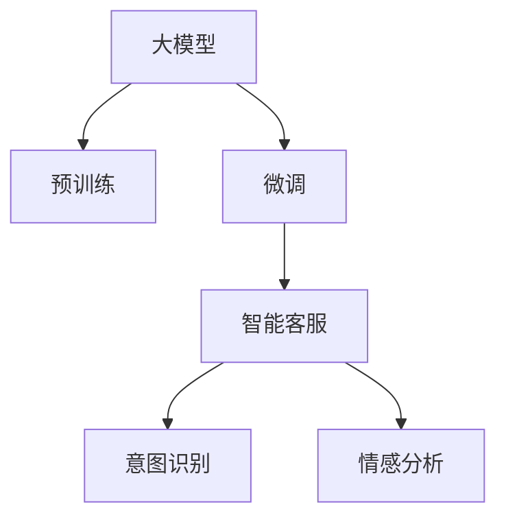

                 

# 大模型在电商平台智能客服中的应用

## 1. 背景介绍

随着电子商务的迅猛发展，电商平台每天需要处理大量的用户咨询，传统人工客服无法满足日益增长的需求，效率低、成本高，且服务质量难以保证。智能客服系统因其全天候在线、响应速度快、处理能力强的特点，迅速成为电商平台不可或缺的组成部分。

大模型在智能客服中的部署，将通过大规模预训练和微调，获得强大的自然语言理解能力，实现自动文本分析和用户意图识别，最终以自然流畅的方式与用户互动，解答疑问、处理投诉、推荐商品等，极大地提升了客服系统的智能化水平。

## 2. 核心概念与联系

### 2.1 核心概念概述

为更好地理解大模型在电商平台智能客服中的应用，本节将介绍几个密切相关的核心概念：

- **大模型(Large Model)**：指基于大规模语料库进行预训练的语言模型，如GPT、BERT等，具有强大的语言理解与生成能力。
- **预训练(Pre-training)**：指在大规模无标签数据上训练模型，使其学习到通用的语言知识，为后续微调打下基础。
- **微调(Fine-tuning)**：在预训练模型的基础上，针对特定任务使用少量标注数据进行有监督学习，优化模型在特定任务上的性能。
- **智能客服系统(Customer Service Chatbot)**：利用自然语言处理(NLP)技术，自动与用户进行互动，提供问题解答、订单处理、商品推荐等服务。
- **意图识别(Intent Recognition)**：理解用户输入的自然语言，判断其意图，并触发相应的服务逻辑。
- **情感分析(Emotion Analysis)**：分析用户文本中的情感倾向，帮助客服更好地理解用户情绪，提供针对性的服务。

这些概念之间的逻辑关系可以通过以下Mermaid流程图来展示：



这个流程图展示了大模型在智能客服系统中的核心概念及其相互关系：

1. 大模型通过预训练学习到通用的语言知识。
2. 在微调过程中，针对特定客服任务进行优化，形成高效的服务模型。
3. 微调后的模型作为智能客服的核心，执行意图识别和情感分析等功能，与用户进行自然流畅的互动。

## 3. 核心算法原理 & 具体操作步骤
### 3.1 算法原理概述

大模型在电商平台智能客服中的应用主要涉及意图识别和情感分析两个核心功能。其核心算法原理基于自然语言处理中的序列标注和分类任务。

对于意图识别，目标是将用户输入的自然语言序列标注为特定的意图类别，如查询商品信息、投诉物流问题、申请售后服务等。形式化地，假设模型为 $M_{\theta}$，输入为文本序列 $x=\{x_i\}_{i=1}^n$，目标为意图类别 $y=\{y_i\}_{i=1}^n$。意图识别的任务可以定义为：

$$
\mathcal{L}(y, M_{\theta}(x)) = -\frac{1}{n}\sum_{i=1}^n \log \mathbb{P}(M_{\theta}(x))(y_i)
$$

其中 $\mathbb{P}$ 为模型的预测概率分布。通过最小化损失函数 $\mathcal{L}$，可以优化模型在意图识别任务上的性能。

情感分析则涉及对用户情感倾向的判断，可以是二分类任务（如正面、负面）或情感极性的标注（如非常正面、中立、非常负面）。情感分析的算法原理与意图识别类似，区别在于目标标签的维度不同。

### 3.2 算法步骤详解

以下是具体算法步骤：

**Step 1: 准备预训练模型和数据集**

1. **选择预训练模型**：基于平台和客服任务的特点，选择合适的预训练语言模型，如GPT-3、BERT等。
2. **准备数据集**：收集客服咨询记录，标注用户的意图和情感。标注数据集应尽量覆盖各类常见客服场景，包括商品咨询、售后投诉、物流追踪等。

**Step 2: 设计任务适配层**

1. **意图识别适配层**：在预训练模型顶层添加全连接层，输出意图类别概率分布。常用的分类器包括softmax、sigmoid等。
2. **情感分析适配层**：同样在预训练模型顶层添加全连接层，输出情感类别概率分布。

**Step 3: 设置微调超参数**

1. **选择优化器**：如AdamW、SGD等，设置学习率、批大小、迭代轮数等超参数。
2. **选择正则化技术**：如L2正则、Dropout等，防止模型过拟合。
3. **选择评估指标**：如准确率、召回率、F1分数等，用于衡量模型性能。

**Step 4: 执行微调**

1. **分批次加载数据**：将标注数据分批次输入模型，前向传播计算预测概率分布。
2. **反向传播计算梯度**：根据目标标签与预测概率分布的差异，计算梯度。
3. **更新模型参数**：使用优化器更新模型参数，最小化损失函数。
4. **周期性评估性能**：在验证集上定期评估模型性能，必要时进行超参数调整。

**Step 5: 测试与部署**

1. **在测试集上评估模型性能**：计算意图识别和情感分析任务的指标。
2. **集成到客服系统中**：将微调后的模型集成到智能客服系统，实时接收用户输入，进行意图识别和情感分析。
3. **持续优化**：不断收集用户反馈，进行模型微调，提升系统表现。

### 3.3 算法优缺点

大模型在智能客服中的应用具有以下优点：

1. **高效性**：大模型具有强大的自然语言理解能力，能够快速响应用户请求，处理大量咨询请求。
2. **适应性强**：预训练模型的通用性，使其能够适应多种客服场景，快速适配新业务需求。
3. **可扩展性**：大模型可以通过微调进一步优化，支持更多的服务功能。

然而，也存在一些缺点：

1. **数据依赖**：模型的性能很大程度上依赖于标注数据的质量和数量，获取高质量标注数据的成本较高。
2. **过拟合风险**：在大规模语料上预训练后，微调过程中可能出现过拟合问题。
3. **计算资源需求**：大模型的计算复杂度较高，需要高性能硬件支持。
4. **解释性不足**：大模型往往是黑盒系统，难以解释其内部决策逻辑。

## 4. 数学模型和公式 & 详细讲解 & 举例说明

### 4.1 数学模型构建

以意图识别任务为例，构建数学模型：

1. **输入表示**：将用户输入的文本序列 $x$ 转换为模型可以接受的格式。通常使用分词和嵌入表示，将每个单词映射为一个低维向量。

2. **模型架构**：基于Transformer的预训练模型，可以自动学习到输入序列之间的关系。通过多层的自注意力机制，模型可以捕捉长距离依赖。

3. **任务适配层**：在模型的顶层添加全连接层，将Transformer的输出映射到意图类别的概率分布。

### 4.2 公式推导过程

以Softmax分类器为例，推导意图识别的损失函数：

假设模型输出为 $\hat{y} = (\hat{y}_1, \hat{y}_2, ..., \hat{y}_c)$，其中 $c$ 为意图类别数。目标标签为 $y=\{1, 0, ..., 0\}$，其中 $1$ 表示用户意图为 $i$。

则意图识别的损失函数为：

$$
\mathcal{L} = -\frac{1}{n}\sum_{i=1}^n \log \hat{y}_i
$$

其中 $\hat{y}_i$ 为模型预测用户意图的概率。

### 4.3 案例分析与讲解

以电商平台客服场景为例，通过微调预训练模型，实现自动意图识别。假设有一用户输入：

```
"请问这双鞋码是多少？"
```

模型通过自动编码器和意图识别适配层，输出意图类别概率分布：

```
"查询商品信息": 0.8, "投诉物流问题": 0.1, "申请售后": 0.1, "其他": 0
```

模型判断用户意图为 "查询商品信息"，并触发相应的服务逻辑，向用户提供尺码查询功能。

## 5. 项目实践：代码实例和详细解释说明

### 5.1 开发环境搭建

进行智能客服系统开发，需要先搭建好Python开发环境，包括必要的库和工具：

1. **安装Python**：选择最新版的Python，如3.8或更高版本。
2. **安装Pip**：用于安装第三方库。
3. **安装PyTorch**：用于深度学习模型的构建和训练。
4. **安装Transformers库**：用于预训练模型的加载和微调。
5. **安装其他库**：如NumPy、Pandas、Scikit-learn、Matplotlib等，用于数据处理和模型评估。

### 5.2 源代码详细实现

以下是基于PyTorch实现意图识别和情感分析的代码：

```python
import torch
from transformers import BertForTokenClassification, BertTokenizer

# 准备数据集
tokenizer = BertTokenizer.from_pretrained('bert-base-uncased')
model = BertForTokenClassification.from_pretrained('bert-base-uncased', num_labels=2)
train_data = []
dev_data = []
test_data = []

# 加载数据
with open('train.txt', 'r') as f:
    lines = f.readlines()
    for line in lines:
        text, label = line.split('\t')
        train_data.append((text, label))
        
# 微调模型
model.train()
optimizer = torch.optim.AdamW(model.parameters(), lr=2e-5)
for epoch in range(10):
    for text, label in train_data:
        input_ids = tokenizer(text, return_tensors='pt', padding='max_length', truncation=True).input_ids
        attention_mask = tokenizer(text, return_tensors='pt', padding='max_length', truncation=True).attention_mask
        targets = torch.tensor(label, dtype=torch.long)
        optimizer.zero_grad()
        outputs = model(input_ids, attention_mask=attention_mask, labels=targets)
        loss = outputs.loss
        loss.backward()
        optimizer.step()
    
    # 评估模型
    model.eval()
    with torch.no_grad():
        correct = 0
        total = 0
        for text, label in dev_data:
            input_ids = tokenizer(text, return_tensors='pt', padding='max_length', truncation=True).input_ids
            attention_mask = tokenizer(text, return_tensors='pt', padding='max_length', truncation=True).attention_mask
            targets = torch.tensor(label, dtype=torch.long)
            outputs = model(input_ids, attention_mask=attention_mask, labels=targets)
            _, preds = torch.max(outputs.logits, dim=2)
            total += targets.size(0)
            correct += (preds == targets).sum().item()
        
        accuracy = correct / total * 100
        print(f"Epoch {epoch+1}, accuracy on dev set: {accuracy:.2f}%")

# 测试模型
correct = 0
total = 0
with torch.no_grad():
    for text, label in test_data:
        input_ids = tokenizer(text, return_tensors='pt', padding='max_length', truncation=True).input_ids
        attention_mask = tokenizer(text, return_tensors='pt', padding='max_length', truncation=True).attention_mask
        targets = torch.tensor(label, dtype=torch.long)
        outputs = model(input_ids, attention_mask=attention_mask, labels=targets)
        _, preds = torch.max(outputs.logits, dim=2)
        total += targets.size(0)
        correct += (preds == targets).sum().item()

accuracy = correct / total * 100
print(f"Accuracy on test set: {accuracy:.2f}%")
```

### 5.3 代码解读与分析

代码实现分为数据准备、模型加载、微调训练、评估测试四个步骤。

1. **数据准备**：将数据集加载到Python中，并进行必要的预处理，如分词、编码、padding等。
2. **模型加载**：使用BERT模型，加载预训练权重和适配层，设置超参数。
3. **微调训练**：通过前向传播和反向传播更新模型参数，最小化损失函数。
4. **评估测试**：在测试集上评估模型性能，输出准确率。

## 6. 实际应用场景

### 6.1 智能客服系统

智能客服系统通过大模型的意图识别和情感分析，能够快速响应用户需求，提升用户体验和满意度。具体应用场景包括：

1. **常见问题解答**：自动回答用户关于商品信息、订单状态、配送时间等常见问题。
2. **问题路由**：根据用户意图，将复杂问题自动路由到人工客服。
3. **情感支持**：根据用户情感，自动提供情绪安抚或转接人工客服。
4. **个性化推荐**：分析用户情感和行为数据，推荐适合的商品或服务。

### 6.2 金融服务

在金融服务中，客服系统需要处理大量的投诉和咨询，大模型可以在这方面发挥重要作用。具体应用包括：

1. **风险评估**：根据用户情感和反馈，评估风险等级，调整服务策略。
2. **用户教育**：自动回答用户关于金融产品、风险管理的疑问，提升用户理解度。
3. **欺诈检测**：分析用户言行中的异常行为，及时发现和防范欺诈行为。

### 6.3 医疗咨询

大模型在医疗咨询中的应用，可以提升医疗服务的智能化水平，提高医生的工作效率和患者满意度。具体应用包括：

1. **病情诊断**：根据用户描述的症状，自动生成初步诊断意见。
2. **治疗建议**：根据病情，推荐合适的治疗方案和用药建议。
3. **心理疏导**：分析用户情绪，提供心理支持和建议。

## 7. 工具和资源推荐

### 7.1 学习资源推荐

1. **《Transformer从原理到实践》**：介绍Transformer模型的原理和应用，适合初学者。
2. **《自然语言处理与深度学习》**：斯坦福大学的经典教材，深入介绍NLP的数学和算法基础。
3. **Transformers库官方文档**：提供详细的使用指南和样例代码。
4. **HuggingFace官方博客**：分享最新研究成果和应用案例。

### 7.2 开发工具推荐

1. **PyTorch**：用于深度学习模型的构建和训练，支持动态图和静态图。
2. **TensorFlow**：提供丰富的计算图操作，适合大规模分布式训练。
3. **Jupyter Notebook**：交互式编程环境，方便调试和协作。
4. **Weights & Biases**：实验跟踪工具，帮助记录和分析模型训练过程。
5. **Google Colab**：免费提供GPU算力，支持在线编程和分享。

### 7.3 相关论文推荐

1. **《Attention is All You Need》**：Transformer模型的原始论文，奠定了大模型预训练的基础。
2. **《BERT: Pre-training of Deep Bidirectional Transformers for Language Understanding》**：提出BERT模型，引入掩码语言模型任务，极大提升了NLP效果。
3. **《GPT-3: Language Models are Unsupervised Multitask Learners》**：展示GPT-3模型的强大零样本学习能力，推动大模型研究。
4. **《AdaLoRA: Adaptive Low-Rank Adaptation for Parameter-Efficient Fine-Tuning》**：提出AdaLoRA方法，进一步优化微调模型参数。
5. **《Prompt-based Learning: Exploring the Limits and Capabilities of Language Models》**：介绍Prompt-based Learning方法，利用提示模板提升大模型的性能。

## 8. 总结：未来发展趋势与挑战

### 8.1 研究成果总结

大模型在智能客服中的应用已经展现出强大的潜力，通过微调提升了客服系统的智能化水平。未来的研究方向包括：

1. **多模态智能客服**：结合视觉、语音等多模态信息，提升客服系统的感知能力和决策能力。
2. **跨语言客服**：支持多种语言的客服系统，提升国际化的服务水平。
3. **人机协作**：将大模型与人工客服相结合，实现更高效、更人性化的交互。

### 8.2 未来发展趋势

1. **模型规模和参数效率**：大模型的规模将继续扩大，参数效率也会进一步提升，支持更复杂的任务。
2. **个性化服务**：通过分析用户行为和情感，提供个性化的推荐和服务。
3. **跨领域应用**：大模型将更多地应用于金融、医疗、教育等多个领域，提升行业效率和用户体验。
4. **模型可解释性**：引入可解释性技术，增强客服系统的透明度和可信度。

### 8.3 面临的挑战

1. **数据隐私和安全**：客服系统需要处理大量用户隐私数据，如何保护数据安全和隐私是一个重要问题。
2. **模型鲁棒性和公平性**：客服系统需要具备良好的鲁棒性和公平性，避免出现偏见和歧视。
3. **实时性要求**：在处理高并发请求时，如何保证模型的实时性和响应速度。

### 8.4 研究展望

未来的研究方向包括：

1. **隐私保护技术**：开发隐私保护算法，确保用户数据的匿名化和加密。
2. **鲁棒性增强**：研究鲁棒性模型训练方法，提升模型的泛化能力和公平性。
3. **高效推理**：优化模型推理过程，提升实时性和可扩展性。
4. **跨领域模型**：构建跨领域通用模型，提升多场景下的泛化能力。

## 9. 附录：常见问题与解答

**Q1: 大模型在智能客服中如何避免过拟合？**

A: 大模型在智能客服中的应用，可以通过以下方法避免过拟合：

1. **数据增强**：通过回译、近义词替换等方式增加训练数据的多样性。
2. **正则化**：使用L2正则、Dropout等方法，防止模型过度拟合训练数据。
3. **对抗训练**：引入对抗样本，提升模型鲁棒性。
4. **参数高效微调**：只调整模型的一小部分参数，减小过拟合风险。

**Q2: 大模型在微调过程中，如何平衡精度和效率？**

A: 大模型在微调过程中，可以通过以下方法平衡精度和效率：

1. **模型裁剪**：去除不必要的层和参数，减小模型尺寸，加快推理速度。
2. **量化加速**：将浮点模型转为定点模型，压缩存储空间，提高计算效率。
3. **分布式训练**：利用多GPU或多机并行训练，加快模型训练速度。
4. **混合精度训练**：使用混合精度训练技术，提高训练速度，同时保持模型的精度。

**Q3: 如何确保大模型在智能客服系统中的安全性？**

A: 大模型在智能客服系统中的安全性，可以通过以下措施来保障：

1. **访问控制**：限制模型的访问权限，确保只有授权人员可以访问和修改模型。
2. **数据加密**：对用户数据进行加密存储和传输，防止数据泄露。
3. **异常检测**：实时监控模型输出，检测异常行为，及时报警。
4. **模型审计**：定期对模型进行审计和评估，确保模型行为符合规范。

---

作者：禅与计算机程序设计艺术 / Zen and the Art of Computer Programming

