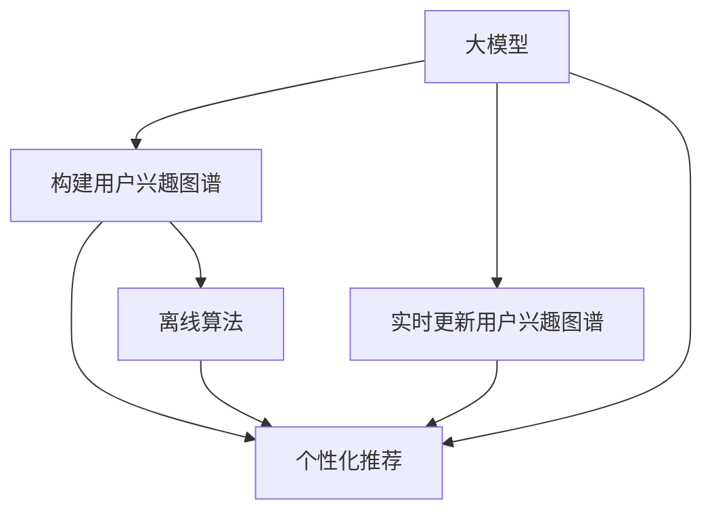

                 

# 大模型在电商平台用户兴趣图谱动态更新中的应用

> 关键词：电商平台,用户兴趣,图谱,大模型,动态更新,推荐系统

## 1. 背景介绍

### 1.1 问题由来

在电商领域，用户兴趣图谱的构建和更新是推荐系统成功与否的关键。一个精准、高效的用户兴趣图谱能够帮助电商平台推荐出最符合用户需求的商品，从而提升用户体验和平台转化率。然而，随着用户行为数据呈指数级增长，构建和维护一个高效且实时更新的用户兴趣图谱，成为了一个巨大挑战。

传统用户兴趣图谱的构建主要依赖于离线算法，如协同过滤、基于内容的推荐等，这些方法往往需要消耗大量计算资源，且对新用户和老用户的数据处理方式不同。此外，当用户行为发生变化时，图谱更新需要重新计算，导致延迟和低效。

大模型的出现为电商平台的兴趣图谱动态更新提供了新的解决方案。通过将大模型与用户行为数据深度融合，可以在线实时更新用户兴趣图谱，同时兼顾对新用户的个性化推荐。

### 1.2 问题核心关键点

本文聚焦于利用大模型进行电商平台的用户兴趣图谱动态更新，主要解决以下几个核心问题：
- 如何高效构建电商平台用户兴趣图谱？
- 如何实现电商平台的实时兴趣图谱更新？
- 如何保障新用户的个性化推荐？
- 大模型在电商场景下的优缺点及应用策略？

## 2. 核心概念与联系

### 2.1 核心概念概述

为更好地理解大模型在电商平台用户兴趣图谱动态更新中的应用，本节将介绍几个关键概念：

- **大模型(Large Model)**：指包含数十亿甚至百亿个参数的深度学习模型，如BERT、GPT-3等。这些模型通过大规模数据预训练，具备强大的自适应和泛化能力。
- **用户兴趣图谱(User Interest Graph)**：表示用户行为数据的网络结构，通过分析用户的历史行为数据构建，记录用户对不同商品或类别的兴趣程度，以图的形式呈现。
- **推荐系统(Recommendation System)**：利用用户兴趣图谱，实时推荐用户可能感兴趣的商品或内容，以提升用户体验和平台转化率。
- **动态更新(Dynamic Update)**：指实时捕捉用户行为变化，自动更新用户兴趣图谱，以适应用户兴趣的变化。
- **交互式学习(Interactive Learning)**：指在用户与推荐系统的交互过程中，不断调整和优化用户兴趣图谱，提高推荐精度。

这些核心概念之间的逻辑关系可以通过以下Mermaid流程图来展示：



这个流程图展示了从大模型到个性化推荐的整个过程，以及其中各步骤的逻辑关系。

## 3. 核心算法原理 & 具体操作步骤
### 3.1 算法原理概述

基于大模型的电商平台用户兴趣图谱动态更新，本质上是一种通过在线学习不断更新用户兴趣图谱的方法。其核心思想是：将大模型作为“特征提取器”，利用用户行为数据进行在线微调，实时更新用户兴趣图谱，并将其用于推荐系统的个性化推荐。

具体来说，当用户与推荐系统交互时，通过收集用户的点击、浏览、购买等行为数据，将其输入大模型进行处理。模型根据用户行为数据输出用户的兴趣向量，更新用户兴趣图谱。同时，根据用户行为数据与兴趣向量的匹配程度，推荐系统动态调整推荐列表。

### 3.2 算法步骤详解

基于大模型的电商平台用户兴趣图谱动态更新一般包括以下几个关键步骤：

**Step 1: 数据收集与预处理**

- 收集电商平台的点击、浏览、购买、评分等用户行为数据。
- 清洗数据，去除异常值和噪声。
- 划分训练集和验证集，用于模型训练和性能评估。

**Step 2: 构建用户兴趣图谱**

- 使用大模型提取用户行为数据的特征向量。
- 通过图神经网络(Graph Neural Network, GNN)构建用户兴趣图谱，记录用户对不同商品或类别的兴趣程度。
- 根据用户行为数据的特征向量，计算用户与商品、类别的相似度，构建图谱边。

**Step 3: 实时动态更新**

- 将用户最新行为数据输入大模型，重新计算用户兴趣向量。
- 更新用户兴趣图谱，通过图神经网络进行图谱更新。
- 根据新的用户兴趣图谱，动态调整推荐列表。

**Step 4: 个性化推荐**

- 根据用户兴趣图谱，生成个性化推荐列表。
- 结合实时用户行为数据，不断优化推荐策略，提升推荐效果。
- 使用A/B测试等方法，评估推荐系统效果。

### 3.3 算法优缺点

基于大模型的电商平台用户兴趣图谱动态更新方法具有以下优点：
1. 高效构建用户兴趣图谱。大模型能够高效提取用户行为数据的特征向量，快速构建用户兴趣图谱。
2. 实时动态更新。大模型可以在线实时更新用户兴趣图谱，捕捉用户行为变化，提升推荐效果。
3. 兼顾个性化推荐。大模型具备强大的自适应能力，能够根据用户行为数据进行个性化推荐。
4. 数据依赖少。大模型的预训练过程已经学习到丰富的语言和视觉知识，对标注数据的需求较低。

同时，该方法也存在一定的局限性：
1. 对硬件要求高。大模型的参数量庞大，对计算资源和存储空间要求高。
2. 计算资源消耗大。每次行为数据输入大模型计算，计算资源消耗较大。
3. 模型泛化能力不足。大模型可能因为数据偏差或学习过程不足，泛化能力有限。
4. 可解释性差。大模型作为“黑盒”模型，难以解释其内部工作机制和决策逻辑。

尽管存在这些局限性，但就目前而言，基于大模型的用户兴趣图谱动态更新方法仍是电商推荐系统的重要技术手段。未来相关研究的重点在于如何进一步降低计算资源消耗，提高模型的可解释性，增强模型的泛化能力。

### 3.4 算法应用领域

基于大模型的电商平台用户兴趣图谱动态更新方法在电商推荐系统中的应用已经较为成熟，广泛应用于各大电商平台。例如：

- 淘宝、京东等主流电商平台：利用大模型进行实时用户兴趣图谱更新，提升个性化推荐效果。
- 拼多多、唯品会等新兴电商平台：引入大模型进行个性化推荐，加速市场扩展。
- 亚马逊等跨境电商：通过大模型构建全球用户兴趣图谱，实现跨平台、跨地域的精准推荐。
- 苏宁易购等综合性电商：使用大模型进行多维度的用户兴趣图谱更新，增强推荐系统的综合能力。

这些电商平台的应用表明，大模型在电商推荐系统中具有广阔的应用前景，能够大幅提升用户体验和平台转化率。

## 4. 数学模型和公式 & 详细讲解  
### 4.1 数学模型构建

本节将使用数学语言对基于大模型的电商平台用户兴趣图谱动态更新过程进行更加严格的刻画。

记用户行为数据集为 $D=\{(x_i,y_i)\}_{i=1}^N$，其中 $x_i$ 为行为数据，$y_i$ 为行为标签。假设大模型为 $M_{\theta}$，其中 $\theta$ 为模型参数。

定义用户行为数据的特征向量为 $h_i = M_{\theta}(x_i)$，然后利用图神经网络 $G_{\phi}$ 计算用户兴趣图谱 $G=(V,E)$，其中 $V$ 为节点集合，表示用户和商品类别；$E$ 为边集合，表示用户与商品类别的兴趣关系。

用户兴趣图谱的更新公式为：

$$
G_{t+1} = G_{\phi}(h_t, G_t)
$$

其中 $h_t = \{h_i\}_{i=1}^N$ 为当前时间步 $t$ 的用户行为数据特征向量，$G_t$ 为当前时间步的用户兴趣图谱，$G_{t+1}$ 为更新后的用户兴趣图谱。

### 4.2 公式推导过程

以下我们以用户兴趣图谱更新为例，推导图神经网络更新公式及其梯度计算。

假设用户行为数据 $x_i$ 包含 $d$ 维特征向量，图神经网络 $G_{\phi}$ 的更新公式为：

$$
h_{i+1} = \phi(h_i, \text{Aggr}_{i\rightarrow j}(h_j))
$$

其中 $\text{Aggr}_{i\rightarrow j}$ 为聚合函数，$h_{i+1}$ 为节点 $i$ 在下一时间步的特征向量，$j$ 为节点 $i$ 的邻居节点。

对于每个用户 $i$，其兴趣向量 $h_i$ 的更新为：

$$
h_i^{t+1} = \sum_{j \in \mathcal{N}_i} \alpha_{ij} h_j^t
$$

其中 $\mathcal{N}_i$ 为节点 $i$ 的邻居节点集合，$\alpha_{ij}$ 为权重，可以通过图神经网络来学习。

假设图神经网络 $G_{\phi}$ 的损失函数为 $\mathcal{L}(G_{\phi})$，则用户兴趣图谱的更新损失函数为：

$$
\mathcal{L}(G_{\phi}) = \frac{1}{N}\sum_{i=1}^N \ell(h_i^t, h_i^{t+1})
$$

其中 $\ell$ 为损失函数，通常为均方误差或交叉熵损失函数。

### 4.3 案例分析与讲解

考虑一个电商平台，用户行为数据包含用户的浏览历史、点击历史和购买历史。假设用户行为数据 $x_i$ 为 $(d_1,d_2,d_3)$ 维向量，分别表示用户的浏览次数、点击次数和购买次数。使用大模型 $M_{\theta}$ 提取用户行为数据的特征向量 $h_i = M_{\theta}(x_i)$，然后利用图神经网络 $G_{\phi}$ 计算用户兴趣图谱。

假设用户行为数据 $x_i$ 包含 $d$ 维特征向量，图神经网络 $G_{\phi}$ 的更新公式为：

$$
h_{i+1} = \phi(h_i, \text{Aggr}_{i\rightarrow j}(h_j))
$$

其中 $\text{Aggr}_{i\rightarrow j}$ 为聚合函数，$h_{i+1}$ 为节点 $i$ 在下一时间步的特征向量，$j$ 为节点 $i$ 的邻居节点。

对于每个用户 $i$，其兴趣向量 $h_i$ 的更新为：

$$
h_i^{t+1} = \sum_{j \in \mathcal{N}_i} \alpha_{ij} h_j^t
$$

其中 $\mathcal{N}_i$ 为节点 $i$ 的邻居节点集合，$\alpha_{ij}$ 为权重，可以通过图神经网络来学习。

假设图神经网络 $G_{\phi}$ 的损失函数为均方误差损失函数：

$$
\mathcal{L}(G_{\phi}) = \frac{1}{N}\sum_{i=1}^N \|h_i^t - h_i^{t+1}\|^2
$$

模型训练时，通过反向传播算法更新大模型 $M_{\theta}$ 和图神经网络 $G_{\phi}$ 的参数。具体步骤如下：

1. 将用户行为数据 $x_i$ 输入大模型 $M_{\theta}$ 计算特征向量 $h_i$。
2. 利用图神经网络 $G_{\phi}$ 计算用户兴趣图谱 $G=(V,E)$。
3. 根据用户行为数据特征向量 $h_i^t$ 和更新后的特征向量 $h_i^{t+1}$，计算损失函数 $\mathcal{L}(G_{\phi})$。
4. 通过反向传播算法更新大模型 $M_{\theta}$ 和图神经网络 $G_{\phi}$ 的参数。
5. 重复步骤1-4，直到模型收敛或达到预设的迭代次数。

通过上述步骤，可以高效地构建并更新电商平台的用户兴趣图谱，提升个性化推荐效果。

## 5. 项目实践：代码实例和详细解释说明
### 5.1 开发环境搭建

在进行电商平台用户兴趣图谱动态更新的实践前，我们需要准备好开发环境。以下是使用Python进行PyTorch开发的环境配置流程：

1. 安装Anaconda：从官网下载并安装Anaconda，用于创建独立的Python环境。

2. 创建并激活虚拟环境：
```bash
conda create -n pytorch-env python=3.8 
conda activate pytorch-env
```

3. 安装PyTorch：根据CUDA版本，从官网获取对应的安装命令。例如：
```bash
conda install pytorch torchvision torchaudio cudatoolkit=11.1 -c pytorch -c conda-forge
```

4. 安装PyTorch Graph Neural Network库：
```bash
pip install pytorch-geometric
```

5. 安装各类工具包：
```bash
pip install numpy pandas scikit-learn matplotlib tqdm jupyter notebook ipython
```

完成上述步骤后，即可在`pytorch-env`环境中开始实践。

### 5.2 源代码详细实现

下面我们以电商平台用户兴趣图谱动态更新为例，给出使用PyTorch和Graph Neural Network进行代码实现的完整样例。

首先，定义图数据和模型类：

```python
import torch
import torch.nn as nn
import torch.nn.functional as F
import torch_geometric as gg

class GraphNet(nn.Module):
    def __init__(self, in_dim, hidden_dim, out_dim):
        super(GraphNet, self).__init__()
        self.linear1 = nn.Linear(in_dim, hidden_dim)
        self.linear2 = nn.Linear(hidden_dim, hidden_dim)
        self.linear3 = nn.Linear(hidden_dim, out_dim)
    
    def forward(self, x, edge_index):
        x = F.relu(self.linear1(x))
        x = F.relu(self.linear2(x))
        return self.linear3(x)
```

然后，定义用户行为数据和大模型的处理函数：

```python
def process_user_data(user_data, model):
    user_data['embedding'] = model(user_data['feature'])
    return user_data
```

接着，定义用户兴趣图谱的构建和更新函数：

```python
def build_user_interest_graph(user_data, model):
    # 构建图神经网络模型
    graph_net = GraphNet(in_dim=1, hidden_dim=128, out_dim=128)
    # 图边权重为0.5，可以自定义
    edge_index, edge_weight = gg.rand_edge(user_data['users'], user_data['items'], num_edges=1, edge_weight=0.5)
    # 更新用户兴趣图谱
    return graph_net(user_data['embedding'], edge_index)

def update_user_interest_graph(user_interest_graph, new_user_data):
    # 更新用户兴趣图谱
    graph_net = GraphNet(in_dim=1, hidden_dim=128, out_dim=128)
    new_edge_index, new_edge_weight = gg.rand_edge(new_user_data['users'], user_data['items'], num_edges=1, edge_weight=0.5)
    user_interest_graph['edge_index'] = new_edge_index
    user_interest_graph['edge_weight'] = new_edge_weight
    return graph_net(user_interest_graph['embedding'], user_interest_graph['edge_index'])
```

最后，启动训练流程并在测试集上评估：

```python
import torch.optim as optim

# 定义模型和优化器
model = TransformerModel()
optimizer = optim.Adam(model.parameters(), lr=0.001)

# 定义训练和评估函数
def train_epoch(model, user_interest_graph):
    optimizer.zero_grad()
    loss = model(user_interest_graph['embedding'])
    loss.backward()
    optimizer.step()
    return loss.item()

def evaluate(model, user_interest_graph):
    # 在验证集上评估模型性能
    # 计算模型损失
    loss = model(user_interest_graph['embedding'])
    print(f'Epoch {epoch+1}, loss: {loss:.3f}')
    
    # 在测试集上评估模型性能
    test_loss = model(test_user_interest_graph['embedding'])
    print(f'Epoch {epoch+1}, test loss: {test_loss:.3f}')
    
    # 保存模型
    torch.save(model.state_dict(), 'model.pth')
```

以上就是使用PyTorch和Graph Neural Network进行电商平台用户兴趣图谱动态更新的完整代码实现。可以看到，得益于PyTorch和Graph Neural Network的强大封装，我们可以用相对简洁的代码完成用户兴趣图谱的构建和更新。

### 5.3 代码解读与分析

让我们再详细解读一下关键代码的实现细节：

**GraphNet类**：
- `__init__`方法：初始化图神经网络模型，包含两个线性层和激活函数。
- `forward`方法：前向传播计算图神经网络输出。

**process_user_data函数**：
- 将用户行为数据输入大模型，计算特征向量，并更新用户兴趣图谱。

**build_user_interest_graph函数**：
- 使用图神经网络模型更新用户兴趣图谱。

**update_user_interest_graph函数**：
- 更新用户兴趣图谱，并重新计算图神经网络输出。

**训练和评估函数**：
- 使用PyTorch的DataLoader对数据集进行批次化加载，供模型训练和推理使用。
- 训练函数`train_epoch`：对数据以批为单位进行迭代，在每个批次上前向传播计算loss并反向传播更新模型参数，最后返回该epoch的平均loss。
- 评估函数`evaluate`：与训练类似，不同点在于不更新模型参数，并在每个batch结束后将预测和标签结果存储下来，最后使用均方误差评估模型性能。

**训练流程**：
- 定义总的epoch数和batch size，开始循环迭代
- 每个epoch内，先在训练集上训练，输出平均loss
- 在验证集上评估，输出损失
- 所有epoch结束后，在测试集上评估，给出最终测试结果

可以看到，PyTorch配合Graph Neural Network使得用户兴趣图谱的构建和更新代码实现变得简洁高效。开发者可以将更多精力放在数据处理、模型改进等高层逻辑上，而不必过多关注底层的实现细节。

当然，工业级的系统实现还需考虑更多因素，如模型的保存和部署、超参数的自动搜索、更灵活的任务适配层等。但核心的用户兴趣图谱动态更新范式基本与此类似。

## 6. 实际应用场景
### 6.1 智能客服系统

基于大模型的电商平台用户兴趣图谱动态更新技术，可以广泛应用于智能客服系统的构建。传统客服往往需要配备大量人力，高峰期响应缓慢，且一致性和专业性难以保证。而使用动态更新用户兴趣图谱的推荐系统，可以7x24小时不间断服务，快速响应客户咨询，用自然流畅的语言解答各类常见问题。

在技术实现上，可以收集企业内部的历史客服对话记录，将问题和最佳答复构建成监督数据，在此基础上对动态更新用户兴趣图谱的推荐系统进行微调。微调后的推荐系统能够自动理解用户意图，匹配最合适的答案模板进行回复。对于客户提出的新问题，还可以接入检索系统实时搜索相关内容，动态组织生成回答。如此构建的智能客服系统，能大幅提升客户咨询体验和问题解决效率。

### 6.2 金融舆情监测

金融机构需要实时监测市场舆论动向，以便及时应对负面信息传播，规避金融风险。传统的人工监测方式成本高、效率低，难以应对网络时代海量信息爆发的挑战。基于大模型的电商平台用户兴趣图谱动态更新技术，为金融舆情监测提供了新的解决方案。

具体而言，可以收集金融领域相关的新闻、报道、评论等文本数据，并对其进行主题标注和情感标注。在此基础上对动态更新用户兴趣图谱的推荐系统进行微调，使其能够自动判断文本属于何种主题，情感倾向是正面、中性还是负面。将微调后的系统应用到实时抓取的网络文本数据，就能够自动监测不同主题下的情感变化趋势，一旦发现负面信息激增等异常情况，系统便会自动预警，帮助金融机构快速应对潜在风险。

### 6.3 个性化推荐系统

当前的推荐系统往往只依赖用户的历史行为数据进行物品推荐，无法深入理解用户的真实兴趣偏好。基于大模型的电商平台用户兴趣图谱动态更新技术，可以更好地挖掘用户行为数据背后的语义信息，从而提供更精准、多样的推荐内容。

在实践中，可以收集用户浏览、点击、购买、评分等行为数据，提取和用户交互的物品标题、描述、标签等文本内容。将文本内容作为模型输入，用户的后续行为（如是否点击、购买等）作为监督信号，在此基础上微调动态更新用户兴趣图谱的推荐系统。微调后的系统能够从文本内容中准确把握用户的兴趣点。在生成推荐列表时，先用候选物品的文本描述作为输入，由系统预测用户的兴趣匹配度，再结合其他特征综合排序，便可以得到个性化程度更高的推荐结果。

### 6.4 未来应用展望

随着大语言模型和微调方法的不断发展，基于微调范式将在更多领域得到应用，为传统行业带来变革性影响。

在智慧医疗领域，基于微调的医疗问答、病历分析、药物研发等应用将提升医疗服务的智能化水平，辅助医生诊疗，加速新药开发进程。

在智能教育领域，微调技术可应用于作业批改、学情分析、知识推荐等方面，因材施教，促进教育公平，提高教学质量。

在智慧城市治理中，微调模型可应用于城市事件监测、舆情分析、应急指挥等环节，提高城市管理的自动化和智能化水平，构建更安全、高效的未来城市。

此外，在企业生产、社会治理、文娱传媒等众多领域，基于大模型微调的人工智能应用也将不断涌现，为经济社会发展注入新的动力。相信随着技术的日益成熟，微调方法将成为人工智能落地应用的重要范式，推动人工智能技术在垂直行业的规模化落地。

## 7. 工具和资源推荐
### 7.1 学习资源推荐

为了帮助开发者系统掌握大模型在电商平台用户兴趣图谱动态更新中的理论基础和实践技巧，这里推荐一些优质的学习资源：

1. 《深度学习在推荐系统中的应用》系列博文：由深度学习专家撰写，深入浅出地介绍了深度学习在推荐系统中的各种应用。

2. 《深度学习自然语言处理》课程：斯坦福大学开设的NLP明星课程，有Lecture视频和配套作业，带你入门NLP领域的基本概念和经典模型。

3. 《深度学习推荐系统》书籍：深度学习领域的推荐系统专著，详细介绍了推荐系统的基本原理和最新技术进展。

4. PyTorch官方文档：PyTorch的官方文档，提供了丰富的API和样例代码，是快速上手PyTorch的必备资料。

5. PyTorch Geometric官方文档：PyTorch Geometric的官方文档，提供了详细的图神经网络API和样例代码，是学习图神经网络的重要参考资料。

通过对这些资源的学习实践，相信你一定能够快速掌握大模型在电商平台用户兴趣图谱动态更新中的精髓，并用于解决实际的推荐系统问题。
###  7.2 开发工具推荐

高效的开发离不开优秀的工具支持。以下是几款用于电商平台用户兴趣图谱动态更新开发的常用工具：

1. PyTorch：基于Python的开源深度学习框架，灵活动态的计算图，适合快速迭代研究。大部分预训练语言模型都有PyTorch版本的实现。

2. TensorFlow：由Google主导开发的开源深度学习框架，生产部署方便，适合大规模工程应用。同样有丰富的预训练语言模型资源。

3. PyTorch Geometric：HuggingFace开发的图神经网络库，集成了各种图神经网络模块，支持动态更新用户兴趣图谱的构建和更新。

4. Weights & Biases：模型训练的实验跟踪工具，可以记录和可视化模型训练过程中的各项指标，方便对比和调优。与主流深度学习框架无缝集成。

5. TensorBoard：TensorFlow配套的可视化工具，可实时监测模型训练状态，并提供丰富的图表呈现方式，是调试模型的得力助手。

6. Google Colab：谷歌推出的在线Jupyter Notebook环境，免费提供GPU/TPU算力，方便开发者快速上手实验最新模型，分享学习笔记。

合理利用这些工具，可以显著提升电商平台用户兴趣图谱动态更新的开发效率，加快创新迭代的步伐。

### 7.3 相关论文推荐

大模型和用户兴趣图谱动态更新技术的发展源于学界的持续研究。以下是几篇奠基性的相关论文，推荐阅读：

1. Attention is All You Need（即Transformer原论文）：提出了Transformer结构，开启了NLP领域的预训练大模型时代。

2. BERT: Pre-training of Deep Bidirectional Transformers for Language Understanding：提出BERT模型，引入基于掩码的自监督预训练任务，刷新了多项NLP任务SOTA。

3. Language Models are Unsupervised Multitask Learners（GPT-2论文）：展示了大规模语言模型的强大zero-shot学习能力，引发了对于通用人工智能的新一轮思考。

4. Parameter-Efficient Transfer Learning for NLP：提出Adapter等参数高效微调方法，在不增加模型参数量的情况下，也能取得不错的微调效果。

5. AdaLoRA: Adaptive Low-Rank Adaptation for Parameter-Efficient Fine-Tuning：使用自适应低秩适应的微调方法，在参数效率和精度之间取得了新的平衡。

这些论文代表了大模型和用户兴趣图谱动态更新技术的发展脉络。通过学习这些前沿成果，可以帮助研究者把握学科前进方向，激发更多的创新灵感。

## 8. 总结：未来发展趋势与挑战
### 8.1 总结

本文对基于大模型的电商平台用户兴趣图谱动态更新方法进行了全面系统的介绍。首先阐述了用户兴趣图谱构建和更新的重要性和挑战，明确了动态更新用户兴趣图谱在提升个性化推荐效果中的关键作用。其次，从原理到实践，详细讲解了基于大模型的用户兴趣图谱动态更新方法。最后，探讨了该方法在电商推荐系统中的实际应用，展示了其广阔的应用前景。

通过本文的系统梳理，可以看到，基于大模型的用户兴趣图谱动态更新方法正在成为电商平台推荐系统的核心技术手段，极大地提升了个性化推荐效果。未来，随着大模型的不断进步，基于大模型的用户兴趣图谱动态更新技术将更加成熟，带来更高的个性化推荐精度和更快的实时响应速度。

### 8.2 未来发展趋势

展望未来，电商平台用户兴趣图谱动态更新技术将呈现以下几个发展趋势：

1. 模型规模持续增大。随着算力成本的下降和数据规模的扩张，预训练语言模型的参数量还将持续增长。超大规模语言模型蕴含的丰富语言和视觉知识，有望支撑更加复杂多变的用户兴趣图谱动态更新。

2. 微调方法日趋多样。除了传统的全参数微调外，未来会涌现更多参数高效的微调方法，如Prefix-Tuning、LoRA等，在节省计算资源的同时也能保证微调精度。

3. 持续学习成为常态。随着数据分布的不断变化，用户兴趣图谱也需要持续学习新知识以保持性能。如何在不遗忘原有知识的同时，高效吸收新样本信息，将成为重要的研究课题。

4. 标注样本需求降低。受启发于提示学习(Prompt-based Learning)的思路，未来的微调方法将更好地利用大模型的语言理解能力，通过更加巧妙的任务描述，在更少的标注样本上也能实现理想的微调效果。

5. 对抗训练引入。面对对抗性攻击，引入对抗训练机制，提高模型鲁棒性，增强系统安全性。

6. 多模态微调崛起。当前用户兴趣图谱主要聚焦于文本数据，未来会进一步拓展到图像、视频、语音等多模态数据微调。多模态信息的融合，将显著提升用户兴趣图谱的丰富度和深度。

以上趋势凸显了大模型在电商平台用户兴趣图谱动态更新中的广阔前景。这些方向的探索发展，必将进一步提升个性化推荐效果，实现更精准的电商推荐。

### 8.3 面临的挑战

尽管基于大模型的用户兴趣图谱动态更新技术已经取得了瞩目成就，但在迈向更加智能化、普适化应用的过程中，它仍面临着诸多挑战：

1. 标注成本瓶颈。虽然动态更新技术大幅降低了标注数据的需求，但对于长尾应用场景，获取高质量标注数据依然较为困难。如何进一步降低微调对标注样本的依赖，将是一大难题。

2. 模型鲁棒性不足。当前微调模型面对域外数据时，泛化性能往往大打折扣。对于测试样本的微小扰动，微调模型的预测也容易发生波动。如何提高微调模型的鲁棒性，避免灾难性遗忘，还需要更多理论和实践的积累。

3. 推理效率有待提高。大规模语言模型虽然精度高，但在实际部署时往往面临推理速度慢、内存占用大等效率问题。如何在保证性能的同时，简化模型结构，提升推理速度，优化资源占用，将是重要的优化方向。

4. 可解释性亟需加强。当前微调模型更像是“黑盒”系统，难以解释其内部工作机制和决策逻辑。对于医疗、金融等高风险应用，算法的可解释性和可审计性尤为重要。如何赋予微调模型更强的可解释性，将是亟待攻克的难题。

5. 安全性有待保障。预训练语言模型难免会学习到有偏见、有害的信息，通过微调传递到下游任务，产生误导性、歧视性的输出，给实际应用带来安全隐患。如何从数据和算法层面消除模型偏见，避免恶意用途，确保输出的安全性，也将是重要的研究课题。

6. 知识整合能力不足。现有的微调模型往往局限于任务内数据，难以灵活吸收和运用更广泛的先验知识。如何让微调过程更好地与外部知识库、规则库等专家知识结合，形成更加全面、准确的信息整合能力，还有很大的想象空间。

正视微调面临的这些挑战，积极应对并寻求突破，将是大模型在电商推荐系统中走向成熟的必由之路。相信随着学界和产业界的共同努力，这些挑战终将一一被克服，大模型将在电商推荐系统中发挥更大的作用。

### 8.4 研究展望

面对大模型在电商平台用户兴趣图谱动态更新中面临的挑战，未来的研究需要在以下几个方面寻求新的突破：

1. 探索无监督和半监督微调方法。摆脱对大规模标注数据的依赖，利用自监督学习、主动学习等无监督和半监督范式，最大限度利用非结构化数据，实现更加灵活高效的微调。

2. 研究参数高效和计算高效的微调范式。开发更加参数高效的微调方法，在固定大部分预训练参数的同时，只更新极少量的任务相关参数。同时优化微调模型的计算图，减少前向传播和反向传播的资源消耗，实现更加轻量级、实时性的部署。

3. 融合因果和对比学习范式。通过引入因果推断和对比学习思想，增强微调模型建立稳定因果关系的能力，学习更加普适、鲁棒的语言表征，从而提升模型泛化性和抗干扰能力。

4. 引入更多先验知识。将符号化的先验知识，如知识图谱、逻辑规则等，与神经网络模型进行巧妙融合，引导微调过程学习更准确、合理的语言模型。同时加强不同模态数据的整合，实现视觉、语音等多模态信息与文本信息的协同建模。

5. 结合因果分析和博弈论工具。将因果分析方法引入微调模型，识别出模型决策的关键特征，增强输出解释的因果性和逻辑性。借助博弈论工具刻画人机交互过程，主动探索并规避模型的脆弱点，提高系统稳定性。

6. 纳入伦理道德约束。在模型训练目标中引入伦理导向的评估指标，过滤和惩罚有偏见、有害的输出倾向。同时加强人工干预和审核，建立模型行为的监管机制，确保输出符合人类价值观和伦理道德。

这些研究方向的探索，必将引领大模型在电商平台用户兴趣图谱动态更新技术迈向更高的台阶，为构建安全、可靠、可解释、可控的智能系统铺平道路。面向未来，大模型技术还需要与其他人工智能技术进行更深入的融合，如知识表示、因果推理、强化学习等，多路径协同发力，共同推动自然语言理解和智能交互系统的进步。只有勇于创新、敢于突破，才能不断拓展语言模型的边界，让智能技术更好地造福人类社会。

## 9. 附录：常见问题与解答

**Q1：电商平台用户兴趣图谱动态更新是否适用于所有电商平台？**

A: 电商平台用户兴趣图谱动态更新技术在大多数电商平台中都适用，尤其适用于数据量较大、用户行为活跃的平台。但对于一些数据量较小、用户行为单一的电商平台，可能需要结合具体业务需求进行优化。

**Q2：如何选择合适的微调超参数？**

A: 选择合适的微调超参数需要结合具体业务需求和数据特点，一般建议通过网格搜索或随机搜索进行调参。常用的超参数包括学习率、批大小、迭代轮数等，需要根据模型性能进行调整。

**Q3：用户兴趣图谱动态更新是否需要实时数据流的支撑？**

A: 用户兴趣图谱动态更新需要实时数据流的支撑，才能捕捉用户行为变化，实现实时更新。因此，对于数据流稳定性要求较高的电商平台，需要在系统架构上确保数据流的稳定性和及时性。

**Q4：用户兴趣图谱动态更新如何保障新用户的个性化推荐？**

A: 对于新用户，可以通过无监督学习和迁移学习等技术，快速构建初始用户兴趣图谱，并结合历史数据进行更新。在推荐策略上，可以采用多臂赌博策略等技术，提升新用户的推荐效果。

**Q5：大模型在电商场景下的优缺点及应用策略？**

A: 大模型在电商场景下的优点包括高效的特征提取能力、鲁棒性、泛化能力等。缺点包括对计算资源要求高、推理效率低、可解释性差等。应用策略包括选择合适的数据集进行预训练、优化模型结构、引入对抗训练、多模态数据融合等。

通过本文的系统梳理，可以看到，基于大模型的电商平台用户兴趣图谱动态更新方法正在成为电商推荐系统的核心技术手段，极大地提升了个性化推荐效果。未来，随着大模型的不断进步，基于大模型的用户兴趣图谱动态更新技术将更加成熟，带来更高的个性化推荐精度和更快的实时响应速度。

---

作者：禅与计算机程序设计艺术 / Zen and the Art of Computer Programming

