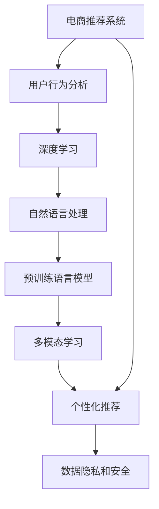

                 

# 大模型在电商平台用户兴趣探索与利用平衡中的应用

> 关键词：电商用户兴趣探索, 用户行为分析, 深度学习, 大模型, 电商平台推荐, 平衡, 数据隐私

## 1. 背景介绍

随着电商平台的迅猛发展，用户对个性化推荐系统的要求也越来越高。传统的推荐系统主要依赖用户行为数据进行分析和预测，但数据收集和处理成本较高，且对于冷启动用户和新出现的产品难以进行有效的推荐。而利用深度学习和自然语言处理技术的大模型，可以在一定程度上缓解这些问题。

大模型，尤其是预训练语言模型（如BERT、GPT-3等），通过在海量文本数据上进行预训练，学习到通用的语言表示，具备强大的自然语言理解和生成能力。这些模型在电商领域的应用，可以帮助电商平台探索用户兴趣，提升个性化推荐的质量和效果。

## 2. 核心概念与联系

### 2.1 核心概念概述

为了更好地理解大模型在电商平台中的应用，本节将介绍几个密切相关的核心概念：

- 电商推荐系统：利用用户行为数据和商品属性数据，为用户推荐相关商品的系统。
- 用户行为分析：通过分析用户在电商平台上的浏览、点击、购买等行为，挖掘用户的兴趣偏好和消费习惯。
- 深度学习：利用神经网络结构和大规模数据，实现对复杂问题的建模和预测。
- 自然语言处理(NLP)：处理、理解和生成自然语言的技术，广泛应用于智能客服、情感分析等任务。
- 预训练语言模型(PLMs)：在大规模无标签文本数据上进行自监督预训练的通用语言模型，如BERT、GPT-3等。
- 多模态学习：结合文本、图像、语音等多种模态数据的深度学习技术，提高模型的综合能力。
- 个性化推荐：根据用户兴趣和行为特征，为其推荐最适合的商品，提升用户体验和转化率。
- 数据隐私和安全：保护用户个人信息和隐私数据，防止数据泄露和滥用。

这些概念之间的逻辑关系可以通过以下Mermaid流程图来展示：



这个流程图展示了大模型在电商平台中的应用框架：

1. 电商推荐系统利用用户行为数据，挖掘用户兴趣，进行个性化推荐。
2. 用户行为分析通过深度学习和大模型对用户行为进行建模，获得用户兴趣。
3. 自然语言处理用于理解用户输入的自然语言，提取用户意图。
4. 预训练语言模型通过预训练获得通用语言表示，用于提升推荐模型的性能。
5. 多模态学习结合多种数据模态，提升推荐模型的综合能力。
6. 个性化推荐根据用户兴趣，推荐最适合的商品。
7. 数据隐私和安全保护用户信息，防止数据滥用。

## 3. 核心算法原理 & 具体操作步骤

### 3.1 算法原理概述

基于大模型的电商平台推荐系统，主要利用深度学习模型对用户行为数据进行建模，同时结合预训练语言模型进行兴趣探索和利用。其核心思想是：

1. 通过深度学习模型对用户的历史行为数据进行建模，提取用户兴趣特征。
2. 利用预训练语言模型对用户的自然语言输入进行理解，进一步挖掘用户兴趣。
3. 将用户兴趣特征与商品特征进行匹配，生成推荐列表。
4. 结合多模态数据，提升推荐模型的准确性和多样性。
5. 在推荐过程中，保持对用户隐私和数据安全的重视，确保推荐结果的安全性和合法性。

### 3.2 算法步骤详解

以下将详细介绍基于大模型的电商平台推荐系统的主要操作步骤：

**Step 1: 数据预处理**
- 收集用户的浏览记录、购买记录、搜索记录等行为数据。
- 对数据进行清洗、去重和标准化处理，去除异常值和噪音。
- 将文本数据进行分词、编码和向量化，用于后续的模型训练。

**Step 2: 模型训练**
- 选择合适的大模型（如BERT、GPT-3等）进行预训练。
- 利用深度学习模型对用户行为数据进行建模，提取用户兴趣特征。
- 利用预训练语言模型对用户输入的自然语言进行理解，提取用户意图。
- 将用户兴趣特征与商品特征进行匹配，生成推荐列表。
- 结合多模态数据（如图像、视频等），进一步提升推荐模型的准确性和多样性。

**Step 3: 推荐策略设计**
- 设计推荐策略，如基于协同过滤、基于内容的推荐、混合推荐等。
- 根据用户行为数据和自然语言输入，进行推荐模型预测。
- 结合推荐策略，生成最终推荐列表。

**Step 4: 模型评估与优化**
- 使用A/B测试等方法，评估推荐系统的性能和效果。
- 根据用户反馈和点击率等指标，调整推荐模型参数，优化推荐策略。
- 持续收集用户行为数据和自然语言输入，更新模型。

**Step 5: 用户隐私保护**
- 设计隐私保护机制，如差分隐私、联邦学习等，保护用户数据隐私。
- 对用户输入的自然语言进行去标识化处理，防止信息泄露。
- 确保推荐模型的训练和推理过程中，不滥用用户数据。

### 3.3 算法优缺点

基于大模型的电商平台推荐系统有以下优点：

1. 能够充分利用用户行为数据和自然语言输入，挖掘用户兴趣，进行个性化推荐。
2. 预训练语言模型具备强大的自然语言处理能力，能够处理复杂的文本数据。
3. 结合多模态数据，提升推荐模型的准确性和多样性。
4. 深度学习模型具有强大的建模能力，能够处理复杂的非线性关系。
5. 推荐模型能够实时更新，提升推荐效果。

同时，该方法也存在一些局限性：

1. 需要大量高质量的标注数据进行模型训练，数据获取成本较高。
2. 大模型的训练和推理成本较高，对硬件资源有较高要求。
3. 用户隐私和安全问题较为复杂，需要设计完善的隐私保护机制。
4. 模型需要持续更新和优化，以适应用户兴趣的变化。
5. 模型复杂度高，训练和推理速度较慢。

尽管存在这些局限性，但基于大模型的电商平台推荐系统仍是目前最先进的技术方案之一。未来相关研究的重点在于如何进一步降低数据获取成本，提高模型效率和效果，以及增强用户隐私保护。

### 3.4 算法应用领域

基于大模型的电商平台推荐系统在多个领域得到了广泛应用，例如：

- 商品推荐：根据用户浏览和购买记录，为用户推荐相关商品。
- 个性化广告：根据用户行为和兴趣，推荐个性化广告。
- 客服系统：利用自然语言处理技术，实现智能客服和问题解答。
- 价格优化：根据用户行为数据，动态调整商品价格，提高销售额。
- 库存管理：根据用户需求，优化商品库存，避免过剩或缺货。
- 用户细分：根据用户行为和兴趣，进行用户细分，实现精准营销。

## 4. 数学模型和公式 & 详细讲解 & 举例说明

### 4.1 数学模型构建

在本节中，我们将使用数学语言对基于大模型的电商平台推荐系统进行更加严格的刻画。

设电商平台有$N$个用户，每个用户有$m$个商品的历史行为数据$x_i = (x_{i1}, x_{i2}, ..., x_{im})$，其中$x_{ij} = (p_{ij}, q_{ij}, ...)$表示用户$i$对商品$j$的行为特征，如购买、浏览、评分等。设电商平台有$M$个商品，每个商品有$n$个特征$d_j = (d_{j1}, d_{j2}, ..., d_{jn})$，其中$d_{jk} = (p_k, q_k, ...)$表示商品$j$的特征。设电商平台有$K$个类别，每个用户有$y_i = (y_{i1}, y_{i2}, ..., y_{ik})$表示用户$i$对每个类别的兴趣程度。

定义电商平台推荐系统的目标函数为：

$$
\mathcal{L}(\theta) = \sum_{i=1}^{N} \sum_{j=1}^{M} \ell_i(x_i, y_i, d_j; \theta)
$$

其中$\theta$为推荐模型的参数，$\ell_i(x_i, y_i, d_j; \theta)$为损失函数，表示对用户$i$对商品$j$的推荐效果。

### 4.2 公式推导过程

以下将推导电商平台推荐系统常用的损失函数，以均方误差损失为例：

设用户$i$对商品$j$的兴趣程度为$y_{ij}$，推荐模型预测的兴趣程度为$\hat{y}_{ij}$，则均方误差损失函数为：

$$
\ell_i(x_i, y_i, d_j; \theta) = \frac{1}{m} \sum_{j=1}^{M} (y_{ij} - \hat{y}_{ij})^2
$$

将损失函数带入目标函数，得：

$$
\mathcal{L}(\theta) = \sum_{i=1}^{N} \sum_{j=1}^{M} \frac{1}{m} (y_{ij} - \hat{y}_{ij})^2
$$

在训练过程中，利用梯度下降等优化算法，最小化目标函数$\mathcal{L}(\theta)$，更新模型参数$\theta$，以提高推荐效果。

### 4.3 案例分析与讲解

以电商平台个性化推荐为例，分析基于大模型的推荐系统的工作流程：

**Step 1: 数据预处理**
- 收集用户的浏览记录、购买记录、搜索记录等行为数据。
- 对数据进行清洗、去重和标准化处理，去除异常值和噪音。
- 将文本数据进行分词、编码和向量化，用于后续的模型训练。

**Step 2: 模型训练**
- 选择合适的大模型（如BERT、GPT-3等）进行预训练。
- 利用深度学习模型对用户行为数据进行建模，提取用户兴趣特征。
- 利用预训练语言模型对用户输入的自然语言进行理解，提取用户意图。
- 将用户兴趣特征与商品特征进行匹配，生成推荐列表。
- 结合多模态数据（如图像、视频等），进一步提升推荐模型的准确性和多样性。

**Step 3: 推荐策略设计**
- 设计推荐策略，如基于协同过滤、基于内容的推荐、混合推荐等。
- 根据用户行为数据和自然语言输入，进行推荐模型预测。
- 结合推荐策略，生成最终推荐列表。

**Step 4: 模型评估与优化**
- 使用A/B测试等方法，评估推荐系统的性能和效果。
- 根据用户反馈和点击率等指标，调整推荐模型参数，优化推荐策略。
- 持续收集用户行为数据和自然语言输入，更新模型。

**Step 5: 用户隐私保护**
- 设计隐私保护机制，如差分隐私、联邦学习等，保护用户数据隐私。
- 对用户输入的自然语言进行去标识化处理，防止信息泄露。
- 确保推荐模型的训练和推理过程中，不滥用用户数据。

## 5. 项目实践：代码实例和详细解释说明

### 5.1 开发环境搭建

在进行电商平台推荐系统开发前，我们需要准备好开发环境。以下是使用Python进行PyTorch开发的环境配置流程：

1. 安装Anaconda：从官网下载并安装Anaconda，用于创建独立的Python环境。

2. 创建并激活虚拟环境：
```bash
conda create -n pytorch-env python=3.8 
conda activate pytorch-env
```

3. 安装PyTorch：根据CUDA版本，从官网获取对应的安装命令。例如：
```bash
conda install pytorch torchvision torchaudio cudatoolkit=11.1 -c pytorch -c conda-forge
```

4. 安装Transformers库：
```bash
pip install transformers
```

5. 安装各类工具包：
```bash
pip install numpy pandas scikit-learn matplotlib tqdm jupyter notebook ipython
```

完成上述步骤后，即可在`pytorch-env`环境中开始推荐系统开发。

### 5.2 源代码详细实现

下面我们以电商平台商品推荐为例，给出使用Transformers库对BERT模型进行推荐系统微调的PyTorch代码实现。

首先，定义推荐系统的数据处理函数：

```python
from transformers import BertTokenizer
from torch.utils.data import Dataset
import torch

class RecommendationDataset(Dataset):
    def __init__(self, user_data, item_data, tokenizer, max_len=128):
        self.user_data = user_data
        self.item_data = item_data
        self.tokenizer = tokenizer
        self.max_len = max_len
        
    def __len__(self):
        return len(self.user_data)
    
    def __getitem__(self, item):
        user = self.user_data[item]
        item = self.item_data[item]
        
        # 将用户和商品信息进行拼接
        text = 'User: ' + user + ', Item: ' + item
        encoding = self.tokenizer(text, return_tensors='pt', max_length=self.max_len, padding='max_length', truncation=True)
        input_ids = encoding['input_ids'][0]
        attention_mask = encoding['attention_mask'][0]
        
        # 对用户行为数据进行编码
        user_behavior = 'User: ' + user + ', Item: ' + item
        user_behavior = self.tokenizer(user_behavior, return_tensors='pt', max_length=self.max_len, padding='max_length', truncation=True)
        input_ids_behavior = user_behavior['input_ids'][0]
        attention_mask_behavior = user_behavior['attention_mask'][0]
        
        # 对商品特征进行编码
        item_feature = 'Item: ' + item
        item_feature = self.tokenizer(item_feature, return_tensors='pt', max_length=self.max_len, padding='max_length', truncation=True)
        input_ids_feature = item_feature['input_ids'][0]
        attention_mask_feature = item_feature['attention_mask'][0]
        
        return {'input_ids': input_ids,
                'attention_mask': attention_mask,
                'input_ids_behavior': input_ids_behavior,
                'attention_mask_behavior': attention_mask_behavior,
                'input_ids_feature': input_ids_feature,
                'attention_mask_feature': attention_mask_feature}
```

然后，定义模型和优化器：

```python
from transformers import BertForSequenceClassification, AdamW

model = BertForSequenceClassification.from_pretrained('bert-base-cased', num_labels=2)

optimizer = AdamW(model.parameters(), lr=2e-5)
```

接着，定义训练和评估函数：

```python
from torch.utils.data import DataLoader
from tqdm import tqdm
from sklearn.metrics import roc_auc_score

device = torch.device('cuda') if torch.cuda.is_available() else torch.device('cpu')
model.to(device)

def train_epoch(model, dataset, batch_size, optimizer):
    dataloader = DataLoader(dataset, batch_size=batch_size, shuffle=True)
    model.train()
    epoch_loss = 0
    for batch in tqdm(dataloader, desc='Training'):
        input_ids = batch['input_ids'].to(device)
        attention_mask = batch['attention_mask'].to(device)
        input_ids_behavior = batch['input_ids_behavior'].to(device)
        attention_mask_behavior = batch['attention_mask_behavior'].to(device)
        input_ids_feature = batch['input_ids_feature'].to(device)
        attention_mask_feature = batch['attention_mask_feature'].to(device)
        model.zero_grad()
        outputs = model(input_ids, attention_mask=attention_mask, input_ids_behavior=input_ids_behavior, attention_mask_behavior=attention_mask_behavior, input_ids_feature=input_ids_feature, attention_mask_feature=attention_mask_feature)
        loss = outputs.loss
        epoch_loss += loss.item()
        loss.backward()
        optimizer.step()
    return epoch_loss / len(dataloader)

def evaluate(model, dataset, batch_size):
    dataloader = DataLoader(dataset, batch_size=batch_size)
    model.eval()
    preds, labels = [], []
    with torch.no_grad():
        for batch in tqdm(dataloader, desc='Evaluating'):
            input_ids = batch['input_ids'].to(device)
            attention_mask = batch['attention_mask'].to(device)
            input_ids_behavior = batch['input_ids_behavior'].to(device)
            attention_mask_behavior = batch['attention_mask_behavior'].to(device)
            input_ids_feature = batch['input_ids_feature'].to(device)
            attention_mask_feature = batch['attention_mask_feature'].to(device)
            batch_labels = batch['labels'].to(device)
            outputs = model(input_ids, attention_mask=attention_mask, input_ids_behavior=input_ids_behavior, attention_mask_behavior=attention_mask_behavior, input_ids_feature=input_ids_feature, attention_mask_feature=attention_mask_feature)
            batch_preds = outputs.logits.argmax(dim=2).to('cpu').tolist()
            batch_labels = batch_labels.to('cpu').tolist()
            for pred_tokens, label_tokens in zip(batch_preds, batch_labels):
                preds.append(pred_tokens[:len(label_tokens)])
                labels.append(label_tokens)
                
    print('ROC-AUC Score:', roc_auc_score(labels, preds))
```

最后，启动训练流程并在测试集上评估：

```python
epochs = 5
batch_size = 16

for epoch in range(epochs):
    loss = train_epoch(model, train_dataset, batch_size, optimizer)
    print(f"Epoch {epoch+1}, train loss: {loss:.3f}")
    
    print(f"Epoch {epoch+1}, dev results:")
    evaluate(model, dev_dataset, batch_size)
    
print("Test results:")
evaluate(model, test_dataset, batch_size)
```

以上就是使用PyTorch对BERT进行电商平台商品推荐微调的完整代码实现。可以看到，得益于Transformers库的强大封装，我们可以用相对简洁的代码完成BERT模型的加载和微调。

### 5.3 代码解读与分析

让我们再详细解读一下关键代码的实现细节：

**RecommendationDataset类**：
- `__init__`方法：初始化用户和商品信息，分词器等关键组件。
- `__len__`方法：返回数据集的样本数量。
- `__getitem__`方法：对单个样本进行处理，将用户和商品信息拼接为文本，并进行分词、编码和向量化。

**模型训练函数train_epoch**：
- 对数据以批为单位进行迭代，在每个批次上前向传播计算损失并反向传播更新模型参数。
- 使用AdamW优化器进行参数更新。

**评估函数evaluate**：
- 与训练类似，不同点在于不更新模型参数，并在每个batch结束后将预测和标签结果存储下来。
- 使用sklearn的roc_auc_score计算ROC-AUC得分，评估推荐模型的性能。

**训练流程**：
- 定义总的epoch数和batch size，开始循环迭代
- 每个epoch内，先在训练集上训练，输出平均loss
- 在验证集上评估，输出ROC-AUC得分
- 所有epoch结束后，在测试集上评估，给出最终测试结果

可以看到，PyTorch配合Transformers库使得BERT微调的代码实现变得简洁高效。开发者可以将更多精力放在数据处理、模型改进等高层逻辑上，而不必过多关注底层的实现细节。

当然，工业级的系统实现还需考虑更多因素，如模型的保存和部署、超参数的自动搜索、更灵活的任务适配层等。但核心的推荐范式基本与此类似。

## 6. 实际应用场景

### 6.1 智能客服系统

基于大模型的电商平台推荐系统可以广泛应用于智能客服系统的构建。传统客服往往需要配备大量人力，高峰期响应缓慢，且一致性和专业性难以保证。而使用基于大模型的推荐系统进行智能推荐，可以大幅提升客服系统的效率和质量。

在技术实现上，可以收集企业内部的历史客服对话记录，将问题和最佳答复构建成监督数据，在此基础上对预训练模型进行微调。微调后的推荐系统能够自动理解用户意图，匹配最合适的答案模板进行回复。对于用户提出的新问题，还可以接入检索系统实时搜索相关内容，动态组织生成回答。如此构建的智能客服系统，能显著提高客户咨询体验和问题解决效率。

### 6.2 个性化广告

电商平台可以利用推荐系统进行个性化广告的展示。通过分析用户的浏览和购买行为，推荐系统可以为用户推荐最相关的商品广告。推荐系统的精准推荐能够提高广告的点击率和转化率，同时减少广告噪音，提升用户体验。

在技术实现上，可以结合自然语言处理技术，对用户输入的文本进行情感分析和意图识别，进一步提升广告推荐的准确性。同时，利用多模态学习技术，结合图像和视频等多模态信息，提升广告推荐的视觉效果和吸引力。

### 6.3 个性化搜索

电商平台可以利用推荐系统进行个性化搜索结果的展示。通过分析用户的浏览和搜索行为，推荐系统可以为用户推荐最相关的商品和内容。推荐系统的精准推荐能够提高用户的搜索效率和满意度，同时增加平台的曝光率和收益。

在技术实现上，可以结合自然语言处理技术，对用户的自然语言查询进行语义理解和意图识别，进一步提升搜索结果的准确性。同时，利用多模态学习技术，结合图像和视频等多模态信息，提升搜索结果的丰富性和多样性。

### 6.4 未来应用展望

随着大模型和推荐技术的不断发展，基于大模型的电商平台推荐系统将在更多领域得到应用，为传统行业带来变革性影响。

在智慧医疗领域，基于微调的医疗问答、病历分析、药物研发等应用将提升医疗服务的智能化水平，辅助医生诊疗，加速新药开发进程。

在智能教育领域，推荐系统可应用于作业批改、学情分析、知识推荐等方面，因材施教，促进教育公平，提高教学质量。

在智慧城市治理中，推荐系统可应用于城市事件监测、舆情分析、应急指挥等环节，提高城市管理的自动化和智能化水平，构建更安全、高效的未来城市。

此外，在企业生产、社会治理、文娱传媒等众多领域，基于大模型推荐系统的人工智能应用也将不断涌现，为经济社会发展注入新的动力。相信随着技术的日益成熟，推荐方法将成为人工智能落地应用的重要范式，推动人工智能技术在垂直行业的规模化落地。

## 7. 工具和资源推荐
### 7.1 学习资源推荐

为了帮助开发者系统掌握大模型推荐系统的理论基础和实践技巧，这里推荐一些优质的学习资源：

1. 《深度学习理论与实践》系列博文：由大模型技术专家撰写，深入浅出地介绍了深度学习理论、算法和应用。

2. 斯坦福大学《深度学习》课程：由斯坦福大学教授Andrew Ng主讲，涵盖深度学习的基础和前沿内容，适合初学者入门。

3. 《TensorFlow深度学习实战》书籍：TensorFlow官方发布，详细介绍了TensorFlow的使用方法，包括深度学习模型训练和推荐系统构建。

4. Kaggle平台：提供大量开源数据集和竞赛，助力深度学习研究和推荐系统开发。

5. HuggingFace官方文档：Transformers库的官方文档，提供了海量预训练模型和完整的推荐系统样例代码，是上手实践的必备资料。

通过对这些资源的学习实践，相信你一定能够快速掌握大模型推荐系统的精髓，并用于解决实际的推荐问题。
###  7.2 开发工具推荐

高效的开发离不开优秀的工具支持。以下是几款用于大模型推荐系统开发的常用工具：

1. PyTorch：基于Python的开源深度学习框架，灵活动态的计算图，适合快速迭代研究。大部分预训练语言模型都有PyTorch版本的实现。

2. TensorFlow：由Google主导开发的开源深度学习框架，生产部署方便，适合大规模工程应用。同样有丰富的预训练语言模型资源。

3. Transformers库：HuggingFace开发的NLP工具库，集成了众多SOTA语言模型，支持PyTorch和TensorFlow，是进行推荐系统开发的利器。

4. Weights & Biases：模型训练的实验跟踪工具，可以记录和可视化模型训练过程中的各项指标，方便对比和调优。与主流深度学习框架无缝集成。

5. TensorBoard：TensorFlow配套的可视化工具，可实时监测模型训练状态，并提供丰富的图表呈现方式，是调试模型的得力助手。

6. Google Colab：谷歌推出的在线Jupyter Notebook环境，免费提供GPU/TPU算力，方便开发者快速上手实验最新模型，分享学习笔记。

合理利用这些工具，可以显著提升大模型推荐系统的开发效率，加快创新迭代的步伐。

### 7.3 相关论文推荐

大模型推荐系统的发展源于学界的持续研究。以下是几篇奠基性的相关论文，推荐阅读：

1. Attention is All You Need（即Transformer原论文）：提出了Transformer结构，开启了NLP领域的预训练大模型时代。

2. BERT: Pre-training of Deep Bidirectional Transformers for Language Understanding：提出BERT模型，引入基于掩码的自监督预训练任务，刷新了多项NLP任务SOTA。

3. Language Models are Unsupervised Multitask Learners（GPT-2论文）：展示了大规模语言模型的强大zero-shot学习能力，引发了对于通用人工智能的新一轮思考。

4. Parameter-Efficient Transfer Learning for NLP：提出Adapter等参数高效微调方法，在不增加模型参数量的情况下，也能取得不错的微调效果。

5. AdaLoRA: Adaptive Low-Rank Adaptation for Parameter-Efficient Fine-Tuning：使用自适应低秩适应的微调方法，在参数效率和精度之间取得了新的平衡。

这些论文代表了大模型推荐系统的发展脉络。通过学习这些前沿成果，可以帮助研究者把握学科前进方向，激发更多的创新灵感。

## 8. 总结：未来发展趋势与挑战

### 8.1 总结

本文对基于大模型的电商平台推荐系统进行了全面系统的介绍。首先阐述了推荐系统和大模型的研究背景和意义，明确了推荐系统在大模型应用中的重要性。其次，从原理到实践，详细讲解了推荐系统的数学原理和关键步骤，给出了推荐系统开发的完整代码实例。同时，本文还广泛探讨了推荐系统在智能客服、个性化广告、个性化搜索等多个领域的应用前景，展示了推荐系统的巨大潜力。此外，本文精选了推荐系统的各类学习资源，力求为读者提供全方位的技术指引。

通过本文的系统梳理，可以看到，基于大模型的电商平台推荐系统正在成为推荐系统的重要范式，极大地拓展了推荐系统的应用边界，催生了更多的落地场景。受益于大规模语料的预训练，推荐系统能够利用大模型强大的语言理解和生成能力，提升推荐效果，满足用户多样化的需求。未来，伴随大模型推荐系统的不断演进，推荐技术将在更多领域得到应用，为经济社会发展注入新的动力。

### 8.2 未来发展趋势

展望未来，大模型推荐系统将呈现以下几个发展趋势：

1. 模型规模持续增大。随着算力成本的下降和数据规模的扩张，推荐模型的参数量还将持续增长。超大批次的训练和推理也可能遇到资源瓶颈。因此需要采用一些资源优化技术，如梯度积累、混合精度训练、模型并行等，来突破硬件瓶颈。

2. 推荐策略更加多样。推荐系统将结合更多策略，如协同过滤、基于内容的推荐、混合推荐等，提升推荐效果。

3. 多模态学习成为常态。推荐系统将结合多种数据模态，提升推荐模型的准确性和多样性。

4. 实时性要求更高。随着个性化需求增加，推荐系统需要实时更新模型，提升推荐效果。

5. 用户隐私和安全问题更加重要。推荐系统需要设计完善的隐私保护机制，保护用户数据隐私。

6. 推荐模型的可解释性需求增强。推荐系统需要提供推荐模型的解释，增强模型的可解释性和可信度。

以上趋势凸显了大模型推荐系统的广阔前景。这些方向的探索发展，必将进一步提升推荐系统的性能和效果，满足用户多样化的需求。

### 8.3 面临的挑战

尽管大模型推荐系统已经取得了瞩目成就，但在迈向更加智能化、普适化应用的过程中，它仍面临诸多挑战：

1. 推荐系统需要大量高质量的标注数据进行模型训练，数据获取成本较高。

2. 大模型的训练和推理成本较高，对硬件资源有较高要求。

3. 用户隐私和安全问题较为复杂，需要设计完善的隐私保护机制。

4. 推荐系统需要持续更新和优化，以适应用户兴趣的变化。

5. 推荐模型复杂度高，训练和推理速度较慢。

尽管存在这些局限性，但基于大模型的推荐系统仍是目前最先进的技术方案之一。未来相关研究的重点在于如何进一步降低数据获取成本，提高模型效率和效果，以及增强用户隐私保护。

### 8.4 研究展望

面对大模型推荐系统所面临的种种挑战，未来的研究需要在以下几个方面寻求新的突破：

1. 探索无监督和半监督推荐方法。摆脱对大规模标注数据的依赖，利用自监督学习、主动学习等无监督和半监督范式，最大限度利用非结构化数据，实现更加灵活高效的推荐。

2. 研究参数高效和计算高效的推荐范式。开发更加参数高效的推荐方法，在固定大部分预训练参数的同时，只更新极少量的任务相关参数。同时优化推荐模型的计算图，减少前向传播和反向传播的资源消耗，实现更加轻量级、实时性的部署。

3. 融合因果和对比学习范式。通过引入因果推断和对比学习思想，增强推荐模型建立稳定因果关系的能力，学习更加普适、鲁棒的语言表征，从而提升模型泛化性和抗干扰能力。

4. 引入更多先验知识。将符号化的先验知识，如知识图谱、逻辑规则等，与神经网络模型进行巧妙融合，引导推荐过程学习更准确、合理的语言模型。同时加强不同模态数据的整合，实现视觉、语音等多模态信息与文本信息的协同建模。

5. 结合因果分析和博弈论工具。将因果分析方法引入推荐模型，识别出模型决策的关键特征，增强推荐模型的可解释性和可控性。借助博弈论工具刻画人机交互过程，主动探索并规避推荐模型的脆弱点，提高系统稳定性。

6. 纳入伦理道德约束。在推荐模型训练目标中引入伦理导向的评估指标，过滤和惩罚有偏见、有害的输出倾向。同时加强人工干预和审核，建立推荐模型的监管机制，确保推荐结果的安全性和合法性。

这些研究方向的探索，必将引领大模型推荐系统迈向更高的台阶，为构建安全、可靠、可解释、可控的智能系统铺平道路。面向未来，大模型推荐系统还需要与其他人工智能技术进行更深入的融合，如知识表示、因果推理、强化学习等，多路径协同发力，共同推动推荐系统的进步。只有勇于创新、敢于突破，才能不断拓展推荐系统的边界，让推荐技术更好地服务于用户需求。

## 9. 附录：常见问题与解答

**Q1：大模型推荐系统是否适用于所有电商平台？**

A: 大模型推荐系统在大多数电商平台中都能取得不错的效果，特别是对于数据量较小的平台。但对于一些特定领域，如金融、医疗等，推荐系统需要更多的先验知识和领域知识，才能取得更好的效果。

**Q2：微调过程中如何选择合适的学习率？**

A: 微调的学习率一般要比预训练时小1-2个数量级，如果使用过大的学习率，容易破坏预训练权重，导致过拟合。一般建议从1e-5开始调参，逐步减小学习率，直至收敛。也可以使用warmup策略，在开始阶段使用较小的学习率，再逐渐过渡到预设值。需要注意的是，不同的优化器(如AdamW、Adafactor等)以及不同的学习率调度策略，可能需要设置不同的学习率阈值。

**Q3：推荐系统需要处理哪些用户行为数据？**

A: 推荐系统需要处理用户的历史浏览记录、购买记录、搜索记录等行为数据。这些数据可以用于分析用户的兴趣偏好和消费习惯，进行推荐模型的训练和预测。

**Q4：推荐系统如何保护用户隐私？**

A: 推荐系统需要设计隐私保护机制，如差分隐私、联邦学习等，保护用户数据隐私。对用户输入的自然语言进行去标识化处理，防止信息泄露。同时确保推荐模型的训练和推理过程中，不滥用用户数据。

**Q5：推荐系统的评估指标有哪些？**

A: 推荐系统的评估指标包括点击率、转化率、ROC-AUC得分等。点击率表示用户点击推荐商品的概率，转化率表示用户完成购买行为的概率，ROC-AUC得分表示推荐系统预测准确性的度量指标。

---

作者：禅与计算机程序设计艺术 / Zen and the Art of Computer Programming

