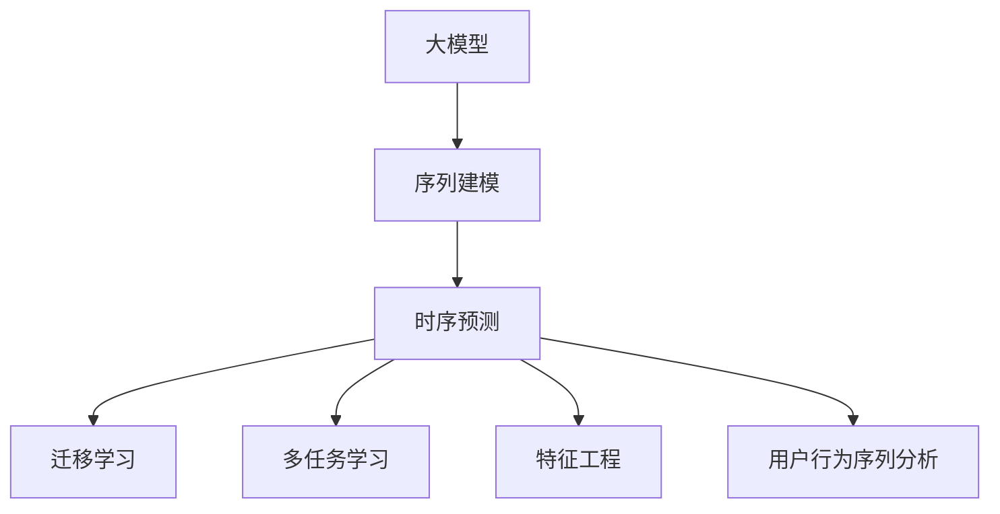

                 

# 大模型在电商平台用户行为序列分析中的应用

## 1. 背景介绍

### 1.1 问题由来
在电商平台，通过收集和分析用户行为数据，有助于挖掘用户偏好、行为模式和潜在需求，为个性化推荐、营销策略优化、用户流失预测等提供数据支撑。传统的用户行为分析方法依赖于手工特征提取，无法捕捉行为序列的时序依赖关系，并且对数据量和特征工程的要求较高。随着深度学习和大模型技术的发展，越来越多的电商平台开始采用基于大模型的用户行为分析技术，以期通过自动化的方式，提升用户行为分析的精度和效率。

近年来，大模型在自然语言处理(NLP)、计算机视觉等领域取得了显著成效。这些大模型通过在大量数据上进行预训练，能够自动学习到丰富的知识表示，并将其迁移到下游任务中进行微调，从而在各种任务上取得优异的性能。电商平台用户行为序列分析作为典型的序列预测任务，同样可以利用大模型进行分析和建模。

### 1.2 问题核心关键点
电商平台用户行为序列分析的核心目标在于从用户行为序列中预测用户的下一行为，如购买、浏览、搜索、点击等。常见的方法包括时序建模、深度学习等，其中基于Transformer架构的模型，如BERT、GPT-2、XLNet等，在处理序列数据时表现优异。大模型的应用主要包括以下几个方面：

- **序列建模**：大模型能够自动学习行为序列中的时序依赖关系，提升模型预测的准确性。
- **特征学习**：大模型可以从大量数据中学习到丰富的特征表示，降低特征工程的工作量。
- **迁移学习**：利用大模型在不同任务上的迁移学习能力，提升模型在新任务上的性能。
- **多任务学习**：通过在多个任务上共同训练，共享模型的知识表示，提升模型在不同任务上的泛化能力。

## 2. 核心概念与联系

### 2.1 核心概念概述

为更好地理解大模型在电商平台用户行为序列分析中的应用，本节将介绍几个密切相关的核心概念：

- **大模型(Large Model)**：指使用Transformer架构、BERT、GPT-2等深度学习模型进行预训练，参数规模通常在亿级别以上的模型。通过在大量数据上进行预训练，大模型可以学习到丰富的语言知识，并应用于各种自然语言处理任务。

- **序列建模(Sequence Modeling)**：指从序列数据中学习到时序依赖关系，进行序列预测或分类等任务。常见的方法包括RNN、LSTM、GRU、Transformer等。

- **时序预测(Time-Series Prediction)**：指从历史行为序列中预测下一个行为的概率分布。常见的方法包括ARIMA、LSTM、Transformer等。

- **迁移学习(Transfer Learning)**：指在大模型预训练的基础上，通过微调获得对特定任务的适应性。

- **多任务学习(Multi-task Learning)**：指在多个任务上共同训练模型，共享模型的知识表示，提升模型在多个任务上的泛化能力。

- **特征工程(Feature Engineering)**：指从原始数据中提取有用特征，以提高模型的预测性能。传统方法依赖于手工特征提取，而大模型能够自动学习到特征表示，降低特征工程的复杂度。

- **用户行为序列分析(User Behavior Sequence Analysis)**：指对用户行为序列进行建模和预测，帮助电商平台理解和预测用户行为，提升用户体验和平台收益。

这些核心概念之间的逻辑关系可以通过以下Mermaid流程图来展示：



这个流程图展示了大模型在电商平台用户行为序列分析中的应用框架：

1. 大模型通过预训练获得序列建模的能力。
2. 时序预测任务将历史行为序列作为输入，通过大模型预测下一行为。
3. 迁移学习帮助模型适应特定电商平台的业务场景。
4. 多任务学习提升模型在不同任务上的泛化能力。
5. 特征工程通过学习模型的自动表示能力，降低手工特征提取的工作量。
6. 用户行为序列分析作为大模型的下游任务，提供应用场景。

## 3. 核心算法原理 & 具体操作步骤
### 3.1 算法原理概述

基于大模型的电商平台用户行为序列分析，本质上是一个时序预测任务。其核心思想是：利用大模型在海量用户行为序列数据上进行的预训练，学习到时序依赖关系和特征表示，通过微调获得对特定电商平台的适应性，进而实现对用户行为的精准预测。

形式化地，假设预训练大模型为 $M_{\theta}$，其中 $\theta$ 为预训练得到的模型参数。给定电商平台用户行为序列数据集 $D=\{(x_i, y_i)\}_{i=1}^N$，行为序列 $x_i$ 包含多个历史行为，真实标签 $y_i$ 表示用户下一个行为的概率分布。微调的目标是找到新的模型参数 $\hat{\theta}$，使得：

$$
\hat{\theta}=\mathop{\arg\min}_{\theta} \mathcal{L}(M_{\theta},D)
$$

其中 $\mathcal{L}$ 为针对时序预测任务设计的损失函数，用于衡量模型预测输出与真实标签之间的差异。常见的损失函数包括交叉熵损失、均方误差损失等。

通过梯度下降等优化算法，微调过程不断更新模型参数 $\theta$，最小化损失函数 $\mathcal{L}$，使得模型输出逼近真实标签。由于 $\theta$ 已经通过预训练获得了较好的初始化，因此即便在用户行为序列数据量较小的情况下，也能较快收敛到理想的模型参数 $\hat{\theta}$。

### 3.2 算法步骤详解

基于大模型的电商平台用户行为序列分析一般包括以下几个关键步骤：

**Step 1: 准备预训练模型和数据集**
- 选择合适的预训练语言模型 $M_{\theta}$ 作为初始化参数，如 BERT、GPT-2、XLNet等。
- 准备电商平台用户行为序列数据集 $D$，划分为训练集、验证集和测试集。一般要求行为序列与电商平台数据分布不要差异过大。

**Step 2: 添加任务适配层**
- 根据电商平台的特点，在预训练模型顶层设计合适的输出层和损失函数。
- 对于分类任务，通常在顶层添加线性分类器和交叉熵损失函数。
- 对于回归任务，通常使用均方误差损失函数。
- 对于序列预测任务，通常使用序列交叉熵损失函数。

**Step 3: 设置微调超参数**
- 选择合适的优化算法及其参数，如 AdamW、SGD 等，设置学习率、批大小、迭代轮数等。
- 设置正则化技术及强度，包括权重衰减、Dropout、Early Stopping 等。
- 确定冻结预训练参数的策略，如仅微调顶层，或全部参数都参与微调。

**Step 4: 执行梯度训练**
- 将训练集数据分批次输入模型，前向传播计算损失函数。
- 反向传播计算参数梯度，根据设定的优化算法和学习率更新模型参数。
- 周期性在验证集上评估模型性能，根据性能指标决定是否触发 Early Stopping。
- 重复上述步骤直到满足预设的迭代轮数或 Early Stopping 条件。

**Step 5: 测试和部署**
- 在测试集上评估微调后模型 $M_{\hat{\theta}}$ 的性能，对比微调前后的精度提升。
- 使用微调后的模型对新行为序列进行预测，集成到实际的应用系统中。
- 持续收集新的行为序列数据，定期重新微调模型，以适应数据分布的变化。

以上是基于大模型的电商平台用户行为序列分析的一般流程。在实际应用中，还需要针对具体电商平台的特点，对微调过程的各个环节进行优化设计，如改进训练目标函数，引入更多的正则化技术，搜索最优的超参数组合等，以进一步提升模型性能。

### 3.3 算法优缺点

基于大模型的电商平台用户行为序列分析方法具有以下优点：
1. 简单高效。只需准备少量标注数据，即可对预训练模型进行快速适配，获得较大的性能提升。
2. 通用适用。适用于各种电商平台用户行为序列分析任务，包括购买预测、浏览预测、点击预测等，设计简单的任务适配层即可实现微调。
3. 参数高效。利用参数高效微调技术，在固定大部分预训练权重不变的情况下，仍可取得不错的提升。
4. 效果显著。在学术界和工业界的诸多任务上，基于微调的方法已经刷新了最先进的性能指标。

同时，该方法也存在一定的局限性：
1. 依赖标注数据。微调的效果很大程度上取决于标注数据的质量和数量，获取高质量标注数据的成本较高。
2. 迁移能力有限。当目标任务与预训练数据的分布差异较大时，微调的性能提升有限。
3. 可解释性不足。微调模型的决策过程通常缺乏可解释性，难以对其推理逻辑进行分析和调试。
4. 负面效果传递。预训练模型的固有偏见、有害信息等，可能通过微调传递到下游任务，造成负面影响。

尽管存在这些局限性，但就目前而言，基于大模型的用户行为序列分析方法仍是目前最主流范式。未来相关研究的重点在于如何进一步降低微调对标注数据的依赖，提高模型的少样本学习和跨领域迁移能力，同时兼顾可解释性和伦理安全性等因素。

### 3.4 算法应用领域

基于大模型的用户行为序列分析方法，在电商平台的推荐系统、广告投放、用户留存预测等多个领域中得到了广泛的应用，为电商平台的业务运营和用户体验优化提供了数据驱动的决策依据：

- **推荐系统**：通过预测用户下一个购买行为，推荐系统能够更加精准地为用户推荐商品，提升用户满意度和平台收益。
- **广告投放**：通过预测用户点击行为，广告投放系统可以优化广告投放策略，提高广告的转化率和效果。
- **用户留存预测**：通过预测用户是否流失，电商平台可以提前采取措施，减少用户流失率，提升用户留存率。
- **交易欺诈检测**：通过预测用户是否存在欺诈行为，电商平台可以及时发现并阻止欺诈交易，保障平台安全。
- **产品销售预测**：通过预测产品的销售趋势，电商平台可以优化库存管理，提升供应链效率。

除了上述这些经典应用外，用户行为序列分析方法还被创新性地应用于更多场景中，如供应链管理、市场营销、客户服务等多个领域，为电商平台带来了新的业务机会和运营策略。随着大模型和用户行为序列分析技术的不断进步，相信电商平台的用户行为分析将进一步提升精准度和智能化水平，推动电商平台业务的可持续发展。

## 4. 数学模型和公式 & 详细讲解  
### 4.1 数学模型构建

本节将使用数学语言对基于大模型的电商平台用户行为序列分析过程进行更加严格的刻画。

记预训练大模型为 $M_{\theta}$，其中 $\theta$ 为预训练得到的模型参数。假设电商平台用户行为序列数据集为 $D=\{(x_i, y_i)\}_{i=1}^N$，行为序列 $x_i$ 包含多个历史行为，真实标签 $y_i$ 表示用户下一个行为的概率分布。

定义模型 $M_{\theta}$ 在行为序列 $x$ 上的损失函数为 $\ell(M_{\theta}(x),y)$，则在数据集 $D$ 上的经验风险为：

$$
\mathcal{L}(\theta) = \frac{1}{N} \sum_{i=1}^N \ell(M_{\theta}(x_i),y_i)
$$

其中 $\ell$ 为针对时序预测任务设计的损失函数，用于衡量模型预测输出与真实标签之间的差异。常见的损失函数包括交叉熵损失、均方误差损失等。

通过梯度下降等优化算法，微调过程不断更新模型参数 $\theta$，最小化损失函数 $\mathcal{L}$，使得模型输出逼近真实标签。由于 $\theta$ 已经通过预训练获得了较好的初始化，因此即便在用户行为序列数据量较小的情况下，也能较快收敛到理想的模型参数 $\hat{\theta}$。

### 4.2 公式推导过程

以下我们以电商平台购买预测任务为例，推导交叉熵损失函数及其梯度的计算公式。

假设模型 $M_{\theta}$ 在输入 $x$ 上的输出为 $\hat{y}=M_{\theta}(x) \in [0,1]$，表示用户购买某商品的预测概率。真实标签 $y \in \{0,1\}$。则二分类交叉熵损失函数定义为：

$$
\ell(M_{\theta}(x),y) = -[y\log \hat{y} + (1-y)\log (1-\hat{y})]
$$

将其代入经验风险公式，得：

$$
\mathcal{L}(\theta) = -\frac{1}{N}\sum_{i=1}^N [y_i\log M_{\theta}(x_i)+(1-y_i)\log(1-M_{\theta}(x_i))]
$$

根据链式法则，损失函数对参数 $\theta_k$ 的梯度为：

$$
\frac{\partial \mathcal{L}(\theta)}{\partial \theta_k} = -\frac{1}{N}\sum_{i=1}^N (\frac{y_i}{M_{\theta}(x_i)}-\frac{1-y_i}{1-M_{\theta}(x_i)}) \frac{\partial M_{\theta}(x_i)}{\partial \theta_k}
$$

其中 $\frac{\partial M_{\theta}(x_i)}{\partial \theta_k}$ 可进一步递归展开，利用自动微分技术完成计算。

在得到损失函数的梯度后，即可带入参数更新公式，完成模型的迭代优化。重复上述过程直至收敛，最终得到适应电商平台购买预测任务的最优模型参数 $\hat{\theta}$。

## 5. 项目实践：代码实例和详细解释说明
### 5.1 开发环境搭建

在进行用户行为序列分析实践前，我们需要准备好开发环境。以下是使用Python进行PyTorch开发的环境配置流程：

1. 安装Anaconda：从官网下载并安装Anaconda，用于创建独立的Python环境。

2. 创建并激活虚拟环境：
```bash
conda create -n pytorch-env python=3.8 
conda activate pytorch-env
```

3. 安装PyTorch：根据CUDA版本，从官网获取对应的安装命令。例如：
```bash
conda install pytorch torchvision torchaudio cudatoolkit=11.1 -c pytorch -c conda-forge
```

4. 安装HuggingFace库：
```bash
pip install transformers
```

5. 安装各类工具包：
```bash
pip install numpy pandas scikit-learn matplotlib tqdm jupyter notebook ipython
```

完成上述步骤后，即可在`pytorch-env`环境中开始用户行为序列分析实践。

### 5.2 源代码详细实现

下面我们以电商平台用户行为序列分析任务为例，给出使用Transformers库对XLNet模型进行微调的PyTorch代码实现。

首先，定义用户行为序列数据处理函数：

```python
from transformers import XLNetTokenizer, XLNetForSequenceClassification
from torch.utils.data import Dataset
import torch

class EcommerceDataset(Dataset):
    def __init__(self, sequences, labels, tokenizer, max_len=128):
        self.sequences = sequences
        self.labels = labels
        self.tokenizer = tokenizer
        self.max_len = max_len
        
    def __len__(self):
        return len(self.sequences)
    
    def __getitem__(self, item):
        sequence = self.sequences[item]
        label = self.labels[item]
        
        encoding = self.tokenizer(sequence, return_tensors='pt', max_length=self.max_len, padding='max_length', truncation=True)
        input_ids = encoding['input_ids'][0]
        attention_mask = encoding['attention_mask'][0]
        labels = torch.tensor(label, dtype=torch.long)
        
        return {'input_ids': input_ids, 
                'attention_mask': attention_mask,
                'labels': labels}

# 创建dataset
tokenizer = XLNetTokenizer.from_pretrained('xlnet-base-cased')

train_dataset = EcommerceDataset(train_sequences, train_labels, tokenizer)
dev_dataset = EcommerceDataset(dev_sequences, dev_labels, tokenizer)
test_dataset = EcommerceDataset(test_sequences, test_labels, tokenizer)
```

然后，定义模型和优化器：

```python
from transformers import AdamW

model = XLNetForSequenceClassification.from_pretrained('xlnet-base-cased', num_labels=2)

optimizer = AdamW(model.parameters(), lr=2e-5)
```

接着，定义训练和评估函数：

```python
from torch.utils.data import DataLoader
from tqdm import tqdm
from sklearn.metrics import classification_report

device = torch.device('cuda') if torch.cuda.is_available() else torch.device('cpu')
model.to(device)

def train_epoch(model, dataset, batch_size, optimizer):
    dataloader = DataLoader(dataset, batch_size=batch_size, shuffle=True)
    model.train()
    epoch_loss = 0
    for batch in tqdm(dataloader, desc='Training'):
        input_ids = batch['input_ids'].to(device)
        attention_mask = batch['attention_mask'].to(device)
        labels = batch['labels'].to(device)
        model.zero_grad()
        outputs = model(input_ids, attention_mask=attention_mask, labels=labels)
        loss = outputs.loss
        epoch_loss += loss.item()
        loss.backward()
        optimizer.step()
    return epoch_loss / len(dataloader)

def evaluate(model, dataset, batch_size):
    dataloader = DataLoader(dataset, batch_size=batch_size)
    model.eval()
    preds, labels = [], []
    with torch.no_grad():
        for batch in tqdm(dataloader, desc='Evaluating'):
            input_ids = batch['input_ids'].to(device)
            attention_mask = batch['attention_mask'].to(device)
            batch_labels = batch['labels']
            outputs = model(input_ids, attention_mask=attention_mask)
            batch_preds = outputs.logits.argmax(dim=2).to('cpu').tolist()
            batch_labels = batch_labels.to('cpu').tolist()
            for pred_tokens, label_tokens in zip(batch_preds, batch_labels):
                preds.append(pred_tokens[:len(label_tokens)])
                labels.append(label_tokens)
                
    print(classification_report(labels, preds))
```

最后，启动训练流程并在测试集上评估：

```python
epochs = 5
batch_size = 16

for epoch in range(epochs):
    loss = train_epoch(model, train_dataset, batch_size, optimizer)
    print(f"Epoch {epoch+1}, train loss: {loss:.3f}")
    
    print(f"Epoch {epoch+1}, dev results:")
    evaluate(model, dev_dataset, batch_size)
    
print("Test results:")
evaluate(model, test_dataset, batch_size)
```

以上就是使用PyTorch对XLNet进行电商平台用户行为序列分析任务微调的完整代码实现。可以看到，得益于Transformers库的强大封装，我们可以用相对简洁的代码完成XLNet模型的加载和微调。

### 5.3 代码解读与分析

让我们再详细解读一下关键代码的实现细节：

**EcommerceDataset类**：
- `__init__`方法：初始化序列、标签、分词器等关键组件。
- `__len__`方法：返回数据集的样本数量。
- `__getitem__`方法：对单个样本进行处理，将序列输入编码为token ids，将标签编码为数字，并对其进行定长padding，最终返回模型所需的输入。

**训练和评估函数**：
- 使用PyTorch的DataLoader对数据集进行批次化加载，供模型训练和推理使用。
- 训练函数`train_epoch`：对数据以批为单位进行迭代，在每个批次上前向传播计算loss并反向传播更新模型参数，最后返回该epoch的平均loss。
- 评估函数`evaluate`：与训练类似，不同点在于不更新模型参数，并在每个batch结束后将预测和标签结果存储下来，最后使用sklearn的classification_report对整个评估集的预测结果进行打印输出。

**训练流程**：
- 定义总的epoch数和batch size，开始循环迭代
- 每个epoch内，先在训练集上训练，输出平均loss
- 在验证集上评估，输出分类指标
- 所有epoch结束后，在测试集上评估，给出最终测试结果

可以看到，PyTorch配合Transformers库使得XLNet微调的代码实现变得简洁高效。开发者可以将更多精力放在数据处理、模型改进等高层逻辑上，而不必过多关注底层的实现细节。

当然，工业级的系统实现还需考虑更多因素，如模型的保存和部署、超参数的自动搜索、更灵活的任务适配层等。但核心的微调范式基本与此类似。

## 6. 实际应用场景
### 6.1 智能推荐系统

基于大模型的推荐系统，能够对用户行为序列进行分析，理解用户的偏好和兴趣，从而推荐更符合用户需求的商品。用户行为序列分析作为推荐系统的重要组成部分，可以帮助推荐系统更好地理解用户行为模式，提高推荐精度。

在技术实现上，可以收集用户的历史行为数据，如浏览记录、购买记录、搜索记录等，通过微调对预训练模型进行适配，实现对用户行为的预测和推荐。在推荐模型中，用户行为序列分析可以作为特征提取模块，将用户历史行为序列作为输入，预测用户对新商品的兴趣，从而提高推荐系统的效果。

### 6.2 广告投放优化

广告投放系统通过预测用户点击行为，可以优化广告投放策略，提升广告的点击率和转化率。通过用户行为序列分析，广告投放系统可以更好地理解用户行为模式，预测用户的点击意愿，优化广告的展示策略，提高广告的效果和ROI。

在实际应用中，可以利用预训练的XLNet模型对用户行为序列进行微调，预测用户对广告的点击概率。根据点击概率对广告进行排序和展示，可以有效提升广告的点击率和转化率。

### 6.3 用户流失预测

电商平台需要预测用户的流失行为，及时采取措施，减少用户流失率，提升用户留存率。用户行为序列分析可以帮助电商平台预测用户的流失行为，提前采取措施，如邮件营销、优惠券发放等，提升用户留存率。

在实践中，可以将用户的购物行为序列作为输入，通过微调模型预测用户是否流失。对于高流失风险用户，电商平台可以采取个性化营销策略，提升用户满意度和留存率。

### 6.4 未来应用展望

随着大模型和用户行为序列分析技术的不断发展，基于微调范式将在更多领域得到应用，为电商平台的业务运营和用户体验优化提供新的突破点。

在智慧零售领域，通过用户行为序列分析，可以预测用户需求，优化供应链管理，提升商品库存水平，提高用户体验。

在智能金融领域，通过用户行为序列分析，可以预测用户消费行为，优化金融产品推荐，提升用户满意度和金融服务质量。

在智能物流领域，通过用户行为序列分析，可以预测用户包裹取货行为，优化包裹配送路径，提升物流效率和用户体验。

此外，在更多垂直领域中，用户行为序列分析也将发挥重要作用，为电商平台的业务创新和用户体验优化提供新的动力。

## 7. 工具和资源推荐
### 7.1 学习资源推荐

为了帮助开发者系统掌握大模型在电商平台用户行为序列分析中的应用，这里推荐一些优质的学习资源：

1. 《Transformer从原理到实践》系列博文：由大模型技术专家撰写，深入浅出地介绍了Transformer原理、XLNet模型、微调技术等前沿话题。

2. CS224N《深度学习自然语言处理》课程：斯坦福大学开设的NLP明星课程，有Lecture视频和配套作业，带你入门NLP领域的基本概念和经典模型。

3. 《Natural Language Processing with Transformers》书籍：XLNet模型作者所著，全面介绍了如何使用Transformers库进行NLP任务开发，包括微调在内的诸多范式。

4. HuggingFace官方文档：XLNet模型的官方文档，提供了海量预训练模型和完整的微调样例代码，是上手实践的必备资料。

5. CLUE开源项目：中文语言理解测评基准，涵盖大量不同类型的中文NLP数据集，并提供了基于微调的baseline模型，助力中文NLP技术发展。

通过对这些资源的学习实践，相信你一定能够快速掌握XLNet模型在电商平台用户行为序列分析中的应用，并用于解决实际的NLP问题。
###  7.2 开发工具推荐

高效的开发离不开优秀的工具支持。以下是几款用于大模型在电商平台用户行为序列分析开发的常用工具：

1. PyTorch：基于Python的开源深度学习框架，灵活动态的计算图，适合快速迭代研究。大部分预训练语言模型都有PyTorch版本的实现。

2. TensorFlow：由Google主导开发的开源深度学习框架，生产部署方便，适合大规模工程应用。同样有丰富的预训练语言模型资源。

3. Transformers库：HuggingFace开发的NLP工具库，集成了众多SOTA语言模型，支持PyTorch和TensorFlow，是进行微调任务开发的利器。

4. Weights & Biases：模型训练的实验跟踪工具，可以记录和可视化模型训练过程中的各项指标，方便对比和调优。与主流深度学习框架无缝集成。

5. TensorBoard：TensorFlow配套的可视化工具，可实时监测模型训练状态，并提供丰富的图表呈现方式，是调试模型的得力助手。

6. Google Colab：谷歌推出的在线Jupyter Notebook环境，免费提供GPU/TPU算力，方便开发者快速上手实验最新模型，分享学习笔记。

合理利用这些工具，可以显著提升大模型在电商平台用户行为序列分析任务的开发效率，加快创新迭代的步伐。

### 7.3 相关论文推荐

大模型和用户行为序列分析的发展源于学界的持续研究。以下是几篇奠基性的相关论文，推荐阅读：

1. Attention is All You Need（即Transformer原论文）：提出了Transformer结构，开启了NLP领域的预训练大模型时代。

2. XLNet: Generalized Autoregressive Pretraining for Language Understanding：提出XLNet模型，通过连续自回归的方式改进自编码预训练，提升模型性能。

3. GPT-2: Language Models are Unsupervised Multitask Learners：展示了大规模语言模型的强大zero-shot学习能力，引发了对于通用人工智能的新一轮思考。

4. Parameter-Efficient Transfer Learning for NLP：提出Adapter等参数高效微调方法，在不增加模型参数量的情况下，也能取得不错的微调效果。

5. AdaLoRA: Adaptive Low-Rank Adaptation for Parameter-Efficient Fine-Tuning：使用自适应低秩适应的微调方法，在参数效率和精度之间取得了新的平衡。

这些论文代表了大模型和用户行为序列分析的发展脉络。通过学习这些前沿成果，可以帮助研究者把握学科前进方向，激发更多的创新灵感。

## 8. 总结：未来发展趋势与挑战
### 8.1 总结

本文对基于大模型的电商平台用户行为序列分析方法进行了全面系统的介绍。首先阐述了大模型在用户行为序列分析任务中的研究背景和应用前景，明确了用户行为序列分析在电商平台运营中的重要价值。其次，从原理到实践，详细讲解了基于大模型的用户行为序列分析的数学原理和关键步骤，给出了微调任务开发的完整代码实例。同时，本文还广泛探讨了用户行为序列分析方法在智能推荐、广告投放、用户流失预测等多个电商平台的实际应用，展示了微调范式的巨大潜力。此外，本文精选了用户行为序列分析技术的各类学习资源，力求为读者提供全方位的技术指引。

通过本文的系统梳理，可以看到，基于大模型的电商平台用户行为序列分析方法正在成为电商平台的智能运营和用户管理的重要手段，极大地提升了电商平台的业务决策和用户体验。未来，伴随大模型和用户行为序列分析技术的持续演进，相信电商平台的用户行为分析将进一步提升精准度和智能化水平，推动电商平台业务的可持续发展。

### 8.2 未来发展趋势

展望未来，电商平台用户行为序列分析技术将呈现以下几个发展趋势：

1. 模型规模持续增大。随着算力成本的下降和数据规模的扩张，预训练语言模型的参数量还将持续增长。超大规模语言模型蕴含的丰富语言知识，有望支撑更加复杂多变的用户行为预测任务。

2. 微调方法日趋多样。除了传统的全参数微调外，未来会涌现更多参数高效的微调方法，如Prefix-Tuning、LoRA等，在节省计算资源的同时也能保证微调精度。

3. 持续学习成为常态。随着数据分布的不断变化，微调模型也需要持续学习新知识以保持性能。如何在不遗忘原有知识的同时，高效吸收新样本信息，将成为重要的研究课题。

4. 标注样本需求降低。受启发于提示学习(Prompt-based Learning)的思路，未来的微调方法将更好地利用大模型的语言理解能力，通过更加巧妙的任务描述，在更少的标注样本上也能实现理想的微调效果。

5. 迁移能力增强。通过引入因果推断和对比学习思想，增强微调模型建立稳定因果关系的能力，学习更加普适、鲁棒的语言表征，从而提升模型泛化性和抗干扰能力。

6. 多任务学习普及。通过在多个任务上共同训练，共享模型的知识表示，提升模型在不同任务上的泛化能力。

以上趋势凸显了大模型在电商平台用户行为序列分析中的广阔前景。这些方向的探索发展，必将进一步提升用户行为预测的精度和稳定性，推动电商平台业务的智能化升级。

### 8.3 面临的挑战

尽管大模型在电商平台用户行为序列分析中取得了显著成效，但在迈向更加智能化、普适化应用的过程中，它仍面临着诸多挑战：

1. 标注成本瓶颈。尽管微调方法大大降低了标注数据的需求，但对于长尾应用场景，难以获得充足的高质量标注数据，成为制约微调性能的瓶颈。如何进一步降低微调对标注样本的依赖，将是一大难题。

2. 模型鲁棒性不足。当前微调模型面对域外数据时，泛化性能往往大打折扣。对于测试样本的微小扰动，微调模型的预测也容易发生波动。如何提高微调模型的鲁棒性，避免灾难性遗忘，还需要更多理论和实践的积累。

3. 推理效率有待提高。大规模语言模型虽然精度高，但在实际部署时往往面临推理速度慢、内存占用大等效率问题。如何在保证性能的同时，简化模型结构，提升推理速度，优化资源占用，将是重要的优化方向。

4. 可解释性亟需加强。当前微调模型更像是"黑盒"系统，难以解释其内部工作机制和决策逻辑。对于医疗、金融等高风险应用，算法的可解释性和可审计性尤为重要。如何赋予微调模型更强的可解释性，将是亟待攻克的难题。

5. 安全性有待保障。预训练语言模型难免会学习到有偏见、有害的信息，通过微调传递到下游任务，产生误导性、歧视性的输出，给实际应用带来安全隐患。如何从数据和算法层面消除模型偏见，避免恶意用途，确保输出的安全性，也将是重要的研究课题。

6. 知识整合能力不足。现有的微调模型往往局限于任务内数据，难以灵活吸收和运用更广泛的先验知识。如何让微调过程更好地与外部知识库、规则库等专家知识结合，形成更加全面、准确的信息整合能力，还有很大的想象空间。

正视微调面临的这些挑战，积极应对并寻求突破，将是大模型在电商平台用户行为序列分析走向成熟的必由之路。相信随着学界和产业界的共同努力，这些挑战终将一一被克服，大模型在电商平台用户行为序列分析中的应用必将在构建人机协同的智能时代中扮演越来越重要的角色。

### 8.4 研究展望

面对大模型在电商平台用户行为序列分析所面临的挑战，未来的研究需要在以下几个方面寻求新的突破：

1. 探索无监督和半监督微调方法。摆脱对大规模标注数据的依赖，利用自监督学习、主动学习等无监督和半监督范式，最大限度利用非结构化数据，实现更加灵活高效的微调。

2. 研究参数高效和计算高效的微调范式。开发更加参数高效的微调方法，在固定大部分预训练参数的同时，只更新极少量的任务相关参数。同时优化微调模型的计算图，减少前向传播和反向传播的资源消耗，实现更加轻量级、实时性的部署。

3. 引入因果推断和对比学习范式。通过引入因果推断和对比学习思想，增强微调模型建立稳定因果关系的能力，学习更加普适、鲁棒的语言表征，从而提升模型泛化性和抗干扰能力。

4. 结合因果分析和博弈论工具。将因果分析方法引入微调模型，识别出模型决策的关键特征，增强输出解释的因果性和逻辑性。借助博弈论工具刻画人机交互过程，主动探索并规避模型的脆弱点，提高系统稳定性。

5. 纳入伦理道德约束。在模型训练目标中引入伦理导向的评估指标，过滤和惩罚有偏见、有害的输出倾向。同时加强人工干预和审核，建立模型行为的监管机制，确保输出符合人类价值观和伦理道德。

这些研究方向的探索，必将引领大模型在电商平台用户行为序列分析技术迈向更高的台阶，为构建安全、可靠、可解释、可控的智能系统铺平道路。面向未来，大模型在电商平台用户行为序列分析领域还需要与其他人工智能技术进行更深入的融合，如知识表示、因果推理、强化学习等，多路径协同发力，共同推动自然语言理解和智能交互系统的进步。只有勇于创新、敢于突破，才能不断拓展语言模型的边界，让智能技术更好地造福人类社会。

## 9. 附录：常见问题与解答

**Q1：电商平台用户行为序列分析是否可以采用传统机器学习模型？**

A: 电商平台用户行为序列分析的本质是时序预测任务，传统机器学习模型如ARIMA、LSTM等同样可以应用于时序预测，但在处理大规模数据和高维特征时，传统模型可能存在计算复杂度高、可扩展性差等问题。而基于大模型的微调方法具有参数量庞大、可扩展性强等优点，可以在大规模数据和高维特征上表现优异。因此，在电商平台用户行为序列分析任务中，采用大模型进行微调更为高效和准确。

**Q2：如何优化用户行为序列分析模型的推理效率？**

A: 推理效率是电商平台用户行为序列分析系统中的重要考量因素。优化推理效率的方法包括：
1. 模型裁剪：去除不必要的层和参数，减小模型尺寸，加快推理速度。
2. 量化加速：将浮点模型转为定点模型，压缩存储空间，提高计算效率。
3. 服务化封装：将模型封装为标准化服务接口，便于集成调用。
4. 弹性伸缩：根据请求流量动态调整资源配置，平衡服务质量和成本。
5. 多模型集成：训练多个微调模型，取平均输出，抑制过拟合。
6. 缓存技术：采用缓存技术，减少重复计算，提升推理速度。

以上方法可以结合使用，根据具体应用场景选择最适合的优化策略，提升用户行为序列分析系统的推理效率。

**Q3：用户行为序列分析模型是否存在过拟合风险？**

A: 用户行为序列分析模型同样面临过拟合的风险，特别是在训练数据较少的情况下。常见的缓解策略包括：
1. 数据增强：通过回译、近义替换等方式扩充训练集。
2. 正则化：使用L2正则、Dropout、Early Stopping等避免过拟合。
3. 对抗训练：加入对抗样本，提高模型鲁棒性。
4. 参数高效微调：只调整少量参数(如Adapter、Prefix等)，减小过拟合风险。

这些策略往往需要根据具体任务和数据特点进行灵活组合。只有在数据、模型、训练、推理等各环节进行全面优化，才能最大限度地发挥大模型在电商平台用户行为序列分析中的作用。

**Q4：电商平台用户行为序列分析是否需要大量的标注数据？**

A: 电商平台用户行为序列分析通常不需要大量标注数据。通过预训练模型，可以在大规模无标签数据上进行学习，获得通用的语言表示，通过微调适配特定任务。相比从头训练模型，微调需要的标注数据量通常较小，可以在少量标注数据的情况下，快速提升模型性能。

**Q5：用户行为序列分析模型是否需要考虑时序关系？**

A: 电商平台用户行为序列分析的本质是时序预测任务，因此模型需要考虑时序关系。时序建模方法如RNN、LSTM、GRU等能够有效捕捉用户行为序列中的时序依赖关系，提升模型预测的准确性。而在实际应用中，由于用户行为数据的海量性和复杂性，模型需要具备强大的建模能力，才能从复杂的时序数据中提取有用信息。

---

作者：禅与计算机程序设计艺术 / Zen and the Art of Computer Programming

