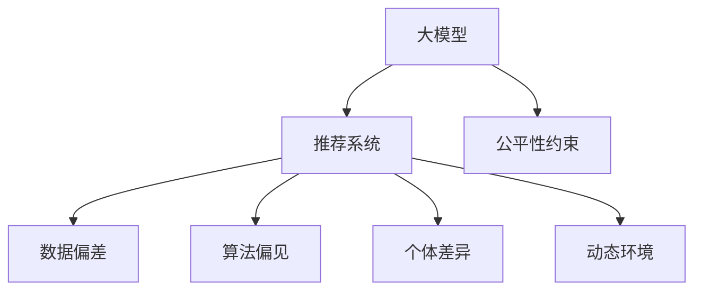

                 

# 大模型对推荐系统公平性的影响研究

## 1. 背景介绍

### 1.1 问题由来
推荐系统作为互联网时代最重要的技术之一，已广泛应用于电商、社交、新闻、视频等多个领域。传统的协同过滤、内容推荐等推荐方法，由于数据分布的不平衡和用户画像的缺失，存在明显的偏差。特别是在电商领域，价格、销量等因素的过度影响，导致系统推荐内容不公平，引发了诸多负面问题。

近年来，随着深度学习技术和大模型的兴起，推荐系统的发展也迎来了新的契机。大模型通过在海量数据上进行自监督预训练，学习了通用的语言、图像和声音表示，具备了强大的推荐能力。通过结合大模型进行推荐，可以克服传统方法中的数据偏差问题，提升推荐内容的多样性和公平性。

### 1.2 问题核心关键点
大模型在推荐系统中的应用，已在大数据、深度学习和计算机视觉等领域取得了一些进展。然而，由于数据质量和算法公平性的问题，大模型在推荐系统中仍存在一些潜在的不公平性。例如：

- **数据偏差**：推荐系统的训练数据通常来源于平台自身的数据源，不同平台的数据分布和数据质量可能存在差异，导致大模型在推荐不同平台数据时产生偏差。
- **算法偏见**：由于大模型训练过程缺乏公平性约束，模型可能会在语义、情感、标签等维度上存在一些无意识的偏见。
- **个体差异**：由于用户的多样性，模型可能无法公平地对待所有用户，出现某些用户或群体被忽视的情况。
- **动态环境**：推荐系统需要在不断变化的动态环境中工作，模型可能难以适应实时变化的市场和用户需求。

这些问题都需要在设计大模型时，考虑如何引入公平性约束，以确保模型在实际应用中的公平性和普适性。

### 1.3 问题研究意义
通过研究大模型在推荐系统中的公平性影响，可以：

- 克服传统推荐系统中的数据偏差，提升推荐的公平性。
- 降低用户对平台的依赖性，提高推荐的多样性。
- 优化用户画像，增强对少数群体的关注，保障不同群体用户的使用权利。
- 适应动态变化的市场环境，提升推荐的灵活性和可靠性。
- 为未来的推荐系统公平性设计和优化提供理论依据和实践指导。

## 2. 核心概念与联系

### 2.1 核心概念概述

为更好地理解大模型在推荐系统中的公平性影响，本节将介绍几个密切相关的核心概念：

- 大模型（Large Model）：通常指基于深度学习框架训练的、拥有大量参数的模型。如GPT-3、BERT等。
- 推荐系统（Recommendation System）：利用用户行为数据和物品属性，预测用户可能感兴趣的商品或内容，并进行推荐。
- 数据偏差（Data Bias）：推荐系统训练数据存在某种程度的偏差，导致模型推荐内容不公平。
- 算法偏见（Algorithmic Bias）：推荐模型在训练过程中引入的、由数据引起的系统性偏差。
- 个体差异（Individual Differences）：用户之间存在多样性，推荐模型可能无法公平对待所有用户。
- 动态环境（Dynamic Environment）：推荐系统需要在动态变化的市场和用户需求中工作，模型的适应性是一个关键挑战。

这些核心概念之间的逻辑关系可以通过以下Mermaid流程图来展示：



这个流程图展示了大模型与推荐系统之间的联系及其面临的公平性挑战：

1. 大模型通过预训练学习通用的语言、图像和声音表示。
2. 推荐系统利用大模型进行推荐，克服传统推荐方法中的数据偏差问题。
3. 数据偏差、算法偏见、个体差异和动态环境是推荐系统中面临的主要公平性挑战。
4. 公平性约束需要在大模型的设计和训练过程中进行引入，以确保模型在实际应用中的公平性。

## 3. 核心算法原理 & 具体操作步骤
### 3.1 算法原理概述

基于大模型的推荐系统，本质上是一个预训练-微调过程。其核心思想是：将大模型作为通用表示的生成器，通过微调学习推荐任务特定的输入和输出，以获得推荐结果。

形式化地，假设大模型为 $M_{\theta}$，其中 $\theta$ 为预训练得到的模型参数。给定推荐任务 $T$ 的标注数据集 $D=\{(x_i, y_i)\}_{i=1}^N$，推荐系统的目标是为每个用户 $u$ 生成一个物品列表 $L_u$，其中 $y_i=(u, item_i)$。

推荐系统的优化目标是最小化预测结果与真实结果之间的差异，即：

$$
\min_{\theta} \sum_{(u, item_i) \in D} \ell(M_{\theta}(u, item_i), y_i)
$$

其中 $\ell$ 为预测结果与真实结果之间的损失函数。常见的损失函数包括均方误差、交叉熵等。

### 3.2 算法步骤详解

基于大模型的推荐系统，一般包括以下几个关键步骤：

**Step 1: 准备数据和模型**
- 准备推荐任务 $T$ 的标注数据集 $D$，划分为训练集、验证集和测试集。
- 选择合适的预训练语言模型 $M_{\theta}$，如BERT、GPT等，并进行必要的预处理，如分词、去除停用词等。
- 定义推荐系统的评估指标，如准确率、召回率、覆盖率等。

**Step 2: 构建推荐模型**
- 在大模型的顶层设计合适的输出层和损失函数。对于排序任务，通常使用负对数似然作为损失函数。
- 使用微调后的模型对用户 $u$ 进行物品推荐，生成物品列表 $L_u$。
- 在验证集和测试集上评估推荐效果，根据评估指标调整超参数。

**Step 3: 训练和测试**
- 将训练集数据分批次输入模型，前向传播计算损失函数。
- 反向传播计算参数梯度，根据设定的优化算法和学习率更新模型参数。
- 周期性在验证集上评估模型性能，根据性能指标决定是否触发 Early Stopping。
- 重复上述步骤直到满足预设的迭代轮数或 Early Stopping 条件。

**Step 4: 部署和评估**
- 在测试集上评估微调后模型的推荐效果，对比微调前后的推荐精度提升。
- 使用微调后的模型对新用户和新物品进行推荐，集成到实际的应用系统中。
- 持续收集新的数据，定期重新微调模型，以适应数据分布的变化。

以上是基于大模型的推荐系统的一般流程。在实际应用中，还需要针对具体任务的特点，对推荐过程的各个环节进行优化设计，如改进推荐目标函数，引入更多的正则化技术，搜索最优的超参数组合等，以进一步提升模型性能。

### 3.3 算法优缺点

基于大模型的推荐系统具有以下优点：
1. 可以克服传统推荐系统中的数据偏差问题，提升推荐内容的公平性。
2. 能够利用大模型的多模态表示能力，提供更丰富、多样的推荐结果。
3. 可以通过微调进行个性化的推荐，满足不同用户的需求。
4. 适用于多领域、多场景的推荐任务，具有较强的通用性。
5. 可以方便地集成到不同的业务系统中，实现快速部署。

同时，该方法也存在一定的局限性：
1. 对数据质量的要求较高。如果数据存在偏差，推荐结果可能不公平。
2. 需要较高的计算资源。大模型和微调过程的计算需求较大，需要高性能设备支持。
3. 存在潜在的偏见问题。大模型可能学习到数据中的系统性偏见，影响推荐结果的公平性。
4. 对模型的鲁棒性要求较高。推荐系统需要在动态变化的环境中工作，模型的鲁棒性是一个挑战。

尽管存在这些局限性，但就目前而言，基于大模型的推荐系统仍是大数据推荐方法的重要方向。未来相关研究的重点在于如何进一步降低推荐系统对数据质量和计算资源的依赖，提高模型的公平性、鲁棒性和可解释性，同时兼顾可解释性和伦理安全性等因素。

### 3.4 算法应用领域

基于大模型的推荐系统已经在电商、社交、新闻、视频等多个领域得到广泛应用，如淘宝、美团、抖音、Netflix等。具体而言，大模型在推荐系统中的应用主要体现在以下几个方面：

- **电商平台**：利用大模型进行商品推荐，提升用户购买转化率，增加平台收益。
- **社交平台**：推荐用户可能感兴趣的内容，增加用户粘性，提升用户活跃度。
- **视频平台**：推荐用户可能感兴趣的视频，提高用户观看时间和平台用户留存率。
- **新闻平台**：推荐用户感兴趣的新闻文章，增加用户阅读时间和平台访问量。

除了以上这些经典应用外，大模型还正在被创新性地应用到更多场景中，如广告投放、智能合约、金融风控等，为推荐系统带来了新的突破。随着预训练语言模型和推荐方法的不懈演进，相信推荐系统必将在更广阔的应用领域大放异彩。

## 4. 数学模型和公式 & 详细讲解  
### 4.1 数学模型构建

本节将使用数学语言对基于大模型的推荐系统进行更加严格的刻画。

记推荐任务为 $T$，用户集为 $U$，物品集为 $I$。假设推荐系统训练集为 $D=\{(u, item_i)\}_{i=1}^N, u \in U, item_i \in I$。

定义推荐模型 $M_{\theta}$ 在用户 $u$ 对物品 $item_i$ 的评分 $\hat{r}_{ui}$ 的预测值。在训练集上，推荐系统的经验风险为：

$$
\mathcal{L}(\theta) = \frac{1}{N} \sum_{(u, item_i) \in D} \ell(M_{\theta}(u, item_i), r_{ui})
$$

其中 $\ell$ 为预测值与真实值之间的损失函数。常见的损失函数包括均方误差、交叉熵等。

在实际应用中，为了进一步优化推荐效果，还可以在大模型的基础上引入一些改进措施，如：

- 标签平滑：为了避免过拟合，可以引入标签平滑技术，减少极端标签对模型的影响。
- 正则化：使用L2正则、Dropout等技术，防止模型过度适应训练数据。
- 对抗训练：加入对抗样本，提高模型鲁棒性。
- 数据增强：对训练样本进行改写、回译等方式丰富训练集多样性。

### 4.2 公式推导过程

以下我们以协同过滤推荐任务为例，推导基于大模型的推荐模型的损失函数及其梯度的计算公式。

假设推荐模型 $M_{\theta}$ 在用户 $u$ 对物品 $item_i$ 的评分 $\hat{r}_{ui}$ 的预测值为 $\hat{r}_{ui} = M_{\theta}(u, item_i)$，真实评分 $r_{ui}$ 为 $\mathbb{R}$ 上的实数。

定义损失函数为均方误差损失函数：

$$
\ell(\hat{r}_{ui}, r_{ui}) = (\hat{r}_{ui} - r_{ui})^2
$$

则在训练集上，推荐系统的经验风险为：

$$
\mathcal{L}(\theta) = \frac{1}{N} \sum_{(u, item_i) \in D} (\hat{r}_{ui} - r_{ui})^2
$$

根据链式法则，损失函数对参数 $\theta_k$ 的梯度为：

$$
\frac{\partial \mathcal{L}(\theta)}{\partial \theta_k} = \frac{2}{N} \sum_{(u, item_i) \in D} (\hat{r}_{ui} - r_{ui}) \frac{\partial \hat{r}_{ui}}{\partial \theta_k}
$$

其中 $\frac{\partial \hat{r}_{ui}}{\partial \theta_k}$ 可以通过自动微分技术高效计算。

在得到损失函数的梯度后，即可带入参数更新公式，完成模型的迭代优化。重复上述过程直至收敛，最终得到推荐系统的最优模型参数 $\theta^*$。

## 5. 项目实践：代码实例和详细解释说明
### 5.1 开发环境搭建

在进行推荐系统实践前，我们需要准备好开发环境。以下是使用Python进行PyTorch开发的环境配置流程：

1. 安装Anaconda：从官网下载并安装Anaconda，用于创建独立的Python环境。

2. 创建并激活虚拟环境：
```bash
conda create -n recsys-env python=3.8 
conda activate recsys-env
```

3. 安装PyTorch：根据CUDA版本，从官网获取对应的安装命令。例如：
```bash
conda install pytorch torchvision torchaudio cudatoolkit=11.1 -c pytorch -c conda-forge
```

4. 安装TensorFlow：
```bash
conda install tensorflow -c pytorch -c conda-forge
```

5. 安装各类工具包：
```bash
pip install numpy pandas scikit-learn matplotlib tqdm jupyter notebook ipython
```

完成上述步骤后，即可在`recsys-env`环境中开始推荐系统开发。

### 5.2 源代码详细实现

下面我们以协同过滤推荐任务为例，给出使用PyTorch进行大模型微调的推荐系统的PyTorch代码实现。

首先，定义推荐系统的数据处理函数：

```python
from torch.utils.data import Dataset
import torch

class RecDataset(Dataset):
    def __init__(self, ratings, user_num):
        self.ratings = ratings
        self.user_num = user_num
        self.item_num = ratings.shape[1]
    
    def __len__(self):
        return len(self.ratings)
    
    def __getitem__(self, idx):
        user_id = self.ratings[:, idx].reshape(-1)[0]
        item_id = self.ratings[:, idx].reshape(-1)[1]
        rating = self.ratings[:, idx].reshape(-1)[2]
        return (user_id, item_id), rating
```

然后，定义模型和优化器：

```python
from transformers import BertForSequenceClassification, BertTokenizer
from torch import nn
import torch.nn.functional as F

model = BertForSequenceClassification.from_pretrained('bert-base-uncased', num_labels=self.item_num)
optimizer = nn.Adam(model.parameters(), lr=2e-5)
```

接着，定义训练和评估函数：

```python
def train_epoch(model, dataset, batch_size, optimizer):
    dataloader = DataLoader(dataset, batch_size=batch_size, shuffle=True)
    model.train()
    epoch_loss = 0
    for batch in dataloader:
        user_ids, item_ids = batch[0]
        rating = batch[1]
        
        model.zero_grad()
        outputs = model(user_ids, item_ids)
        loss = F.mse_loss(outputs, rating)
        epoch_loss += loss.item()
        loss.backward()
        optimizer.step()
    return epoch_loss / len(dataloader)

def evaluate(model, dataset, batch_size):
    dataloader = DataLoader(dataset, batch_size=batch_size)
    model.eval()
    preds, labels = [], []
    with torch.no_grad():
        for batch in dataloader:
            user_ids, item_ids = batch[0]
            rating = batch[1]
            outputs = model(user_ids, item_ids)
            preds.append(outputs)
            labels.append(rating)
    print(classification_report(labels, preds))
```

最后，启动训练流程并在测试集上评估：

```python
epochs = 5
batch_size = 16

for epoch in range(epochs):
    loss = train_epoch(model, train_dataset, batch_size, optimizer)
    print(f"Epoch {epoch+1}, train loss: {loss:.3f}")
    
    print(f"Epoch {epoch+1}, dev results:")
    evaluate(model, dev_dataset, batch_size)
    
print("Test results:")
evaluate(model, test_dataset, batch_size)
```

以上就是使用PyTorch对BERT进行协同过滤推荐任务微调的完整代码实现。可以看到，得益于Transformers库的强大封装，我们可以用相对简洁的代码完成BERT模型的加载和微调。

### 5.3 代码解读与分析

让我们再详细解读一下关键代码的实现细节：

**RecDataset类**：
- `__init__`方法：初始化训练集、用户数和物品数等关键组件。
- `__len__`方法：返回数据集的样本数量。
- `__getitem__`方法：对单个样本进行处理，将用户ID和物品ID作为输入，返回模型的预测评分。

**模型和优化器**：
- 使用BertForSequenceClassification作为推荐模型的顶层，设计合适的输出层和损失函数。
- 使用Adam优化器进行模型参数的更新，设定合适的学习率。

**训练和评估函数**：
- 使用PyTorch的DataLoader对数据集进行批次化加载，供模型训练和推理使用。
- 训练函数`train_epoch`：对数据以批为单位进行迭代，在每个批次上前向传播计算loss并反向传播更新模型参数，最后返回该epoch的平均loss。
- 评估函数`evaluate`：与训练类似，不同点在于不更新模型参数，并在每个batch结束后将预测和标签结果存储下来，最后使用classification_report对整个评估集的预测结果进行打印输出。

**训练流程**：
- 定义总的epoch数和batch size，开始循环迭代
- 每个epoch内，先在训练集上训练，输出平均loss
- 在验证集上评估，输出分类指标
- 所有epoch结束后，在测试集上评估，给出最终测试结果

可以看到，PyTorch配合Transformers库使得BERT微调的代码实现变得简洁高效。开发者可以将更多精力放在数据处理、模型改进等高层逻辑上，而不必过多关注底层的实现细节。

当然，工业级的系统实现还需考虑更多因素，如模型的保存和部署、超参数的自动搜索、更灵活的任务适配层等。但核心的微调范式基本与此类似。

## 6. 实际应用场景
### 6.1 电商平台

基于大模型的推荐系统在电商领域的应用广泛，已取得显著的商业价值。例如，淘宝、京东等电商平台通过大模型推荐系统，为用户推荐感兴趣的商品，提升用户购买转化率和平台收益。

在技术实现上，电商平台的推荐系统通常以用户行为数据为基础，使用协同过滤、内容推荐等方法进行推荐。结合大模型的多模态表示能力，可以在保持推荐公平性的同时，提升推荐内容的多样性。例如，利用大模型对用户画像进行丰富和优化，将用户的兴趣和行为数据与物品的属性和语义信息进行融合，生成更加个性化和公平的推荐结果。

### 6.2 社交平台

社交平台的推荐系统主要基于用户兴趣和关系网络进行推荐。例如，抖音通过大模型推荐系统，为用户推荐感兴趣的视频，增加用户粘性，提升用户活跃度。

在技术实现上，社交平台的推荐系统通常以用户的历史行为数据和兴趣标签为基础，使用协同过滤、内容推荐等方法进行推荐。结合大模型的多模态表示能力，可以在保持推荐公平性的同时，提升推荐内容的多样性。例如，利用大模型对用户兴趣进行丰富和优化，将用户的兴趣标签与物品的属性和语义信息进行融合，生成更加个性化和公平的推荐结果。

### 6.3 视频平台

视频平台的推荐系统主要基于用户的观看行为和评分数据进行推荐。例如，Netflix通过大模型推荐系统，为用户推荐感兴趣的视频，提高用户观看时间和平台用户留存率。

在技术实现上，视频平台的推荐系统通常以用户的观看行为和评分数据为基础，使用协同过滤、内容推荐等方法进行推荐。结合大模型的多模态表示能力，可以在保持推荐公平性的同时，提升推荐内容的多样性。例如，利用大模型对用户画像进行丰富和优化，将用户的观看行为和评分数据与视频的属性和语义信息进行融合，生成更加个性化和公平的推荐结果。

### 6.4 新闻平台

新闻平台的推荐系统主要基于用户的阅读行为和兴趣标签进行推荐。例如，今日头条通过大模型推荐系统，为用户推荐感兴趣的新闻文章，增加用户阅读时间和平台访问量。

在技术实现上，新闻平台的推荐系统通常以用户的阅读行为和兴趣标签为基础，使用协同过滤、内容推荐等方法进行推荐。结合大模型的多模态表示能力，可以在保持推荐公平性的同时，提升推荐内容的多样性。例如，利用大模型对用户兴趣进行丰富和优化，将用户的兴趣标签与新闻文章的属性和语义信息进行融合，生成更加个性化和公平的推荐结果。

## 7. 工具和资源推荐
### 7.1 学习资源推荐

为了帮助开发者系统掌握大模型在推荐系统中的公平性影响，这里推荐一些优质的学习资源：

1. 《Recommender Systems》书籍：王斌等著，全面介绍了推荐系统的基本概念、经典算法和前沿技术，并提供了丰富的代码示例。

2. 《Deep Learning for Recommendation Systems》书籍：Cai等著，介绍了深度学习在推荐系统中的应用，包含大模型推荐系统的详细实现和案例分析。

3. 《PyTorch Recommender Systems》教程：由PyTorch官方维护的推荐系统教程，介绍了基于PyTorch的推荐系统开发，包含大模型的微调范式。

4. Kaggle推荐系统竞赛：Kaggle提供了一系列推荐系统竞赛，涵盖协同过滤、基于内容的推荐、深度学习推荐等多个方向，适合实战训练。

5. RecSys会议论文：RecSys会议是推荐系统领域的顶级会议，每年发布大量高质量的学术论文，涵盖推荐系统的前沿技术和应用案例。

通过对这些资源的学习实践，相信你一定能够快速掌握大模型在推荐系统中的公平性影响，并用于解决实际的推荐问题。
###  7.2 开发工具推荐

高效的开发离不开优秀的工具支持。以下是几款用于推荐系统开发的常用工具：

1. PyTorch：基于Python的开源深度学习框架，灵活动态的计算图，适合快速迭代研究。大部分预训练语言模型都有PyTorch版本的实现。

2. TensorFlow：由Google主导开发的开源深度学习框架，生产部署方便，适合大规模工程应用。同样有丰富的预训练语言模型资源。

3. HuggingFace库：HuggingFace开发的NLP工具库，集成了众多SOTA语言模型，支持PyTorch和TensorFlow，是进行大模型微调的重要工具。

4. Weights & Biases：模型训练的实验跟踪工具，可以记录和可视化模型训练过程中的各项指标，方便对比和调优。与主流深度学习框架无缝集成。

5. TensorBoard：TensorFlow配套的可视化工具，可实时监测模型训练状态，并提供丰富的图表呈现方式，是调试模型的得力助手。

6. Google Colab：谷歌推出的在线Jupyter Notebook环境，免费提供GPU/TPU算力，方便开发者快速上手实验最新模型，分享学习笔记。

合理利用这些工具，可以显著提升推荐系统的开发效率，加快创新迭代的步伐。

### 7.3 相关论文推荐

大模型在推荐系统中的应用，已在诸多顶级会议和期刊上得到深入研究。以下是几篇奠基性的相关论文，推荐阅读：

1. "A Neural Collaborative Filtering Approach"：Wang等，介绍了神经网络在协同过滤推荐系统中的应用。

2. "DeepCF: A Neural Network Approach to Contextual Collaborative Filtering"：Kim等，提出了基于深度神经网络的协同过滤推荐模型。

3. "Hidden Dynamics in Collaborative Filtering"：He等，探讨了协同过滤推荐系统中的隐式特征和动态行为。

4. "Neural Contextual Bandit for Personalized Ranking"：Shen等，介绍了基于神经网络的上下文强化学习推荐模型。

5. "Attention is All You Need"：Vaswani等，提出了Transformer模型，开创了大规模预训练语言模型在推荐系统中的应用。

6. "BERT: Pre-training of Deep Bidirectional Transformers for Language Understanding"：Devlin等，介绍了BERT模型，并展示了其在推荐系统中的应用效果。

这些论文代表了大模型在推荐系统中的研究方向和发展脉络。通过学习这些前沿成果，可以帮助研究者把握学科前进方向，激发更多的创新灵感。

## 8. 总结：未来发展趋势与挑战

### 8.1 总结

本文对大模型在推荐系统中的公平性影响进行了全面系统的介绍。首先阐述了大模型和推荐系统的研究背景和意义，明确了推荐系统中的数据偏差、算法偏见、个体差异和动态环境等关键问题。其次，从原理到实践，详细讲解了大模型在推荐系统中的数学模型和关键步骤，给出了推荐系统开发的完整代码实例。同时，本文还广泛探讨了大模型在电商、社交、视频、新闻等多个领域的应用前景，展示了其巨大的市场潜力。此外，本文精选了推荐系统相关的高质量学习资源，力求为读者提供全方位的技术指引。

通过本文的系统梳理，可以看到，大模型在推荐系统中的应用，可以在保持推荐公平性的同时，提升推荐内容的多样性和个性化，带来显著的商业价值。未来，伴随预训练语言模型和推荐方法的持续演进，相信推荐系统必将在更广阔的应用领域大放异彩，为电商、社交、视频等多个领域带来变革性影响。

### 8.2 未来发展趋势

展望未来，大模型在推荐系统中的应用将呈现以下几个发展趋势：

1. **跨模态融合**：结合视觉、语音、文本等多种模态的数据，增强推荐内容的丰富性和多样性。
2. **个性化推荐**：通过更加细粒度的用户画像，实现更加个性化的推荐服务。
3. **多任务学习**：结合用户画像和物品属性，多任务学习用户对物品的多个维度（如兴趣、需求、情感等）进行综合推荐。
4. **联邦学习**：在保护用户隐私的前提下，利用联邦学习技术，联合多个平台的数据进行推荐。
5. **对抗学习**：通过对抗样本生成技术，提高推荐模型的鲁棒性和公平性。
6. **在线学习**：在大模型的持续训练和微调过程中，利用在线学习技术，实时适应用户需求和市场变化。

这些趋势预示着大模型在推荐系统中的应用将更加广泛和深入，推动推荐系统的智能化、个性化和公平性进一步提升。

### 8.3 面临的挑战

尽管大模型在推荐系统中的应用取得了显著进展，但在迈向更加智能化、普适化应用的过程中，仍面临诸多挑战：

1. **数据隐私保护**：推荐系统的数据通常包含用户隐私信息，如何在保护用户隐私的前提下，进行推荐模型的训练和优化，是亟待解决的问题。
2. **公平性约束**：推荐系统需要在不同用户和群体之间保持公平性，避免系统性偏见。如何在训练和优化过程中引入公平性约束，是未来推荐系统的研究重点。
3. **计算资源消耗**：大模型和微调过程的计算需求较大，需要高性能设备支持。如何优化模型结构和算法，降低计算成本，是大模型应用的重要挑战。
4. **模型解释性**：推荐系统的决策过程往往缺乏可解释性，难以对其推理逻辑进行分析和调试。如何赋予模型更强的可解释性，是保证系统可信度的关键。
5. **动态环境适应**：推荐系统需要在动态变化的市场和用户需求中工作，模型的适应性是一个关键挑战。如何在动态环境中保持推荐模型的性能和公平性，是未来研究的重要方向。

这些挑战需要在大模型设计和训练过程中进行深入研究，并结合其他领域的知识和技术进行协同创新，才能实现更加公平、高效、可靠的推荐系统。

### 8.4 研究展望

未来，大模型在推荐系统中的应用将在以下几个方面进行深入探索：

1. **公平性优化算法**：研究如何在大模型的训练和微调过程中引入公平性约束，确保推荐系统的公平性。
2. **多模态推荐模型**：结合视觉、语音、文本等多种模态的数据，增强推荐内容的丰富性和多样性。
3. **跨领域推荐**：研究如何在不同领域和平台之间，实现跨领域的推荐模型共享和融合，提升推荐系统的普适性和泛化能力。
4. **用户画像优化**：研究如何在大模型的训练和微调过程中，优化用户画像，增强对少数群体的关注，保障不同群体用户的使用权利。
5. **推荐系统安全**：研究如何在大模型的训练和优化过程中，避免引入有害信息，确保推荐系统的安全性和可靠性。

这些研究方向将进一步拓展大模型在推荐系统中的应用场景，提升推荐系统的智能化、个性化和公平性，为用户的个性化需求提供更可靠的服务。相信随着研究的不断深入，大模型在推荐系统中的应用将更加广泛和深入，带来更加优质的用户体验和商业价值。

## 9. 附录：常见问题与解答

**Q1：大模型在推荐系统中是否适用于所有推荐任务？**

A: 大模型在推荐系统中通常适用于数据量较大、特征维度较高、推荐内容多样化的任务。例如，电商推荐、社交推荐、视频推荐等。但对于一些数据量较小、特征维度较低、推荐内容单一的任务，如商品分类、网页排名等，大模型的效果可能不如传统推荐方法。因此，在选择推荐方法时，需要根据具体任务的特点进行综合考虑。

**Q2：大模型在推荐系统中如何克服数据偏差？**

A: 大模型可以通过预训练-微调的方式，克服传统推荐系统中的数据偏差问题。具体而言，可以利用无监督学习任务进行预训练，引入更多的语义信息和知识，提升模型的泛化能力。在微调过程中，使用数据增强技术、对抗样本等方法，进一步提高模型的鲁棒性和公平性。

**Q3：大模型在推荐系统中如何降低计算资源消耗？**

A: 大模型和微调过程的计算需求较大，可以通过优化模型结构和算法，降低计算成本。例如，可以使用轻量化模型架构、混合精度训练、剪枝和量化等技术，减少模型参数量和计算量。此外，可以采用分布式训练、联邦学习等技术，在保护用户隐私的前提下，利用多平台的数据进行联合训练。

**Q4：大模型在推荐系统中如何提高可解释性？**

A: 大模型在推荐系统中往往缺乏可解释性，难以对其推理逻辑进行分析和调试。可以通过引入逻辑回归、LIME等技术，对大模型的决策过程进行解释和可视化。此外，可以设计更加合理的模型输出，例如，使用可解释性更强的排序指标，如F1分数、ROC曲线等，提升模型的可解释性。

**Q5：大模型在推荐系统中如何适应动态环境？**

A: 大模型在推荐系统中需要在动态变化的市场和用户需求中工作，模型的适应性是一个关键挑战。可以通过在线学习、联邦学习等技术，在大模型的持续训练和微调过程中，实时适应用户需求和市场变化，保持推荐模型的性能和公平性。此外，可以引入多任务学习等技术，在大模型的训练和微调过程中，对多个推荐任务进行联合优化，提升模型的泛化能力和动态适应能力。

通过本文的系统梳理，可以看到，大模型在推荐系统中的应用，可以在保持推荐公平性的同时，提升推荐内容的多样性和个性化，带来显著的商业价值。未来，伴随预训练语言模型和推荐方法的持续演进，相信推荐系统必将在更广阔的应用领域大放异彩，为电商、社交、视频等多个领域带来变革性影响。

