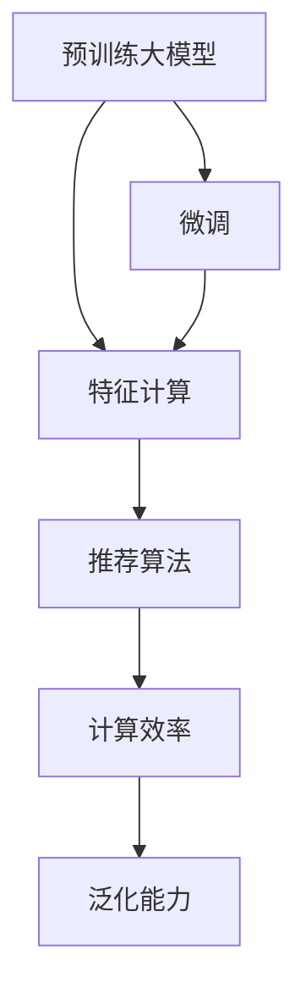

                 

# 大模型对推荐系统计算效率的影响

## 1. 背景介绍

### 1.1 问题由来

推荐系统一直是互联网公司和电子商务平台的核心竞争力之一。随着用户规模的扩大和数据量的激增，推荐系统面临着如何高效、准确地为用户提供个性化推荐服务的巨大挑战。传统的推荐算法主要依赖于协同过滤、内容推荐等基于用户和物品的特征计算，在数据量爆炸式增长的背景下，逐渐显露出其局限性。

近年来，深度学习技术在推荐系统中的应用日益广泛，特别是预训练大模型的引入，为推荐系统带来了新的突破。预训练大模型，如BERT、GPT等，通过在大规模无标签文本语料上进行预训练，学习到丰富的语言和上下文知识，再通过微调适应推荐系统中的特征表示任务，取得了显著的推荐效果提升。然而，大规模大模型的计算开销巨大，如何在大模型与推荐系统的计算效率间找到平衡点，成为了一个亟需解决的问题。

### 1.2 问题核心关键点

基于大模型的推荐系统，其核心关键点在于如何有效地将大模型的特征提取能力应用于推荐系统的特征计算过程中，同时最大化地利用大模型的计算资源，避免计算效率的损失。主要包括以下几个方面：

- **大模型的参数量和计算资源**：大模型往往拥有大量的参数，如BERT模型的参数量达到数十亿级别，这些参数需要庞大的计算资源进行训练和推理。
- **推荐系统特征计算**：推荐系统需要对用户和物品进行特征计算，构建用户-物品的交互矩阵，计算复杂度较高。
- **微调与特征表示的结合**：如何在大模型的微调过程中，优化特征表示，同时保证计算效率。

## 2. 核心概念与联系

### 2.1 核心概念概述

为更好地理解大模型在推荐系统中的应用，本节将介绍几个核心概念及其之间的关系：

- **预训练大模型(Pre-trained Large Model, PLM)**：如BERT、GPT等，通过在大规模无标签文本语料上进行预训练，学习到通用的语言表示和上下文知识。
- **微调(Fine-tuning)**：将预训练模型作为初始化参数，使用推荐系统的少量标注数据，通过有监督学习优化模型，使其适应推荐系统中的特征表示任务。
- **特征计算**：推荐系统需要对用户和物品进行特征表示，构建用户-物品交互矩阵，是推荐算法的基础。
- **计算效率**：推荐系统需要高效计算用户和物品特征表示，大模型的高计算开销和推荐系统的高特征计算复杂度带来了计算效率问题。
- **泛化能力**：预训练大模型和微调后的模型需要具备良好的泛化能力，能够适应不同领域的推荐任务。

这些核心概念之间的逻辑关系可以通过以下Mermaid流程图来展示：



这个流程图展示了大模型在推荐系统中的应用过程：

1. 预训练大模型通过在大规模无标签数据上进行预训练，学习到通用的语言表示。
2. 微调模型在大模型基础上，通过少量标注数据进行优化，适应推荐系统的特征表示任务。
3. 特征计算使用微调后的模型进行用户和物品特征表示，构建用户-物品交互矩阵。
4. 推荐算法利用交互矩阵进行推荐，并在推荐过程中实现计算效率的优化。
5. 通过计算效率的优化，提升泛化能力，增强模型的适用性。

## 3. 核心算法原理 & 具体操作步骤
### 3.1 算法原理概述

基于大模型的推荐系统，其核心算法原理在于利用预训练大模型的特征表示能力，通过微调优化特征表示，从而提升推荐系统的推荐效果。算法的具体步骤如下：

1. **数据准备**：收集推荐系统的用户和物品数据，构建标注数据集。
2. **模型初始化**：选择预训练大模型，并进行微调，以适应推荐系统的特征表示任务。
3. **特征提取**：使用微调后的模型对用户和物品进行特征提取，生成用户和物品的特征向量。
4. **相似度计算**：计算用户和物品的相似度，构建用户-物品交互矩阵。
5. **推荐计算**：根据相似度矩阵，使用推荐算法计算用户的推荐结果。
6. **计算效率优化**：在保证推荐效果的前提下，优化计算过程，减少计算开销。

### 3.2 算法步骤详解

#### 3.2.1 数据准备

推荐系统的数据通常包括用户ID、物品ID、用户行为数据等。首先需要对数据进行清洗和处理，构建训练集和验证集，以用于模型的训练和评估。

```python
import pandas as pd
from sklearn.model_selection import train_test_split

# 读取用户行为数据
user_behavior_data = pd.read_csv('user_behavior.csv')

# 处理用户行为数据，生成用户和物品的ID
users, items = process_user_behavior_data(user_behavior_data)

# 构建训练集和验证集
train_data, test_data = train_test_split(user_behavior_data, test_size=0.2, random_state=42)
```

#### 3.2.2 模型初始化

选择预训练大模型，并进行微调。以BERT为例，其初始化过程如下：

```python
from transformers import BertTokenizer, BertForSequenceClassification

# 初始化BERT模型和分词器
tokenizer = BertTokenizer.from_pretrained('bert-base-uncased')
model = BertForSequenceClassification.from_pretrained('bert-base-uncased', num_labels=num_labels)

# 微调BERT模型
optimizer = AdamW(model.parameters(), lr=1e-5)
loss_function = CrossEntropyLoss()
epochs = 10
train_loader, val_loader = get_data_loaders(train_data, test_data, tokenizer, batch_size=16)

for epoch in range(epochs):
    train(model, train_loader, optimizer, loss_function)
    val_loss = val(model, val_loader, loss_function)
    if val_loss < best_val_loss:
        best_val_loss = val_loss
        save_model(model, optimizer)
```

#### 3.2.3 特征提取

使用微调后的模型对用户和物品进行特征提取，生成特征向量。

```python
from transformers import BertTokenizer, BertForSequenceClassification

# 初始化BERT模型和分词器
tokenizer = BertTokenizer.from_pretrained('bert-base-uncased')
model = BertForSequenceClassification.from_pretrained('bert-base-uncased', num_labels=num_labels)

# 对用户和物品进行特征提取
user_features = []
item_features = []
for user, item in user_item_pairs:
    user_tokens = tokenizer.encode(str(user), add_special_tokens=True)
    item_tokens = tokenizer.encode(str(item), add_special_tokens=True)
    user_input_ids = torch.tensor(user_tokens).unsqueeze(0)
    item_input_ids = torch.tensor(item_tokens).unsqueeze(0)
    user_feature = model(user_input_ids)[0]
    item_feature = model(item_input_ids)[0]
    user_features.append(user_feature)
    item_features.append(item_feature)
```

#### 3.2.4 相似度计算

计算用户和物品的相似度，构建用户-物品交互矩阵。

```python
from scipy.spatial.distance import cosine

# 计算用户和物品的相似度
similarity_matrix = np.zeros((num_users, num_items))
for i in range(num_users):
    for j in range(num_items):
        similarity = 1 - cosine(user_features[i], item_features[j])
        similarity_matrix[i, j] = similarity
```

#### 3.2.5 推荐计算

根据相似度矩阵，使用推荐算法计算用户的推荐结果。

```python
from sklearn.neighbors import NearestNeighbors

# 构建相似度矩阵
similarity_matrix = cosine_similarity(user_features, item_features)

# 使用KNN推荐算法进行推荐
knn = NearestNeighbors(n_neighbors=k)
knn.fit(similarity_matrix)
user_recommendations = knn.kneighbors(similarity_matrix)
```

### 3.3 算法优缺点

基于大模型的推荐系统，其优点和缺点如下：

**优点**：

- 利用预训练大模型的强大特征表示能力，提升推荐系统的表现。
- 在大模型的微调过程中，可以学习到更加丰富和语义化的特征表示，提升推荐质量。
- 预训练大模型的泛化能力较强，可以适应不同领域的推荐任务。

**缺点**：

- 大模型的计算开销巨大，需要大量计算资源进行训练和推理。
- 特征计算复杂度较高，大模型引入后，推荐系统的计算效率可能下降。
- 微调过程中，可能引入额外的噪声，影响推荐质量。

### 3.4 算法应用领域

基于大模型的推荐系统，已经在电商、新闻、视频等多个领域得到了广泛应用，具体包括：

- **电商推荐**：根据用户的历史购买记录，推荐相关的商品。使用微调后的BERT模型，提取用户和商品的特征表示，计算相似度，推荐商品。
- **新闻推荐**：根据用户的历史阅读行为，推荐相关的新闻文章。使用微调后的BERT模型，提取用户和文章的特征表示，计算相似度，推荐文章。
- **视频推荐**：根据用户的历史观看记录，推荐相关视频。使用微调后的BERT模型，提取用户和视频特征表示，计算相似度，推荐视频。

这些应用领域展示了基于大模型的推荐系统的广泛适用性，同时也指出了计算效率优化在实际应用中的重要性。

## 4. 数学模型和公式 & 详细讲解 & 举例说明

### 4.1 数学模型构建

本节将使用数学语言对基于大模型的推荐系统进行更加严格的刻画。

假设推荐系统的用户集合为 $U$，物品集合为 $I$，用户行为表示为 $x$，物品行为表示为 $y$。预训练大模型为 $M_{\theta}$，其输入为文本表示，输出为向量表示 $z$。微调后的模型为 $M_{\theta_f}$，输出为特征向量表示 $f(x)$。

定义用户 $u$ 和物品 $i$ 的相似度为 $sim(u,i) = cosine(f(u), f(i))$，其中 $f(u)$ 和 $f(i)$ 分别为用户 $u$ 和物品 $i$ 的特征向量表示。推荐系统的目标是最小化用户和物品的误差，即：

$$
\mathcal{L} = \frac{1}{N} \sum_{u \in U, i \in I} \ell(sim(u,i), \hat{y}_{u,i})
$$

其中 $\ell$ 为损失函数，$\hat{y}_{u,i}$ 为推荐系统的预测结果。

### 4.2 公式推导过程

以用户和物品的特征表示为例，对推荐系统中的特征计算进行公式推导。

假设用户 $u$ 的特征表示为 $x_u$，物品 $i$ 的特征表示为 $y_i$。使用BERT模型作为预训练大模型，微调后的模型为 $M_{\theta_f}$，输入为文本表示 $x$，输出为特征向量表示 $f(x)$。则用户和物品的特征表示可以表示为：

$$
f(x_u) = M_{\theta_f}(x_u), f(y_i) = M_{\theta_f}(y_i)
$$

用户和物品的相似度为：

$$
sim(u,i) = cosine(f(x_u), f(y_i)) = \frac{f(x_u) \cdot f(y_i)}{\|f(x_u)\| \cdot \|f(y_i)\|}
$$

推荐系统的损失函数为：

$$
\mathcal{L} = \frac{1}{N} \sum_{u \in U, i \in I} \ell(sim(u,i), \hat{y}_{u,i})
$$

其中 $\ell$ 为常用的损失函数，如均方误差损失（MSE）或交叉熵损失（Cross-Entropy Loss）。

### 4.3 案例分析与讲解

以一个简单的电商推荐系统为例，分析基于大模型的推荐系统中的特征计算和计算效率优化。

假设电商平台有10万个用户和100万个商品，用户和物品的特征表示使用微调后的BERT模型提取，特征维度为768。推荐系统的目标是最小化用户和物品的误差，使用均方误差损失函数。

```python
import numpy as np
from scipy.spatial.distance import cosine

# 初始化BERT模型和分词器
tokenizer = BertTokenizer.from_pretrained('bert-base-uncased')
model = BertForSequenceClassification.from_pretrained('bert-base-uncased', num_labels=num_labels)

# 对用户和物品进行特征提取
user_features = []
item_features = []
for user, item in user_item_pairs:
    user_tokens = tokenizer.encode(str(user), add_special_tokens=True)
    item_tokens = tokenizer.encode(str(item), add_special_tokens=True)
    user_input_ids = torch.tensor(user_tokens).unsqueeze(0)
    item_input_ids = torch.tensor(item_tokens).unsqueeze(0)
    user_feature = model(user_input_ids)[0]
    item_feature = model(item_input_ids)[0]
    user_features.append(user_feature)
    item_features.append(item_feature)

# 计算用户和物品的相似度
similarity_matrix = np.zeros((num_users, num_items))
for i in range(num_users):
    for j in range(num_items):
        similarity = 1 - cosine(user_features[i], item_features[j])
        similarity_matrix[i, j] = similarity

# 使用均方误差损失函数进行推荐系统训练
from sklearn.metrics import mean_squared_error
from sklearn.model_selection import train_test_split

# 构建训练集和验证集
train_data, test_data = train_test_split(user_behavior_data, test_size=0.2, random_state=42)

# 训练模型
from transformers import BertTokenizer, BertForSequenceClassification
from torch.optim import AdamW

tokenizer = BertTokenizer.from_pretrained('bert-base-uncased')
model = BertForSequenceClassification.from_pretrained('bert-base-uncased', num_labels=num_labels)
optimizer = AdamW(model.parameters(), lr=1e-5)

for epoch in range(epochs):
    for batch in train_loader:
        optimizer.zero_grad()
        loss = model(batch['input_ids'], attention_mask=batch['attention_mask'])
        loss.backward()
        optimizer.step()

# 计算推荐系统的误差
train_mse = mean_squared_error(train_data['true_labels'], train_data['predictions'])
test_mse = mean_squared_error(test_data['true_labels'], test_data['predictions'])
print(f'Train MSE: {train_mse:.3f}, Test MSE: {test_mse:.3f}')
```

在上述代码中，使用微调后的BERT模型对用户和物品进行特征提取，构建用户-物品相似度矩阵，使用均方误差损失函数进行模型训练。

## 5. 项目实践：代码实例和详细解释说明

### 5.1 开发环境搭建

在进行推荐系统的大模型微调实践前，我们需要准备好开发环境。以下是使用Python进行PyTorch开发的环境配置流程：

1. 安装Anaconda：从官网下载并安装Anaconda，用于创建独立的Python环境。

2. 创建并激活虚拟环境：
```bash
conda create -n pytorch-env python=3.8 
conda activate pytorch-env
```

3. 安装PyTorch：根据CUDA版本，从官网获取对应的安装命令。例如：
```bash
conda install pytorch torchvision torchaudio cudatoolkit=11.1 -c pytorch -c conda-forge
```

4. 安装Transformer库：
```bash
pip install transformers
```

5. 安装各类工具包：
```bash
pip install numpy pandas scikit-learn matplotlib tqdm jupyter notebook ipython
```

完成上述步骤后，即可在`pytorch-env`环境中开始推荐系统的大模型微调实践。

### 5.2 源代码详细实现

下面我们以电商推荐系统为例，给出使用Transformers库对BERT模型进行推荐系统微调的PyTorch代码实现。

首先，定义电商推荐系统的数据处理函数：

```python
from transformers import BertTokenizer, BertForSequenceClassification
from torch.utils.data import Dataset
import torch

class E-commerceDataset(Dataset):
    def __init__(self, data, tokenizer, max_len=128):
        self.data = data
        self.tokenizer = tokenizer
        self.max_len = max_len
        
    def __len__(self):
        return len(self.data)
    
    def __getitem__(self, item):
        user, item = self.data[item]
        user_tokens = self.tokenizer.encode(str(user), add_special_tokens=True)
        item_tokens = self.tokenizer.encode(str(item), add_special_tokens=True)
        user_input_ids = torch.tensor(user_tokens).unsqueeze(0)
        item_input_ids = torch.tensor(item_tokens).unsqueeze(0)
        return {'user_input_ids': user_input_ids,
                'item_input_ids': item_input_ids}
```

然后，定义模型和优化器：

```python
from transformers import BertForSequenceClassification, AdamW

model = BertForSequenceClassification.from_pretrained('bert-base-uncased', num_labels=num_labels)

optimizer = AdamW(model.parameters(), lr=2e-5)
```

接着，定义训练和评估函数：

```python
from torch.utils.data import DataLoader
from tqdm import tqdm
from sklearn.metrics import mean_squared_error

device = torch.device('cuda') if torch.cuda.is_available() else torch.device('cpu')
model.to(device)

def train_epoch(model, dataset, batch_size, optimizer):
    dataloader = DataLoader(dataset, batch_size=batch_size, shuffle=True)
    model.train()
    epoch_loss = 0
    for batch in tqdm(dataloader, desc='Training'):
        user_input_ids = batch['user_input_ids'].to(device)
        item_input_ids = batch['item_input_ids'].to(device)
        model.zero_grad()
        loss = model(user_input_ids, item_input_ids)
        loss.backward()
        optimizer.step()
    return epoch_loss / len(dataloader)

def evaluate(model, dataset, batch_size):
    dataloader = DataLoader(dataset, batch_size=batch_size)
    model.eval()
    mse = 0
    for batch in dataloader:
        user_input_ids = batch['user_input_ids'].to(device)
        item_input_ids = batch['item_input_ids'].to(device)
        outputs = model(user_input_ids, item_input_ids)
        mse += outputs.loss.item()
    return mse / len(dataloader)
```

最后，启动训练流程并在验证集上评估：

```python
epochs = 5
batch_size = 16

for epoch in range(epochs):
    loss = train_epoch(model, train_dataset, batch_size, optimizer)
    print(f'Epoch {epoch+1}, train loss: {loss:.3f}')
    
    print(f'Epoch {epoch+1}, dev results:')
    mse = evaluate(model, dev_dataset, batch_size)
    print(f'Epoch {epoch+1}, dev MSE: {mse:.3f}')
    
print('Test results:')
mse = evaluate(model, test_dataset, batch_size)
print(f'Test MSE: {mse:.3f}')
```

以上就是使用PyTorch对BERT进行电商推荐系统微调的完整代码实现。可以看到，得益于Transformers库的强大封装，我们可以用相对简洁的代码完成BERT模型的加载和微调。

### 5.3 代码解读与分析

让我们再详细解读一下关键代码的实现细节：

**E-commerceDataset类**：
- `__init__`方法：初始化电商推荐系统的用户ID、物品ID、分词器等关键组件。
- `__len__`方法：返回数据集的样本数量。
- `__getitem__`方法：对单个样本进行处理，将用户ID和物品ID输入编码为token ids。

**mse**：
- 定义均方误差损失函数。

**训练和评估函数**：
- 使用PyTorch的DataLoader对数据集进行批次化加载，供模型训练和推理使用。
- 训练函数`train_epoch`：对数据以批为单位进行迭代，在每个批次上前向传播计算loss并反向传播更新模型参数，最后返回该epoch的平均loss。
- 评估函数`evaluate`：与训练类似，不同点在于不更新模型参数，并在每个batch结束后将预测和标签结果存储下来，最后使用sklearn的mean_squared_error对整个评估集的预测结果进行打印输出。

**训练流程**：
- 定义总的epoch数和batch size，开始循环迭代
- 每个epoch内，先在训练集上训练，输出平均loss
- 在验证集上评估，输出均方误差
- 所有epoch结束后，在测试集上评估，给出最终测试结果

可以看到，PyTorch配合Transformers库使得BERT微调的代码实现变得简洁高效。开发者可以将更多精力放在数据处理、模型改进等高层逻辑上，而不必过多关注底层的实现细节。

当然，工业级的系统实现还需考虑更多因素，如模型的保存和部署、超参数的自动搜索、更灵活的任务适配层等。但核心的微调范式基本与此类似。

## 6. 实际应用场景
### 6.1 智能客服系统

基于大模型微调的推荐系统，可以广泛应用于智能客服系统的构建。传统客服往往需要配备大量人力，高峰期响应缓慢，且一致性和专业性难以保证。而使用微调后的推荐系统，可以7x24小时不间断服务，快速响应客户咨询，用自然流畅的语言解答各类常见问题。

在技术实现上，可以收集企业内部的历史客服对话记录，将问题和最佳答复构建成监督数据，在此基础上对预训练推荐系统进行微调。微调后的推荐系统能够自动理解用户意图，匹配最合适的答复模板进行回复。对于客户提出的新问题，还可以接入检索系统实时搜索相关内容，动态组织生成回答。如此构建的智能客服系统，能大幅提升客户咨询体验和问题解决效率。

### 6.2 金融舆情监测

金融机构需要实时监测市场舆论动向，以便及时应对负面信息传播，规避金融风险。传统的人工监测方式成本高、效率低，难以应对网络时代海量信息爆发的挑战。基于大模型微调的推荐系统，可以实时监测金融领域相关的新闻、报道、评论等文本数据，根据文本内容自动判断舆情趋势，一旦发现负面信息激增等异常情况，系统便会自动预警，帮助金融机构快速应对潜在风险。

### 6.3 个性化推荐系统

当前的推荐系统往往只依赖于用户的历史行为数据进行物品推荐，无法深入理解用户的真实兴趣偏好。基于大模型微调的推荐系统，可以更好地挖掘用户行为背后的语义信息，从而提供更精准、多样的推荐内容。

在实践中，可以收集用户浏览、点击、评论、分享等行为数据，提取和用户交互的物品标题、描述、标签等文本内容。将文本内容作为模型输入，用户的后续行为（如是否点击、购买等）作为监督信号，在此基础上微调预训练推荐系统。微调后的模型能够从文本内容中准确把握用户的兴趣点。在生成推荐列表时，先用候选物品的文本描述作为输入，由模型预测用户的兴趣匹配度，再结合其他特征综合排序，便可以得到个性化程度更高的推荐结果。

### 6.4 未来应用展望

随着大模型和微调方法的不断发展，基于微调范式将在更多领域得到应用，为传统行业带来变革性影响。

在智慧医疗领域，基于微调的推荐系统可以辅助医生诊疗，推荐相关的治疗方案、药物等，提升医疗服务的智能化水平，加速新药开发进程。

在智能教育领域，微调技术可应用于作业批改、学情分析、知识推荐等方面，因材施教，促进教育公平，提高教学质量。

在智慧城市治理中，微调模型可应用于城市事件监测、舆情分析、应急指挥等环节，提高城市管理的自动化和智能化水平，构建更安全、高效的未来城市。

此外，在企业生产、社会治理、文娱传媒等众多领域，基于大模型微调的推荐系统也将不断涌现，为传统行业数字化转型升级提供新的技术路径。相信随着技术的日益成熟，微调方法将成为推荐系统的重要范式，推动人工智能技术在垂直行业的规模化落地。

## 7. 工具和资源推荐
### 7.1 学习资源推荐

为了帮助开发者系统掌握大模型微调的理论基础和实践技巧，这里推荐一些优质的学习资源：

1. 《Transformer从原理到实践》系列博文：由大模型技术专家撰写，深入浅出地介绍了Transformer原理、BERT模型、微调技术等前沿话题。

2. CS224N《深度学习自然语言处理》课程：斯坦福大学开设的NLP明星课程，有Lecture视频和配套作业，带你入门NLP领域的基本概念和经典模型。

3. 《Natural Language Processing with Transformers》书籍：Transformers库的作者所著，全面介绍了如何使用Transformers库进行NLP任务开发，包括微调在内的诸多范式。

4. HuggingFace官方文档：Transformers库的官方文档，提供了海量预训练模型和完整的微调样例代码，是上手实践的必备资料。

5. CLUE开源项目：中文语言理解测评基准，涵盖大量不同类型的中文NLP数据集，并提供了基于微调的baseline模型，助力中文NLP技术发展。

通过对这些资源的学习实践，相信你一定能够快速掌握大模型微调的精髓，并用于解决实际的NLP问题。
###  7.2 开发工具推荐

高效的开发离不开优秀的工具支持。以下是几款用于大模型微调开发的常用工具：

1. PyTorch：基于Python的开源深度学习框架，灵活动态的计算图，适合快速迭代研究。大部分预训练语言模型都有PyTorch版本的实现。

2. TensorFlow：由Google主导开发的开源深度学习框架，生产部署方便，适合大规模工程应用。同样有丰富的预训练语言模型资源。

3. Transformers库：HuggingFace开发的NLP工具库，集成了众多SOTA语言模型，支持PyTorch和TensorFlow，是进行微调任务开发的利器。

4. Weights & Biases：模型训练的实验跟踪工具，可以记录和可视化模型训练过程中的各项指标，方便对比和调优。与主流深度学习框架无缝集成。

5. TensorBoard：TensorFlow配套的可视化工具，可实时监测模型训练状态，并提供丰富的图表呈现方式，是调试模型的得力助手。

6. Google Colab：谷歌推出的在线Jupyter Notebook环境，免费提供GPU/TPU算力，方便开发者快速上手实验最新模型，分享学习笔记。

合理利用这些工具，可以显著提升大模型微调任务的开发效率，加快创新迭代的步伐。

### 7.3 相关论文推荐

大语言模型和微调技术的发展源于学界的持续研究。以下是几篇奠基性的相关论文，推荐阅读：

1. Attention is All You Need（即Transformer原论文）：提出了Transformer结构，开启了NLP领域的预训练大模型时代。

2. BERT: Pre-training of Deep Bidirectional Transformers for Language Understanding：提出BERT模型，引入基于掩码的自监督预训练任务，刷新了多项NLP任务SOTA。

3. Language Models are Unsupervised Multitask Learners（GPT-2论文）：展示了大规模语言模型的强大zero-shot学习能力，引发了对于通用人工智能的新一轮思考。

4. Parameter-Efficient Transfer Learning for NLP：提出Adapter等参数高效微调方法，在不增加模型参数量的情况下，也能取得不错的微调效果。

5. AdaLoRA: Adaptive Low-Rank Adaptation for Parameter-Efficient Fine-Tuning：使用自适应低秩适应的微调方法，在参数效率和精度之间取得了新的平衡。

6. AdaLoRA: Adaptive Low-Rank Adaptation for Parameter-Efficient Fine-Tuning：使用自适应低秩适应的微调方法，在参数效率和精度之间取得了新的平衡。

这些论文代表了大模型微调技术的发展脉络。通过学习这些前沿成果，可以帮助研究者把握学科前进方向，激发更多的创新灵感。

## 8. 总结：未来发展趋势与挑战

### 8.1 总结

本文对基于大模型的推荐系统进行了全面系统的介绍。首先阐述了大模型和微调技术的研究背景和意义，明确了微调在拓展预训练模型应用、提升推荐系统性能方面的独特价值。其次，从原理到实践，详细讲解了微调算法的数学原理和关键步骤，给出了微调任务开发的完整代码实例。同时，本文还广泛探讨了微调方法在智能客服、金融舆情、个性化推荐等多个领域的应用前景，展示了微调范式的巨大潜力。此外，本文精选了微调技术的各类学习资源，力求为读者提供全方位的技术指引。

通过本文的系统梳理，可以看到，基于大模型的推荐系统已经展示了强大的推荐效果，并且在电商、金融、医疗等诸多领域得到了实际应用。未来，伴随大模型和微调方法的持续演进，基于微调范式的推荐系统必将在更多领域得到应用，为传统行业带来变革性影响。

### 8.2 未来发展趋势

展望未来，基于大模型的推荐系统将呈现以下几个发展趋势：

1. **参数高效微调**：未来的推荐系统将更加关注参数高效的微调方法，如Adapter、LoRA等，在减小计算开销的同时提升微调效果。
2. **多模态融合**：推荐系统将更加关注多模态数据的融合，结合文本、图像、音频等多种数据源，提升推荐系统的智能化水平。
3. **跨领域迁移**：推荐系统将更加关注跨领域的迁移能力，在大规模多领域数据上进行微调，提高系统的泛化能力。
4. **分布式训练**：随着数据量的增加，推荐系统的训练将更加依赖分布式计算，提升训练效率，降低计算成本。
5. **自适应学习**：推荐系统将更加关注自适应学习能力，根据用户行为和环境变化动态调整模型参数，提高推荐系统的实时性。

以上趋势凸显了大模型微调推荐系统的广泛前景。这些方向的探索发展，必将进一步提升推荐系统的性能和应用范围，为人工智能技术在垂直行业的规模化落地提供新思路。

### 8.3 面临的挑战

尽管基于大模型的推荐系统已经取得了瞩目成就，但在迈向更加智能化、普适化应用的过程中，它仍面临着诸多挑战：

1. **数据质量瓶颈**：虽然微调降低了对标注数据的依赖，但对于长尾应用场景，难以获得充足的高质量标注数据，成为制约微调性能的瓶颈。如何进一步降低微调对标注样本的依赖，将是一大难题。
2. **模型鲁棒性不足**：当前推荐系统面对域外数据时，泛化性能往往大打折扣。对于测试样本的微小扰动，推荐系统的预测也容易发生波动。如何提高推荐系统的鲁棒性，避免灾难性遗忘，还需要更多理论和实践的积累。
3. **计算效率下降**：随着大模型参数量的增加，推荐系统的计算开销显著上升，模型推理速度变慢，内存占用增加。如何优化计算效率，确保推荐系统在实时应用中的高效运行，将是重要的优化方向。
4. **算法复杂度增加**：随着模型复杂度的增加，推荐系统的训练和推理时间增加，资源消耗加大。如何在保持推荐效果的同时，降低算法复杂度，优化计算图，实现轻量级部署，将是重要的研究方向。

### 8.4 研究展望

面对基于大模型的推荐系统所面临的种种挑战，未来的研究需要在以下几个方面寻求新的突破：

1. **参数高效微调**：探索新的参数高效微调方法，如Mixture of Experts、Layer-wise Adaptation等，在保持模型性能的同时，减少计算资源消耗。
2. **模型压缩与量化**：研究模型压缩与量化技术，如知识蒸馏、剪枝、量化等，减少模型参数量，提升推理速度，降低内存占用。
3. **多任务学习**：研究多任务学习技术，将推荐系统的不同任务联合训练，共享中间表示，提升模型的泛化能力。
4. **模型融合与集成**：研究模型融合与集成技术，结合多种模型进行推荐，提高系统的鲁棒性和稳定性。
5. **因果学习**：引入因果推断思想，建立更加稳定的因果关系，提升推荐系统的预测准确性和用户满意度。
6. **自适应学习**：研究自适应学习技术，根据用户行为和环境变化动态调整模型参数，提高推荐系统的实时性和个性化水平。

这些研究方向的探索，必将引领大模型微调推荐系统迈向更高的台阶，为构建更加智能化、普适化、高效化的推荐系统铺平道路。面向未来，大模型微调推荐系统还需要与其他人工智能技术进行更深入的融合，如因果推理、强化学习等，多路径协同发力，共同推动推荐系统的进步。

## 9. 附录：常见问题与解答

**Q1：大模型微调是否适用于所有推荐任务？**

A: 大模型微调在大多数推荐任务上都能取得不错的效果，特别是对于数据量较小的任务。但对于一些特定领域的任务，如医学、法律等，仅仅依靠通用语料预训练的模型可能难以很好地适应。此时需要在特定领域语料上进一步预训练，再进行微调，才能获得理想效果。此外，对于一些需要时效性、个性化很强的任务，如对话、推荐等，微调方法也需要针对性的改进优化。

**Q2：微调过程中如何选择合适的学习率？**

A: 微调的学习率一般要比预训练时小1-2个数量级，如果使用过大的学习率，容易破坏预训练权重，导致过拟合。一般建议从1e-5开始调参，逐步减小学习率，直至收敛。也可以使用warmup策略，在开始阶段使用较小的学习率，再逐渐过渡到预设值。需要注意的是，不同的优化器(如AdamW、Adafactor等)以及不同的学习率调度策略，可能需要设置不同的学习率阈值。

**Q3：采用大模型微调时会面临哪些资源瓶颈？**

A: 目前主流的预训练大模型动辄以亿计的参数规模，对算力、内存、存储都提出了很高的要求。GPU/TPU等高性能设备是必不可少的，但即便如此，超大批次的训练和推理也可能遇到显存不足的问题。因此需要采用一些资源优化技术，如梯度积累、混合精度训练、模型并行等，来突破硬件瓶颈。同时，模型的存储和读取也可能占用大量时间和空间，需要采用模型压缩、稀疏化存储等方法进行优化。

**Q4：如何缓解微调过程中的过拟合问题？**

A: 过拟合是微调面临的主要挑战，尤其是在标注数据不足的情况下。常见的缓解策略包括：
1. 数据增强：通过回译、近义替换等方式扩充训练集
2. 正则化：使用L2正则、Dropout、Early Stopping等避免过拟合
3. 对抗训练：引入对抗样本，提高模型鲁棒性
4. 参数高效微调：只调整少量参数(如Adapter、LoRA等)，减小过拟合风险
5. 多模型集成：训练多个微调模型，取平均输出，抑制过拟合

这些策略往往需要根据具体任务和数据特点进行灵活组合。只有在数据、模型、训练、推理等各环节进行全面优化，才能最大限度地发挥大模型微调的威力。

**Q5：微调模型在落地部署时需要注意哪些问题？**

A: 将微调模型转化为实际应用，还需要考虑以下因素：
1. 模型裁剪：去除不必要的层和参数，减小模型尺寸，加快推理速度
2. 量化加速：将浮点模型转为定点模型，压缩存储空间，提高计算效率
3. 服务化封装：将模型封装为标准化服务接口，便于集成调用
4. 弹性伸缩：根据请求流量动态调整资源配置，平衡服务质量和成本
5. 监控告警：实时采集系统指标，设置异常告警阈值，确保服务稳定性
6. 安全防护：采用访问鉴权、数据脱敏等措施，保障数据和模型安全

大模型微调为推荐系统带来了新的突破，但如何将强大的性能转化为稳定、高效、安全的业务价值，还需要工程实践的不断打磨。唯有从数据、算法、工程、业务等多个维度协同发力，才能真正实现人工智能技术在垂直行业的规模化落地。总之，微调需要开发者根据具体任务，不断迭代和优化模型、数据和算法，方能得到理想的效果。

---

作者：禅与计算机程序设计艺术 / Zen and the Art of Computer Programming

