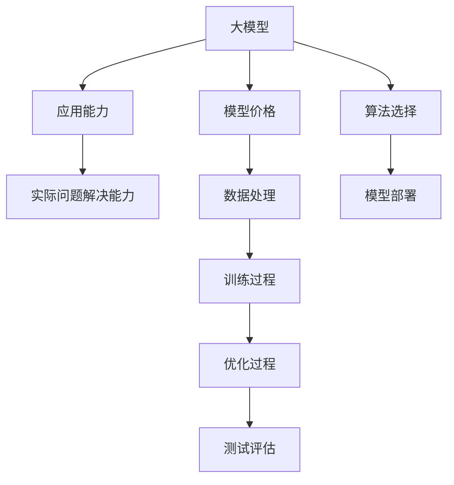

                 

# 大模型应用的关键：价格其次，AI解决实际问题的能力才是重点

> 关键词：大模型,模型价格,应用能力,AI技术,实际问题,算法选择,数据处理,模型部署

## 1. 背景介绍

### 1.1 问题由来
近年来，人工智能(AI)技术发展迅猛，涌现出了诸多强大且复杂的深度学习模型。这些大模型在图像、语音、自然语言处理等领域展现出了前所未有的能力，极大推动了技术的进步和应用的普及。然而，在实际应用中，大模型的价格和性能成为了不少企业、研究者乃至普通用户的考量因素。尤其在大规模应用场景中，模型的价格和计算资源消耗成为了不容忽视的问题。

### 1.2 问题核心关键点
选择大模型时，除了性能和精度之外，模型的价格、计算资源的消耗以及实际应用效果也应被充分考虑。衡量AI解决实际问题的能力，不应仅看模型的参数量、计算能力或训练时间，更要重视其在实际问题解决中的表现。大模型应用的关键在于其是否真正解决了业务痛点，提升了实际效益。

### 1.3 问题研究意义
探讨大模型应用的关键，不仅有助于开发者更好地选择和使用模型，也对于提升AI技术在各行各业的落地和应用具有重要指导意义。本文将深入分析模型价格、应用能力和实际问题解决能力之间的关系，为AI应用提供更全面的参考。

## 2. 核心概念与联系

### 2.1 核心概念概述

本文主要涉及以下几个核心概念：

- **大模型(Large Model)**：如BERT、GPT等深度学习模型，参数规模较大，具有强大的语言理解和生成能力。
- **模型价格(Model Price)**：购买、部署和使用模型的费用，包括软件授权费、计算资源租赁费等。
- **应用能力(Application Capability)**：模型在特定任务上表现的优劣，如分类准确率、生成质量等。
- **实际问题(Real-world Problems)**：企业、研究者、开发者在实际业务中遇到的具体问题，如文本分类、图像识别、智能推荐等。
- **算法选择(Algorithm Selection)**：根据问题特点和数据特性，选择最合适的算法和模型。
- **数据处理(Data Processing)**：数据清洗、预处理、特征提取等，以提升模型的性能和鲁棒性。
- **模型部署(Model Deployment)**：将训练好的模型部署到实际应用环境中，供用户调用。

这些概念相互联系，共同构成了AI模型应用的完整框架。模型的价格和应用能力是衡量其价值的两个重要维度，而实际问题解决能力则是最终目标。

### 2.2 核心概念原理和架构的 Mermaid 流程图(Mermaid 流程节点中不要有括号、逗号等特殊字符)


## 3. 核心算法原理 & 具体操作步骤
### 3.1 算法原理概述

AI模型应用的核心在于其是否能够有效解决实际问题，提升业务效益。选择和应用大模型时，需综合考虑其价格、应用能力和实际问题解决能力。模型价格主要受计算资源需求、部署环境等影响，而应用能力和实际问题解决能力则更多依赖于模型架构、算法选择、数据处理和模型训练。

### 3.2 算法步骤详解

大模型的应用步骤大致可以分为以下几个环节：

1. **问题定义(Problem Definition)**：明确要解决的实际问题，如文本分类、图像识别、推荐系统等。
2. **数据收集和处理(Data Collection & Processing)**：收集与问题相关的数据，并进行清洗、预处理、特征提取等操作，以提升数据质量。
3. **算法选择(Algorithm Selection)**：根据问题的特点和数据特性，选择合适的算法和模型架构。例如，对于图像分类任务，可以选择ResNet、Inception等卷积神经网络；对于自然语言处理任务，可以选择BERT、GPT等大语言模型。
4. **模型训练(Model Training)**：在处理后的数据上训练模型，调整模型参数，以最小化损失函数。
5. **模型评估(Model Evaluation)**：使用测试集评估模型性能，判断是否达到预期目标。
6. **模型部署(Model Deployment)**：将训练好的模型部署到实际应用环境中，供用户调用。
7. **模型优化(Model Optimization)**：根据实际应用反馈，对模型进行优化调整，如调整参数、改进算法等，以提升模型效果。

### 3.3 算法优缺点

大模型的应用虽然具有强大的性能和广泛的适用性，但也存在以下缺点：

- **高昂的计算资源需求**：训练和推理大模型通常需要大量的计算资源，如GPU、TPU等，价格较高，部署和维护成本也较高。
- **较长的训练时间和部署时间**：大模型往往参数量大，训练和推理时间较长。
- **需要丰富的数据和标注**：训练过程中需要大量高质量的标注数据，数据获取和标注工作量大。
- **模型复杂度较高**：模型结构复杂，难以解释和调试，调试难度较大。

尽管如此，大模型的应用在解决复杂问题、提升业务价值方面具有不可替代的作用。

### 3.4 算法应用领域

大模型在多个领域都得到了广泛应用，包括但不限于：

- **医疗健康**：基于大模型的医学影像诊断、病历分析、药物发现等应用，显著提升了医疗诊断的准确性和效率。
- **金融服务**：利用大模型进行风险评估、欺诈检测、信用评分等，有效防范金融风险。
- **智能制造**：使用大模型进行工业设备故障预测、质量检测、供应链优化等，提升了制造业的智能化水平。
- **自动驾驶**：通过大模型进行环境感知、路径规划、行为决策等，推动了自动驾驶技术的发展。
- **教育培训**：基于大模型的智能推荐、个性化教学、自动化测评等，提升了教育培训的个性化和智能化水平。

以上只是大模型应用的一部分领域，随着技术的不断进步，大模型在更多领域的应用前景将更加广阔。

## 4. 数学模型和公式 & 详细讲解 & 举例说明

### 4.1 数学模型构建

以文本分类任务为例，假设有 $n$ 个样本，每个样本有 $d$ 个特征，其中 $x_{i,j}$ 表示第 $i$ 个样本的第 $j$ 个特征。模型 $f$ 的输出为 $\hat{y}_i$，表示样本 $i$ 属于第 $j$ 类的概率。模型的目标是最小化损失函数 $\mathcal{L}$，其中 $y_i$ 为样本的真实标签。

### 4.2 公式推导过程

常用的分类任务损失函数包括交叉熵损失函数：

$$
\mathcal{L}(f) = -\frac{1}{N}\sum_{i=1}^N\sum_{j=1}^C y_i \log \hat{y}_{i,j} + (1-y_i) \log(1-\hat{y}_{i,j})
$$

其中 $C$ 为类别数。

### 4.3 案例分析与讲解

以BERT模型在文本分类任务中的应用为例。BERT模型在预训练阶段使用语言模型的掩码预测任务和下一句预测任务，学习到了丰富的语言知识。在微调阶段，将BERT模型作为特征提取器，在其顶部添加全连接层和softmax层，并使用交叉熵损失函数进行训练：

$$
\mathcal{L} = -\frac{1}{N}\sum_{i=1}^N\sum_{j=1}^C y_i \log \hat{y}_{i,j} + (1-y_i) \log(1-\hat{y}_{i,j})
$$

其中 $C$ 为类别数，$y_i$ 为样本的真实标签，$\hat{y}_{i,j}$ 为BERT模型对样本 $i$ 属于第 $j$ 类的预测概率。

## 5. 项目实践：代码实例和详细解释说明

### 5.1 开发环境搭建

1. **安装依赖**：
```bash
pip install torch torchvision transformers
```

2. **环境配置**：
```bash
python -m pip install -r requirements.txt
```

3. **数据预处理**：
```python
import pandas as pd
from sklearn.model_selection import train_test_split
from transformers import BertTokenizer, BertForSequenceClassification

# 加载数据集
train_df = pd.read_csv('train.csv')
test_df = pd.read_csv('test.csv')

# 划分训练集和验证集
train_texts, val_texts, train_labels, val_labels = train_test_split(train_df['text'], train_df['label'], test_size=0.2, random_state=42)

# 分词器
tokenizer = BertTokenizer.from_pretrained('bert-base-uncased')

# 数据转换
def convert_data(texts, labels):
    inputs = tokenizer(texts, return_tensors='pt', padding='max_length', truncation=True, max_length=512)
    labels = torch.tensor(labels, dtype=torch.long)
    return inputs, labels

train_inputs, train_labels = convert_data(train_texts, train_labels)
val_inputs, val_labels = convert_data(val_texts, val_labels)
```

### 5.2 源代码详细实现

```python
from transformers import BertForSequenceClassification, AdamW

# 定义模型
model = BertForSequenceClassification.from_pretrained('bert-base-uncased', num_labels=2)

# 定义优化器
optimizer = AdamW(model.parameters(), lr=2e-5)

# 训练函数
def train_epoch(model, inputs, labels, optimizer):
    model.train()
    loss = 0
    for batch in inputs:
        inputs, labels = batch
        model.zero_grad()
        outputs = model(inputs, labels=labels)
        loss = outputs.loss
        loss.backward()
        optimizer.step()
    return loss

# 训练模型
epochs = 5
for epoch in range(epochs):
    loss = train_epoch(model, train_inputs, train_labels, optimizer)
    print(f'Epoch {epoch+1}, train loss: {loss:.3f}')

# 评估模型
with torch.no_grad():
    eval_loss = train_epoch(model, val_inputs, val_labels, optimizer)
    print(f'Validation loss: {eval_loss:.3f}')
```

### 5.3 代码解读与分析

以上代码实现了使用BERT模型进行文本分类任务的微调。首先，加载并预处理数据，将文本转换为BERT模型所需的输入形式。然后定义BERT模型和优化器，进行模型训练。训练过程中，使用训练集数据不断优化模型参数，并在验证集上评估模型性能。

## 6. 实际应用场景

### 6.1 医疗健康

在医疗领域，大模型可以用于医学影像诊断、病历分析、药物发现等。例如，利用BERT模型进行病历分析，可以通过训练模型自动识别出病历中的疾病标签，提高医生的工作效率和诊断准确性。此外，大模型还可以用于药物分子生成和靶点预测，加速新药的研发过程。

### 6.2 金融服务

金融行业中的风险评估、欺诈检测、信用评分等任务，大模型都展现出了强大的能力。例如，通过大模型对历史交易数据进行分析，可以发现潜在的欺诈行为，实时预警风险。同时，大模型还可以用于智能投顾系统，根据用户偏好和市场动态，提供个性化的投资建议。

### 6.3 智能制造

在制造业中，大模型可以用于设备故障预测、质量检测、供应链优化等。例如，通过大模型对工业设备的历史数据进行分析，可以预测设备的故障时间和维护需求，提高设备的可靠性和维护效率。同时，大模型还可以用于物料需求预测，优化库存管理，降低成本。

### 6.4 未来应用展望

随着大模型技术的发展，其在更多领域的应用前景将更加广阔。未来，大模型有望在智慧城市、智能交通、智能家居等领域发挥重要作用，提升社会治理和生活的智能化水平。此外，大模型在教育和娱乐领域的应用也将更加深入，如个性化推荐系统、智能聊天机器人等，带来全新的用户体验。

## 7. 工具和资源推荐

### 7.1 学习资源推荐

1. **Deep Learning Specialization by Andrew Ng**：
   - 斯坦福大学的深度学习课程，涵盖深度学习的基础知识和实际应用。

2. **Natural Language Processing with Transformers**：
   - 《Transformer从原理到实践》系列博文，由大模型技术专家撰写，详细介绍了Transformer原理、BERT模型、微调技术等前沿话题。

3. **Understanding Deep Learning**：
   - 李宏毅教授的深度学习课程，深入讲解深度学习的基本概念和实际应用。

### 7.2 开发工具推荐

1. **PyTorch**：
   - 一个灵活的深度学习框架，支持动态图和静态图，适合研究和大规模部署。

2. **TensorFlow**：
   - 谷歌开源的深度学习框架，生产部署方便，适合大规模工程应用。

3. **HuggingFace Transformers**：
   - 一个强大的NLP库，提供了多种预训练语言模型和微调工具，易于使用。

### 7.3 相关论文推荐

1. **Attention is All You Need**：
   - 论文介绍了Transformer结构，开启了NLP领域的预训练大模型时代。

2. **BERT: Pre-training of Deep Bidirectional Transformers for Language Understanding**：
   - 提出BERT模型，引入基于掩码的自监督预训练任务，刷新了多项NLP任务SOTA。

3. **Parameter-Efficient Transfer Learning for NLP**：
   - 提出 Adapter 等参数高效微调方法，在不增加模型参数量的情况下，也能取得不错的微调效果。

4. **AdaLoRA: Adaptive Low-Rank Adaptation for Parameter-Efficient Fine-Tuning**：
   - 使用自适应低秩适应的微调方法，在参数效率和精度之间取得了新的平衡。

这些论文代表了大模型微调技术的发展脉络。通过学习这些前沿成果，可以帮助研究者把握学科前进方向，激发更多的创新灵感。

## 8. 总结：未来发展趋势与挑战

### 8.1 总结

本文深入探讨了模型价格、应用能力和实际问题解决能力之间的关系。通过理论分析和实践案例，展示了大模型在多个领域的应用潜力，以及选择和应用大模型时需要注意的关键因素。

### 8.2 未来发展趋势

未来，大模型在AI应用中的地位将更加重要，其应用领域将不断扩展。同时，模型的计算资源需求将逐渐降低，模型的部署和维护成本将更加合理。以下趋势值得关注：

1. **模型的计算资源需求降低**：
   - 随着硬件技术的进步，如AI芯片、GPU 和 TPU 的发展，大模型的计算资源需求将逐渐降低。

2. **模型的部署和维护成本降低**：
   - 云计算和边缘计算等新兴技术的发展，将使得大模型的部署和维护更加便捷和经济。

3. **模型的计算效率提升**：
   - 模型的结构优化和算法改进，将使得大模型的计算效率提升，能够实时响应用户需求。

4. **模型的应用能力增强**：
   - 算法和模型的不断优化，将使得大模型在解决实际问题时表现更加出色。

5. **模型的可解释性和可控性增强**：
   - 模型解释和可控性技术的进步，将使得模型的输出更加可解释和可控。

### 8.3 面临的挑战

尽管大模型应用前景广阔，但在实际应用中也面临诸多挑战：

1. **模型成本高昂**：
   - 大模型的计算资源需求高，部署和维护成本也较高，可能超出部分中小型企业的承受能力。

2. **模型的鲁棒性不足**：
   - 大模型在面对未知数据时，可能出现泛化性能不足的问题。

3. **模型的可解释性不足**：
   - 大模型的内部机制复杂，难以解释和调试。

4. **模型的安全性和伦理问题**：
   - 大模型可能学习到有害信息，输出有害内容，带来伦理和安全问题。

5. **模型的适应性不足**：
   - 大模型在不同领域和数据集上的表现可能存在差异，需要针对性地进行微调。

### 8.4 研究展望

未来，大模型应用的关键在于如何降低成本、提升性能、增强鲁棒性、提高可解释性和可控性。以下是可能的突破方向：

1. **模型的计算资源优化**：
   - 探索更高效的计算资源利用方式，如分布式训练、边缘计算等。

2. **模型的鲁棒性增强**：
   - 引入更多的鲁棒性训练方法，如对抗训练、鲁棒正则化等。

3. **模型的可解释性提升**：
   - 引入可解释性技术，如因果分析、规则驱动等。

4. **模型的安全性保障**：
   - 引入安全性技术，如对抗样本检测、数据脱敏等。

5. **模型的适应性增强**：
   - 引入自适应学习和迁移学习技术，提高模型在不同场景下的适应能力。

通过这些研究方向，大模型在实际应用中的表现将更加出色，成为推动AI技术在各行各业落地的重要力量。

## 9. 附录：常见问题与解答

### Q1: 大模型微调时，如何选择最优的超参数？

A: 大模型微调时，选择最优的超参数需要根据具体任务和数据特点进行调整。一般建议通过交叉验证和网格搜索等方法，选择最优的超参数组合。常用的超参数包括学习率、批大小、迭代轮数、正则化系数等。

### Q2: 大模型在实际应用中，如何处理数据的缺失和噪声？

A: 大模型在实际应用中，数据的缺失和噪声是不可避免的。处理方法包括数据清洗、数据增强、异常值检测等。具体方法取决于数据的特点和任务的要求。

### Q3: 大模型的参数高效微调方法有哪些？

A: 大模型的参数高效微调方法包括AdaLoRA、Prefix-Tuning等。这些方法可以在不增加模型参数量的情况下，取得不错的微调效果。

### Q4: 大模型在实际应用中，如何避免过拟合？

A: 避免大模型过拟合的方法包括数据增强、正则化、早停等。数据增强可以通过随机扰动、数据合成等方式增加训练数据的多样性。正则化可以通过L2正则、Dropout等方式约束模型复杂度。早停可以通过监控验证集上的性能指标，及时停止训练。

### Q5: 大模型在实际应用中，如何提高模型的鲁棒性？

A: 提高大模型鲁棒性的方法包括对抗训练、鲁棒正则化等。对抗训练可以通过引入对抗样本，提高模型对攻击的鲁棒性。鲁棒正则化可以通过在损失函数中加入鲁棒性约束，避免模型对噪声数据的敏感。

以上问题与解答展示了大模型在实际应用中常见的挑战和解决方案，希望能为读者提供有价值的参考。

---

作者：禅与计算机程序设计艺术 / Zen and the Art of Computer Programming

