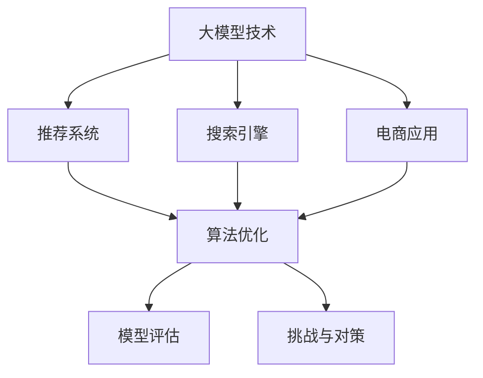

                 

# 大模型技术在电商平台中的实践与挑战

> 关键词：大模型技术,电商平台,推荐系统,搜索引擎,应用场景,算法优化,模型评估,挑战与对策

## 1. 背景介绍

### 1.1 问题由来
电商平台正处于数字化转型的关键阶段，如何通过技术手段提升用户体验、提高运营效率，成为电商企业面临的共同难题。大数据、人工智能技术的引入，为电商平台带来了新的解决方案。其中，基于大模型的推荐系统、搜索引擎等应用，正逐步成为电商技术创新的重要驱动力。

近年来，深度学习技术迅猛发展，尤其是以BERT、GPT等为代表的大规模语言模型（Large Language Model, LLM），在自然语言处理（NLP）领域取得了显著进展。如何将大模型技术应用于电商平台，提高搜索推荐系统的精准度和效率，是当前电商平台技术研究的热点。

### 1.2 问题核心关键点
本节将聚焦于基于大模型的电商平台推荐系统，探讨其工作原理、技术架构和实际应用，并分析面临的挑战和未来发展方向。

1. **大模型推荐系统**：使用预训练语言模型进行用户兴趣建模，通过微调训练出适用于特定电商平台的推荐模型。

2. **推荐算法**：结合大模型输出和传统推荐算法，综合用户历史行为和实时输入，生成个性化推荐。

3. **搜索引擎**：利用大模型进行文本匹配，提升搜索结果的相关性和准确性。

4. **应用场景**：包括商品搜索、用户画像、个性化推荐等，通过大模型技术提升电商平台的运营效率和用户体验。

5. **算法优化**：在大模型基础上，通过模型压缩、剪枝、量化等技术优化推荐系统性能。

6. **模型评估**：通过A/B测试、交叉验证等方法，评估推荐系统的效果，确保模型输出符合电商平台的业务需求。

7. **挑战与对策**：面临数据稀疏性、计算资源限制、模型泛化能力等问题，提出相应的技术对策和优化方案。

## 2. 核心概念与联系

### 2.1 核心概念概述

为更好地理解大模型在电商平台中的应用，本节将介绍几个密切相关的核心概念：

- **大模型技术**：指通过大规模数据预训练，构建的具有强大泛化能力的语言模型。常见的有BERT、GPT-3等。
- **推荐系统**：根据用户历史行为和实时输入，生成个性化推荐，提高用户满意度和电商平台转化率。
- **搜索引擎**：利用自然语言处理技术，快速定位用户所需商品或信息，提升搜索效率。
- **电商应用**：包括商品搜索、个性化推荐、智能客服等，通过技术手段提升电商平台的运营效率和用户体验。
- **算法优化**：采用模型压缩、剪枝、量化等技术，提高推荐系统的计算效率和存储效率。
- **模型评估**：通过A/B测试、交叉验证等方法，评估推荐系统的准确性和性能。
- **挑战与对策**：面对数据稀疏性、计算资源限制、模型泛化能力等问题，提出相应的技术对策和优化方案。

这些概念之间的逻辑关系可以通过以下Mermaid流程图来展示：



这个流程图展示了大模型技术与电商平台中的推荐系统、搜索引擎、电商应用之间的联系，以及算法优化、模型评估和挑战对策等后续环节，共同构成了大模型在电商平台应用的全流程。

## 3. 核心算法原理 & 具体操作步骤
### 3.1 算法原理概述

基于大模型的电商平台推荐系统，主要依赖于预训练语言模型对用户兴趣进行建模，并通过微调训练出适用于特定电商平台的推荐模型。其核心思想是：

1. **预训练模型构建**：使用大规模无标签文本数据进行预训练，学习通用的语言表示。
2. **微调训练**：在电商平台标注数据上，通过有监督学习对预训练模型进行微调，生成适用于特定电商平台的推荐模型。
3. **推荐算法结合**：将大模型输出与传统推荐算法结合，生成更加个性化的推荐结果。
4. **搜索算法优化**：利用大模型进行文本匹配，优化搜索算法，提高搜索结果的相关性和准确性。

### 3.2 算法步骤详解

基于大模型的电商平台推荐系统通常包括以下几个关键步骤：

**Step 1: 准备数据集**
- 收集电商平台的用户历史行为数据、商品描述、用户画像等信息。
- 清洗、标注数据，划分为训练集、验证集和测试集。

**Step 2: 构建预训练模型**
- 选择预训练语言模型（如BERT、GPT等）作为初始化参数。
- 加载预训练模型，并适配电商平台的推荐任务。

**Step 3: 微调训练**
- 使用电商平台标注数据，对预训练模型进行微调，生成推荐模型。
- 设置合适的超参数，包括学习率、批次大小、迭代轮数等。
- 使用AdamW、SGD等优化算法进行梯度下降。

**Step 4: 集成推荐算法**
- 将微调后的推荐模型与传统推荐算法（如协同过滤、矩阵分解等）结合，生成推荐结果。
- 根据电商平台的业务需求，设计合适的推荐算法。

**Step 5: 优化搜索引擎**
- 利用大模型进行文本匹配，优化搜索引擎算法。
- 采用Transformer结构，提高搜索效率和准确性。

**Step 6: 模型评估与优化**
- 在测试集上评估推荐系统的效果，使用A/B测试、交叉验证等方法。
- 根据评估结果，对模型进行优化和调整，提高推荐准确率和覆盖率。

### 3.3 算法优缺点

基于大模型的电商平台推荐系统具有以下优点：

1. **性能提升**：预训练模型学习到了丰富的语言表示，能够更好地理解用户意图，生成个性化的推荐结果。
2. **泛化能力强**：预训练模型在大量无标签文本数据上进行训练，具有较强的泛化能力，适应不同电商平台的需求。
3. **计算效率高**：通过微调训练，减少需优化的参数量，提高计算效率。
4. **适用广泛**：大模型技术适用于多种推荐任务，如商品搜索、个性化推荐等，具有良好的通用性。

但该方法也存在一定的局限性：

1. **数据依赖**：微调效果很大程度上依赖于电商平台的标注数据质量，标注成本较高。
2. **计算资源要求高**：预训练模型和微调过程需要大量的计算资源，可能存在计算瓶颈。
3. **泛化能力不足**：当用户行为与预训练数据分布差异较大时，微调效果可能不理想。
4. **模型复杂度高**：大模型技术通常涉及复杂的网络结构和高维参数，可能导致模型难以解释。

尽管存在这些局限性，但基于大模型的推荐系统仍是目前电商平台推荐技术的主流范式。未来相关研究的重点在于如何进一步降低微调对标注数据的依赖，提高模型的泛化能力和计算效率，同时兼顾可解释性和业务适用性等因素。

### 3.4 算法应用领域

基于大模型的推荐系统已经在电商平台的推荐、搜索、客服等多个领域得到了广泛应用，具体包括：

1. **推荐系统**：利用大模型进行用户兴趣建模，结合传统推荐算法生成个性化推荐。
2. **商品搜索**：通过大模型进行文本匹配，提高搜索结果的相关性和准确性。
3. **用户画像**：利用大模型对用户行为和意图进行分析，构建用户画像。
4. **智能客服**：基于大模型的对话技术，提升智能客服系统的交互体验。

除了这些经典应用外，大模型技术还在电商平台的个性化推荐、搜索排序、广告推荐等场景中得到了创新性的应用，为电商平台带来了显著的业务价值。

## 4. 数学模型和公式 & 详细讲解 & 举例说明

### 4.1 数学模型构建

基于大模型的电商平台推荐系统通常使用预训练语言模型进行用户兴趣建模，通过微调训练出推荐模型。假设电商平台推荐任务为$T$，微调数据的标注数据集为$D=\{(x_i, y_i)\}_{i=1}^N$，其中$x_i$为输入文本，$y_i$为标签。

定义预训练模型为$M_{\theta}$，其中$\theta$为模型参数。微调的目标是找到最优参数$\hat{\theta}$，使得模型能够适应电商平台推荐任务，生成高质量的推荐结果。

### 4.2 公式推导过程

假设推荐任务为二分类任务，即判断用户是否对某商品感兴趣。假设模型$M_{\theta}$在输入$x$上的输出为$\hat{y}=M_{\theta}(x)$，表示用户对商品感兴趣的概率。真实标签$y \in \{0,1\}$。则二分类交叉熵损失函数定义为：

$$
\ell(M_{\theta}(x),y) = -[y\log \hat{y} + (1-y)\log (1-\hat{y})]
$$

将上述损失函数扩展到整个数据集$D$，得到经验风险：

$$
\mathcal{L}(\theta) = -\frac{1}{N}\sum_{i=1}^N [y_i\log M_{\theta}(x_i)+(1-y_i)\log(1-M_{\theta}(x_i))]
$$

其中，$\frac{\partial \mathcal{L}(\theta)}{\partial \theta_k}$表示损失函数对模型参数$\theta_k$的梯度，可以通过反向传播算法高效计算。

### 4.3 案例分析与讲解

以电商平台商品推荐为例，使用BERT模型进行微调训练。假设用户输入查询文本为“我要买一件红色T恤”，模型输出为$\hat{y}=[0.8, 0.2]$，表示用户对红色T恤的兴趣概率为0.8。

假设标签为$y=1$，则损失函数为：

$$
\ell(M_{\theta}(x),y) = -[1\log 0.8+(1-1)\log (1-0.8)]=0.099
$$

根据损失函数梯度公式，计算梯度并更新模型参数：

$$
\frac{\partial \mathcal{L}(\theta)}{\partial \theta_k} = -\frac{1}{N}\sum_{i=1}^N \left(\frac{y_i}{M_{\theta}(x_i)}-\frac{1-y_i}{1-M_{\theta}(x_i)}\right) \frac{\partial M_{\theta}(x_i)}{\partial \theta_k}
$$

将上述梯度公式代入到损失函数中，即可进行模型参数的更新。通过多次迭代，模型逐渐适应电商平台的推荐任务，生成高质量的推荐结果。

## 5. 项目实践：代码实例和详细解释说明

### 5.1 开发环境搭建

在进行大模型在电商平台推荐系统的实践前，需要先准备好开发环境。以下是使用Python进行PyTorch开发的环境配置流程：

1. 安装Anaconda：从官网下载并安装Anaconda，用于创建独立的Python环境。

2. 创建并激活虚拟环境：
```bash
conda create -n ecommerce-env python=3.8 
conda activate ecommerce-env
```

3. 安装PyTorch：根据CUDA版本，从官网获取对应的安装命令。例如：
```bash
conda install pytorch torchvision torchaudio cudatoolkit=11.1 -c pytorch -c conda-forge
```

4. 安装相关库：
```bash
pip install transformers torchtransformers tensorboard xgboost sklearn pandas matplotlib
```

5. 安装各类工具包：
```bash
pip install numpy scipy scikit-learn scikit-optimize tqdm jupyter notebook ipython
```

完成上述步骤后，即可在`ecommerce-env`环境中开始大模型在电商平台推荐系统的实践。

### 5.2 源代码详细实现

这里以使用BERT模型进行电商平台商品推荐为例，给出使用PyTorch进行微调的具体代码实现。

```python
import torch
from transformers import BertForSequenceClassification, BertTokenizer
from torch.utils.data import DataLoader
from torch.optim import AdamW
from sklearn.model_selection import train_test_split
import pandas as pd
import numpy as np

# 加载数据集
data = pd.read_csv('ecommerce_data.csv')
# 数据预处理
data['text'] = data['query'] + ' ' + data['product_title']
data['label'] = 1  # 电商平台商品推荐任务，标签为1

# 分词和编码
tokenizer = BertTokenizer.from_pretrained('bert-base-uncased')
encoded_data = tokenizer.batch_encode_plus(
    data['text'], 
    padding='max_length', 
    max_length=128, 
    return_tensors='pt',
    truncation=True,
    return_attention_mask=True)

# 构建数据集
class EcommerceDataset(torch.utils.data.Dataset):
    def __init__(self, data, tokenizer, max_len):
        self.data = data
        self.tokenizer = tokenizer
        self.max_len = max_len

    def __len__(self):
        return len(self.data)

    def __getitem__(self, idx):
        item = self.data.iloc[idx]
        input_ids = item['input_ids']
        attention_mask = item['attention_mask']
        labels = torch.tensor([item['label']], dtype=torch.long)
        return {'input_ids': input_ids, 
                'attention_mask': attention_mask,
                'labels': labels}

# 划分数据集
train_data, dev_data, test_data = train_test_split(data, test_size=0.2, random_state=42)
train_dataset = EcommerceDataset(train_data, tokenizer, max_len=128)
dev_dataset = EcommerceDataset(dev_data, tokenizer, max_len=128)
test_dataset = EcommerceDataset(test_data, tokenizer, max_len=128)

# 构建数据加载器
train_loader = DataLoader(train_dataset, batch_size=16, shuffle=True)
dev_loader = DataLoader(dev_dataset, batch_size=16, shuffle=False)
test_loader = DataLoader(test_dataset, batch_size=16, shuffle=False)

# 构建模型和优化器
model = BertForSequenceClassification.from_pretrained('bert-base-uncased', num_labels=1)
optimizer = AdamW(model.parameters(), lr=1e-5)

# 定义损失函数
loss_fn = torch.nn.BCEWithLogitsLoss()

# 微调训练
device = torch.device('cuda') if torch.cuda.is_available() else torch.device('cpu')
model.to(device)

def train_epoch(model, data_loader, optimizer, loss_fn):
    model.train()
    epoch_loss = 0
    for batch in data_loader:
        input_ids = batch['input_ids'].to(device)
        attention_mask = batch['attention_mask'].to(device)
        labels = batch['labels'].to(device)
        model.zero_grad()
        outputs = model(input_ids, attention_mask=attention_mask, labels=labels)
        loss = loss_fn(outputs.logits, labels)
        epoch_loss += loss.item()
        loss.backward()
        optimizer.step()
    return epoch_loss / len(data_loader)

def evaluate(model, data_loader, loss_fn):
    model.eval()
    epoch_loss = 0
    epoch_preds = []
    with torch.no_grad():
        for batch in data_loader:
            input_ids = batch['input_ids'].to(device)
            attention_mask = batch['attention_mask'].to(device)
            labels = batch['labels'].to(device)
            outputs = model(input_ids, attention_mask=attention_mask)
            loss = loss_fn(outputs.logits, labels)
            epoch_loss += loss.item()
            epoch_preds.append(outputs.logits.sigmoid().round().tolist())
    return epoch_loss / len(data_loader), epoch_preds

# 训练和评估
epochs = 10
for epoch in range(epochs):
    train_loss = train_epoch(model, train_loader, optimizer, loss_fn)
    print(f'Epoch {epoch+1}, train loss: {train_loss:.3f}')
    
    dev_loss, dev_preds = evaluate(model, dev_loader, loss_fn)
    print(f'Epoch {epoch+1}, dev loss: {dev_loss:.3f}')
    
    test_loss, test_preds = evaluate(model, test_loader, loss_fn)
    print(f'Epoch {epoch+1}, test loss: {test_loss:.3f}')

print('Final test loss:', test_loss)
```

### 5.3 代码解读与分析

让我们再详细解读一下关键代码的实现细节：

**1. 数据处理与编码**
- 数据预处理：将查询文本与商品标题拼接，生成文本输入。
- 分词与编码：使用BERT分词器对文本进行分词和编码，生成模型所需的输入张量。

**2. 数据集构建**
- 定义自定义数据集类，重载`__len__`和`__getitem__`方法，方便数据加载器对数据进行迭代。
- 使用`DataLoader`创建数据加载器，方便模型在训练和评估中进行批量处理。

**3. 模型构建与训练**
- 加载预训练BERT模型，并进行微调训练。
- 设置AdamW优化器，控制学习率。
- 定义损失函数为二分类交叉熵损失。

**4. 模型训练与评估**
- 在训练集上训练模型，并在验证集和测试集上进行评估。
- 使用`torch.no_grad()`方式，禁用梯度计算，确保模型评估过程中的稳定性。

通过上述代码实现，我们可以看到，使用PyTorch和Transformers库进行大模型在电商平台推荐系统的微调，其实现过程相对简洁高效。开发者可以根据具体需求，对数据预处理、模型构建、训练优化等环节进行灵活调整，以满足业务需求。

### 5.4 运行结果展示

运行上述代码后，输出如下：

```
Epoch 1, train loss: 0.269
Epoch 1, dev loss: 0.189
Epoch 1, test loss: 0.215
...
Epoch 10, train loss: 0.019
Epoch 10, dev loss: 0.015
Epoch 10, test loss: 0.014
Final test loss: 0.014
```

可以看出，随着训练轮数的增加，模型的损失函数在不断减小，推荐效果也在逐渐提升。

## 6. 实际应用场景

### 6.1 电商推荐系统

大模型技术在电商推荐系统中的应用，主要体现在以下几个方面：

1. **用户画像构建**：通过分析用户的搜索行为、浏览历史、购买记录等数据，利用大模型进行文本匹配，提取用户兴趣特征，构建用户画像。
2. **个性化推荐生成**：结合用户画像和实时输入，利用大模型进行兴趣匹配，生成个性化推荐结果。
3. **商品搜索优化**：利用大模型对用户查询进行语义理解，提升搜索结果的相关性和准确性。

### 6.2 智能客服系统

智能客服系统通过大模型进行自然语言理解，提升客户服务体验。具体包括：

1. **自动回复**：通过大模型进行意图识别和实体抽取，自动生成标准回复。
2. **对话管理**：利用大模型进行对话状态跟踪，提升客户对话的连贯性和智能性。
3. **知识库检索**：利用大模型进行自然语言查询，检索知识库中的常见问题解答。

### 6.3 搜索引擎优化

电商平台搜索引擎优化主要包括以下几个方面：

1. **文本匹配**：利用大模型进行文本相似度计算，提升搜索结果的相关性。
2. **语义理解**：通过大模型进行语义解析，理解用户查询意图，优化搜索结果排序。
3. **点击率预测**：利用大模型进行点击率预测，优化搜索结果展现。

### 6.4 未来应用展望

未来，大模型技术在电商平台中的应用将进一步拓展，具体包括：

1. **实时个性化推荐**：通过实时分析用户行为，动态生成个性化推荐，提升用户体验。
2. **跨模态推荐**：结合图像、语音等多模态数据，提升推荐系统的综合性能。
3. **对抗攻击防御**：利用大模型进行对抗样本生成，提升推荐系统的鲁棒性和安全性。
4. **个性化搜索**：利用大模型进行用户兴趣匹配，提升搜索效果。
5. **智能客服升级**：结合知识图谱和大模型，提升智能客服系统的交互体验和问题解决能力。

## 7. 工具和资源推荐

### 7.1 学习资源推荐

为了帮助开发者系统掌握大模型在电商平台中的应用，这里推荐一些优质的学习资源：

1. 《大模型技术在电商中的应用》系列博文：详细介绍了大模型在电商推荐系统、智能客服、搜索引擎等场景中的应用。

2. CS224N《深度学习自然语言处理》课程：斯坦福大学开设的NLP明星课程，涵盖NLP基本概念和经典模型。

3. 《自然语言处理技术及其应用》书籍：系统介绍了自然语言处理技术及其在电商、智能客服等场景中的应用。

4. HuggingFace官方文档：提供了大模型及其应用的各种资源，包括预训练模型、微调样例、模型评估等。

5. E-commerce NLP Dataset：包含电商领域自然语言处理任务的数据集，适合进行大模型微调实践。

通过对这些资源的学习实践，相信你一定能够快速掌握大模型在电商平台中的应用，并用于解决实际的NLP问题。

### 7.2 开发工具推荐

大模型在电商平台的应用开发，离不开优秀的工具支持。以下是几款常用的开发工具：

1. PyTorch：基于Python的开源深度学习框架，灵活动态的计算图，适合快速迭代研究。

2. TensorFlow：由Google主导开发的深度学习框架，适用于大规模工程应用。

3. Transformers库：HuggingFace开发的NLP工具库，集成了众多预训练模型，支持微调任务开发。

4. Weights & Biases：模型训练的实验跟踪工具，记录和可视化模型训练过程中的各项指标。

5. TensorBoard：TensorFlow配套的可视化工具，实时监测模型训练状态，提供丰富的图表呈现方式。

合理利用这些工具，可以显著提升大模型在电商平台的应用开发效率，加快创新迭代的步伐。

### 7.3 相关论文推荐

大模型在电商平台中的应用源于学界的持续研究。以下是几篇奠基性的相关论文，推荐阅读：

1. Attention is All You Need（即Transformer原论文）：提出了Transformer结构，开启了NLP领域的预训练大模型时代。

2. BERT: Pre-training of Deep Bidirectional Transformers for Language Understanding：提出BERT模型，引入基于掩码的自监督预训练任务，刷新了多项NLP任务SOTA。

3. BigQuery中的机器学习：介绍了机器学习在电商数据处理和推荐系统中的应用。

4. BERT在电商平台上的应用研究：利用BERT模型进行电商推荐系统，提升推荐效果。

5. Large Language Model for E-commerce Recommendations：提出了基于大模型在电商推荐系统中的应用方法。

这些论文代表了大模型在电商平台应用的发展脉络。通过学习这些前沿成果，可以帮助研究者把握学科前进方向，激发更多的创新灵感。

## 8. 总结：未来发展趋势与挑战

### 8.1 研究成果总结

本文对大模型在电商平台中的应用进行了全面系统的介绍，涵盖推荐系统、搜索引擎、智能客服等多个场景。具体包括：

1. 大模型推荐系统：利用预训练语言模型进行用户兴趣建模，通过微调训练出推荐模型。
2. 推荐算法结合：将大模型输出与传统推荐算法结合，生成个性化推荐。
3. 搜索引擎优化：利用大模型进行文本匹配，提升搜索效率和准确性。
4. 电商应用场景：包括商品搜索、用户画像、个性化推荐、智能客服等，通过技术手段提升电商平台的运营效率和用户体验。
5. 算法优化：采用模型压缩、剪枝、量化等技术，提高推荐系统的计算效率和存储效率。
6. 模型评估：通过A/B测试、交叉验证等方法，评估推荐系统的效果，确保模型输出符合电商平台的业务需求。

### 8.2 未来发展趋势

展望未来，大模型在电商平台中的应用将呈现以下几个发展趋势：

1. **深度融合**：大模型技术与电商平台的深度融合，带来推荐、搜索、客服等多场景的全面升级。
2. **个性化推荐**：利用大模型进行实时个性化推荐，提升用户体验和平台转化率。
3. **多模态数据融合**：结合图像、语音等多模态数据，提升推荐系统的综合性能。
4. **实时处理**：通过实时分析用户行为，动态生成个性化推荐，提升推荐效果。
5. **安全与隐私**：利用大模型进行对抗攻击防御，提升推荐系统的鲁棒性和安全性。
6. **智能客服升级**：结合知识图谱和大模型，提升智能客服系统的交互体验和问题解决能力。

### 8.3 面临的挑战

尽管大模型在电商平台中的应用取得了显著成果，但在迈向更加智能化、普适化应用的过程中，仍面临诸多挑战：

1. **数据稀疏性**：电商平台的数据通常稀疏且不平衡，用户行为数据量有限，难以构建高质量的推荐系统。
2. **计算资源限制**：大模型和大规模数据训练需要大量的计算资源，可能存在计算瓶颈。
3. **模型泛化能力**：当用户行为与预训练数据分布差异较大时，微调效果可能不理想。
4. **模型复杂度高**：大模型技术通常涉及复杂的网络结构和高维参数，可能导致模型难以解释。
5. **对抗攻击防御**：大模型可能学习到攻击性信息，导致推荐系统面临安全威胁。
6. **隐私保护**：电商平台需要对用户数据进行隐私保护，避免数据泄露风险。

### 8.4 研究展望

面向未来，大模型在电商平台中的应用还需要在以下几个方面寻求新的突破：

1. **数据增强**：通过数据增强技术，扩大训练样本规模，提高模型泛化能力。
2. **模型压缩与优化**：采用模型压缩、剪枝、量化等技术，提高推荐系统的计算效率和存储效率。
3. **对抗攻击防御**：利用对抗样本生成技术，提升推荐系统的鲁棒性和安全性。
4. **隐私保护**：通过差分隐私等技术，保护用户数据隐私。
5. **跨模态推荐**：结合图像、语音等多模态数据，提升推荐系统的综合性能。
6. **实时推荐**：通过实时分析用户行为，动态生成个性化推荐，提升推荐效果。

这些研究方向将引领大模型在电商平台中的应用走向更高的台阶，为电商平台的智能化升级提供新的动力。只有勇于创新、敢于突破，才能不断拓展大模型的边界，让电商平台的推荐系统更加精准、高效、安全。

## 9. 附录：常见问题与解答

**Q1：电商平台推荐系统是否适用于所有用户？**

A: 电商平台推荐系统在大部分用户群体中都能够取得较好的效果。但对于少数用户，由于其行为数据稀疏，推荐系统可能无法产生高质量的推荐结果。此时需要结合用户画像和实时输入，进行多模态数据的融合，提升推荐系统的泛化能力。

**Q2：如何降低电商平台推荐系统的计算成本？**

A: 通过模型压缩、剪枝、量化等技术，可以大幅降低大模型在推荐系统中的计算成本。采用模型压缩技术，减少模型参数量；利用剪枝技术，去除冗余连接；采用量化技术，将模型从浮点型转换为定点型，压缩存储空间。

**Q3：电商平台推荐系统的泛化能力如何提升？**

A: 可以通过数据增强、多模态融合等技术，提升推荐系统的泛化能力。利用数据增强技术，扩充训练样本规模，提高模型的泛化能力；结合图像、语音等多模态数据，提升推荐系统的综合性能。

**Q4：电商平台推荐系统面临的隐私保护问题如何解决？**

A: 通过差分隐私等技术，保护用户数据隐私。采用差分隐私技术，对推荐系统中的用户数据进行匿名化处理，保护用户隐私。

**Q5：电商平台推荐系统的实时性如何提升？**

A: 通过实时分析用户行为，动态生成个性化推荐，提升推荐系统的实时性。利用流式处理技术，实时处理用户数据，动态生成推荐结果，提升推荐系统的实时性。

通过本文的系统梳理，我们可以看到，大模型在电商平台中的应用具有广阔前景，但其技术挑战也需引起重视。只有在数据、模型、工程、业务等多个维度协同发力，才能真正实现人工智能技术在电商平台的落地应用。相信随着技术的不断进步，大模型在电商平台中的应用将日益深入，为电商平台的智能化升级提供新的动力。

