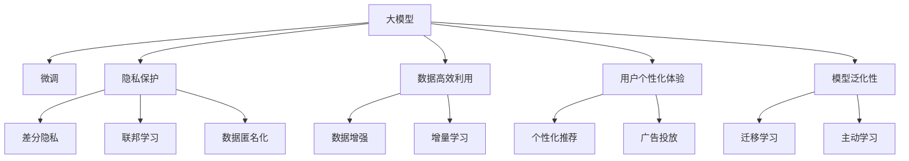

                 

# 大模型技术在电商平台用户兴趣探索与利用权衡中的创新

## 1. 背景介绍

### 1.1 问题由来

在电商平台上，用户的兴趣和行为习惯对购物决策具有重要影响。为了更好地理解和利用这些信息，电商平台通常会收集用户的行为数据，包括浏览记录、点击历史、购买行为等，以期精准推荐商品，提升用户满意度和平台收益。然而，如何在用户兴趣探索与利用之间取得平衡，既不侵犯用户隐私，又能有效挖掘数据价值，是一个颇具挑战性的问题。

近年来，大模型技术在自然语言处理(NLP)、计算机视觉(CV)等领域的迅猛发展，为电商平台的用户兴趣探索与利用带来了新的契机。通过预训练大模型，电商平台可以在用户数据上微调，学习到用户兴趣和行为的表示，从而进行个性化的推荐和广告投放。但如何在数据采集、模型训练、结果应用等多个环节中兼顾隐私保护、用户兴趣探索与利用之间的平衡，是业内亟需探讨的问题。

### 1.2 问题核心关键点

大模型技术在电商平台的应用主要体现在用户兴趣探索与利用的权衡上，具体包括：

- **隐私保护**：在用户数据收集和处理过程中，如何确保用户隐私不被泄露，成为电商平台的重点关注点。
- **数据高效利用**：如何从用户数据中高效挖掘出有价值的信息，以提高推荐和广告效果。
- **用户个性化体验**：如何在不侵犯用户隐私的前提下，个性化推荐商品和广告，提升用户体验。
- **模型泛化性**：如何构建具有泛化能力的大模型，以应对用户兴趣的变化和市场需求的波动。

## 2. 核心概念与联系

### 2.1 核心概念概述

为深入理解大模型技术在电商平台的应用，本节将介绍几个关键概念：

- **大模型(Large Model)**：指具有数十亿甚至数百亿参数的大型深度学习模型，如BERT、GPT-3、T5等。这些模型通过在海量数据上进行预训练，学习到丰富的知识表示，可以用于各种NLP和CV任务。
- **微调(Fine-tuning)**：指在大模型上进行有监督学习，利用小规模标注数据，调整模型参数以适应特定任务的过程。在电商平台的兴趣探索与利用中，常用于学习用户兴趣表示，提升推荐和广告效果。
- **隐私保护(Privacy Protection)**：指在数据处理和模型训练过程中，采取多种技术手段，保护用户隐私不被泄露。
- **数据高效利用(Data Efficiency)**：指在数据规模有限的情况下，通过有效的数据增强和模型设计，最大化地挖掘数据价值。
- **用户个性化体验(User Experience)**：指根据用户兴趣和行为，提供个性化的商品推荐和广告，提升用户满意度和平台收益。
- **模型泛化性(Generalization)**：指模型能够适应新的、未见过的数据，并输出稳定的预测结果。

这些概念之间的联系通过以下Mermaid流程图展示：



这个流程图展示了大模型技术在电商平台中的应用框架：

1. 大模型通过预训练获得丰富的知识表示。
2. 在微调过程中，利用小规模标注数据，调整模型参数以适应特定任务。
3. 在隐私保护环节，采取差分隐私、联邦学习等技术手段，保护用户隐私。
4. 通过数据增强、增量学习等技术，高效利用有限的数据。
5. 利用个性化推荐和广告投放，提升用户个性化体验。
6. 通过迁移学习和主动学习，提升模型的泛化能力，适应新的数据分布。

## 3. 核心算法原理 & 具体操作步骤
### 3.1 算法原理概述

大模型在电商平台用户兴趣探索与利用中的应用，本质上是一个在特定任务上进行微调的过程。其核心思想是：利用预训练大模型学习用户兴趣的表示，通过有监督学习调整模型参数，以适应推荐和广告投放等具体任务。

具体而言，假设大模型为 $M_{\theta}$，其中 $\theta$ 为模型参数。给定电商平台的用户行为数据集 $D=\{(x_i, y_i)\}_{i=1}^N$，其中 $x_i$ 为用户的浏览记录、点击历史等特征，$y_i$ 为用户的购买决策或兴趣偏好。微调的目标是找到新的模型参数 $\hat{\theta}$，使得模型在新的任务上能够更准确地预测用户行为。

微调的过程通常包括以下几个步骤：

1. **数据准备**：收集和预处理用户行为数据，划分为训练集、验证集和测试集。
2. **模型选择**：选择合适的预训练大模型，如BERT、GPT等。
3. **任务适配**：根据推荐和广告投放等具体任务，设计合适的输出层和损失函数。
4. **超参数设置**：选择合适的优化算法、学习率、批大小等超参数。
5. **模型训练**：利用训练集进行模型训练，通过反向传播算法更新模型参数。
6. **模型评估**：在验证集上评估模型性能，防止过拟合。
7. **模型应用**：在测试集上测试模型效果，部署到推荐和广告系统中。

### 3.2 算法步骤详解

具体到电商平台的推荐和广告投放任务，微调过程可以分为以下几个关键步骤：

**Step 1: 数据准备**
- 收集用户的浏览记录、点击历史、购买决策等行为数据，分为训练集、验证集和测试集。
- 对数据进行预处理，包括数据清洗、特征提取、数据归一化等步骤。

**Step 2: 模型选择**
- 选择合适的预训练大模型，如BERT、GPT-3等。
- 加载预训练模型的权重，作为微调的初始参数。

**Step 3: 任务适配**
- 设计推荐系统的输出层，通常为全连接层和softmax激活函数，用于预测用户对商品的兴趣。
- 设计广告投放系统的输出层，可以是点击率预测或转化率预测，使用不同的损失函数。

**Step 4: 超参数设置**
- 选择合适的优化算法，如Adam、SGD等。
- 设置学习率、批大小、迭代轮数等超参数。
- 选择正则化技术，如L2正则、Dropout等。

**Step 5: 模型训练**
- 将训练集数据分批次输入模型，前向传播计算损失函数。
- 反向传播计算参数梯度，根据设定的优化算法和学习率更新模型参数。
- 周期性在验证集上评估模型性能，根据性能指标决定是否触发Early Stopping。
- 重复上述步骤直至满足预设的迭代轮数或Early Stopping条件。

**Step 6: 模型评估**
- 在验证集上评估微调后的模型效果，如准确率、召回率、F1值等。
- 根据评估结果调整超参数，重新进行训练。

**Step 7: 模型应用**
- 在测试集上测试微调后的模型效果，评估推荐和广告投放的性能。
- 将模型集成到推荐和广告系统中，进行实时预测和推荐。

### 3.3 算法优缺点

大模型技术在电商平台用户兴趣探索与利用中的微调方法具有以下优点：

- **高效利用数据**：大模型可以通过微调快速适应新任务，在有限的数据下也能取得较好的性能。
- **泛化能力强**：预训练大模型能够学习到通用的语言表示，具有较强的泛化能力，可以应对新用户和新场景。
- **推荐精度高**：通过微调学习用户兴趣表示，能够提升推荐和广告的精准度。

同时，该方法也存在以下缺点：

- **计算资源需求高**：大模型训练和微调需要强大的计算资源，包括GPU/TPU等高性能设备。
- **模型复杂度高**：大模型的结构和参数复杂，不易理解和调试。
- **隐私风险**：在用户数据处理过程中，可能存在隐私泄露的风险。

尽管存在这些缺点，但大模型技术在电商平台的应用，已经展示了其在用户兴趣探索与利用中的巨大潜力。未来，通过进一步的技术改进和应用优化，有望克服这些缺点，进一步推动电商平台的智能化发展。

### 3.4 算法应用领域

大模型技术在电商平台的应用广泛，涵盖推荐系统、广告投放、用户行为分析等多个领域，具体如下：

- **推荐系统**：利用微调学习用户兴趣表示，进行商品推荐。例如，通过预测用户对商品的评分或兴趣概率，生成推荐列表。
- **广告投放**：利用微调学习用户点击或转化的概率，进行广告投放优化。例如，预测用户点击广告的概率，调整广告投放策略。
- **用户行为分析**：利用微调学习用户行为模式，进行用户画像和行为预测。例如，分析用户的购物偏好，预测其未来的购物行为。

除了上述这些经典应用外，大模型技术还可以应用于电商平台的搜索系统、客服系统、库存管理等多个环节，为电商平台带来全方位的智能化提升。

## 4. 数学模型和公式 & 详细讲解
### 4.1 数学模型构建

在本节中，我们将使用数学语言对大模型在电商平台用户兴趣探索与利用中的应用进行更严谨的描述。

假设电商平台推荐系统的大模型为 $M_{\theta}$，输入为用户的浏览记录 $x_i$，输出为对商品的兴趣表示 $y_i \in [0,1]$。在微调过程中，我们需要设计损失函数 $\mathcal{L}(\theta)$ 来衡量模型的预测输出与真实标签 $y_i$ 之间的差异。

微调的目标是最小化经验风险：

$$
\mathcal{L}(\theta) = \frac{1}{N}\sum_{i=1}^N \ell(y_i, M_{\theta}(x_i))
$$

其中 $\ell(y_i, M_{\theta}(x_i))$ 为损失函数，通常使用交叉熵损失函数：

$$
\ell(y_i, M_{\theta}(x_i)) = -y_i \log M_{\theta}(x_i) - (1-y_i) \log (1-M_{\theta}(x_i))
$$

在得到损失函数梯度后，使用梯度下降等优化算法更新模型参数 $\theta$：

$$
\theta \leftarrow \theta - \eta \nabla_{\theta}\mathcal{L}(\theta)
$$

其中 $\eta$ 为学习率。

### 4.2 公式推导过程

以推荐系统为例，我们推导一下交叉熵损失函数的梯度。

假设模型 $M_{\theta}$ 在输入 $x_i$ 上的输出为 $\hat{y}_i=M_{\theta}(x_i) \in [0,1]$，表示用户对商品的兴趣概率。真实标签 $y_i \in \{0,1\}$。则交叉熵损失函数为：

$$
\ell(y_i, M_{\theta}(x_i)) = -y_i \log M_{\theta}(x_i) - (1-y_i) \log (1-M_{\theta}(x_i))
$$

在微调过程中，损失函数可以写成：

$$
\mathcal{L}(\theta) = -\frac{1}{N}\sum_{i=1}^N [y_i \log M_{\theta}(x_i)+(1-y_i)\log(1-M_{\theta}(x_i))]
$$

根据链式法则，损失函数对参数 $\theta_k$ 的梯度为：

$$
\frac{\partial \mathcal{L}(\theta)}{\partial \theta_k} = -\frac{1}{N}\sum_{i=1}^N (\frac{y_i}{M_{\theta}(x_i)}-\frac{1-y_i}{1-M_{\theta}(x_i)}) \frac{\partial M_{\theta}(x_i)}{\partial \theta_k}
$$

其中 $\frac{\partial M_{\theta}(x_i)}{\partial \theta_k}$ 为模型在输入 $x_i$ 上的梯度，可以使用自动微分技术计算。

### 4.3 案例分析与讲解

以下以电商平台推荐系统的微调为例，详细讲解微调过程的各个环节。

假设电商平台有一个推荐系统，用户通过浏览、点击商品页面，生成行为数据 $x_i$。推荐系统需要预测用户对商品 $j$ 的兴趣 $y_{ij}$，即用户是否会对商品 $j$ 感兴趣。

首先，收集历史用户的浏览记录、点击历史等行为数据，划分为训练集、验证集和测试集。例如，可以收集100万条用户浏览记录，其中60万条作为训练集，20万条作为验证集，20万条作为测试集。

然后，选择合适的预训练大模型，如BERT，作为推荐系统的基础模型。将预训练模型的权重加载到推荐系统中，作为微调的初始参数。

接着，设计推荐系统的输出层，通常为全连接层和softmax激活函数，用于预测用户对商品的兴趣。例如，可以使用一个64维的向量表示用户的兴趣，使用softmax函数将向量转换为概率分布。

在训练过程中，使用交叉熵损失函数作为微调的损失函数：

$$
\mathcal{L}(\theta) = -\frac{1}{N}\sum_{i=1}^N \sum_{j=1}^M y_{ij} \log M_{\theta}(x_i, j) + (1-y_{ij}) \log (1-M_{\theta}(x_i, j))
$$

其中 $M_{\theta}(x_i, j)$ 为模型在输入 $x_i$ 下对商品 $j$ 的兴趣概率。

在模型训练过程中，使用Adam优化算法更新模型参数 $\theta$。同时，使用L2正则、Dropout等正则化技术，防止过拟合。

在模型评估过程中，使用验证集上的准确率、召回率、F1值等指标，评估模型的性能。例如，在验证集上，准确率定义为：

$$
\text{Accuracy} = \frac{1}{N} \sum_{i=1}^N \sum_{j=1}^M \mathbb{I}(y_{ij} = 1) \mathbb{I}(M_{\theta}(x_i, j) > 0.5)
$$

其中 $\mathbb{I}(\cdot)$ 为示性函数，表示预测结果是否正确。

最后，在测试集上测试微调后的模型效果，评估推荐系统的推荐精度。例如，在测试集上，召回率定义为：

$$
\text{Recall} = \frac{1}{N} \sum_{i=1}^N \sum_{j=1}^M \mathbb{I}(y_{ij} = 1) \mathbb{I}(M_{\theta}(x_i, j) > 0.5)
$$

测试集上，准确率、召回率、F1值等指标，可以用来评估推荐系统的性能。例如，可以使用Kappa系数来衡量推荐系统的推荐效果：

$$
\text{Kappa} = \frac{P(C_0)P(C_1) \sum_{i=1}^N \sum_{j=1}^M \mathbb{I}(y_{ij} = 1) \mathbb{I}(C_j = C_M) - P(C_M) \sum_{i=1}^N \sum_{j=1}^M \mathbb{I}(y_{ij} = 1) \mathbb{I}(C_j = C_M)}
$$

其中 $P(C_0)$ 和 $P(C_1)$ 分别为不推荐和推荐用户数在所有用户中的比例。

通过以上步骤，即可构建一个基于大模型的电商平台推荐系统。

## 5. 项目实践：代码实例和详细解释说明
### 5.1 开发环境搭建

在进行电商平台推荐系统的微调实践前，我们需要准备好开发环境。以下是使用Python进行PyTorch开发的环境配置流程：

1. 安装Anaconda：从官网下载并安装Anaconda，用于创建独立的Python环境。

2. 创建并激活虚拟环境：
```bash
conda create -n pytorch-env python=3.8 
conda activate pytorch-env
```

3. 安装PyTorch：根据CUDA版本，从官网获取对应的安装命令。例如：
```bash
conda install pytorch torchvision torchaudio cudatoolkit=11.1 -c pytorch -c conda-forge
```

4. 安装Transformers库：
```bash
pip install transformers
```

5. 安装各类工具包：
```bash
pip install numpy pandas scikit-learn matplotlib tqdm jupyter notebook ipython
```

完成上述步骤后，即可在`pytorch-env`环境中开始微调实践。

### 5.2 源代码详细实现

下面我们以电商平台推荐系统的微调为例，给出使用Transformers库对BERT模型进行微调的PyTorch代码实现。

首先，定义推荐系统的数据处理函数：

```python
from transformers import BertTokenizer
from torch.utils.data import Dataset
import torch

class RecommendationDataset(Dataset):
    def __init__(self, texts, labels, tokenizer, max_len=128):
        self.texts = texts
        self.labels = labels
        self.tokenizer = tokenizer
        self.max_len = max_len
        
    def __len__(self):
        return len(self.texts)
    
    def __getitem__(self, item):
        text = self.texts[item]
        label = self.labels[item]
        
        encoding = self.tokenizer(text, return_tensors='pt', max_length=self.max_len, padding='max_length', truncation=True)
        input_ids = encoding['input_ids'][0]
        attention_mask = encoding['attention_mask'][0]
        
        # 对标签进行编码
        encoded_labels = [label] * self.max_len
        labels = torch.tensor(encoded_labels, dtype=torch.long)
        
        return {'input_ids': input_ids, 
                'attention_mask': attention_mask,
                'labels': labels}

# 标签编码
label2id = {'0': 0, '1': 1}
id2label = {v: k for k, v in label2id.items()}

# 创建dataset
tokenizer = BertTokenizer.from_pretrained('bert-base-cased')

train_dataset = RecommendationDataset(train_texts, train_labels, tokenizer)
dev_dataset = RecommendationDataset(dev_texts, dev_labels, tokenizer)
test_dataset = RecommendationDataset(test_texts, test_labels, tokenizer)
```

然后，定义模型和优化器：

```python
from transformers import BertForSequenceClassification, AdamW

model = BertForSequenceClassification.from_pretrained('bert-base-cased', num_labels=len(label2id))

optimizer = AdamW(model.parameters(), lr=2e-5)
```

接着，定义训练和评估函数：

```python
from torch.utils.data import DataLoader
from tqdm import tqdm
from sklearn.metrics import classification_report

device = torch.device('cuda') if torch.cuda.is_available() else torch.device('cpu')
model.to(device)

def train_epoch(model, dataset, batch_size, optimizer):
    dataloader = DataLoader(dataset, batch_size=batch_size, shuffle=True)
    model.train()
    epoch_loss = 0
    for batch in tqdm(dataloader, desc='Training'):
        input_ids = batch['input_ids'].to(device)
        attention_mask = batch['attention_mask'].to(device)
        labels = batch['labels'].to(device)
        model.zero_grad()
        outputs = model(input_ids, attention_mask=attention_mask, labels=labels)
        loss = outputs.loss
        epoch_loss += loss.item()
        loss.backward()
        optimizer.step()
    return epoch_loss / len(dataloader)

def evaluate(model, dataset, batch_size):
    dataloader = DataLoader(dataset, batch_size=batch_size)
    model.eval()
    preds, labels = [], []
    with torch.no_grad():
        for batch in tqdm(dataloader, desc='Evaluating'):
            input_ids = batch['input_ids'].to(device)
            attention_mask = batch['attention_mask'].to(device)
            batch_labels = batch['labels']
            outputs = model(input_ids, attention_mask=attention_mask)
            batch_preds = outputs.logits.argmax(dim=2).to('cpu').tolist()
            batch_labels = batch_labels.to('cpu').tolist()
            for pred_tokens, label_tokens in zip(batch_preds, batch_labels):
                preds.append(pred_tokens[:len(label_tokens)])
                labels.append(label_tokens)
                
    print(classification_report(labels, preds))
```

最后，启动训练流程并在测试集上评估：

```python
epochs = 5
batch_size = 16

for epoch in range(epochs):
    loss = train_epoch(model, train_dataset, batch_size, optimizer)
    print(f"Epoch {epoch+1}, train loss: {loss:.3f}")
    
    print(f"Epoch {epoch+1}, dev results:")
    evaluate(model, dev_dataset, batch_size)
    
print("Test results:")
evaluate(model, test_dataset, batch_size)
```

以上就是使用PyTorch对BERT进行电商平台推荐系统微调的完整代码实现。可以看到，得益于Transformers库的强大封装，我们可以用相对简洁的代码完成BERT模型的加载和微调。

### 5.3 代码解读与分析

让我们再详细解读一下关键代码的实现细节：

**RecommendationDataset类**：
- `__init__`方法：初始化文本、标签、分词器等关键组件。
- `__len__`方法：返回数据集的样本数量。
- `__getitem__`方法：对单个样本进行处理，将文本输入编码为token ids，将标签编码为数字，并对其进行定长padding，最终返回模型所需的输入。

**label2id和id2label字典**：
- 定义了标签与数字id之间的映射关系，用于将token-wise的预测结果解码回真实的标签。

**训练和评估函数**：
- 使用PyTorch的DataLoader对数据集进行批次化加载，供模型训练和推理使用。
- 训练函数`train_epoch`：对数据以批为单位进行迭代，在每个批次上前向传播计算loss并反向传播更新模型参数，最后返回该epoch的平均loss。
- 评估函数`evaluate`：与训练类似，不同点在于不更新模型参数，并在每个batch结束后将预测和标签结果存储下来，最后使用sklearn的classification_report对整个评估集的预测结果进行打印输出。

**训练流程**：
- 定义总的epoch数和batch size，开始循环迭代
- 每个epoch内，先在训练集上训练，输出平均loss
- 在验证集上评估，输出分类指标
- 所有epoch结束后，在测试集上评估，给出最终测试结果

可以看到，PyTorch配合Transformers库使得BERT微调的代码实现变得简洁高效。开发者可以将更多精力放在数据处理、模型改进等高层逻辑上，而不必过多关注底层的实现细节。

当然，工业级的系统实现还需考虑更多因素，如模型的保存和部署、超参数的自动搜索、更灵活的任务适配层等。但核心的微调范式基本与此类似。

## 6. 实际应用场景
### 6.1 智能推荐系统

电商平台利用大模型技术进行用户兴趣探索与利用，最核心的应用场景就是智能推荐系统。智能推荐系统能够根据用户的历史行为和兴趣，推荐其可能感兴趣的商品，从而提升用户的购物体验和平台的转化率。

在技术实现上，可以收集用户的历史浏览记录、点击历史、购买行为等数据，提取文本特征，在预训练大模型上进行微调。微调后的模型能够学习到用户的兴趣表示，通过预测用户对商品的评分或兴趣概率，生成推荐列表。例如，可以根据用户对商品浏览记录的情感倾向，预测用户对商品的兴趣，生成推荐列表。

### 6.2 用户画像构建

电商平台除了推荐系统，还涉及用户画像的构建。通过分析用户的浏览、点击、购买行为，可以构建用户画像，了解用户的兴趣偏好、消费习惯等信息。这些信息可以用于个性化营销、精准广告投放等场景。

在微调过程中，可以使用用户的浏览记录、点击历史、购买行为等数据，提取文本特征，在预训练大模型上进行微调。微调后的模型能够学习到用户的兴趣表示，从而构建用户画像。例如，可以使用用户的浏览记录文本，预测用户的兴趣标签，构建用户画像。

### 6.3 广告投放优化

电商平台的另一个重要应用场景是广告投放。广告投放需要根据用户的兴趣和行为，精准投放广告，提升广告的点击率和转化率。利用大模型技术进行广告投放优化，可以更高效地获取用户的兴趣表示，从而优化广告投放策略。

在微调过程中，可以使用用户的浏览记录、点击历史、广告点击记录等数据，提取文本特征，在预训练大模型上进行微调。微调后的模型能够学习到用户的兴趣表示，从而优化广告投放策略。例如，可以使用用户的浏览记录文本，预测用户对广告的兴趣，优化广告投放策略。

### 6.4 未来应用展望

随着大模型技术的发展，基于大模型的电商平台推荐系统和广告投放将越来越智能化，覆盖更多的应用场景。

在智慧医疗领域，利用大模型进行用户健康监测，推荐适合用户的医疗产品和药品，提升用户健康管理水平。

在智能教育领域，利用大模型进行个性化教育推荐，推荐适合用户的学习内容和课程，提升用户学习体验。

在智能城市治理中，利用大模型进行用户行为分析，优化城市服务资源配置，提升城市治理水平。

此外，在金融、旅游、文化等多个领域，基于大模型的电商平台推荐系统和广告投放也将不断涌现，为各行业的智能化发展提供新的技术支持。

## 7. 工具和资源推荐
### 7.1 学习资源推荐

为了帮助开发者系统掌握大模型技术在电商平台的应用，这里推荐一些优质的学习资源：

1. 《Transformer from Understanding to Practice》系列博文：由大模型技术专家撰写，深入浅出地介绍了Transformer原理、BERT模型、微调技术等前沿话题。

2. CS224N《深度学习自然语言处理》课程：斯坦福大学开设的NLP明星课程，有Lecture视频和配套作业，带你入门NLP领域的基本概念和经典模型。

3. 《Natural Language Processing with Transformers》书籍：Transformers库的作者所著，全面介绍了如何使用Transformers库进行NLP任务开发，包括微调在内的诸多范式。

4. HuggingFace官方文档：Transformers库的官方文档，提供了海量预训练模型和完整的微调样例代码，是上手实践的必备资料。

5. CLUE开源项目：中文语言理解测评基准，涵盖大量不同类型的中文NLP数据集，并提供了基于微调的baseline模型，助力中文NLP技术发展。

通过对这些资源的学习实践，相信你一定能够快速掌握大模型技术在电商平台的应用，并用于解决实际的NLP问题。
###  7.2 开发工具推荐

高效的开发离不开优秀的工具支持。以下是几款用于大模型技术在电商平台微调开发的常用工具：

1. PyTorch：基于Python的开源深度学习框架，灵活动态的计算图，适合快速迭代研究。大部分预训练语言模型都有PyTorch版本的实现。

2. TensorFlow：由Google主导开发的开源深度学习框架，生产部署方便，适合大规模工程应用。同样有丰富的预训练语言模型资源。

3. Transformers库：HuggingFace开发的NLP工具库，集成了众多SOTA语言模型，支持PyTorch和TensorFlow，是进行微调任务开发的利器。

4. Weights & Biases：模型训练的实验跟踪工具，可以记录和可视化模型训练过程中的各项指标，方便对比和调优。与主流深度学习框架无缝集成。

5. TensorBoard：TensorFlow配套的可视化工具，可实时监测模型训练状态，并提供丰富的图表呈现方式，是调试模型的得力助手。

6. Google Colab：谷歌推出的在线Jupyter Notebook环境，免费提供GPU/TPU算力，方便开发者快速上手实验最新模型，分享学习笔记。

合理利用这些工具，可以显著提升大模型技术在电商平台微调任务的开发效率，加快创新迭代的步伐。

### 7.3 相关论文推荐

大模型技术在电商平台的应用源于学界的持续研究。以下是几篇奠基性的相关论文，推荐阅读：

1. Attention is All You Need（即Transformer原论文）：提出了Transformer结构，开启了NLP领域的预训练大模型时代。

2. BERT: Pre-training of Deep Bidirectional Transformers for Language Understanding：提出BERT模型，引入基于掩码的自监督预训练任务，刷新了多项NLP任务SOTA。

3. Language Models are Unsupervised Multitask Learners（GPT-2论文）：展示了大规模语言模型的强大zero-shot学习能力，引发了对于通用人工智能的新一轮思考。

4. Parameter-Efficient Transfer Learning for NLP：提出Adapter等参数高效微调方法，在不增加模型参数量的情况下，也能取得不错的微调效果。

5. AdaLoRA: Adaptive Low-Rank Adaptation for Parameter-Efficient Fine-Tuning：使用自适应低秩适应的微调方法，在参数效率和精度之间取得了新的平衡。

6. Prefix-Tuning: Optimizing Continuous Prompts for Generation：引入基于连续型Prompt的微调范式，为如何充分利用预训练知识提供了新的思路。

这些论文代表了大模型技术在电商平台的应用发展脉络。通过学习这些前沿成果，可以帮助研究者把握学科前进方向，激发更多的创新灵感。

## 8. 总结：未来发展趋势与挑战

### 8.1 总结

本文对大模型技术在电商平台用户兴趣探索与利用权衡中的应用进行了全面系统的介绍。首先阐述了大模型技术和微调方法的研究背景和意义，明确了其在电商平台的独特价值。其次，从原理到实践，详细讲解了微调过程的数学原理和关键步骤，给出了微调任务开发的完整代码实例。同时，本文还探讨了微调方法在智能推荐、用户画像、广告投放等多个电商场景中的应用，展示了微调范式的巨大潜力。此外，本文精选了微调技术的各类学习资源，力求为读者提供全方位的技术指引。

通过本文的系统梳理，可以看到，大模型技术在电商平台的应用前景广阔，可以极大地提升电商平台的智能化水平。未来，随着大模型技术的进一步发展和应用，电商平台的推荐系统、广告投放、用户画像构建等将迎来新的突破，为电商行业带来更加智能化的体验和服务。

### 8.2 未来发展趋势

展望未来，大模型技术在电商平台的应用将呈现以下几个发展趋势：

1. **模型规模持续增大**：随着算力成本的下降和数据规模的扩张，预训练大模型参数量将持续增长。超大规模语言模型蕴含的丰富知识表示，将为电商平台提供更强大的智能推荐和广告投放能力。

2. **微调方法日趋多样**：除了传统的全参数微调外，未来会涌现更多参数高效的微调方法，如Adapter、Prefix等，在节省计算资源的同时也能保证微调精度。

3. **持续学习成为常态**：电商平台的用户行为数据分布不断变化，微调模型需要持续学习新数据，以保持性能。如何在不遗忘原有知识的同时，高效吸收新样本信息，将成为重要的研究课题。

4. **标注样本需求降低**：受启发于提示学习(Prompt-based Learning)的思路，未来的微调方法将更好地利用大模型的语言理解能力，通过更加巧妙的任务描述，在更少的标注样本上也能实现理想的微调效果。

5. **模型通用性增强**：经过海量数据的预训练和多领域任务的微调，大模型将具备更强大的常识推理和跨领域迁移能力，逐步迈向通用人工智能(AGI)的目标。

以上趋势凸显了大模型技术在电商平台应用的广阔前景。这些方向的探索发展，必将进一步提升电商平台的智能化水平，为电商平台带来更多的用户价值和业务收益。

### 8.3 面临的挑战

尽管大模型技术在电商平台的应用取得了显著成果，但在迈向更加智能化、普适化应用的过程中，仍面临诸多挑战：

1. **隐私保护**：在用户数据收集和处理过程中，如何确保用户隐私不被泄露，成为电商平台的重点关注点。

2. **计算资源需求高**：大模型训练和微调需要强大的计算资源，包括GPU/TPU等高性能设备。

3. **模型复杂度高**：大模型的结构和参数复杂，不易理解和调试。

4. **用户隐私风险**：在用户数据处理过程中，可能存在隐私泄露的风险。

尽管存在这些挑战，但大模型技术在电商平台的应用，已经展示了其在用户兴趣探索与利用中的巨大潜力。未来，通过进一步的技术改进和应用优化，有望克服这些挑战，进一步推动电商平台的智能化发展。

### 8.4 研究展望

面对大模型技术在电商平台应用所面临的挑战，未来的研究需要在以下几个方面寻求新的突破：

1. **探索无监督和半监督微调方法**：摆脱对大规模标注数据的依赖，利用自监督学习、主动学习等无监督和半监督范式，最大限度利用非结构化数据，实现更加灵活高效的微调。

2. **研究参数高效和计算高效的微调范式**：开发更加参数高效的微调方法，在固定大部分预训练参数的同时，只更新极少量的任务相关参数。同时优化微调模型的计算图，减少前向传播和反向传播的资源消耗，实现更加轻量级、实时性的部署。

3. **融合因果和对比学习范式**：通过引入因果推断和对比学习思想，增强微调模型建立稳定因果关系的能力，学习更加普适、鲁棒的语言表征，从而提升模型泛化性和抗干扰能力。

4. **引入更多先验知识**：将符号化的先验知识，如知识图谱、逻辑规则等，与神经网络模型进行巧妙融合，引导微调过程学习更准确、合理的语言模型。同时加强不同模态数据的整合，实现视觉、语音等多模态信息与文本信息的协同建模。

5. **结合因果分析和博弈论工具**：将因果分析方法引入微调模型，识别出模型决策的关键特征，增强输出解释的因果性和逻辑性。借助博弈论工具刻画人机交互过程，主动探索并规避模型的脆弱点，提高系统稳定性。

6. **纳入伦理道德约束**：在模型训练目标中引入伦理导向的评估指标，过滤和惩罚有偏见、有害的输出倾向。同时加强人工干预和审核，建立模型行为的监管机制，确保输出符合人类价值观和伦理道德。

这些研究方向的探索，必将引领大模型技术在电商平台迈向更高的台阶，为构建安全、可靠、可解释、可控的智能系统铺平道路。面向未来，大模型技术需要与其他人工智能技术进行更深入的融合，如知识表示、因果推理、强化学习等，多路径协同发力，共同推动自然语言理解和智能交互系统的进步。只有勇于创新、敢于突破，才能不断拓展语言模型的边界，让智能技术更好地造福人类社会。

## 9. 附录：常见问题与解答

**Q1：大模型微调是否适用于所有电商平台？**

A: 大模型微调在大多数电商平台的应用中都能取得不错的效果，特别是对于数据量较大的平台。但对于一些数据规模较小、领域特性较强的平台，可能需要在特定领域语料上进行预训练，再进行微调，才能获得理想效果。此外，对于一些需要时效性、个性化很强的任务，如对话、推荐等，微调方法也需要针对性的改进优化。

**Q2：微调过程中如何选择合适的学习率？**

A: 微调的学习率一般要比预训练时小1-2个数量级，如果使用过大的学习率，容易破坏预训练权重，导致过拟合。一般建议从1e-5开始调参，逐步减小学习率，直至收敛。也可以使用warmup策略，在开始阶段使用较小的学习率，再逐渐过渡到预设值。需要注意的是，不同的优化器(如AdamW、Adafactor等)以及不同的学习率调度策略，可能需要设置不同的学习率阈值。

**Q3：采用大模型微调时会面临哪些资源瓶颈？**

A: 目前主流的预训练大模型动辄以亿计的参数规模，对算力、内存、存储都提出了很高的要求。GPU/TPU等高性能设备是必不可少的，但即便如此，超大批次的训练和推理也可能遇到显存不足的问题。因此需要采用一些资源优化技术，如梯度积累、混合精度训练、模型并行等，来突破硬件瓶颈。同时，模型的存储和读取也可能占用大量时间和空间，需要采用模型压缩、稀疏化存储等方法进行优化。

**Q4：如何缓解微调过程中的过拟合问题？**

A: 过拟合是微调面临的主要挑战，尤其是在标注数据不足的情况下。常见的缓解策略包括：
1. 数据增强：通过回译、近义替换等方式扩充训练集
2. 正则化：使用L2正则、Dropout、Early Stopping等避免过拟合
3. 对抗训练：引入对抗样本，提高模型鲁棒性
4. 参数高效微调：只调整少量参数(如Adapter、Prefix等)，减小过拟合风险
5. 多模型集成：训练多个微调模型，取平均输出，抑制过拟合

这些策略往往需要根据具体任务和数据特点进行灵活组合。只有在数据、模型、训练、推理等各环节进行全面优化，才能最大限度地发挥大模型微调的威力。

**Q5：微调模型在落地部署时需要注意哪些问题？**

A: 将微调模型转化为实际应用，还需要考虑以下因素：
1. 模型裁剪：去除不必要的层和参数，减小模型尺寸，加快推理速度
2. 量化加速：将浮点模型转为定点模型，压缩存储空间，提高计算效率
3. 服务化封装：将模型封装为标准化服务接口，便于集成调用
4. 弹性伸缩：根据请求流量动态调整资源配置，平衡服务质量和成本
5. 监控告警：实时采集系统指标，设置异常告警阈值，确保服务稳定性
6. 安全防护：采用访问鉴权、数据脱敏等措施，保障数据和模型安全

大模型微调为电商平台推荐系统和广告投放带来了新的契机，但如何将强大的性能转化为稳定、高效、安全的业务价值，还需要工程实践的不断打磨。唯有从数据、算法、工程、业务等多个维度协同发力，才能真正实现人工智能技术在电商平台的应用价值。总之，微调需要开发者根据具体任务，不断迭代和优化模型、数据和算法，方能得到理想的效果。

---

作者：禅与计算机程序设计艺术 / Zen and the Art of Computer Programming

