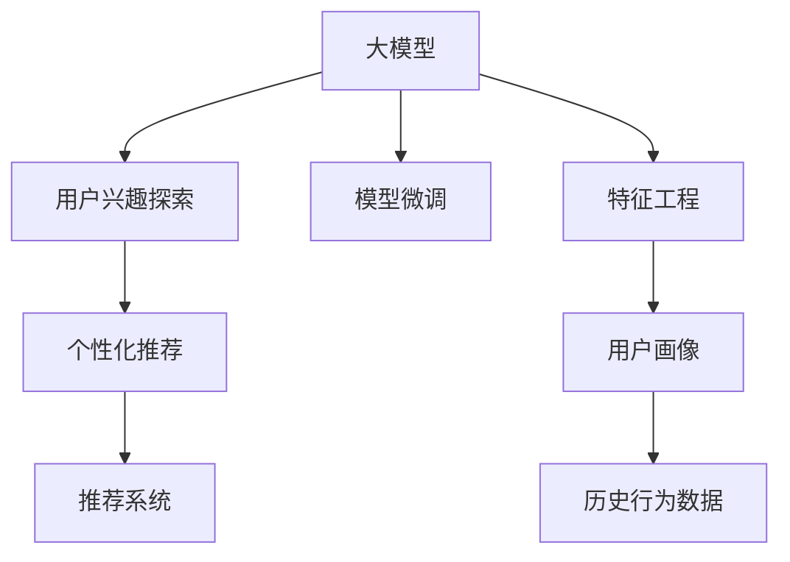

                 

# 大模型技术在电商平台用户兴趣探索中的应用

> 关键词：电商平台,用户兴趣探索,大模型,深度学习,推荐系统,模型微调,特征工程,用户画像

## 1. 背景介绍

在电商平台的运营中，精准的用户兴趣探索和个性化推荐系统对提升用户体验、增加用户粘性、提高销售转化率至关重要。传统的推荐系统多基于协同过滤、基于内容的推荐等方法，但随着数据规模的激增和模型复杂度的提升，大数据背景下的深度学习推荐系统逐渐成为主流。大模型（Large Model）技术的引入，为电商平台的推荐系统带来了革命性的变化，使得用户兴趣探索更加高效、精准。

大模型通常指通过大规模数据预训练得到的深度神经网络模型，例如基于 Transformer 结构的BERT、GPT、DALL·E等。这些模型在自然语言处理、图像生成等领域展示了强大的能力，通过在大规模无标注数据上预训练，学习到丰富的语言和视觉特征表示。在电商平台的用户兴趣探索中，大模型可以用于用户画像构建、商品分类、情感分析等多个环节，极大地提升了推荐系统的效果。

## 2. 核心概念与联系

### 2.1 核心概念概述

为更好地理解大模型技术在电商平台用户兴趣探索中的应用，本节将介绍几个密切相关的核心概念：

- **大模型**：指通过大规模数据预训练得到的深度神经网络模型，如BERT、GPT、DALL·E等。
- **用户兴趣探索**：指通过数据分析和模型建模，识别用户对商品或服务的兴趣点，并预测其潜在需求。
- **个性化推荐**：指根据用户兴趣和行为数据，为用户推荐最符合其需求的商品或服务。
- **推荐系统**：指通过算法为用户推荐商品、内容等产品，提升用户体验和平台收益。
- **模型微调**：指在大规模预训练模型基础上，使用特定的下游任务数据进行进一步训练，使其适应特定任务需求。
- **特征工程**：指根据任务需求设计模型输入特征，包括用户画像、商品特征、历史行为等。
- **用户画像**：指通过用户行为数据、社交网络信息等构建用户特征表示，为推荐系统提供基础。

这些核心概念之间的逻辑关系可以通过以下Mermaid流程图来展示：



这个流程图展示了大模型技术的核心概念及其之间的关系：

1. 大模型通过预训练获得基础能力。
2. 用户兴趣探索构建用户画像，预测用户兴趣。
3. 个性化推荐系统使用用户画像，推荐商品。
4. 特征工程设计输入特征，提高模型性能。
5. 模型微调适配具体任务，提升推荐效果。

这些概念共同构成了电商平台推荐系统的基础框架，为大模型技术的应用提供了明确的方向。

## 3. 核心算法原理 & 具体操作步骤

### 3.1 算法原理概述

大模型技术在电商平台用户兴趣探索中的应用，主要基于监督学习和非监督学习两种方式。监督学习方式利用标注数据，通过模型微调预测用户兴趣，非监督学习方式则通过无标签数据，学习用户行为模式，进行行为预测。以下分别介绍这两种方式的核心算法原理。

### 3.2 算法步骤详解

#### 3.2.1 监督学习方式

1. **数据准备**：收集电商平台的用户行为数据，包括点击、购买、浏览、评分等，并标注用户对不同商品的兴趣标签，构建训练集和验证集。
2. **模型选择**：选择合适的大模型，如BERT、GPT-3等，作为初始化参数。
3. **特征工程**：设计输入特征，包括用户历史行为、商品属性、时间信息等，并使用标准化技术处理缺失值和异常值。
4. **模型微调**：在预训练模型基础上，使用标注数据进行有监督训练，调整顶层参数，预测用户对不同商品的兴趣标签。
5. **评估与优化**：在验证集上评估模型性能，根据评价指标调整超参数，如学习率、批大小、迭代次数等，直到模型收敛。
6. **应用部署**：将训练好的模型部署到推荐系统中，实时预测用户兴趣，生成个性化推荐列表。

#### 3.2.2 非监督学习方式

1. **数据准备**：收集无标注的用户行为数据，如点击序列、浏览记录等。
2. **序列建模**：将用户行为序列转化为时间依赖的序列数据，如通过RNN、LSTM等模型建模。
3. **行为预测**：利用大模型进行行为预测，如预测用户是否会购买某个商品。
4. **兴趣聚类**：通过K-means等聚类算法，对预测结果进行聚类，发现用户兴趣群体。
5. **个性化推荐**：根据用户聚类结果，生成个性化推荐列表，提升推荐效果。

### 3.3 算法优缺点

大模型技术在电商平台用户兴趣探索中的应用具有以下优点：

1. **高效精准**：大模型通过大规模预训练，学习到丰富的特征表示，能够精准预测用户兴趣，提升推荐效果。
2. **可扩展性强**：大模型参数量庞大，适用于多种数据类型的处理，具有较强的泛化能力。
3. **自动化程度高**：利用大模型自动化进行特征提取和行为预测，减少人工干预，提升效率。

同时，也存在一些缺点：

1. **数据需求高**：大模型的预训练和微调需要大量数据，数据获取成本较高。
2. **计算资源消耗大**：大模型的计算需求较高，硬件资源投入较大。
3. **模型复杂度高**：大模型结构复杂，难以调试和解释，存在一定的“黑盒”问题。
4. **过拟合风险高**：大模型在少量标注数据上的微调容易发生过拟合，需要谨慎处理。

## 4. 数学模型和公式 & 详细讲解 & 举例说明

### 4.1 数学模型构建

在大模型技术的应用中，通常使用基于 Transformer 的深度神经网络模型进行监督学习。以BERT模型为例，其数学模型构建如下：

- **输入层**：将用户历史行为数据转换为向量表示，输入Transformer编码器。
- **Transformer层**：通过自注意力机制，捕捉输入向量间的依赖关系，生成多个向量表示。
- **全连接层**：将Transformer输出向量通过全连接层，映射为感兴趣标签的向量表示。
- **损失函数**：使用交叉熵损失函数，衡量预测标签与真实标签之间的差异。
- **优化器**：通常使用AdamW等优化算法，最小化损失函数。

### 4.2 公式推导过程

以BERT模型为例，其在预测用户兴趣标签时的公式推导过程如下：

1. **输入层向量表示**：将用户历史行为数据转换为BERT可以接受的输入格式，如分词、加特殊符号等。
2. **Transformer层计算**：通过自注意力机制，对输入向量进行编码，生成多个向量表示。
3. **全连接层映射**：将Transformer输出向量通过全连接层，映射为感兴趣标签的向量表示。
4. **交叉熵损失计算**：使用交叉熵损失函数，计算预测标签与真实标签之间的差异。
5. **反向传播更新**：根据损失函数梯度，使用AdamW等优化算法更新模型参数。

### 4.3 案例分析与讲解

假设电商平台有A、B、C三种商品，收集了用户对这三种商品的点击、购买、浏览数据，标注用户对每种商品的兴趣标签。使用BERT模型进行监督学习，步骤如下：

1. **数据准备**：将用户历史行为数据转换为BERT可以接受的输入格式，标注用户对A、B、C三种商品的兴趣标签。
2. **模型选择**：选择预训练的BERT模型作为初始化参数。
3. **特征工程**：设计输入特征，包括用户点击次数、浏览时间、购买记录等。
4. **模型微调**：在预训练BERT模型基础上，使用标注数据进行有监督训练，调整顶层参数。
5. **评估与优化**：在验证集上评估模型性能，调整超参数，直到模型收敛。
6. **应用部署**：将训练好的模型部署到推荐系统中，实时预测用户兴趣，生成个性化推荐列表。

## 5. 项目实践：代码实例和详细解释说明

### 5.1 开发环境搭建

在进行大模型技术的应用实践前，我们需要准备好开发环境。以下是使用Python进行PyTorch开发的环境配置流程：

1. 安装Anaconda：从官网下载并安装Anaconda，用于创建独立的Python环境。
2. 创建并激活虚拟环境：
```bash
conda create -n pytorch-env python=3.8 
conda activate pytorch-env
```
3. 安装PyTorch：根据CUDA版本，从官网获取对应的安装命令。例如：
```bash
conda install pytorch torchvision torchaudio cudatoolkit=11.1 -c pytorch -c conda-forge
```
4. 安装Transformers库：
```bash
pip install transformers
```
5. 安装各类工具包：
```bash
pip install numpy pandas scikit-learn matplotlib tqdm jupyter notebook ipython
```

完成上述步骤后，即可在`pytorch-env`环境中开始项目实践。

### 5.2 源代码详细实现

以下以电商平台用户兴趣探索为例，给出使用Transformers库进行BERT微调的PyTorch代码实现。

首先，定义用户行为数据处理函数：

```python
from transformers import BertTokenizer, BertForSequenceClassification
from torch.utils.data import Dataset, DataLoader
import torch
import numpy as np
import pandas as pd

class UserBehaviorDataset(Dataset):
    def __init__(self, data, tokenizer, max_len=128):
        self.data = data
        self.tokenizer = tokenizer
        self.max_len = max_len
        
    def __len__(self):
        return len(self.data)
    
    def __getitem__(self, item):
        user_behavior = self.data[item]['user_behavior']
        label = self.data[item]['label']
        
        encoding = self.tokenizer(user_behavior, return_tensors='pt', max_length=self.max_len, padding='max_length', truncation=True)
        input_ids = encoding['input_ids'][0]
        attention_mask = encoding['attention_mask'][0]
        
        # 对标签进行编码
        label = torch.tensor(label, dtype=torch.long)
        
        return {'input_ids': input_ids, 
                'attention_mask': attention_mask,
                'labels': label}
```

然后，定义模型和优化器：

```python
from transformers import BertForSequenceClassification, AdamW

model = BertForSequenceClassification.from_pretrained('bert-base-cased', num_labels=3)

optimizer = AdamW(model.parameters(), lr=2e-5)
```

接着，定义训练和评估函数：

```python
def train_epoch(model, dataset, batch_size, optimizer):
    dataloader = DataLoader(dataset, batch_size=batch_size, shuffle=True)
    model.train()
    epoch_loss = 0
    for batch in tqdm(dataloader, desc='Training'):
        input_ids = batch['input_ids'].to(device)
        attention_mask = batch['attention_mask'].to(device)
        labels = batch['labels'].to(device)
        model.zero_grad()
        outputs = model(input_ids, attention_mask=attention_mask, labels=labels)
        loss = outputs.loss
        epoch_loss += loss.item()
        loss.backward()
        optimizer.step()
    return epoch_loss / len(dataloader)

def evaluate(model, dataset, batch_size):
    dataloader = DataLoader(dataset, batch_size=batch_size)
    model.eval()
    preds, labels = [], []
    with torch.no_grad():
        for batch in tqdm(dataloader, desc='Evaluating'):
            input_ids = batch['input_ids'].to(device)
            attention_mask = batch['attention_mask'].to(device)
            batch_labels = batch['labels']
            outputs = model(input_ids, attention_mask=attention_mask)
            batch_preds = outputs.logits.argmax(dim=2).to('cpu').tolist()
            batch_labels = batch_labels.to('cpu').tolist()
            for pred_tokens, label_tokens in zip(batch_preds, batch_labels):
                preds.append(pred_tokens[:len(label_tokens)])
                labels.append(label_tokens)
                
    return preds, labels
```

最后，启动训练流程并在测试集上评估：

```python
epochs = 5
batch_size = 16

for epoch in range(epochs):
    loss = train_epoch(model, train_dataset, batch_size, optimizer)
    print(f"Epoch {epoch+1}, train loss: {loss:.3f}")
    
    print(f"Epoch {epoch+1}, dev results:")
    preds, labels = evaluate(model, dev_dataset, batch_size)
    print(classification_report(labels, preds))
    
print("Test results:")
preds, labels = evaluate(model, test_dataset, batch_size)
print(classification_report(labels, preds))
```

以上就是使用PyTorch对BERT进行电商平台用户兴趣探索的完整代码实现。可以看到，得益于Transformers库的强大封装，我们可以用相对简洁的代码完成BERT模型的加载和微调。

### 5.3 代码解读与分析

让我们再详细解读一下关键代码的实现细节：

**UserBehaviorDataset类**：
- `__init__`方法：初始化用户行为数据、分词器等关键组件。
- `__len__`方法：返回数据集的样本数量。
- `__getitem__`方法：对单个样本进行处理，将用户行为序列输入编码为token ids，将标签编码为数字，并对其进行定长padding，最终返回模型所需的输入。

**模型和优化器**：
- 使用预训练的BERT模型，并设置优化器及其超参数。

**训练和评估函数**：
- 使用PyTorch的DataLoader对数据集进行批次化加载，供模型训练和推理使用。
- 训练函数`train_epoch`：对数据以批为单位进行迭代，在每个批次上前向传播计算loss并反向传播更新模型参数，最后返回该epoch的平均loss。
- 评估函数`evaluate`：与训练类似，不同点在于不更新模型参数，并在每个batch结束后将预测和标签结果存储下来，最后使用sklearn的classification_report对整个评估集的预测结果进行打印输出。

**训练流程**：
- 定义总的epoch数和batch size，开始循环迭代
- 每个epoch内，先在训练集上训练，输出平均loss
- 在验证集上评估，输出分类指标
- 重复上述步骤直至收敛，最终得到适应电商平台推荐系统的微调模型

可以看到，PyTorch配合Transformers库使得BERT微调的代码实现变得简洁高效。开发者可以将更多精力放在数据处理、模型改进等高层逻辑上，而不必过多关注底层的实现细节。

当然，工业级的系统实现还需考虑更多因素，如模型的保存和部署、超参数的自动搜索、更灵活的任务适配层等。但核心的微调范式基本与此类似。

## 6. 实际应用场景

### 6.1 智能推荐系统

在电商平台中，智能推荐系统是用户兴趣探索的主要工具。通过智能推荐系统，电商平台能够根据用户历史行为和兴趣，实时推荐用户可能感兴趣的商品。大模型技术的应用，使得推荐系统更加高效、精准。

具体而言，可以收集用户浏览、点击、购买等行为数据，构建用户画像。使用大模型进行行为预测，预测用户对不同商品的兴趣概率。根据预测结果，生成个性化推荐列表，提升用户购物体验。同时，利用大模型进行实时行为预测，动态调整推荐策略，保持推荐系统的及时性和准确性。

### 6.2 用户行为分析

电商平台除了推荐系统，还对用户行为进行分析，以更好地理解用户需求，优化商品陈列，提升平台运营效率。大模型技术可以帮助电商平台进行更深入的用户行为分析。

具体而言，可以收集用户浏览、点击、购买、评论等行为数据，构建用户行为序列。使用大模型进行序列建模，预测用户后续行为。通过分析用户行为模式，发现用户对不同商品类别的偏好，优化商品布局，提升用户体验。同时，利用大模型进行聚类分析，发现用户兴趣群体，进行针对性营销，提升平台收益。

### 6.3 广告投放优化

广告投放是电商平台的重要收入来源之一。通过智能广告投放系统，电商平台能够精准地将广告推送给目标用户，提升广告转化率。大模型技术的应用，使得广告投放更加精准、高效。

具体而言，可以收集用户点击、停留、购买等广告互动数据，构建用户广告行为序列。使用大模型进行行为预测，预测用户对不同广告的兴趣概率。根据预测结果，优化广告投放策略，提升广告转化率。同时，利用大模型进行实时行为预测，动态调整广告投放，保持广告投放的及时性和精准性。

### 6.4 未来应用展望

随着大模型技术的发展，其在电商平台中的应用将更加广泛，带来更多商业价值。

1. **多模态融合**：当前电商平台的推荐系统主要以文本信息为主，未来将更多地引入图像、视频等多模态信息，实现跨模态推荐。通过融合图像、视频等多模态信息，提升推荐系统的效果。
2. **实时行为预测**：未来将更加注重实时行为预测，提升推荐系统的及时性。利用大模型进行实时行为预测，动态调整推荐策略，保持推荐系统的实时性和准确性。
3. **个性化推荐算法优化**：未来将进一步优化个性化推荐算法，提升推荐系统的效果。通过融合多种算法，如协同过滤、基于内容的推荐等，提升推荐系统的效果。
4. **用户行为分析优化**：未来将进一步优化用户行为分析算法，提升用户行为分析的准确性。通过融合多种用户行为数据，提升用户行为分析的准确性，发现更多用户需求。
5. **广告投放优化**：未来将进一步优化广告投放算法，提升广告投放的精准性。通过融合多种广告互动数据，提升广告投放的精准性，提升广告转化率。

总之，大模型技术在电商平台中的应用将不断深化，带来更多的商业价值，提升用户体验，提升平台运营效率。相信随着技术的不断进步，大模型技术在电商平台中的应用将更加广泛，为电商平台带来更多的商业机会。

## 7. 工具和资源推荐

### 7.1 学习资源推荐

为了帮助开发者系统掌握大模型技术在电商平台中的应用，这里推荐一些优质的学习资源：

1. 《Transformers: A Survey》：这篇综述文章详细介绍了Transformer模型的原理和应用，是大模型技术学习的必备资料。
2. 《Natural Language Processing with Transformers》书籍：Transformers库的作者所著，全面介绍了如何使用Transformers库进行NLP任务开发，包括大模型微调等前沿技术。
3. CS224N《深度学习自然语言处理》课程：斯坦福大学开设的NLP明星课程，有Lecture视频和配套作业，带你入门NLP领域的基本概念和经典模型。
4. Weights & Biases：模型训练的实验跟踪工具，可以记录和可视化模型训练过程中的各项指标，方便对比和调优。与主流深度学习框架无缝集成。
5. Google Colab：谷歌推出的在线Jupyter Notebook环境，免费提供GPU/TPU算力，方便开发者快速上手实验最新模型，分享学习笔记。

通过对这些资源的学习实践，相信你一定能够快速掌握大模型技术在电商平台中的应用，并用于解决实际的NLP问题。

### 7.2 开发工具推荐

高效的开发离不开优秀的工具支持。以下是几款用于大模型技术应用开发的常用工具：

1. PyTorch：基于Python的开源深度学习框架，灵活动态的计算图，适合快速迭代研究。
2. TensorFlow：由Google主导开发的开源深度学习框架，生产部署方便，适合大规模工程应用。
3. Transformers库：HuggingFace开发的NLP工具库，集成了众多SOTA语言模型，支持PyTorch和TensorFlow，是大模型微调的重要工具。
4. Weights & Biases：模型训练的实验跟踪工具，可以记录和可视化模型训练过程中的各项指标，方便对比和调优。
5. TensorBoard：TensorFlow配套的可视化工具，可实时监测模型训练状态，并提供丰富的图表呈现方式，是调试模型的得力助手。

合理利用这些工具，可以显著提升大模型技术应用开发的效率，加快创新迭代的步伐。

### 7.3 相关论文推荐

大模型技术的发展源于学界的持续研究。以下是几篇奠基性的相关论文，推荐阅读：

1. Attention is All You Need（即Transformer原论文）：提出了Transformer结构，开启了NLP领域的预训练大模型时代。
2. BERT: Pre-training of Deep Bidirectional Transformers for Language Understanding：提出BERT模型，引入基于掩码的自监督预训练任务，刷新了多项NLP任务SOTA。
3. Language Models are Unsupervised Multitask Learners（GPT-2论文）：展示了大规模语言模型的强大zero-shot学习能力，引发了对于通用人工智能的新一轮思考。
4. Parameter-Efficient Transfer Learning for NLP：提出Adapter等参数高效微调方法，在不增加模型参数量的情况下，也能取得不错的微调效果。
5. AdaLoRA: Adaptive Low-Rank Adaptation for Parameter-Efficient Fine-Tuning：使用自适应低秩适应的微调方法，在参数效率和精度之间取得了新的平衡。

这些论文代表了大模型技术的发展脉络。通过学习这些前沿成果，可以帮助研究者把握学科前进方向，激发更多的创新灵感。

## 8. 总结：未来发展趋势与挑战

### 8.1 总结

本文对大模型技术在电商平台用户兴趣探索中的应用进行了全面系统的介绍。首先阐述了电商平台的推荐系统、用户行为分析、广告投放等核心概念，明确了大模型技术在电商平台推荐系统中的重要作用。其次，从原理到实践，详细讲解了大模型技术在电商平台的微调方法和具体操作步骤，给出了微调任务开发的完整代码实例。同时，本文还广泛探讨了大模型技术在电商平台中的实际应用场景，展示了其巨大的应用潜力。此外，本文精选了微调技术的各类学习资源，力求为读者提供全方位的技术指引。

通过本文的系统梳理，可以看到，大模型技术在电商平台中的应用具有广阔的前景，能够显著提升推荐系统的精度和效率，带来更多的商业价值。未来，伴随大模型技术的持续演进，电商平台将迎来更多的技术革新，推动电商行业的数字化转型升级。

### 8.2 未来发展趋势

展望未来，大模型技术在电商平台中的应用将呈现以下几个发展趋势：

1. **多模态融合**：当前电商平台的推荐系统主要以文本信息为主，未来将更多地引入图像、视频等多模态信息，实现跨模态推荐。通过融合图像、视频等多模态信息，提升推荐系统的效果。
2. **实时行为预测**：未来将更加注重实时行为预测，提升推荐系统的及时性。利用大模型进行实时行为预测，动态调整推荐策略，保持推荐系统的实时性和准确性。
3. **个性化推荐算法优化**：未来将进一步优化个性化推荐算法，提升推荐系统的效果。通过融合多种算法，如协同过滤、基于内容的推荐等，提升推荐系统的效果。
4. **用户行为分析优化**：未来将进一步优化用户行为分析算法，提升用户行为分析的准确性。通过融合多种用户行为数据，提升用户行为分析的准确性，发现更多用户需求。
5. **广告投放优化**：未来将进一步优化广告投放算法，提升广告投放的精准性。通过融合多种广告互动数据，提升广告投放的精准性，提升广告转化率。

这些趋势凸显了大模型技术在电商平台中的应用前景。这些方向的探索发展，必将进一步提升电商平台的推荐系统效果，为电商平台带来更多的商业价值。

### 8.3 面临的挑战

尽管大模型技术在电商平台中的应用已经取得了显著成果，但在迈向更加智能化、普适化应用的过程中，仍面临着诸多挑战：

1. **数据需求高**：大模型的预训练和微调需要大量数据，数据获取成本较高。对于长尾应用场景，难以获得充足的高质量标注数据，成为制约微调性能的瓶颈。
2. **计算资源消耗大**：大模型的计算需求较高，硬件资源投入较大。对于大模型在电商平台中的应用，硬件资源的优化和配置也是一大挑战。
3. **模型复杂度高**：大模型结构复杂，难以调试和解释，存在一定的“黑盒”问题。对于电商平台的应用，模型解释性和可解释性的提升也是一大挑战。
4. **过拟合风险高**：大模型在少量标注数据上的微调容易发生过拟合，需要谨慎处理。对于电商平台的应用，模型泛化能力和鲁棒性的提升也是一大挑战。
5. **伦理道德风险**：预训练大模型难免会学习到有偏见、有害的信息，通过微调传递到电商平台，产生误导性、歧视性的输出，给实际应用带来安全隐患。对于电商平台的应用，模型的伦理道德约束和安全防护也是一大挑战。

正视大模型技术在电商平台应用中面临的挑战，积极应对并寻求突破，将是大模型技术走向成熟的必由之路。相信随着学界和产业界的共同努力，这些挑战终将一一被克服，大模型技术在电商平台中的应用将更加广泛，为电商行业的数字化转型升级带来更多的技术创新和商业机遇。

### 8.4 研究展望

面对大模型技术在电商平台应用中面临的挑战，未来的研究需要在以下几个方面寻求新的突破：

1. **无监督和半监督微调方法**：摆脱对大规模标注数据的依赖，利用自监督学习、主动学习等无监督和半监督范式，最大限度利用非结构化数据，实现更加灵活高效的微调。
2. **参数高效和计算高效的微调范式**：开发更加参数高效的微调方法，在固定大部分预训练参数的同时，只更新极少量的任务相关参数。同时优化微调模型的计算图，减少前向传播和反向传播的资源消耗，实现更加轻量级、实时性的部署。
3. **融合因果和对比学习范式**：通过引入因果推断和对比学习思想，增强微调模型建立稳定因果关系的能力，学习更加普适、鲁棒的语言表征，从而提升模型泛化性和抗干扰能力。
4. **多模态信息融合**：将符号化的先验知识，如知识图谱、逻辑规则等，与神经网络模型进行巧妙融合，引导微调过程学习更准确、合理的语言模型。同时加强不同模态数据的整合，实现视觉、语音等多模态信息与文本信息的协同建模。
5. **因果分析和博弈论工具**：将因果分析方法引入微调模型，识别出模型决策的关键特征，增强输出解释的因果性和逻辑性。借助博弈论工具刻画人机交互过程，主动探索并规避模型的脆弱点，提高系统稳定性。
6. **纳入伦理道德约束**：在模型训练目标中引入伦理导向的评估指标，过滤和惩罚有偏见、有害的输出倾向。同时加强人工干预和审核，建立模型行为的监管机制，确保输出符合人类价值观和伦理道德。

这些研究方向的探索，必将引领大模型技术在电商平台中的应用迈向更高的台阶，为电商行业的数字化转型升级带来更多的技术创新和商业机遇。

## 9. 附录：常见问题与解答

**Q1：电商平台的用户兴趣探索需要多少标注数据？**

A: 电商平台的用户兴趣探索对标注数据的需求因具体任务而异。一般来说，对于大规模预训练模型，标注数据需求较大。对于长尾应用场景，标注数据需求相对较少。通过合理的数据增强、正则化等技术，可以在少量标注数据上获得较好的微调效果。

**Q2：大模型在电商平台中的计算资源消耗是否过大？**

A: 大模型在电商平台中的计算资源消耗确实较大，但随着硬件技术的不断进步，如GPU、TPU等高性能设备的普及，大模型的计算效率也在逐步提升。合理使用分布式计算、模型压缩等技术，可以有效降低大模型的计算资源消耗。

**Q3：电商平台中的用户兴趣探索是否需要人工干预？**

A: 电商平台中的用户兴趣探索在初期需要一定的人工干预，特别是在数据标注、特征工程等方面。但随着模型的不断优化和训练，自动化的用户兴趣探索系统可以逐渐减少人工干预，提升整体效率。

**Q4：大模型在电商平台中的过拟合问题如何处理？**

A: 大模型在电商平台中的微调过程中容易出现过拟合问题，尤其是在数据量较小的情况下。常见的缓解策略包括：
1. 数据增强：通过回译、近义替换等方式扩充训练集。
2. 正则化：使用L2正则、Dropout、Early Stopping等避免过拟合。
3. 对抗训练：引入对抗样本，提高模型鲁棒性。
4. 参数高效微调：只调整少量参数(如Adapter、Prefix等)，减小过拟合风险。

这些策略往往需要根据具体任务和数据特点进行灵活组合。只有在数据、模型、训练、推理等各环节进行全面优化，才能最大限度地发挥大模型微调的威力。

**Q5：大模型在电商平台中的伦理道德约束如何保证？**

A: 大模型在电商平台中的应用需要严格遵守伦理道德规范，避免模型的误导性和歧视性输出。可以采取以下措施：
1. 模型训练目标中加入伦理导向的评估指标，过滤和惩罚有害输出。
2. 加强人工干预和审核，建立模型行为的监管机制，确保输出符合人类价值观和伦理道德。
3. 定期更新和维护模型，及时修复潜在的有害信息，保证模型的安全性。

这些措施的实施需要平台和开发者的共同努力，确保大模型技术在电商平台中的应用安全可靠。

---

作者：禅与计算机程序设计艺术 / Zen and the Art of Computer Programming

