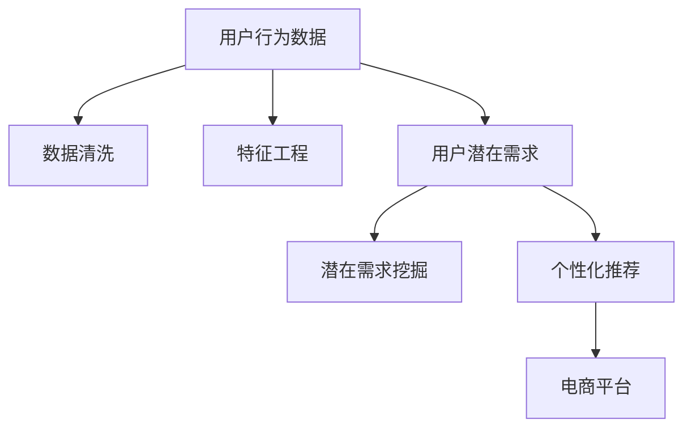

                 

# 大模型技术在电商平台用户潜在需求挖掘中的创新

> 关键词：电商平台,用户行为分析,潜在需求挖掘,大模型技术,深度学习,自监督学习,隐式反馈

## 1. 背景介绍

### 1.1 问题由来
在当今的电子商务环境中，用户行为数据显得愈加重要。电商平台不仅需要掌握用户的直接行为数据，如浏览记录、购买历史等，也需要挖掘用户的潜在需求，以便预测未来购买行为，实现个性化推荐，提升用户体验和销售额。传统的数据挖掘方法往往基于统计分析和规则学习，但这些方法在处理大规模、高维度数据时效率低下，难以挖掘复杂的潜在需求。

随着深度学习技术的兴起，基于大模型技术的数据挖掘方法成为行业新的趋势。深度学习模型，特别是自监督学习模型，具备出色的泛化能力和数据建模能力，能够从海量数据中学习到丰富的用户行为模式，辅助电商平台精准地预测用户潜在需求。

### 1.2 问题核心关键点
在电商平台应用大模型技术，通常需考虑以下几个核心问题：

- 如何高效收集和处理用户行为数据？
- 如何利用大模型技术从数据中挖掘用户潜在需求？
- 如何将大模型与电商平台业务流程无缝集成，实现智能化推荐？
- 如何优化模型的计算效率，提升实时性，保障用户体验？

这些关键问题决定了电商平台应用大模型技术的效果和可行性。本文将详细介绍如何利用大模型技术，实现用户潜在需求的挖掘与预测。

### 1.3 问题研究意义
通过深入挖掘用户潜在需求，电商平台能够实现更加精准的个性化推荐，提升用户体验和销售额。具体来说：

- **用户满意度提升**：精准预测用户需求，减少推荐偏差，提高用户满意度。
- **营销效果增强**：推荐相关产品，增加转化率，提升平台营收。
- **竞争优势构建**：在数据驱动的基础上，构建差异化优势，提高市场竞争力。
- **客户忠诚度提高**：了解用户偏好，提供符合预期的服务，增强客户粘性。
- **运营成本降低**：自动化数据分析，减少人力投入，降低运营成本。

## 2. 核心概念与联系

### 2.1 核心概念概述

为更好地理解大模型技术在电商平台用户潜在需求挖掘中的应用，本节将介绍几个密切相关的核心概念：

- **大模型技术**：以自监督学习为基础的深度学习模型，如BERT、GPT、XLNet等，通过在海量无标签数据上预训练，学习到丰富的语言表示和特征，具备强大的数据建模能力。

- **用户行为分析**：通过分析用户的行为数据，如浏览、点击、搜索、购买等，了解用户兴趣、偏好、需求等，为电商平台个性化推荐提供数据支持。

- **潜在需求挖掘**：从用户行为数据中，识别出用户可能感兴趣但未明确表达的需求，预测用户未来购买行为，辅助电商平台制定更加精准的推荐策略。

- **深度学习**：基于神经网络的机器学习方法，通过训练深度模型，从数据中学习特征表示，用于分类、回归、生成等任务。

- **自监督学习**：利用数据自身的结构信息进行学习，无需显式标注，适用于大规模数据。

- **隐式反馈**：用户行为数据中隐含的偏好信息，如浏览记录、点击行为等，是潜在需求挖掘的重要信息来源。

这些核心概念之间的逻辑关系可以通过以下Mermaid流程图来展示：



这个流程图展示了大模型技术在电商平台用户潜在需求挖掘中的核心概念及其关系：

1. 用户行为数据是分析的起点。
2. 数据清洗和特征工程是数据预处理的关键步骤。
3. 利用大模型技术，从用户行为数据中挖掘出潜在需求。
4. 结合潜在需求，进行个性化推荐。
5. 最终应用到电商平台的推荐系统中，实现智能化服务。

## 3. 核心算法原理 & 具体操作步骤
### 3.1 算法原理概述

在电商平台应用大模型技术进行用户潜在需求挖掘，本质上是一个从用户行为数据中学习潜在需求表示的过程。核心思想是：通过自监督学习，捕捉用户行为数据中的潜在模式，在此基础上进行有监督学习，挖掘用户未直接表达的需求。

具体来说，可以采取以下步骤：

1. **数据收集与预处理**：从电商平台收集用户行为数据，包括浏览记录、点击行为、购买历史等。对数据进行清洗和特征提取，去除异常数据和噪声。

2. **大模型训练**：利用自监督学习任务（如语言建模、自编码等）对大模型进行预训练，学习用户行为数据的隐含语义表示。

3. **潜在需求挖掘**：将预训练的大模型作为特征提取器，通过有监督学习任务（如分类、回归、序列预测等），挖掘用户未直接表达的需求。

4. **个性化推荐**：根据潜在需求预测模型，对新用户行为进行预测，生成推荐列表，辅助电商平台实现精准推荐。

### 3.2 算法步骤详解

在电商平台应用大模型技术，一般包括以下几个关键步骤：

**Step 1: 数据收集与预处理**

- 收集电商平台用户的行为数据，包括浏览记录、点击行为、搜索关键词、购买历史等。
- 清洗数据，去除缺失值、重复数据、异常数据。
- 进行特征提取，将行为数据转化为模型可接受的形式。

**Step 2: 大模型训练**

- 选择合适的自监督学习任务，如BERT预训练、GPT自编码等，对大模型进行预训练。
- 在大模型上进行有监督学习任务训练，如多标签分类、回归等。

**Step 3: 潜在需求挖掘**

- 对用户行为数据进行编码，转化为模型可接受的输入形式。
- 利用训练好的大模型进行特征提取，获得用户行为数据的语义表示。
- 使用有监督学习任务，如分类、回归等，对语义表示进行建模，挖掘出用户潜在需求。

**Step 4: 个性化推荐**

- 根据用户潜在需求预测模型，对用户新行为进行预测，生成推荐列表。
- 将推荐结果展示给用户，实时更新推荐策略。
- 周期性地收集用户反馈，进一步优化推荐模型。

### 3.3 算法优缺点

利用大模型技术进行用户潜在需求挖掘，具有以下优点：

- **特征表示能力强**：大模型能够学习到复杂的特征表示，捕捉用户行为的深层次模式。
- **泛化能力强**：自监督学习任务通常在大规模数据上进行训练，具备良好的泛化能力。
- **需求挖掘精度高**：利用有监督学习任务，能够准确挖掘出用户潜在需求，提升推荐精度。
- **动态适应性强**：模型可以随时根据新数据进行微调，动态适应用户行为变化。

同时，该方法也存在以下局限性：

- **数据处理复杂**：电商平台用户行为数据通常多维度、高规模，需要进行复杂的数据清洗和特征提取。
- **计算资源消耗大**：大模型的训练和推理需要大量计算资源，可能影响系统实时性。
- **解释性差**：大模型通常是"黑盒"模型，难以解释其内部工作机制和决策逻辑。

尽管存在这些局限性，但就目前而言，大模型技术在电商平台用户潜在需求挖掘中的应用，已经展现出显著的潜力，得到了业界的广泛关注和应用。

### 3.4 算法应用领域

大模型技术在电商平台用户潜在需求挖掘中的应用领域非常广泛，主要包括：

- **个性化推荐系统**：根据用户行为数据，预测用户未来购买行为，生成个性化推荐。
- **广告投放优化**：预测用户对广告的兴趣，优化广告投放策略，提高广告效果。
- **用户行为分析**：分析用户行为数据，发现用户兴趣和行为模式，辅助电商平台制定营销策略。
- **风险管理**：预测用户违约风险，辅助电商平台进行风险控制，降低损失。
- **供应链管理**：预测用户需求趋势，优化库存管理，提高供应链效率。

这些应用领域展示了大模型技术在电商平台中的巨大价值，为电商平台带来了新的发展机遇。

## 4. 数学模型和公式 & 详细讲解  
### 4.1 数学模型构建

本节将使用数学语言对电商平台用户潜在需求挖掘方法进行更加严格的刻画。

记电商平台用户行为数据为 $D=\{x_i, y_i\}_{i=1}^N$，其中 $x_i$ 为行为数据，$y_i$ 为标签（如点击、购买等）。假设大模型为 $M_\theta$，通过自监督学习预训练后，在任务 $T$ 上进行有监督微调，目标是最小化损失函数 $\mathcal{L}$：

$$
\mathcal{L}(\theta) = \frac{1}{N} \sum_{i=1}^N \ell(M_{\theta}(x_i), y_i)
$$

其中 $\ell$ 为任务 $T$ 对应的损失函数，如交叉熵、均方误差等。微调的优化目标是最小化损失函数 $\mathcal{L}(\theta)$，求解模型参数 $\theta$：

$$
\theta^* = \mathop{\arg\min}_{\theta} \mathcal{L}(\theta)
$$

在实践中，我们通常使用基于梯度的优化算法（如SGD、Adam等）来近似求解上述最优化问题。

### 4.2 公式推导过程

以电商平台个性化推荐系统为例，假设模型 $M_{\theta}$ 在输入 $x_i$ 上的输出为 $\hat{y}_i=M_{\theta}(x_i)$，表示对行为数据 $x_i$ 的潜在需求预测。设 $y_i$ 为用户的实际标签（如是否点击、购买等），则二分类交叉熵损失函数定义为：

$$
\ell(M_{\theta}(x_i), y_i) = -[y_i\log \hat{y}_i + (1-y_i)\log(1-\hat{y}_i)]
$$

将其代入经验风险公式，得：

$$
\mathcal{L}(\theta) = -\frac{1}{N}\sum_{i=1}^N [y_i\log M_{\theta}(x_i)+(1-y_i)\log(1-M_{\theta}(x_i))]
$$

根据链式法则，损失函数对参数 $\theta_k$ 的梯度为：

$$
\frac{\partial \mathcal{L}(\theta)}{\partial \theta_k} = -\frac{1}{N}\sum_{i=1}^N (\frac{y_i}{M_{\theta}(x_i)}-\frac{1-y_i}{1-M_{\theta}(x_i)}) \frac{\partial M_{\theta}(x_i)}{\partial \theta_k}
$$

其中 $\frac{\partial M_{\theta}(x_i)}{\partial \theta_k}$ 可进一步递归展开，利用自动微分技术完成计算。

### 4.3 案例分析与讲解

以电商平台个性化推荐系统为例，使用BERT模型进行用户潜在需求挖掘的详细计算过程：

- **数据准备**：收集电商平台用户的行为数据，如浏览记录、点击行为、购买历史等。
- **数据预处理**：对行为数据进行清洗和特征提取，转化为BERT模型可接受的输入形式。
- **BERT预训练**：在预训练语料库上，使用语言建模任务对BERT模型进行预训练，学习语言表示。
- **有监督学习**：在预训练模型上，使用点击、购买等标签进行微调，训练潜在需求预测模型。
- **推荐生成**：将新用户行为数据输入模型，生成推荐列表，辅助电商平台进行个性化推荐。

以实例形式，假设用户A浏览了商品X、Y、Z，但没有进行点击或购买行为。利用预训练的BERT模型，对其潜在需求进行预测，生成推荐列表。

## 5. 项目实践：代码实例和详细解释说明
### 5.1 开发环境搭建

在进行用户潜在需求挖掘实践前，我们需要准备好开发环境。以下是使用Python进行PyTorch开发的环境配置流程：

1. 安装Anaconda：从官网下载并安装Anaconda，用于创建独立的Python环境。

2. 创建并激活虚拟环境：
```bash
conda create -n pytorch-env python=3.8 
conda activate pytorch-env
```

3. 安装PyTorch：根据CUDA版本，从官网获取对应的安装命令。例如：
```bash
conda install pytorch torchvision torchaudio cudatoolkit=11.1 -c pytorch -c conda-forge
```

4. 安装Transformers库：
```bash
pip install transformers
```

5. 安装各类工具包：
```bash
pip install numpy pandas scikit-learn matplotlib tqdm jupyter notebook ipython
```

完成上述步骤后，即可在`pytorch-env`环境中开始开发实践。

### 5.2 源代码详细实现

这里我们以电商平台个性化推荐系统为例，使用Transformers库对BERT模型进行用户潜在需求挖掘的详细代码实现。

首先，定义推荐系统的数据处理函数：

```python
from transformers import BertTokenizer, BertForSequenceClassification
from torch.utils.data import Dataset
import torch

class RecommendationDataset(Dataset):
    def __init__(self, behaviors, labels, tokenizer, max_len=128):
        self.behaviors = behaviors
        self.labels = labels
        self.tokenizer = tokenizer
        self.max_len = max_len
        
    def __len__(self):
        return len(self.behaviors)
    
    def __getitem__(self, item):
        behavior = self.behaviors[item]
        label = self.labels[item]
        
        encoding = self.tokenizer(behavior, return_tensors='pt', max_length=self.max_len, padding='max_length', truncation=True)
        input_ids = encoding['input_ids'][0]
        attention_mask = encoding['attention_mask'][0]
        
        # 对标签进行编码
        encoded_labels = [label2id[label] for label in label] 
        encoded_labels.extend([label2id['O']] * (self.max_len - len(encoded_labels)))
        labels = torch.tensor(encoded_labels, dtype=torch.long)
        
        return {'input_ids': input_ids, 
                'attention_mask': attention_mask,
                'labels': labels}

# 标签与id的映射
label2id = {'click': 0, 'purchase': 1, 'O': 2}
id2label = {v: k for k, v in label2id.items()}

# 创建dataset
tokenizer = BertTokenizer.from_pretrained('bert-base-cased')

train_dataset = RecommendationDataset(train_behaviors, train_labels, tokenizer)
dev_dataset = RecommendationDataset(dev_behaviors, dev_labels, tokenizer)
test_dataset = RecommendationDataset(test_behaviors, test_labels, tokenizer)
```

然后，定义模型和优化器：

```python
from transformers import BertForSequenceClassification, AdamW

model = BertForSequenceClassification.from_pretrained('bert-base-cased', num_labels=len(label2id))

optimizer = AdamW(model.parameters(), lr=2e-5)
```

接着，定义训练和评估函数：

```python
from torch.utils.data import DataLoader
from tqdm import tqdm
from sklearn.metrics import classification_report

device = torch.device('cuda') if torch.cuda.is_available() else torch.device('cpu')
model.to(device)

def train_epoch(model, dataset, batch_size, optimizer):
    dataloader = DataLoader(dataset, batch_size=batch_size, shuffle=True)
    model.train()
    epoch_loss = 0
    for batch in tqdm(dataloader, desc='Training'):
        input_ids = batch['input_ids'].to(device)
        attention_mask = batch['attention_mask'].to(device)
        labels = batch['labels'].to(device)
        model.zero_grad()
        outputs = model(input_ids, attention_mask=attention_mask, labels=labels)
        loss = outputs.loss
        epoch_loss += loss.item()
        loss.backward()
        optimizer.step()
    return epoch_loss / len(dataloader)

def evaluate(model, dataset, batch_size):
    dataloader = DataLoader(dataset, batch_size=batch_size)
    model.eval()
    preds, labels = [], []
    with torch.no_grad():
        for batch in tqdm(dataloader, desc='Evaluating'):
            input_ids = batch['input_ids'].to(device)
            attention_mask = batch['attention_mask'].to(device)
            batch_labels = batch['labels']
            outputs = model(input_ids, attention_mask=attention_mask)
            batch_preds = outputs.logits.argmax(dim=2).to('cpu').tolist()
            batch_labels = batch_labels.to('cpu').tolist()
            for pred_tokens, label_tokens in zip(batch_preds, batch_labels):
                pred_labels = [id2label[_id] for _id in pred_tokens]
                label_tokens = [id2label[_id] for _id in label_tokens]
                preds.append(pred_labels[:len(label_tokens)])
                labels.append(label_tokens)
                
    print(classification_report(labels, preds))
```

最后，启动训练流程并在测试集上评估：

```python
epochs = 5
batch_size = 16

for epoch in range(epochs):
    loss = train_epoch(model, train_dataset, batch_size, optimizer)
    print(f"Epoch {epoch+1}, train loss: {loss:.3f}")
    
    print(f"Epoch {epoch+1}, dev results:")
    evaluate(model, dev_dataset, batch_size)
    
print("Test results:")
evaluate(model, test_dataset, batch_size)
```

以上就是使用PyTorch对BERT进行用户潜在需求挖掘的完整代码实现。可以看到，得益于Transformers库的强大封装，我们可以用相对简洁的代码完成BERT模型的加载和微调。

### 5.3 代码解读与分析

让我们再详细解读一下关键代码的实现细节：

**RecommendationDataset类**：
- `__init__`方法：初始化行为数据、标签、分词器等关键组件。
- `__len__`方法：返回数据集的样本数量。
- `__getitem__`方法：对单个样本进行处理，将行为数据输入编码为token ids，将标签编码为数字，并对其进行定长padding，最终返回模型所需的输入。

**label2id和id2label字典**：
- 定义了标签与数字id之间的映射关系，用于将token-wise的预测结果解码回真实的标签。

**训练和评估函数**：
- 使用PyTorch的DataLoader对数据集进行批次化加载，供模型训练和推理使用。
- 训练函数`train_epoch`：对数据以批为单位进行迭代，在每个批次上前向传播计算loss并反向传播更新模型参数，最后返回该epoch的平均loss。
- 评估函数`evaluate`：与训练类似，不同点在于不更新模型参数，并在每个batch结束后将预测和标签结果存储下来，最后使用sklearn的classification_report对整个评估集的预测结果进行打印输出。

**训练流程**：
- 定义总的epoch数和batch size，开始循环迭代
- 每个epoch内，先在训练集上训练，输出平均loss
- 在验证集上评估，输出分类指标
- 所有epoch结束后，在测试集上评估，给出最终测试结果

可以看到，PyTorch配合Transformers库使得BERT微调的代码实现变得简洁高效。开发者可以将更多精力放在数据处理、模型改进等高层逻辑上，而不必过多关注底层的实现细节。

当然，工业级的系统实现还需考虑更多因素，如模型的保存和部署、超参数的自动搜索、更灵活的任务适配层等。但核心的微调范式基本与此类似。

## 6. 实际应用场景
### 6.1 智能客服系统

利用大模型技术进行用户潜在需求挖掘，在智能客服系统中同样具有广阔的应用前景。智能客服系统通过分析用户的历史交互记录，预测用户当前和未来的需求，自动生成推荐问题，提高客户满意度和系统效率。

在技术实现上，可以收集用户的历史交互记录，将用户提问作为输入数据，利用预训练的BERT模型进行语义理解，挖掘用户未明确表达的需求，生成个性化的推荐问题，辅助客服系统自动回复。用户反馈信息可用于进一步微调模型，提升预测准确性。

### 6.2 电商平台个性化推荐系统

在电商平台中，利用用户行为数据进行潜在需求挖掘，可以显著提升个性化推荐的效果。具体来说，可以收集用户浏览记录、点击行为、购买历史等数据，利用预训练的BERT模型进行语义理解，挖掘用户的潜在需求，生成个性化推荐列表，提升用户满意度。

在实际应用中，可以使用多种推荐算法结合大模型技术，如协同过滤、基于内容推荐、深度学习推荐等，形成复合推荐策略，进一步提升推荐效果。

### 6.3 社交媒体内容分析

社交媒体平台利用用户行为数据进行潜在需求挖掘，可以了解用户的兴趣偏好，生成个性化的内容推荐。社交媒体平台通常收集用户的点赞、评论、分享等行为数据，利用预训练的BERT模型进行语义理解，挖掘用户的潜在需求，生成内容推荐列表，提升用户粘性和活跃度。

## 7. 工具和资源推荐
### 7.1 学习资源推荐

为了帮助开发者系统掌握大模型技术在电商平台用户潜在需求挖掘中的应用，这里推荐一些优质的学习资源：

1. 《深度学习与自然语言处理》课程：由清华大学开设的MOOC课程，系统讲解深度学习在NLP中的应用，包括大模型技术、自监督学习等前沿话题。

2. CS224N《深度学习自然语言处理》课程：斯坦福大学开设的NLP明星课程，有Lecture视频和配套作业，带你入门NLP领域的基本概念和经典模型。

3. 《Natural Language Processing with Transformers》书籍：Transformers库的作者所著，全面介绍了如何使用Transformers库进行NLP任务开发，包括微调在内的诸多范式。

4. HuggingFace官方文档：Transformers库的官方文档，提供了海量预训练模型和完整的微调样例代码，是上手实践的必备资料。

5. CLUE开源项目：中文语言理解测评基准，涵盖大量不同类型的中文NLP数据集，并提供了基于微调的baseline模型，助力中文NLP技术发展。

通过对这些资源的学习实践，相信你一定能够快速掌握大模型技术在电商平台用户潜在需求挖掘中的应用，并用于解决实际的NLP问题。
### 7.2 开发工具推荐

高效的开发离不开优秀的工具支持。以下是几款用于大模型技术开发的常用工具：

1. PyTorch：基于Python的开源深度学习框架，灵活动态的计算图，适合快速迭代研究。大部分预训练语言模型都有PyTorch版本的实现。

2. TensorFlow：由Google主导开发的开源深度学习框架，生产部署方便，适合大规模工程应用。同样有丰富的预训练语言模型资源。

3. Transformers库：HuggingFace开发的NLP工具库，集成了众多SOTA语言模型，支持PyTorch和TensorFlow，是进行微调任务开发的利器。

4. Weights & Biases：模型训练的实验跟踪工具，可以记录和可视化模型训练过程中的各项指标，方便对比和调优。与主流深度学习框架无缝集成。

5. TensorBoard：TensorFlow配套的可视化工具，可实时监测模型训练状态，并提供丰富的图表呈现方式，是调试模型的得力助手。

6. Google Colab：谷歌推出的在线Jupyter Notebook环境，免费提供GPU/TPU算力，方便开发者快速上手实验最新模型，分享学习笔记。

合理利用这些工具，可以显著提升大模型技术在电商平台用户潜在需求挖掘中的应用效果，加快创新迭代的步伐。

### 7.3 相关论文推荐

大模型技术在电商平台用户潜在需求挖掘中的应用源于学界的持续研究。以下是几篇奠基性的相关论文，推荐阅读：

1. Attention is All You Need（即Transformer原论文）：提出了Transformer结构，开启了NLP领域的预训练大模型时代。

2. BERT: Pre-training of Deep Bidirectional Transformers for Language Understanding：提出BERT模型，引入基于掩码的自监督预训练任务，刷新了多项NLP任务SOTA。

3. Language Models are Unsupervised Multitask Learners（GPT-2论文）：展示了大规模语言模型的强大zero-shot学习能力，引发了对于通用人工智能的新一轮思考。

4. Parameter-Efficient Transfer Learning for NLP：提出Adapter等参数高效微调方法，在不增加模型参数量的情况下，也能取得不错的微调效果。

5. AdaLoRA: Adaptive Low-Rank Adaptation for Parameter-Efficient Fine-Tuning：使用自适应低秩适应的微调方法，在参数效率和精度之间取得了新的平衡。

这些论文代表了大模型技术的发展脉络。通过学习这些前沿成果，可以帮助研究者把握学科前进方向，激发更多的创新灵感。

## 8. 总结：未来发展趋势与挑战

### 8.1 总结

本文对利用大模型技术进行电商平台用户潜在需求挖掘进行了全面系统的介绍。首先阐述了用户潜在需求挖掘的背景和意义，明确了大模型技术在其中的独特价值。其次，从原理到实践，详细讲解了大模型技术的核心算法和操作步骤，给出了具体的代码实例。最后，讨论了大模型技术在电商平台的实际应用场景，并推荐了相关学习资源和开发工具。

通过本文的系统梳理，可以看到，大模型技术在电商平台用户潜在需求挖掘中的应用正逐步成为行业新的趋势，极大地拓展了电商平台的智能化水平。大模型技术具备强大的数据建模能力，能够从海量数据中学习到丰富的用户行为模式，辅助电商平台精准预测用户需求，实现个性化推荐。未来，随着大模型技术的不断进步，电商平台将迎来更加智能化的用户服务体验。

### 8.2 未来发展趋势

展望未来，大模型技术在电商平台用户潜在需求挖掘中仍将呈现以下几个发展趋势：

1. **模型规模不断增大**：随着算力成本的下降和数据规模的扩张，大模型的参数量还将持续增长。超大规模语言模型蕴含的丰富语言知识，有望支撑更加复杂多变的用户需求挖掘。

2. **多模态融合增强**：将视觉、语音等多模态信息与文本信息结合，实现更全面、更准确的用户需求挖掘。

3. **个性化推荐多样化**：结合用户行为、社交关系、上下文信息等，提供更加精准、个性化的推荐服务。

4. **动态需求捕捉**：实时更新用户需求模型，捕捉用户即时需求变化，提供即时推荐。

5. **智能客服升级**：利用大模型技术进行需求挖掘，自动生成推荐问题，辅助智能客服系统。

6. **个性化内容创作**：利用用户潜在需求进行内容创作，生成符合用户期望的推荐内容。

7. **推荐模型优化**：结合深度学习、强化学习、因果推理等技术，进一步优化推荐模型。

以上趋势凸显了大模型技术在电商平台中的巨大潜力。这些方向的探索发展，必将进一步提升电商平台的智能化水平，为电商行业的数字化转型注入新的动力。

### 8.3 面临的挑战

尽管大模型技术在电商平台用户潜在需求挖掘中展现出显著的潜力，但在迈向更加智能化、普适化应用的过程中，仍面临诸多挑战：

1. **数据处理复杂**：电商平台用户行为数据通常多维度、高规模，需要进行复杂的数据清洗和特征提取。

2. **计算资源消耗大**：大模型的训练和推理需要大量计算资源，可能影响系统实时性。

3. **解释性差**：大模型通常是"黑盒"模型，难以解释其内部工作机制和决策逻辑。

4. **跨领域泛化能力不足**：大模型在特定领域的数据上训练效果较好，但在其他领域泛化能力可能较弱。

5. **冷启动问题**：对于新用户，大模型可能缺乏足够的行为数据进行训练，导致推荐效果不佳。

6. **隐私和安全**：用户行为数据包含大量敏感信息，如何保护用户隐私，防止数据泄露，是一个重要问题。

7. **鲁棒性不足**：大模型可能对数据噪声、攻击等表现敏感，影响推荐效果。

这些挑战需要在技术、算法、伦理等多个维度进行协同优化，方能实现大模型技术的有效应用。

### 8.4 研究展望

面对大模型技术在电商平台用户潜在需求挖掘中面临的挑战，未来的研究需要在以下几个方面寻求新的突破：

1. **数据处理自动化**：开发自动化的数据清洗和特征提取工具，简化数据预处理流程。

2. **模型压缩与优化**：采用模型压缩、量化加速等技术，提高模型的实时性，降低计算资源消耗。

3. **模型解释性增强**：引入可解释性技术，如模型可视化、特征解释等，提高大模型的透明度和可解释性。

4. **跨领域迁移学习**：研究跨领域迁移学习技术，提高大模型的泛化能力，解决冷启动问题。

5. **隐私保护技术**：采用差分隐私、联邦学习等技术，保护用户隐私，防止数据泄露。

6. **鲁棒性增强**：引入对抗训练、鲁棒性优化等技术，提高大模型的鲁棒性。

7. **个性化推荐优化**：结合深度学习、强化学习、因果推理等技术，进一步优化推荐模型，提升推荐效果。

这些研究方向的研究进展，必将推动大模型技术在电商平台用户潜在需求挖掘中的应用更加成熟和普适，实现智能化电商平台的全面落地。

## 9. 附录：常见问题与解答

**Q1：大模型技术在电商平台用户潜在需求挖掘中是否需要大量标注数据？**

A: 大模型技术在电商平台用户潜在需求挖掘中，可以通过自监督学习任务进行预训练，无需显式标注数据。但为了更好地挖掘用户潜在需求，收集一部分有标签数据进行微调是必要的。标注数据的质量和数量对模型效果有很大影响，但相较于传统机器学习模型，其需求量较小，通常不需要大规模标注数据。

**Q2：大模型技术在电商平台应用时，如何避免过拟合？**

A: 大模型技术在电商平台应用时，可以通过以下方法避免过拟合：
1. 数据增强：通过回译、近义替换等方式扩充训练集，增强模型的泛化能力。
2. 正则化：使用L2正则、Dropout等技术，避免模型过度拟合训练数据。
3. 早停策略：在验证集上监测模型性能，一旦性能不再提升，立即停止训练。
4. 模型压缩：采用模型剪枝、量化等技术，减小模型规模，提高泛化能力。
5. 多模型集成：训练多个模型，取平均输出，抑制过拟合。

**Q3：大模型技术在电商平台应用时，如何提高计算效率？**

A: 大模型技术在电商平台应用时，可以通过以下方法提高计算效率：
1. 模型剪枝：去除冗余的参数和结构，减小模型规模。
2. 量化加速：将浮点模型转为定点模型，减少存储空间和计算资源消耗。
3. 分布式训练：使用多台设备并行训练，提高训练速度。
4. 混合精度训练：采用混合精度训练技术，减少计算资源消耗。
5. 动态图计算：使用动态图计算框架，优化计算图，减少计算时间。

**Q4：大模型技术在电商平台应用时，如何保证模型的鲁棒性？**

A: 大模型技术在电商平台应用时，可以通过以下方法保证模型的鲁棒性：
1. 对抗训练：引入对抗样本，增强模型的鲁棒性。
2. 鲁棒性优化：使用鲁棒性优化算法，提高模型对抗噪声和攻击的能力。
3. 数据多样性：收集多样化的数据，提高模型的泛化能力。
4. 模型融合：将多个模型融合，提高整体的鲁棒性。
5. 反馈机制：利用用户反馈，实时更新模型，提升鲁棒性。

**Q5：大模型技术在电商平台应用时，如何提高模型的解释性？**

A: 大模型技术在电商平台应用时，可以通过以下方法提高模型的解释性：
1. 模型可视化：使用可视化工具，展示模型的决策过程和特征重要性。
2. 特征解释：使用特征解释技术，解释模型预测结果的依据。
3. 可解释性算法：使用可解释性算法，如LIME、SHAP等，提高模型的可解释性。
4. 模型透明化：提高模型的透明度，让用户理解模型的内部工作机制。
5. 用户反馈机制：利用用户反馈，不断优化模型，提高解释性。

通过以上方法，可以显著提高大模型技术在电商平台应用的解释性和可解释性，增强用户信任，提升用户体验。

---

作者：禅与计算机程序设计艺术 / Zen and the Art of Computer Programming

