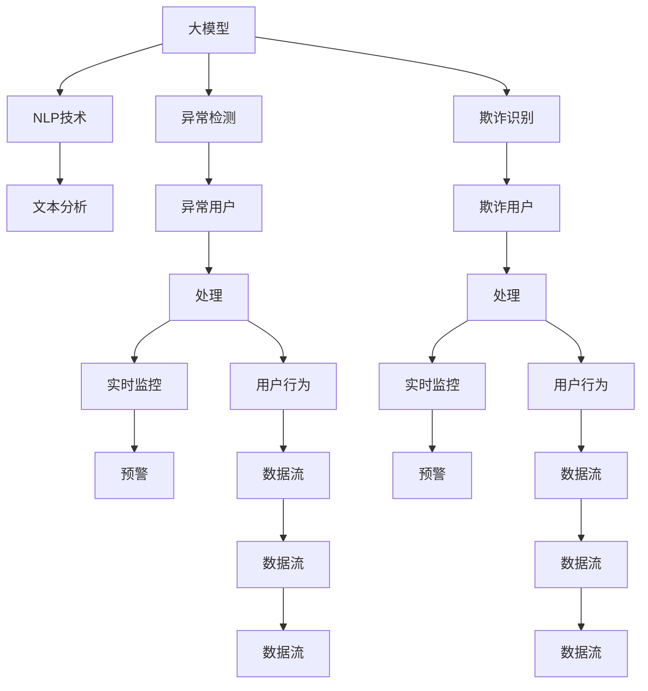

                 

# 大模型技术在电商平台用户行为异常检测与防欺诈中的应用

> 关键词：电商、用户行为、异常检测、防欺诈、大模型、机器学习、自然语言处理(NLP)

## 1. 背景介绍

### 1.1 问题由来
随着电子商务的飞速发展，平台交易量逐年增加，带来显著的商业价值。然而，与此同时，电商平台也面临着日益增长的用户行为异常和欺诈风险。特别是在近年来的疫情期间，许多用户通过电商渠道进行线上采购，其行为模式的变化更加不可预测，风险防控的难度也随之增大。

行为异常检测和防欺诈是电商平台风险管理的重要组成部分。通过预测和识别用户行为中的异常和欺诈行为，电商平台可以及时采取措施，有效降低潜在损失，保护用户利益和平台利益。传统的基于规则或手工特征设计的异常检测和防欺诈模型，难以处理大规模数据和复杂模式识别问题。而基于大模型的新型技术，如深度学习、自然语言处理(NLP)等，通过预训练模型的大规模数据，能够获取更丰富的上下文语义信息，显著提升异常检测和防欺诈的准确性和鲁棒性。

### 1.2 问题核心关键点
大模型技术在电商平台中的应用，主要集中在以下几个核心关键点：

- 用户行为异常检测：通过分析用户行为特征，识别出异常用户行为，如频繁退货、交易异常等。
- 电商平台防欺诈：利用用户行为数据和大模型进行欺诈行为预测和识别。
- 自然语言处理：通过NLP技术分析用户的评论、投诉、客服记录等文本信息，从中挖掘可能的欺诈信号。
- 预训练与微调：使用预训练大模型作为特征提取器，通过微调优化特定任务，提升检测和识别性能。
- 实时处理能力：大模型通常具有较强的并行处理能力，适合于电商平台的实时数据流处理需求。

这些关键点共同构成了电商平台大模型技术应用的框架，其目的是通过先进的算法和模型，实现对用户行为更精准的识别和预测，为电商平台提供更可靠的安全保障。

## 2. 核心概念与联系

### 2.1 核心概念概述

为更好地理解电商平台用户行为异常检测与防欺诈中大模型的应用，本节将介绍几个密切相关的核心概念：

- 大模型：指通过大规模数据训练得到的深度学习模型，如BERT、GPT-3等。大模型通常具有较强的泛化能力，能够捕捉复杂的特征和模式。
- 自然语言处理(NLP)：涉及将自然语言文本转换为计算机可处理的形式，包括分词、词性标注、实体识别等。NLP技术在电商平台中用于分析用户评论、客服记录等文本数据。
- 异常检测：指通过数据分析，识别出与正常行为不符的异常情况。电商平台常使用用户行为时间序列分析、交易行为模式分析等方法进行异常检测。
- 欺诈识别：指识别出具有欺诈特征的用户行为，通常使用分类模型、序列模型等机器学习算法进行预测。
- 预训练与微调：通过在大规模数据上预训练大模型，获得通用的语言表示，然后在特定任务上进行微调，使其具备特定领域的能力。
- 实时处理：指在电商平台的数据流中实时处理和分析数据，以快速响应和应对异常和欺诈行为。

这些概念之间的逻辑关系可以通过以下Mermaid流程图来展示：



这个流程图展示了大模型技术在电商平台中的应用流程：

1. 大模型通过预训练学习通用的语言表示。
2. NLP技术分析用户评论、客服记录等文本数据，提取有用的信息。
3. 异常检测和欺诈识别模型通过分析用户行为数据，识别异常和欺诈情况。
4. 异常和欺诈用户被实时监控和预警。
5. 用户行为数据流经过实时处理，反馈到平台安全系统。

## 3. 核心算法原理 & 具体操作步骤
### 3.1 算法原理概述

电商平台用户行为异常检测与防欺诈基于大模型的应用，主要是一种有监督的异常检测和分类方法。其核心思想是：将预训练大模型视作一个强大的"特征提取器"，通过在电商平台上标注的用户行为数据上进行有监督的微调，使模型学习出特定任务下的行为特征，从而实现对异常行为和欺诈行为的识别。

形式化地，假设预训练大模型为 $M_{\theta}$，其中 $\theta$ 为预训练得到的模型参数。给定电商平台用户的标注行为数据集 $D=\{(x_i, y_i)\}_{i=1}^N$，其中 $x_i$ 为行为数据，$y_i$ 为标签，表示该行为是否为异常或欺诈行为。异常检测和防欺诈的目标是找到新的模型参数 $\hat{\theta}$，使得：

$$
\hat{\theta}=\mathop{\arg\min}_{\theta} \mathcal{L}(M_{\theta},D)
$$

其中 $\mathcal{L}$ 为针对任务设计的损失函数，用于衡量模型预测输出与真实标签之间的差异。常见的损失函数包括交叉熵损失、均方误差损失等。

通过梯度下降等优化算法，微调过程不断更新模型参数 $\theta$，最小化损失函数 $\mathcal{L}$，使得模型输出逼近真实标签。由于 $\theta$ 已经通过预训练获得了较好的初始化，因此即便在规模较小、标注数据不足的情况下，仍可以快速收敛到理想的模型参数 $\hat{\theta}$。

### 3.2 算法步骤详解

基于大模型技术的电商平台用户行为异常检测与防欺诈，一般包括以下几个关键步骤：

**Step 1: 准备预训练模型和数据集**
- 选择合适的预训练大模型 $M_{\theta}$ 作为初始化参数，如BERT、GPT-3等。
- 准备电商平台用户行为的标注数据集 $D$，划分为训练集、验证集和测试集。一般要求标注数据与预训练数据的分布不要差异过大。

**Step 2: 添加任务适配层**
- 根据任务类型，在预训练模型顶层设计合适的输出层和损失函数。
- 对于异常检测任务，通常在顶层添加分类器和交叉熵损失函数。
- 对于欺诈识别任务，使用语言模型的解码器输出概率分布，并以负对数似然为损失函数。

**Step 3: 设置微调超参数**
- 选择合适的优化算法及其参数，如 AdamW、SGD 等，设置学习率、批大小、迭代轮数等。
- 设置正则化技术及强度，包括权重衰减、Dropout、Early Stopping 等。
- 确定冻结预训练参数的策略，如仅微调顶层，或全部参数都参与微调。

**Step 4: 执行梯度训练**
- 将训练集数据分批次输入模型，前向传播计算损失函数。
- 反向传播计算参数梯度，根据设定的优化算法和学习率更新模型参数。
- 周期性在验证集上评估模型性能，根据性能指标决定是否触发 Early Stopping。
- 重复上述步骤直到满足预设的迭代轮数或 Early Stopping 条件。

**Step 5: 测试和部署**
- 在测试集上评估微调后模型 $M_{\hat{\theta}}$ 的性能，对比微调前后的精度提升。
- 使用微调后的模型对新用户行为进行推理预测，集成到实际的安全监控系统中。
- 持续收集新的用户行为数据，定期重新微调模型，以适应数据分布的变化。

以上是基于大模型技术的电商平台用户行为异常检测与防欺诈的一般流程。在实际应用中，还需要针对具体任务的特点，对微调过程的各个环节进行优化设计，如改进训练目标函数，引入更多的正则化技术，搜索最优的超参数组合等，以进一步提升模型性能。

### 3.3 算法优缺点

基于大模型的电商平台用户行为异常检测与防欺诈方法具有以下优点：
1. 强大泛化能力。预训练大模型通常具备较强的泛化能力，能够处理复杂的多模态数据，对异常和欺诈行为有良好的识别能力。
2. 模型效果显著。微调后的模型在特定任务上表现优异，能显著提高异常检测和欺诈识别的准确率。
3. 适应性强。通过微调，模型能够适应不同电商平台的用户行为模式，适应性较强。
4. 实时性。大模型通常具有较强的并行处理能力，能够实时处理电商平台上的大量数据，满足实时监控的需求。

同时，该方法也存在一定的局限性：
1. 依赖标注数据。异常检测和欺诈识别依赖于标注数据，标注数据的获取和处理成本较高。
2. 模型复杂度高。大模型的复杂度较高，对计算资源和存储资源的要求也较高。
3. 风险共性不足。大模型通常对特定领域的数据进行微调，对共性问题如欺诈行为识别效果较好，但对特定行业的欺诈行为识别效果可能不理想。
4. 可解释性不足。大模型通常难以解释其内部决策过程，难以进行调试和优化。

尽管存在这些局限性，但就目前而言，基于大模型的微调方法仍是电商平台用户行为异常检测与防欺诈的主流范式。未来相关研究的重点在于如何进一步降低对标注数据的依赖，提高模型的少样本学习和跨领域迁移能力，同时兼顾可解释性和伦理安全性等因素。

### 3.4 算法应用领域

基于大模型的电商平台用户行为异常检测与防欺诈方法，已经在多个电商平台上得到了广泛应用，例如：

- 用户行为异常检测：分析用户登录、浏览、购买等行为，识别出异常用户行为。如频繁退货、异常交易等。
- 欺诈行为识别：通过分析用户交易记录、评论记录等数据，识别出具有欺诈特征的用户行为，如虚假交易、恶意退货等。
- 行为模式分析：利用用户行为时间序列数据，进行行为模式建模，预测用户行为变化趋势。
- 交易风险评估：综合分析用户行为和交易记录，评估交易风险，采取相应的防控措施。

除了上述这些经典任务外，大模型技术还被创新性地应用到更多场景中，如个性化推荐、内容审核、供应链管理等，为电商平台带来了全新的突破。随着预训练模型和微调方法的不断进步，相信电商平台技术将在更广阔的应用领域大放异彩。

## 4. 数学模型和公式 & 详细讲解  
### 4.1 数学模型构建

本节将使用数学语言对基于大模型的电商平台用户行为异常检测与防欺诈过程进行更加严格的刻画。

记预训练大模型为 $M_{\theta}$，其中 $\theta$ 为预训练得到的模型参数。假设电商平台用户行为异常检测任务 $T$ 的训练集为 $D=\{(x_i,y_i)\}_{i=1}^N$，其中 $x_i$ 为行为数据，$y_i$ 为标签，表示该行为是否为异常行为。

定义模型 $M_{\theta}$ 在数据样本 $(x,y)$ 上的损失函数为 $\ell(M_{\theta}(x),y)$，则在数据集 $D$ 上的经验风险为：

$$
\mathcal{L}(\theta) = \frac{1}{N} \sum_{i=1}^N \ell(M_{\theta}(x_i),y_i)
$$

微调的优化目标是最小化经验风险，即找到最优参数：

$$
\theta^* = \mathop{\arg\min}_{\theta} \mathcal{L}(\theta)
$$

在实践中，我们通常使用基于梯度的优化算法（如SGD、Adam等）来近似求解上述最优化问题。设 $\eta$ 为学习率，$\lambda$ 为正则化系数，则参数的更新公式为：

$$
\theta \leftarrow \theta - \eta \nabla_{\theta}\mathcal{L}(\theta) - \eta\lambda\theta
$$

其中 $\nabla_{\theta}\mathcal{L}(\theta)$ 为损失函数对参数 $\theta$ 的梯度，可通过反向传播算法高效计算。

### 4.2 公式推导过程

以下我们以异常检测任务为例，推导交叉熵损失函数及其梯度的计算公式。

假设模型 $M_{\theta}$ 在输入 $x$ 上的输出为 $\hat{y}=M_{\theta}(x) \in [0,1]$，表示样本属于异常的概率。真实标签 $y \in \{0,1\}$。则二分类交叉熵损失函数定义为：

$$
\ell(M_{\theta}(x),y) = -[y\log \hat{y} + (1-y)\log (1-\hat{y})]
$$

将其代入经验风险公式，得：

$$
\mathcal{L}(\theta) = -\frac{1}{N}\sum_{i=1}^N [y_i\log M_{\theta}(x_i)+(1-y_i)\log(1-M_{\theta}(x_i))]
$$

根据链式法则，损失函数对参数 $\theta_k$ 的梯度为：

$$
\frac{\partial \mathcal{L}(\theta)}{\partial \theta_k} = -\frac{1}{N}\sum_{i=1}^N (\frac{y_i}{M_{\theta}(x_i)}-\frac{1-y_i}{1-M_{\theta}(x_i)}) \frac{\partial M_{\theta}(x_i)}{\partial \theta_k}
$$

其中 $\frac{\partial M_{\theta}(x_i)}{\partial \theta_k}$ 可进一步递归展开，利用自动微分技术完成计算。

在得到损失函数的梯度后，即可带入参数更新公式，完成模型的迭代优化。重复上述过程直至收敛，最终得到适应电商平台用户行为异常检测任务的最优模型参数 $\theta^*$。

## 5. 项目实践：代码实例和详细解释说明
### 5.1 开发环境搭建

在进行电商平台用户行为异常检测与防欺诈的微调实践前，我们需要准备好开发环境。以下是使用Python进行PyTorch开发的环境配置流程：

1. 安装Anaconda：从官网下载并安装Anaconda，用于创建独立的Python环境。

2. 创建并激活虚拟环境：
```bash
conda create -n pytorch-env python=3.8 
conda activate pytorch-env
```

3. 安装PyTorch：根据CUDA版本，从官网获取对应的安装命令。例如：
```bash
conda install pytorch torchvision torchaudio cudatoolkit=11.1 -c pytorch -c conda-forge
```

4. 安装Transformers库：
```bash
pip install transformers
```

5. 安装各类工具包：
```bash
pip install numpy pandas scikit-learn matplotlib tqdm jupyter notebook ipython
```

完成上述步骤后，即可在`pytorch-env`环境中开始微调实践。

### 5.2 源代码详细实现

下面我们以电商平台异常检测任务为例，给出使用Transformers库对BERT模型进行微调的PyTorch代码实现。

首先，定义异常检测任务的数据处理函数：

```python
from transformers import BertTokenizer
from torch.utils.data import Dataset
import torch

class E-commerceAnomalyDataset(Dataset):
    def __init__(self, data, tokenizer, max_len=128):
        self.data = data
        self.tokenizer = tokenizer
        self.max_len = max_len
        
    def __len__(self):
        return len(self.data)
    
    def __getitem__(self, idx):
        text = self.data[idx]
        encoding = self.tokenizer(text, return_tensors='pt', max_length=self.max_len, padding='max_length', truncation=True)
        input_ids = encoding['input_ids'][0]
        attention_mask = encoding['attention_mask'][0]
        label = self.data[idx]
        
        return {'input_ids': input_ids, 
                'attention_mask': attention_mask,
                'label': label}

# 定义异常和正常行为标签
labels = {'normal': 0, 'anomaly': 1}

# 创建dataset
tokenizer = BertTokenizer.from_pretrained('bert-base-cased')

train_dataset = E-commerceAnomalyDataset(train_data, tokenizer)
dev_dataset = E-commerceAnomalyDataset(dev_data, tokenizer)
test_dataset = E-commerceAnomalyDataset(test_data, tokenizer)
```

然后，定义模型和优化器：

```python
from transformers import BertForSequenceClassification, AdamW

model = BertForSequenceClassification.from_pretrained('bert-base-cased', num_labels=len(labels))

optimizer = AdamW(model.parameters(), lr=2e-5)
```

接着，定义训练和评估函数：

```python
from torch.utils.data import DataLoader
from tqdm import tqdm
from sklearn.metrics import classification_report

device = torch.device('cuda') if torch.cuda.is_available() else torch.device('cpu')
model.to(device)

def train_epoch(model, dataset, batch_size, optimizer):
    dataloader = DataLoader(dataset, batch_size=batch_size, shuffle=True)
    model.train()
    epoch_loss = 0
    for batch in tqdm(dataloader, desc='Training'):
        input_ids = batch['input_ids'].to(device)
        attention_mask = batch['attention_mask'].to(device)
        labels = batch['label'].to(device)
        model.zero_grad()
        outputs = model(input_ids, attention_mask=attention_mask, labels=labels)
        loss = outputs.loss
        epoch_loss += loss.item()
        loss.backward()
        optimizer.step()
    return epoch_loss / len(dataloader)

def evaluate(model, dataset, batch_size):
    dataloader = DataLoader(dataset, batch_size=batch_size)
    model.eval()
    preds, labels = [], []
    with torch.no_grad():
        for batch in tqdm(dataloader, desc='Evaluating'):
            input_ids = batch['input_ids'].to(device)
            attention_mask = batch['attention_mask'].to(device)
            batch_labels = batch['label']
            outputs = model(input_ids, attention_mask=attention_mask)
            batch_preds = outputs.logits.argmax(dim=2).to('cpu').tolist()
            batch_labels = batch_labels.to('cpu').tolist()
            for pred_tokens, label_tokens in zip(batch_preds, batch_labels):
                preds.append(pred_tokens)
                labels.append(label_tokens)
                
    print(classification_report(labels, preds))
```

最后，启动训练流程并在测试集上评估：

```python
epochs = 5
batch_size = 16

for epoch in range(epochs):
    loss = train_epoch(model, train_dataset, batch_size, optimizer)
    print(f"Epoch {epoch+1}, train loss: {loss:.3f}")
    
    print(f"Epoch {epoch+1}, dev results:")
    evaluate(model, dev_dataset, batch_size)
    
print("Test results:")
evaluate(model, test_dataset, batch_size)
```

以上就是使用PyTorch对BERT进行电商平台异常检测任务微调的完整代码实现。可以看到，得益于Transformers库的强大封装，我们可以用相对简洁的代码完成BERT模型的加载和微调。

### 5.3 代码解读与分析

让我们再详细解读一下关键代码的实现细节：

**E-commerceAnomalyDataset类**：
- `__init__`方法：初始化行为数据、分词器等关键组件。
- `__len__`方法：返回数据集的样本数量。
- `__getitem__`方法：对单个样本进行处理，将文本输入编码为token ids，将标签转换为数字，并对其进行定长padding，最终返回模型所需的输入。

**labels字典**：
- 定义了异常和正常行为标签与数字id之间的映射关系，用于将token-wise的预测结果解码回真实的标签。

**训练和评估函数**：
- 使用PyTorch的DataLoader对数据集进行批次化加载，供模型训练和推理使用。
- 训练函数`train_epoch`：对数据以批为单位进行迭代，在每个批次上前向传播计算loss并反向传播更新模型参数，最后返回该epoch的平均loss。
- 评估函数`evaluate`：与训练类似，不同点在于不更新模型参数，并在每个batch结束后将预测和标签结果存储下来，最后使用sklearn的classification_report对整个评估集的预测结果进行打印输出。

**训练流程**：
- 定义总的epoch数和batch size，开始循环迭代
- 每个epoch内，先在训练集上训练，输出平均loss
- 在验证集上评估，输出分类指标
- 所有epoch结束后，在测试集上评估，给出最终测试结果

可以看到，PyTorch配合Transformers库使得BERT微调的代码实现变得简洁高效。开发者可以将更多精力放在数据处理、模型改进等高层逻辑上，而不必过多关注底层的实现细节。

当然，工业级的系统实现还需考虑更多因素，如模型的保存和部署、超参数的自动搜索、更灵活的任务适配层等。但核心的微调范式基本与此类似。

## 6. 实际应用场景
### 6.1 智能客服系统

基于大模型技术的电商平台用户行为异常检测与防欺诈技术，可以广泛应用于智能客服系统的构建。传统客服往往需要配备大量人力，高峰期响应缓慢，且一致性和专业性难以保证。而使用异常检测和防欺诈技术，可以自动识别出异常和欺诈行为，及时处理问题，提高客户满意度和平台安全性。

在技术实现上，可以收集企业内部的历史客服对话记录，将问题和最佳答复构建成监督数据，在此基础上对预训练对话模型进行微调。微调后的对话模型能够自动理解用户意图，匹配最合适的答案模板进行回复。对于客户提出的新问题，还可以接入检索系统实时搜索相关内容，动态组织生成回答。如此构建的智能客服系统，能大幅提升客户咨询体验和问题解决效率。

### 6.2 金融舆情监测

金融机构需要实时监测市场舆论动向，以便及时应对负面信息传播，规避金融风险。传统的人工监测方式成本高、效率低，难以应对网络时代海量信息爆发的挑战。基于大模型技术的文本分类和情感分析技术，为金融舆情监测提供了新的解决方案。

具体而言，可以收集金融领域相关的新闻、报道、评论等文本数据，并对其进行主题标注和情感标注。在此基础上对预训练语言模型进行微调，使其能够自动判断文本属于何种主题，情感倾向是正面、中性还是负面。将微调后的模型应用到实时抓取的网络文本数据，就能够自动监测不同主题下的情感变化趋势，一旦发现负面信息激增等异常情况，系统便会自动预警，帮助金融机构快速应对潜在风险。

### 6.3 个性化推荐系统

当前的推荐系统往往只依赖用户的历史行为数据进行物品推荐，无法深入理解用户的真实兴趣偏好。基于大模型技术的异常检测和防欺诈技术，个性化推荐系统可以更好地挖掘用户行为背后的语义信息，从而提供更精准、多样的推荐内容。

在实践中，可以收集用户浏览、点击、评论、分享等行为数据，提取和用户交互的物品标题、描述、标签等文本内容。将文本内容作为模型输入，用户的后续行为（如是否点击、购买等）作为监督信号，在此基础上微调预训练语言模型。微调后的模型能够从文本内容中准确把握用户的兴趣点。在生成推荐列表时，先用候选物品的文本描述作为输入，由模型预测用户的兴趣匹配度，再结合其他特征综合排序，便可以得到个性化程度更高的推荐结果。

### 6.4 未来应用展望

随着大模型技术和大数据分析的不断发展，基于异常检测和防欺诈的电商平台技术将在更多领域得到应用，为各行各业带来变革性影响。

在智慧医疗领域，基于大模型的用户行为分析技术，可以帮助医院监测患者行为异常，及时发现潜在风险，提高医疗服务的智能化水平，辅助医生诊疗，加速新药开发进程。

在智能教育领域，微调技术可应用于作业批改、学情分析、知识推荐等方面，因材施教，促进教育公平，提高教学质量。

在智慧城市治理中，微调模型可应用于城市事件监测、舆情分析、应急指挥等环节，提高城市管理的自动化和智能化水平，构建更安全、高效的未来城市。

此外，在企业生产、社会治理、文娱传媒等众多领域，基于大模型的电商平台技术也将不断涌现，为传统行业数字化转型升级提供新的技术路径。相信随着技术的日益成熟，电商平台技术将成为人工智能落地应用的重要范式，推动人工智能技术在各行各业的普及和发展。

## 7. 工具和资源推荐
### 7.1 学习资源推荐

为了帮助开发者系统掌握电商平台用户行为异常检测与防欺诈的理论基础和实践技巧，这里推荐一些优质的学习资源：

1. 《深度学习理论与实践》系列博文：由大模型技术专家撰写，深入浅出地介绍了深度学习模型的构建、训练和优化等基础内容。

2. CS234《深度学习与模式识别》课程：斯坦福大学开设的机器学习明星课程，涵盖深度学习的基本原理和算法。

3. 《Deep Learning for NLP》书籍：NLP领域的经典教材，介绍了深度学习在自然语言处理中的应用，包括异常检测、文本分类等任务。

4. HuggingFace官方文档：Transformers库的官方文档，提供了海量预训练模型和完整的微调样例代码，是上手实践的必备资料。

5. Arxiv论文：深度学习和自然语言处理领域的前沿研究论文，涵盖了异常检测、防欺诈等主题。

通过对这些资源的学习实践，相信你一定能够快速掌握电商平台异常检测与防欺诈的精髓，并用于解决实际的电商平台问题。
###  7.2 开发工具推荐

高效的开发离不开优秀的工具支持。以下是几款用于电商平台异常检测与防欺诈开发的常用工具：

1. PyTorch：基于Python的开源深度学习框架，灵活动态的计算图，适合快速迭代研究。大部分预训练语言模型都有PyTorch版本的实现。

2. TensorFlow：由Google主导开发的开源深度学习框架，生产部署方便，适合大规模工程应用。同样有丰富的预训练语言模型资源。

3. Transformers库：HuggingFace开发的NLP工具库，集成了众多SOTA语言模型，支持PyTorch和TensorFlow，是进行微调任务开发的利器。

4. Weights & Biases：模型训练的实验跟踪工具，可以记录和可视化模型训练过程中的各项指标，方便对比和调优。与主流深度学习框架无缝集成。

5. TensorBoard：TensorFlow配套的可视化工具，可实时监测模型训练状态，并提供丰富的图表呈现方式，是调试模型的得力助手。

6. Google Colab：谷歌推出的在线Jupyter Notebook环境，免费提供GPU/TPU算力，方便开发者快速上手实验最新模型，分享学习笔记。

合理利用这些工具，可以显著提升电商平台异常检测与防欺诈任务的开发效率，加快创新迭代的步伐。

### 7.3 相关论文推荐

电商平台异常检测与防欺诈技术的发展源于学界的持续研究。以下是几篇奠基性的相关论文，推荐阅读：

1. Anomaly Detection Using Deep Learning Models: A Survey：综述了基于深度学习的异常检测方法，介绍了各种模型的原理和应用。

2. Text Mining for Financial Fraud Detection：介绍了利用自然语言处理技术进行金融欺诈检测的研究现状和方法。

3. Deep Learning for Personalized Recommendation：介绍了深度学习在个性化推荐系统中的应用，包括异常检测和行为建模等。

4. Large-scale Event Recognition from Raw Social Media Data Using Deep Learning：探讨了使用深度学习技术进行大规模事件监测和舆情分析的方法。

5. High-Performance Deep Neural Networks for Fraud Detection：介绍了深度神经网络在金融欺诈检测中的高效应用。

这些论文代表了大模型技术在电商平台异常检测与防欺诈领域的发展脉络。通过学习这些前沿成果，可以帮助研究者把握学科前进方向，激发更多的创新灵感。

## 8. 总结：未来发展趋势与挑战
### 8.1 总结

本文对基于大模型的电商平台用户行为异常检测与防欺诈技术进行了全面系统的介绍。首先阐述了电商平台用户行为异常检测与防欺诈的研究背景和意义，明确了异常检测和防欺诈技术在电商平台风险管理中的独特价值。其次，从原理到实践，详细讲解了异常检测和防欺诈的数学原理和关键步骤，给出了异常检测任务开发的完整代码实例。同时，本文还广泛探讨了异常检测与防欺诈方法在智能客服、金融舆情、个性化推荐等多个电商场景中的应用前景，展示了大模型技术的广阔前景。最后，本文精选了异常检测与防欺诈技术的各类学习资源，力求为读者提供全方位的技术指引。

通过本文的系统梳理，可以看到，基于大模型的电商平台异常检测与防欺诈技术正在成为电商平台风险管理的重要范式，极大地提升了平台风险管理的智能化水平，为电商平台带来了更加安全和可靠的保障。未来，伴随大模型技术和大数据分析的持续进步，基于异常检测与防欺诈的电商平台技术必将进一步发展，为各行各业带来更深远的影响。

### 8.2 未来发展趋势

展望未来，电商平台用户行为异常检测与防欺诈技术将呈现以下几个发展趋势：

1. 模型规模持续增大。随着算力成本的下降和数据规模的扩张，预训练语言模型的参数量还将持续增长。超大规模语言模型蕴含的丰富语言知识，有望支撑更加复杂多变的电商异常检测和防欺诈任务。

2. 异常检测与防欺诈方法日趋多样。除了传统的分类模型外，未来会涌现更多异常检测和防欺诈的方法，如序列模型、异常生成模型等，在处理不同类型异常和欺诈行为时取得更好的效果。

3. 数据与模型联合优化。随着电商数据的实时产生，利用在线学习、增量学习等技术，能够不断更新模型参数，提升异常检测和防欺诈的实时性和准确性。

4. 多模态融合。电商场景中除了文本数据外，还有大量的图片、视频等数据。未来会进一步拓展到图像、视频等多模态数据异常检测与防欺诈，为电商平台带来更全面的安全保障。

5. 个性化与实时性兼顾。利用大模型技术，能够实现对不同用户行为的个性化异常检测与防欺诈策略，同时具备实时响应能力，适应快速变化的电商平台场景。

以上趋势凸显了大模型技术在电商平台异常检测与防欺诈中的广阔前景。这些方向的探索发展，必将进一步提升电商平台的安全性和用户体验，为电商平台带来更大的商业价值。

### 8.3 面临的挑战

尽管电商平台异常检测与防欺诈技术已经取得了瞩目成就，但在迈向更加智能化、普适化应用的过程中，它仍面临着诸多挑战：

1. 标注成本瓶颈。异常检测和防欺诈依赖于标注数据，标注数据的获取和处理成本较高。如何进一步降低对标注数据的依赖，将是一大难题。

2. 模型鲁棒性不足。异常检测与防欺诈模型面临域外数据时，泛化性能往往大打折扣。对于测试样本的微小扰动，模型容易出现误判。如何提高模型的鲁棒性，避免误判，还需要更多理论和实践的积累。

3. 实时处理能力有待提高。电商平台场景下数据流速度较快，对于实时处理能力的要求较高。如何优化模型结构和算法，提高推理速度，减少计算资源消耗，将是重要的优化方向。

4. 可解释性亟需加强。异常检测与防欺诈模型通常难以解释其内部决策过程，难以进行调试和优化。如何赋予模型更强的可解释性，将是亟待攻克的难题。

5. 安全性有待保障。异常检测与防欺诈模型难免会学习到有害信息，通过微调传递到电商平台上，可能带来安全隐患。如何从数据和算法层面消除模型偏见，避免恶意用途，确保输出的安全性，也将是重要的研究课题。

6. 知识整合能力不足。现有的异常检测与防欺诈模型往往局限于任务内数据，难以灵活吸收和运用更广泛的先验知识。如何让模型更好地与外部知识库、规则库等专家知识结合，形成更加全面、准确的信息整合能力，还有很大的想象空间。

正视异常检测与防欺诈面临的这些挑战，积极应对并寻求突破，将是大模型技术走向成熟的必由之路。相信随着学界和产业界的共同努力，这些挑战终将一一被克服，电商平台异常检测与防欺诈技术必将在构建安全、可靠、可解释、可控的智能系统铺平道路。

### 8.4 研究展望

面对电商平台异常检测与防欺诈所面临的种种挑战，未来的研究需要在以下几个方面寻求新的突破：

1. 探索无监督和半监督异常检测方法。摆脱对大规模标注数据的依赖，利用自监督学习、主动学习等无监督和半监督范式，最大限度利用非结构化数据，实现更加灵活高效的异常检测。

2. 研究参数高效和计算高效的异常检测方法。开发更加参数高效的异常检测方法，在固定大部分预训练参数的同时，只更新极少量的任务相关参数。同时优化异常检测模型的计算图，减少前向传播和反向传播的资源消耗，实现更加轻量级、实时性的部署。

3. 引入更多先验知识。将符号化的先验知识，如知识图谱、逻辑规则等，与神经网络模型进行巧妙融合，引导异常检测过程学习更准确、合理的语言模型。同时加强不同模态数据的整合，实现视觉、语音等多模态信息与文本信息的协同建模。

4. 结合因果分析和博弈论工具。将因果分析方法引入异常检测模型，识别出模型决策的关键特征，增强输出解释的因果性和逻辑性。借助博弈论工具刻画人机交互过程，主动探索并规避模型的脆弱点，提高系统稳定性。

5. 纳入伦理道德约束。在模型训练目标中引入伦理导向的评估指标，过滤和惩罚有害的输出倾向。同时加强人工干预和审核，建立模型行为的监管机制，确保输出符合人类价值观和伦理道德。

这些研究方向的探索，必将引领电商平台异常检测与防欺诈技术迈向更高的台阶，为构建安全、可靠、可解释、可控的智能系统铺平道路。面向未来，电商平台异常检测与防欺诈技术还需要与其他人工智能技术进行更深入的融合，如知识表示、因果推理、强化学习等，多路径协同发力，共同推动自然语言理解和智能交互系统的进步。只有勇于创新、敢于突破，才能不断拓展电商平台异常检测与防欺诈技术的边界，让智能技术更好地造福电商平台用户。

## 9. 附录：常见问题与解答
**Q1：电商平台用户行为异常检测与防欺诈技术是否适用于所有电商平台？**

A: 电商平台用户行为异常检测与防欺诈技术对电商平台的数据分布、业务模式等有较高的要求。不同电商平台的用户行为模式差异较大，需要针对性地进行模型设计和参数优化。然而，基于大模型的异常检测与防欺诈方法具有较强的泛化能力，可以应用于各类电商平台的异常检测和防欺诈任务。

**Q2：如何选择合适的预训练模型？**

A: 选择合适的预训练模型需考虑以下几个因素：
1. 任务类型：如文本分类、序列标注等，不同的任务类型需要不同的预训练模型。
2. 数据规模：对于数据量较大的任务，可以使用更大的预训练模型。
3. 计算资源：预训练模型的规模越大，需要的计算资源也越多。

**Q3：异常检测与防欺诈模型如何避免过拟合？**

A: 避免过拟合的常见方法包括：
1. 数据增强：通过数据扩充、数据合成等方式增加训练样本数量。
2. 正则化：使用L2正则、Dropout、Early Stopping等技术抑制模型复杂度。
3. 对抗训练：引入对抗样本训练模型，提高模型鲁棒性。
4. 模型集成：使用多个模型的预测结果进行集成，提高模型鲁棒性。

**Q4：异常检测与防欺诈模型在实际部署中需要注意哪些问题？**

A: 异常检测与防欺诈模型的实际部署需要注意以下问题：
1. 模型裁剪：去除不必要的层和参数，减小模型尺寸，加快推理速度。
2. 量化加速：将浮点模型转为定点模型，压缩存储空间，提高计算效率。
3. 服务化封装：将模型封装为标准化服务接口，便于集成调用。
4. 弹性伸缩：根据请求流量动态调整资源配置，平衡服务质量和成本。
5. 监控告警：实时采集系统指标，设置异常告警阈值，确保服务稳定性。
6. 安全防护：采用访问鉴权、数据脱敏等措施，保障数据和模型安全。

**Q5：如何提高异常检测与防欺诈模型的实时性？**

A: 提高异常检测与防欺诈模型的实时性需考虑以下策略：
1. 优化模型结构：使用轻量级模型，减少计算量。
2. 模型并行化：采用多模型并行计算，提高处理速度。
3. 增量学习：利用在线学习技术，实时更新模型参数。
4. 缓存机制：对频繁使用的数据进行缓存，减少重复计算。

**Q6：异常检测与防欺诈模型的可解释性不足，如何解决？**

A: 提高异常检测与防欺诈模型的可解释性可以从以下方面入手：
1. 模型可视化：使用模型可视化工具，如TensorBoard，观察模型内部结构和参数变化。
2. 特征可视化：提取模型的关键特征，分析其对异常检测结果的影响。
3. 特征重要性分析：使用特征重要性排序方法，评估不同特征对模型输出的贡献。

**Q7：异常检测与防欺诈模型的安全性如何保障？**

A: 保障异常检测与防欺诈模型的安全性需从以下方面入手：
1. 数据清洗：过滤掉有害数据，避免模型学习到有害信息。
2. 模型监控：实时监控模型输出，及时发现异常行为。
3. 数据脱敏：对敏感数据进行脱敏处理，保护用户隐私。
4. 安全审计：定期审计模型输出，发现潜在的风险点。

**Q8：异常检测与防欺诈模型如何结合因果分析？**

A: 结合因果分析的异常检测与防欺诈模型需从以下方面入手：
1. 因果图建模：构建因果图模型，分析模型决策的关键特征。
2. 因果推理：使用因果推理方法，评估模型输出与因果关系的一致性。
3. 因果解释：提供因果解释，增强模型的可解释性。

**Q9：异常检测与防欺诈模型如何结合博弈论？**

A: 结合博弈论的异常检测与防欺诈模型需从以下方面入手：
1. 建模博弈过程：构建博弈过程模型，描述人机交互行为。
2. 策略优化：使用博弈论方法，优化模型策略。
3. 公平性评估：评估模型的公平性和鲁棒性。

通过以上问题的解答，相信读者能够更全面地理解电商平台异常检测与防欺诈技术，并能够在实际应用中更好地应对挑战，实现高效、安全的风险管理。

---

作者：禅与计算机程序设计艺术 / Zen and the Art of Computer Programming

