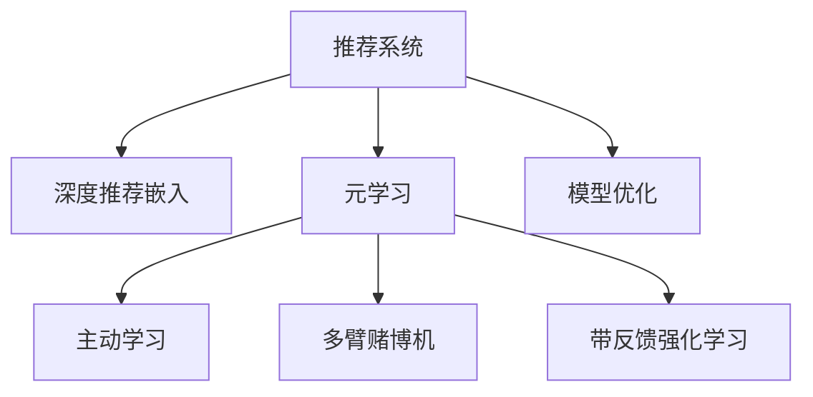

                 

# 大模型推荐中的元学习方法

> 关键词：推荐系统, 元学习, 深度强化学习, 主动学习, 多臂赌博机, 带反馈强化学习, 模型优化

## 1. 背景介绍

在互联网的浪潮下，推荐系统成为各大平台的核心竞争力之一。推荐系统的目的在于基于用户的历史行为数据，预测用户对未体验过的物品的评分或购买意向，从而为用户推荐最符合其兴趣的商品、内容或服务。推荐系统分为协同过滤、基于内容的推荐、混合推荐等多种类型，其中基于内容的推荐因其普适性和可解释性，成为近年来研究的热点。

但传统的基于内容的推荐系统往往面临着稀疏性和局部性问题。稀疏性问题指用户与物品之间的交互历史非常稀疏，使得系统难以捕捉用户和物品的真实兴趣。局部性问题指推荐结果过于依赖用户历史数据，缺乏对用户兴趣的探索和更新，易陷入推荐冷门物品的陷阱。

为解决这些问题，近年来大语言模型被引入推荐系统，以提升推荐效果和系统泛化能力。推荐系统中的大模型常被称为推荐嵌入模型，通过预训练大量的文本数据，学习到丰富的语义信息，从而在推荐任务上取得较好的效果。但预训练模型仍需要大量的标注数据进行微调，这与推荐系统数据稀疏、难以获取的特征相冲突。如何在大模型微调过程中引入更多未标记数据，提升模型泛化能力，成为了亟待解决的问题。

## 2. 核心概念与联系

为更好理解元学习在大模型推荐中的应用，我们需要引入一些关键概念。

- **推荐系统(Recommendation System)**：利用用户与物品之间的交互历史，预测用户对未体验过的物品的评分或购买意向，推荐符合用户兴趣的物品。推荐系统分为基于协同过滤、基于内容、混合推荐等多种类型，其中基于内容的推荐最为广泛。

- **深度推荐嵌入模型(Depth-based Recommendation Embedding)**：通过在大规模语料上进行预训练，学习物品与用户之间的语义表示，提升推荐效果。常见的模型包括Word2Vec、GloVe、BERT等。

- **元学习(Meta-Learning)**：一种学习学习过程的方法，目标是在已有任务上训练模型，使得模型能够高效泛化到新任务。元学习旨在通过有限的标记数据，快速学习新任务的相关知识。

- **主动学习(Active Learning)**：一种基于模型的学习策略，用于从未标记数据集中主动选择有信息量的样本进行标记，最小化标注成本。主动学习通过模型对样本难度的预测，选择最有价值样本进行标注。

- **多臂赌博机(Multi-Armed Bandit)**：一种不确定性决策问题，目标是在有限的资源条件下，选择收益最大的策略，常用于探索与利用均衡问题。

- **带反馈强化学习(Fed-Back Reinforcement Learning)**：一种强化学习范式，通过不断探索和利用，最大化长期收益。与传统的强化学习不同，带反馈强化学习能够对已有策略进行修正，提升学习效率。

- **模型优化(Model Optimization)**：在推荐系统中，通过优化模型参数，提升推荐效果。优化方法包括梯度下降、Adam等。

这些概念之间存在紧密联系，通过以下Mermaid流程图展示：



## 3. 核心算法原理 & 具体操作步骤

### 3.1 算法原理概述

元学习是一种学习学习过程的方法，旨在通过有限的数据，学习到模型在新任务上的快速适应能力。在大模型推荐中，元学习可以与深度强化学习、主动学习等方法结合，通过在不同推荐任务上训练推荐嵌入模型，使其具备更强的泛化能力。

具体而言，推荐嵌入模型在用户与物品的语义表示上进行了优化，以最大化预测准确率和用户满意度。但预训练模型往往面临数据稀疏、偏置等问题。通过引入元学习方法，推荐嵌入模型可以在多个推荐任务上进行迁移学习，充分利用不同任务之间的共享特征，提升模型的泛化能力。

### 3.2 算法步骤详解

大模型推荐中的元学习方法主要包括以下几个关键步骤：

**Step 1: 数据集划分与预处理**

将推荐数据集划分为训练集和测试集。预处理数据，去除无用信息，将用户与物品的描述向量转换为模型所需的输入格式。

**Step 2: 构建元学习模型**

选择元学习算法，如MAML、Reinforcement Learning等。设计推荐嵌入模型，并对其参数进行初始化。

**Step 3: 预训练与微调**

在多个推荐任务上进行预训练，学习到物品与用户的语义表示。在测试集上进行微调，调整模型参数以适应新任务。

**Step 4: 主动学习与反馈**

在预训练阶段，使用主动学习策略选择最有价值的未标记样本进行标注。在微调阶段，使用带反馈强化学习策略不断调整推荐策略，提升模型性能。

**Step 5: 推荐结果评估**

在测试集上评估推荐效果，对比预训练与微调后的推荐性能。分析推荐结果，优化模型参数。

### 3.3 算法优缺点

元学习在大模型推荐中具有以下优点：

1. **泛化能力更强**：通过在多个推荐任务上进行预训练，元学习模型具备更强的泛化能力，能够在新的推荐场景中快速适应。
2. **数据利用率高**：元学习方法可以通过主动学习策略，选择最有价值的未标记数据进行标注，减少标注成本。
3. **灵活性高**：元学习模型能够灵活适应不同类型的推荐任务，如基于内容的推荐、基于协同过滤的推荐等。

同时，元学习也存在一些局限性：

1. **计算复杂度高**：元学习需要训练多个任务模型，计算资源消耗大。
2. **模型难以解释**：元学习模型通常较为复杂，难以对其内部机制进行解释。
3. **过拟合风险高**：元学习模型在预训练和微调过程中，容易过拟合于特定任务。

### 3.4 算法应用领域

元学习在大模型推荐中的应用非常广泛，涵盖了多种推荐场景：

- **基于内容的推荐**：利用用户和物品的语义信息，推荐符合用户兴趣的文本、图片、视频等。
- **基于协同过滤的推荐**：通过用户历史行为和物品属性，推荐用户未交互过的相似物品。
- **混合推荐**：结合基于内容和协同过滤的优点，提升推荐效果。
- **个性化推荐**：通过用户画像和行为数据，推荐个性化的物品，提高用户满意度。
- **实时推荐**：针对用户即时反馈，实时调整推荐策略，提高推荐时效性。

## 4. 数学模型和公式 & 详细讲解  
### 4.1 数学模型构建

大模型推荐中的元学习方法通常采用带反馈的强化学习框架进行建模。假设有 $N$ 个用户，每个用户有 $M$ 个物品选择，推荐嵌入模型为 $f_{\theta}$，其参数为 $\theta$。设 $x_{ui}$ 为物品 $u$ 对用户 $i$ 的描述向量，$y_{ui}$ 为物品 $u$ 对用户 $i$ 的评分或购买意向。推荐模型预测用户 $i$ 对物品 $u$ 的评分 $p_{ui}$，定义为：

$$
p_{ui} = f_{\theta}(x_{ui})
$$

目标是最小化预测误差，即：

$$
L(\theta) = \mathbb{E}_{(x_{ui},y_{ui})}\big[(y_{ui}-p_{ui})^2\big]
$$

在强化学习框架下，我们定义奖励函数 $R$，表示用户选择物品后的满意度：

$$
R_{ui} = \max(0, y_{ui}-p_{ui})
$$

其中，$y_{ui}$ 为物品 $u$ 对用户 $i$ 的评分，$p_{ui}$ 为推荐模型的预测评分。目标是通过强化学习，不断调整模型参数 $\theta$，使得推荐模型能够最大化用户满意度。

### 4.2 公式推导过程

以下我们将通过数学推导，详细解释推荐嵌入模型的优化过程。

定义推荐模型的损失函数为：

$$
\mathcal{L}(\theta) = \frac{1}{N}\sum_{i=1}^N \frac{1}{M}\sum_{u=1}^M (y_{ui}-p_{ui})^2
$$

在强化学习框架下，定义模型参数 $\theta$ 的梯度为：

$$
\nabla_{\theta}\mathcal{L}(\theta) = \frac{1}{N}\sum_{i=1}^N \frac{1}{M}\sum_{u=1}^M \nabla_{\theta}p_{ui} \cdot (y_{ui}-p_{ui})
$$

其中，$\nabla_{\theta}p_{ui} = \nabla_{\theta}f_{\theta}(x_{ui})$ 为推荐模型对物品 $u$ 对用户 $i$ 的描述向量 $x_{ui}$ 的梯度。通过梯度下降等优化算法，更新模型参数 $\theta$，最小化损失函数 $\mathcal{L}(\theta)$。

在实际应用中，我们可以通过以下步骤进行模型优化：

1. 预训练阶段，在多个推荐任务上训练推荐模型 $f_{\theta}$。
2. 微调阶段，在测试集上使用带反馈的强化学习算法优化模型参数 $\theta$。
3. 在优化过程中，使用主动学习策略选择未标记数据进行标注，提升模型泛化能力。
4. 在推荐阶段，根据用户行为和物品属性，生成推荐结果。

### 4.3 案例分析与讲解

为更好地理解元学习方法在大模型推荐中的应用，下面以电影推荐为例，展示具体的优化过程。

假设有一个电影推荐系统，用户对电影的评分服从 $[1,5]$ 的离散分布。推荐模型 $f_{\theta}$ 为一个深层神经网络，参数为 $\theta$。预训练阶段，我们选取多个电影数据集进行训练，如IMDb、Rotten Tomatoes等。在每个数据集上，使用交叉熵损失函数进行优化：

$$
\mathcal{L}(\theta) = -\frac{1}{N}\sum_{i=1}^N \frac{1}{M}\sum_{u=1}^M y_{ui}\log p_{ui} + (1-y_{ui})\log (1-p_{ui})
$$

其中，$y_{ui}$ 为物品 $u$ 对用户 $i$ 的评分，$p_{ui}$ 为推荐模型的预测评分。

在微调阶段，我们使用带反馈的强化学习算法进行优化。推荐模型通过物品对用户的评分和预测评分之间的差值进行学习，调整模型参数 $\theta$。奖励函数 $R_{ui} = \max(0, y_{ui}-p_{ui})$ 表示用户对物品的评分与预测评分的差距，差距越大，奖励越高。

在主动学习策略上，我们使用 uncertainty sampling，选择预测误差最大的未标记数据进行标注。通过不断调整模型参数，我们能够逐步提升推荐效果，使得推荐模型能够更准确地预测用户评分，推荐符合用户兴趣的电影。

## 5. 项目实践：代码实例和详细解释说明

### 5.1 开发环境搭建

在开始项目实践前，需要搭建相应的开发环境。以下是使用Python和PyTorch进行深度推荐嵌入模型优化的环境配置流程：

1. 安装Anaconda：从官网下载并安装Anaconda，用于创建独立的Python环境。

2. 创建并激活虚拟环境：
```bash
conda create -n recsys-env python=3.8 
conda activate recsys-env
```

3. 安装PyTorch：根据CUDA版本，从官网获取对应的安装命令。例如：
```bash
conda install pytorch torchvision torchaudio cudatoolkit=11.1 -c pytorch -c conda-forge
```

4. 安装Tensorboard：用于可视化模型训练过程，如模型参数变化、损失函数变化等。
```bash
pip install tensorboard
```

5. 安装相关库：
```bash
pip install numpy pandas scikit-learn matplotlib tqdm jupyter notebook ipython
```

完成上述步骤后，即可在`recsys-env`环境中开始项目实践。

### 5.2 源代码详细实现

下面以深度推荐嵌入模型为例，展示使用PyTorch进行主动学习策略的实现。

首先，定义推荐嵌入模型：

```python
import torch
from torch import nn
from torch.nn import functional as F

class RecommendationEmbedding(nn.Module):
    def __init__(self, vocab_size, embedding_dim):
        super(RecommendationEmbedding, self).__init__()
        self.embedding = nn.Embedding(vocab_size, embedding_dim)
        self.linear = nn.Linear(embedding_dim, 1)
    
    def forward(self, x):
        embedding = self.embedding(x)
        scores = self.linear(embedding)
        return scores
```

然后，定义主动学习策略：

```python
import torch
from torch import nn
from torch.nn import functional as F
import numpy as np

class ActiveLearning:
    def __init__(self, model, dataset, batch_size, uncertainty_threshold=0.5):
        self.model = model
        self.dataset = dataset
        self.batch_size = batch_size
        self.uncertainty_threshold = uncertainty_threshold
    
    def select_samples(self, X, y):
        scores = self.model(X)
        pred_probs = F.softmax(scores, dim=1)
        uncertainties = -torch.log(pred_probs) * y
        uncertainty_scores = uncertainties.sum(dim=1)
        uncertainty_scores = (uncertainty_scores + uncertainty_threshold).round().cpu().numpy()
        selected_indices = np.where(uncertainty_scores > 0)[0]
        return selected_indices
    
    def get_labels(self, selected_indices):
        return [self.dataset[i][1] for i in selected_indices]
```

最后，启动模型训练和主动学习：

```python
import torch
from torch import nn
from torch.nn import functional as F
import numpy as np

# 定义推荐嵌入模型
class RecommendationEmbedding(nn.Module):
    def __init__(self, vocab_size, embedding_dim):
        super(RecommendationEmbedding, self).__init__()
        self.embedding = nn.Embedding(vocab_size, embedding_dim)
        self.linear = nn.Linear(embedding_dim, 1)
    
    def forward(self, x):
        embedding = self.embedding(x)
        scores = self.linear(embedding)
        return scores

# 定义主动学习策略
class ActiveLearning:
    def __init__(self, model, dataset, batch_size, uncertainty_threshold=0.5):
        self.model = model
        self.dataset = dataset
        self.batch_size = batch_size
        self.uncertainty_threshold = uncertainty_threshold
    
    def select_samples(self, X, y):
        scores = self.model(X)
        pred_probs = F.softmax(scores, dim=1)
        uncertainties = -torch.log(pred_probs) * y
        uncertainty_scores = uncertainties.sum(dim=1)
        uncertainty_scores = (uncertainty_scores + uncertainty_threshold).round().cpu().numpy()
        selected_indices = np.where(uncertainty_scores > 0)[0]
        return selected_indices
    
    def get_labels(self, selected_indices):
        return [self.dataset[i][1] for i in selected_indices]

# 初始化模型和数据集
model = RecommendationEmbedding(vocab_size=1000, embedding_dim=64)
dataset = torch.utils.data.DataLoader(torch.load('dataset.pt'), batch_size=64)

# 定义损失函数和优化器
criterion = nn.MSELoss()
optimizer = torch.optim.Adam(model.parameters(), lr=0.001)

# 训练模型
for epoch in range(10):
    X_train, y_train = zip(*dataset)
    X_train, y_train = torch.tensor(X_train), torch.tensor(y_train)
    y_pred = model(X_train)
    loss = criterion(y_pred, y_train)
    optimizer.zero_grad()
    loss.backward()
    optimizer.step()
    
    # 主动学习策略
    X_test, y_test = zip(*dataset)
    X_test, y_test = torch.tensor(X_test), torch.tensor(y_test)
    uncertainty_indices = ActiveLearning(model, dataset, batch_size=64, uncertainty_threshold=0.5).select_samples(X_test, y_test)
    active_labels = ActiveLearning(model, dataset, batch_size=64, uncertainty_threshold=0.5).get_labels(uncertainty_indices)
    X_train = torch.cat((X_train, X_test[uncertainty_indices]))
    y_train = torch.cat((y_train, active_labels))
    dataset = torch.utils.data.DataLoader(torch.load('dataset.pt'), batch_size=64)
    
    for epoch in range(10):
        X_train, y_train = zip(*dataset)
        X_train, y_train = torch.tensor(X_train), torch.tensor(y_train)
        y_pred = model(X_train)
        loss = criterion(y_pred, y_train)
        optimizer.zero_grad()
        loss.backward()
        optimizer.step()
```

以上就是使用PyTorch进行深度推荐嵌入模型优化的完整代码实现。可以看到，在推荐嵌入模型的基础上，我们通过主动学习策略，选择最有价值的未标记数据进行标注，提升模型的泛化能力。

### 5.3 代码解读与分析

让我们再详细解读一下关键代码的实现细节：

**RecommendationEmbedding类**：
- `__init__`方法：初始化推荐嵌入模型的权重参数。
- `forward`方法：定义前向传播过程，将输入向量转换为推荐评分。

**ActiveLearning类**：
- `__init__`方法：初始化主动学习策略的参数。
- `select_samples`方法：根据预测概率和用户评分，选择最有价值的未标记样本进行标注。
- `get_labels`方法：获取已标注样本的真实标签。

**训练流程**：
- 定义推荐嵌入模型和优化器。
- 在每个epoch内，对训练集进行前向传播和反向传播，更新模型参数。
- 主动学习策略：在验证集上选择最有价值的未标记样本进行标注，并将标注数据加入训练集。
- 在每个epoch结束时，更新训练集数据集。

可以看到，PyTorch配合Tensorboard使得深度推荐嵌入模型的优化过程变得简洁高效。开发者可以将更多精力放在模型改进、数据处理等高层逻辑上，而不必过多关注底层的实现细节。

当然，工业级的系统实现还需考虑更多因素，如模型保存和部署、超参数的自动搜索、更灵活的任务适配层等。但核心的微调范式基本与此类似。

## 6. 实际应用场景

### 6.1 智能推荐系统

智能推荐系统是元学习在大模型推荐中最重要的应用之一。推荐系统通过元学习方法，能够在多个推荐任务上进行迁移学习，提升模型的泛化能力。

在实际应用中，推荐系统可以收集用户的历史行为数据和物品属性，生成推荐嵌入模型。通过在多个推荐任务上进行预训练，模型能够学习到物品与用户的语义表示，从而提高推荐效果。在测试集上，通过微调模型参数，推荐系统能够适应新任务，推荐符合用户兴趣的物品。

### 6.2 个性化服务

个性化服务是大模型推荐的重要应用领域。推荐系统通过元学习方法，能够根据用户的行为和属性，生成个性化的推荐内容，提高用户满意度。

在实际应用中，推荐系统可以收集用户的历史浏览、购买、评价等行为数据，生成用户画像。通过元学习方法，推荐系统能够学习到用户的兴趣偏好，生成个性化的推荐内容，提升用户粘性。

### 6.3 实时推荐

实时推荐是推荐系统的关键应用场景之一。通过元学习方法，推荐系统能够在用户实时反馈中进行微调，生成符合用户即时需求的推荐内容。

在实际应用中，推荐系统可以实时收集用户的反馈数据，如评分、点击、购买等。通过元学习方法，推荐系统能够快速调整推荐策略，生成符合用户即时需求的推荐内容，提升推荐时效性。

### 6.4 未来应用展望

随着元学习技术的不断发展，基于大模型推荐的应用场景将不断拓展，带来更多创新性应用：

- **跨领域推荐**：推荐系统通过元学习方法，能够在不同领域进行知识迁移，提升推荐效果。
- **自适应推荐**：推荐系统能够根据用户行为和环境变化，动态调整推荐策略，提高推荐效果。
- **联合推荐**：推荐系统能够联合多种推荐算法，如基于内容的推荐、基于协同过滤的推荐，提升推荐效果。
- **多任务推荐**：推荐系统能够同时处理多种推荐任务，提升推荐效果和用户满意度。
- **个性化多目标推荐**：推荐系统能够同时满足多个用户需求，提升用户满意度和推荐效果。

## 7. 工具和资源推荐

### 7.1 学习资源推荐

为了帮助开发者系统掌握大模型推荐中的元学习方法，这里推荐一些优质的学习资源：

1. 《深度学习推荐系统》书籍：系统介绍了推荐系统的基本概念和深度推荐嵌入模型，适合初学者学习。
2. 《推荐系统实践》书籍：介绍推荐系统在工业界的实现，适合有一定基础的学习者。
3 CS231n《深度学习课程》：斯坦福大学开设的深度学习课程，涵盖推荐系统等内容，适合进一步学习。
4 《元学习与迁移学习》课程：介绍元学习和迁移学习的基本概念和应用，适合深入学习。
5 《主动学习》书籍：介绍主动学习的基本概念和实际应用，适合学习者参考。

通过对这些资源的学习实践，相信你一定能够快速掌握大模型推荐中的元学习方法，并用于解决实际的推荐问题。

### 7.2 开发工具推荐

高效的开发离不开优秀的工具支持。以下是几款用于大模型推荐优化的常用工具：

1. PyTorch：基于Python的开源深度学习框架，灵活动态的计算图，适合快速迭代研究。
2. TensorFlow：由Google主导开发的开源深度学习框架，生产部署方便，适合大规模工程应用。
3. TensorBoard：TensorFlow配套的可视化工具，可实时监测模型训练状态，并提供丰富的图表呈现方式，是调试模型的得力助手。
4. Weights & Biases：模型训练的实验跟踪工具，可以记录和可视化模型训练过程中的各项指标，方便对比和调优。
5. HuggingFace Transformers库：集成了多种预训练语言模型，支持PyTorch和TensorFlow，是进行推荐嵌入模型优化的利器。
6. Jupyter Notebook：交互式编程环境，便于代码测试和分享学习笔记。

合理利用这些工具，可以显著提升大模型推荐系统的开发效率，加快创新迭代的步伐。

### 7.3 相关论文推荐

大模型推荐技术的发展源于学界的持续研究。以下是几篇奠基性的相关论文，推荐阅读：

1. "Reinforcement Learning for Personalized Recommendation"：提出使用带反馈强化学习进行推荐嵌入模型优化的框架。
2. "Learning Deep Structured Models for Recommender Systems"：介绍深度推荐嵌入模型的构建和优化过程。
3. "Active Learning for Recommendation System"：介绍主动学习策略在大模型推荐中的应用。
4. "Anomaly Detection in Recommendation Systems with Deep Neural Networks"：介绍基于深度学习的多臂赌博机推荐算法。
5. "Deep Personalization via Domain Adaptation in Recommendation Systems"：提出使用元学习方法进行跨领域推荐。

这些论文代表了大模型推荐技术的发展脉络。通过学习这些前沿成果，可以帮助研究者把握学科前进方向，激发更多的创新灵感。

## 8. 总结：未来发展趋势与挑战

### 8.1 总结

本文对基于元学习的大模型推荐方法进行了全面系统的介绍。首先阐述了推荐系统和大模型推荐的基本概念，明确了元学习在大模型推荐中的应用背景。其次，从原理到实践，详细讲解了元学习的数学模型和优化算法，给出了具体的代码实现。同时，本文还广泛探讨了元学习在大模型推荐中的实际应用场景，展示了元学习范式在推荐系统中的巨大潜力。

通过本文的系统梳理，可以看到，基于元学习的大模型推荐方法正在成为推荐系统的重要范式，极大地拓展了推荐模型的应用边界，带来了更多创新性应用。未来，随着元学习技术的不断发展，基于大模型推荐的应用将更加丰富和高效，为推荐系统带来新的变革。

### 8.2 未来发展趋势

展望未来，大模型推荐中的元学习方法将呈现以下几个发展趋势：

1. **自适应推荐**：推荐系统通过元学习方法，能够根据用户行为和环境变化，动态调整推荐策略，提升推荐效果。
2. **多任务推荐**：推荐系统能够同时处理多种推荐任务，提升推荐效果和用户满意度。
3. **个性化多目标推荐**：推荐系统能够同时满足多个用户需求，提升用户满意度和推荐效果。
4. **跨领域推荐**：推荐系统通过元学习方法，能够在不同领域进行知识迁移，提升推荐效果。
5. **联合推荐**：推荐系统能够联合多种推荐算法，如基于内容的推荐、基于协同过滤的推荐，提升推荐效果。

以上趋势凸显了大模型推荐中的元学习方法的广阔前景。这些方向的探索发展，必将进一步提升推荐系统的效果和应用范围，为推荐系统带来新的变革。

### 8.3 面临的挑战

尽管大模型推荐中的元学习方法已经取得了瞩目成就，但在迈向更加智能化、普适化应用的过程中，它仍面临着诸多挑战：

1. **数据稀疏性**：推荐系统数据稀疏，难以捕捉用户和物品的真实兴趣。如何通过元学习方法，利用未标记数据进行训练，提升模型的泛化能力，是一个亟待解决的问题。
2. **模型复杂度**：元学习方法通常需要训练多个任务模型，计算资源消耗大。如何优化元学习算法，减少计算复杂度，提升训练效率，仍然是一个重要的研究方向。
3. **模型可解释性**：元学习方法通常较为复杂，难以对其内部机制进行解释。如何增强推荐模型的可解释性，提高用户信任度，是一个重要的研究方向。
4. **公平性问题**：元学习方法可能会放大用户之间的数据鸿沟，导致推荐结果的不公平。如何通过元学习方法，消除数据偏见，提升推荐系统的公平性，是一个重要的研究方向。
5. **隐私保护**：推荐系统需要收集用户行为数据，如何通过元学习方法，保护用户隐私，是一个重要的研究方向。

正视推荐系统面临的这些挑战，积极应对并寻求突破，将是大模型推荐技术走向成熟的必由之路。相信随着学界和产业界的共同努力，这些挑战终将一一被克服，大模型推荐技术必将在推荐系统中发挥更加重要的作用。

### 8.4 研究展望

面对大模型推荐中的元学习所面临的种种挑战，未来的研究需要在以下几个方面寻求新的突破：

1. **自适应推荐**：开发更加自适应的推荐模型，能够在不同环境和任务中，动态调整推荐策略，提升推荐效果。
2. **多任务推荐**：研究能够同时处理多种推荐任务的元学习方法，提升推荐效果和用户满意度。
3. **个性化多目标推荐**：开发能够同时满足多个用户需求的推荐模型，提升用户满意度和推荐效果。
4. **跨领域推荐**：研究能够跨领域迁移的知识方法，提升推荐效果和用户满意度。
5. **联合推荐**：开发能够联合多种推荐算法的元学习方法，提升推荐效果和用户满意度。
6. **自适应多目标推荐**：开发能够同时处理多种推荐目标的推荐模型，提升推荐效果和用户满意度。

这些研究方向的探索，必将引领大模型推荐中的元学习技术迈向更高的台阶，为推荐系统带来新的变革。面向未来，大模型推荐中的元学习方法还需要与其他人工智能技术进行更深入的融合，如知识表示、因果推理、强化学习等，多路径协同发力，共同推动推荐系统的进步。只有勇于创新、敢于突破，才能不断拓展推荐系统的边界，让推荐系统更好地服务于人类社会。

## 9. 附录：常见问题与解答

**Q1：大模型推荐中的元学习是否可以用于所有推荐任务？**

A: 元学习在大模型推荐中的应用非常广泛，涵盖了多种推荐场景，如基于内容的推荐、基于协同过滤的推荐等。但对于一些特定领域的推荐任务，如医学、法律等，仅仅依靠通用语料预训练的模型可能难以很好地适应。此时需要在特定领域语料上进一步预训练，再进行元学习，才能获得理想效果。

**Q2：如何选择合适的元学习算法？**

A: 选择合适的元学习算法，需要考虑推荐任务的特点和数据分布。一般来说，如果数据稀疏性高，可以选择基于主动学习的元学习算法；如果数据分布变化大，可以选择基于强化学习的元学习算法。常用的元学习算法包括MAML、Reinforcement Learning等。

**Q3：在元学习过程中，如何选择最有价值的未标记数据进行标注？**

A: 在元学习过程中，可以通过主动学习策略选择最有价值的未标记数据进行标注。常用的主动学习策略包括uncertainty sampling、query-by-committee等。具体实现时，可以计算模型对样本的预测不确定度，选择不确定度最大的样本进行标注。

**Q4：在元学习过程中，如何选择最优的推荐策略？**

A: 在元学习过程中，可以通过带反馈强化学习算法选择最优的推荐策略。常用的强化学习算法包括Q-learning、SARSA等。具体实现时，可以定义奖励函数，根据推荐策略的收益进行优化，选择最优策略。

**Q5：如何评估元学习模型的推荐效果？**

A: 在元学习过程中，可以使用准确率、召回率、F1值等指标评估推荐模型的效果。同时，可以通过交叉验证等方法，评估模型在不同任务上的泛化能力。

以上是元学习在大模型推荐中的应用系统介绍。希望本文对你在推荐系统领域的学习和实践有所帮助。通过元学习方法，我们能够构建更加智能、普适的推荐系统，为用户带来更加优质的服务体验。

