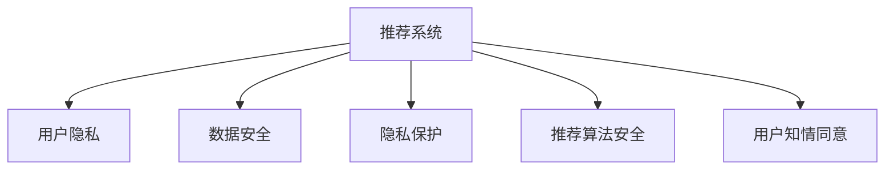

                 

# 大模型推荐中的用户隐私与安全问题思考

> 关键词：大模型推荐, 用户隐私, 数据安全, 数据保护, 隐私保护, 推荐系统

## 1. 背景介绍

在当今数据驱动的时代，推荐系统已成为互联网应用不可或缺的一部分。从电商、社交网络到视频平台，推荐算法已经渗透到人们生活的方方面面。然而，随着推荐算法的普及和用户数据的增多，用户隐私和安全问题也逐渐成为社会关注的焦点。如何在推荐系统中保障用户隐私，确保数据安全，是当下值得深入探讨的重要课题。

推荐系统通过分析用户的过去行为，预测其未来的偏好，从而为用户推荐可能感兴趣的物品。大模型推荐系统则是采用深度学习和人工智能技术，如卷积神经网络、循环神经网络和Transformer等，通过大规模预训练模型和丰富的特征工程，提高推荐系统的效果和性能。然而，这些系统在获取和处理用户数据时，往往伴随着隐私和安全风险。

本文将探讨在大模型推荐系统中，如何平衡推荐效果和用户隐私之间的关系，提出相应的解决方案，并展望未来发展趋势。

## 2. 核心概念与联系

### 2.1 核心概念概述

为更好地理解大模型推荐系统中的隐私与安全问题，本节将介绍几个关键概念：

- **推荐系统（Recommendation System）**：通过分析用户的历史行为数据，预测其兴趣和偏好，为用户推荐个性化物品的系统。
- **大模型推荐系统（Large Model-Based Recommendation System）**：采用深度学习模型如卷积神经网络、循环神经网络和Transformer等，通过大规模预训练模型进行推荐。
- **用户隐私（User Privacy）**：用户在使用推荐系统时，个人数据和行为不被泄露或滥用的权利。
- **数据安全（Data Security）**：在推荐系统开发和应用过程中，保护数据不被未授权访问和攻击的能力。
- **隐私保护（Privacy Protection）**：在推荐系统中，通过技术手段保护用户隐私不被泄露或滥用的过程。
- **推荐算法安全（Algorithmic Fairness）**：确保推荐算法不会产生偏见，公平对待所有用户。
- **用户知情同意（User Consent）**：在推荐系统收集用户数据之前，需要获得用户的明确同意。

这些概念之间的逻辑关系可以通过以下Mermaid流程图来展示：



这个流程图展示了大模型推荐系统中涉及的各个关键概念以及它们之间的相互关系：

1. 推荐系统基于用户行为数据，为用户提供个性化推荐。
2. 数据安全是推荐系统开发和应用的基础，保护数据不被未授权访问。
3. 隐私保护通过技术手段确保用户数据不被泄露或滥用。
4. 推荐算法安全防止算法偏见，确保公平对待所有用户。
5. 用户知情同意在收集用户数据之前，需要获得用户明确同意。

这些概念共同构成了大模型推荐系统的核心框架，使其能够在保证隐私和安全的前提下，为用户提供高质量的个性化推荐。

## 3. 核心算法原理 & 具体操作步骤

### 3.1 算法原理概述

大模型推荐系统的核心算法原理主要包括：

- **协同过滤算法（Collaborative Filtering）**：通过分析用户的历史行为数据，预测用户对未评价物品的兴趣，从而进行推荐。
- **基于内容的推荐算法（Content-Based Recommendation）**：通过分析物品的特征，推荐与用户历史偏好相似的物品。
- **混合推荐算法（Hybrid Recommendation）**：结合协同过滤和基于内容的推荐算法，综合多种特征，提升推荐效果。

大模型推荐系统通过预训练模型捕获丰富的用户和物品特征，通过微调模型参数来提高推荐精度。在这一过程中，如何平衡推荐效果和隐私安全，是大模型推荐系统的关键挑战。

### 3.2 算法步骤详解

大模型推荐系统的微调过程大致包括以下几个步骤：

**Step 1: 数据预处理**
- 收集用户行为数据，如浏览记录、购买记录等。
- 对数据进行清洗、去重、特征工程等预处理。
- 将数据集划分为训练集、验证集和测试集。

**Step 2: 预训练大模型**
- 选择合适的大模型作为初始化参数，如BERT、GPT等。
- 在预训练语料库上进行预训练，学习通用语言表示。
- 将用户行为数据转化为模型输入，进行微调。

**Step 3: 微调模型**
- 选择合适的优化算法及其参数，如Adam、SGD等，设置学习率、批大小、迭代轮数等。
- 设置正则化技术及强度，包括权重衰减、Dropout、Early Stopping等。
- 确定冻结预训练参数的策略，如仅微调顶层，或全部参数都参与微调。

**Step 4: 评估模型**
- 在测试集上评估微调后模型的性能，对比微调前后的精度提升。
- 使用微调后的模型对新样本进行推理预测，集成到实际的应用系统中。
- 持续收集新的数据，定期重新微调模型，以适应数据分布的变化。

### 3.3 算法优缺点

大模型推荐系统的优点包括：

- **高效性**：能够快速处理大量用户行为数据，推荐效果显著。
- **通用性**：适用于多种推荐场景，如电商、社交网络、视频平台等。
- **自适应性**：能够根据用户历史行为和实时反馈进行动态调整，提升推荐精度。

然而，该系统也存在一定的局限性：

- **数据依赖**：推荐系统依赖于用户行为数据，数据质量的好坏直接影响推荐效果。
- **隐私风险**：在数据收集和处理过程中，可能存在隐私泄露的风险。
- **安全性**：模型和算法可能面临未授权访问和攻击的风险。
- **公平性**：推荐算法可能存在偏见，对某些用户或物品不公平。
- **用户信任**：用户可能对推荐系统缺乏信任，影响使用体验。

## 4. 数学模型和公式 & 详细讲解

### 4.1 数学模型构建

在推荐系统中，常用的评估指标包括准确率（Accuracy）、召回率（Recall）、F1分数（F1 Score）和平均绝对误差（MAE）等。假设模型在测试集上的预测为 $\hat{y}$，真实标签为 $y$，则常用的评估指标计算公式如下：

$$
Accuracy = \frac{\sum_{i=1}^N \mathbf{1}_{\hat{y}_i = y_i}}{N}
$$

$$
Recall = \frac{\sum_{i=1}^N \mathbf{1}_{\hat{y}_i = 1 \text{ and } y_i = 1}}{\sum_{i=1}^N \mathbf{1}_{y_i = 1}}
$$

$$
F1 Score = 2 \times \frac{Precision \times Recall}{Precision + Recall}
$$

$$
MAE = \frac{1}{N} \sum_{i=1}^N |\hat{y}_i - y_i|
$$

其中，$\mathbf{1}_{\hat{y}_i = y_i}$ 为示性函数，当 $\hat{y}_i = y_i$ 时取1，否则取0。

### 4.2 公式推导过程

以准确率和召回率的计算为例，详细推导如下：

假设模型在测试集上的预测为 $\hat{y}_i$，真实标签为 $y_i$，其中 $y_i \in \{0, 1\}$。则准确率的计算公式为：

$$
Accuracy = \frac{\sum_{i=1}^N \mathbf{1}_{\hat{y}_i = y_i}}{N} = \frac{\sum_{i=1}^N \mathbf{1}_{\hat{y}_i = y_i}}{\sum_{i=1}^N 1}
$$

其中，$\sum_{i=1}^N \mathbf{1}_{\hat{y}_i = y_i}$ 表示预测正确的次数。

召回率的计算公式为：

$$
Recall = \frac{\sum_{i=1}^N \mathbf{1}_{\hat{y}_i = 1 \text{ and } y_i = 1}}{\sum_{i=1}^N \mathbf{1}_{y_i = 1}}
$$

其中，$\sum_{i=1}^N \mathbf{1}_{\hat{y}_i = 1 \text{ and } y_i = 1}$ 表示被正确预测为正样本的次数，$\sum_{i=1}^N \mathbf{1}_{y_i = 1}$ 表示真实标签为正样本的次数。

F1分数是准确率和召回率的调和平均数，计算公式为：

$$
F1 Score = 2 \times \frac{Precision \times Recall}{Precision + Recall}
$$

其中，$Precision = \frac{\sum_{i=1}^N \mathbf{1}_{\hat{y}_i = 1 \text{ and } y_i = 1}}{\sum_{i=1}^N \mathbf{1}_{\hat{y}_i = 1}}$。

平均绝对误差（MAE）是衡量预测值与真实值之间差异的指标，计算公式为：

$$
MAE = \frac{1}{N} \sum_{i=1}^N |\hat{y}_i - y_i|
$$

在实际应用中，通过上述指标可以评估大模型推荐系统的效果，并根据需要进行优化。

## 5. 项目实践：代码实例和详细解释说明

### 5.1 开发环境搭建

在进行大模型推荐系统开发前，我们需要准备好开发环境。以下是使用Python进行PyTorch开发的环境配置流程：

1. 安装Anaconda：从官网下载并安装Anaconda，用于创建独立的Python环境。

2. 创建并激活虚拟环境：
```bash
conda create -n pytorch-env python=3.8 
conda activate pytorch-env
```

3. 安装PyTorch：根据CUDA版本，从官网获取对应的安装命令。例如：
```bash
conda install pytorch torchvision torchaudio cudatoolkit=11.1 -c pytorch -c conda-forge
```

4. 安装Transformers库：
```bash
pip install transformers
```

5. 安装各类工具包：
```bash
pip install numpy pandas scikit-learn matplotlib tqdm jupyter notebook ipython
```

完成上述步骤后，即可在`pytorch-env`环境中开始推荐系统开发。

### 5.2 源代码详细实现

下面我们以推荐系统为例，给出使用Transformers库进行大模型推荐系统的PyTorch代码实现。

首先，定义推荐系统的数据处理函数：

```python
from transformers import BertTokenizer
from torch.utils.data import Dataset
import torch

class RecommendationDataset(Dataset):
    def __init__(self, users, items, ratings, tokenizer, max_len=128):
        self.users = users
        self.items = items
        self.ratings = ratings
        self.tokenizer = tokenizer
        self.max_len = max_len
        
    def __len__(self):
        return len(self.users)
    
    def __getitem__(self, item):
        user = self.users[item]
        item = self.items[item]
        rating = self.ratings[item]
        
        encoding = self.tokenizer(user, item, return_tensors='pt', max_length=self.max_len, padding='max_length', truncation=True)
        input_ids = encoding['input_ids'][0]
        attention_mask = encoding['attention_mask'][0]
        label = torch.tensor([rating], dtype=torch.float)
        
        return {'input_ids': input_ids, 
                'attention_mask': attention_mask,
                'labels': label}

# 定义推荐系统的超参数
num_epochs = 5
batch_size = 16
learning_rate = 2e-5
```

然后，定义模型和优化器：

```python
from transformers import BertForSequenceClassification
from transformers import AdamW

model = BertForSequenceClassification.from_pretrained('bert-base-cased', num_labels=1)

optimizer = AdamW(model.parameters(), lr=learning_rate)
```

接着，定义训练和评估函数：

```python
from torch.utils.data import DataLoader
from tqdm import tqdm
from sklearn.metrics import mean_squared_error

device = torch.device('cuda') if torch.cuda.is_available() else torch.device('cpu')
model.to(device)

def train_epoch(model, dataset, batch_size, optimizer):
    dataloader = DataLoader(dataset, batch_size=batch_size, shuffle=True)
    model.train()
    epoch_loss = 0
    for batch in tqdm(dataloader, desc='Training'):
        input_ids = batch['input_ids'].to(device)
        attention_mask = batch['attention_mask'].to(device)
        labels = batch['labels'].to(device)
        model.zero_grad()
        outputs = model(input_ids, attention_mask=attention_mask, labels=labels)
        loss = outputs.loss
        epoch_loss += loss.item()
        loss.backward()
        optimizer.step()
    return epoch_loss / len(dataloader)

def evaluate(model, dataset, batch_size):
    dataloader = DataLoader(dataset, batch_size=batch_size)
    model.eval()
    preds, labels = [], []
    with torch.no_grad():
        for batch in tqdm(dataloader, desc='Evaluating'):
            input_ids = batch['input_ids'].to(device)
            attention_mask = batch['attention_mask'].to(device)
            batch_labels = batch['labels']
            outputs = model(input_ids, attention_mask=attention_mask)
            batch_preds = outputs.logits.item()
            batch_labels = batch_labels.to('cpu').tolist()
            for pred in batch_preds:
                preds.append(pred)
                labels.append(batch_labels)
                
    print(mean_squared_error(labels, preds))
```

最后，启动训练流程并在测试集上评估：

```python
# 加载数据集
train_dataset = RecommendationDataset(train_users, train_items, train_ratings, tokenizer)
dev_dataset = RecommendationDataset(dev_users, dev_items, dev_ratings, tokenizer)
test_dataset = RecommendationDataset(test_users, test_items, test_ratings, tokenizer)

# 训练模型
for epoch in range(num_epochs):
    loss = train_epoch(model, train_dataset, batch_size, optimizer)
    print(f"Epoch {epoch+1}, train loss: {loss:.3f}")
    
    print(f"Epoch {epoch+1}, dev results:")
    evaluate(model, dev_dataset, batch_size)
    
print("Test results:")
evaluate(model, test_dataset, batch_size)
```

以上就是使用PyTorch对大模型推荐系统进行训练的完整代码实现。可以看到，通过Transformers库的封装，我们能够相对简洁地实现大模型的微调。

### 5.3 代码解读与分析

让我们再详细解读一下关键代码的实现细节：

**RecommendationDataset类**：
- `__init__`方法：初始化用户、物品、评分等关键组件，以及分词器和最大长度。
- `__len__`方法：返回数据集的样本数量。
- `__getitem__`方法：对单个样本进行处理，将用户和物品输入编码为token ids，并将评分转化为模型所需格式。

**BertForSequenceClassification类**：
- `from_pretrained`方法：从预训练模型中加载模型权重。
- `num_labels`参数：指定输出层的标签数量。

**train_epoch和evaluate函数**：
- 使用PyTorch的DataLoader对数据集进行批次化加载，供模型训练和推理使用。
- 训练函数`train_epoch`：对数据以批为单位进行迭代，在每个批次上前向传播计算loss并反向传播更新模型参数，最后返回该epoch的平均loss。
- 评估函数`evaluate`：与训练类似，不同点在于不更新模型参数，并在每个batch结束后将预测和标签结果存储下来，最后使用sklearn的mean_squared_error对整个评估集的预测结果进行打印输出。

**训练流程**：
- 定义总的epoch数和batch size，开始循环迭代
- 每个epoch内，先在训练集上训练，输出平均loss
- 在验证集上评估，输出评价指标
- 重复上述步骤直至满足预设的迭代轮数或 Early Stopping 条件

可以看到，PyTorch配合Transformers库使得大模型推荐系统的代码实现变得简洁高效。开发者可以将更多精力放在数据处理、模型改进等高层逻辑上，而不必过多关注底层的实现细节。

当然，工业级的系统实现还需考虑更多因素，如模型的保存和部署、超参数的自动搜索、更灵活的任务适配层等。但核心的微调范式基本与此类似。

## 6. 实际应用场景

### 6.1 电商平台推荐

电商平台通过大模型推荐系统，为用户推荐可能感兴趣的商品。推荐系统可以基于用户的历史购买记录、浏览行为、评分数据等，进行商品推荐，提升用户满意度和销售额。

在技术实现上，可以收集用户的浏览记录、购买记录、评分数据等，构建推荐数据集。采用大模型如BERT、GPT等，对数据进行预训练和微调，构建推荐模型。在用户点击商品页面时，通过输入商品的标题、描述、类别等信息，进行实时推荐。

### 6.2 视频平台推荐

视频平台通过大模型推荐系统，为用户推荐可能感兴趣的视频内容。推荐系统可以基于用户的观看历史、评分数据、评论信息等，进行视频推荐，提升用户观看体验和平台粘性。

在技术实现上，可以收集用户的观看记录、评分数据、评论信息等，构建推荐数据集。采用大模型如BERT、GPT等，对数据进行预训练和微调，构建推荐模型。在用户观看视频时，通过输入视频的标题、简介、标签等信息，进行实时推荐。

### 6.3 社交网络推荐

社交网络通过大模型推荐系统，为用户推荐可能感兴趣的内容和好友。推荐系统可以基于用户的浏览历史、点赞记录、好友关系等，进行内容推荐，提升用户活跃度和平台留存率。

在技术实现上，可以收集用户的浏览记录、点赞记录、好友关系等，构建推荐数据集。采用大模型如BERT、GPT等，对数据进行预训练和微调，构建推荐模型。在用户浏览社交网络时，通过输入内容标签、好友关系等信息，进行实时推荐。

### 6.4 未来应用展望

随着大模型推荐系统的发展，未来将在更多领域得到应用，为各行各业带来变革性影响。

在智慧医疗领域，推荐系统可以推荐个性化的医疗建议，帮助患者选择合适的治疗方案，提升医疗服务的质量和效率。

在智能教育领域，推荐系统可以推荐个性化的学习资源，帮助学生高效学习，提升教学质量。

在智慧城市治理中，推荐系统可以推荐最优的出行路线，缓解交通拥堵，提升城市管理的智能化水平。

此外，在企业生产、社会治理、文娱传媒等众多领域，大模型推荐系统也将不断涌现，为经济社会发展注入新的动力。相信随着技术的不断进步，大模型推荐系统必将在更广阔的应用领域大放异彩。

## 7. 工具和资源推荐

### 7.1 学习资源推荐

为了帮助开发者系统掌握大模型推荐系统的理论基础和实践技巧，这里推荐一些优质的学习资源：

1. 《推荐系统原理与实践》系列博文：由推荐系统专家撰写，深入浅出地介绍了推荐系统原理、大模型推荐方法等前沿话题。

2. 《深度学习在推荐系统中的应用》课程：Coursera开设的深度学习推荐系统课程，涵盖了推荐系统基础知识和深度学习推荐算法。

3. 《推荐系统基础》书籍：推荐系统领域的经典教材，系统介绍了推荐系统的基本原理和算法。

4. 《Transformer原理与实践》书籍：Transformer库的作者所著，全面介绍了Transformer原理和推荐系统应用。

5. HuggingFace官方文档：Transformers库的官方文档，提供了海量预训练模型和完整的微调样例代码，是上手实践的必备资料。

通过对这些资源的学习实践，相信你一定能够快速掌握大模型推荐系统的精髓，并用于解决实际的推荐问题。

### 7.2 开发工具推荐

高效的开发离不开优秀的工具支持。以下是几款用于大模型推荐系统开发的常用工具：

1. PyTorch：基于Python的开源深度学习框架，灵活动态的计算图，适合快速迭代研究。大部分预训练语言模型都有PyTorch版本的实现。

2. TensorFlow：由Google主导开发的开源深度学习框架，生产部署方便，适合大规模工程应用。同样有丰富的预训练语言模型资源。

3. Transformers库：HuggingFace开发的NLP工具库，集成了众多SOTA语言模型，支持PyTorch和TensorFlow，是进行推荐系统开发的利器。

4. Weights & Biases：模型训练的实验跟踪工具，可以记录和可视化模型训练过程中的各项指标，方便对比和调优。与主流深度学习框架无缝集成。

5. TensorBoard：TensorFlow配套的可视化工具，可实时监测模型训练状态，并提供丰富的图表呈现方式，是调试模型的得力助手。

6. Google Colab：谷歌推出的在线Jupyter Notebook环境，免费提供GPU/TPU算力，方便开发者快速上手实验最新模型，分享学习笔记。

合理利用这些工具，可以显著提升大模型推荐系统的开发效率，加快创新迭代的步伐。

### 7.3 相关论文推荐

大模型推荐系统的发展源于学界的持续研究。以下是几篇奠基性的相关论文，推荐阅读：

1. Matrix Factorization Techniques for Recommender Systems：提出基于矩阵分解的推荐算法，成为推荐系统领域的经典方法。

2. Contextual Recommendations：介绍上下文感知推荐算法，结合用户行为和上下文信息进行推荐。

3. Adaptive Recommender Systems：提出自适应推荐算法，根据用户反馈动态调整推荐策略。

4. Deep Learning for Recommendation Systems：综述深度学习在推荐系统中的应用，展示了深度学习算法在推荐系统中的强大潜力。

5. Recurrent Neural Networks for Recommendation Systems：介绍循环神经网络在推荐系统中的应用，提升推荐系统的序列建模能力。

6. Multi-Aspect Learning for Recommender Systems：提出多视图推荐算法，结合用户多方面的信息进行推荐。

这些论文代表了大模型推荐系统的发展脉络。通过学习这些前沿成果，可以帮助研究者把握学科前进方向，激发更多的创新灵感。

## 8. 总结：未来发展趋势与挑战

### 8.1 研究成果总结

本文对大模型推荐系统中的用户隐私与安全问题进行了全面系统的探讨。首先阐述了推荐系统的背景和隐私安全问题，明确了推荐系统和大模型推荐系统的发展方向。其次，从原理到实践，详细讲解了大模型推荐系统的数学模型和关键算法，给出了微调任务的完整代码实现。同时，本文还广泛探讨了大模型推荐系统在电商、视频平台、社交网络等领域的实际应用，展示了微调范式的巨大潜力。此外，本文精选了推荐系统的各类学习资源，力求为读者提供全方位的技术指引。

通过本文的系统梳理，可以看到，大模型推荐系统正在成为推荐系统的重要范式，极大地拓展了推荐系统的应用边界，提升了推荐系统的性能和效率。未来，伴随大模型推荐系统的持续演进，相信推荐系统将在更广阔的应用领域大放异彩，深刻影响人们的生产生活方式。

### 8.2 未来发展趋势

展望未来，大模型推荐系统将呈现以下几个发展趋势：

1. 模型规模持续增大。随着算力成本的下降和数据规模的扩张，大模型推荐系统的参数量还将持续增长。超大规模语言模型蕴含的丰富语言知识，有望支撑更加复杂多变的推荐系统。

2. 推荐算法多样。除了传统的协同过滤和基于内容的推荐算法外，未来将涌现更多基于深度学习、因果推断等技术的推荐算法。

3. 实时性要求提升。未来推荐系统将更注重实时性和个性化，对模型的推理速度和响应时间提出更高要求。

4. 多模态推荐兴起。推荐系统将越来越多地融合视觉、语音、文本等多种模态数据，提升推荐系统的全面性和准确性。

5. 个性化推荐更加精细。未来推荐系统将更加注重用户的个性化需求，通过动态学习用户行为和反馈，提供更加精准的推荐。

6. 隐私保护技术发展。推荐系统中的隐私保护技术将更加成熟，确保用户数据的安全性和隐私性。

以上趋势凸显了大模型推荐系统的广阔前景。这些方向的探索发展，必将进一步提升推荐系统的性能和应用范围，为人们的生活带来更多便利和幸福。

### 8.3 面临的挑战

尽管大模型推荐系统已经取得了瞩目成就，但在迈向更加智能化、普适化应用的过程中，它仍面临诸多挑战：

1. 数据依赖问题。推荐系统依赖于用户行为数据，数据质量的好坏直接影响推荐效果。

2. 隐私安全风险。在数据收集和处理过程中，可能存在隐私泄露的风险。

3. 系统鲁棒性不足。推荐系统面对域外数据时，泛化性能往往大打折扣。

4. 计算资源限制。大模型推荐系统对计算资源的要求较高，计算速度和存储能力成为瓶颈。

5. 用户信任度低。用户可能对推荐系统缺乏信任，影响使用体验。

6. 技术演进迅速。推荐系统需要不断更新算法和技术，以应对不断变化的用户需求。

面对这些挑战，未来的研究需要在数据获取、隐私保护、系统鲁棒性、计算效率等方面寻求新的突破。唯有从多方面协同发力，才能构建安全、可靠、高效、个性化的推荐系统。

### 8.4 研究展望

面对大模型推荐系统面临的挑战，未来的研究需要在以下几个方面寻求新的突破：

1. 数据获取和处理。通过更科学的数据收集和处理方法，确保数据的质量和多样性。

2. 隐私保护技术。采用更先进的隐私保护技术，确保用户数据的匿名化和去标识化。

3. 系统鲁棒性。结合多种算法和数据融合技术，提升推荐系统的泛化能力和鲁棒性。

4. 计算资源优化。通过模型压缩、分布式计算等技术，降低计算资源消耗，提升系统效率。

5. 用户信任度提升。通过透明化的推荐过程和及时的用户反馈机制，提升用户对推荐系统的信任度。

6. 技术演进。关注深度学习、因果推断、多模态推荐等前沿技术的发展，不断更新推荐算法和模型。

这些研究方向的探索，必将引领大模型推荐系统走向更高的台阶，为推荐系统带来更多的创新和发展。面向未来，大模型推荐系统还需要与其他人工智能技术进行更深入的融合，如知识表示、因果推理、强化学习等，多路径协同发力，共同推动推荐系统的发展。只有勇于创新、敢于突破，才能不断拓展推荐系统的边界，让推荐系统更好地造福人类社会。

## 9. 附录：常见问题与解答

**Q1：大模型推荐系统如何处理用户隐私问题？**

A: 大模型推荐系统在处理用户隐私问题时，可以采用以下几种方法：

1. 数据匿名化：对用户数据进行匿名化处理，去除敏感信息，确保用户隐私。

2. 差分隐私：在数据处理过程中，加入噪声干扰，确保用户数据不被滥用。

3. 联邦学习：在推荐系统中采用联邦学习技术，确保用户数据不离开本地设备，保护用户隐私。

4. 分布式数据存储：将用户数据分布式存储在多个服务器中，避免集中存储带来的隐私风险。

5. 用户知情同意：在推荐系统收集用户数据之前，需要获得用户的明确同意，并告知数据的使用方式。

6. 隐私保护模型：在模型训练过程中，使用隐私保护技术，如梯度裁剪、差分隐私等，保护用户隐私。

这些方法可以有效保护用户隐私，确保用户数据的安全性和隐私性。

**Q2：大模型推荐系统如何避免推荐偏见？**

A: 大模型推荐系统在避免推荐偏见时，可以采用以下几种方法：

1. 公平性指标：在推荐系统中引入公平性指标，如等价性、平等性、代表性等，评估模型的公平性。

2. 多视图推荐：结合用户多方面的信息进行推荐，如年龄、性别、职业等，避免单一视角带来的偏见。

3. 多样性推荐：在推荐结果中引入多样性约束，确保推荐结果不单一，避免推荐相似性过高的物品。

4. 用户反馈机制：通过用户反馈机制，及时调整推荐策略，纠正偏见。

5. 数据清洗：对数据进行清洗，去除有偏见的信息，确保数据质量。

6. 公开透明：在推荐过程中，保持公开透明，确保推荐策略的公平性和透明性。

这些方法可以有效避免推荐偏见，确保推荐系统公平对待所有用户。

**Q3：大模型推荐系统如何提高推荐效率？**

A: 大模型推荐系统在提高推荐效率时，可以采用以下几种方法：

1. 模型压缩：通过模型压缩技术，减小模型大小，提高推理速度。

2. 分布式计算：利用分布式计算技术，并行处理数据，提高计算效率。

3. 混合精度训练：采用混合精度训练技术，降低计算资源消耗，提高训练速度。

4. 数据预处理：对数据进行预处理，减少无效数据和噪声，提高推荐效果。

5. 多模态融合：结合视觉、语音、文本等多种模态数据，提升推荐系统的全面性和准确性。

6. 实时推荐：通过实时推荐系统，及时响应用户需求，提高用户满意度。

这些方法可以有效提高推荐系统的效率，提升用户体验。

**Q4：大模型推荐系统如何处理用户行为数据？**

A: 大模型推荐系统在处理用户行为数据时，可以采用以下几种方法：

1. 特征工程：对用户行为数据进行特征提取和处理，提升特征质量。

2. 多视图数据融合：结合用户多方面的信息进行数据融合，提升推荐效果。

3. 数据标注：对用户行为数据进行标注，确保数据质量和完整性。

4. 数据采样：采用数据采样技术，确保数据样本的多样性和代表性。

5. 数据清洗：对数据进行清洗，去除异常数据和噪声，确保数据质量。

6. 实时数据处理：对用户行为数据进行实时处理，动态调整推荐策略。

这些方法可以有效处理用户行为数据，确保推荐系统的准确性和可靠性。

**Q5：大模型推荐系统如何应对推荐系统的冷启动问题？**

A: 大模型推荐系统在应对推荐系统的冷启动问题时，可以采用以下几种方法：

1. 多模态数据融合：结合视觉、语音、文本等多种模态数据，提升推荐系统的全面性和准确性。

2. 协同过滤推荐：通过分析用户和物品之间的关系，进行推荐。

3. 混合推荐算法：结合协同过滤和基于内容的推荐算法，综合多种特征，提升推荐精度。

4. 冷启动推荐算法：采用冷启动推荐算法，如基于属性的推荐、基于协同的推荐等，解决冷启动问题。

5. 用户画像构建：通过构建用户画像，了解用户兴趣和偏好，进行推荐。

6. 推荐策略调整：根据用户反馈，动态调整推荐策略，解决冷启动问题。

这些方法可以有效应对推荐系统的冷启动问题，提升推荐系统的性能和效果。

---

作者：禅与计算机程序设计艺术 / Zen and the Art of Computer Programming

