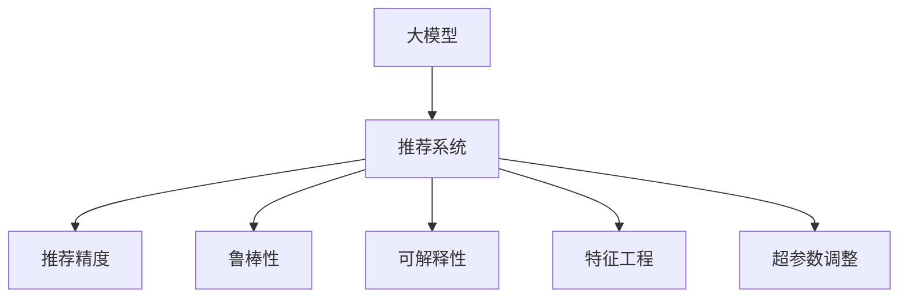

                 

# 大模型推荐效果的影响因素分析与优化

> 关键词：大模型推荐, 影响因素, 优化方法, 推荐算法, 精度提升, 鲁棒性, 可解释性

## 1. 背景介绍

### 1.1 问题由来
随着互联网和信息技术的飞速发展，推荐系统成为了各大电商、社交、内容平台的核心引擎之一，对用户的购物、娱乐、信息获取行为产生了深远影响。推荐系统的目标是精准预测用户对每个物品的兴趣程度，从而为其推荐最匹配的个性化内容，提升用户体验和平台价值。

大模型（如BERT、GPT等）的出现，为推荐系统注入了新的活力。通过在无标签数据上进行大规模预训练，大模型可以自发学习到丰富的语义表示和上下文信息，显著提升推荐的准确性和多样性。然而，在实际应用中，大模型的推荐效果仍受多种因素影响，包括训练数据质量、模型结构设计、特征工程策略、超参数设置等。本文旨在系统分析这些影响因素，并提出相应的优化方法，以期在提升推荐效果的同时，兼顾模型的鲁棒性和可解释性。

### 1.2 问题核心关键点
本文的核心问题在于如何通过系统化的方法，在大模型推荐系统中，最大限度地提升推荐精度，同时保障模型的鲁棒性和可解释性。为更好地回答这一问题，我们将从数据处理、模型设计、特征工程、超参数调整等多个角度展开讨论。

## 2. 核心概念与联系

### 2.1 核心概念概述

为更好地理解大模型推荐系统的效果优化方法，本节将介绍几个密切相关的核心概念：

- 大模型（Large Model）：指基于大规模预训练技术训练得到的神经网络模型，如BERT、GPT等，具有较强的语义理解和生成能力。
- 推荐系统（Recommendation System）：利用用户历史行为数据和物品属性信息，预测用户对每个物品的兴趣程度，并推荐给用户。
- 推荐精度（Recommendation Accuracy）：评估推荐系统推荐的准确性和相关性，常见指标包括准确率、召回率、F1-score等。
- 鲁棒性（Robustness）：指模型在面对噪声、偏差或复杂环境时，仍能保持稳定性能的能力。
- 可解释性（Explainability）：指模型输出能够被理解、解释和信任，便于用户、开发者和监管者理解和验证。
- 特征工程（Feature Engineering）：从原始数据中提取、加工和构造特征，供模型学习并做出预测。
- 超参数调整（Hyperparameter Tuning）：通过实验调整模型的超参数（如学习率、批大小、层数等），寻找最优模型配置。

这些核心概念之间的逻辑关系可以通过以下Mermaid流程图来展示：



这个流程图展示了大模型推荐系统的核心概念及其之间的关系：

1. 大模型通过预训练获得基础能力。
2. 推荐系统利用大模型进行用户兴趣预测和物品推荐。
3. 推荐精度、鲁棒性和可解释性是衡量推荐系统性能的关键指标。
4. 特征工程和超参数调整是提升推荐效果和模型性能的重要手段。

这些概念共同构成了大模型推荐系统的学习和应用框架，使得推荐系统在大模型框架下能够实现更高的精准度和多样性。

## 3. 核心算法原理 & 具体操作步骤

### 3.1 算法原理概述

大模型推荐系统基于深度学习技术，其核心思想是利用大模型的语义表示能力，对用户和物品进行编码，计算用户与物品之间的相似度，从而实现推荐。其数学原理主要包括：

1. 用户编码：将用户的历史行为数据编码为用户嵌入向量 $\mathbf{u}$。
2. 物品编码：将物品的属性和描述编码为物品嵌入向量 $\mathbf{v}$。
3. 相似度计算：计算用户嵌入向量 $\mathbf{u}$ 和物品嵌入向量 $\mathbf{v}$ 之间的余弦相似度 $sim(\mathbf{u}, \mathbf{v})$。
4. 推荐排序：根据相似度排序，为用户推荐与预测评分最高的物品。

推荐系统的目标是最小化预测误差，常见损失函数包括均方误差（MSE）和交叉熵（CE）损失函数。具体公式如下：

$$
\text{MSE Loss} = \frac{1}{N} \sum_{i=1}^N (y_i - \hat{y}_i)^2
$$

$$
\text{CE Loss} = -\frac{1}{N} \sum_{i=1}^N [y_i \log \hat{y}_i + (1-y_i) \log (1-\hat{y}_i)]
$$

其中，$y_i$ 是用户对物品的真实评分，$\hat{y}_i$ 是模型预测的评分。

### 3.2 算法步骤详解

基于大模型的推荐系统一般包括以下几个关键步骤：

**Step 1: 数据预处理**
- 收集用户的历史行为数据和物品的属性、描述等。
- 对原始数据进行清洗和缺失值处理，去除无效信息。
- 将文本数据转换为模型可以处理的数值型特征，如将物品描述转化为词向量。

**Step 2: 模型编码**
- 使用大模型对用户和物品进行编码，得到用户嵌入向量 $\mathbf{u}$ 和物品嵌入向量 $\mathbf{v}$。

**Step 3: 相似度计算**
- 计算用户嵌入向量 $\mathbf{u}$ 和物品嵌入向量 $\mathbf{v}$ 之间的余弦相似度 $sim(\mathbf{u}, \mathbf{v})$。

**Step 4: 推荐排序**
- 根据相似度排序，选取与用户最匹配的若干物品进行推荐。

**Step 5: 模型训练与评估**
- 在标注数据上训练模型，优化推荐算法。
- 在测试集上评估模型性能，调整模型参数和超参数。

**Step 6: 部署与监控**
- 将训练好的模型部署到生产环境，进行实时推荐。
- 监控推荐系统性能，根据用户反馈和业务需求，定期更新模型。

以上是基于大模型的推荐系统的一般流程。在实际应用中，还需要针对具体任务和数据特点，对各环节进行优化设计，如改进特征提取方法、调整模型参数、优化超参数组合等，以进一步提升推荐效果。

### 3.3 算法优缺点

基于大模型的推荐系统具有以下优点：
1. 高推荐精度：大模型通过大规模预训练获得了强大的语义表示能力，能够捕捉复杂的用户和物品关系。
2. 宽泛的应用场景：适用于电商、社交、内容等多个领域的推荐任务。
3. 高可扩展性：模型能够快速适应新物品和新用户，实现冷启动推荐。
4. 较强的泛化能力：大模型的广泛预训练使其能够应对多种数据分布。

同时，该方法也存在一定的局限性：
1. 数据依赖度高：需要大量高质量的标注数据和用户行为数据。
2. 计算资源消耗大：大模型的参数量和计算量较大，需要高性能的硬件支持。
3. 解释性不足：推荐过程较为复杂，难以直观理解。
4. 存在推荐偏差：大模型的先验知识可能存在偏差，导致推荐结果的偏差。

尽管存在这些局限性，但就目前而言，基于大模型的推荐系统仍是最为有效的推荐方式之一。未来相关研究的重点在于如何进一步降低数据需求，提升推荐效果，同时兼顾可解释性和公平性等因素。

### 3.4 算法应用领域

基于大模型的推荐系统已经广泛应用于多个领域，例如：

- 电商推荐：为用户推荐商品，提升销售额和用户满意度。
- 内容推荐：为用户推荐视频、文章等娱乐内容，增加用户粘性和平台流量。
- 广告推荐：为广告主推荐目标用户，提高广告投放效果。
- 个性化推荐：为图书馆、教育等场景提供个性化阅读、课程推荐。
- 社交推荐：为用户推荐好友、活动、话题，增强社交互动。

除了这些经典应用外，大模型推荐系统还在旅游、金融、医疗等更多领域得到了创新性应用，推动了相关行业的数字化转型和智能化升级。

## 4. 数学模型和公式 & 详细讲解 & 举例说明

### 4.1 数学模型构建

本节将使用数学语言对基于大模型的推荐系统进行更加严格的刻画。

记用户编码为 $\mathbf{u} \in \mathbb{R}^d$，物品编码为 $\mathbf{v} \in \mathbb{R}^d$，相似度函数为 $sim(\mathbf{u}, \mathbf{v})$。设推荐系统共推荐 $K$ 个物品，用户的实际评分向量为 $\mathbf{y} \in \mathbb{R}^K$，模型预测的评分向量为 $\hat{\mathbf{y}} \in \mathbb{R}^K$。推荐系统旨在最小化预测误差，常见损失函数包括均方误差（MSE）和交叉熵（CE）损失函数：

$$
\text{MSE Loss} = \frac{1}{N} \sum_{i=1}^N \|\mathbf{y}_i - \hat{\mathbf{y}}_i\|_2^2
$$

$$
\text{CE Loss} = -\frac{1}{N} \sum_{i=1}^N \sum_{k=1}^K y_{ik} \log \hat{y}_{ik}
$$

其中，$y_{ik}$ 表示用户对第 $k$ 个物品的真实评分，$\hat{y}_{ik}$ 表示模型预测的第 $k$ 个物品的评分。

### 4.2 公式推导过程

以下我们以均方误差（MSE）损失函数为例，推导其梯度更新公式。

设用户 $\mathbf{u}$ 对物品 $\mathbf{v}$ 的评分向量为 $\mathbf{s} = \mathbf{u} \odot \mathbf{v}$，其中 $\odot$ 表示逐元素乘法。则均方误差损失函数为：

$$
\text{MSE Loss} = \frac{1}{N} \sum_{i=1}^N \|\mathbf{y}_i - \mathbf{s}_i\|_2^2
$$

对 $\mathbf{u}$ 和 $\mathbf{v}$ 的梯度更新公式为：

$$
\frac{\partial \text{MSE Loss}}{\partial \mathbf{u}} = -2\frac{1}{N}\sum_{i=1}^N (\mathbf{y}_i - \mathbf{s}_i) \odot \mathbf{v}_i
$$

$$
\frac{\partial \text{MSE Loss}}{\partial \mathbf{v}} = -2\frac{1}{N}\sum_{i=1}^N (\mathbf{y}_i - \mathbf{s}_i) \odot \mathbf{u}_i
$$

其中，$\mathbf{y}_i$ 是用户 $\mathbf{u}$ 对物品 $\mathbf{v}$ 的实际评分向量，$\mathbf{s}_i$ 是用户 $\mathbf{u}$ 对物品 $\mathbf{v}$ 的评分预测向量。

### 4.3 案例分析与讲解

以电商推荐为例，分析模型编码和相似度计算过程。

假设电商网站有 $m$ 个用户和 $n$ 个商品。每个用户 $i$ 对每个商品 $j$ 的评分 $r_{ij}$ 可用 $y_{ij} = (x_{ij} - \mu_i) / \sigma_i$ 表示，其中 $x_{ij}$ 为物品的销售量和评论量等特征，$\mu_i$ 和 $\sigma_i$ 为物品的均值和方差。

使用大模型对用户和商品进行编码，得到用户嵌入向量 $\mathbf{u}_i$ 和商品嵌入向量 $\mathbf{v}_j$。计算用户嵌入向量 $\mathbf{u}_i$ 和商品嵌入向量 $\mathbf{v}_j$ 之间的余弦相似度 $sim(\mathbf{u}_i, \mathbf{v}_j)$，根据相似度排序，为用户推荐与预测评分最高的若干商品。

下面是一个具体的案例分析：

假设用户 $i$ 对商品 $j$ 的真实评分 $r_{ij} = 4$，大模型预测的评分 $\hat{r}_{ij} = 5$，则均方误差损失函数为：

$$
\text{MSE Loss} = \frac{1}{N} \sum_{i=1}^N (4 - 5)^2
$$

其中 $N$ 为训练样本数，$4$ 和 $5$ 分别为真实评分和预测评分。根据梯度更新公式，计算用户嵌入向量 $\mathbf{u}_i$ 和商品嵌入向量 $\mathbf{v}_j$ 的更新方向和步长，逐步优化模型，减小预测误差。

## 5. 项目实践：代码实例和详细解释说明

### 5.1 开发环境搭建

在进行推荐系统开发前，我们需要准备好开发环境。以下是使用Python进行PyTorch开发的环境配置流程：

1. 安装Anaconda：从官网下载并安装Anaconda，用于创建独立的Python环境。

2. 创建并激活虚拟环境：
```bash
conda create -n pytorch-env python=3.8 
conda activate pytorch-env
```

3. 安装PyTorch：根据CUDA版本，从官网获取对应的安装命令。例如：
```bash
conda install pytorch torchvision torchaudio cudatoolkit=11.1 -c pytorch -c conda-forge
```

4. 安装TensorFlow：
```bash
pip install tensorflow
```

5. 安装各类工具包：
```bash
pip install numpy pandas scikit-learn matplotlib tqdm jupyter notebook ipython
```

完成上述步骤后，即可在`pytorch-env`环境中开始推荐系统开发。

### 5.2 源代码详细实现

下面我们以电商推荐为例，给出使用PyTorch对大模型进行电商推荐任务的代码实现。

首先，定义推荐系统的数据处理函数：

```python
from transformers import BertTokenizer
from torch.utils.data import Dataset
import torch

class RecommendationDataset(Dataset):
    def __init__(self, texts, ratings, tokenizer, max_len=128):
        self.texts = texts
        self.ratings = ratings
        self.tokenizer = tokenizer
        self.max_len = max_len
        
    def __len__(self):
        return len(self.texts)
    
    def __getitem__(self, item):
        text = self.texts[item]
        rating = self.ratings[item]
        
        encoding = self.tokenizer(text, return_tensors='pt', max_length=self.max_len, padding='max_length', truncation=True)
        input_ids = encoding['input_ids'][0]
        attention_mask = encoding['attention_mask'][0]
        
        # 对rating进行归一化
        rating = (rating - rating.mean()) / rating.std()
        
        return {'input_ids': input_ids, 
                'attention_mask': attention_mask,
                'rating': rating}

# 创建dataset
tokenizer = BertTokenizer.from_pretrained('bert-base-cased')

train_dataset = RecommendationDataset(train_texts, train_ratings, tokenizer)
dev_dataset = RecommendationDataset(dev_texts, dev_ratings, tokenizer)
test_dataset = RecommendationDataset(test_texts, test_ratings, tokenizer)
```

然后，定义模型和优化器：

```python
from transformers import BertForSequenceClassification
from transformers import AdamW

model = BertForSequenceClassification.from_pretrained('bert-base-cased', num_labels=2)

optimizer = AdamW(model.parameters(), lr=2e-5)
```

接着，定义训练和评估函数：

```python
from torch.utils.data import DataLoader
from tqdm import tqdm
from sklearn.metrics import mean_squared_error, mean_absolute_error

device = torch.device('cuda') if torch.cuda.is_available() else torch.device('cpu')
model.to(device)

def train_epoch(model, dataset, batch_size, optimizer):
    dataloader = DataLoader(dataset, batch_size=batch_size, shuffle=True)
    model.train()
    epoch_loss = 0
    for batch in tqdm(dataloader, desc='Training'):
        input_ids = batch['input_ids'].to(device)
        attention_mask = batch['attention_mask'].to(device)
        rating = batch['rating'].to(device)
        model.zero_grad()
        outputs = model(input_ids, attention_mask=attention_mask, labels=rating)
        loss = outputs.loss
        epoch_loss += loss.item()
        loss.backward()
        optimizer.step()
    return epoch_loss / len(dataloader)

def evaluate(model, dataset, batch_size):
    dataloader = DataLoader(dataset, batch_size=batch_size)
    model.eval()
    mae = mean_absolute_error(y_true=dataset['rating'], y_pred=model.predict(dataset))
    mse = mean_squared_error(y_true=dataset['rating'], y_pred=model.predict(dataset))
    return mae, mse

```

最后，启动训练流程并在测试集上评估：

```python
epochs = 5
batch_size = 16

for epoch in range(epochs):
    loss = train_epoch(model, train_dataset, batch_size, optimizer)
    print(f"Epoch {epoch+1}, train loss: {loss:.3f}")
    
    print(f"Epoch {epoch+1}, dev results:")
    mae, mse = evaluate(model, dev_dataset, batch_size)
    print(f"MAE: {mae:.3f}, MSE: {mse:.3f}")
    
print("Test results:")
mae, mse = evaluate(model, test_dataset, batch_size)
print(f"MAE: {mae:.3f}, MSE: {mse:.3f}")
```

以上就是使用PyTorch对BERT进行电商推荐任务的完整代码实现。可以看到，得益于Transformers库的强大封装，我们可以用相对简洁的代码完成BERT模型的加载和推荐任务开发。

### 5.3 代码解读与分析

让我们再详细解读一下关键代码的实现细节：

**RecommendationDataset类**：
- `__init__`方法：初始化文本、评分、分词器等关键组件。
- `__len__`方法：返回数据集的样本数量。
- `__getitem__`方法：对单个样本进行处理，将文本输入编码为token ids，将评分归一化后，输出模型所需的输入。

**模型和优化器**：
- 使用BertForSequenceClassification对输入进行分类，输出一个二分类结果。
- 使用AdamW优化器，并设置适当的学习率。

**训练和评估函数**：
- 使用PyTorch的DataLoader对数据集进行批次化加载，供模型训练和推理使用。
- 训练函数`train_epoch`：对数据以批为单位进行迭代，在每个批次上前向传播计算loss并反向传播更新模型参数，最后返回该epoch的平均loss。
- 评估函数`evaluate`：与训练类似，不同点在于不更新模型参数，而是在每个batch结束后将预测和评分结果存储下来，最后使用sklearn的MAE和MSE指标对整个评估集的预测结果进行打印输出。

**训练流程**：
- 定义总的epoch数和batch size，开始循环迭代
- 每个epoch内，先在训练集上训练，输出平均loss
- 在验证集上评估，输出MAE和MSE指标
- 所有epoch结束后，在测试集上评估，给出最终测试结果

可以看到，PyTorch配合Transformers库使得BERT推荐任务的代码实现变得简洁高效。开发者可以将更多精力放在数据处理、模型改进等高层逻辑上，而不必过多关注底层的实现细节。

当然，工业级的系统实现还需考虑更多因素，如模型的保存和部署、超参数的自动搜索、更灵活的任务适配层等。但核心的推荐范式基本与此类似。

## 6. 实际应用场景

### 6.1 电商推荐

基于大模型的推荐系统已经广泛应用于各大电商平台的商品推荐中。电商推荐系统旨在为用户推荐与其历史行为和兴趣匹配的商品，提高用户体验和平台销售额。

在技术实现上，可以收集用户的历史浏览、点击、购买等行为数据，将物品的销售量和评论量等属性信息进行编码。在此基础上对预训练模型进行微调，使其能够根据用户和物品的编码向量计算相似度，生成推荐列表。微调后的模型能够自动学习用户对不同商品的兴趣和评分规律，为用户提供精准的商品推荐。

### 6.2 内容推荐

内容推荐系统是信息时代的重要应用，旨在为用户推荐视频、文章等娱乐内容，提高用户粘性和平台流量。基于大模型的推荐系统能够分析用户的历史观看、阅读行为，理解用户的兴趣偏好，为其推荐个性化的内容。

在实现上，可以收集用户的历史观看和阅读行为，将物品的描述和标签等信息进行编码。通过微调预训练模型，使得模型能够根据用户和物品的编码向量计算相似度，生成推荐列表。微调后的模型能够自动学习用户对不同内容的兴趣和评分规律，为用户提供高质量的内容推荐。

### 6.3 个性化推荐

个性化推荐系统在图书馆、教育等场景中也有广泛应用。基于大模型的推荐系统能够分析用户的阅读和课程学习行为，推荐与其兴趣匹配的图书和课程，提高用户的学习效率和满意度。

在实现上，可以收集用户的历史阅读和课程学习行为，将物品的描述和标签等信息进行编码。通过微调预训练模型，使得模型能够根据用户和物品的编码向量计算相似度，生成推荐列表。微调后的模型能够自动学习用户对不同图书和课程的兴趣和评分规律，为用户推荐个性化的阅读和课程推荐。

### 6.4 未来应用展望

随着大模型和推荐技术的不断发展，基于大模型的推荐系统将在更多领域得到应用，为各行业带来变革性影响。

在智慧医疗领域，基于大模型的推荐系统可以为用户推荐个性化的医疗信息，辅助医生诊断和治疗。

在智能教育领域，基于大模型的推荐系统可以为用户推荐个性化的学习资料和课程，提升学习效果。

在智慧城市治理中，基于大模型的推荐系统可以为用户推荐个性化的公共服务，提高城市管理效率。

此外，在企业生产、社会治理、文娱传媒等众多领域，基于大模型的推荐系统也将不断涌现，为经济社会发展注入新的动力。相信随着技术的日益成熟，大模型推荐系统必将在更广阔的应用领域大放异彩。

## 7. 工具和资源推荐

### 7.1 学习资源推荐

为了帮助开发者系统掌握大模型推荐系统的理论基础和实践技巧，这里推荐一些优质的学习资源：

1. 《推荐系统实战》书籍：由推荐系统专家撰写，系统介绍了推荐系统的基本概念和算法实现。

2. CS346《推荐系统》课程：斯坦福大学开设的推荐系统明星课程，有Lecture视频和配套作业，带你入门推荐系统领域的基本概念和经典算法。

3. 《深度学习推荐系统》书籍：系统介绍了推荐系统的深度学习实现，包括基于大模型的推荐系统。

4. KDD 2016推荐系统论文：收集了推荐系统领域的顶级论文，涵盖各种推荐算法和实际应用。

5. PyTorch官方文档：提供了丰富的深度学习模型库和推荐系统样例代码，是上手实践的必备资料。

通过对这些资源的学习实践，相信你一定能够快速掌握大模型推荐系统的精髓，并用于解决实际的推荐问题。

### 7.2 开发工具推荐

高效的开发离不开优秀的工具支持。以下是几款用于大模型推荐系统开发的常用工具：

1. PyTorch：基于Python的开源深度学习框架，灵活动态的计算图，适合快速迭代研究。大部分预训练语言模型都有PyTorch版本的实现。

2. TensorFlow：由Google主导开发的开源深度学习框架，生产部署方便，适合大规模工程应用。同样有丰富的预训练语言模型资源。

3. Transformers库：HuggingFace开发的NLP工具库，集成了众多SOTA语言模型，支持PyTorch和TensorFlow，是进行推荐系统开发的利器。

4. Weights & Biases：模型训练的实验跟踪工具，可以记录和可视化模型训练过程中的各项指标，方便对比和调优。与主流深度学习框架无缝集成。

5. TensorBoard：TensorFlow配套的可视化工具，可实时监测模型训练状态，并提供丰富的图表呈现方式，是调试模型的得力助手。

6. Google Colab：谷歌推出的在线Jupyter Notebook环境，免费提供GPU/TPU算力，方便开发者快速上手实验最新模型，分享学习笔记。

合理利用这些工具，可以显著提升大模型推荐系统的开发效率，加快创新迭代的步伐。

### 7.3 相关论文推荐

大模型推荐系统的研究源于学界的持续研究。以下是几篇奠基性的相关论文，推荐阅读：

1. "Neural Collaborative Filtering using Matrix Factorization Techniques"（2008年NIPS）：提出基于矩阵分解的协同过滤算法，奠定了推荐系统研究的基石。

2. "Matrix Factorization Techniques for Recommender Systems"（2010年IEEE）：进一步发展了矩阵分解技术，提高了推荐系统的精度和扩展性。

3. "Deep Matrix Factorization for Recommendation"（2014年KDD）：引入深度学习技术，使用神经网络对推荐系统进行建模，提升了推荐精度。

4. "Attention is All You Need"（2017年NIPS）：提出Transformer模型，开启了深度学习推荐系统的预训练时代。

5. "A Neural Approach to Collaborative Filtering"（2018年ICLR）：使用神经网络对协同过滤进行建模，实现了推荐系统的端到端训练。

6. "Adversarial Robustness to Recommendation Systems"（2020年KDD）：研究了推荐系统的鲁棒性问题，提出了对抗训练等方法。

这些论文代表了大模型推荐系统的发展脉络。通过学习这些前沿成果，可以帮助研究者把握学科前进方向，激发更多的创新灵感。

## 8. 总结：未来发展趋势与挑战

### 8.1 总结

本文对基于大模型的推荐系统进行了全面系统的介绍。首先阐述了推荐系统的基本原理和应用场景，明确了大模型推荐系统的独特优势。其次，从数据处理、模型设计、特征工程、超参数调整等多个角度，详细讲解了推荐系统的构建和优化过程。

通过本文的系统梳理，可以看到，基于大模型的推荐系统能够通过丰富的语义表示，显著提升推荐效果和多样性。尽管如此，其在数据需求、计算资源、模型解释性等方面仍面临诸多挑战。未来相关研究的重点在于如何进一步降低数据需求，提升推荐效果，同时兼顾可解释性和公平性等因素。

### 8.2 未来发展趋势

展望未来，大模型推荐系统将呈现以下几个发展趋势：

1. 模型规模持续增大。随着算力成本的下降和数据规模的扩张，预训练语言模型的参数量还将持续增长。超大规模语言模型蕴含的丰富语义表示，有望支撑更加复杂多变的推荐任务。

2. 推荐算法多样化。除了传统的基于矩阵分解和深度学习的推荐算法外，未来会涌现更多参数高效的推荐方法，如LoRA、 Adapter等，在节省计算资源的同时也能保证推荐精度。

3. 持续学习成为常态。随着数据分布的不断变化，推荐系统也需要持续学习新知识以保持性能。如何在不遗忘原有知识的同时，高效吸收新样本信息，将成为重要的研究课题。

4. 数据依赖性降低。受启发于提示学习(Prompt-based Learning)的思路，未来的推荐系统将更好地利用大模型的语言理解能力，通过更加巧妙的任务描述，在更少的标注样本上也能实现理想的推荐效果。

5. 推荐效果提升。未来的推荐系统将更加注重多维度、多模态数据的整合，使用外部知识库、规则库等专家知识，提升推荐的精度和多样性。

6. 推荐过程可解释性增强。为增强推荐系统的可信度，未来的推荐系统将更多地引入因果分析和博弈论思想，提高推荐过程的可解释性和稳定性。

以上趋势凸显了大模型推荐系统的广阔前景。这些方向的探索发展，必将进一步提升推荐系统的性能和用户体验，推动人工智能技术在更多领域的应用落地。

### 8.3 面临的挑战

尽管大模型推荐系统已经取得了瞩目成就，但在迈向更加智能化、普适化应用的过程中，它仍面临着诸多挑战：

1. 数据依赖度大。需要大量高质量的标注数据和用户行为数据。对于长尾应用场景，难以获得充足的高质量标注数据，成为制约推荐系统性能的瓶颈。

2. 计算资源消耗大。超大规模语言模型和推荐算法的计算量较大，需要高性能的硬件支持。大规模数据集的预处理和存储也需要大量资源。

3. 推荐过程缺乏解释性。推荐过程较为复杂，难以直观理解。对于推荐结果的解释性和可信度，用户和开发者通常难以接受。

4. 存在推荐偏差。大模型的先验知识可能存在偏差，导致推荐结果的偏差。如何在模型训练过程中消除偏见，是一个重要的问题。

5. 鲁棒性不足。当前推荐系统面对噪声、偏差或复杂环境时，泛化性能往往大打折扣。如何提高推荐系统的鲁棒性，避免灾难性遗忘，还需要更多理论和实践的积累。

6. 冷启动问题。对于新用户和新物品，推荐系统往往难以提供有效的推荐。如何处理冷启动问题，提升新用户和新物品的推荐效果，是推荐系统的重要研究方向。

正视推荐系统面临的这些挑战，积极应对并寻求突破，将是大模型推荐系统走向成熟的必由之路。相信随着学界和产业界的共同努力，这些挑战终将一一被克服，大模型推荐系统必将在构建智能推荐服务中扮演越来越重要的角色。

### 8.4 研究展望

面对大模型推荐系统所面临的挑战，未来的研究需要在以下几个方面寻求新的突破：

1. 探索无监督和半监督推荐方法。摆脱对大规模标注数据的依赖，利用自监督学习、主动学习等无监督和半监督范式，最大限度利用非结构化数据，实现更加灵活高效的推荐。

2. 研究参数高效和计算高效的推荐范式。开发更加参数高效的推荐方法，在固定大部分预训练参数的同时，只更新极少量的任务相关参数。同时优化推荐算法的计算图，减少前向传播和反向传播的资源消耗，实现更加轻量级、实时性的部署。

3. 融合因果和对比学习范式。通过引入因果推断和对比学习思想，增强推荐系统建立稳定因果关系的能力，学习更加普适、鲁棒的语言表示。

4. 引入更多先验知识。将符号化的先验知识，如知识图谱、逻辑规则等，与神经网络模型进行巧妙融合，引导推荐过程学习更准确、合理的语言表示。

5. 结合因果分析和博弈论工具。将因果分析方法引入推荐系统，识别出推荐结果的关键特征，增强推荐过程的因果性和逻辑性。借助博弈论工具刻画人机交互过程，主动探索并规避推荐系统的脆弱点，提高系统稳定性。

6. 纳入伦理道德约束。在推荐系统训练目标中引入伦理导向的评估指标，过滤和惩罚有偏见、有害的输出倾向。同时加强人工干预和审核，建立推荐系统的监管机制，确保推荐结果符合人类价值观和伦理道德。

这些研究方向的探索，必将引领大模型推荐系统走向更高的台阶，为构建安全、可靠、可解释、可控的智能推荐服务铺平道路。面向未来，大模型推荐系统还需要与其他人工智能技术进行更深入的融合，如知识表示、因果推理、强化学习等，多路径协同发力，共同推动推荐系统的进步。只有勇于创新、敢于突破，才能不断拓展大模型推荐系统的边界，让智能技术更好地造福人类社会。

