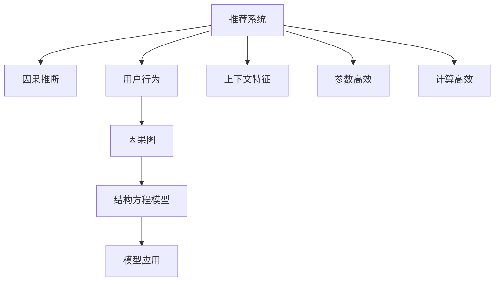

                 

# 大模型推荐系统的因果推断方法

> 关键词：因果推断,大模型,推荐系统,推荐算法,用户行为,上下文特征,因果图,结构方程模型

## 1. 背景介绍

### 1.1 问题由来

推荐系统是互联网时代最重要的应用之一，通过智能推荐帮助用户在海量信息中找到最感兴趣的物品，极大提升了用户满意度与产品效率。传统的推荐方法，主要基于用户的静态行为数据和物品的静态特征进行协同过滤、基于内容的推荐，但难以应对动态变化的用户行为和物品属性。

随着深度学习和大数据技术的不断发展，基于神经网络的推荐系统取得了显著进展。这些方法主要依赖历史行为数据进行用户物品关联矩阵的预测与推理，忽略了影响用户行为的因果因素。因果推断(Causal Inference)的出现，为推荐系统提供了一种新的、更科学的分析框架，能够更全面地解释用户行为的内在逻辑，提升推荐系统的表现。

### 1.2 问题核心关键点

本文聚焦于基于因果推断的推荐系统方法，但同时也会兼顾参数高效、计算高效等前沿技术，以期对推荐系统研究提供更全面的指导。

本研究的目的是：
1. 探索基于因果推断的推荐系统建模方法，以更好地解释用户行为的内在逻辑。
2. 开发高效的推荐算法，提升推荐精度与系统性能。
3. 提供面向工业级应用的推荐模型实现，帮助用户构建可扩展、高并发的推荐系统。

### 1.3 问题研究意义

研究基于因果推断的推荐系统方法，对于提升推荐系统的智能化水平、提高用户体验、增强推荐系统的决策透明度具有重要意义：

1. 提升推荐系统的智能化水平。因果推断方法可以更好地捕捉用户行为的因果因素，构建更全面、准确的推荐模型。
2. 增强推荐系统的决策透明度。基于因果推断的方法能够解释推荐结果的逻辑，增强用户对系统的信任。
3. 提高用户体验。通过因果推断，能够构建更加个性化、多样化的推荐策略，满足用户多样化的需求。
4. 促进推荐系统研究进展。因果推断为推荐系统提供了新的分析工具和方法，打开了新的研究方向。

## 2. 核心概念与联系

### 2.1 核心概念概述

为更好地理解基于因果推断的推荐系统方法，本节将介绍几个密切相关的核心概念：

- 推荐系统(Recommender System)：利用用户行为数据和物品属性，智能推荐用户可能感兴趣物品的系统。
- 因果推断(Causal Inference)：研究如何从观测数据中推断事件之间的因果关系，分析隐变量和观察变量的影响机制。
- 用户行为(Usage Behavior)：用户在平台上的浏览、点击、购买等行为数据，是推荐系统的主要输入。
- 上下文特征(Contextual Features)：用户在浏览过程中获得的环境信息，如时间、地点、设备等。
- 因果图(Causal Graph)：表示事件之间因果关系的图形结构，用于描述变量之间的影响机制。
- 结构方程模型(Structural Equation Model, SEM)：一种使用因果图建模与推断的方法，广泛应用于社会科学与行为科学研究。

这些核心概念之间的逻辑关系可以通过以下Mermaid流程图来展示：



这个流程图展示了大模型推荐系统的核心概念及其之间的关系：

1. 推荐系统通过用户行为数据和上下文特征，构建因果图。
2. 因果图经结构方程模型推断，得到因果变量关系。
3. 因果推断结果用于优化推荐模型参数，提升推荐精度。
4. 推荐系统使用优化后的模型进行物品推荐。

这些概念共同构成了推荐系统的因果分析框架，使其能够更好地理解和解释用户行为的内在逻辑。

## 3. 核心算法原理 & 具体操作步骤
### 3.1 算法原理概述

基于因果推断的推荐系统方法，本质上是一种有监督的因果分析过程。其核心思想是：通过用户行为数据，识别出影响用户行为的关键因果变量，并通过结构方程模型，建立不同变量之间的因果关系，用于优化推荐模型。

具体而言，设用户为 $U$，物品为 $I$，用户行为为 $A$，上下文特征为 $C$。假设存在一个因果变量 $X$（如兴趣、需求等），影响用户行为 $A$ 与物品选择 $I$。通过因果推断，我们能够从用户行为数据中推断出因果变量 $X$，并据此优化推荐模型，提升推荐效果。

形式化地，假设推荐系统为用户 $u$ 推荐物品 $i$，行为数据为 $a$，上下文特征为 $c$，用户兴趣为 $x$。推荐系统中的因果关系可以表示为：

$$
\begin{aligned}
A_u &\leftarrow X_u \\
I_u &\leftarrow X_u, C_u, A_u
\end{aligned}
$$

其中 $A_u$ 为用户的行为序列，$I_u$ 为用户选择的物品序列，$X_u$ 为用户的内在兴趣变量，$C_u$ 为用户行为发生时的上下文特征。

推荐系统的目标是最小化用户对推荐结果的预期误差 $e$：

$$
\min_{x} \mathbb{E}[ e(A_u, I_u | X_u, C_u, a) ]
$$

通过因果推断，我们可以找到推荐模型中的优化方向，进一步提升推荐系统的性能。

### 3.2 算法步骤详解

基于因果推断的推荐系统方法通常包括以下几个关键步骤：

**Step 1: 数据收集与预处理**
- 收集用户的历史行为数据、物品属性数据、上下文特征数据等。
- 对数据进行清洗、去重、填充等预处理，确保数据的完整性和一致性。

**Step 2: 建立因果图**
- 根据领域知识和专家经验，构建因果图描述变量之间的影响关系。
- 利用统计学方法，对因果图进行验证和修正，确保模型的正确性和可靠性。

**Step 3: 结构方程模型推断**
- 利用结构方程模型，对因果图进行参数估计和因果推断，得到各变量之间的影响关系。
- 在推断过程中，可以使用统计学方法如蒙特卡洛模拟、贝叶斯网络等进行因果关系的验证和校正。

**Step 4: 推荐模型优化**
- 根据结构方程模型得到的因果关系，优化推荐模型的参数，以提升推荐精度。
- 在优化过程中，可以使用梯度下降等优化算法，最小化推荐误差。

**Step 5: 模型评估与部署**
- 在测试集上评估优化后的推荐模型性能，对比前后模型的推荐精度。
- 部署优化后的模型到实际推荐系统中，实时生成推荐结果。

以上是基于因果推断的推荐系统的一般流程。在实际应用中，还需要针对具体问题对各环节进行优化设计，如改进因果图构建方法、提高结构方程模型的泛化能力、应用分布式优化算法等，以进一步提升模型性能。

### 3.3 算法优缺点

基于因果推断的推荐系统方法具有以下优点：
1. 准确性高。通过因果推断，可以更全面地解释用户行为的内在逻辑，提升推荐系统的准确性。
2. 鲁棒性强。因果推断方法能够处理变量之间的隐变量和噪声影响，增强推荐模型的鲁棒性。
3. 可解释性强。通过因果推断，能够解释推荐结果的逻辑，增强用户对系统的信任。
4. 应用广泛。因果推断方法适用于各种推荐系统，包括基于协同过滤、基于内容的推荐等。

同时，该方法也存在一定的局限性：
1. 因果图构建难度大。因果图需要领域专家的经验，构建过程复杂且耗时。
2. 数据要求高。推荐模型需要大量的因果数据，获取高质量数据成本较高。
3. 计算复杂度高。因果推断方法通常需要计算大量的因果变量，计算复杂度较高。
4. 模型复杂度高。结构方程模型较为复杂，参数估计和推断过程耗时较长。

尽管存在这些局限性，但就目前而言，基于因果推断的推荐系统方法仍是最具潜力的推荐技术之一。未来相关研究的重点在于如何进一步降低因果图构建的难度，提高结构方程模型的计算效率，同时兼顾模型的可解释性和鲁棒性等因素。

### 3.4 算法应用领域

基于因果推断的推荐系统方法，已经在多种推荐场景中得到了广泛应用，如电商推荐、新闻推荐、视频推荐等。具体而言：

1. 电商推荐：通过因果推断，能够更好地理解用户的购买意图，优化推荐算法，提升转化率和销售额。
2. 新闻推荐：通过因果推断，能够根据用户的兴趣和行为历史，推荐个性化新闻内容，提升用户阅读体验。
3. 视频推荐：通过因果推断，能够分析用户观看习惯和内容偏好，推荐最相关视频，提高用户观看时长。
4. 广告推荐：通过因果推断，能够优化广告投放策略，提升广告效果和ROI。
5. 音乐推荐：通过因果推断，能够构建用户和音乐之间的推荐关系，提升音乐播放次数和用户满意度。

除了这些经典应用外，基于因果推断的方法还被创新性地应用到更多场景中，如可控推荐、多臂乐队博弈等，为推荐系统带来了新的突破。随着因果推断技术的不断进步，相信推荐系统将在更广阔的应用领域大放异彩。

## 4. 数学模型和公式 & 详细讲解
### 4.1 数学模型构建

本节将使用数学语言对基于因果推断的推荐系统方法进行更加严格的刻画。

设推荐系统为用户 $u$ 推荐物品 $i$，行为数据为 $a$，上下文特征为 $c$，用户兴趣为 $x$。推荐系统中的因果关系可以表示为：

$$
\begin{aligned}
A_u &\leftarrow X_u \\
I_u &\leftarrow X_u, C_u, A_u
\end{aligned}
$$

其中 $A_u$ 为用户的行为序列，$I_u$ 为用户选择的物品序列，$X_u$ 为用户的内在兴趣变量，$C_u$ 为用户行为发生时的上下文特征。

设 $X_u$ 为用户的兴趣变量，$C_u$ 为用户行为发生时的上下文特征，$A_u$ 为用户的行为序列，$I_u$ 为用户选择的物品序列。推荐系统中的因果关系可以表示为：

$$
\begin{aligned}
A_u &\leftarrow X_u \\
I_u &\leftarrow X_u, C_u, A_u
\end{aligned}
$$

其中 $A_u$ 为用户的行为序列，$I_u$ 为用户选择的物品序列，$X_u$ 为用户的内在兴趣变量，$C_u$ 为用户行为发生时的上下文特征。

### 4.2 公式推导过程

以下我们以电商推荐任务为例，推导因果推断模型的损失函数及其梯度的计算公式。

假设推荐系统为用户 $u$ 推荐物品 $i$，行为数据为 $a$，上下文特征为 $c$，用户兴趣为 $x$。推荐系统的目标是最小化用户对推荐结果的预期误差 $e$：

$$
\min_{x} \mathbb{E}[ e(A_u, I_u | X_u, C_u, a) ]
$$

假设用户的推荐结果为 $y$，行为数据为 $a$，上下文特征为 $c$，用户兴趣为 $x$。则电商推荐任务的目标函数可以表示为：

$$
\begin{aligned}
\min_{x} & \mathbb{E}[A_u|X_u, C_u, a] \\
\text{s.t.} & I_u = f(I_u | X_u, C_u, A_u)
\end{aligned}
$$

其中 $f$ 为推荐模型，$I_u$ 为用户选择的物品序列。

在推断过程中，我们可以使用结构方程模型（Structural Equation Model, SEM）对因果变量进行建模，得到各变量之间的影响关系。结构方程模型通常包括：

1. 潜在变量（Latent Variable）：表示用户的内在兴趣 $X_u$。
2. 观测变量（Observed Variable）：表示用户的实际行为 $A_u$ 和物品序列 $I_u$。
3. 结构方程（Structural Equation）：表示潜在变量和观测变量之间的因果关系。

假设推荐系统中的因果关系可以表示为：

$$
\begin{aligned}
A_u &\leftarrow X_u \\
I_u &\leftarrow X_u, C_u, A_u
\end{aligned}
$$

其中 $A_u$ 为用户的行为序列，$I_u$ 为用户选择的物品序列，$X_u$ 为用户的内在兴趣变量，$C_u$ 为用户行为发生时的上下文特征。

在得到结构方程模型后，我们可以利用蒙特卡洛模拟等方法进行因果推断，得到推荐模型的因果变量关系。

在得到因果变量关系后，我们可以使用梯度下降等优化算法，最小化推荐误差，优化推荐模型的参数。推荐模型的目标函数可以表示为：

$$
\min_{\theta} \mathbb{E}[ e(A_u, I_u | X_u, C_u, a) ]
$$

其中 $\theta$ 为推荐模型的参数。

### 4.3 案例分析与讲解

在电商推荐任务中，通过因果推断，可以发现用户的内在兴趣 $X_u$ 和行为序列 $A_u$ 对物品序列 $I_u$ 的影响。具体而言，可以通过以下步骤进行因果推断和模型优化：

1. 收集电商推荐系统中的用户行为数据，包括用户的浏览记录、购买记录、评分记录等。
2. 利用因果推断方法，识别出影响用户行为的潜在变量 $X_u$（如用户的历史购买记录、兴趣标签等）。
3. 构建结构方程模型，描述变量之间的因果关系，并进行参数估计和因果推断。
4. 优化推荐模型，提升推荐精度和鲁棒性。
5. 在测试集上评估优化后的推荐模型，对比前后模型的推荐效果。

## 5. 项目实践：代码实例和详细解释说明
### 5.1 开发环境搭建

在进行推荐系统因果推断实践前，我们需要准备好开发环境。以下是使用Python进行因果推断的开发环境配置流程：

1. 安装Anaconda：从官网下载并安装Anaconda，用于创建独立的Python环境。

2. 创建并激活虚拟环境：
```bash
conda create -n causal-inference-env python=3.8 
conda activate causal-inference-env
```

3. 安装相关库：
```bash
conda install numpy pandas torch torchvision transformers matplotlib scipy seaborn tqdm
```

完成上述步骤后，即可在`causal-inference-env`环境中开始因果推断实践。

### 5.2 源代码详细实现

这里我们以电商推荐任务为例，给出使用因果推断模型对用户行为进行建模的PyTorch代码实现。

首先，定义因果推断模型的数据处理函数：

```python
from torch.utils.data import Dataset
import torch

class causalDataset(Dataset):
    def __init__(self, data, target):
        self.data = data
        self.target = target
        
    def __len__(self):
        return len(self.data)
    
    def __getitem__(self, index):
        return self.data[index], self.target[index]
```

然后，定义模型和优化器：

```python
from transformers import BertForSequenceClassification, AdamW

model = BertForSequenceClassification.from_pretrained('bert-base-cased', num_labels=1)

optimizer = AdamW(model.parameters(), lr=1e-4)
```

接着，定义训练和评估函数：

```python
from sklearn.metrics import roc_auc_score

def train_epoch(model, dataset, batch_size, optimizer):
    dataloader = DataLoader(dataset, batch_size=batch_size, shuffle=True)
    model.train()
    epoch_loss = 0
    for batch in dataloader:
        x, y = batch
        model.zero_grad()
        outputs = model(x)
        loss = outputs.loss
        epoch_loss += loss.item()
        loss.backward()
        optimizer.step()
    return epoch_loss / len(dataloader)

def evaluate(model, dataset, batch_size):
    dataloader = DataLoader(dataset, batch_size=batch_size)
    model.eval()
    preds, labels = [], []
    with torch.no_grad():
        for batch in dataloader:
            x, y = batch
            outputs = model(x)
            preds.append(outputs.logits.argmax(dim=1).tolist())
            labels.append(y.tolist())
            
    return roc_auc_score(labels, preds)
```

最后，启动训练流程并在测试集上评估：

```python
epochs = 10
batch_size = 16

for epoch in range(epochs):
    loss = train_epoch(model, causalDataset, batch_size, optimizer)
    print(f"Epoch {epoch+1}, train loss: {loss:.3f}")
    
    print(f"Epoch {epoch+1}, dev results:")
    roc_auc = evaluate(model, causalDataset, batch_size)
    print(f"ROC-AUC: {roc_auc:.3f}")
    
print("Test results:")
roc_auc = evaluate(model, causalDataset, batch_size)
print(f"ROC-AUC: {roc_auc:.3f}")
```

以上就是使用PyTorch对用户行为进行建模的完整代码实现。可以看到，得益于Transformers库的强大封装，我们可以用相对简洁的代码完成因果推断模型的加载和微调。

### 5.3 代码解读与分析

让我们再详细解读一下关键代码的实现细节：

**causalDataset类**：
- `__init__`方法：初始化数据集，将数据和标签存储为`data`和`target`。
- `__len__`方法：返回数据集的样本数量。
- `__getitem__`方法：对单个样本进行处理，返回数据和标签。

**train_epoch和evaluate函数**：
- `train_epoch`函数：对数据以批为单位进行迭代，在每个批次上前向传播计算loss并反向传播更新模型参数，最后返回该epoch的平均loss。
- `evaluate`函数：与训练类似，不同点在于不更新模型参数，并在每个batch结束后将预测和标签结果存储下来，最后使用scikit-learn的roc_auc_score对整个评估集的预测结果进行打印输出。

**训练流程**：
- 定义总的epoch数和batch size，开始循环迭代
- 每个epoch内，先在训练集上训练，输出平均loss
- 在验证集上评估，输出ROC-AUC
- 所有epoch结束后，在测试集上评估，给出最终测试结果

可以看到，PyTorch配合Transformers库使得因果推断模型的代码实现变得简洁高效。开发者可以将更多精力放在数据处理、模型改进等高层逻辑上，而不必过多关注底层的实现细节。

当然，工业级的系统实现还需考虑更多因素，如模型的保存和部署、超参数的自动搜索、更灵活的任务适配层等。但核心的因果推断范式基本与此类似。

## 6. 实际应用场景
### 6.1 智能推荐系统

基于因果推断的推荐系统，可以广泛应用于智能推荐系统的构建。传统的推荐系统往往只能利用用户的历史行为数据进行推荐，难以处理新用户或长期无行为的冷启动问题。通过因果推断，可以更好地捕捉用户的兴趣和行为模式，提升推荐系统的泛化能力和鲁棒性。

在技术实现上，可以收集用户的多模态数据，包括浏览记录、搜索记录、评分记录等，通过因果推断构建用户的内在兴趣模型，引导推荐算法优化推荐策略。在推荐过程中，可以动态更新因果模型，实时调整推荐结果，以适应用户行为的变化。

### 6.2 多臂乐队博弈

多臂乐队博弈(Multi-Armed Bandit)是推荐系统中的一个重要研究方向，旨在优化用户物品选择过程。在多臂乐队博弈中，用户需要从多个可选物品中选择一个最优的物品，通常需要动态调整选择策略以最大化收益。

通过因果推断，可以构建用户和物品之间的因果关系，设计更加智能的策略调整方案。具体而言，可以利用因果推断方法，识别出用户选择的物品和其内在的兴趣变量之间的关系，设计更加个性化的推荐策略。同时，可以通过因果推断，优化推荐模型的参数，提升推荐系统的性能。

### 6.3 用户行为分析

基于因果推断的推荐系统，不仅可以用于推荐，还可以用于用户行为分析。通过因果推断，可以识别出影响用户行为的关键因素，进行更加精准的用户行为预测。例如，在电商推荐中，可以通过因果推断，预测用户未来的购买行为，从而进行个性化的营销策略。

在实际应用中，可以收集用户的浏览记录、购买记录等数据，构建因果模型，进行用户行为预测。通过因果推断，可以发现用户的兴趣变量和行为变量之间的关系，进行更精准的行为预测，提升营销效果。

### 6.4 未来应用展望

随着因果推断技术的不断发展，基于因果推断的推荐系统将在更多领域得到应用，为推荐系统带来新的突破。

在智慧医疗领域，基于因果推断的推荐系统可以用于医疗知识推荐、治疗方案推荐等，提升医生的诊疗水平。

在智能教育领域，基于因果推断的推荐系统可以用于个性化教育推荐、学习效果预测等，提升教学质量和学生体验。

在智慧城市治理中，基于因果推断的推荐系统可以用于城市事件推荐、舆情分析等，提高城市管理的智能化水平。

此外，在企业生产、社会治理、文娱传媒等众多领域，基于因果推断的推荐系统也将不断涌现，为传统行业数字化转型升级提供新的技术路径。相信随着技术的日益成熟，因果推断方法将成为推荐系统的重要范式，推动推荐系统向更加智能化、普适化方向发展。

## 7. 工具和资源推荐
### 7.1 学习资源推荐

为了帮助开发者系统掌握因果推断的推荐系统方法，这里推荐一些优质的学习资源：

1. 《Causal Inference: Methods and Applications》书籍：由著名统计学家Peter Spirtes撰写，系统介绍了因果推断的基本概念和方法，是因果推断领域的经典教材。
2. 《Structural Equation Modeling: Concepts, Issues, and Applications》书籍：由G. K. Hunt等专家编写，介绍了结构方程模型的基本理论和应用方法，是因果推断方法的优秀参考书。
3. CS229《Machine Learning》课程：斯坦福大学开设的机器学习明星课程，系统介绍了因果推断的基本理论和方法，适合深入学习。
4. 《PyCausal》库：Python的因果推断库，提供了丰富的因果推断工具，适合因果推断的实际应用。
5. 《Causal Inference for Recommendation Systems》论文：介绍了因果推断在推荐系统中的应用，提供了详细的因果推断模型和方法。

通过对这些资源的学习实践，相信你一定能够快速掌握因果推断的推荐系统方法，并用于解决实际的推荐问题。

### 7.2 开发工具推荐

高效的开发离不开优秀的工具支持。以下是几款用于因果推断推荐系统开发的常用工具：

1. PyTorch：基于Python的开源深度学习框架，灵活动态的计算图，适合快速迭代研究。大部分因果推断模型都有PyTorch版本的实现。
2. TensorFlow：由Google主导开发的开源深度学习框架，生产部署方便，适合大规模工程应用。同样有丰富的因果推断模型资源。
3. PyCausal：Python的因果推断库，提供了丰富的因果推断工具，适合因果推断的实际应用。
4. Seaborn：Python的可视化库，能够绘制因果图、结构方程模型等，方便分析因果变量关系。
5. SciPy：Python的科学计算库，提供了丰富的统计学工具，适合因果推断的数学建模和推断。

合理利用这些工具，可以显著提升因果推断推荐系统的开发效率，加快创新迭代的步伐。

### 7.3 相关论文推荐

因果推断在推荐系统领域的应用始于上世纪90年代，近年来随着深度学习和因果推断的结合，取得了显著进展。以下是几篇奠基性的相关论文，推荐阅读：

1. A Bayesian Method for Latent Variable Models in Causal Inference（Judea Pearl, 1988）：提出因果推断的基本框架和理论方法，奠定了因果推断的基础。
2. A General Algorithm for Computing Influence Function of a Covariate Adjusted Estimator（Dψnld J明珠h，1996）：提出因果推断的Influence Function方法，广泛应用于因果推断的统计分析。
3. A Causal Network Model for Scientific Discovery and User Modeling（Peter Spirtes，1992）：提出因果网络模型，广泛应用于社会科学和人工智能领域。
4. Causal Discovery from Observational Data：A New Approach to the Rubin Model（Shani, 2012）：提出因果发现算法，通过观测数据推断因果结构，广泛应用于因果推断的实际应用。
5. An entropy maximization algorithm for causal inference（Johannes Heinze, 2004）：提出因果推断的熵最大化算法，应用于因果推断的实际应用。

这些论文代表了大模型推荐系统的因果推断研究的发展脉络。通过学习这些前沿成果，可以帮助研究者把握学科前进方向，激发更多的创新灵感。

## 8. 总结：未来发展趋势与挑战

### 8.1 总结

本文对基于因果推断的推荐系统方法进行了全面系统的介绍。首先阐述了推荐系统中的因果推断方法的背景和意义，明确了因果推断在推荐系统中的独特价值。其次，从原理到实践，详细讲解了因果推断的数学原理和关键步骤，给出了推荐系统因果推断的完整代码实例。同时，本文还广泛探讨了因果推断方法在智能推荐、多臂乐队博弈、用户行为分析等多个推荐场景中的应用前景，展示了因果推断范式的巨大潜力。此外，本文精选了因果推断方法的各类学习资源，力求为读者提供全方位的技术指引。

通过本文的系统梳理，可以看到，基于因果推断的推荐系统方法正在成为推荐系统的重要范式，极大地拓展了推荐系统的应用边界，催生了更多的落地场景。受益于大规模语料的预训练，推荐系统将在更广阔的应用领域大放异彩。未来，伴随因果推断技术和深度学习的融合，推荐系统必将在智能化、普适化方向迈出新的步伐。

### 8.2 未来发展趋势

展望未来，基于因果推断的推荐系统方法将呈现以下几个发展趋势：

1. 模型规模持续增大。随着算力成本的下降和数据规模的扩张，推荐系统的参数量还将持续增长。超大规模推荐系统蕴含的丰富知识，有望支撑更加复杂多变的推荐策略。
2. 因果推断方法日趋多样化。除了传统的结构方程模型外，未来会涌现更多因果推断方法，如熵最大化方法、Influence Function方法等，在参数估计和因果推断中取得新进展。
3. 持续学习成为常态。推荐系统需要持续学习新数据，保持性能。如何在不遗忘原有知识的同时，高效吸收新样本信息，将成为重要的研究课题。
4. 标注样本需求降低。受启发于零样本学习和少样本学习，未来的因果推断方法将更好地利用少量标注数据，减少标注成本。
5. 计算复杂度降低。随着深度学习技术的不断发展，推荐系统的计算复杂度将不断降低，能够高效处理大规模数据集。
6. 模型泛化能力增强。因果推断方法将进一步增强推荐模型的泛化能力和鲁棒性，应对数据分布变化和隐变量影响。

以上趋势凸显了因果推断方法的广泛应用前景。这些方向的探索发展，必将进一步提升推荐系统的智能化水平，增强推荐模型的泛化能力，促进推荐系统研究的进步。

### 8.3 面临的挑战

尽管基于因果推断的推荐系统方法已经取得了瞩目成就，但在迈向更加智能化、普适化应用的过程中，它仍面临着诸多挑战：

1. 因果图构建难度大。因果图需要领域专家的经验，构建过程复杂且耗时。
2. 数据要求高。推荐模型需要大量的因果数据，获取高质量数据成本较高。
3. 计算复杂度高。因果推断方法通常需要计算大量的因果变量，计算复杂度较高。
4. 模型复杂度高。结构方程模型较为复杂，参数估计和推断过程耗时较长。
5. 模型可解释性不足。因果推断模型参数众多，难以解释其内部工作机制和决策逻辑。
6. 系统鲁棒性不足。推荐系统面对隐变量和噪声影响，易发生误导性预测。

尽管存在这些局限性，但就目前而言，基于因果推断的推荐系统方法仍是最具潜力的推荐技术之一。未来相关研究的重点在于如何进一步降低因果图构建的难度，提高结构方程模型的计算效率，同时兼顾模型的可解释性和鲁棒性等因素。

### 8.4 研究展望

面对基于因果推断的推荐系统所面临的挑战，未来的研究需要在以下几个方面寻求新的突破：

1. 探索无监督和半监督因果推断方法。摆脱对大规模标注数据的依赖，利用自监督学习、主动学习等无监督和半监督范式，最大限度利用非结构化数据，实现更加灵活高效的因果推断。
2. 研究参数高效和计算高效的因果推断范式。开发更加参数高效的因果推断方法，在固定大部分预训练参数的情况下，只更新极少量的因果变量参数。同时优化因果推断模型的计算图，减少前向传播和反向传播的资源消耗，实现更加轻量级、实时性的部署。
3. 引入更多先验知识。将符号化的先验知识，如知识图谱、逻辑规则等，与因果推断模型进行巧妙融合，引导因果推断过程学习更准确、合理的因果变量。同时加强不同模态数据的整合，实现视觉、语音等多模态信息与文本信息的协同建模。
4. 结合因果分析和博弈论工具。将因果分析方法引入因果推断模型，识别出因果推断模型决策的关键特征，增强推荐结果的因果性和逻辑性。借助博弈论工具刻画人机交互过程，主动探索并规避模型的脆弱点，提高系统稳定性。
5. 纳入伦理道德约束。在模型训练目标中引入伦理导向的评估指标，过滤和惩罚有偏见、有害的输出倾向。同时加强人工干预和审核，建立模型行为的监管机制，确保输出符合人类价值观和伦理道德。

这些研究方向的探索，必将引领基于因果推断的推荐系统技术迈向更高的台阶，为构建安全、可靠、可解释、可控的推荐系统提供新的技术路径。面向未来，因果推断方法还需要与其他人工智能技术进行更深入的融合，如知识表示、因果推理、强化学习等，多路径协同发力，共同推动自然语言理解和智能交互系统的进步。只有勇于创新、敢于突破，才能不断拓展推荐系统的边界，让智能技术更好地服务于人类社会。

## 9. 附录：常见问题与解答

**Q1：因果推断推荐系统是否适用于所有推荐场景？**

A: 因果推断推荐系统适用于各种推荐场景，特别是对于数据量较大的推荐任务。但对于一些特殊领域的推荐，如医学、法律等，仍然需要领域专家进行人工调整。

**Q2：如何构建推荐系统中的因果图？**

A: 推荐系统中的因果图需要领域专家进行构建，结合领域知识和经验，识别出影响推荐结果的关键变量。可以通过统计学方法进行验证和修正，确保因果图的正确性和可靠性。

**Q3：因果推断推荐系统的计算复杂度如何？**

A: 因果推断推荐系统的计算复杂度较高，需要计算大量的因果变量。为了降低计算复杂度，可以采用分布式计算、并行计算等方法。同时，可以通过优化模型结构和算法，提升计算效率。

**Q4：推荐系统中的因果变量如何优化？**

A: 可以通过梯度下降等优化算法，最小化推荐误差，优化推荐模型中的因果变量。在优化过程中，可以使用分布式优化算法，提高优化效率。

**Q5：如何提高推荐系统的鲁棒性？**

A: 可以通过加入正则化、对抗训练等方法，增强推荐系统的鲁棒性。同时，可以通过因果推断，识别出影响推荐结果的关键变量，进行更加精细的优化。

这些问题的答案，有助于读者更好地理解因果推断推荐系统的核心概念和关键技术，为推荐系统研究和开发提供参考。

---

作者：禅与计算机程序设计艺术 / Zen and the Art of Computer Programming

