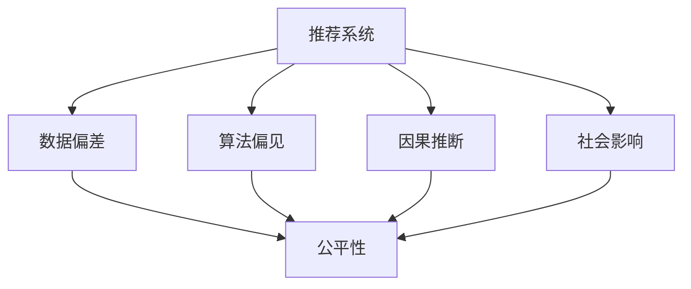

                 

# 大模型视角下推荐系统的公平性问题再思考

> 关键词：推荐系统,公平性,大模型,算法偏见,数据偏差,因果推断,社会影响

## 1. 背景介绍

在过去十年中，基于深度学习和大规模预训练模型的推荐系统在电商、社交网络、视频流平台等多个领域取得了巨大成功。然而，随着推荐算法的广泛应用，其公平性问题也日益凸显，引起了全球范围内学界和工业界的广泛关注。传统的推荐算法，如协同过滤和矩阵分解，通过用户和物品的相似度预测用户偏好，很大程度上依赖于用户的历史行为数据。但这些算法容易受到数据偏差和算法偏见的影响，导致特定用户群体、特定类型物品被不公平地对待。而基于大模型的推荐系统，尽管能够学习到更复杂、更全面的用户偏好，却同样面临着数据偏差和算法偏见的问题。本文章将从大模型视角出发，重新思考推荐系统的公平性问题，并探讨一些应对策略。

## 2. 核心概念与联系

### 2.1 核心概念概述

为更好地理解推荐系统的公平性问题，本节将介绍几个密切相关的核心概念：

- 推荐系统：通过分析用户历史行为、物品属性等信息，预测用户对物品的偏好，从而为用户推荐个性化物品的系统。
- 公平性：推荐系统公平性指系统在推荐过程中，不偏袒、歧视任何用户群体或物品类别，使得所有用户都能获得平等的机会。
- 数据偏差：指在训练数据和标注过程中，数据样本不平衡、不均匀导致的系统输出偏差。
- 算法偏见：指算法设计中存在的隐性歧视，如性别、年龄、种族等特征的不公平处理。
- 因果推断：指通过分析因果关系，区分原因和结果，并评估干预措施的影响。
- 社会影响：推荐系统可能影响用户的消费决策和心理认知，进而影响整个社会的价值观和行为模式。

这些核心概念之间的逻辑关系可以通过以下Mermaid流程图来展示：



这个流程图展示了大模型推荐系统中的核心概念及其之间的关系：

1. 推荐系统通过数据进行训练，预测用户偏好。
2. 数据偏差和算法偏见会导致不公平的推荐结果。
3. 因果推断用于评估推荐系统对社会的影响。
4. 社会影响与公平性息息相关，共同决定推荐系统的评价。

## 3. 核心算法原理 & 具体操作步骤

### 3.1 算法原理概述

基于大模型的推荐系统主要采用自监督学习方式，通过大规模无标签数据进行预训练，学习到用户和物品的通用表示。随后，在目标任务上进行微调，预测用户对物品的评分或偏好。推荐系统的公平性问题，主要源于数据偏差和算法偏见对模型学习过程的影响。数据偏差指训练数据中不同用户群体、不同物品类别的样本分布不均衡。算法偏见则指模型在预测过程中，可能对某些特征进行不公平处理，如性别、年龄等。

形式化地，假设推荐系统的输入为 $X=\{x_1, x_2, ..., x_N\}$，输出为 $Y=\{y_1, y_2, ..., y_M\}$，其中 $x_i$ 为物品特征向量，$y_i$ 为用户对物品 $x_i$ 的评分。推荐系统可以看作一个从输入 $X$ 到输出 $Y$ 的映射函数 $f$，即 $f: X \rightarrow Y$。设训练数据集为 $D=\{(x_i, y_i)\}_{i=1}^N$，推荐系统的目标是最小化预测误差，即：

$$
\min_{f} \frac{1}{N}\sum_{i=1}^N (y_i - f(x_i))^2
$$

在大模型推荐系统中，预测函数 $f$ 通常是一个深度神经网络，通过预训练和微调来学习用户和物品的表示。在预训练阶段，模型学习到用户和物品的语义表示，而在微调阶段，模型学习到用户对物品的偏好。

### 3.2 算法步骤详解

基于大模型的推荐系统微调步骤如下：

**Step 1: 数据预处理**

- 收集用户和物品的历史数据，包括用户ID、物品ID、评分等。
- 对数据进行清洗和标注，去除噪声和异常值。
- 进行特征工程，构建用户和物品的特征向量。

**Step 2: 数据分割**

- 将数据集划分为训练集、验证集和测试集。
- 确保不同用户群体、不同物品类别的样本在各集中的分布均衡。

**Step 3: 模型预训练**

- 使用大规模无标签数据对模型进行预训练。
- 预训练模型学习到用户和物品的语义表示，能够捕捉到数据中的潜在模式。

**Step 4: 模型微调**

- 在训练集上进行微调，调整模型参数以拟合数据。
- 使用验证集评估模型性能，调整超参数。
- 在测试集上测试模型，评估最终效果。

**Step 5: 公平性评估**

- 在测试集上评估模型的公平性指标，如均方误差、准确率等。
- 使用因果推断方法，评估推荐系统对社会的影响。

**Step 6: 优化调整**

- 根据公平性评估结果，对模型进行调整。
- 引入正则化技术，减少模型偏见。
- 进行对抗训练，提高模型鲁棒性。

### 3.3 算法优缺点

基于大模型的推荐系统具有以下优点：

1. 可解释性强：大模型能够学习到用户和物品的语义表示，增强模型的可解释性。
2. 泛化能力强：通过预训练学习到通用的语义表示，模型在目标任务上泛化能力更强。
3. 可处理复杂关系：大模型能够学习到更复杂、更全面的用户偏好，适用于复杂场景。
4. 适应性强：大模型具有较强的自适应能力，能够动态更新用户偏好。

但同时，也存在以下缺点：

1. 数据偏差敏感：大模型依赖于大量标注数据进行训练，数据偏差会导致模型学习到不公平的偏见。
2. 算法偏见难以消除：模型可能隐性歧视某些用户群体或物品类别，难以通过简单的正则化消除。
3. 计算资源消耗大：大模型参数量巨大，训练和推理需要大量的计算资源。
4. 模型复杂度高：大模型结构复杂，难以理解和调试。

### 3.4 算法应用领域

基于大模型的推荐系统广泛应用于电商推荐、社交媒体、视频流平台等多个领域。具体应用如下：

1. 电商推荐：根据用户历史行为，为用户推荐商品。
2. 视频流推荐：根据用户观影历史，为用户推荐电影和视频。
3. 社交媒体推荐：根据用户互动记录，为用户推荐朋友和内容。
4. 新闻推荐：根据用户阅读历史，为用户推荐新闻文章。

除了以上常见应用外，大模型推荐系统还在金融、医疗、旅游等更多领域得到应用，为各个行业带来智能化的用户体验和商业价值。

## 4. 数学模型和公式 & 详细讲解 & 举例说明

### 4.1 数学模型构建

本节将使用数学语言对大模型推荐系统的训练过程进行严格刻画。

假设推荐系统的输入为 $X=\{x_1, x_2, ..., x_N\}$，输出为 $Y=\{y_1, y_2, ..., y_M\}$，其中 $x_i$ 为物品特征向量，$y_i$ 为用户对物品 $x_i$ 的评分。推荐系统可以看作一个从输入 $X$ 到输出 $Y$ 的映射函数 $f$，即 $f: X \rightarrow Y$。设训练数据集为 $D=\{(x_i, y_i)\}_{i=1}^N$，推荐系统的目标是最小化预测误差，即：

$$
\min_{f} \frac{1}{N}\sum_{i=1}^N (y_i - f(x_i))^2
$$

在大模型推荐系统中，预测函数 $f$ 通常是一个深度神经网络，通过预训练和微调来学习用户和物品的表示。在预训练阶段，模型学习到用户和物品的语义表示，而在微调阶段，模型学习到用户对物品的偏好。

### 4.2 公式推导过程

以下我们以二分类任务为例，推导大模型推荐系统在微调阶段的损失函数和梯度公式。

假设模型 $f$ 在输入 $x$ 上的输出为 $\hat{y}=f(x) \in [0,1]$，表示用户对物品 $x$ 的评分。真实评分 $y \in \{0,1\}$。则二分类交叉熵损失函数定义为：

$$
\ell(f(x),y) = -[y\log \hat{y} + (1-y)\log (1-\hat{y})]
$$

将其代入经验风险公式，得：

$$
\mathcal{L}(f) = -\frac{1}{N}\sum_{i=1}^N [y_i\log f(x_i)+(1-y_i)\log(1-f(x_i))]
$$

根据链式法则，损失函数对模型参数 $\theta_k$ 的梯度为：

$$
\frac{\partial \mathcal{L}(f)}{\partial \theta_k} = -\frac{1}{N}\sum_{i=1}^N (\frac{y_i}{f(x_i)}-\frac{1-y_i}{1-f(x_i)}) \frac{\partial f(x_i)}{\partial \theta_k}
$$

其中 $\frac{\partial f(x_i)}{\partial \theta_k}$ 可进一步递归展开，利用自动微分技术完成计算。

### 4.3 案例分析与讲解

考虑一个电商推荐系统，数据集分为训练集和测试集，其中包含10000个用户和10000个物品。用户ID和物品ID分别为1到10000的整数，评分范围为0到5。数据集中的用户ID和物品ID均衡分布，但评分存在偏差，女性用户的评分普遍较低。

首先，进行数据预处理，将评分归一化到[0,1]区间。然后使用大规模预训练模型对模型进行预训练，学习到用户和物品的语义表示。接着，在训练集上进行微调，调整模型参数以拟合数据。使用验证集评估模型性能，调整超参数。最后，在测试集上测试模型，评估最终效果。

## 5. 项目实践：代码实例和详细解释说明

### 5.1 开发环境搭建

在进行大模型推荐系统微调实践前，我们需要准备好开发环境。以下是使用Python进行PyTorch开发的环境配置流程：

1. 安装Anaconda：从官网下载并安装Anaconda，用于创建独立的Python环境。

2. 创建并激活虚拟环境：
```bash
conda create -n recommendation-env python=3.8 
conda activate recommendation-env
```

3. 安装PyTorch：根据CUDA版本，从官网获取对应的安装命令。例如：
```bash
conda install pytorch torchvision torchaudio cudatoolkit=11.1 -c pytorch -c conda-forge
```

4. 安装TensorFlow：
```bash
conda install tensorflow
```

5. 安装Transformers库：
```bash
pip install transformers
```

6. 安装各类工具包：
```bash
pip install numpy pandas scikit-learn matplotlib tqdm jupyter notebook ipython
```

完成上述步骤后，即可在`recommendation-env`环境中开始推荐系统微调实践。

### 5.2 源代码详细实现

我们先以电商推荐系统为例，给出使用Transformers库对BERT模型进行微调的PyTorch代码实现。

首先，定义电商推荐系统的数据处理函数：

```python
from transformers import BertTokenizer
from torch.utils.data import Dataset
import torch

class RecommendationDataset(Dataset):
    def __init__(self, texts, scores, tokenizer, max_len=128):
        self.texts = texts
        self.scores = scores
        self.tokenizer = tokenizer
        self.max_len = max_len
        
    def __len__(self):
        return len(self.texts)
    
    def __getitem__(self, item):
        text = self.texts[item]
        score = self.scores[item]
        
        encoding = self.tokenizer(text, return_tensors='pt', max_length=self.max_len, padding='max_length', truncation=True)
        input_ids = encoding['input_ids'][0]
        attention_mask = encoding['attention_mask'][0]
        
        # 对score进行编码
        encoded_scores = [score] 
        encoded_scores.extend([0.] * (self.max_len - len(encoded_scores)))
        labels = torch.tensor(encoded_scores, dtype=torch.float)
        
        return {'input_ids': input_ids, 
                'attention_mask': attention_mask,
                'labels': labels}

# 创建dataset
tokenizer = BertTokenizer.from_pretrained('bert-base-cased')

train_dataset = RecommendationDataset(train_texts, train_scores, tokenizer)
dev_dataset = RecommendationDataset(dev_texts, dev_scores, tokenizer)
test_dataset = RecommendationDataset(test_texts, test_scores, tokenizer)
```

然后，定义模型和优化器：

```python
from transformers import BertForRegression, AdamW

model = BertForRegression.from_pretrained('bert-base-cased', num_labels=1)

optimizer = AdamW(model.parameters(), lr=2e-5)
```

接着，定义训练和评估函数：

```python
from torch.utils.data import DataLoader
from tqdm import tqdm
from sklearn.metrics import mean_squared_error

device = torch.device('cuda') if torch.cuda.is_available() else torch.device('cpu')
model.to(device)

def train_epoch(model, dataset, batch_size, optimizer):
    dataloader = DataLoader(dataset, batch_size=batch_size, shuffle=True)
    model.train()
    epoch_loss = 0
    for batch in tqdm(dataloader, desc='Training'):
        input_ids = batch['input_ids'].to(device)
        attention_mask = batch['attention_mask'].to(device)
        labels = batch['labels'].to(device)
        model.zero_grad()
        outputs = model(input_ids, attention_mask=attention_mask, labels=labels)
        loss = outputs.loss
        epoch_loss += loss.item()
        loss.backward()
        optimizer.step()
    return epoch_loss / len(dataloader)

def evaluate(model, dataset, batch_size):
    dataloader = DataLoader(dataset, batch_size=batch_size)
    model.eval()
    preds, labels = [], []
    with torch.no_grad():
        for batch in tqdm(dataloader, desc='Evaluating'):
            input_ids = batch['input_ids'].to(device)
            attention_mask = batch['attention_mask'].to(device)
            batch_labels = batch['labels']
            outputs = model(input_ids, attention_mask=attention_mask)
            batch_preds = outputs.logits.flatten().to('cpu').tolist()
            batch_labels = batch_labels.to('cpu').tolist()
            for pred_score, label_score in zip(batch_preds, batch_labels):
                preds.append(pred_score)
                labels.append(label_score)
                
    print(f"RMSE: {mean_squared_error(labels, preds):.3f}")
```

最后，启动训练流程并在测试集上评估：

```python
epochs = 5
batch_size = 16

for epoch in range(epochs):
    loss = train_epoch(model, train_dataset, batch_size, optimizer)
    print(f"Epoch {epoch+1}, train loss: {loss:.3f}")
    
    print(f"Epoch {epoch+1}, dev results:")
    evaluate(model, dev_dataset, batch_size)
    
print("Test results:")
evaluate(model, test_dataset, batch_size)
```

以上就是使用PyTorch对BERT进行电商推荐系统微调的完整代码实现。可以看到，得益于Transformers库的强大封装，我们可以用相对简洁的代码完成BERT模型的加载和微调。

### 5.3 代码解读与分析

让我们再详细解读一下关键代码的实现细节：

**RecommendationDataset类**：
- `__init__`方法：初始化文本、评分、分词器等关键组件。
- `__len__`方法：返回数据集的样本数量。
- `__getitem__`方法：对单个样本进行处理，将文本输入编码为token ids，将评分编码为数字，并对其进行定长padding，最终返回模型所需的输入。

**评分编码**：
- 使用评分作为标签，编码为标量形式，并对其进行定长padding。

**训练和评估函数**：
- 使用PyTorch的DataLoader对数据集进行批次化加载，供模型训练和推理使用。
- 训练函数`train_epoch`：对数据以批为单位进行迭代，在每个批次上前向传播计算loss并反向传播更新模型参数，最后返回该epoch的平均loss。
- 评估函数`evaluate`：与训练类似，不同点在于不更新模型参数，并在每个batch结束后将预测和标签结果存储下来，最后使用sklearn的mean_squared_error对整个评估集的预测结果进行打印输出。

**训练流程**：
- 定义总的epoch数和batch size，开始循环迭代
- 每个epoch内，先在训练集上训练，输出平均loss
- 在验证集上评估，输出RMSE
- 所有epoch结束后，在测试集上评估，给出最终测试结果

可以看到，PyTorch配合Transformers库使得BERT微调的代码实现变得简洁高效。开发者可以将更多精力放在数据处理、模型改进等高层逻辑上，而不必过多关注底层的实现细节。

当然，工业级的系统实现还需考虑更多因素，如模型的保存和部署、超参数的自动搜索、更灵活的任务适配层等。但核心的微调范式基本与此类似。

## 6. 实际应用场景
### 6.1 电商推荐系统

大模型推荐系统在电商推荐中得到了广泛应用。传统电商推荐系统主要基于协同过滤和矩阵分解，需要大量用户行为数据进行训练，容易受到数据偏差和用户行为分布不均衡的影响。而大模型推荐系统通过预训练学习到用户和物品的语义表示，能够更全面地理解用户偏好，从而提供更准确、更个性化的推荐结果。

在技术实现上，可以收集用户的历史浏览、点击、购买行为数据，将这些行为数据作为训练数据，构建电商推荐系统。通过大模型对用户和物品的语义表示进行编码，构建用户物品评分矩阵，使用矩阵分解等算法进行预测。同时，通过引入正则化技术，减少模型偏见，提高模型公平性。

### 6.2 金融理财推荐

金融理财推荐是大模型推荐系统的另一应用场景。金融产品具有种类繁多、收益波动等特点，传统推荐算法难以有效处理。而大模型推荐系统能够学习到用户对金融产品的多维偏好，通过预训练和微调，构建用户产品评分矩阵，生成推荐列表。

在实际应用中，可以收集用户的历史投资记录、风险偏好、金融产品属性等信息，作为训练数据。通过大模型对用户和产品进行语义表示，构建评分矩阵，使用协同过滤等算法进行推荐。同时，通过引入对抗训练和正则化技术，提高模型鲁棒性和公平性。

### 6.3 医疗健康推荐

医疗健康推荐是大模型推荐系统的另一个重要应用场景。医疗产品种类繁多，用户对不同产品的偏好差异很大，传统推荐算法难以处理。而大模型推荐系统能够学习到用户对不同医疗产品的多维偏好，通过预训练和微调，构建用户产品评分矩阵，生成推荐列表。

在实际应用中，可以收集用户的历史健康记录、医疗产品属性等信息，作为训练数据。通过大模型对用户和产品进行语义表示，构建评分矩阵，使用协同过滤等算法进行推荐。同时，通过引入正则化技术和对抗训练，提高模型鲁棒性和公平性。

### 6.4 未来应用展望

随着大模型推荐系统的不断发展，其在更多领域的应用前景将更加广阔。未来，推荐系统可能进一步应用于教育、旅游、城市规划等多个领域，为各行各业带来智能化升级。

在智慧教育领域，推荐系统可以根据学生的学习记录和行为数据，推荐个性化的学习内容和路径，帮助学生高效学习，提升教育质量。

在智慧旅游领域，推荐系统可以根据用户的历史旅游记录和偏好，推荐个性化的旅游路线和景点，提升用户体验，增加旅游收入。

在智慧城市规划中，推荐系统可以根据市民的需求和行为数据，推荐智能化的公共服务设施，提高城市管理的智能化水平。

## 7. 工具和资源推荐
### 7.1 学习资源推荐

为了帮助开发者系统掌握大模型推荐系统的公平性问题，这里推荐一些优质的学习资源：

1. 《推荐系统基础》书籍：由推荐系统专家撰写，全面介绍了推荐系统的理论基础和实现细节。

2. 《深度学习推荐系统》课程：清华大学开设的深度学习推荐系统课程，介绍了推荐系统的核心算法和应用。

3. 《Recommender Systems in Practice》书籍：深入讲解推荐系统的工程实现和优化策略。

4. 《Fairness in Machine Learning》书籍：介绍了机器学习中公平性问题的评估方法和解决策略。

5. 《Recommender Systems: From Theory to Practice》期刊：介绍了推荐系统领域的最新研究进展和应用案例。

通过对这些资源的学习实践，相信你一定能够快速掌握大模型推荐系统的公平性问题的理论基础和实践技巧，并用于解决实际的推荐问题。
###  7.2 开发工具推荐

高效的开发离不开优秀的工具支持。以下是几款用于大模型推荐系统微调开发的常用工具：

1. PyTorch：基于Python的开源深度学习框架，灵活动态的计算图，适合快速迭代研究。大部分预训练语言模型都有PyTorch版本的实现。

2. TensorFlow：由Google主导开发的开源深度学习框架，生产部署方便，适合大规模工程应用。同样有丰富的预训练语言模型资源。

3. Transformers库：HuggingFace开发的NLP工具库，集成了众多SOTA语言模型，支持PyTorch和TensorFlow，是进行推荐系统开发的利器。

4. Weights & Biases：模型训练的实验跟踪工具，可以记录和可视化模型训练过程中的各项指标，方便对比和调优。与主流深度学习框架无缝集成。

5. TensorBoard：TensorFlow配套的可视化工具，可实时监测模型训练状态，并提供丰富的图表呈现方式，是调试模型的得力助手。

6. Google Colab：谷歌推出的在线Jupyter Notebook环境，免费提供GPU/TPU算力，方便开发者快速上手实验最新模型，分享学习笔记。

合理利用这些工具，可以显著提升大模型推荐系统的开发效率，加快创新迭代的步伐。

### 7.3 相关论文推荐

大模型推荐系统的公平性问题是一个前沿的学术热点，以下是几篇奠基性的相关论文，推荐阅读：

1. Fairness in Recommendation Systems：总结了推荐系统中公平性问题的研究现状和挑战。

2. Debiasing Recommender Systems with Transfer Learning：提出通过迁移学习减少推荐系统中的数据偏差。

3. Mitigating Bias in Recommendation Systems：总结了减少推荐系统偏见的方法和技术。

4. Fairness and Bias in Recommendation Algorithms：介绍了推荐系统中公平性和偏见评估指标和解决方法。

5. Fairness-aware Recommendation Systems：提出了基于公平性指标的推荐算法设计。

这些论文代表了大模型推荐系统公平性问题的研究进展，通过学习这些前沿成果，可以帮助研究者更好地理解问题的本质，找到有效的解决方案。

## 8. 总结：未来发展趋势与挑战

### 8.1 总结

本文对大模型推荐系统的公平性问题进行了全面系统的介绍。首先阐述了推荐系统的公平性问题，明确了数据偏差和算法偏见对系统性能的影响。其次，从原理到实践，详细讲解了大模型推荐系统的训练过程，并给出了代码实例。同时，本文还广泛探讨了推荐系统在电商、金融、医疗等多个领域的应用前景，展示了微调方法在大模型推荐系统中的广泛应用。

通过本文的系统梳理，可以看到，基于大模型的推荐系统已经在大数据和复杂多变的应用场景中展现出强大的优势，具有广阔的应用前景。未来，随着模型的不断发展，推荐系统将进一步提升智能化水平，成为更多行业智能化升级的关键工具。

### 8.2 未来发展趋势

展望未来，大模型推荐系统将呈现以下几个发展趋势：

1. 模型规模持续增大。随着算力成本的下降和数据规模的扩张，预训练语言模型的参数量还将持续增长。超大规模语言模型蕴含的丰富语言知识，有望支撑更加复杂多变的推荐任务。

2. 推荐算法更加多样化。除了传统的协同过滤和矩阵分解，更多先进算法如深度学习、迁移学习、元学习等将被引入，提升推荐效果。

3. 个性化推荐更加深入。基于大模型的推荐系统能够学习到用户的多维偏好，推荐结果将更加个性化、精细化。

4. 推荐系统更加公平。通过引入公平性评估指标和算法，推荐系统将更加关注公平性问题，避免对特定用户群体的歧视。

5. 推荐系统更加智能化。引入因果推断、自然语言处理等技术，推荐系统将能够理解用户的真实需求，提供更精准的推荐。

6. 推荐系统更加社会化。推荐系统将进一步融入社会网络，通过用户反馈、社交关系等社会化因素优化推荐效果。

以上趋势凸显了大模型推荐系统的广阔前景。这些方向的探索发展，必将进一步提升推荐系统的性能和应用范围，为人工智能技术在各行业落地应用提供坚实基础。

### 8.3 面临的挑战

尽管大模型推荐系统已经取得了瞩目成就，但在迈向更加智能化、普适化应用的过程中，它仍面临着诸多挑战：

1. 数据偏差难以完全消除。由于用户行为数据存在偏差，推荐系统难以完全消除数据偏差带来的影响，仍需持续优化数据采集和处理流程。

2. 算法偏见难以根治。尽管引入公平性评估指标和算法，推荐系统仍可能隐性歧视某些用户群体或物品类别，难以通过简单的正则化完全消除。

3. 模型计算资源消耗大。大模型推荐系统需要大量计算资源进行训练和推理，难以在实时性要求高的场景下大规模应用。

4. 模型复杂度较高。大模型推荐系统结构复杂，难以调试和优化，需要更多研究者和工程师的协作。

5. 模型可解释性不足。推荐系统的黑盒模型难以解释其内部工作机制，难以让用户理解和信任推荐结果。

6. 模型安全性有待提高。推荐系统可能被恶意攻击，造成推荐结果误导用户，影响用户决策。

正视推荐系统面临的这些挑战，积极应对并寻求突破，将是大模型推荐系统走向成熟的必由之路。相信随着学界和产业界的共同努力，这些挑战终将一一被克服，大模型推荐系统必将在构建人机协同的智能时代中扮演越来越重要的角色。

### 8.4 研究展望

面向未来，大模型推荐系统需要不断优化和创新，具体方向包括：

1. 优化数据采集和处理流程，减少数据偏差。通过更精细的数据标注和采集策略，减少数据偏差的影响。

2. 引入更多公平性评估指标和算法，降低算法偏见。通过引入多种公平性评估指标和算法，降低推荐系统的偏见。

3. 优化推荐系统结构和算法，提高模型效率。通过引入参数高效和计算高效的微调方法，提高模型的推理速度和效率。

4. 引入因果推断和自然语言处理技术，提升推荐系统的效果。通过引入因果推断和自然语言处理技术，提升推荐系统的公平性和智能化水平。

5. 引入社会化因素，优化推荐系统效果。通过引入社会化因素，如用户反馈、社交关系等，优化推荐系统的效果。

6. 加强模型安全性研究，提高模型鲁棒性。通过研究对抗样本和模型鲁棒性，提升推荐系统的安全性。

这些研究方向的发展，必将进一步提升推荐系统的性能和应用范围，为构建安全、可靠、可解释、可控的智能系统铺平道路。总之，推荐系统需要不断地探索和创新，才能适应未来复杂多变的应用需求，带来更好的用户体验和社会效益。

## 9. 附录：常见问题与解答

**Q1：大模型推荐系统是否适用于所有推荐场景？**

A: 大模型推荐系统在大多数推荐场景中都能取得不错的效果，特别是对于数据量较小的场景。但对于一些特定领域的推荐场景，如医疗、法律等，仅仅依靠通用语料预训练的模型可能难以很好地适应。此时需要在特定领域语料上进一步预训练，再进行微调，才能获得理想效果。此外，对于一些需要时效性、个性化很强的场景，如即时推荐、智能客服等，大模型推荐系统也需要针对性的改进优化。

**Q2：大模型推荐系统如何处理数据偏差？**

A: 大模型推荐系统处理数据偏差的方法主要包括以下几种：

1. 数据预处理：通过清洗、去重、标注等手段，去除噪声和异常值，提高数据质量。

2. 数据增强：通过回译、近义替换等方式扩充训练集，减少数据偏差的影响。

3. 模型正则化：引入正则化技术，如L2正则、Dropout等，避免模型过拟合。

4. 对抗训练：引入对抗样本，提高模型鲁棒性，减少数据偏差的影响。

5. 公平性评估：通过引入公平性评估指标和算法，评估推荐系统的偏见，调整模型参数，减少偏见。

这些方法通常需要根据具体场景和数据特点进行灵活组合，以最大限度地减少数据偏差的影响。

**Q3：大模型推荐系统如何处理算法偏见？**

A: 大模型推荐系统处理算法偏见的方法主要包括以下几种：

1. 公平性评估：通过引入公平性评估指标和算法，评估推荐系统的偏见，调整模型参数，减少偏见。

2. 数据预处理：通过清洗、去重、标注等手段，去除噪声和异常值，提高数据质量。

3. 模型正则化：引入正则化技术，如L2正则、Dropout等，避免模型过拟合。

4. 对抗训练：引入对抗样本，提高模型鲁棒性，减少算法偏见的影响。

5. 公平性调整：通过引入公平性调整方法，如重新采样、惩罚机制等，减少推荐系统的偏见。

这些方法通常需要根据具体场景和数据特点进行灵活组合，以最大限度地减少算法偏见的影响。

**Q4：大模型推荐系统在落地部署时需要注意哪些问题？**

A: 将大模型推荐系统转化为实际应用，还需要考虑以下问题：

1. 模型裁剪：去除不必要的层和参数，减小模型尺寸，加快推理速度。

2. 量化加速：将浮点模型转为定点模型，压缩存储空间，提高计算效率。

3. 服务化封装：将模型封装为标准化服务接口，便于集成调用。

4. 弹性伸缩：根据请求流量动态调整资源配置，平衡服务质量和成本。

5. 监控告警：实时采集系统指标，设置异常告警阈值，确保服务稳定性。

6. 安全防护：采用访问鉴权、数据脱敏等措施，保障数据和模型安全。

合理利用这些工具，可以显著提升大模型推荐系统的开发效率，加快创新迭代的步伐。

---

作者：禅与计算机程序设计艺术 / Zen and the Art of Computer Programming

