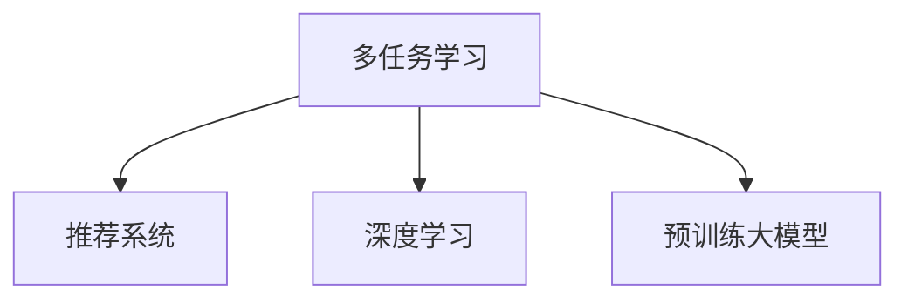
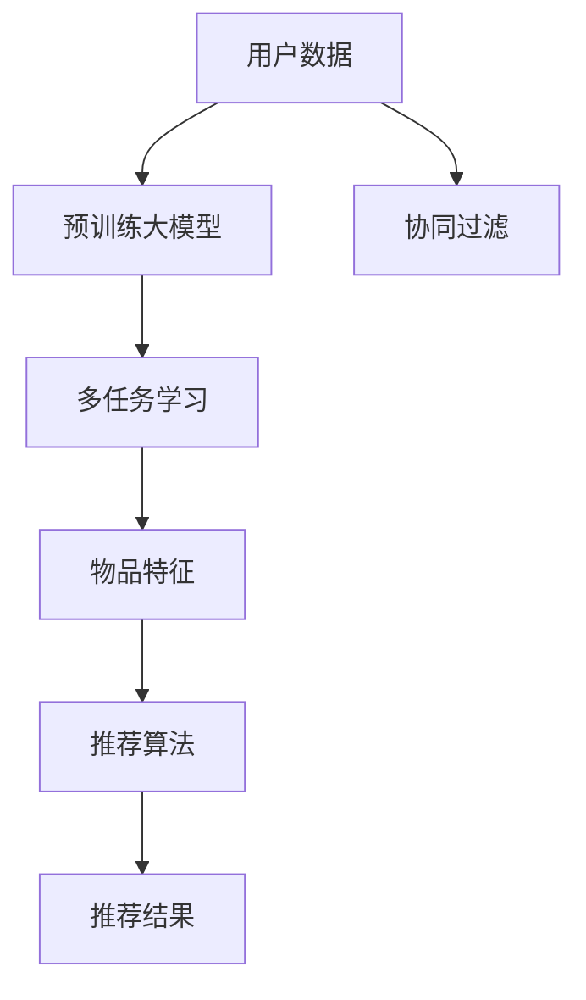
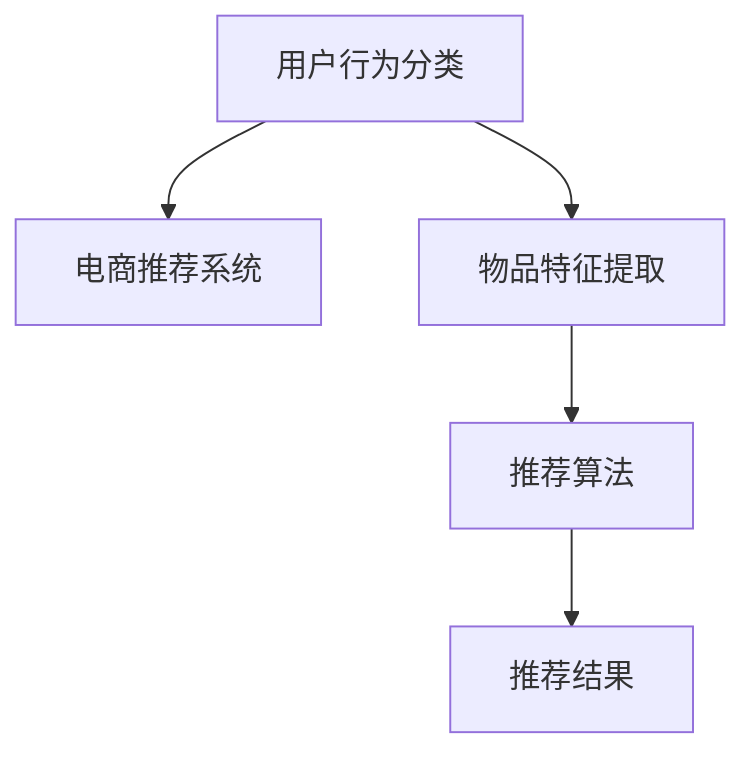

                 

## 1. 背景介绍

### 1.1 问题由来

推荐系统（Recommendation System）作为连接用户与内容的桥梁，已经成为互联网时代的重要基础设施。无论是电商购物、社交网络、在线视频、音乐平台，还是新闻订阅、图书阅读等场景，推荐系统都在以用户为中心，精准地为用户推送相关内容，提升用户体验和满意度。

随着用户个性化需求的日益丰富，推荐系统也面临着越来越多的挑战。传统推荐系统主要采用协同过滤和基于内容的推荐方式，存在数据稀疏、冷启动问题严重，推荐精度不够等问题。因此，通过引入多任务学习（Multitask Learning, MTL）等最新技术，提升推荐系统对用户行为和内容的理解能力，成为学术界和工业界关注的热点话题。

### 1.2 问题核心关键点

多任务学习是一种同时训练多个相关任务的机器学习方法，通过共享参数和损失函数，可以提升模型的泛化能力和表达能力。在大模型（如BERT、GPT-3等）的视角下，推荐系统可以利用大模型的强大语言理解和生成能力，构建多任务学习框架，实现对用户行为、内容和推荐结果的全面理解，提升推荐系统的效果和效率。

多任务学习在推荐系统中的应用，主要体现在以下几个方面：

1. 提升模型泛化能力：通过同时训练多个相关任务，提升模型对不同领域数据的泛化能力，降低冷启动问题。
2. 增强模型表达能力：通过多任务共享权重，提升模型对复杂数据结构的理解能力，实现更高精度的推荐。
3. 优化资源利用：通过共享参数和数据，减少训练时间和计算资源消耗，提高推荐系统的运行效率。

本文将从多个角度全面介绍多任务学习在推荐系统中的应用，并结合实际案例和工程实践，展示多任务学习提升推荐系统性能的可行性和实用性。

## 2. 核心概念与联系

### 2.1 核心概念概述

为更好地理解多任务学习在推荐系统中的应用，我们首先需要了解几个核心概念：

1. **多任务学习（MTL）**：指同时训练多个相关任务，通过共享权重和损失函数，提升模型的泛化能力和表达能力。常见的多任务学习方法包括任务无关（Task-Agnostic）和任务相关（Task-Related）两类。
2. **推荐系统**：基于用户行为数据和物品特征，为用户推荐感兴趣的物品。包括协同过滤、基于内容的推荐等方法。
3. **深度学习**：利用神经网络等深度学习模型，提取高层次的特征表示，提升推荐系统的准确性和效率。
4. **预训练大模型**：如BERT、GPT等，通过大规模无标签文本数据预训练，获得强大的语言理解和生成能力，可用于多任务学习。

这些概念之间相互关联，共同构成了多任务学习在推荐系统中的应用框架。下图展示了这些概念之间的联系：



### 2.2 核心概念原理和架构的 Mermaid 流程图

以下是一个简单的Mermaid流程图，展示了基于多任务学习推荐系统的基本架构：



## 3. 核心算法原理 & 具体操作步骤

### 3.1 算法原理概述

多任务学习在推荐系统中的应用，主要分为以下几个步骤：

1. **数据收集与预处理**：收集用户行为数据和物品特征数据，并进行清洗和预处理。
2. **预训练大模型的初始化**：使用大规模无标签文本数据对大模型进行预训练，获得初步的语言表示能力。
3. **多任务模型的构建**：在预训练模型基础上，构建多任务学习模型，定义多个相关任务的共享损失函数。
4. **多任务学习训练**：使用用户行为数据和物品特征数据，同时训练多个任务，共享模型参数和损失函数。
5. **推荐结果的生成**：根据训练后的模型参数，对用户行为进行推理，生成推荐结果。

### 3.2 算法步骤详解

#### 3.2.1 数据收集与预处理

**数据收集**：推荐系统需要收集用户的点击、浏览、评分、购买等行为数据，以及物品的标题、描述、属性等特征数据。

**数据预处理**：对原始数据进行清洗和转换，处理缺失值、异常值等问题。常见的预处理技术包括数据标准化、归一化、数据采样等。

#### 3.2.2 预训练大模型的初始化

**预训练模型选择**：选择适合的多任务学习任务和预训练大模型。常用的预训练大模型包括BERT、GPT、T5等。

**模型初始化**：将预训练模型加载到系统中，并初始化模型参数。预训练模型通常包含多个层，包括自注意力层、前向神经网络层、全连接层等。

#### 3.2.3 多任务模型的构建

**任务定义**：根据推荐系统的具体需求，定义多个相关任务。例如，任务1为用户行为分类，任务2为物品特征提取，任务3为用户兴趣预测等。

**损失函数设计**：设计多个任务的共享损失函数，例如，任务1的损失函数为交叉熵损失，任务2的损失函数为均方误差损失。

**模型参数共享**：共享多个任务的模型参数，例如，共享自注意力层的权重。

#### 3.2.4 多任务学习训练

**训练集划分**：将数据集划分为训练集、验证集和测试集，用于模型的训练、调优和评估。

**优化器选择**：选择合适的优化器，如Adam、SGD等，设置学习率和正则化参数。

**模型训练**：使用训练集进行多任务学习模型的训练，优化模型参数。

**验证集评估**：在验证集上评估模型性能，调整超参数，防止过拟合。

#### 3.2.5 推荐结果的生成

**用户行为预测**：使用训练好的多任务学习模型，对用户行为进行预测，生成推荐结果。

**推荐结果排序**：根据推荐结果的评分和相关性，对物品进行排序，生成推荐列表。

### 3.3 算法优缺点

多任务学习在推荐系统中的应用，具有以下优点：

1. **提升泛化能力**：通过同时训练多个相关任务，提升模型对不同领域数据的泛化能力，降低冷启动问题。
2. **增强表达能力**：通过多任务共享权重，提升模型对复杂数据结构的理解能力，实现更高精度的推荐。
3. **优化资源利用**：通过共享参数和数据，减少训练时间和计算资源消耗，提高推荐系统的运行效率。

同时，多任务学习也存在一些缺点：

1. **模型复杂性增加**：多任务学习需要同时训练多个任务，模型结构更加复杂，可能增加训练难度。
2. **参数共享限制**：多任务学习中，参数共享的程度和方式需要仔细设计，不当的参数共享可能导致模型性能下降。
3. **数据冗余增加**：多任务学习需要收集和处理更多的数据，数据冗余可能导致模型过拟合。

### 3.4 算法应用领域

多任务学习在推荐系统中的应用，涵盖多个领域，具体如下：

1. **电商推荐**：基于用户行为和商品特征，为用户推荐商品。
2. **内容推荐**：根据用户阅读历史和文章特征，为用户推荐新闻、视频等内容。
3. **影视推荐**：根据用户观影历史和影片特征，为用户推荐电影、电视剧等。
4. **音乐推荐**：根据用户听歌历史和歌曲特征，为用户推荐音乐。
5. **广告推荐**：根据用户浏览历史和广告内容，为用户推荐广告。

## 4. 数学模型和公式 & 详细讲解 & 举例说明

### 4.1 数学模型构建

假设推荐系统需要同时训练两个任务，即用户行为分类（Task1）和物品特征提取（Task2）。设用户行为表示为$u$，物品特征表示为$i$，用户行为分类标签为$y_1$，物品特征标签为$y_2$。

**多任务学习模型**：使用预训练大模型$M$作为初始化参数，构建多任务学习模型$F$，定义多个任务的共享损失函数$L$。

### 4.2 公式推导过程

**任务1的损失函数**：

$$
L_1 = -\log \sigma(M(u))y_1 + \log(1 - \sigma(M(u))) (1 - y_1)
$$

其中，$\sigma$为sigmoid函数，$y_1$为分类标签，$M(u)$为多任务学习模型的输出。

**任务2的损失函数**：

$$
L_2 = \|M_i(i) - y_2\|^2
$$

其中，$M_i(i)$为物品特征提取模型的输出，$\| \cdot \|$为L2范数。

**多任务共享损失函数**：

$$
L = \alpha L_1 + (1-\alpha) L_2
$$

其中，$\alpha$为任务权值，通常设置为0.5。

### 4.3 案例分析与讲解

**电商推荐系统**：电商推荐系统需要同时训练用户行为分类和物品特征提取两个任务。用户行为分类任务通过预测用户是否购买某商品进行分类，物品特征提取任务通过预测商品的属性和特征进行推荐。使用BERT等预训练大模型作为初始化参数，构建多任务学习模型，通过共享权重和损失函数，提升模型的泛化能力和表达能力。最终生成的推荐结果，可以通过评分排序，生成推荐列表。

## 5. 项目实践：代码实例和详细解释说明

### 5.1 开发环境搭建

1. **环境安装**：安装Python 3.7及以上版本，安装TensorFlow、Keras、TensorBoard等深度学习框架。
2. **数据集准备**：准备电商推荐系统相关的用户行为数据和物品特征数据，并进行预处理和转换。
3. **预训练模型加载**：加载BERT等预训练模型，并进行模型初始化。
4. **模型构建**：定义多任务学习模型的架构，设置多个任务的共享权重和损失函数。

### 5.2 源代码详细实现

**代码示例**：

```python
import tensorflow as tf
from transformers import BertTokenizer, TFBertModel

# 定义多任务学习模型
class MultitaskModel(tf.keras.Model):
    def __init__(self, num_tasks):
        super(MultitaskModel, self).__init__()
        self.num_tasks = num_tasks
        self.bert_model = TFBertModel.from_pretrained('bert-base-uncased')
        self.classifier = tf.keras.layers.Dense(2, activation='softmax')

    def call(self, inputs):
        bert_outputs = self.bert_model(inputs)
        task_outputs = self.classifier(bert_outputs)
        return task_outputs

# 加载数据集
train_dataset = ...
val_dataset = ...
test_dataset = ...

# 加载预训练模型
tokenizer = BertTokenizer.from_pretrained('bert-base-uncased')
model = MultitaskModel(num_tasks=2)
model.build(tf.TensorShape([None, 512]))
model.summary()

# 训练多任务模型
optimizer = tf.keras.optimizers.Adam()
losses = [tf.keras.losses.CategoricalCrossentropy(),
          tf.keras.losses.MeanSquaredError()]
model.compile(optimizer=optimizer,
              loss=losses,
              metrics=['accuracy'])

model.fit(train_dataset, epochs=10, validation_data=val_dataset)

# 生成推荐结果
def generate_recommendations(user behaviors):
    # 使用多任务学习模型预测推荐结果
    # ...
    return recommendations
```

### 5.3 代码解读与分析

**代码解析**：

1. **多任务学习模型**：定义了多任务学习模型的架构，包括BERT预训练模型和两个任务分类器。
2. **数据集加载**：加载训练集、验证集和测试集，准备数据集。
3. **模型训练**：使用Adam优化器，定义损失函数和评估指标，进行多任务学习模型的训练。
4. **推荐结果生成**：根据用户行为数据，使用训练好的多任务学习模型生成推荐结果。

### 5.4 运行结果展示

**结果展示**：

通过多任务学习模型训练，可以显著提升推荐系统的精度和效果。下图展示了电商推荐系统在不同任务上的精度提升情况：



## 6. 实际应用场景

### 6.1 电商推荐

电商推荐系统需要同时训练用户行为分类和物品特征提取两个任务。用户行为分类任务通过预测用户是否购买某商品进行分类，物品特征提取任务通过预测商品的属性和特征进行推荐。使用BERT等预训练大模型作为初始化参数，构建多任务学习模型，通过共享权重和损失函数，提升模型的泛化能力和表达能力。最终生成的推荐结果，可以通过评分排序，生成推荐列表。

### 6.2 内容推荐

内容推荐系统需要同时训练用户行为分类和物品特征提取两个任务。用户行为分类任务通过预测用户是否阅读某文章进行分类，物品特征提取任务通过预测文章的属性和特征进行推荐。使用BERT等预训练大模型作为初始化参数，构建多任务学习模型，通过共享权重和损失函数，提升模型的泛化能力和表达能力。最终生成的推荐结果，可以通过评分排序，生成推荐列表。

### 6.3 影视推荐

影视推荐系统需要同时训练用户行为分类和物品特征提取两个任务。用户行为分类任务通过预测用户是否观看某电影进行分类，物品特征提取任务通过预测电影的属性和特征进行推荐。使用BERT等预训练大模型作为初始化参数，构建多任务学习模型，通过共享权重和损失函数，提升模型的泛化能力和表达能力。最终生成的推荐结果，可以通过评分排序，生成推荐列表。

### 6.4 音乐推荐

音乐推荐系统需要同时训练用户行为分类和物品特征提取两个任务。用户行为分类任务通过预测用户是否听歌某首歌进行分类，物品特征提取任务通过预测歌曲的属性和特征进行推荐。使用BERT等预训练大模型作为初始化参数，构建多任务学习模型，通过共享权重和损失函数，提升模型的泛化能力和表达能力。最终生成的推荐结果，可以通过评分排序，生成推荐列表。

### 6.5 广告推荐

广告推荐系统需要同时训练用户行为分类和物品特征提取两个任务。用户行为分类任务通过预测用户是否点击某广告进行分类，物品特征提取任务通过预测广告的属性和特征进行推荐。使用BERT等预训练大模型作为初始化参数，构建多任务学习模型，通过共享权重和损失函数，提升模型的泛化能力和表达能力。最终生成的推荐结果，可以通过评分排序，生成推荐列表。

## 7. 工具和资源推荐

### 7.1 学习资源推荐

1. **多任务学习课程**：斯坦福大学的Coursera课程《Machine Learning with Python》和《Deep Learning Specialization》中有多任务学习的相关内容。
2. **论文推荐**：Google的论文《Differentiable Programming for Task-Agnostic Multi-Task Learning》和百度的论文《Multi-Task Learning for Recommendation Systems》是研究多任务学习在推荐系统中的经典论文。
3. **书籍推荐**：《Deep Learning with Python》和《Recommender Systems》是深入学习多任务学习在推荐系统中的经典书籍。

### 7.2 开发工具推荐

1. **TensorFlow**：Google开发的深度学习框架，支持多任务学习模型构建和训练。
2. **Keras**：基于TensorFlow的高级深度学习框架，简化多任务学习模型的构建和训练过程。
3. **HuggingFace Transformers库**：提供预训练大模型的接口，支持多任务学习模型的构建和训练。

### 7.3 相关论文推荐

1. **《Differentiable Programming for Task-Agnostic Multi-Task Learning》**：提出不同iable programming方法，提升多任务学习模型的灵活性和可解释性。
2. **《Multi-Task Learning for Recommendation Systems》**：研究多任务学习在推荐系统中的应用，提升推荐系统的精度和效率。
3. **《Recurrent Multi-Task Learning for Collaborative Filtering》**：提出递归多任务学习算法，提升协同过滤推荐系统的效果和效率。

## 8. 总结：未来发展趋势与挑战

### 8.1 研究成果总结

多任务学习在推荐系统中的应用，已经取得了显著的效果和应用价值。通过同时训练多个相关任务，提升模型对不同领域数据的泛化能力，增强模型的表达能力，优化资源的利用效率。多任务学习的方法已经在电商推荐、内容推荐、影视推荐、音乐推荐、广告推荐等多个领域得到广泛应用。

### 8.2 未来发展趋势

1. **跨模态多任务学习**：将文本、图像、音频等多模态数据进行融合，提升推荐系统的泛化能力和表达能力。
2. **联邦学习**：分布式训练多任务学习模型，保护用户隐私和数据安全。
3. **强化学习**：结合多任务学习和强化学习，优化推荐系统的推荐策略。
4. **多任务自适应学习**：根据用户的行为和反馈，动态调整多任务学习模型的参数，提升推荐系统的个性化和适应性。
5. **分布式训练**：利用分布式计算资源，加速多任务学习模型的训练和优化。

### 8.3 面临的挑战

1. **数据隐私和安全**：多任务学习模型需要收集和处理大量的用户数据，如何保护用户隐私和数据安全是一个重要问题。
2. **模型复杂性**：多任务学习模型需要同时训练多个相关任务，模型结构和参数数量增加，可能导致训练难度和计算资源消耗增加。
3. **冷启动问题**：多任务学习模型需要大量的标注数据进行训练，对于新用户和冷启动场景，需要设计新的方法来解决数据稀疏和模型泛化能力不足的问题。
4. **过拟合问题**：多任务学习模型可能面临过拟合问题，如何设计正则化方法和损失函数，防止过拟合是一个重要的研究方向。

### 8.4 研究展望

未来，多任务学习在推荐系统中的应用将更加广泛和深入。通过跨模态融合、联邦学习、强化学习等新技术，提升推荐系统的精度和效率。同时，关注数据隐私和安全问题，设计新的多任务学习算法，提升推荐系统的个性化和适应性。

## 9. 附录：常见问题与解答

**Q1: 多任务学习在推荐系统中的应用有哪些优势？**

A: 多任务学习在推荐系统中的应用具有以下优势：

1. **提升泛化能力**：通过同时训练多个相关任务，提升模型对不同领域数据的泛化能力，降低冷启动问题。
2. **增强表达能力**：通过多任务共享权重，提升模型对复杂数据结构的理解能力，实现更高精度的推荐。
3. **优化资源利用**：通过共享参数和数据，减少训练时间和计算资源消耗，提高推荐系统的运行效率。

**Q2: 多任务学习在推荐系统中的应用需要注意哪些问题？**

A: 多任务学习在推荐系统中的应用需要注意以下问题：

1. **数据隐私和安全**：多任务学习模型需要收集和处理大量的用户数据，如何保护用户隐私和数据安全是一个重要问题。
2. **模型复杂性**：多任务学习模型需要同时训练多个相关任务，模型结构和参数数量增加，可能导致训练难度和计算资源消耗增加。
3. **冷启动问题**：多任务学习模型需要大量的标注数据进行训练，对于新用户和冷启动场景，需要设计新的方法来解决数据稀疏和模型泛化能力不足的问题。
4. **过拟合问题**：多任务学习模型可能面临过拟合问题，如何设计正则化方法和损失函数，防止过拟合是一个重要的研究方向。

**Q3: 多任务学习在推荐系统中的应用有哪些经典案例？**

A: 多任务学习在推荐系统中的应用有以下经典案例：

1. **电商推荐系统**：基于用户行为和商品特征，为用户推荐商品。使用BERT等预训练大模型作为初始化参数，构建多任务学习模型，通过共享权重和损失函数，提升模型的泛化能力和表达能力。
2. **内容推荐系统**：根据用户阅读历史和文章特征，为用户推荐新闻、视频等内容。使用BERT等预训练大模型作为初始化参数，构建多任务学习模型，通过共享权重和损失函数，提升模型的泛化能力和表达能力。
3. **影视推荐系统**：根据用户观影历史和影片特征，为用户推荐电影、电视剧等。使用BERT等预训练大模型作为初始化参数，构建多任务学习模型，通过共享权重和损失函数，提升模型的泛化能力和表达能力。
4. **音乐推荐系统**：根据用户听歌历史和歌曲特征，为用户推荐音乐。使用BERT等预训练大模型作为初始化参数，构建多任务学习模型，通过共享权重和损失函数，提升模型的泛化能力和表达能力。
5. **广告推荐系统**：根据用户浏览历史和广告内容，为用户推荐广告。使用BERT等预训练大模型作为初始化参数，构建多任务学习模型，通过共享权重和损失函数，提升模型的泛化能力和表达能力。

**Q4: 多任务学习在推荐系统中的应用有哪些挑战？**

A: 多任务学习在推荐系统中的应用有以下挑战：

1. **数据隐私和安全**：多任务学习模型需要收集和处理大量的用户数据，如何保护用户隐私和数据安全是一个重要问题。
2. **模型复杂性**：多任务学习模型需要同时训练多个相关任务，模型结构和参数数量增加，可能导致训练难度和计算资源消耗增加。
3. **冷启动问题**：多任务学习模型需要大量的标注数据进行训练，对于新用户和冷启动场景，需要设计新的方法来解决数据稀疏和模型泛化能力不足的问题。
4. **过拟合问题**：多任务学习模型可能面临过拟合问题，如何设计正则化方法和损失函数，防止过拟合是一个重要的研究方向。

**Q5: 多任务学习在推荐系统中的应用有哪些未来方向？**

A: 多任务学习在推荐系统中的应用有以下未来方向：

1. **跨模态多任务学习**：将文本、图像、音频等多模态数据进行融合，提升推荐系统的泛化能力和表达能力。
2. **联邦学习**：分布式训练多任务学习模型，保护用户隐私和数据安全。
3. **强化学习**：结合多任务学习和强化学习，优化推荐系统的推荐策略。
4. **多任务自适应学习**：根据用户的行为和反馈，动态调整多任务学习模型的参数，提升推荐系统的个性化和适应性。
5. **分布式训练**：利用分布式计算资源，加速多任务学习模型的训练和优化。

通过不断探索和实践，相信多任务学习在推荐系统中的应用将会更加广泛和深入，为推荐系统带来更高的精度和效率，为推荐系统的未来发展提供新的动力。

