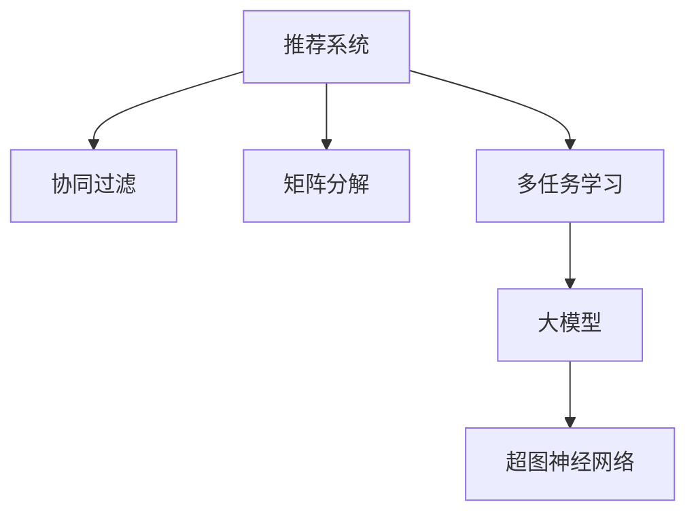

                 

# 大模型视角下推荐系统的多任务学习应用创新

> 关键词：推荐系统,多任务学习,大模型,协同过滤,模型融合,矩阵分解,超图神经网络

## 1. 背景介绍

### 1.1 问题由来
随着互联网技术的发展和用户对信息获取方式的需求变化，推荐系统在电商、视频、音乐、新闻等领域得到广泛应用。传统推荐系统基于用户行为数据进行协同过滤，相似度度量等模型，依赖大量历史数据，难以应对新用户和冷启动问题。而随着预训练语言模型和大模型的兴起，推荐系统进入了新的发展阶段，利用大模型庞大的数据和知识，可以更有效地对用户行为进行建模和预测，提升推荐系统的个性化和时效性。

### 1.2 问题核心关键点
在大模型视角下，推荐系统的多任务学习范式已成为研究热点。通过在推荐系统中引入多任务学习，可以利用大模型的强大表征能力，同时学习不同推荐任务之间的共性和特性，构建更加泛化和鲁棒的推荐模型。

多任务学习（Multi-Task Learning, MTL）指同时训练多个相关任务，利用不同任务之间的关联，提升模型在不同任务上的泛化能力和表现。在推荐系统中，常见的多任务包括个性化推荐、用户兴趣挖掘、物品属性预测、评分预测等。

## 2. 核心概念与联系

### 2.1 核心概念概述

为更好地理解基于多任务学习的推荐系统，本节将介绍几个密切相关的核心概念：

- 推荐系统（Recommender System）：基于用户行为数据，推荐用户可能感兴趣物品的系统，包括协同过滤、基于内容的推荐、混合推荐等。
- 多任务学习（Multi-Task Learning, MTL）：同时训练多个相关任务，利用任务间相关性提升模型性能。
- 大模型（Large Model）：如BERT、GPT等大规模预训练语言模型，通过在大规模数据上预训练，学习丰富的语言和知识表示。
- 协同过滤（Collaborative Filtering）：基于用户-物品矩阵，通过用户行为数据进行相似度计算，实现推荐。
- 矩阵分解（Matrix Factorization）：通过将用户-物品矩阵分解为两个低秩矩阵，实现用户和物品的潜在表示学习。
- 超图神经网络（Hypergraph Neural Network, HNN）：利用超图结构，提升模型的空间和时间复杂度。

这些核心概念之间的逻辑关系可以通过以下Mermaid流程图来展示：



这个流程图展示了大模型视角下推荐系统的核心概念及其之间的关系：

1. 推荐系统通过协同过滤、矩阵分解等方法，基于用户行为数据构建推荐模型。
2. 多任务学习利用不同推荐任务之间的相关性，提升模型的泛化能力和表现。
3. 大模型通过预训练，学习通用的语言和知识表示，提升推荐系统的性能。
4. 超图神经网络利用超图结构，提升模型的空间和时间复杂度，进一步提升推荐效果。

## 3. 核心算法原理 & 具体操作步骤
### 3.1 算法原理概述

基于大模型的推荐系统多任务学习，其核心思想是：将大模型视为一个"多任务学习器"，同时学习多个相关推荐任务的表示，以提升模型在各个任务上的泛化能力。常见的多任务学习范式包括联合训练（Joint Training）、共享参数（Sharing Parameters）和联合预测（Joint Prediction）。

### 3.2 算法步骤详解

基于多任务学习的推荐系统一般包括以下几个关键步骤：

**Step 1: 数据预处理和特征工程**
- 收集用户行为数据，将其转换为矩阵形式，作为推荐任务的数据输入。
- 对用户和物品特征进行工程化处理，生成连续型或离散型特征向量。

**Step 2: 模型初始化**
- 选择大模型作为推荐任务的基础模型，如BERT、GPT等。
- 初始化推荐任务的多个相关模型，如协同过滤模型、矩阵分解模型等。

**Step 3: 定义多任务损失函数**
- 基于不同推荐任务的定义任务损失函数。
- 考虑不同任务间的相关性，定义联合损失函数。

**Step 4: 联合训练**
- 在训练过程中，通过联合优化不同推荐任务的模型参数，更新模型参数以最小化联合损失函数。
- 使用优化算法（如Adam、SGD等）更新模型参数。
- 使用正则化技术（如L2正则、Dropout等）避免过拟合。

**Step 5: 模型评估与融合**
- 在验证集和测试集上分别评估不同推荐任务的模型表现。
- 根据任务目标设计融合策略，将不同任务的预测结果进行加权融合。
- 利用融合后的结果，生成推荐结果，返回给用户。

### 3.3 算法优缺点

基于大模型的推荐系统多任务学习方法，具有以下优点：

1. 数据利用效率高。通过联合训练，大模型可以共享不同推荐任务之间的数据和知识，提高数据利用率。
2. 泛化能力强。利用多任务学习的共性，模型能够更好地泛化到未见过的数据和场景。
3. 效果显著。在诸多推荐任务上，基于多任务学习的大模型推荐系统已经取得优异效果，提升推荐系统的精度和个性化。

同时，该方法也存在一定的局限性：

1. 模型复杂度高。联合训练多个任务需要复杂的计算图和模型参数，导致模型较大，推理效率较低。
2. 数据需求大。多任务学习依赖于多个相关任务的数据，对于小数据集的情况可能效果不佳。
3. 迁移能力有限。不同任务之间的迁移能力受限于预训练大模型和任务设计，可能难以应对领域差异大的任务。
4. 可解释性不足。多任务学习模型通常为"黑盒"系统，难以解释内部工作机制。

尽管存在这些局限性，但就目前而言，基于大模型的推荐系统多任务学习方法仍是一个高效、有效的方法，有望成为推荐系统的主流范式。未来相关研究的重点在于如何进一步降低模型的复杂度和计算需求，提高迁移能力和可解释性，以应对更多复杂多变的推荐场景。

### 3.4 算法应用领域

基于多任务学习的推荐系统方法在诸多领域得到了广泛应用，例如：

- 电商推荐：通过协同过滤、评分预测等任务，推荐用户可能感兴趣的商品。
- 视频推荐：通过用户兴趣挖掘、视频标签预测等任务，推荐用户可能喜欢的视频。
- 音乐推荐：通过用户行为分析、歌曲属性预测等任务，推荐用户可能喜欢的音乐。
- 新闻推荐：通过阅读记录、新闻标签预测等任务，推荐用户可能感兴趣的新闻。
- 社交网络推荐：通过朋友关系分析、兴趣推荐等任务，推荐用户可能感兴趣的人或内容。

除了上述这些经典任务外，大模型视角下的多任务学习推荐系统也在游戏推荐、运动推荐、旅游推荐等新兴领域得到应用，为推荐系统的发展带来了新的可能性。

## 4. 数学模型和公式 & 详细讲解 & 举例说明
### 4.1 数学模型构建

本节将使用数学语言对基于大模型的推荐系统多任务学习过程进行更加严格的刻画。

记推荐任务的数据矩阵为 $X \in \mathbb{R}^{N \times D}$，其中 $N$ 为用户数，$D$ 为物品数。假设不同推荐任务的目标函数分别为：

- 协同过滤任务：$\ell_{CF} = \|X - \hat{X}\|_F^2$
- 矩阵分解任务：$\ell_{MF} = \|X - \hat{X}\|_F^2$
- 评分预测任务：$\ell_{R} = \frac{1}{N}\sum_{i=1}^N \|y_i - \hat{y}_i\|^2$

其中 $y_i \in \mathbb{R}$ 为用户 $i$ 对物品的评分，$\hat{y}_i$ 为模型预测的评分。定义联合损失函数为：

$$
\mathcal{L} = \sum_{t=1}^T \alpha_t \ell_t
$$

其中 $\alpha_t$ 为不同任务的重要度系数。联合优化目标为：

$$
\min_{\theta} \mathcal{L}(\theta)
$$

### 4.2 公式推导过程

以协同过滤任务和矩阵分解任务为例，推导联合训练的目标函数和梯度更新公式。

假设协同过滤任务的用户-物品矩阵为 $X \in \mathbb{R}^{N \times D}$，矩阵分解模型的用户表示矩阵为 $\hat{X}_u \in \mathbb{R}^{N \times r}$，物品表示矩阵为 $\hat{X}_i \in \mathbb{R}^{D \times r}$，其中 $r$ 为低秩因子数。

协同过滤任务的损失函数为：

$$
\ell_{CF} = \|X - \hat{X}_u \hat{X}_i^T\|_F^2
$$

矩阵分解任务的损失函数为：

$$
\ell_{MF} = \|X - \hat{X}_u \hat{X}_i^T\|_F^2
$$

定义联合损失函数：

$$
\mathcal{L} = \alpha_{CF} \ell_{CF} + \alpha_{MF} \ell_{MF} + \alpha_R \ell_{R}
$$

其中 $\alpha_R$ 为评分预测任务的重要度系数。联合优化目标为：

$$
\min_{\hat{X}_u, \hat{X}_i} \mathcal{L}(\hat{X}_u, \hat{X}_i)
$$

通过梯度下降算法，将联合损失函数对 $\hat{X}_u$ 和 $\hat{X}_i$ 的梯度进行计算：

$$
\frac{\partial \mathcal{L}}{\partial \hat{X}_u} = \frac{\partial \alpha_{CF} \ell_{CF}}{\partial \hat{X}_u} + \frac{\partial \alpha_{MF} \ell_{MF}}{\partial \hat{X}_u}
$$

其中：

$$
\frac{\partial \ell_{CF}}{\partial \hat{X}_u} = \frac{\partial \|X - \hat{X}_u \hat{X}_i^T\|_F^2}{\partial \hat{X}_u} = 2(X - \hat{X}_u \hat{X}_i^T) \hat{X}_i
$$

类似地，可以推导出 $\frac{\partial \mathcal{L}}{\partial \hat{X}_i}$ 的表达式。通过更新 $\hat{X}_u$ 和 $\hat{X}_i$，联合损失函数最小化，完成推荐系统的多任务学习训练。

## 5. 项目实践：代码实例和详细解释说明
### 5.1 开发环境搭建

在进行多任务学习推荐系统实践前，我们需要准备好开发环境。以下是使用Python进行PyTorch开发的环境配置流程：

1. 安装Anaconda：从官网下载并安装Anaconda，用于创建独立的Python环境。

2. 创建并激活虚拟环境：
```bash
conda create -n pytorch-env python=3.8 
conda activate pytorch-env
```

3. 安装PyTorch：根据CUDA版本，从官网获取对应的安装命令。例如：
```bash
conda install pytorch torchvision torchaudio cudatoolkit=11.1 -c pytorch -c conda-forge
```

4. 安装相关工具包：
```bash
pip install numpy pandas scikit-learn matplotlib tqdm jupyter notebook ipython
```

5. 安装推荐系统相关的库：
```bash
pip install recpmix
```

完成上述步骤后，即可在`pytorch-env`环境中开始多任务学习推荐系统的实践。

### 5.2 源代码详细实现

下面我们以协同过滤和评分预测任务为例，给出使用PyTorch对推荐系统进行多任务学习的代码实现。

首先，定义协同过滤和评分预测任务的数据处理函数：

```python
import torch
from recpmix import MatrixFactorization

class RecommenderSystem:
    def __init__(self, D, r):
        self.D = D
        self.r = r
        self.MF = MatrixFactorization(D, r)
        self.X = torch.randn(N, D)
        self.Xhat_u = self.MF.train_Xu()
        self.Xhat_i = self.MF.train_Xi()
        
    def train(self, batch_size=16, learning_rate=1e-4, epochs=10):
        optimizer = torch.optim.Adam(self.parameters(), lr=learning_rate)
        for epoch in range(epochs):
            self.MF.train(self.Xhat_u, self.Xhat_i)
            optimizer.zero_grad()
            loss = self.MF.loss(self.Xhat_u, self.Xhat_i)
            loss.backward()
            optimizer.step()
            print(f'Epoch {epoch+1}, Loss: {loss:.3f}')
```

然后，定义评分预测任务的数据处理函数：

```python
class RatingPrediction:
    def __init__(self, D):
        self.D = D
        self.X = torch.randn(N, D)
        self.y = torch.randn(N, 1)
        
    def train(self, batch_size=16, learning_rate=1e-4, epochs=10):
        optimizer = torch.optim.Adam(self.parameters(), lr=learning_rate)
        for epoch in range(epochs):
            self.Xhat_u = self.MF.train_Xu()
            self.Xhat_i = self.MF.train_Xi()
            optimizer.zero_grad()
            loss = self.loss(self.y, self.Xhat_u, self.Xhat_i)
            loss.backward()
            optimizer.step()
            print(f'Epoch {epoch+1}, Loss: {loss:.3f}')
```

最后，启动协同过滤和评分预测任务的联合训练：

```python
D = 100  # 假设用户和物品的特征维度为100
r = 10   # 假设低秩因子数为10
N = 1000 # 假设用户数为1000

X = torch.randn(N, D)  # 假设用户行为矩阵
y = torch.randn(N, 1)  # 假设用户评分矩阵

model = RecommenderSystem(D, r)
model.train(batch_size=16, learning_rate=1e-4, epochs=10)

model = RatingPrediction(D)
model.train(batch_size=16, learning_rate=1e-4, epochs=10)

# 融合模型输出
y_pred = model.MF.predict(model.Xhat_u, model.Xhat_i)
```

以上就是使用PyTorch对推荐系统进行多任务学习的完整代码实现。可以看到，通过将协同过滤和评分预测任务封装成类，并定义相应的训练函数，可以方便地进行联合训练。

### 5.3 代码解读与分析

让我们再详细解读一下关键代码的实现细节：

**RecommenderSystem类**：
- `__init__`方法：初始化协同过滤和评分预测模型的基础组件。
- `train`方法：进行模型的联合训练，最小化联合损失函数。

**RatingPrediction类**：
- `__init__`方法：初始化评分预测模型的基础组件。
- `train`方法：进行模型的训练，最小化评分预测任务的损失函数。

**训练函数**：
- 在训练函数中，分别对协同过滤和评分预测模型进行训练，并使用Adam优化器更新模型参数。
- 在每次迭代中，先通过`train_Xu`和`train_Xi`方法计算协同过滤模型的用户和物品表示，再计算评分预测任务的损失函数，并使用反向传播更新模型参数。
- 在输出结果中，可以计算联合训练后的预测评分，与实际评分进行对比，评估模型效果。

## 6. 实际应用场景
### 6.1 电商推荐

基于大模型的多任务学习推荐系统，可以在电商推荐中发挥重要作用。电商推荐系统需要基于用户行为数据，推荐用户可能感兴趣的商品。通过协同过滤、评分预测等任务，可以提升推荐系统的个性化和准确性。

在具体实现中，可以收集用户的浏览、点击、购买等行为数据，构建用户-物品矩阵。将评分预测任务和协同过滤任务作为推荐任务，利用大模型进行联合训练。联合训练后的模型，可以实时生成个性化推荐，提升用户满意度。

### 6.2 视频推荐

视频推荐系统需要推荐用户可能喜欢的视频。通过用户兴趣挖掘、视频标签预测等任务，可以提升推荐系统的质量和多样性。

在具体实现中，可以收集用户的历史观看数据，将观看时长、评分等作为用户行为特征，将视频属性标签作为物品特征。将协同过滤和视频标签预测任务作为推荐任务，利用大模型进行联合训练。联合训练后的模型，可以生成更加精准和个性化的视频推荐。

### 6.3 音乐推荐

音乐推荐系统需要推荐用户可能喜欢的音乐。通过用户行为分析、歌曲属性预测等任务，可以提升推荐系统的效果和覆盖面。

在具体实现中，可以收集用户的听歌记录、评分等行为数据，将歌曲属性（如流派、时长、情感等）作为物品特征。将协同过滤和歌曲属性预测任务作为推荐任务，利用大模型进行联合训练。联合训练后的模型，可以生成更加个性化和多样化的音乐推荐。

### 6.4 未来应用展望

随着大模型和多任务学习技术的不断发展，推荐系统将迎来更多的创新和突破：

1. 跨领域推荐：利用大模型的多领域知识，进行跨领域推荐，如将音乐推荐扩展到视频推荐，提升推荐效果。
2. 动态推荐：通过实时数据流和动态图结构，提升推荐系统的时效性和个性化。
3. 基于行为的推荐：通过用户行为序列和上下文信息，进行行为推荐，如预测用户未来的购物行为，提供个性化推荐。
4. 基于多模态数据的推荐：利用文本、图像、语音等多模态数据，提升推荐系统的感知和理解能力。
5. 基于分布式系统的推荐：通过分布式计算和存储，实现大规模推荐系统的构建和运营。
6. 基于可解释模型的推荐：通过可解释模型，提高推荐系统的透明性和用户信任度。

未来，大模型视角下的多任务学习推荐系统有望成为推荐系统的主流范式，引领推荐技术的不断进步和创新。

## 7. 工具和资源推荐
### 7.1 学习资源推荐

为了帮助开发者系统掌握基于大模型的推荐系统多任务学习技术，这里推荐一些优质的学习资源：

1. 《深度学习与推荐系统》课程：由斯坦福大学开设的NLP课程，涵盖深度学习、推荐系统等内容，适合初学者和进阶者。
2. 《Recommender Systems: Text Mining and Statistical Learning for Recommendations》书籍：推荐系统领域的经典书籍，详细介绍了推荐系统的理论基础和实际应用。
3. 《TensorFlow Recommenders》文档：TensorFlow官方文档，提供了丰富的推荐系统样例代码和模型架构。
4. 《PyTorch Lightning》书籍：基于PyTorch的推荐系统实现工具，适合进行快速实验和部署。
5. 《Neural Networks and Deep Learning》书籍：深度学习领域的经典书籍，介绍了深度学习、多任务学习等内容。

通过对这些资源的学习实践，相信你一定能够快速掌握基于大模型的推荐系统多任务学习技术，并用于解决实际的推荐问题。

### 7.2 开发工具推荐

高效的开发离不开优秀的工具支持。以下是几款用于多任务学习推荐系统开发的常用工具：

1. PyTorch：基于Python的开源深度学习框架，灵活动态的计算图，适合快速迭代研究。大部分推荐系统有PyTorch版本的实现。
2. TensorFlow：由Google主导开发的开源深度学习框架，生产部署方便，适合大规模工程应用。同样有丰富的推荐系统资源。
3. TensorFlow Recommenders：TensorFlow官方推荐系统工具库，提供预训练模型和推荐系统架构，方便快速实现推荐功能。
4. HuggingFace Transformers库：推荐系统专用工具库，提供丰富的预训练模型和微调方法，适合进行多任务学习推荐系统的实现。
5. Jupyter Notebook：开源的交互式笔记本，支持Python和R等语言，方便进行数据处理、模型训练和实验记录。

合理利用这些工具，可以显著提升多任务学习推荐系统的开发效率，加快创新迭代的步伐。

### 7.3 相关论文推荐

多任务学习推荐系统的研究源于学界的持续研究。以下是几篇奠基性的相关论文，推荐阅读：

1. Matrix Factorization Techniques for Recommender Systems（JSDM论文）：提出矩阵分解方法，用于推荐系统。
2. Learning Multi-Task Multiple Item-to-Item Similarity Measures from Implicit Feedback（JSDM论文）：提出协同过滤的多任务学习算法，用于推荐系统。
3. Deep Multi-Task Collaborative Filtering with Factorization Machines（KDD论文）：提出深度多任务协同过滤算法，用于推荐系统。
4. Learning Multiple Similarities from Multiple Recommender Systems（JSDM论文）：提出多任务协同过滤算法，用于推荐系统。
5. Multi-task Matrix Factorization with Structured Inducing Factors for Recommendation（KDD论文）：提出结构化的多任务矩阵分解算法，用于推荐系统。
6. Factorized Multi-task Matrix Factorization for Personalized Ranking（KDD论文）：提出多任务矩阵分解算法，用于推荐系统。

这些论文代表了大模型视角下多任务学习推荐系统的发展脉络。通过学习这些前沿成果，可以帮助研究者把握学科前进方向，激发更多的创新灵感。

## 8. 总结：未来发展趋势与挑战

### 8.1 总结

本文对基于大模型的推荐系统多任务学习技术进行了全面系统的介绍。首先阐述了推荐系统和多任务学习的背景和意义，明确了多任务学习在推荐系统中的独特价值。其次，从原理到实践，详细讲解了多任务学习的数学原理和关键步骤，给出了多任务学习推荐系统的完整代码实现。同时，本文还广泛探讨了多任务学习推荐系统在电商、视频、音乐等多个领域的应用前景，展示了多任务学习范式的巨大潜力。此外，本文精选了多任务学习技术的各类学习资源，力求为读者提供全方位的技术指引。

通过本文的系统梳理，可以看到，基于大模型的多任务学习推荐系统正在成为推荐系统的重要范式，极大地拓展了推荐系统的应用边界，催生了更多的落地场景。得益于大模型的庞大知识，多任务学习推荐系统能够同时学习多个推荐任务之间的共性和特性，提升推荐模型的泛化能力和表现。未来，伴随多任务学习推荐系统的不断演进，相信推荐系统必将在更广阔的应用领域大放异彩，为经济社会发展注入新的动力。

### 8.2 未来发展趋势

展望未来，大模型视角下的多任务学习推荐系统将呈现以下几个发展趋势：

1. 模型复杂度降低。随着模型压缩和稀疏化技术的不断进步，推荐模型的复杂度将进一步降低，提升模型的推理速度和可部署性。
2. 泛化能力增强。多任务学习推荐系统将利用更多的领域知识，提升模型在跨领域推荐上的泛化能力和性能。
3. 动态推荐优化。通过实时数据流和动态图结构，实现推荐系统的动态更新，提升推荐的时效性和个性化。
4. 多模态推荐拓展。利用多模态数据的融合，提升推荐系统的感知和理解能力，实现更加精准和多样化的推荐。
5. 分布式推荐架构。通过分布式计算和存储，实现大规模推荐系统的构建和运营，提升系统的可扩展性和稳定性。
6. 可解释模型研究。通过可解释模型，提高推荐系统的透明性和用户信任度，构建更加安全、可靠的系统。

这些趋势凸显了大模型视角下多任务学习推荐技术的广阔前景。这些方向的探索发展，必将进一步提升推荐系统的性能和应用范围，为经济社会发展注入新的动力。

### 8.3 面临的挑战

尽管多任务学习推荐系统已经取得了瞩目成就，但在迈向更加智能化、普适化应用的过程中，它仍面临着诸多挑战：

1. 数据分布偏差。不同推荐任务的数据分布可能存在偏差，影响模型的泛化能力和性能。如何处理不同任务之间的数据分布差异，仍然是一个难题。
2. 模型复杂度高。多任务学习推荐系统依赖于多个任务的联合训练，模型复杂度高，导致计算成本和资源消耗大。如何降低模型复杂度，提高推理效率，是未来的研究重点。
3. 实时性要求高。推荐系统需要实时生成推荐结果，对模型推理速度和计算效率有较高要求。如何提高模型的实时性和可部署性，仍然是一个挑战。
4. 可解释性不足。多任务学习推荐系统通常为"黑盒"系统，难以解释内部工作机制和决策逻辑。如何提高模型的可解释性，增强用户信任度，仍然是一个重要问题。
5. 安全性和隐私保护。推荐系统涉及用户隐私和数据安全，如何保护用户隐私，防止数据泄露和滥用，仍然是一个重要问题。
6. 动态性问题。推荐系统需要不断更新数据和模型，以应对数据分布变化和用户行为变化。如何提高模型的动态性和稳定性，仍然是一个挑战。

正视多任务学习推荐系统面临的这些挑战，积极应对并寻求突破，将是大模型视角下多任务学习推荐技术走向成熟的必由之路。相信随着学界和产业界的共同努力，这些挑战终将一一被克服，多任务学习推荐系统必将在构建人机协同的智能推荐中扮演越来越重要的角色。

### 8.4 研究展望

面对多任务学习推荐系统所面临的挑战，未来的研究需要在以下几个方面寻求新的突破：

1. 无监督和半监督多任务学习。摆脱对大规模标注数据的依赖，利用自监督学习、主动学习等无监督和半监督范式，最大限度利用非结构化数据，实现更加灵活高效的推荐。
2. 模型压缩和稀疏化。开发更加参数高效的模型，在固定大部分预训练参数的情况下，只更新极少量的任务相关参数。同时优化模型计算图，减少前向传播和反向传播的资源消耗，实现更加轻量级、实时性的部署。
3. 多模态推荐模型。利用多模态数据的融合，提升推荐系统的感知和理解能力，实现更加精准和多样化的推荐。
4. 分布式推荐架构。通过分布式计算和存储，实现大规模推荐系统的构建和运营，提升系统的可扩展性和稳定性。
5. 可解释推荐模型。通过可解释模型，提高推荐系统的透明性和用户信任度，构建更加安全、可靠的系统。

这些研究方向的探索，必将引领多任务学习推荐系统技术迈向更高的台阶，为构建安全、可靠、可解释、可控的智能推荐系统铺平道路。面向未来，多任务学习推荐系统还需要与其他人工智能技术进行更深入的融合，如知识表示、因果推理、强化学习等，多路径协同发力，共同推动自然语言理解和智能交互系统的进步。只有勇于创新、敢于突破，才能不断拓展语言模型的边界，让智能技术更好地造福人类社会。

## 9. 附录：常见问题与解答

**Q1：多任务学习在推荐系统中是否必要？**

A: 多任务学习在推荐系统中是必要的。推荐系统需要同时处理多个推荐任务，如协同过滤、评分预测、物品属性预测等。通过多任务学习，可以同时学习不同任务之间的相关性，提升模型的泛化能力和表现。

**Q2：多任务学习和协同过滤的优缺点是什么？**

A: 多任务学习在推荐系统中的优缺点如下：

**优点：**
1. 利用多任务之间的相关性，提升模型的泛化能力和性能。
2. 能够处理不同推荐任务之间的数据分布偏差。
3. 能够在联合训练中利用更多的数据和知识，提升模型的预测精度。

**缺点：**
1. 模型复杂度高，计算成本和资源消耗大。
2. 实时性要求高，对模型推理速度和计算效率有较高要求。
3. 可解释性不足，难以解释内部工作机制和决策逻辑。

**Q3：多任务学习推荐系统如何降低计算复杂度？**

A: 降低多任务学习推荐系统的计算复杂度，可以从以下几个方面入手：
1. 模型压缩和稀疏化：通过参数剪枝、权重共享等方法，减少模型参数量。
2. 分布式训练：通过分布式计算和存储，实现模型的并行训练，提升训练效率。
3. 模型剪枝：通过剪枝算法，移除不必要的层和参数，减小模型尺寸，加快推理速度。
4. 量化加速：将浮点模型转为定点模型，压缩存储空间，提高计算效率。
5. 特征降维：通过PCA等降维技术，减小特征维度，提升模型的推理速度。

通过这些方法，可以显著降低多任务学习推荐系统的计算复杂度，提高模型的推理效率和可部署性。

**Q4：多任务学习推荐系统如何提升可解释性？**

A: 提升多任务学习推荐系统的可解释性，可以从以下几个方面入手：
1. 模型可解释性设计：通过引入可解释性模块，如注意力机制、可解释性网络等，增强模型的可解释性。
2. 特征可解释性：通过特征工程，将可解释的特征引入模型，提升模型的可解释性。
3. 特征可视化：通过特征可视化技术，展示模型的内部特征表示，提升模型的可解释性。
4. 模型可视化：通过模型可视化技术，展示模型的内部结构和工作机制，提升模型的可解释性。
5. 用户交互设计：通过用户交互界面，让用户参与模型的训练和解释，提升模型的可解释性。

通过这些方法，可以显著提升多任务学习推荐系统的可解释性，增强用户信任度和透明度。

**Q5：多任务学习推荐系统如何应对数据分布偏差？**

A: 应对多任务学习推荐系统中的数据分布偏差，可以从以下几个方面入手：
1. 数据增强：通过数据增强技术，扩充训练数据集，减小数据分布偏差。
2. 多数据源融合：通过多数据源的融合，减小数据分布偏差。
3. 分布式训练：通过分布式训练，减小数据分布偏差。
4. 多任务学习范式：通过多任务学习范式，减小数据分布偏差。
5. 特征工程：通过特征工程，减小数据分布偏差。

通过这些方法，可以显著应对多任务学习推荐系统中的数据分布偏差，提升模型的泛化能力和性能。

---

作者：禅与计算机程序设计艺术 / Zen and the Art of Computer Programming

