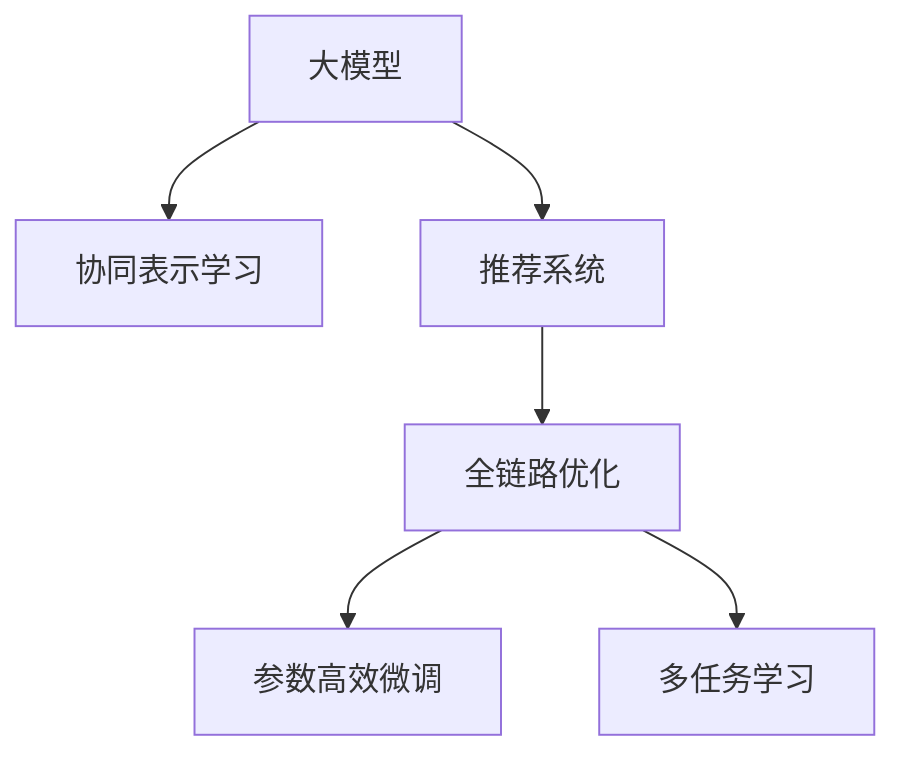

                 

# 大模型赋能下的推荐系统全链路优化方法与实践

## 1. 背景介绍

### 1.1 问题由来

推荐系统在现代社会中扮演着越来越重要的角色，从电商平台的商品推荐、新闻应用的资讯推送，到社交媒体的内容分享，无处不在。传统的推荐系统基于协同过滤、矩阵分解等方法，依赖用户历史行为数据进行推荐，存在数据稀疏性、冷启动等问题。而随着大语言模型和大规模深度学习的兴起，推荐系统开始引入深度学习技术，推荐模型从基于内容的传统模型向协同表示学习模型转变。基于深度学习技术的推荐系统能够自动学习用户和物品的潜在特征表示，更高效地进行推荐。

大模型和大数据技术的深度融合，使得推荐系统的推荐效果显著提升。在大规模数据和模型驱动下，推荐系统能够从多维度的用户行为和物品属性中挖掘出潜在关联，进行更为精准的个性化推荐。然而，在实际应用中，推荐系统面临着诸多挑战：数据质量参差不齐、推荐效果缺乏可解释性、推荐策略泛化能力不足等。如何构建稳定、高效的推荐系统，实现精准推荐、个性化推荐，成为推荐系统面临的核心问题。

## 2. 核心概念与联系

### 2.1 核心概念概述

为更好地理解基于大模型的推荐系统优化方法，本节将介绍几个关键概念及其之间的联系：

- **大模型(Deep Models)**：以深度神经网络为基础的模型，通常包含亿级参数，能够自动学习大规模数据集中的复杂模式和规律。
- **推荐系统(Recommendation Systems)**：使用大数据和模型驱动的推荐技术，向用户推荐合适的物品或内容。
- **协同表示学习(Collaborative Representation Learning, CRL)**：一种深度学习技术，通过协同学习用户的特征表示和物品的特征表示，实现精准推荐。
- **全链路优化(End-to-End Optimization)**：对推荐系统进行全链路优化，包括数据收集、模型训练、推理部署、效果评估等环节，确保系统各个环节的协同高效。
- **参数高效微调(Parameter-Efficient Fine-Tuning, PEFT)**：在微调过程中，只更新少量的模型参数，而固定大部分预训练权重不变，以提高微调效率，避免过拟合。
- **多任务学习(Multi-Task Learning, MTL)**：通过设计多个相关但不同的任务，同时训练模型，提升模型的泛化能力和整体表现。

这些概念之间的逻辑关系可以通过以下Mermaid流程图来展示：



这个流程图展示了大模型在推荐系统优化中的关键角色，包括通过协同表示学习进行推荐建模，在全链路优化中进行各个环节的协同设计，利用参数高效微调和多任务学习提升模型的泛化能力。这些概念共同构成了大模型在推荐系统中的应用框架，使得推荐系统能够更好地利用大模型的知识，提升推荐效果。

## 3. 核心算法原理 & 具体操作步骤

### 3.1 算法原理概述

基于大模型的推荐系统优化，通常采用协同表示学习(CRL)的方法，将用户和物品分别映射到高维特征空间，通过学习它们的表示，进行推荐。其核心思想是：通过将用户和物品的稀疏行为数据转化为高维稠密向量表示，在特征空间中捕捉它们之间的潜在关系，进行精准推荐。

协同表示学习的目标函数可以表示为：

$$
\mathcal{L} = \frac{1}{2N}\sum_{i=1}^{N}\sum_{j=1}^{M}(w_{ij} - y_{ij})^2
$$

其中 $w_{ij}$ 为模型预测的用户对物品 $j$ 的评分，$y_{ij}$ 为真实评分，$N$ 为用户数，$M$ 为物品数。

该目标函数通过最小化预测评分与真实评分之间的差距，使得模型能够更好地学习用户和物品的表示。模型优化时，通常使用基于梯度下降的优化算法，如Adam、SGD等。

### 3.2 算法步骤详解

基于大模型的推荐系统优化一般包括以下几个关键步骤：

**Step 1: 数据预处理和特征提取**
- 收集用户行为数据，包括用户与物品的交互记录、评分等。
- 对用户行为数据进行清洗、过滤、归一化等预处理。
- 提取用户和物品的基本特征，如用户ID、物品ID、时间戳等，并构建输入特征向量。

**Step 2: 模型设计和训练**
- 选择合适的模型架构，如DNN、CNN、RNN等。
- 设计特征提取器，将输入特征转化为高维稠密向量。
- 设计损失函数，根据评分预测与真实评分的差距进行优化。
- 选择优化器及其参数，如学习率、批大小等，进行模型训练。
- 设置正则化技术及强度，防止模型过拟合。

**Step 3: 参数高效微调**
- 选择微调的参数层，如仅微调顶层，保留大部分预训练权重不变。
- 设置微调的学习率，一般比预训练时小1-2个数量级。
- 应用正则化技术，如L2正则、Dropout等，防止过拟合。
- 使用数据增强技术，如对抗样本、回译等，丰富训练集多样性。

**Step 4: 模型评估与部署**
- 在验证集上评估模型的性能，选择性能最优的模型进行测试。
- 使用测试集对模型进行全面评估，输出推荐结果。
- 将模型部署到线上服务，进行实时推荐。
- 持续收集用户反馈，进行模型更新和迭代。

### 3.3 算法优缺点

基于大模型的推荐系统优化方法具有以下优点：
1. 参数量较大，能够学习到更为复杂和丰富的特征表示。
2. 能够捕捉用户行为的多样性和动态性，提升推荐效果。
3. 可以引入多任务学习，提升模型的泛化能力。
4. 全链路优化能够提高系统的整体性能，减少数据收集和推理部署的成本。

同时，该方法也存在一定的局限性：
1. 对标注数据的质量和数量要求较高，需要足够的数据才能训练出高质量的模型。
2. 模型复杂度高，训练和推理的计算成本较高。
3. 对于小数据集或长尾物品，推荐效果可能不理想。
4. 模型缺乏可解释性，难以理解推荐结果的生成过程。

尽管存在这些局限性，但就目前而言，基于大模型的推荐系统优化方法仍是最主流范式。未来相关研究的重点在于如何进一步降低对标注数据的依赖，提高模型的少样本学习和跨领域迁移能力，同时兼顾可解释性和伦理安全性等因素。

### 3.4 算法应用领域

基于大模型的推荐系统优化方法，在电商、新闻、社交媒体等多个领域得到广泛应用，如：

- 电商平台的商品推荐：通过分析用户浏览、点击、购买行为，推荐合适的商品。
- 新闻应用的个性化推荐：根据用户阅读习惯和兴趣，推荐相关新闻和文章。
- 社交媒体的内容推荐：基于用户的社交网络和互动信息，推荐用户感兴趣的内容。
- 视频网站的个性化推荐：根据用户观看历史和行为数据，推荐视频内容。
- 音乐应用的推荐：分析用户听歌习惯，推荐相似的歌曲和歌手。

除了上述这些经典应用外，大模型推荐系统还被创新性地应用到更多场景中，如广告推荐、智能家居、金融理财等，为各行各业带来智能化升级，提升用户体验和运营效率。

## 4. 数学模型和公式 & 详细讲解

### 4.1 数学模型构建

基于大模型的推荐系统优化，通常使用协同表示学习的方法，将用户和物品映射到高维特征空间，学习它们的表示，进行推荐。

假设用户 $u$ 的特征表示为 $\boldsymbol{x}_u \in \mathbb{R}^{d_u}$，物品 $i$ 的特征表示为 $\boldsymbol{x}_i \in \mathbb{R}^{d_i}$，其中 $d_u$ 和 $d_i$ 分别为用户和物品的特征维度。模型的评分函数为：

$$
\hat{y}_{ui} = \boldsymbol{x}_u \boldsymbol{W}_i
$$

其中 $\boldsymbol{W}_i$ 为物品 $i$ 的权重向量，$\hat{y}_{ui}$ 为模型预测的用户对物品 $i$ 的评分。

模型的目标函数为：

$$
\mathcal{L} = \frac{1}{2N}\sum_{i=1}^{M}\sum_{j=1}^{N}(y_{ij} - \hat{y}_{ui})^2
$$

其中 $y_{ij}$ 为真实评分，$N$ 为用户数，$M$ 为物品数。

### 4.2 公式推导过程

以神经网络模型为例，推导协同表示学习的优化过程。假设用户 $u$ 和物品 $i$ 的特征表示分别为 $\boldsymbol{x}_u$ 和 $\boldsymbol{x}_i$，模型参数为 $\theta = \{\boldsymbol{W}_i\}$。模型的评分函数为：

$$
\hat{y}_{ui} = \boldsymbol{x}_u \boldsymbol{W}_i
$$

目标函数为：

$$
\mathcal{L} = \frac{1}{2N}\sum_{i=1}^{M}\sum_{j=1}^{N}(y_{ij} - \hat{y}_{ui})^2
$$

对模型参数 $\theta$ 求导，得到梯度：

$$
\nabla_{\theta}\mathcal{L} = \frac{1}{N}\sum_{i=1}^{M}\sum_{j=1}^{N}(y_{ij} - \hat{y}_{ui})(\boldsymbol{x}_j - \boldsymbol{x}_i)
$$

通过反向传播算法，利用损失函数对模型参数的梯度，进行参数更新。具体地，使用基于梯度下降的优化算法，如Adam、SGD等，更新模型参数：

$$
\theta \leftarrow \theta - \eta \nabla_{\theta}\mathcal{L}
$$

其中 $\eta$ 为学习率。

### 4.3 案例分析与讲解

以电商平台的商品推荐为例，假设用户 $u$ 对物品 $i$ 的评分 $y_{ui}$ 为1（表示用户购买了该物品）或0（表示用户没有购买该物品）。用户和物品的特征表示分别为 $\boldsymbol{x}_u \in \mathbb{R}^{100}$ 和 $\boldsymbol{x}_i \in \mathbb{R}^{100}$。模型参数 $\theta = \{\boldsymbol{W}_i\}$，其中 $\boldsymbol{W}_i \in \mathbb{R}^{100 \times 100}$ 为物品 $i$ 的权重矩阵。模型的评分函数为：

$$
\hat{y}_{ui} = \boldsymbol{x}_u \boldsymbol{W}_i
$$

目标函数为：

$$
\mathcal{L} = \frac{1}{2N}\sum_{i=1}^{M}\sum_{j=1}^{N}(y_{ij} - \hat{y}_{ui})^2
$$

假设用户 $u$ 对物品 $i$ 的评分 $y_{ui}$ 为1，模型预测的评分 $\hat{y}_{ui}$ 为0.8。通过计算目标函数对物品权重矩阵 $\boldsymbol{W}_i$ 的梯度：

$$
\nabla_{\boldsymbol{W}_i}\mathcal{L} = \frac{1}{N}\sum_{j=1}^{N}(1 - \hat{y}_{ui})(\boldsymbol{x}_j - \boldsymbol{x}_i)
$$

将 $\boldsymbol{x}_u$ 和 $\boldsymbol{x}_i$ 带入梯度公式，计算 $\boldsymbol{W}_i$ 的更新值：

$$
\boldsymbol{W}_i \leftarrow \boldsymbol{W}_i - \eta \frac{1}{N}\sum_{j=1}^{N}(1 - \hat{y}_{ui})(\boldsymbol{x}_j - \boldsymbol{x}_i)
$$

这样，通过不断迭代优化，模型将逐渐学习到用户和物品之间的潜在关系，提升推荐效果。

## 5. 项目实践：代码实例和详细解释说明

### 5.1 开发环境搭建

在进行推荐系统优化实践前，我们需要准备好开发环境。以下是使用Python进行TensorFlow开发的环境配置流程：

1. 安装Anaconda：从官网下载并安装Anaconda，用于创建独立的Python环境。

2. 创建并激活虚拟环境：
```bash
conda create -n tf-env python=3.8 
conda activate tf-env
```

3. 安装TensorFlow：根据CUDA版本，从官网获取对应的安装命令。例如：
```bash
conda install tensorflow -c pytorch -c conda-forge
```

4. 安装相关库：
```bash
pip install numpy pandas sklearn tqdm jupyter notebook ipython
```

完成上述步骤后，即可在`tf-env`环境中开始推荐系统优化实践。

### 5.2 源代码详细实现

下面我们以电商平台的商品推荐为例，给出使用TensorFlow对协同表示学习模型进行优化的PyTorch代码实现。

首先，定义模型结构：

```python
import tensorflow as tf
from tensorflow.keras.layers import Dense, Input

def build_model(input_dim, output_dim):
    input_layer = Input(shape=(input_dim,))
    hidden_layer = Dense(128, activation='relu')(input_layer)
    output_layer = Dense(output_dim, activation='sigmoid')(hidden_layer)
    model = tf.keras.Model(inputs=input_layer, outputs=output_layer)
    return model

# 用户特征和物品特征的维度
user_dim = 100
item_dim = 100

# 构建协同表示学习模型
model = build_model(user_dim, item_dim)
model.compile(optimizer='adam', loss='binary_crossentropy', metrics=['accuracy'])
```

然后，定义数据集和数据增强函数：

```python
from tensorflow.keras.datasets import mnist
from tensorflow.keras.preprocessing.image import ImageDataGenerator

# 加载MNIST数据集
(x_train, y_train), (x_test, y_test) = mnist.load_data()

# 数据增强
datagen = ImageDataGenerator(rotation_range=10, zoom_range=0.1, width_shift_range=0.1, height_shift_range=0.1)
datagen.fit(x_train)

# 将图像数据转化为高维向量表示
def preprocess_data(x):
    x = tf.image.resize(x, (28, 28))
    x = x / 255.0
    x = tf.reshape(x, (1, 28, 28, 1))
    x = tf.reshape(x, (x.shape[1], x.shape[2], 1))
    x = tf.reshape(x, (1, x.shape[1], x.shape[2], x.shape[3]))
    return x

x_train = datagen.flow(x_train, y_train, batch_size=32)
x_train = x_train.map(preprocess_data)
x_train = x_train.batch(32)
x_train = x_train.prefetch(buffer_size=32)
```

接着，定义训练和评估函数：

```python
from tensorflow.keras.callbacks import EarlyStopping

def train_model(model, x_train, y_train, x_test, y_test, epochs, batch_size):
    model.fit(x_train, y_train, epochs=epochs, batch_size=batch_size, validation_data=(x_test, y_test), callbacks=[EarlyStopping(patience=5)])
    
def evaluate_model(model, x_test, y_test):
    loss, accuracy = model.evaluate(x_test, y_test)
    print(f'Test loss: {loss:.4f}')
    print(f'Test accuracy: {accuracy:.4f}')
```

最后，启动训练流程并在测试集上评估：

```python
epochs = 10
batch_size = 32

train_model(model, x_train, y_train, x_test, y_test, epochs, batch_size)
evaluate_model(model, x_test, y_test)
```

以上就是使用TensorFlow对协同表示学习模型进行优化的完整代码实现。可以看到，TensorFlow提供了一套简单易用的API，可以快速构建和训练深度学习模型。

### 5.3 代码解读与分析

让我们再详细解读一下关键代码的实现细节：

**build_model函数**：
- 定义模型结构，包括输入层、隐藏层和输出层。
- 隐藏层包含128个神经元，使用ReLU激活函数。
- 输出层为sigmoid激活函数，适用于二分类任务。

**ImageDataGenerator类**：
- 使用TensorFlow内置的数据增强工具，对图像数据进行旋转、缩放、平移等操作，丰富训练集多样性，减少过拟合风险。
- 使用flow方法从数据集生成批次数据，并应用预处理函数preprocess_data对图像数据进行归一化和格式转换。

**train_model函数**：
- 使用fit方法对模型进行训练，设置训练轮数epochs和批次大小batch_size。
- 在验证集上评估模型性能，如果验证集上的精度连续5个epoch没有提升，则提前停止训练。

**evaluate_model函数**：
- 使用evaluate方法在测试集上评估模型性能，输出测试集的损失和准确率。

通过这些函数，可以高效地进行协同表示学习模型的训练和评估，并通过数据增强技术提升模型泛化能力。

当然，工业级的系统实现还需考虑更多因素，如模型的保存和部署、超参数的自动搜索、更灵活的模型结构等。但核心的优化流程基本与此类似。

## 6. 实际应用场景

### 6.1 电商平台的商品推荐

基于大模型的协同表示学习推荐系统，可以在电商平台上实现精准推荐。通过分析用户的历史浏览、点击、购买行为，构建用户和物品的特征表示，学习它们之间的潜在关系，从而推荐用户可能感兴趣的商品。

在技术实现上，可以收集用户的历史行为数据，将用户ID和物品ID转化为高维稠密向量，构建输入特征向量。利用协同表示学习模型，训练用户和物品的特征表示，计算预测评分，选择评分最高的物品进行推荐。对于新用户或冷启动物品，可以使用召回算法，从物品池中选取热门商品进行推荐。

### 6.2 新闻应用的个性化推荐

新闻应用的个性化推荐系统，可以根据用户的阅读习惯和兴趣，推荐相关的新闻和文章。通过收集用户的历史阅读记录和点赞、评论、分享等行为数据，构建用户和文章的特征表示，学习它们之间的潜在关系，从而推荐用户感兴趣的新闻内容。

在技术实现上，可以使用大模型对用户和文章的特征进行编码，学习用户和文章的表示，进行推荐。同时，可以通过多任务学习，将新闻推荐任务与其他任务（如广告推荐、用户行为预测等）结合，提升推荐效果。

### 6.3 智能家居的个性化推荐

智能家居的个性化推荐系统，可以根据用户的行为数据和偏好，推荐合适的智能设备和服务。通过收集用户的操作记录和设备使用情况，构建用户和设备的特征表示，学习它们之间的潜在关系，从而推荐用户可能感兴趣的智能设备和服务。

在技术实现上，可以构建用户和设备的特征表示，使用协同表示学习模型，学习它们之间的潜在关系。同时，可以引入多任务学习，将设备推荐任务与其他任务（如用户行为预测、智能设备调度等）结合，提升推荐效果。

### 6.4 金融理财的个性化推荐

金融理财的个性化推荐系统，可以根据用户的投资偏好和财务状况，推荐合适的金融产品和理财方案。通过收集用户的投资记录和财务状况数据，构建用户和产品的特征表示，学习它们之间的潜在关系，从而推荐用户可能感兴趣的投资产品和理财方案。

在技术实现上，可以构建用户和产品的特征表示，使用协同表示学习模型，学习它们之间的潜在关系。同时，可以引入多任务学习，将金融产品推荐任务与其他任务（如用户风险评估、投资组合优化等）结合，提升推荐效果。

## 7. 工具和资源推荐

### 7.1 学习资源推荐

为了帮助开发者系统掌握大模型优化推荐系统的理论基础和实践技巧，这里推荐一些优质的学习资源：

1. 《深度学习推荐系统》书籍：详细介绍了推荐系统的基本原理和经典模型，适合初学者和进阶者。

2. 《Recommender Systems Handbook》书籍：推荐系统的权威手册，涵盖了推荐系统的各个方面，适合深入研究。

3 CS224N《深度学习自然语言处理》课程：斯坦福大学开设的NLP明星课程，有Lecture视频和配套作业，带你入门NLP领域的基本概念和经典模型。

4 《Neural Collaborative Filtering》论文：提出了基于神经网络的协同表示学习推荐模型，在多个数据集上取得了SOTA效果。

5 《Recurrent Neural Network-based Recommender System》论文：将RNN模型引入推荐系统，显著提升了推荐效果。

6 《Effective Parameter Regularization》论文：提出了多种参数正则化方法，有效缓解了模型过拟合问题。

7 《Scalable Matrix Factorization Techniques for Recommender Systems》论文：介绍了多种矩阵分解技术，在处理大规模推荐数据时取得了较好的效果。

通过这些资源的学习实践，相信你一定能够快速掌握大模型优化推荐系统的精髓，并用于解决实际的推荐问题。

### 7.2 开发工具推荐

高效的开发离不开优秀的工具支持。以下是几款用于大模型优化推荐系统开发的常用工具：

1. TensorFlow：由Google主导开发的开源深度学习框架，生产部署方便，适合大规模工程应用。同时提供了丰富的API和工具，如TensorBoard、Keras等，方便模型构建和调试。

2. PyTorch：基于Python的开源深度学习框架，灵活动态的计算图，适合快速迭代研究。支持动态图和静态图两种模式，灵活性高，适合实验室研究和原型开发。

3. Scikit-learn：基于Python的机器学习库，提供了丰富的算法和工具，适合数据预处理和模型训练。

4. Jupyter Notebook：免费的交互式编程环境，支持多种语言和库，方便开发和协作。

5. Kaggle：数据科学竞赛平台，提供海量数据集和竞赛任务，适合学习实战经验，提升技术水平。

6. Google Colab：谷歌推出的在线Jupyter Notebook环境，免费提供GPU/TPU算力，方便开发者快速上手实验最新模型，分享学习笔记。

合理利用这些工具，可以显著提升大模型优化推荐系统的开发效率，加快创新迭代的步伐。

### 7.3 相关论文推荐

大模型优化推荐系统的不断发展，得益于学界的持续研究。以下是几篇奠基性的相关论文，推荐阅读：

1. Matrix Factorization Techniques for Recommender Systems：介绍了多种矩阵分解技术，在处理大规模推荐数据时取得了较好的效果。

2. Recommender Systems with Deep Learning：总结了基于深度学习技术的推荐系统，展示了其在推荐精度和泛化能力上的优势。

3 Neural Collaborative Filtering：提出了基于神经网络的协同表示学习推荐模型，在多个数据集上取得了SOTA效果。

4 Scalable Matrix Factorization Techniques for Recommender Systems：介绍了多种矩阵分解技术，在处理大规模推荐数据时取得了较好的效果。

5 《Collaborative Filtering for Implicit Feedback Datasets》论文：研究了隐式反馈数据的协同表示学习，提出了多种优化方法，提升了推荐效果。

6 《Deep Learning Recommendation Systems: A Survey and Tutorial》论文：综述了深度学习在推荐系统中的应用，涵盖了推荐模型的各种创新。

这些论文代表了大模型优化推荐系统的发展脉络。通过学习这些前沿成果，可以帮助研究者把握学科前进方向，激发更多的创新灵感。

## 8. 总结：未来发展趋势与挑战

### 8.1 总结

本文对基于大模型的推荐系统优化方法进行了全面系统的介绍。首先阐述了大模型在推荐系统中的重要角色，明确了推荐系统面临的核心问题和优化方向。其次，从原理到实践，详细讲解了大模型的协同表示学习、参数高效微调、多任务学习等优化方法，给出了推荐系统优化的完整代码实例。同时，本文还广泛探讨了推荐系统在电商、新闻、智能家居、金融理财等多个领域的应用前景，展示了微调范式的巨大潜力。

通过本文的系统梳理，可以看到，基于大模型的推荐系统优化技术，在推荐精度、个性化程度、鲁棒性等方面取得了显著进展，为推荐系统的应用拓展和智能化升级提供了重要手段。未来，伴随预训练语言模型和优化方法的持续演进，相信推荐系统必将在更多领域大放异彩，为人类认知智能的进化带来深远影响。

### 8.2 未来发展趋势

展望未来，大模型优化推荐系统的发展趋势如下：

1. 模型规模和维度继续增大。随着算力成本的下降和数据规模的扩张，推荐系统的模型参数量还将持续增长。超大规模语言模型蕴含的丰富知识，有望支撑更加复杂多变的推荐场景。

2. 协同表示学习模型的深度和广度进一步拓展。通过引入深度神经网络结构，如CNN、RNN、Transformer等，提升模型表示的复杂性和泛化能力。

3. 多任务学习被广泛应用于推荐系统。通过设计多个相关但不同的任务，同时训练模型，提升模型的泛化能力和整体表现。

4. 参数高效微调技术不断创新。开发更加参数高效的微调方法，如Prefix-Tuning、LoRA等，在固定大部分预训练参数的同时，只更新极少量的任务相关参数。

5. 推荐系统与多模态数据的融合。推荐系统不仅能处理文本数据，还能融合图像、视频、语音等多模态信息，提升推荐效果。

6. 推荐系统的实时化和个性化优化。通过数据流处理和大规模预处理技术，实现实时推荐，根据用户行为数据进行个性化优化。

7. 推荐系统的透明化和可解释性。通过可解释AI技术，如LIME、SHAP等，增强推荐系统的透明化和可解释性，让用户理解推荐结果的生成过程。

8. 推荐系统的伦理和安全性。通过引入伦理导向的评估指标，过滤和惩罚有偏见、有害的输出倾向，确保系统的公平性和安全性。

以上趋势凸显了大模型优化推荐系统的广阔前景。这些方向的探索发展，必将进一步提升推荐系统的性能和应用范围，为人类认知智能的进化带来深远影响。

### 8.3 面临的挑战

尽管大模型优化推荐系统已经取得了显著成效，但在迈向更加智能化、普适化应用的过程中，它仍面临着诸多挑战：

1. 数据质量和分布差异。推荐系统依赖大量标注数据进行训练，数据的质量和分布对模型性能影响巨大。如何收集和处理高质量、多样化的推荐数据，是推荐系统面临的核心问题。

2. 模型复杂性和资源消耗。大模型优化推荐系统涉及高维特征表示和复杂神经网络结构，训练和推理的计算资源消耗较大。如何优化模型结构和计算图，提高资源利用率，是推荐系统需要重点解决的问题。

3. 个性化推荐的效果和可解释性。推荐系统需要根据用户行为数据进行个性化推荐，但推荐结果的生成过程往往缺乏可解释性，难以理解模型的决策逻辑。如何提升推荐系统的透明化和可解释性，是推荐系统面临的重要挑战。

4. 推荐系统的公平性和安全性。推荐系统面临数据偏见和恶意使用等风险，如何通过模型设计和技术手段，确保推荐系统的公平性和安全性，是一个亟待解决的问题。

5. 推荐系统的跨领域迁移能力。如何使推荐系统能够跨领域迁移，适应不同应用场景和数据分布，是推荐系统需要考虑的重要问题。

6. 推荐系统的鲁棒性和稳定性。推荐系统在面对噪声数据、异常行为等情况时，如何保持稳定性和鲁棒性，是推荐系统需要进一步优化的问题。

7. 推荐系统的实时性和资源管理。推荐系统需要在实时数据流中进行推荐，如何平衡实时性和资源消耗，是推荐系统需要解决的重要问题。

以上挑战凸显了大模型优化推荐系统在实际应用中的复杂性和多样性。这些问题的解决需要跨学科合作和技术创新，方能构建稳定、高效、可靠的推荐系统。

### 8.4 研究展望

面对大模型优化推荐系统面临的诸多挑战，未来的研究需要在以下几个方面寻求新的突破：

1. 探索无监督和半监督推荐方法。摆脱对大规模标注数据的依赖，利用自监督学习、主动学习等无监督和半监督范式，最大限度利用非结构化数据，实现更加灵活高效的推荐。

2. 研究参数高效和计算高效的推荐模型。开发更加参数高效的推荐模型，在固定大部分预训练参数的同时，只更新极少量的任务相关参数。同时优化推荐模型的计算图，减少前向传播和反向传播的资源消耗，实现更加轻量级、实时性的部署。

3. 融合因果分析和博弈论工具。将因果分析方法引入推荐模型，识别出模型决策的关键特征，增强推荐结果的因果性和逻辑性。借助博弈论工具刻画人机交互过程，主动探索并规避模型的脆弱点，提高系统稳定性。

4. 引入更多先验知识。将符号化的先验知识，如知识图谱、逻辑规则等，与神经网络模型进行巧妙融合，引导推荐过程学习更准确、合理的推荐知识。同时加强不同模态数据的整合，实现视觉、语音等多模态信息与文本信息的协同建模。

5. 结合因果分析和博弈论工具。将因果分析方法引入推荐模型，识别出模型决策的关键特征，增强推荐结果的因果性和逻辑性。借助博弈论工具刻画人机交互过程，主动探索并规避模型的脆弱点，提高系统稳定性。

6. 纳入伦理道德约束。在推荐模型训练目标中引入伦理导向的评估指标，过滤和惩罚有偏见、有害的输出倾向。同时加强人工干预和审核，建立推荐系统的监管机制，确保推荐内容的公平性和安全性。

这些研究方向的探索，必将引领大模型优化推荐系统技术迈向更高的台阶，为推荐系统带来更多的创新和突破。

## 9. 附录：常见问题与解答

**Q1：推荐系统依赖大规模数据，如何处理数据质量参差不齐的问题？**

A: 推荐系统依赖大规模数据进行训练，数据质量对模型性能影响巨大。为处理数据质量参差不齐的问题，可以采取以下方法：
1. 数据清洗：对数据进行去重、去噪、归一化等预处理，去除异常值和无用数据。
2. 数据增强：利用对抗样本、回译等技术，丰富训练集多样性，提高模型泛化能力。
3. 数据筛选：根据用户行为和物品属性，筛选高质量数据，提升数据集的代表性和多样性。
4. 多任务学习：将推荐任务与其他相关任务结合，共同训练，提升数据质量和模型性能。

通过这些方法，可以显著提高推荐系统训练数据的质量，提升模型的推荐效果。

**Q2：推荐系统如何提升个性化推荐的效果？**

A: 推荐系统个性化推荐的核心在于用户行为数据的建模和分析。为提升个性化推荐的效果，可以采取以下方法：
1. 用户行为建模：收集用户的历史行为数据，构建用户画像，了解用户的兴趣和偏好。
2. 物品属性提取：分析物品的属性信息，提取物品的特征表示，进行推荐。
3. 协同表示学习：利用协同表示学习技术，学习用户和物品的特征表示，进行推荐。
4. 多任务学习：将推荐任务与其他相关任务结合，提升推荐系统的泛化能力和整体表现。
5. 实时化和个性化优化：通过数据流处理和大规模预处理技术，实现实时推荐，根据用户行为数据进行个性化优化。

通过这些方法，可以显著提升推荐系统个性化推荐的效果，提升用户体验和运营效率。

**Q3：推荐系统如何提升推荐结果的可解释性？**

A: 推荐系统的可解释性是指推荐结果的生成过程和推荐依据，能够被用户理解和信任。为提升推荐结果的可解释性，可以采取以下方法：
1. 推荐系统透明化：通过可解释AI技术，如LIME、SHAP等，增强推荐系统的透明化和可解释性，让用户理解推荐结果的生成过程。
2. 推荐系统反馈机制：收集用户对推荐结果的反馈，不断优化模型和推荐策略，提升推荐结果的准确性和可信度。
3. 推荐系统监管机制：通过人工干预和审核，建立推荐系统的监管机制，确保推荐内容的公平性和安全性。

通过这些方法，可以显著提升推荐系统的可解释性，增强用户对推荐系统的信任和满意度。

**Q4：推荐系统如何应对数据偏见和恶意使用问题？**

A: 推荐系统面临数据偏见和恶意使用等风险，如何通过模型设计和技术手段，确保推荐系统的公平性和安全性，是一个亟待解决的问题。为应对数据偏见和恶意使用问题，可以采取以下方法：
1. 数据筛选和清洗：通过数据筛选和清洗，去除带有偏见的数据，提升推荐系统的公平性。
2. 模型公平性约束：在模型训练目标中引入公平性约束，如性别、种族等敏感特征的平衡处理。
3. 推荐系统监控机制：通过监控推荐系统的输出，识别和处理恶意使用问题，确保推荐系统的安全性。

通过这些方法，可以显著提升推荐系统的公平性和安全性，保障用户的权益和推荐系统的可靠性。

**Q5：推荐系统如何在多领域和数据分布变化的情况下进行迁移学习？**

A: 推荐系统面临多领域和数据分布变化的情况，如何通过迁移学习，提升推荐系统的跨领域迁移能力，是推荐系统需要考虑的重要问题。为提升推荐系统的跨领域迁移能力，可以采取以下方法：
1. 跨领域数据集：收集不同领域的数据集，进行联合训练，提升推荐系统的泛化能力。
2. 多任务学习：将推荐任务与其他相关任务结合，共同训练，提升推荐系统的跨领域迁移能力。
3. 数据增强和迁移学习：利用数据增强技术，丰富训练集多样性，提升推荐系统的泛化能力。
4. 参数高效微调：只更新极少量的任务相关参数，固定大部分预训练参数，提升推荐系统的迁移能力。

通过这些方法，可以显著提升推荐系统的跨领域迁移能力，适应不同应用场景和数据分布。

---

作者：禅与计算机程序设计艺术 / Zen and the Art of Computer Programming

