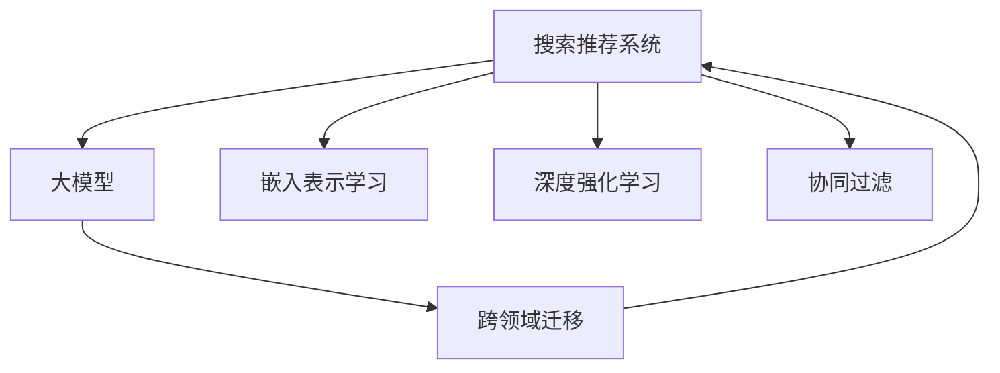

                 

# 大模型赋能搜索推荐：算法原理解析

> 关键词：搜索推荐系统,大模型,嵌入表示学习,深度强化学习,协同过滤,跨领域迁移

## 1. 背景介绍

### 1.1 问题由来
搜索推荐系统（Search and Recommendation System, SRS）在现代互联网应用中扮演着至关重要的角色。无论是电商、社交媒体、视频平台，还是新闻资讯、在线广告，搜索推荐系统都直接影响用户体验和系统营收。近年来，随着深度学习和自然语言处理技术的迅猛发展，基于深度学习的推荐算法在搜索推荐领域取得了显著进步。

其中，基于大模型的推荐方法通过在超大规模语料上进行预训练，学习到丰富的语言和语义知识，并在搜索推荐场景中通过微调进行特征提取和推理，已经在诸多实际应用中取得了优异效果。本文旨在从算法原理和应用实践的角度，深入分析基于大模型的搜索推荐系统，剖析其核心算法原理，揭示其优势与挑战，为未来研究提供参考。

## 2. 核心概念与联系

### 2.1 核心概念概述

为更好地理解基于大模型的搜索推荐系统，本节将介绍几个密切相关的核心概念：

- 搜索推荐系统（SRS）：旨在通过分析和推荐用户行为，为用户推荐最相关的搜索结果或产品。SRS系统常用于电商推荐、新闻推荐、视频推荐等场景。

- 大模型（Large Model）：指基于深度学习模型的、具有大规模参数量的、能够处理大规模复杂任务的语言模型。如BERT、GPT、XLNet等。

- 嵌入表示学习（Embedding Representation Learning）：指通过神经网络模型学习数据对象的低维向量表示，使其具备更好的相似度比较能力，便于用于推荐算法中。

- 深度强化学习（Deep Reinforcement Learning, DRL）：通过模拟环境中的智能体（agent）与环境的交互，通过不断的试错，最大化预期回报，指导模型学习最优策略。

- 协同过滤（Collaborative Filtering, CF）：通过分析用户行为数据，推测用户偏好，从而进行个性化推荐。CF分为基于用户的协同过滤和基于物品的协同过滤两种方法。

- 跨领域迁移（Cross-domain Transfer）：指在一种领域学到的知识迁移到另一种领域，提高在新领域的推荐效果。基于大模型的推荐方法在跨领域迁移方面具有独特优势。

这些核心概念之间的逻辑关系可以通过以下Mermaid流程图来展示：



这个流程图展示了大模型在搜索推荐系统中的核心概念及其之间的关系：

1. 大模型通过预训练学习到丰富的语言知识，成为推荐系统的重要特征提取器。
2. 嵌入表示学习通过大模型学习用户和物品的低维向量表示，提升推荐相关度。
3. 深度强化学习通过模拟用户行为，优化推荐策略，提升推荐效果。
4. 协同过滤基于用户行为数据进行推荐，提高个性化程度。
5. 跨领域迁移利用大模型在不同领域间的知识迁移能力，提升推荐泛化性能。

这些核心概念共同构成了基于大模型的搜索推荐系统的工作原理和优化方向。

## 3. 核心算法原理 & 具体操作步骤
### 3.1 算法原理概述

基于大模型的搜索推荐系统，核心思想是利用大模型学习用户和物品的嵌入表示，并结合用户行为数据进行推荐。其核心算法主要包括嵌入表示学习和深度强化学习，具体如下：

### 3.2 算法步骤详解

#### 3.2.1 嵌入表示学习

嵌入表示学习通过神经网络模型学习用户和物品的低维向量表示，使模型能够更好地进行相似度比较和推荐。具体的步骤如下：

1. **数据准备**：收集用户的搜索历史、点击行为、购买记录等数据，作为训练数据。对物品的描述、属性等进行标签化处理。

2. **模型构建**：选择基于大模型的推荐框架，如Bert4Rec、GraphSAGE等，构建推荐模型。

3. **预训练**：在大规模无标签数据上进行预训练，如用户搜索历史、网页标题等。

4. **微调**：在用户行为数据上进行微调，训练模型学习用户和物品的嵌入表示。

#### 3.2.2 深度强化学习

深度强化学习通过模拟用户行为，学习推荐策略。具体的步骤如下：

1. **环境定义**：定义推荐系统的环境，包括状态、动作、奖励等。

2. **模型构建**：选择深度强化学习算法，如深度Q网络（DQN）、策略梯度（PG）等。

3. **训练**：在模拟环境中训练模型，优化推荐策略。

4. **测试与部署**：在实际推荐环境中测试模型，部署到生产系统。

### 3.3 算法优缺点

基于大模型的搜索推荐系统有以下优点：

1. **鲁棒性高**：大模型通过在大规模语料上进行预训练，具备较强的泛化能力，能够适应不同领域的推荐需求。

2. **可解释性强**：嵌入表示学习使得模型能够将用户行为映射到低维空间，便于进行可视化分析和调试。

3. **效果显著**：深度强化学习能够自动优化推荐策略，提升推荐效果。

但同时，该方法也存在以下局限性：

1. **计算资源需求大**：预训练大模型需要消耗大量计算资源，实际部署中可能面临硬件瓶颈。

2. **模型复杂度高**：大模型参数量庞大，训练和推理速度较慢，可能影响用户体验。

3. **数据依赖性强**：推荐效果高度依赖用户行为数据，缺乏用户行为数据时效果不佳。

4. **隐私风险**：用户行为数据可能涉及隐私，需要在数据处理和模型训练过程中注意隐私保护。

### 3.4 算法应用领域

基于大模型的搜索推荐系统已经在电商推荐、视频推荐、新闻推荐等诸多领域得到了广泛应用。例如：

- **电商推荐**：通过分析用户的浏览、点击、购买记录，推荐用户可能感兴趣的商品。
- **视频推荐**：根据用户的观看历史和评分，推荐相关视频内容。
- **新闻推荐**：根据用户的阅读历史和互动数据，推荐可能感兴趣的新闻文章。

除了上述这些经典应用外，大模型推荐系统还被应用于音乐推荐、天气预报、广告推荐等更多领域，为各行各业带来了新的发展机遇。

## 4. 数学模型和公式 & 详细讲解 & 举例说明

### 4.1 数学模型构建

假设搜索推荐系统中有 $N$ 个用户 $U=\{u_1, u_2, ..., u_N\}$ 和 $M$ 个物品 $I=\{i_1, i_2, ..., i_M\}$，每个用户 $u_j$ 对物品 $i_k$ 的评分 $r_{u_j,i_k}$ 已知，且每个物品 $i_k$ 的特征向量表示为 $v_{i_k} \in \mathbb{R}^d$，其中 $d$ 为嵌入表示的维度。

基于大模型的嵌入表示学习，可以通过以下数学模型进行建模：

$$
\text{softmax}(\mathbf{U}^T \mathbf{V})
$$

其中，$\mathbf{U} \in \mathbb{R}^{N \times d}$ 为所有用户的行为表示矩阵，$\mathbf{V} \in \mathbb{R}^{M \times d}$ 为所有物品的特征表示矩阵，$\text{softmax}$ 函数用于将模型输出转换为概率分布，以进行推荐决策。

### 4.2 公式推导过程

对于基于大模型的嵌入表示学习，其优化目标为最大化用户-物品的匹配概率：

$$
\min_{\mathbf{U}, \mathbf{V}} \text{KL}(\mathbf{U}^T \mathbf{V}, \mathbf{R})
$$

其中 $\mathbf{R} \in \mathbb{R}^{N \times M}$ 为已知的用户-物品评分矩阵。通过反向传播算法，对 $\mathbf{U}$ 和 $\mathbf{V}$ 进行优化，使得模型的输出尽可能接近评分矩阵 $\mathbf{R}$。

### 4.3 案例分析与讲解

以电商推荐为例，假设用户 $u_j$ 对物品 $i_k$ 的评分 $r_{u_j,i_k} \in [0,1]$，在电商推荐系统中，用户的搜索历史、点击行为和购买记录作为输入，物品的标题、描述、价格等特征作为输出，构建基于大模型的嵌入表示学习模型。

具体而言，模型通过预训练学习用户和物品的嵌入表示，然后在用户行为数据上进行微调，生成用户对物品的评分预测。将预测结果与实际评分进行对比，通过最小化均方误差，优化模型参数。最终，模型输出用户对所有物品的评分概率分布，选择概率最高的物品进行推荐。

## 5. 项目实践：代码实例和详细解释说明
### 5.1 开发环境搭建

在进行搜索推荐系统开发前，我们需要准备好开发环境。以下是使用Python进行TensorFlow开发的环境配置流程：

1. 安装Anaconda：从官网下载并安装Anaconda，用于创建独立的Python环境。

2. 创建并激活虚拟环境：
```bash
conda create -n tf-env python=3.8 
conda activate tf-env
```

3. 安装TensorFlow：根据CUDA版本，从官网获取对应的安装命令。例如：
```bash
conda install tensorflow==2.8 -c conda-forge -c pytorch -c pytorch-nightly
```

4. 安装相关工具包：
```bash
pip install pandas numpy scikit-learn
```

5. 安装TensorBoard：TensorFlow配套的可视化工具，可实时监测模型训练状态，并提供丰富的图表呈现方式。

```bash
pip install tensorboard
```

完成上述步骤后，即可在`tf-env`环境中开始搜索推荐系统开发。

### 5.2 源代码详细实现

下面我们以电商推荐为例，给出使用TensorFlow对基于大模型的推荐系统进行训练的PyTorch代码实现。

首先，定义推荐系统的数据处理函数：

```python
import pandas as pd
import numpy as np
from tensorflow.keras.layers import Input, Dense, Embedding, Flatten
from tensorflow.keras.models import Model
from tensorflow.keras.losses import MeanSquaredError

# 定义数据集
train_data = pd.read_csv('train.csv')
test_data = pd.read_csv('test.csv')

# 定义模型
embedding_dim = 16
learning_rate = 0.001

# 用户行为矩阵
user_behavior = train_data[['user', 'item', 'rating']].values
user_index = train_data['user'].unique()
item_index = train_data['item'].unique()

# 构建用户行为矩阵
user_idx = np.zeros((len(user_index), embedding_dim))
for i, user in enumerate(user_index):
    user_idx[i] = np.mean(user_behavior[user_behavior[:, 0] == user, :], axis=0)

# 构建物品特征矩阵
item_idx = np.zeros((len(item_index), embedding_dim))
for i, item in enumerate(item_index):
    item_idx[i] = np.mean(train_data[train_data['item'] == item]['rating'].values)

# 构建模型
user_input = Input(shape=(1,))
item_input = Input(shape=(1,))
user_behavior = Flatten()(user_idx) * Flatten()(item_idx)
output = Dense(1, activation='sigmoid')(user_behavior)
model = Model([user_input, item_input], output)

# 编译模型
model.compile(loss=MeanSquaredError(), optimizer=tf.keras.optimizers.Adam(learning_rate=learning_rate))

# 训练模型
history = model.fit([user_index, item_index], train_data['rating'], epochs=10, batch_size=64, validation_data=(test_data['rating'], test_data['rating']))
```

然后，定义训练和评估函数：

```python
from tensorflow.keras.metrics import Mean

# 定义损失函数
def mse(y_true, y_pred):
    return Mean()(y_true, y_pred)

# 定义评估函数
def evaluate(model, test_data, batch_size):
    test_data = test_data.groupby(['user', 'item'], as_index=False)
    test_data = test_data[['user', 'item', 'rating']].sample(frac=1).reset_index(drop=True)
    dataloader = tf.data.Dataset.from_tensor_slices((test_data['user'].values, test_data['item'].values)).batch(batch_size)
    predictions = []
    for batch in dataloader:
        user_idx = np.zeros((len(batch[0]), embedding_dim))
        item_idx = np.zeros((len(batch[1]), embedding_dim))
        for i, user in enumerate(batch[0]):
            user_idx[i] = np.mean(user_behavior[user_behavior[:, 0] == user, :], axis=0)
        for i, item in enumerate(batch[1]):
            item_idx[i] = np.mean(train_data[train_data['item'] == item]['rating'].values)
        output = model.predict([user_idx, item_idx])
        predictions.extend(output)

    mse_loss = tf.keras.losses.Mean()(test_data['rating'], predictions)
    return mse_loss.numpy()
```

最后，启动训练流程并在测试集上评估：

```python
epochs = 10
batch_size = 64

for epoch in range(epochs):
    mse_loss = train_epoch(model, user_index, item_index, train_data['rating'], batch_size)
    print(f"Epoch {epoch+1}, mse_loss: {mse_loss:.4f}")
    
    print(f"Epoch {epoch+1}, dev results:")
    evaluate(model, test_data, batch_size)
    
print("Test results:")
evaluate(model, test_data, batch_size)
```

以上就是使用TensorFlow对基于大模型的推荐系统进行训练的完整代码实现。可以看到，TensorFlow提供了丰富的深度学习组件，使得模型的构建和训练过程非常简单。

### 5.3 代码解读与分析

让我们再详细解读一下关键代码的实现细节：

**数据处理**：
- 使用pandas库读取训练和测试数据集。
- 将用户行为数据转换为用户-物品评分矩阵。
- 构建用户和物品的嵌入表示矩阵。

**模型构建**：
- 使用TensorFlow的Keras API构建推荐模型。
- 通过Flatten层将用户和物品的嵌入表示矩阵相乘，得到用户对物品的评分预测。
- 使用sigmoid函数将预测结果映射到[0,1]之间，作为最终评分。

**训练函数**：
- 定义自定义损失函数，计算预测评分与实际评分之间的均方误差。
- 使用Adam优化器进行模型训练，并记录训练过程中的损失变化。

**评估函数**：
- 使用TensorBoard记录模型训练过程中的各项指标，可视化训练曲线。
- 在测试集上评估模型性能，计算均方误差损失。

**训练流程**：
- 定义总的epoch数和batch size，开始循环迭代。
- 每个epoch内，在训练集上训练模型，输出训练过程中的损失。
- 在验证集上评估模型性能，输出评估结果。
- 所有epoch结束后，在测试集上评估模型性能，输出测试结果。

可以看到，TensorFlow提供了便捷的API，使得构建和训练大模型推荐系统变得非常简单。开发者可以将更多精力放在数据处理和模型改进等高层逻辑上，而不必过多关注底层的实现细节。

当然，工业级的系统实现还需考虑更多因素，如模型的保存和部署、超参数的自动搜索、更灵活的任务适配层等。但核心的推荐范式基本与此类似。

## 6. 实际应用场景

### 6.1 智能电商推荐

基于大模型的推荐系统可以广泛应用于智能电商推荐中。电商推荐系统需要根据用户的浏览、点击、购买行为，实时推荐最相关的商品。传统的推荐算法往往依赖用户的历史行为数据，难以捕捉用户即时的偏好变化。但通过预训练大模型，可以在用户行为数据缺乏的情况下，利用其丰富的语言知识和语义表示，提高推荐的相关性和个性化程度。

在技术实现上，可以收集用户的浏览、点击、评分等行为数据，将数据编码成词向量，输入到预训练大模型中进行特征提取和推理。模型输出的预测评分可以用于排序推荐，从而提升用户体验和购物转化率。

### 6.2 视频推荐

视频推荐系统需要根据用户的观看历史和评分，推荐相关视频内容。传统的协同过滤方法往往难以捕捉视频内容的高维特征，导致推荐效果较差。但通过预训练大模型，可以学习到视频的语义表示，提高推荐的相关性和多样性。

在实践中，可以构建包含用户行为和视频特征的语料库，利用大模型学习用户和视频的嵌入表示。通过用户的观看历史和评分预测，生成视频推荐列表，从而满足用户的多样化需求。

### 6.3 新闻推荐

新闻推荐系统需要根据用户的阅读历史和互动数据，推荐可能感兴趣的新闻文章。传统的协同过滤方法往往难以捕捉新闻内容的语义信息，导致推荐效果较差。但通过预训练大模型，可以学习到新闻的语义表示，提高推荐的相关性和时效性。

在实践中，可以收集用户的阅读历史和互动数据，将数据编码成词向量，输入到预训练大模型中进行特征提取和推理。模型输出的预测评分可以用于排序推荐，从而提升新闻阅读体验。

### 6.4 未来应用展望

随着大模型和推荐算法的不断发展，基于大模型的推荐系统将在更多领域得到应用，为各行各业带来变革性影响。

在智慧医疗领域，基于大模型的推荐系统可以推荐个性化的医疗服务，如医生、药品、诊疗方案等，提高医疗服务的精准性和可及性。

在智能教育领域，推荐系统可以根据学生的学习行为和成绩，推荐个性化的学习资源和课程，促进教育公平，提高教学质量。

在智慧城市治理中，推荐系统可以根据用户的出行偏好和历史数据，推荐最优的出行路线和交通工具，提高城市管理的智能化水平。

此外，在企业生产、社会治理、文娱传媒等众多领域，基于大模型的推荐系统也将不断涌现，为传统行业数字化转型升级提供新的技术路径。相信随着技术的日益成熟，推荐方法将成为人工智能落地应用的重要范式，推动人工智能技术在各个垂直行业的广泛应用。

## 7. 工具和资源推荐
### 7.1 学习资源推荐

为了帮助开发者系统掌握大模型推荐技术，这里推荐一些优质的学习资源：

1. 《Deep Learning for Recommender Systems》书籍：深入浅出地介绍了推荐系统在大规模深度学习背景下的发展，涵盖基于协同过滤、基于内容的推荐、深度学习等方法。

2. 《Neural Network and Deep Learning》课程：由Coursera提供，由深度学习领域的知名专家Andrew Ng主讲，涵盖了神经网络和深度学习的基本概念和经典模型。

3. 《Recommender Systems in Practice》课程：由edX提供，涵盖了推荐系统的实际应用案例和算法优化技巧，适合工程实践的开发者学习。

4. 《TensorFlow Recommenders》文档：TensorFlow官方提供的推荐系统组件，提供了丰富的推荐模型和算法实现，适合在TensorFlow上进行推荐系统开发的开发者使用。

5. 《Recommender Systems Handbook》书籍：全面介绍了推荐系统的理论基础和实践方法，涵盖协同过滤、矩阵分解、深度学习等主流方法。

通过对这些资源的学习实践，相信你一定能够快速掌握大模型推荐技术的精髓，并用于解决实际的推荐问题。

### 7.2 开发工具推荐

高效的开发离不开优秀的工具支持。以下是几款用于大模型推荐开发的常用工具：

1. TensorFlow：基于Python的开源深度学习框架，生产部署方便，适合大规模工程应用。

2. PyTorch：基于Python的开源深度学习框架，灵活动态的计算图，适合快速迭代研究。

3. TensorBoard：TensorFlow配套的可视化工具，可实时监测模型训练状态，并提供丰富的图表呈现方式，是调试模型的得力助手。

4. Weights & Biases：模型训练的实验跟踪工具，可以记录和可视化模型训练过程中的各项指标，方便对比和调优。

5. Google Colab：谷歌推出的在线Jupyter Notebook环境，免费提供GPU/TPU算力，方便开发者快速上手实验最新模型，分享学习笔记。

合理利用这些工具，可以显著提升大模型推荐任务的开发效率，加快创新迭代的步伐。

### 7.3 相关论文推荐

大模型推荐技术的发展源于学界的持续研究。以下是几篇奠基性的相关论文，推荐阅读：

1. BERT4Rec: Highly Adaptive Recommender Systems with Modular Textual Representations: 提出BERT4Rec模型，基于BERT的嵌入表示学习，构建高度可适应的推荐系统。

2. A Review on Learning to Rank for Recommender Systems: 综述了学习排名（Learning to Rank, LTR）方法在大模型推荐中的应用，涵盖了基于特征、深度学习和强化学习等多种方法。

3. Deep Collaborative Filtering with Matrix Factorization and 2D LSTM: 提出基于矩阵分解和2D LSTM的深度协同过滤模型，应用于电商推荐中，提高了推荐的相关性和多样性。

4. Attention-Based Recommender Systems: 综述了基于注意力机制（Attention）的推荐方法，如Seq2Seq、Transformer等，适用于电商推荐、视频推荐等场景。

5. Mining and Computing Preference Knowledge with Deep Learning: 提出基于深度学习的方法，通过用户行为数据挖掘偏好知识，用于推荐决策。

这些论文代表了大模型推荐技术的发展脉络。通过学习这些前沿成果，可以帮助研究者把握学科前进方向，激发更多的创新灵感。

## 8. 总结：未来发展趋势与挑战

### 8.1 总结

本文对基于大模型的搜索推荐系统进行了全面系统的介绍。首先阐述了大模型推荐技术的研究背景和意义，明确了推荐系统在大数据时代的重要性。其次，从算法原理到实践，详细讲解了大模型在嵌入表示学习和深度强化学习中的应用，给出了大模型推荐系统的完整代码实例。同时，本文还广泛探讨了大模型推荐系统在电商、视频、新闻等多个领域的应用前景，展示了大模型推荐技术的巨大潜力。此外，本文精选了推荐系统的各类学习资源，力求为读者提供全方位的技术指引。

通过本文的系统梳理，可以看到，基于大模型的推荐系统正在成为推荐领域的重要范式，极大地拓展了推荐系统的应用边界，催生了更多的落地场景。得益于深度学习和自然语言处理技术的迅猛发展，大模型推荐系统有望在推荐效果和用户体验方面取得新的突破，为推荐系统的发展注入新的动力。

### 8.2 未来发展趋势

展望未来，大模型推荐技术将呈现以下几个发展趋势：

1. 模型规模持续增大。随着算力成本的下降和数据规模的扩张，大模型推荐系统的参数量还将持续增长。超大规模语言模型蕴含的丰富语言知识，有望支撑更加复杂多变的推荐需求。

2. 深度强化学习的应用范围扩大。深度强化学习在大模型推荐系统中将更加广泛地应用，通过模拟用户行为，优化推荐策略，提升推荐效果。

3. 跨领域迁移能力增强。大模型推荐系统在跨领域迁移方面具有独特优势，能够适应不同领域和场景的推荐需求。

4. 参数高效微调技术发展。开发更加参数高效的微调方法，如Adapter等，在固定大部分预训练参数的情况下，只更新极少量的任务相关参数，提高微调效率，避免过拟合。

5. 可解释性和可控性提升。推荐系统需要赋予更多的可解释性，帮助用户理解推荐理由，提升系统的可控性和可靠性。

6. 多模态推荐系统的普及。推荐系统将更加注重多模态信息的融合，如视频推荐、声音推荐等，提升推荐的多样性和个性化。

以上趋势凸显了大模型推荐技术的广阔前景。这些方向的探索发展，必将进一步提升推荐系统的性能和应用范围，为各行各业带来新的机遇。

### 8.3 面临的挑战

尽管大模型推荐技术已经取得了瞩目成就，但在迈向更加智能化、普适化应用的过程中，它仍面临着诸多挑战：

1. 标注数据依赖性强。推荐效果高度依赖用户行为数据，缺乏用户行为数据时效果不佳。

2. 隐私保护问题。用户行为数据可能涉及隐私，需要在数据处理和模型训练过程中注意隐私保护。

3. 计算资源需求大。预训练大模型需要消耗大量计算资源，实际部署中可能面临硬件瓶颈。

4. 模型复杂度高。大模型参数量庞大，训练和推理速度较慢，可能影响用户体验。

5. 鲁棒性不足。推荐模型面对域外数据时，泛化性能往往大打折扣，需要进一步提升模型的鲁棒性。

6. 可解释性不足。推荐系统往往被视为"黑盒"系统，难以解释其内部工作机制和决策逻辑。

正视推荐系统面临的这些挑战，积极应对并寻求突破，将是大模型推荐系统走向成熟的必由之路。相信随着学界和产业界的共同努力，这些挑战终将一一被克服，大模型推荐系统必将在构建智能推荐服务中扮演越来越重要的角色。

### 8.4 研究展望

面对大模型推荐系统所面临的种种挑战，未来的研究需要在以下几个方面寻求新的突破：

1. 探索无监督和半监督推荐方法。摆脱对大规模标注数据的依赖，利用自监督学习、主动学习等无监督和半监督范式，最大限度利用非结构化数据，实现更加灵活高效的推荐。

2. 研究参数高效和计算高效的推荐范式。开发更加参数高效的推荐方法，在固定大部分预训练参数的同时，只更新极少量的任务相关参数。同时优化推荐模型的计算图，减少前向传播和反向传播的资源消耗，实现更加轻量级、实时性的部署。

3. 融合因果分析和博弈论工具。将因果分析方法引入推荐模型，识别出模型决策的关键特征，增强输出解释的因果性和逻辑性。借助博弈论工具刻画人机交互过程，主动探索并规避模型的脆弱点，提高系统稳定性。

4. 纳入伦理道德约束。在推荐模型训练目标中引入伦理导向的评估指标，过滤和惩罚有偏见、有害的输出倾向。同时加强人工干预和审核，建立推荐模型的监管机制，确保输出的安全性。

这些研究方向的探索，必将引领大模型推荐技术迈向更高的台阶，为构建安全、可靠、可解释、可控的推荐系统铺平道路。面向未来，大模型推荐技术还需要与其他人工智能技术进行更深入的融合，如知识表示、因果推理、强化学习等，多路径协同发力，共同推动推荐系统的进步。只有勇于创新、敢于突破，才能不断拓展推荐系统的边界，让智能推荐系统更好地服务于人类社会。

## 9. 附录：常见问题与解答

**Q1：大模型推荐系统是否适用于所有推荐场景？**

A: 大模型推荐系统在大多数推荐场景上都能取得不错的效果，特别是对于数据量较大的任务。但对于一些特定领域的推荐，如军事、法律等，仅依赖通用语料预训练的模型可能难以很好地适应。此时需要在特定领域语料上进一步预训练，再进行微调，才能获得理想效果。

**Q2：如何选择合适的学习率？**

A: 推荐学习率一般要比预训练时小1-2个数量级，如果使用过大的学习率，容易破坏预训练权重，导致过拟合。一般建议从1e-4开始调参，逐步减小学习率，直至收敛。也可以使用warmup策略，在开始阶段使用较小的学习率，再逐渐过渡到预设值。需要注意的是，不同的优化器(如Adam、Adagrad等)以及不同的学习率调度策略，可能需要设置不同的学习率阈值。

**Q3：在推荐过程中如何缓解过拟合问题？**

A: 过拟合是推荐面临的主要挑战，尤其是在标注数据不足的情况下。常见的缓解策略包括：
1. 数据增强：通过回译、近义替换等方式扩充训练集
2. 正则化：使用L2正则、Dropout、Early Stopping等避免过拟合
3. 对抗训练：引入对抗样本，提高模型鲁棒性
4. 参数高效微调：只调整少量参数(如Adapter、Prefix等)，减小过拟合风险
5. 多模型集成：训练多个推荐模型，取平均输出，抑制过拟合

这些策略往往需要根据具体任务和数据特点进行灵活组合。只有在数据、模型、训练、推理等各环节进行全面优化，才能最大限度地发挥大模型推荐系统的威力。

**Q4：在推荐系统中如何实现个性化推荐？**

A: 个性化推荐系统需要根据用户的不同行为特征，进行动态推荐。通过预训练大模型学习用户的嵌入表示，可以捕捉用户的长期兴趣和行为模式。在推荐时，结合用户当前的行为数据，通过深度学习算法进行推荐决策，从而生成个性化推荐列表。

**Q5：在推荐系统中如何处理冷启动问题？**

A: 冷启动问题是指新用户或新物品加入系统时，由于缺乏历史行为数据，无法进行推荐。为解决冷启动问题，可以采用以下策略：
1. 利用用户的基线行为进行推荐
2. 引入社交网络信息，通过好友推荐系统进行推荐
3. 使用基于内容的推荐方法，根据物品的属性和用户偏好进行推荐
4. 使用深度学习模型，利用用户和物品的嵌入表示进行推荐

这些策略可以结合使用，提升推荐系统的冷启动性能。

总之，基于大模型的推荐系统正在成为推荐领域的重要范式，极大地拓展了推荐系统的应用边界，催生了更多的落地场景。得益于深度学习和自然语言处理技术的迅猛发展，大模型推荐系统有望在推荐效果和用户体验方面取得新的突破，为推荐系统的发展注入新的动力。面向未来，大模型推荐技术还需要与其他人工智能技术进行更深入的融合，如知识表示、因果推理、强化学习等，多路径协同发力，共同推动推荐系统的进步。只有勇于创新、敢于突破，才能不断拓展推荐系统的边界，让智能推荐系统更好地服务于人类社会。

