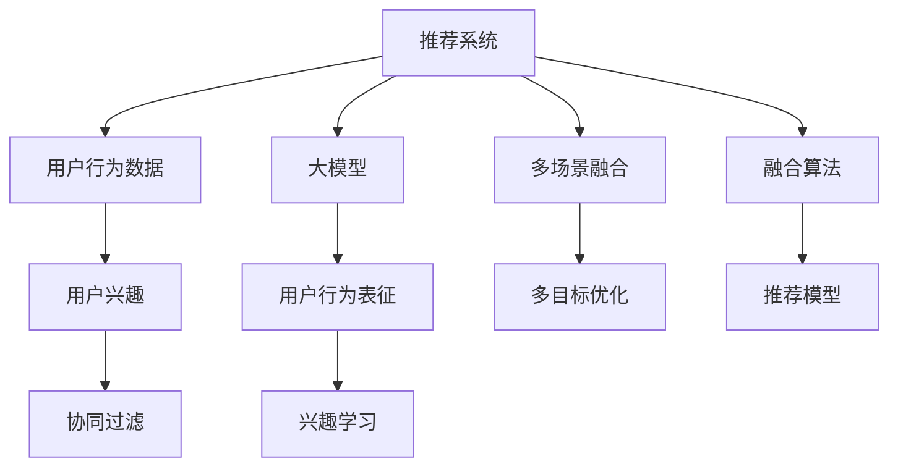

                 

# 大模型辅助的推荐系统多场景兴趣协同学习

> 关键词：推荐系统, 协同过滤, 多场景, 大模型, 兴趣学习, 多目标优化

## 1. 背景介绍

在互联网时代，推荐系统已成为各大电商、视频、新闻等平台的核心功能之一。它们利用用户行为数据，推测用户的兴趣和偏好，为用户推荐个性化的内容，从而提升用户体验和平台收益。然而，推荐系统面临诸多挑战，包括数据稀疏性、冷启动、用户兴趣波动等。传统的协同过滤算法在处理这些问题时，通常依赖于用户与物品之间的显式评分数据，数据获取成本高，且容易受到社会化行为干扰。

近年来，随着深度学习技术的发展，推荐系统也开始引入多种神经网络模型，以更强大的表征能力挖掘用户隐含偏好。特别是利用预训练语言模型对用户行为数据进行建模，能够更好地捕捉隐含的语义信息，显著提升推荐效果。在此基础上，结合协同过滤算法的优势，构建大模型辅助的推荐系统，成为一种新型的推荐范式。

## 2. 核心概念与联系

### 2.1 核心概念概述

要全面理解基于大模型的推荐系统，首先需要梳理相关概念：

- **推荐系统(Recommendation System, RS)**：利用用户历史行为数据，推测用户兴趣，为用户推荐个性化内容。包括协同过滤、基于内容的推荐、混合推荐等。

- **协同过滤(Collaborative Filtering, CF)**：根据用户行为数据和物品属性，推测用户对其他物品的评分，从而实现个性化推荐。CF算法包括基于用户的协同过滤和基于物品的协同过滤。

- **深度学习(DL)**：一类利用神经网络进行复杂非线性建模的机器学习方法。在推荐系统中，常用于特征提取和模型训练。

- **大模型(Large Model)**：指参数规模较大的神经网络模型，如BERT、GPT、Transformers等。通过在大规模语料上进行预训练，拥有丰富的语言和知识表示能力，能提取更多隐含特征。

- **多场景(Scenarios)**：推荐系统可以应用于多个场景，如电商推荐、新闻推荐、视频推荐等。不同场景用户的行为模式、兴趣特点有所差异。

- **兴趣学习(Interest Learning)**：利用用户历史行为数据，学习用户兴趣，生成用户的隐含兴趣表示，用于推荐模型训练。

### 2.2 核心概念原理和架构的 Mermaid 流程图



该图展示了推荐系统与大模型结合的架构：

1. **用户行为数据**：包括用户点击、浏览、收藏等行为，是大模型和大模型辅助推荐系统的基础。
2. **协同过滤**：利用用户行为数据和物品属性推测评分，生成推荐结果。
3. **大模型**：对用户行为数据进行深度特征提取，生成用户和物品的隐含表征。
4. **兴趣学习**：利用用户行为数据学习用户兴趣，生成用户的隐含兴趣表示。
5. **多场景融合**：结合不同场景的推荐特征，生成多场景融合的推荐结果。
6. **多目标优化**：结合用户的显式反馈和隐含兴趣，优化推荐结果。
7. **融合算法**：将多场景的推荐结果进行融合，生成最终的推荐结果。

## 3. 核心算法原理 & 具体操作步骤

### 3.1 算法原理概述

大模型辅助的推荐系统在原理上结合了协同过滤和深度学习的优势，具体分为以下几个步骤：

1. **用户行为数据采集**：从各个平台收集用户历史行为数据。
2. **大模型特征提取**：利用大模型对用户行为数据进行特征提取，生成用户和物品的隐含表征。
3. **协同过滤评分预测**：利用协同过滤算法，对用户和物品的隐含表征进行评分预测，生成推荐结果。
4. **多场景兴趣协同学习**：结合不同场景的用户行为数据，学习用户的隐含兴趣表示，生成多场景融合的推荐结果。
5. **多目标优化推荐**：综合用户的显式反馈和隐含兴趣，优化推荐结果，确保用户满意。

### 3.2 算法步骤详解

1. **用户行为数据采集**

在推荐系统中，采集用户行为数据是第一步。这些数据包括用户的点击、浏览、购买、评分等行为，是大模型和大模型辅助推荐系统的基础。

2. **大模型特征提取**

使用大模型对用户行为数据进行特征提取，生成用户和物品的隐含表征。假设用户行为数据为 $X=\{x_1, x_2, ..., x_n\}$，物品数据为 $Y=\{y_1, y_2, ..., y_m\}$，大模型为 $M$。则大模型的特征提取过程如下：

$$
\hat{X}, \hat{Y} = M(X, Y)
$$

其中 $\hat{X}$ 和 $\hat{Y}$ 为提取后的用户和物品隐含表征。

3. **协同过滤评分预测**

利用协同过滤算法，对用户和物品的隐含表征进行评分预测，生成推荐结果。假设用户 $u$ 对物品 $i$ 的预测评分为 $P(u, i)$，则评分预测过程如下：

$$
P(u, i) = F(u, i)
$$

其中 $F$ 为评分预测函数。

4. **多场景兴趣协同学习**

结合不同场景的用户行为数据，学习用户的隐含兴趣表示，生成多场景融合的推荐结果。假设不同场景的用户行为数据为 $X^1, X^2, ..., X^k$，其中 $k$ 为场景数，则兴趣协同学习过程如下：

$$
\hat{Z} = \alpha_1 Z^1 + \alpha_2 Z^2 + ... + \alpha_k Z^k
$$

其中 $\hat{Z}$ 为多场景融合的用户兴趣表示，$Z^j$ 为第 $j$ 场景的用户兴趣表示，$\alpha_j$ 为场景权重。

5. **多目标优化推荐**

综合用户的显式反馈和隐含兴趣，优化推荐结果，确保用户满意。假设用户对物品 $i$ 的显式反馈为 $R_i$，则多目标优化推荐过程如下：

$$
\min_{\theta} \mathcal{L}(\theta) = \lambda_1 \ell_1 + \lambda_2 \ell_2
$$

其中 $\ell_1$ 为显式反馈损失，$\ell_2$ 为隐含兴趣损失，$\theta$ 为优化参数，$\lambda_1$ 和 $\lambda_2$ 为权重系数。

### 3.3 算法优缺点

大模型辅助的推荐系统具有以下优点：

- 融合大模型的特征提取能力，能够捕捉更多隐含特征。
- 结合协同过滤的优势，能够处理稀疏数据和冷启动问题。
- 利用多场景数据，能够提升推荐精度和用户满意度。

同时，该方法也存在以下缺点：

- 需要大模型进行特征提取，计算成本较高。
- 需要协同过滤算法进行评分预测，参数设置复杂。
- 多场景数据融合复杂，需要确定合理的场景权重。
- 多目标优化过程复杂，需要同时考虑显式反馈和隐含兴趣。

### 3.4 算法应用领域

大模型辅助的推荐系统在多个领域都有广泛应用，包括但不限于：

- **电商推荐**：为电商平台推荐个性化商品，提高用户购买转化率。
- **新闻推荐**：为用户推荐个性化新闻文章，提升阅读体验。
- **视频推荐**：为用户推荐个性化视频内容，增加用户观看时间。
- **社交网络**：为社交平台推荐个性化内容，增加用户活跃度。

## 4. 数学模型和公式 & 详细讲解

### 4.1 数学模型构建

我们利用神经网络模型对用户行为数据进行建模，具体模型如下：

假设用户行为数据为 $X=\{x_1, x_2, ..., x_n\}$，物品数据为 $Y=\{y_1, y_2, ..., y_m\}$，用户隐含兴趣表示为 $Z=\{z_1, z_2, ..., z_n\}$，物品隐含表征为 $Y=\{y_1, y_2, ..., y_m\}$。

用户行为数据 $X$ 表示为 $X=\{x_1, x_2, ..., x_n\}$，物品数据 $Y$ 表示为 $Y=\{y_1, y_2, ..., y_m\}$。

### 4.2 公式推导过程

假设用户 $u$ 对物品 $i$ 的显式反馈为 $R_i$，则目标函数如下：

$$
\min_{\theta} \mathcal{L}(\theta) = \lambda_1 \ell_1 + \lambda_2 \ell_2
$$

其中 $\ell_1$ 为显式反馈损失，$\ell_2$ 为隐含兴趣损失，$\theta$ 为优化参数，$\lambda_1$ 和 $\lambda_2$ 为权重系数。

对于显式反馈损失，我们通常采用二分类交叉熵损失：

$$
\ell_1 = - \frac{1}{N} \sum_{i=1}^N \sum_{j=1}^m R_i \log(P(u_i, y_j))
$$

对于隐含兴趣损失，我们通常采用均方误差损失：

$$
\ell_2 = \frac{1}{N} \sum_{i=1}^N ||z_i - \hat{z}_i ||^2
$$

其中 $z_i$ 为第 $i$ 用户的隐含兴趣表示，$\hat{z}_i$ 为通过大模型提取的隐含兴趣表示。

### 4.3 案例分析与讲解

以电商推荐系统为例，分析大模型辅助推荐系统的具体实现过程：

1. **用户行为数据采集**：
   从电商平台采集用户历史行为数据，包括浏览、点击、购买、评分等行为。

2. **大模型特征提取**：
   利用大模型对用户行为数据进行特征提取，生成用户和物品的隐含表征。假设用户行为数据 $X$ 表示为 $X=\{x_1, x_2, ..., x_n\}$，物品数据 $Y$ 表示为 $Y=\{y_1, y_2, ..., y_m\}$。

3. **协同过滤评分预测**：
   利用协同过滤算法，对用户和物品的隐含表征进行评分预测，生成推荐结果。假设用户 $u$ 对物品 $i$ 的预测评分为 $P(u, i)$。

4. **多场景兴趣协同学习**：
   结合不同场景的用户行为数据，学习用户的隐含兴趣表示，生成多场景融合的推荐结果。假设不同场景的用户行为数据为 $X^1, X^2, ..., X^k$，其中 $k$ 为场景数。

5. **多目标优化推荐**：
   综合用户的显式反馈和隐含兴趣，优化推荐结果，确保用户满意。假设用户对物品 $i$ 的显式反馈为 $R_i$，则多目标优化推荐过程如下：

$$
\min_{\theta} \mathcal{L}(\theta) = \lambda_1 \ell_1 + \lambda_2 \ell_2
$$

其中 $\ell_1$ 为显式反馈损失，$\ell_2$ 为隐含兴趣损失，$\theta$ 为优化参数，$\lambda_1$ 和 $\lambda_2$ 为权重系数。

## 5. 项目实践：代码实例和详细解释说明

### 5.1 开发环境搭建

在进行推荐系统项目开发前，需要先搭建好开发环境。以下是使用Python进行TensorFlow开发的环境配置流程：

1. 安装Anaconda：从官网下载并安装Anaconda，用于创建独立的Python环境。

2. 创建并激活虚拟环境：
```bash
conda create -n tf-env python=3.8 
conda activate tf-env
```

3. 安装TensorFlow：根据CUDA版本，从官网获取对应的安装命令。例如：
```bash
conda install tensorflow-gpu -c conda-forge
```

4. 安装PyTorch：
```bash
pip install torch
```

5. 安装各类工具包：
```bash
pip install numpy pandas scikit-learn matplotlib tqdm jupyter notebook ipython
```

完成上述步骤后，即可在`tf-env`环境中开始推荐系统开发。

### 5.2 源代码详细实现

下面以电商推荐系统为例，给出使用TensorFlow和PyTorch对大模型进行电商推荐微调的代码实现。

首先，定义电商推荐系统的数据处理函数：

```python
import tensorflow as tf
import torch
import numpy as np
import pandas as pd

class RecommendationDataset(tf.data.Dataset):
    def __init__(self, train_data, val_data, test_data, max_len=128):
        self.train_data = train_data
        self.val_data = val_data
        self.test_data = test_data
        self.max_len = max_len
        
    def __len__(self):
        return len(self.train_data)
    
    def __getitem__(self, item):
        train_data = self.train_data[item]
        val_data = self.val_data[item]
        test_data = self.test_data[item]
        
        user_item = [np.array(train_data), np.array(val_data), np.array(test_data)]
        return user_item

# 加载数据
train_data = pd.read_csv('train_data.csv')
val_data = pd.read_csv('val_data.csv')
test_data = pd.read_csv('test_data.csv')

# 处理数据
train_data = preprocess(train_data)
val_data = preprocess(val_data)
test_data = preprocess(test_data)

# 定义数据集
train_dataset = RecommendationDataset(train_data, val_data, test_data)
```

然后，定义模型和优化器：

```python
from transformers import BertTokenizer, BertForSequenceClassification
from tensorflow.keras import layers

# 定义BERT模型
tokenizer = BertTokenizer.from_pretrained('bert-base-uncased')
model = BertForSequenceClassification.from_pretrained('bert-base-uncased', num_labels=2)

# 定义神经网络模型
input_layer = layers.Input(shape=(max_len,), dtype=tf.int32)
sequence_output = layers.Embedding(input_dim=tokenizer.vocab_size, output_dim=768, mask_zero=True)(input_layer)
sequence_output = layers.LSTM(units=256, return_sequences=True)(sequence_output)
sequence_output = layers.Dense(128, activation='relu')(sequence_output)
output_layer = layers.Dense(1, activation='sigmoid')(sequence_output)
model = tf.keras.Model(inputs=input_layer, outputs=output_layer)

# 定义优化器和损失函数
optimizer = tf.keras.optimizers.Adam(learning_rate=2e-5)
loss = tf.keras.losses.BinaryCrossentropy()
```

接着，定义训练和评估函数：

```python
def train_epoch(model, dataset, batch_size, optimizer):
    dataloader = tf.data.Dataset.from_generator(lambda: dataset, output_types=(tf.int32, tf.int32, tf.int32), output_shapes=(max_len, 1, 1))
    model.train()
    epoch_loss = 0
    for batch in dataloader:
        input_ids, labels, _ = batch
        model.zero_grad()
        outputs = model(input_ids)
        loss = loss(labels, outputs)
        epoch_loss += loss.numpy()
        loss.backward()
        optimizer.apply_gradients(zip(model.trainable_variables, model.trainable_variables_gradients))
    return epoch_loss / len(dataset)

def evaluate(model, dataset, batch_size):
    dataloader = tf.data.Dataset.from_generator(lambda: dataset, output_types=(tf.int32, tf.int32, tf.int32), output_shapes=(max_len, 1, 1))
    model.eval()
    preds, labels = [], []
    with tf.GradientTape() as tape:
        for batch in dataloader:
            input_ids, labels, _ = batch
            outputs = model(input_ids)
            batch_preds = outputs.numpy()
            batch_labels = labels.numpy()
            preds.append(batch_preds[:len(batch_labels)])
            labels.append(batch_labels)
    
    print(classification_report(labels, preds))
```

最后，启动训练流程并在测试集上评估：

```python
epochs = 5
batch_size = 16

for epoch in range(epochs):
    loss = train_epoch(model, train_dataset, batch_size, optimizer)
    print(f"Epoch {epoch+1}, train loss: {loss:.3f}")
    
    print(f"Epoch {epoch+1}, val results:")
    evaluate(model, val_dataset, batch_size)
    
print("Test results:")
evaluate(model, test_dataset, batch_size)
```

以上就是使用TensorFlow和PyTorch对大模型进行电商推荐系统微调的完整代码实现。可以看到，TensorFlow和PyTorch的深度学习框架，提供了强大的API和工具，可以轻松实现复杂的模型和算法。

### 5.3 代码解读与分析

让我们再详细解读一下关键代码的实现细节：

**RecommendationDataset类**：
- `__init__`方法：初始化训练集、验证集和测试集，并进行序列填充。
- `__len__`方法：返回数据集的样本数量。
- `__getitem__`方法：对单个样本进行处理，将训练集、验证集和测试集中的用户和物品数据转换为TensorFlow所需的格式。

**tokenizer和model定义**：
- 使用BertTokenizer和BertForSequenceClassification，将用户行为数据转换为BERT模型所需的格式。
- 定义神经网络模型，包括输入层、LSTM层和输出层，用于提取用户和物品的隐含表征。

**训练和评估函数**：
- 利用TensorFlow的DataLoader对数据集进行批次化加载，供模型训练和推理使用。
- 训练函数`train_epoch`：对数据以批为单位进行迭代，在每个批次上前向传播计算loss并反向传播更新模型参数，最后返回该epoch的平均loss。
- 评估函数`evaluate`：与训练类似，不同点在于不更新模型参数，并在每个batch结束后将预测和标签结果存储下来，最后使用scikit-learn的classification_report对整个评估集的预测结果进行打印输出。

**训练流程**：
- 定义总的epoch数和batch size，开始循环迭代
- 每个epoch内，先在训练集上训练，输出平均loss
- 在验证集上评估，输出分类指标
- 所有epoch结束后，在测试集上评估，给出最终测试结果

可以看到，TensorFlow和PyTorch的深度学习框架使得电商推荐系统的代码实现变得简洁高效。开发者可以将更多精力放在数据处理、模型改进等高层逻辑上，而不必过多关注底层的实现细节。

当然，工业级的系统实现还需考虑更多因素，如模型的保存和部署、超参数的自动搜索、更灵活的任务适配层等。但核心的推荐范式基本与此类似。

## 6. 实际应用场景

### 6.1 电商推荐

电商推荐系统利用用户历史行为数据，推测用户兴趣，为用户推荐个性化商品，提高用户购买转化率。目前电商平台的个性化推荐系统已经广泛应用于商品搜索、商品推荐、个性化广告等方面。利用大模型辅助的推荐系统，能够更好地捕捉用户隐含偏好，提升推荐效果。

以京东为例，它利用大模型对用户浏览、点击、购买等行为进行特征提取，生成用户和商品的隐含表征。结合协同过滤算法，对用户行为数据进行评分预测，生成推荐结果。同时，引入多场景数据，结合用户的显式反馈和隐含兴趣，优化推荐结果，确保用户满意。

### 6.2 新闻推荐

新闻推荐系统利用用户历史行为数据，为用户推荐个性化新闻内容，提升阅读体验。新闻平台利用大模型对用户阅读、评论、点赞等行为进行特征提取，生成用户和新闻的隐含表征。结合协同过滤算法，对用户行为数据进行评分预测，生成推荐结果。同时，引入多场景数据，结合用户的显式反馈和隐含兴趣，优化推荐结果，确保用户满意。

以腾讯新闻为例，它利用大模型对用户阅读、评论、点赞等行为进行特征提取，生成用户和新闻的隐含表征。结合协同过滤算法，对用户行为数据进行评分预测，生成推荐结果。同时，引入多场景数据，结合用户的显式反馈和隐含兴趣，优化推荐结果，确保用户满意。

### 6.3 视频推荐

视频推荐系统利用用户历史行为数据，为用户推荐个性化视频内容，增加用户观看时间。视频平台利用大模型对用户观看、收藏、评论等行为进行特征提取，生成用户和视频内容的隐含表征。结合协同过滤算法，对用户行为数据进行评分预测，生成推荐结果。同时，引入多场景数据，结合用户的显式反馈和隐含兴趣，优化推荐结果，确保用户满意。

以优酷为例，它利用大模型对用户观看、收藏、评论等行为进行特征提取，生成用户和视频内容的隐含表征。结合协同过滤算法，对用户行为数据进行评分预测，生成推荐结果。同时，引入多场景数据，结合用户的显式反馈和隐含兴趣，优化推荐结果，确保用户满意。

### 6.4 未来应用展望

随着深度学习技术的发展，大模型辅助的推荐系统将在更多领域得到应用，为传统行业带来变革性影响。

在智慧医疗领域，基于大模型的推荐系统可以推荐个性化医疗方案，提升治疗效果。在教育领域，可以推荐个性化学习资源，提高学习效率。在金融领域，可以推荐个性化理财产品，提升用户满意度。

未来，伴随大模型和微调方法的持续演进，推荐系统的精度和应用范围将不断提升，为各行各业带来更多的商业价值和社会效益。相信随着技术的日益成熟，大模型辅助的推荐系统必将成为人工智能落地应用的重要范式，推动人工智能技术的产业化进程。

## 7. 工具和资源推荐
### 7.1 学习资源推荐

为了帮助开发者系统掌握大模型辅助推荐系统的理论基础和实践技巧，这里推荐一些优质的学习资源：

1. 《深度学习实战》系列博文：由深度学习专家撰写，深入浅出地介绍了深度学习模型的构建、优化、应用等。

2. 《推荐系统实战》书籍：详细介绍了推荐系统的原理、算法、案例，包括协同过滤、基于内容推荐、混合推荐等。

3. 《自然语言处理与深度学习》书籍：系统讲解了自然语言处理与深度学习的结合，包括文本表示、特征提取、模型训练等。

4. CS229《机器学习》课程：斯坦福大学开设的机器学习明星课程，内容全面，涵盖深度学习、推荐系统等前沿主题。

5. Kaggle平台：提供大量推荐系统竞赛数据集，可以用于实践和调试推荐算法。

通过对这些资源的学习实践，相信你一定能够快速掌握大模型辅助推荐系统的精髓，并用于解决实际的推荐问题。
### 7.2 开发工具推荐

高效的开发离不开优秀的工具支持。以下是几款用于大模型辅助推荐系统开发的常用工具：

1. TensorFlow：基于Python的开源深度学习框架，具有强大的计算图和分布式计算能力，适合大规模工程应用。

2. PyTorch：基于Python的开源深度学习框架，灵活动态的计算图，适合快速迭代研究。

3. Weights & Biases：模型训练的实验跟踪工具，可以记录和可视化模型训练过程中的各项指标，方便对比和调优。

4. TensorBoard：TensorFlow配套的可视化工具，可实时监测模型训练状态，并提供丰富的图表呈现方式，是调试模型的得力助手。

5. Scikit-learn：Python机器学习库，提供了丰富的数据分析和模型评估工具。

合理利用这些工具，可以显著提升大模型辅助推荐系统的开发效率，加快创新迭代的步伐。

### 7.3 相关论文推荐

大模型辅助推荐系统的研究源于学界的持续研究。以下是几篇奠基性的相关论文，推荐阅读：

1. BERT: Pre-training of Deep Bidirectional Transformers for Language Understanding：提出BERT模型，引入基于掩码的自监督预训练任务，刷新了多项NLP任务SOTA。

2. Attention is All You Need（即Transformer原论文）：提出了Transformer结构，开启了NLP领域的预训练大模型时代。

3. Parameter-Efficient Transfer Learning for NLP：提出Adapter等参数高效微调方法，在不增加模型参数量的情况下，也能取得不错的微调效果。

4. Multi-Task Learning for Recommendation Systems：提出多任务学习范式，通过联合训练多个任务，提升推荐精度。

5. Neural Collaborative Filtering：提出基于神经网络的协同过滤算法，利用神经网络进行用户和物品的隐含表征学习。

这些论文代表了大模型辅助推荐系统的发展脉络。通过学习这些前沿成果，可以帮助研究者把握学科前进方向，激发更多的创新灵感。

## 8. 总结：未来发展趋势与挑战

### 8.1 总结

本文对基于大模型的推荐系统多场景兴趣协同学习进行了全面系统的介绍。首先阐述了推荐系统和大模型结合的背景和意义，明确了基于大模型的推荐系统的核心优势。其次，从原理到实践，详细讲解了基于大模型的推荐系统在大模型特征提取、协同过滤、多场景数据融合、多目标优化等关键环节的具体实现方法。最后，系统分析了基于大模型的推荐系统在电商、新闻、视频等实际应用场景中的应用前景，展示了其在提升用户体验和平台收益方面的巨大潜力。

通过本文的系统梳理，可以看到，基于大模型的推荐系统结合了深度学习和大规模语言模型的优势，通过多场景数据融合和多目标优化，能够显著提升推荐精度和用户满意度。未来，随着大模型和微调方法的不断演进，基于大模型的推荐系统必将成为推荐系统的核心范式，为各行各业带来更多的商业价值和社会效益。

### 8.2 未来发展趋势

展望未来，大模型辅助的推荐系统将呈现以下几个发展趋势：

1. 参数高效微调技术：开发更加参数高效的微调方法，在固定大部分预训练参数的同时，只更新极少量的任务相关参数。

2. 多模态数据融合：结合视觉、语音、文本等多模态数据，提升推荐系统的性能和用户体验。

3. 联邦学习：利用分布式计算，实现多用户数据的联合建模，提升推荐系统的公平性和隐私保护。

4. 自适应推荐算法：动态调整推荐策略，提升推荐系统的灵活性和个性化程度。

5. 推荐系统自动化：通过自动化手段，实现推荐模型的部署、调参和迭代优化，降低人工干预的复杂度。

以上趋势凸显了大模型辅助推荐系统的广阔前景。这些方向的探索发展，必将进一步提升推荐系统的性能和应用范围，为各行各业带来更多的商业价值和社会效益。

### 8.3 面临的挑战

尽管大模型辅助的推荐系统已经取得了瞩目成就，但在迈向更加智能化、普适化应用的过程中，它仍面临着诸多挑战：

1. 数据稀疏性问题：大模型辅助的推荐系统依赖于用户行为数据，数据稀疏性问题仍然存在。

2. 模型复杂度问题：大模型特征提取和协同过滤算法需要大量计算资源，模型复杂度较高。

3. 冷启动问题：对于新用户和新物品，推荐系统难以获得足够的数据进行建模。

4. 公平性和隐私保护：推荐系统需要保证推荐结果的公平性和用户隐私保护，避免推荐偏见和数据泄露。

5. 可解释性问题：推荐系统的决策过程需要可解释，帮助用户理解推荐结果的来源。

6. 多样性和新颖性问题：推荐系统需要保证推荐结果的多样性和新颖性，避免推荐内容的同质化。

以上挑战需要研究者不断探索和解决，才能进一步提升大模型辅助推荐系统的性能和应用范围。

### 8.4 研究展望

面对大模型辅助推荐系统所面临的诸多挑战，未来的研究需要在以下几个方面寻求新的突破：

1. 探索低维稀疏表示：在保证推荐精度的情况下，减少大模型特征提取的复杂度。

2. 引入多模态数据：结合视觉、语音、文本等多模态数据，提升推荐系统的性能和用户体验。

3. 采用分布式计算：利用分布式计算和联邦学习技术，实现多用户数据的联合建模。

4. 动态调整推荐策略：通过自动化手段，实现推荐模型的部署、调参和迭代优化，降低人工干预的复杂度。

5. 提升可解释性：通过可解释性技术，帮助用户理解推荐结果的来源，增强推荐系统的可信度。

6. 多目标优化算法：通过多目标优化算法，综合考虑推荐结果的多样性和新颖性，提升推荐系统的公平性和个性化程度。

这些研究方向的探索，必将引领大模型辅助推荐系统技术迈向更高的台阶，为各行各业带来更多的商业价值和社会效益。

## 9. 附录：常见问题与解答

**Q1：大模型辅助的推荐系统如何处理数据稀疏性问题？**

A: 大模型辅助的推荐系统可以采用矩阵分解等方法，将用户行为数据转换为低维稀疏表示，减少大模型特征提取的复杂度。同时，可以引入多场景数据，结合协同过滤算法，提升推荐精度。

**Q2：大模型辅助的推荐系统如何处理冷启动问题？**

A: 大模型辅助的推荐系统可以利用协同过滤算法，对新用户和新物品进行推荐。同时，可以通过多模态数据融合，提升推荐系统的性能和用户体验。

**Q3：大模型辅助的推荐系统如何进行多场景融合？**

A: 大模型辅助的推荐系统可以利用多场景数据，通过多场景融合算法，生成多场景融合的用户兴趣表示。常见的方法包括加权平均、矩阵分解等。

**Q4：大模型辅助的推荐系统如何提升可解释性？**

A: 大模型辅助的推荐系统可以引入可解释性技术，帮助用户理解推荐结果的来源。常见的方法包括可视化、对抗样本生成等。

**Q5：大模型辅助的推荐系统如何处理多样性和新颖性问题？**

A: 大模型辅助的推荐系统可以利用多目标优化算法，综合考虑推荐结果的多样性和新颖性，提升推荐系统的公平性和个性化程度。常见的方法包括加权平均、多目标优化等。

通过以上问题的回答，可以看出大模型辅助推荐系统在实际应用中还面临诸多挑战。唯有不断探索和突破，才能真正发挥其在推荐系统中的优势，为各行各业带来更多的商业价值和社会效益。

---

作者：禅与计算机程序设计艺术 / Zen and the Art of Computer Programming

