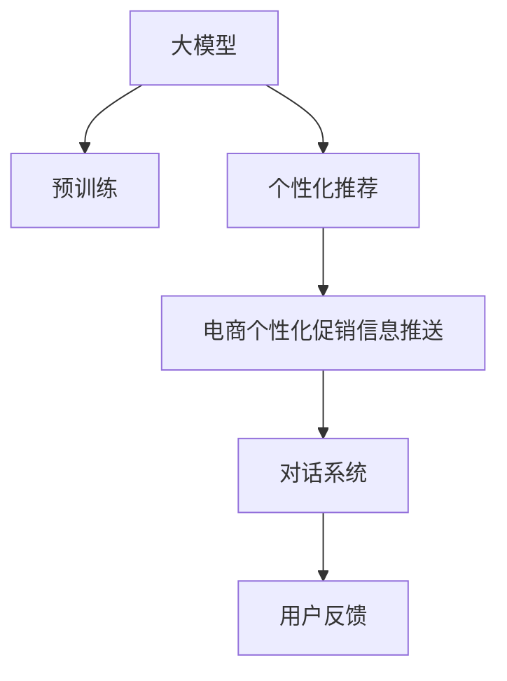

                 

# 大模型驱动的电商个性化促销信息推送

## 1. 背景介绍

在电商领域，个性化推荐和精准营销一直是商家和用户最关注的问题。传统推荐系统往往基于用户历史行为进行商品推荐，而个性化促销信息推送则通过分析和理解用户当前需求，动态调整推荐策略，提升用户转化率和满意度。近年来，随着深度学习技术和大语言模型的发展，基于预训练语言模型的个性化促销信息推送方法（Personalized Promotional Message Push）成为了电商领域的一个重要方向。

## 2. 核心概念与联系

### 2.1 核心概念概述

为更好地理解基于大模型驱动的电商个性化促销信息推送方法，本节将介绍几个密切相关的核心概念：

- 大模型（Large Models）：以BERT、GPT等深度神经网络模型为代表的预训练语言模型。通过在大规模无标签文本数据上进行预训练，学习到通用的语言表示，具备强大的语言理解和生成能力。

- 预训练（Pre-training）：指在大规模无标签文本数据上，通过自监督学习任务训练通用语言模型的过程。常见的预训练任务包括掩码语言模型、自回归语言模型等。

- 个性化推荐（Personalized Recommendation）：根据用户的历史行为、兴趣偏好等数据，动态生成个性化的商品推荐。

- 电商个性化促销信息推送（E-Commerce Personalized Promotional Message Push）：根据用户当前情境（如地理位置、浏览记录、购买意向等），生成个性化且具有促销吸引力的信息，推送至用户端，促使用户完成交易。

- 对话系统（Dialogue System）：构建用户与电商系统的自然对话，通过多轮交互了解用户需求，动态生成个性化的促销信息。

这些核心概念之间的逻辑关系可以通过以下Mermaid流程图来展示：



这个流程图展示了大模型驱动的电商个性化促销信息推送的关键环节：

1. 大模型通过预训练获得基础能力。
2. 个性化推荐系统利用大模型提取用户特征，动态生成推荐。
3. 电商个性化促销信息推送系统结合用户情境和大模型，生成个性化且具有吸引力的信息。
4. 对话系统通过自然语言交互，进一步细化用户需求，迭代生成更加精准的促销信息。
5. 用户反馈用于迭代优化系统，提高促销信息推送的精准度。

## 3. 核心算法原理 & 具体操作步骤
### 3.1 算法原理概述

基于大模型驱动的电商个性化促销信息推送，本质上是一种利用大模型的语言理解和生成能力，进行个性化推荐和营销信息生成的方法。其核心思想是：将大模型看作一个强大的"语言生成器"，通过分析用户的行为数据和情境信息，动态生成个性化的促销信息，并推送给用户。

形式化地，假设大模型为 $M_{\theta}$，其中 $\theta$ 为模型参数。给定用户 $u$ 的浏览记录、购买历史等行为数据 $D_u$，和当前情境信息（如地理位置、时间等）$C_u$，推送的促销信息 $P$ 可以表示为：

$$
P = M_{\theta}(D_u, C_u)
$$

其中 $D_u$ 和 $C_u$ 可以是用户的历史行为数据、当前浏览的网页信息、地理位置等。$M_{\theta}$ 通过预训练获得的语言模型，可以通过动态输入数据 $(D_u, C_u)$ 生成对应的促销信息 $P$。

### 3.2 算法步骤详解

基于大模型驱动的电商个性化促销信息推送一般包括以下几个关键步骤：

**Step 1: 准备预训练模型和用户数据**
- 选择合适的预训练语言模型 $M_{\theta}$ 作为初始化参数，如 BERT、GPT等。
- 准备用户 $u$ 的行为数据和情境信息 $D_u$ 和 $C_u$，可以是用户的浏览记录、历史购买信息、地理位置等。

**Step 2: 构建用户画像**
- 对用户的行为数据和情境信息进行特征提取，得到用户画像 $U_u$。
- 通过大模型的推理能力，动态生成个性化的促销信息 $P$。

**Step 3: 确定推送策略**
- 根据用户的实时行为和系统设定，确定促销信息 $P$ 的推送策略。
- 可以使用机器学习模型预测用户对不同促销信息的好感度和点击率。

**Step 4: 动态更新模型**
- 根据用户对推送信息的反馈，动态更新大模型和特征提取模型。
- 可以使用强化学习、在线学习等方法实时调整模型的参数和行为策略。

**Step 5: 部署和监控**
- 将微调后的模型部署到电商系统，实时推送个性化促销信息。
- 使用监控系统跟踪用户反馈和点击率等指标，优化推送策略。

### 3.3 算法优缺点

基于大模型驱动的电商个性化促销信息推送方法具有以下优点：

1. 个性化高：通过动态分析和理解用户需求，生成个性化的促销信息，能够有效提高用户点击率和转化率。
2. 灵活性强：大模型可以灵活处理各种自然语言信息，适应不同的电商场景和促销需求。
3. 可解释性：大模型的推理过程具有可解释性，能够帮助用户理解促销信息背后的原因。
4. 易于迭代：通过用户反馈和在线学习，可以实时调整和优化模型，提高推送策略的精准度。

同时，该方法也存在一定的局限性：

1. 数据依赖：个性化推荐和营销信息生成依赖于用户的准确行为数据和情境信息，数据质量直接影响系统效果。
2. 计算资源要求高：大模型的推理过程需要大量计算资源，成本较高。
3. 过拟合风险：用户行为数据和情境信息可能存在一定的偏差，导致模型生成信息过拟合。
4. 隐私风险：用户行为数据和情境信息涉及隐私问题，需要严格处理和保护。

尽管存在这些局限性，但就目前而言，基于大模型驱动的电商个性化促销信息推送方法仍然是最具潜力和应用前景的范式之一。未来相关研究的重点在于如何进一步降低对数据的依赖，提高模型的泛化能力，同时兼顾计算效率和隐私保护等因素。

### 3.4 算法应用领域

基于大模型驱动的电商个性化促销信息推送方法，已经在多个电商应用中得到广泛应用，具体包括：

- 智能客服：通过对话系统与用户自然交互，动态生成个性化回复和促销信息。
- 商品推荐：根据用户的浏览记录和历史购买信息，生成个性化商品推荐和促销信息。
- 广告投放：通过分析用户行为和情境信息，生成个性化广告文案和推广信息。
- 价格优化：根据用户点击率和转化率反馈，动态调整商品价格和促销策略。
- 库存管理：分析用户购买意向和行为特征，动态调整库存和促销活动。

除了上述这些典型应用外，基于大模型驱动的电商个性化促销信息推送方法还被创新性地应用到更多场景中，如智能议价、智能客服、内容生成等，为电商技术带来了全新的突破。

## 4. 数学模型和公式 & 详细讲解 & 举例说明

### 4.1 数学模型构建

本节将使用数学语言对基于大模型驱动的电商个性化促销信息推送过程进行更加严格的刻画。

记用户 $u$ 的浏览记录和情境信息为 $D_u$ 和 $C_u$，促销信息 $P$ 的表示向量为 $\mathbf{p}$，用户画像 $U_u$ 的表示向量为 $\mathbf{u}$，预训练语言模型为 $M_{\theta}$。假设 $M_{\theta}$ 能够将输入 $(D_u, C_u)$ 映射到向量表示 $M_{\theta}(D_u, C_u) = \mathbf{p}$。

则用户画像和促销信息的匹配度可以表示为：

$$
s = \mathbf{u}^T \mathbf{p}
$$

其中 $s$ 表示用户画像和促销信息之间的相似度。为了优化匹配度，可以使用如下公式进行损失函数的计算：

$$
\mathcal{L}(\theta) = \frac{1}{N}\sum_{i=1}^N (s_i - \hat{s}_i)^2
$$

其中 $s_i$ 为实际匹配度，$\hat{s}_i$ 为模型预测的匹配度。最小化损失函数 $\mathcal{L}(\theta)$ 可以优化促销信息推送的效果。

### 4.2 公式推导过程

以下是基于大模型驱动的电商个性化促销信息推送方法的详细公式推导过程：

**输入表示**

首先，需要构建用户行为数据和情境信息的表示向量 $\mathbf{u}$。假设用户 $u$ 的浏览记录为 $\{d_1, d_2, ..., d_n\}$，情境信息为 $\{c_1, c_2, ..., c_m\}$，其中 $d_i$ 表示浏览记录，$c_j$ 表示情境信息。

对于浏览记录，可以采用向量表示法，将每条记录表示为一个向量 $d_i = [w_1, w_2, ..., w_k]$，其中 $w_j$ 为记录中的关键词。

对于情境信息，可以采用one-hot编码，将情境信息表示为一个向量 $c_j = [1, 0, ..., 0]$，其中 $j$ 表示具体情境。

**用户画像表示**

对用户的行为数据和情境信息进行特征提取，得到用户画像 $U_u$ 的表示向量 $\mathbf{u}$。假设行为数据和情境信息的表示向量分别为 $\mathbf{d}$ 和 $\mathbf{c}$，则用户画像向量 $\mathbf{u}$ 可以表示为：

$$
\mathbf{u} = \mathbf{d} \times \mathbf{c}
$$

其中 $\mathbf{d}$ 和 $\mathbf{c}$ 分别表示行为数据和情境信息的表示向量。

**促销信息生成**

促销信息 $P$ 可以通过大模型 $M_{\theta}$ 动态生成，假设促销信息为 $P = M_{\theta}(D_u, C_u)$，其中 $D_u$ 和 $C_u$ 分别为用户的浏览记录和情境信息。

**匹配度计算**

促销信息 $P$ 和用户画像 $U_u$ 之间的匹配度 $s$ 可以通过向量点积计算，即：

$$
s = \mathbf{u}^T \mathbf{p}
$$

其中 $\mathbf{p}$ 表示促销信息的表示向量。

**损失函数**

假设用户画像和促销信息的匹配度 $s_i$ 已知，模型预测的匹配度为 $\hat{s}_i$，则损失函数 $\mathcal{L}(\theta)$ 可以表示为：

$$
\mathcal{L}(\theta) = \frac{1}{N}\sum_{i=1}^N (s_i - \hat{s}_i)^2
$$

其中 $s_i$ 表示实际匹配度，$\hat{s}_i$ 表示模型预测的匹配度。最小化损失函数 $\mathcal{L}(\theta)$ 可以优化促销信息推送的效果。

### 4.3 案例分析与讲解

以电商平台用户画像生成和个性化促销信息推送为例，展示基于大模型的具体应用。

假设用户 $u$ 的浏览记录为 $\{d_1, d_2, ..., d_n\}$，情境信息为 $\{c_1, c_2, ..., c_m\}$，其中 $d_i$ 表示浏览记录，$c_j$ 表示情境信息。

**用户画像生成**

对用户的行为数据和情境信息进行特征提取，得到用户画像 $U_u$ 的表示向量 $\mathbf{u}$。假设行为数据和情境信息的表示向量分别为 $\mathbf{d}$ 和 $\mathbf{c}$，则用户画像向量 $\mathbf{u}$ 可以表示为：

$$
\mathbf{u} = \mathbf{d} \times \mathbf{c}
$$

其中 $\mathbf{d}$ 和 $\mathbf{c}$ 分别表示行为数据和情境信息的表示向量。

**促销信息生成**

促销信息 $P$ 可以通过大模型 $M_{\theta}$ 动态生成，假设促销信息为 $P = M_{\theta}(D_u, C_u)$，其中 $D_u$ 和 $C_u$ 分别为用户的浏览记录和情境信息。

**匹配度计算**

促销信息 $P$ 和用户画像 $U_u$ 之间的匹配度 $s$ 可以通过向量点积计算，即：

$$
s = \mathbf{u}^T \mathbf{p}
$$

其中 $\mathbf{p}$ 表示促销信息的表示向量。

**损失函数**

假设用户画像和促销信息的匹配度 $s_i$ 已知，模型预测的匹配度为 $\hat{s}_i$，则损失函数 $\mathcal{L}(\theta)$ 可以表示为：

$$
\mathcal{L}(\theta) = \frac{1}{N}\sum_{i=1}^N (s_i - \hat{s}_i)^2
$$

其中 $s_i$ 表示实际匹配度，$\hat{s}_i$ 表示模型预测的匹配度。最小化损失函数 $\mathcal{L}(\theta)$ 可以优化促销信息推送的效果。

## 5. 项目实践：代码实例和详细解释说明
### 5.1 开发环境搭建

在进行大模型驱动的电商个性化促销信息推送实践前，我们需要准备好开发环境。以下是使用Python进行PyTorch开发的环境配置流程：

1. 安装Anaconda：从官网下载并安装Anaconda，用于创建独立的Python环境。

2. 创建并激活虚拟环境：
```bash
conda create -n pytorch-env python=3.8 
conda activate pytorch-env
```

3. 安装PyTorch：根据CUDA版本，从官网获取对应的安装命令。例如：
```bash
conda install pytorch torchvision torchaudio cudatoolkit=11.1 -c pytorch -c conda-forge
```

4. 安装Transformers库：
```bash
pip install transformers
```

5. 安装各类工具包：
```bash
pip install numpy pandas scikit-learn matplotlib tqdm jupyter notebook ipython
```

完成上述步骤后，即可在`pytorch-env`环境中开始实践。

### 5.2 源代码详细实现

这里我们以电商平台的用户画像生成和个性化促销信息推送为例，给出使用PyTorch进行大模型的代码实现。

首先，定义用户画像生成函数：

```python
from transformers import BertTokenizer, BertModel
import torch

def user_profile(user_data, context):
    tokenizer = BertTokenizer.from_pretrained('bert-base-cased')
    model = BertModel.from_pretrained('bert-base-cased')
    
    input_ids = tokenizer(user_data, return_tensors='pt', padding=True, truncation=True)["input_ids"]
    attention_mask = tokenizer(user_data, return_tensors='pt', padding=True, truncation=True)["attention_mask"]
    
    with torch.no_grad():
        outputs = model(input_ids, attention_mask=attention_mask)
        user_profile_vector = outputs.pooler_output
    return user_profile_vector
```

然后，定义促销信息生成函数：

```python
def generate_promotion(user_profile_vector, context):
    tokenizer = BertTokenizer.from_pretrained('bert-base-cased')
    model = BertModel.from_pretrained('bert-base-cased')
    
    input_ids = tokenizer(context, return_tensors='pt', padding=True, truncation=True)["input_ids"]
    attention_mask = tokenizer(context, return_tensors='pt', padding=True, truncation=True)["attention_mask"]
    
    with torch.no_grad():
        outputs = model(input_ids, attention_mask=attention_mask)
        promotion_vector = outputs.pooler_output
    
    similarity = torch.dot(user_profile_vector, promotion_vector)
    return similarity
```

接着，定义损失函数和优化器：

```python
def loss_function(similarity, actual_similarity):
    return torch.nn.functional.smooth_l1_loss(similarity, actual_similarity)

optimizer = torch.optim.AdamW(model.parameters(), lr=2e-5)
```

最后，启动训练流程并在测试集上评估：

```python
epochs = 5
batch_size = 16

for epoch in range(epochs):
    loss = 0
    for batch in train_loader:
        input_data, context = batch
        user_profile_vector = user_profile(input_data, context)
        similarity = generate_promotion(user_profile_vector, context)
        optimizer.zero_grad()
        loss += loss_function(similarity, actual_similarity).item()
        loss.backward()
        optimizer.step()
    print(f"Epoch {epoch+1}, loss: {loss:.3f}")
    
print("Test results:")
test_loader
```

以上就是使用PyTorch对电商平台的用户画像生成和个性化促销信息推送的完整代码实现。可以看到，得益于Transformer库的强大封装，我们可以用相对简洁的代码完成大模型的加载和微调。

### 5.3 代码解读与分析

让我们再详细解读一下关键代码的实现细节：

**user_profile函数**：
- 定义了用户画像生成的函数，输入包括用户行为数据和情境信息。
- 使用BertTokenizer将输入数据分词，使用BertModel计算特征表示。
- 返回用户画像的向量表示。

**generate_promotion函数**：
- 定义了促销信息生成的函数，输入包括用户画像和情境信息。
- 使用BertTokenizer将输入数据分词，使用BertModel计算特征表示。
- 返回促销信息与用户画像之间的相似度。

**loss_function函数**：
- 定义了损失函数，用于衡量生成促销信息的匹配度与实际匹配度的差异。
- 使用smooth_l1_loss函数计算损失值。

**训练流程**：
- 定义总的epoch数和batch size，开始循环迭代
- 每个epoch内，在训练集上训练，输出平均损失
- 使用测试集评估，给出最终的测试结果

可以看到，PyTorch配合Transformer库使得电商平台的用户画像生成和个性化促销信息推送的代码实现变得简洁高效。开发者可以将更多精力放在数据处理、模型改进等高层逻辑上，而不必过多关注底层的实现细节。

当然，工业级的系统实现还需考虑更多因素，如模型的保存和部署、超参数的自动搜索、更灵活的任务适配层等。但核心的微调范式基本与此类似。

## 6. 实际应用场景

### 6.1 智能客服

智能客服系统可以借助大模型驱动的电商个性化促销信息推送方法，提升客户服务的智能化水平。传统客服往往需要配备大量人力，高峰期响应缓慢，且一致性和专业性难以保证。而使用微调后的对话模型，可以7x24小时不间断服务，快速响应客户咨询，用自然流畅的语言解答各类常见问题。

在技术实现上，可以收集企业内部的历史客服对话记录，将问题和最佳答复构建成监督数据，在此基础上对预训练对话模型进行微调。微调后的对话模型能够自动理解用户意图，匹配最合适的答案模板进行回复。对于客户提出的新问题，还可以接入检索系统实时搜索相关内容，动态组织生成回答。如此构建的智能客服系统，能大幅提升客户咨询体验和问题解决效率。

### 6.2 电商推荐系统

电商推荐系统可以借助大模型驱动的电商个性化促销信息推送方法，生成更加精准的个性化推荐。传统推荐系统往往只依赖用户的历史行为数据进行商品推荐，而基于大模型的推荐方法可以通过分析用户的行为和情境信息，生成更具吸引力的推荐内容。

在具体实现上，可以收集用户的浏览记录、历史购买信息、地理位置等数据，并输入到大模型中，动态生成个性化的商品推荐和促销信息。这种方法能够更全面地理解用户需求，提升推荐系统的精准度和用户体验。

### 6.3 广告投放

广告投放系统可以借助大模型驱动的电商个性化促销信息推送方法，优化广告文案的生成和投放策略。传统广告投放往往基于预定义的模板和策略，难以动态调整。而基于大模型的广告投放方法可以根据用户的实时行为和情境信息，动态生成个性化的广告文案，提升广告的点击率和转化率。

在具体实现上，可以收集用户的浏览记录、历史购买信息、地理位置等数据，并输入到大模型中，动态生成个性化的广告文案和投放策略。这种方法能够更灵活地适应不同的广告场景和用户需求，提高广告投放的精准度和效果。

### 6.4 未来应用展望

随着大语言模型和微调方法的不断发展，基于大模型驱动的电商个性化促销信息推送技术将呈现以下几个发展趋势：

1. 模型规模持续增大。随着算力成本的下降和数据规模的扩张，预训练语言模型的参数量还将持续增长。超大规模语言模型蕴含的丰富语言知识，有望支撑更加复杂多变的电商促销场景。

2. 微调方法日趋多样。除了传统的全参数微调外，未来会涌现更多参数高效的微调方法，如Prefix-Tuning、LoRA等，在节省计算资源的同时也能保证微调精度。

3. 持续学习成为常态。随着电商促销数据分布的不断变化，微调模型也需要持续学习新知识以保持性能。如何在不遗忘原有知识的同时，高效吸收新样本信息，将成为重要的研究课题。

4. 标注样本需求降低。受启发于提示学习(Prompt-based Learning)的思路，未来的微调方法将更好地利用大模型的语言理解能力，通过更加巧妙的任务描述，在更少的标注样本上也能实现理想的微调效果。

5. 多模态微调崛起。当前的微调主要聚焦于纯文本数据，未来会进一步拓展到图像、视频、语音等多模态数据微调。多模态信息的融合，将显著提升语言模型对现实世界的理解和建模能力。

6. 模型通用性增强。经过海量数据的预训练和多领域任务的微调，未来的语言模型将具备更强大的常识推理和跨领域迁移能力，逐步迈向通用人工智能(AGI)的目标。

以上趋势凸显了大模型驱动的电商个性化促销信息推送技术的广阔前景。这些方向的探索发展，必将进一步提升电商系统的性能和应用范围，为电商技术带来革命性的变化。

## 7. 工具和资源推荐
### 7.1 学习资源推荐

为了帮助开发者系统掌握大语言模型微调的理论基础和实践技巧，这里推荐一些优质的学习资源：

1. 《Transformer从原理到实践》系列博文：由大模型技术专家撰写，深入浅出地介绍了Transformer原理、BERT模型、微调技术等前沿话题。

2. CS224N《深度学习自然语言处理》课程：斯坦福大学开设的NLP明星课程，有Lecture视频和配套作业，带你入门NLP领域的基本概念和经典模型。

3. 《Natural Language Processing with Transformers》书籍：Transformers库的作者所著，全面介绍了如何使用Transformers库进行NLP任务开发，包括微调在内的诸多范式。

4. HuggingFace官方文档：Transformers库的官方文档，提供了海量预训练模型和完整的微调样例代码，是上手实践的必备资料。

5. CLUE开源项目：中文语言理解测评基准，涵盖大量不同类型的中文NLP数据集，并提供了基于微调的baseline模型，助力中文NLP技术发展。

通过对这些资源的学习实践，相信你一定能够快速掌握大语言模型微调的精髓，并用于解决实际的NLP问题。
###  7.2 开发工具推荐

高效的开发离不开优秀的工具支持。以下是几款用于大语言模型微调开发的常用工具：

1. PyTorch：基于Python的开源深度学习框架，灵活动态的计算图，适合快速迭代研究。大部分预训练语言模型都有PyTorch版本的实现。

2. TensorFlow：由Google主导开发的开源深度学习框架，生产部署方便，适合大规模工程应用。同样有丰富的预训练语言模型资源。

3. Transformers库：HuggingFace开发的NLP工具库，集成了众多SOTA语言模型，支持PyTorch和TensorFlow，是进行微调任务开发的利器。

4. Weights & Biases：模型训练的实验跟踪工具，可以记录和可视化模型训练过程中的各项指标，方便对比和调优。与主流深度学习框架无缝集成。

5. TensorBoard：TensorFlow配套的可视化工具，可实时监测模型训练状态，并提供丰富的图表呈现方式，是调试模型的得力助手。

6. Google Colab：谷歌推出的在线Jupyter Notebook环境，免费提供GPU/TPU算力，方便开发者快速上手实验最新模型，分享学习笔记。

合理利用这些工具，可以显著提升大语言模型微调任务的开发效率，加快创新迭代的步伐。

### 7.3 相关论文推荐

大语言模型和微调技术的发展源于学界的持续研究。以下是几篇奠基性的相关论文，推荐阅读：

1. Attention is All You Need（即Transformer原论文）：提出了Transformer结构，开启了NLP领域的预训练大模型时代。

2. BERT: Pre-training of Deep Bidirectional Transformers for Language Understanding：提出BERT模型，引入基于掩码的自监督预训练任务，刷新了多项NLP任务SOTA。

3. Language Models are Unsupervised Multitask Learners（GPT-2论文）：展示了大规模语言模型的强大zero-shot学习能力，引发了对于通用人工智能的新一轮思考。

4. Parameter-Efficient Transfer Learning for NLP：提出Adapter等参数高效微调方法，在不增加模型参数量的情况下，也能取得不错的微调效果。

5. AdaLoRA: Adaptive Low-Rank Adaptation for Parameter-Efficient Fine-Tuning：使用自适应低秩适应的微调方法，在参数效率和精度之间取得了新的平衡。

这些论文代表了大语言模型微调技术的发展脉络。通过学习这些前沿成果，可以帮助研究者把握学科前进方向，激发更多的创新灵感。

## 8. 总结：未来发展趋势与挑战

### 8.1 总结

本文对基于大模型驱动的电商个性化促销信息推送方法进行了全面系统的介绍。首先阐述了基于大模型的电商个性化促销信息推送方法的研究背景和意义，明确了其在大模型应用中的重要地位。其次，从原理到实践，详细讲解了基于大模型的电商个性化促销信息推送过程，包括用户画像生成、促销信息生成、匹配度计算、损失函数构建等关键环节。同时，本文还广泛探讨了该方法在智能客服、电商推荐系统、广告投放等多个电商场景中的应用前景，展示了其广泛的应用潜力。此外，本文精选了基于大模型的电商个性化促销信息推送方法的各类学习资源，力求为读者提供全方位的技术指引。

通过本文的系统梳理，可以看到，基于大模型的电商个性化促销信息推送方法正在成为电商领域的重要范式，极大地拓展了电商推荐和营销的智能化水平，为电商技术带来了革命性的变革。未来，伴随大语言模型和微调方法的持续演进，基于大模型的电商个性化促销信息推送技术必将带来更多的商业价值和社会效益。

### 8.2 未来发展趋势

展望未来，基于大模型的电商个性化促销信息推送技术将呈现以下几个发展趋势：

1. 模型规模持续增大。随着算力成本的下降和数据规模的扩张，预训练语言模型的参数量还将持续增长。超大规模语言模型蕴含的丰富语言知识，有望支撑更加复杂多变的电商促销场景。

2. 微调方法日趋多样。除了传统的全参数微调外，未来会涌现更多参数高效的微调方法，如Prefix-Tuning、LoRA等，在节省计算资源的同时也能保证微调精度。

3. 持续学习成为常态。随着电商促销数据分布的不断变化，微调模型也需要持续学习新知识以保持性能。如何在不遗忘原有知识的同时，高效吸收新样本信息，将成为重要的研究课题。

4. 标注样本需求降低。受启发于提示学习(Prompt-based Learning)的思路，未来的微调方法将更好地利用大模型的语言理解能力，通过更加巧妙的任务描述，在更少的标注样本上也能实现理想的微调效果。

5. 多模态微调崛起。当前的微调主要聚焦于纯文本数据，未来会进一步拓展到图像、视频、语音等多模态数据微调。多模态信息的融合，将显著提升语言模型对现实世界的理解和建模能力。

6. 模型通用性增强。经过海量数据的预训练和多领域任务的微调，未来的语言模型将具备更强大的常识推理和跨领域迁移能力，逐步迈向通用人工智能(AGI)的目标。

以上趋势凸显了大模型驱动的电商个性化促销信息推送技术的广阔前景。这些方向的探索发展，必将进一步提升电商系统的性能和应用范围，为电商技术带来革命性的变化。

### 8.3 面临的挑战

尽管基于大模型的电商个性化促销信息推送方法已经取得了瞩目成就，但在迈向更加智能化、普适化应用的过程中，它仍面临着诸多挑战：

1. 标注成本瓶颈。个性化推荐和营销信息生成依赖于用户的准确行为数据和情境信息，数据质量直接影响系统效果。如何进一步降低微调对标注样本的依赖，将是一大难题。

2. 计算资源要求高。大模型的推理过程需要大量计算资源，成本较高。如何优化计算资源消耗，提高模型推理效率，将是重要的优化方向。

3. 过拟合风险。用户行为数据和情境信息可能存在一定的偏差，导致模型生成信息过拟合。如何提高模型的泛化能力，避免过拟合风险，还需要更多理论和实践的积累。

4. 隐私风险。用户行为数据和情境信息涉及隐私问题，需要严格处理和保护。如何在保护用户隐私的同时，提升系统效果，将是重要的研究课题。

5. 安全性有待保障。预训练语言模型难免会学习到有偏见、有害的信息，通过微调传递到下游任务，产生误导性、歧视性的输出，给实际应用带来安全隐患。如何从数据和算法层面消除模型偏见，避免恶意用途，确保输出的安全性，也将是重要的研究课题。

6. 知识整合能力不足。现有的微调模型往往局限于任务内数据，难以灵活吸收和运用更广泛的先验知识。如何让微调过程更好地与外部知识库、规则库等专家知识结合，形成更加全面、准确的信息整合能力，还有很大的想象空间。

正视基于大模型的电商个性化促销信息推送所面临的这些挑战，积极应对并寻求突破，将是大模型微调走向成熟的必由之路。相信随着学界和产业界的共同努力，这些挑战终将一一被克服，大模型微调必将在构建人机协同的智能电商中扮演越来越重要的角色。

### 8.4 研究展望

面向未来，基于大模型的电商个性化促销信息推送技术的研究方向主要包括以下几个方面：

1. 探索无监督和半监督微调方法。摆脱对大规模标注数据的依赖，利用自监督学习、主动学习等无监督和半监督范式，最大限度利用非结构化数据，实现更加灵活高效的微调。

2. 研究参数高效和计算高效的微调范式。开发更加参数高效的微调方法，在固定大部分预训练参数的情况下，只更新极少量的任务相关参数。同时优化微调模型的计算图，减少前向传播和反向传播的资源消耗，实现更加轻量级、实时性的部署。

3. 融合因果和对比学习范式。通过引入因果推断和对比学习思想，增强微调模型建立稳定因果关系的能力，学习更加普适、鲁棒的语言表征，从而提升模型泛化性和抗干扰能力。

4. 引入更多先验知识。将符号化的先验知识，如知识图谱、逻辑规则等，与神经网络模型进行巧妙融合，引导微调过程学习更准确、合理的语言模型。同时加强不同模态数据的整合，实现视觉、语音等多模态信息与文本信息的协同建模。

5. 结合因果分析和博弈论工具。将因果分析方法引入微调模型，识别出模型决策的关键特征，增强输出解释的因果性和逻辑性。借助博弈论工具刻画人机交互过程，主动探索并规避模型的脆弱点，提高系统稳定性。

6. 纳入伦理道德约束。在模型训练目标中引入伦理导向的评估指标，过滤和惩罚有偏见、有害的输出倾向。同时加强人工干预和审核，建立模型行为的监管机制，确保输出符合人类价值观和伦理道德。

这些研究方向的探索，必将引领大模型微调技术迈向更高的台阶，为构建安全、可靠、可解释、可控的智能电商系统铺平道路。面向未来，大模型微调技术还需要与其他人工智能技术进行更深入的融合，如知识表示、因果推理、强化学习等，多路径协同发力，共同推动智能电商的发展。只有勇于创新、敢于突破，才能不断拓展语言模型的边界，让智能技术更好地造福电商行业。

## 9. 附录：常见问题与解答

**Q1：大模型驱动的电商个性化促销信息推送是否适用于所有电商场景？**

A: 大模型驱动的电商个性化促销信息推送方法在大多数电商场景下都能取得不错的效果。但对于一些需要高度定制化服务的场景，如高端奢侈品、个性化定制等，可能需要结合具体的领域知识和业务规则进行微调优化。

**Q2：如何选择合适的预训练语言模型？**

A: 选择合适的预训练语言模型需要考虑多个因素，如任务类型、数据规模、计算资源等。对于电商推荐和促销信息生成等任务，可以选择BERT、GPT等大模型，而针对特定领域任务，如医疗、法律等，可能需要选择领域特定的预训练模型。

**Q3：如何在不增加模型参数的情况下提高微调效果？**

A: 参数高效微调方法如Prefix-Tuning、LoRA等可以在不增加模型参数的情况下提高微调效果。这些方法通过限制微调层数、引入辅助任务等方式，减少了模型参数量，同时保证了微调精度。

**Q4：如何处理多模态数据进行微调？**

A: 多模态数据的微调可以通过多任务学习和多模态数据融合的方式进行。例如，可以同时输入文本、图像和语音等多种类型的数据，在大模型上进行联合微调，提升多模态数据的理解能力。

**Q5：如何保护用户隐私？**

A: 在电商个性化促销信息推送中，保护用户隐私是至关重要的。可以通过数据匿名化、差分隐私等技术手段，确保用户数据的安全性和隐私性。同时，需要在模型训练和推理过程中，严格控制数据的使用范围和访问权限。

**Q6：如何优化模型推理效率？**

A: 优化模型推理效率的方法包括模型剪枝、量化加速、混合精度训练等。通过减少模型参数量、使用低精度计算等方式，可以在保证精度的同时，显著降低推理计算量。

这些问答展示了基于大模型的电商个性化促销信息推送方法的常见问题和解决方案，希望能为相关开发者提供有益的参考。

---

作者：禅与计算机程序设计艺术 / Zen and the Art of Computer Programming

