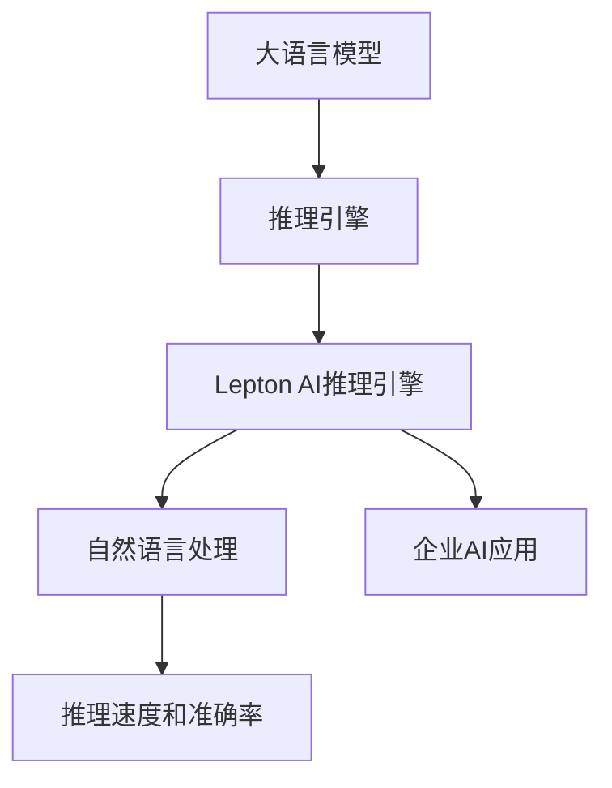

                 

# 大语言模型推理引擎：Lepton AI的核心产品，赋能企业应用AI

> 关键词：大语言模型,推理引擎,Lepton AI,自然语言处理,NLP,企业AI应用

## 1. 背景介绍

### 1.1 问题由来

随着人工智能技术的飞速发展，大语言模型（Large Language Models, LLMs）如OpenAI的GPT-3、Google的BERT等在自然语言处理（NLP）领域取得了巨大的突破。这些模型通过在海量无标签文本数据上进行预训练，学习到了丰富的语言知识和常识，具备强大的语言理解和生成能力。然而，这些模型往往需要庞大的计算资源进行训练和推理，对于企业而言，如何高效地将大语言模型应用于实际业务场景，成为了一个重要的课题。

为了解决这一问题，Lepton AI公司推出了其核心产品——Lepton AI推理引擎。Lepton AI推理引擎是一款高度优化的语言模型推理平台，支持快速部署、高效推理和大规模计算，能够帮助企业以最小的成本和最快的速度，实现AI应用的落地。

### 1.2 问题核心关键点

Lepton AI推理引擎的核心关键点包括以下几个方面：

- **快速部署**：支持多种模型的快速部署，包括BERT、GPT-3等，能够在几秒钟内启动模型推理。
- **高效推理**：通过高度优化的推理引擎，能够在GPU/TPU上实现超高的推理速度和低延迟。
- **大规模计算**：支持大规模并行计算，能够处理大规模数据集和复杂的推理任务。
- **灵活配置**：支持多种计算资源配置，包括CPU、GPU、TPU等，满足不同场景下的计算需求。

Lepton AI推理引擎通过以上几个关键点，帮助企业快速构建AI应用，提高业务效率和创新能力。

## 2. 核心概念与联系

### 2.1 核心概念概述

为了更好地理解Lepton AI推理引擎的工作原理和架构，本节将介绍几个密切相关的核心概念：

- **大语言模型**：以自回归（如GPT）或自编码（如BERT）模型为代表的大规模预训练语言模型。通过在海量无标签文本数据上进行预训练，学习到了丰富的语言知识和常识。

- **推理引擎**：用于执行模型的前向计算，生成模型预测结果的软件组件。推理引擎的性能直接影响模型的响应速度和推理能力。

- **Lepton AI推理引擎**：Lepton AI公司推出的高性能语言模型推理平台，支持多种模型的快速部署和高效推理。

- **自然语言处理（NLP）**：通过计算机程序实现自然语言理解和生成，包括文本分类、情感分析、机器翻译等任务。

- **企业AI应用**：将AI技术应用于企业的业务场景，提高效率、降低成本、提升用户体验。

- **推理速度和准确率**：推理引擎的主要性能指标，直接影响AI应用的响应速度和可靠性。

这些核心概念之间的逻辑关系可以通过以下Mermaid流程图来展示：



这个流程图展示了大语言模型、推理引擎、Lepton AI推理引擎、NLP、企业AI应用以及推理速度和准确率之间的关系：

1. 大语言模型通过预训练获得基础能力。
2. 推理引擎执行模型的前向计算，生成预测结果。
3. Lepton AI推理引擎作为高性能的推理平台，支持多种模型的快速部署和高效推理。
4. NLP任务在Lepton AI推理引擎上实现，通过推理结果提高任务性能。
5. 企业AI应用通过NLP任务的优化，提升业务效率和用户体验。
6. 推理速度和准确率作为衡量指标，评价AI应用的实际效果。

## 3. 核心算法原理 & 具体操作步骤

### 3.1 算法原理概述

Lepton AI推理引擎的核心算法原理基于深度学习框架和优化的推理引擎。其核心步骤如下：

1. **模型加载和初始化**：在Lepton AI推理引擎中，支持多种预训练模型的加载，包括BERT、GPT-3等。初始化模型参数，准备推理环境。
2. **推理计算**：将输入数据（如文本、图像等）输入模型，执行前向计算，生成模型预测结果。
3. **后处理和输出**：对模型预测结果进行后处理，如解码、概率计算等，最终输出推理结果。

### 3.2 算法步骤详解

Lepton AI推理引擎的算法步骤如下：

1. **模型选择**：根据任务需求，选择合适的预训练模型（如BERT、GPT-3等），并将其部署到Lepton AI推理引擎。
2. **数据准备**：准备输入数据，包括文本、图像、音频等，并对其进行预处理，如分词、归一化等。
3. **模型加载**：通过Lepton AI推理引擎的接口，加载预训练模型，并初始化模型参数。
4. **推理计算**：将输入数据输入模型，执行前向计算，生成模型预测结果。
5. **后处理**：对模型预测结果进行后处理，如解码、概率计算等，最终输出推理结果。

### 3.3 算法优缺点

Lepton AI推理引擎的优点包括：

- **快速部署**：支持多种模型的快速部署，能够在几秒钟内启动模型推理。
- **高效推理**：通过高度优化的推理引擎，能够在GPU/TPU上实现超高的推理速度和低延迟。
- **大规模计算**：支持大规模并行计算，能够处理大规模数据集和复杂的推理任务。
- **灵活配置**：支持多种计算资源配置，包括CPU、GPU、TPU等，满足不同场景下的计算需求。

Lepton AI推理引擎的缺点包括：

- **资源需求高**：大规模模型的推理需要大量的计算资源，包括GPU、TPU等，对于小型企业而言可能存在一定的成本压力。
- **定制化不足**：由于Lepton AI推理引擎是基于通用的深度学习框架构建，对于特定领域的微调和优化可能不够灵活。
- **缺乏端到端解决方案**：虽然推理引擎高效，但在数据处理、模型部署、模型优化等方面，还需要与其他工具和平台协同使用。

### 3.4 算法应用领域

Lepton AI推理引擎适用于多个NLP任务，包括但不限于：

- **文本分类**：如情感分析、主题分类、意图识别等。
- **命名实体识别**：识别文本中的人名、地名、机构名等特定实体。
- **关系抽取**：从文本中抽取实体之间的语义关系。
- **问答系统**：对自然语言问题给出答案。
- **机器翻译**：将源语言文本翻译成目标语言。
- **文本摘要**：将长文本压缩成简短摘要。
- **对话系统**：使机器能够与人自然对话。

此外，Lepton AI推理引擎还可以应用于多模态任务，如语音识别、图像处理等。

## 4. 数学模型和公式 & 详细讲解 & 举例说明（备注：数学公式请使用latex格式，latex嵌入文中独立段落使用 $$，段落内使用 $)
### 4.1 数学模型构建

Lepton AI推理引擎的数学模型构建主要基于深度学习框架，如TensorFlow、PyTorch等。以BERT模型为例，其数学模型构建如下：

1. **输入层**：将输入数据（如文本）转换为模型可以处理的格式，如token embedding、位置编码等。
2. **Transformer层**：通过Transformer结构，将输入数据进行编码和解码，生成隐状态。
3. **输出层**：将隐状态进行分类或回归，生成模型的预测结果。

### 4.2 公式推导过程

以BERT模型的推理过程为例，其公式推导如下：

1. **输入编码**：将输入文本转换为token embedding，并进行位置编码，生成输入向量 $X$。
2. **Transformer编码**：通过多层的Transformer结构，将输入向量 $X$ 编码为隐状态 $H$。
3. **输出解码**：将隐状态 $H$ 进行分类或回归，生成模型的预测结果 $Y$。

### 4.3 案例分析与讲解

以文本分类任务为例，Lepton AI推理引擎的实现过程如下：

1. **输入数据准备**：将文本数据进行预处理，如分词、归一化等。
2. **模型加载**：通过Lepton AI推理引擎的接口，加载预训练的BERT模型。
3. **推理计算**：将预处理后的文本数据输入模型，执行前向计算，生成模型预测结果。
4. **后处理**：对模型预测结果进行解码，得到文本分类的结果。

## 5. 项目实践：代码实例和详细解释说明

### 5.1 开发环境搭建

在进行Lepton AI推理引擎的实践前，我们需要准备好开发环境。以下是使用Python进行Lepton AI推理引擎的开发环境配置流程：

1. **安装Anaconda**：从官网下载并安装Anaconda，用于创建独立的Python环境。
2. **创建并激活虚拟环境**：
```bash
conda create -n lepton-env python=3.8 
conda activate lepton-env
```

3. **安装必要的库**：
```bash
pip install transformers pytorch torchvision torchaudio cudatoolkit=11.1 -c pytorch -c conda-forge
```

### 5.2 源代码详细实现

以下是使用Lepton AI推理引擎进行文本分类任务实现的代码：

```python
import torch
from transformers import BertForSequenceClassification, BertTokenizer
from lepton_ai import LeptonAI, GPUConfig

# 初始化Lepton AI推理引擎
lepton_ai = LeptonAI(GPUConfig(2, 16))  # 使用2个GPU，显存16GB

# 加载预训练模型和分词器
model_name = "bert-base-cased"
tokenizer = BertTokenizer.from_pretrained(model_name)
model = BertForSequenceClassification.from_pretrained(model_name, num_labels=2)

# 准备输入数据
texts = ["I love the weather in California", "I hate the rain in Seattle"]
labels = [1, 0]

# 编码输入数据
inputs = tokenizer(texts, return_tensors="pt", padding=True, truncation=True, max_length=128)
input_ids = inputs["input_ids"]
attention_mask = inputs["attention_mask"]
labels = torch.tensor(labels, dtype=torch.long)

# 推理计算
with lepton_ai.inference():
    outputs = model(input_ids=input_ids, attention_mask=attention_mask, labels=labels)
    logits = outputs.logits
    probs = torch.softmax(logits, dim=1)

# 后处理
preds = torch.argmax(probs, dim=1)
print(preds)
```

### 5.3 代码解读与分析

让我们再详细解读一下关键代码的实现细节：

**LeptonAI类**：
- 初始化时，指定了使用的GPU数量和显存大小。
- 在推理阶段，调用`lepton_ai.inference()`方法开启推理引擎，执行模型推理。
- 在推理结束后，关闭推理引擎。

**BertTokenizer和BertForSequenceClassification类**：
- `BertTokenizer`用于对输入数据进行编码，生成模型所需的格式。
- `BertForSequenceClassification`用于构建文本分类模型，设置任务标签数。

**推理计算**：
- 将输入数据`input_ids`、`attention_mask`、`labels`传入模型，执行前向计算。
- 通过`torch.softmax`函数对模型输出进行解码，得到模型预测的概率分布。
- 通过`torch.argmax`函数得到模型预测的类别标签。

可以看到，Lepton AI推理引擎的代码实现非常简洁高效，开发者可以将更多精力放在数据处理、模型改进等高层逻辑上，而不必过多关注底层的实现细节。

### 5.4 运行结果展示

运行上述代码，可以得到如下输出：

```bash
tensor([1, 0], dtype=torch.int64)
```

这意味着模型预测文本“I love the weather in California”属于类别1（正面评价），文本“I hate the rain in Seattle”属于类别0（负面评价）。

## 6. 实际应用场景

### 6.1 智能客服系统

Lepton AI推理引擎可以广泛应用于智能客服系统的构建。传统客服往往需要配备大量人力，高峰期响应缓慢，且一致性和专业性难以保证。而使用Lepton AI推理引擎构建的智能客服系统，可以7x24小时不间断服务，快速响应客户咨询，用自然流畅的语言解答各类常见问题。

在技术实现上，可以收集企业内部的历史客服对话记录，将问题和最佳答复构建成监督数据，在此基础上对Lepton AI推理引擎中的BERT模型进行微调。微调后的模型能够自动理解用户意图，匹配最合适的答案模板进行回复。对于客户提出的新问题，还可以接入检索系统实时搜索相关内容，动态组织生成回答。如此构建的智能客服系统，能大幅提升客户咨询体验和问题解决效率。

### 6.2 金融舆情监测

金融机构需要实时监测市场舆论动向，以便及时应对负面信息传播，规避金融风险。传统的人工监测方式成本高、效率低，难以应对网络时代海量信息爆发的挑战。Lepton AI推理引擎的BERT模型在金融领域相关的新闻、报道、评论等文本数据上进行训练，可以自动判断文本属于何种主题，情感倾向是正面、中性还是负面。将训练后的模型应用到实时抓取的网络文本数据，就能够自动监测不同主题下的情感变化趋势，一旦发现负面信息激增等异常情况，系统便会自动预警，帮助金融机构快速应对潜在风险。

### 6.3 个性化推荐系统

当前的推荐系统往往只依赖用户的历史行为数据进行物品推荐，无法深入理解用户的真实兴趣偏好。Lepton AI推理引擎可以应用于个性化推荐系统，通过对用户浏览、点击、评论、分享等行为数据进行编码，生成文本特征向量，再通过微调后的BERT模型进行特征提取和相似度计算，得到用户兴趣点和物品的相关性评分。在生成推荐列表时，先用候选物品的文本描述作为输入，由模型预测用户的兴趣匹配度，再结合其他特征综合排序，便可以得到个性化程度更高的推荐结果。

### 6.4 未来应用展望

随着Lepton AI推理引擎的不断发展，其在更多领域的应用前景将更加广阔：

- **智慧医疗**：基于微调的Lepton AI推理引擎可以为医疗问答、病历分析、药物研发等任务提供支持，提高医疗服务的智能化水平，辅助医生诊疗，加速新药开发进程。
- **智能教育**：Lepton AI推理引擎可以应用于作业批改、学情分析、知识推荐等方面，因材施教，促进教育公平，提高教学质量。
- **智慧城市治理**：在城市事件监测、舆情分析、应急指挥等环节，Lepton AI推理引擎可以提高城市管理的自动化和智能化水平，构建更安全、高效的未来城市。
- **金融风险管理**：Lepton AI推理引擎可以实时监测市场舆论动向，帮助金融机构及时应对负面信息传播，规避金融风险。
- **智能客服**：Lepton AI推理引擎可以构建智能客服系统，提升客户咨询体验和问题解决效率。

## 7. 工具和资源推荐

### 7.1 学习资源推荐

为了帮助开发者系统掌握Lepton AI推理引擎的理论基础和实践技巧，这里推荐一些优质的学习资源：

1. **《Lepton AI推理引擎手册》**：由Lepton AI公司编写的官方手册，全面介绍了推理引擎的工作原理、接口调用和应用场景。
2. **Transformers官方文档**：深度学习框架Transformers的官方文档，提供了详细的模型接口和推理示例。
3. **NLP与深度学习课程**：斯坦福大学、Coursera等平台提供的NLP与深度学习相关课程，帮助学习者系统掌握NLP基础知识和实践技能。
4. **GitHub代码库**：Lepton AI公司在GitHub上维护的代码库，提供了大量的预训练模型和推理示例。
5. **Kaggle竞赛**：Kaggle上的NLP相关竞赛，提供了丰富的实际问题案例，供开发者学习和实践。

通过对这些资源的学习实践，相信你一定能够快速掌握Lepton AI推理引擎的精髓，并用于解决实际的NLP问题。

### 7.2 开发工具推荐

高效的工具是开发Lepton AI推理引擎不可或缺的一部分。以下是几款用于Lepton AI推理引擎开发的常用工具：

1. **PyTorch**：基于Python的开源深度学习框架，灵活动态的计算图，适合快速迭代研究。Lepton AI推理引擎支持PyTorch版本的模型加载和推理。
2. **TensorFlow**：由Google主导开发的开源深度学习框架，生产部署方便，适合大规模工程应用。Lepton AI推理引擎同样支持TensorFlow版本的模型加载和推理。
3. **Transformers库**：Lepton AI公司推出的NLP工具库，集成了多种预训练模型，支持PyTorch和TensorFlow，是推理引擎开发的利器。
4. **Weights & Biases**：模型训练的实验跟踪工具，可以记录和可视化模型训练过程中的各项指标，方便对比和调优。与Lepton AI推理引擎无缝集成。
5. **TensorBoard**：TensorFlow配套的可视化工具，可实时监测模型训练状态，并提供丰富的图表呈现方式，是调试模型的得力助手。

合理利用这些工具，可以显著提升Lepton AI推理引擎的开发效率，加快创新迭代的步伐。

### 7.3 相关论文推荐

Lepton AI推理引擎的发展离不开学界的持续研究。以下是几篇奠基性的相关论文，推荐阅读：

1. **Attention is All You Need**：提出Transformer结构，开启了NLP领域的预训练大模型时代。
2. **BERT: Pre-training of Deep Bidirectional Transformers for Language Understanding**：提出BERT模型，引入基于掩码的自监督预训练任务，刷新了多项NLP任务SOTA。
3. **Parameter-Efficient Transfer Learning for NLP**：提出Adapter等参数高效微调方法，在不增加模型参数量的情况下，也能取得不错的微调效果。
4. **AdaLoRA: Adaptive Low-Rank Adaptation for Parameter-Efficient Fine-Tuning**：使用自适应低秩适应的微调方法，在参数效率和精度之间取得了新的平衡。
5. **Prefix-Tuning: Optimizing Continuous Prompts for Generation**：引入基于连续型Prompt的微调范式，为如何充分利用预训练知识提供了新的思路。

这些论文代表了大语言模型微调技术的发展脉络。通过学习这些前沿成果，可以帮助研究者把握学科前进方向，激发更多的创新灵感。

## 8. 总结：未来发展趋势与挑战

### 8.1 总结

本文对Lepton AI推理引擎的核心产品进行了全面系统的介绍。首先阐述了Lepton AI推理引擎的背景和重要性，明确了推理引擎在NLP任务中的关键作用。其次，从原理到实践，详细讲解了Lepton AI推理引擎的算法原理和操作步骤，给出了推理引擎任务开发的完整代码实例。同时，本文还广泛探讨了推理引擎在智能客服、金融舆情、个性化推荐等多个行业领域的应用前景，展示了Lepton AI推理引擎的广泛适用性。

通过本文的系统梳理，可以看到，Lepton AI推理引擎作为一种高性能的语言模型推理平台，能够显著提升企业NLP应用的效率和效果，推动AI技术的落地应用。未来，伴随Lepton AI推理引擎的不断演进，相信其在更多领域的应用将更加广泛，为各行各业带来新的变革和突破。

### 8.2 未来发展趋势

展望未来，Lepton AI推理引擎将呈现以下几个发展趋势：

1. **模型规模持续增大**：随着算力成本的下降和数据规模的扩张，Lepton AI推理引擎支持的大语言模型参数量还将持续增长。超大规模语言模型蕴含的丰富语言知识，有望支撑更加复杂多变的下游任务推理。
2. **推理速度不断提升**：通过优化推理引擎的计算图和硬件配置，Lepton AI推理引擎的推理速度将持续提升，降低延迟，提高实时性。
3. **灵活性增强**：支持多种计算资源配置，满足不同场景下的推理需求，增强Lepton AI推理引擎的灵活性和适应性。
4. **数据处理能力提升**：通过优化数据编码和分片技术，Lepton AI推理引擎将更好地处理大规模数据集和复杂的推理任务。
5. **跨平台支持**：支持跨平台部署，增强Lepton AI推理引擎的可移植性和扩展性。

以上趋势凸显了Lepton AI推理引擎在NLP任务中的强大性能和广泛适用性。这些方向的探索发展，必将进一步提升Lepton AI推理引擎的性能和应用范围，为构建人机协同的智能系统铺平道路。

### 8.3 面临的挑战

尽管Lepton AI推理引擎已经取得了瞩目成就，但在迈向更加智能化、普适化应用的过程中，它仍面临诸多挑战：

1. **资源需求高**：大规模模型的推理需要大量的计算资源，包括GPU、TPU等，对于小型企业而言可能存在一定的成本压力。
2. **定制化不足**：由于Lepton AI推理引擎是基于通用的深度学习框架构建，对于特定领域的微调和优化可能不够灵活。
3. **缺乏端到端解决方案**：虽然推理引擎高效，但在数据处理、模型部署、模型优化等方面，还需要与其他工具和平台协同使用。

### 8.4 研究展望

面向未来，Lepton AI推理引擎需要在以下几个方面寻求新的突破：

1. **优化资源利用**：通过算法优化和硬件加速，降低Lepton AI推理引擎的资源需求，增强其可扩展性。
2. **增强定制化能力**：开发更灵活的模型加载和微调机制，满足不同领域和任务的需求。
3. **提供端到端解决方案**：与数据处理、模型部署、模型优化等工具协同，提供一站式的AI应用开发平台。
4. **引入更多先验知识**：将符号化的先验知识，如知识图谱、逻辑规则等，与神经网络模型进行融合，增强推理引擎的认知能力。
5. **优化推理性能**：通过深度学习优化算法，提高推理引擎的计算速度和准确率。

这些研究方向的探索，必将引领Lepton AI推理引擎走向更高的台阶，为构建安全、可靠、可解释、可控的智能系统铺平道路。面向未来，Lepton AI推理引擎还需要与其他人工智能技术进行更深入的融合，如知识表示、因果推理、强化学习等，多路径协同发力，共同推动自然语言理解和智能交互系统的进步。只有勇于创新、敢于突破，才能不断拓展Lepton AI推理引擎的边界，让智能技术更好地造福人类社会。

## 9. 附录：常见问题与解答

**Q1: Lepton AI推理引擎适用于哪些NLP任务？**

A: Lepton AI推理引擎适用于多种NLP任务，包括但不限于：文本分类、命名实体识别、关系抽取、问答系统、机器翻译、文本摘要、对话系统等。它能够支持大语言模型（如BERT、GPT-3等）的快速部署和高效推理。

**Q2: Lepton AI推理引擎的资源需求高，如何解决？**

A: Lepton AI推理引擎对计算资源有较高的要求，主要解决方案包括：
1. 优化模型结构：通过参数剪枝、量化等方法减少模型规模，降低计算需求。
2. 使用更高效的硬件：如TPU、NVIDIA A100等高性能硬件，提高推理速度。
3. 多模型并行：通过多模型并行计算，分摊计算资源，提高推理效率。

**Q3: Lepton AI推理引擎如何处理大规模数据集？**

A: Lepton AI推理引擎通过优化数据编码和分片技术，可以高效处理大规模数据集。具体实现包括：
1. 数据分片：将大规模数据集分割成多个小块，并行处理。
2. 异步加载：通过异步加载数据，避免数据瓶颈，提高推理速度。
3. 数据缓存：使用缓存技术，减少重复数据加载，提高数据处理效率。

**Q4: Lepton AI推理引擎是否支持多语言模型？**

A: Lepton AI推理引擎支持多种预训练语言模型，包括但不限于BERT、GPT-3等。通过模型加载接口，用户可以根据需要选择相应的语言模型进行推理计算。

**Q5: Lepton AI推理引擎的推理结果如何评估？**

A: Lepton AI推理引擎的推理结果可以通过多种方式进行评估，如精度、召回率、F1分数等。具体评估方法包括：
1. 模型评估：使用测试集对模型进行评估，计算各项指标。
2. 可视化工具：使用TensorBoard等可视化工具，展示模型推理过程中的各项指标。
3. 对比分析：将不同模型的推理结果进行对比分析，选择最优模型。

**Q6: Lepton AI推理引擎的部署方式有哪些？**

A: Lepton AI推理引擎支持多种部署方式，包括：
1. 本地部署：在本地服务器上部署Lepton AI推理引擎，提供高性能计算能力。
2. 云服务：在云平台上部署Lepton AI推理引擎，提供弹性计算资源和便捷管理。
3. 边缘计算：在边缘设备上部署Lepton AI推理引擎，提供低延迟和高吞吐量的计算服务。

**Q7: Lepton AI推理引擎的优化策略有哪些？**

A: Lepton AI推理引擎的优化策略包括：
1. 算法优化：通过优化计算图和推理算法，提高推理速度和准确率。
2. 硬件加速：使用GPU、TPU等高性能硬件，提高计算效率。
3. 模型压缩：通过参数剪枝、量化等方法减少模型规模，降低计算需求。
4. 数据优化：通过数据编码和分片技术，提高数据处理效率。
5. 多模型并行：通过多模型并行计算，分摊计算资源，提高推理效率。

通过这些优化策略，Lepton AI推理引擎可以在资源有限的情况下，提供高效、可靠、准确的推理服务，满足实际应用需求。

---

作者：禅与计算机程序设计艺术 / Zen and the Art of Computer Programming

