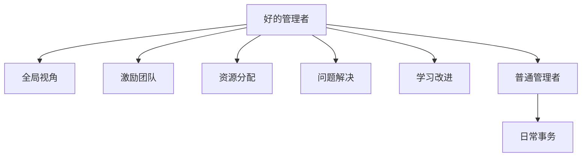

                 

# 好的管理者和普通管理者的差距：体系的重要性

## 1. 背景介绍

在现代企业管理中，管理者的角色显得尤为重要。一个好的管理者不仅能激励团队，还能合理分配资源，指导团队达成共同目标。然而，在实际操作中，许多管理者往往无法同时实现这些目标。本文将探讨好的管理者和普通管理者的差距，以及如何通过构建完善的管理体系，提升管理者的绩效。

## 2. 核心概念与联系

### 2.1 核心概念概述

好的管理者与普通管理者的区别在于他们的思维方式、管理策略以及执行能力。好的管理者通常具备以下特点：

- **全局视角**：能够从大局出发，制定整体战略，而不是局限于短期目标。
- **激励团队**：通过有效激励，激发团队成员的潜力和创造力。
- **资源分配**：合理分配资源，确保资源的有效利用和最大化产出。
- **问题解决**：具备较强的危机应对能力和问题解决能力。
- **学习改进**：持续学习和改进，不断优化管理方法和策略。

普通管理者则可能更多地关注日常事务管理，缺乏战略思维和创新能力。

### 2.2 核心概念原理和架构的 Mermaid 流程图



这个流程图展示了好的管理者和普通管理者的核心概念及其相互联系。好的管理者不仅具备全局视角和战略思维，还通过激励团队、合理分配资源和有效解决问题，不断学习和改进，以实现长期目标。而普通管理者往往更注重日常的运营和事务管理。

## 3. 核心算法原理 & 具体操作步骤

### 3.1 算法原理概述

好的管理者和普通管理者的差距，本质上是他们如何处理和管理企业中的各种资源和信息。好的管理者通过构建完善的管理体系，实现对资源的有效管理和优化配置，从而提升企业的整体绩效。

这种管理体系通常包括以下几个核心部分：

1. **战略规划**：制定长期战略，明确企业的发展方向和目标。
2. **组织架构**：设计合理的组织结构和岗位职责，确保每个成员都能发挥最大潜力。
3. **绩效管理**：建立科学的绩效评估体系，确保目标的实现和持续改进。
4. **人才管理**：培养和激励人才，提升团队的整体能力和凝聚力。
5. **风险管理**：识别和管理潜在风险，确保企业的稳定发展。

### 3.2 算法步骤详解

好的管理者的管理体系可以概括为以下几个步骤：

**Step 1: 制定战略规划**
- 确定企业的长期发展目标和愿景。
- 分析内外部环境，制定详细的战略计划。
- 将战略分解为具体目标和任务，形成可执行的计划。

**Step 2: 设计组织架构**
- 根据战略规划，设计合理的组织结构和岗位职责。
- 确保每个岗位都有明确的职责和目标，避免职责重叠或空白。
- 建立跨部门协作机制，促进信息流动和资源共享。

**Step 3: 实施绩效管理**
- 建立科学的绩效评估体系，定期评估团队和个人表现。
- 根据评估结果，制定改进措施和激励机制。
- 通过绩效反馈，持续改进管理方法和策略。

**Step 4: 人才管理**
- 识别和培养关键人才，提升团队整体能力。
- 通过激励机制，激发团队成员的创造力和潜力。
- 建立良好的团队文化，增强团队凝聚力。

**Step 5: 风险管理**
- 识别和评估潜在风险，制定应对策略。
- 建立应急响应机制，确保在突发事件中能够迅速反应。
- 定期审查和更新风险管理策略，确保其适应变化的环境。

### 3.3 算法优缺点

好的管理体系具有以下优点：

1. **提升企业绩效**：通过有效的资源管理和战略规划，最大化企业产出。
2. **优化人力资源**：合理分配岗位职责，培养和激励人才，提升整体能力。
3. **降低风险**：识别和管理潜在风险，确保企业的稳定发展。
4. **提高员工满意度**：通过科学的绩效管理和激励机制，提升员工的工作满意度和忠诚度。

然而，这种管理体系也存在一些缺点：

1. **实施难度大**：建立和管理一个完善的体系需要大量的时间和资源。
2. **灵活性不足**：一旦体系建立，改变和调整可能较为困难。
3. **依赖管理层**：管理体系的效果高度依赖于管理层的执行力和决策水平。

### 3.4 算法应用领域

好的管理体系广泛应用于各个行业和领域，如制造业、服务业、科技企业等。具体应用包括：

- **战略规划**：企业制定长期发展战略，如华为的“数字化转型”战略。
- **组织架构**：设计合理的组织结构和岗位职责，如谷歌的“OKR”管理。
- **绩效管理**：建立科学的绩效评估体系，如亚马逊的“KPI”考核。
- **人才管理**：培养和激励人才，如微软的“领导力培养计划”。
- **风险管理**：识别和管理潜在风险，如保险行业的“风险评估系统”。

## 4. 数学模型和公式 & 详细讲解 & 举例说明

### 4.1 数学模型构建

好的管理体系可以抽象为一个数学模型，用于分析和优化企业资源和信息。以下是一个简化版的数学模型：

$$
\text{Maximize } f(X) \text{ subject to } g(X) \leq 0 \text{ and } h(X) = 0
$$

其中，$f(X)$ 表示企业的总产出，$g(X)$ 和 $h(X)$ 分别表示企业的约束条件，如资源限制、市场环境等。

### 4.2 公式推导过程

通过上述数学模型，可以求解最优的企业资源配置和战略规划。具体推导过程如下：

1. **约束条件分析**：将约束条件转化为数学表达式，建立线性不等式或等式。
2. **目标函数确定**：确定企业总产出的计算方法，如利润最大化、成本最小化等。
3. **求解优化问题**：使用线性规划或非线性规划算法，求解最优解。
4. **结果验证**：对求解结果进行验证，确保符合实际情况和约束条件。

### 4.3 案例分析与讲解

以某科技公司的战略规划为例，其数学模型可以简化为：

$$
\text{Maximize } R \text{ subject to } C \leq B \text{ and } T = 0
$$

其中，$R$ 表示公司年营业收入，$C$ 表示年运营成本，$B$ 表示预算限制，$T$ 表示利润目标。

通过求解上述优化问题，公司可以确定最优的资源配置和运营策略。

## 5. 项目实践：代码实例和详细解释说明

### 5.1 开发环境搭建

为了更好地理解好的管理体系，我们通过一个简单的项目管理工具——Trello，来模拟企业资源的管理和优化。

1. 安装Trello，创建一个新的看板（Board），命名为“企业资源管理”。
2. 添加列（List），包括“待办事项”、“进行中”和“已完成”。
3. 添加卡片（Card），代表不同的资源或任务。
4. 分配标签（Label），标识不同类型或优先级。

### 5.2 源代码详细实现

Trello的开发主要依赖于其RESTful API，以下是一个简单的Python代码示例，用于自动化管理看板：

```python
import requests

def create_card(board_id, card_name):
    url = f"https://api.trello.com/1/boards/{board_id}/cards"
    headers = {
        "Authorization": "Bearer YOUR_ACCESS_TOKEN"
    }
    data = {
        "name": card_name,
        "desc": "待办事项",
        "checklists": [
            {
                "idChecklist": None,
                "checklistItems": [
                    {
                        "idCheckItem": None,
                        "checkListItem": None,
                        "checkItemState": "notchecked"
                    }
                ]
            }
        ]
    }
    response = requests.post(url, headers=headers, json=data)
    return response.json()

def update_card(card_id, card_name):
    url = f"https://api.trello.com/1/cards/{card_id}"
    headers = {
        "Authorization": "Bearer YOUR_ACCESS_TOKEN"
    }
    data = {
        "name": card_name,
        "checklists": [
            {
                "idChecklist": None,
                "checklistItems": [
                    {
                        "idCheckItem": None,
                        "checkListItem": None,
                        "checkItemState": "checked"
                    }
                ]
            }
        ]
    }
    response = requests.put(url, headers=headers, json=data)
    return response.json()

# 创建待办事项卡片
card = create_card("BOARD_ID", "资源A管理")
print(card)

# 更新已完成卡片
update_card(card["id"], "资源A管理完成")
print(card)
```

### 5.3 代码解读与分析

上述代码通过Trello的RESTful API，实现了对看板的自动化管理。具体步骤如下：

1. 使用 `create_card` 函数创建待办事项卡片，设置卡片名称和描述。
2. 使用 `update_card` 函数更新卡片状态，将其标记为已完成。
3. 通过循环调用上述函数，可以实现对企业资源的管理和优化。

## 6. 实际应用场景

好的管理体系在多个实际应用场景中得到了广泛应用，以下列举几个典型案例：

### 6.1 制造业

在制造业中，好的管理体系可以通过精益生产、质量控制等手段，提升生产效率和产品质量。例如，丰田的“看板”系统，通过实时监控生产流程，确保资源的合理配置和生产的连续性。

### 6.2 服务业

在服务业中，好的管理体系可以通过客户反馈、服务质量评估等方式，提升客户满意度和服务质量。例如，星级酒店通过建立绩效评估体系，激励员工提升服务水平。

### 6.3 科技企业

在科技企业中，好的管理体系可以通过OKR（Objectives and Key Results）等方法，确保企业战略的落地和执行。例如，谷歌的“OKR”管理，通过明确的战略目标和关键结果，推动企业的发展和创新。

## 7. 工具和资源推荐

### 7.1 学习资源推荐

好的管理体系的构建需要大量的学习和实践。以下是一些推荐的资源：

1. 《管理学》：管理学经典教材，涵盖各种管理理论和实践方法。
2. 《精益生产》：精益生产理论，介绍如何通过流程优化提升效率。
3. 《OKR工作法》：介绍OKR管理方法的书籍，提供具体的实施步骤和案例。
4. 在线课程：Coursera、edX等平台上的管理课程，提供系统化的学习体验。

### 7.2 开发工具推荐

好的管理体系的构建和优化，也需要借助一些工具。以下是一些推荐的工具：

1. Trello：项目管理工具，支持看板、卡片、标签等功能，适合模拟企业资源管理。
2. Microsoft Visio：流程设计和项目管理工具，支持复杂的图表和网络图绘制。
3. Miro：在线白板工具，支持团队协作和项目管理。
4. JIRA：项目管理工具，支持敏捷开发和任务跟踪。

### 7.3 相关论文推荐

好的管理体系的研究涉及多个学科领域，以下是一些推荐的论文：

1. 《管理学原理》：经典管理教材，提供系统的管理理论和方法。
2. 《精益生产与质量管理》：介绍精益生产和质量控制的方法和案例。
3. 《OKR工作法：让OKR成为企业战略引擎》：详细介绍OKR管理的实施方法和案例。

## 8. 总结：未来发展趋势与挑战

### 8.1 研究成果总结

本文通过分析好的管理者和普通管理者的差距，探讨了好的管理体系的构建方法。好的管理体系能够提升企业的整体绩效，优化资源配置，但同时也面临实施难度大、灵活性不足等挑战。

### 8.2 未来发展趋势

未来，好的管理体系将在更多领域得到应用，其发展趋势包括：

1. **数字化转型**：通过数字化工具和平台，实现企业的数字化管理和优化。
2. **敏捷管理**：采用敏捷方法论，适应快速变化的市场环境。
3. **数据驱动**：利用大数据和AI技术，优化企业决策和资源配置。
4. **全球化管理**：适应全球化市场，提升跨文化管理和协作能力。

### 8.3 面临的挑战

尽管好的管理体系具有广泛的应用前景，但在实践中仍面临一些挑战：

1. **实施复杂性**：构建和优化一个好的管理体系需要大量的资源和经验。
2. **变革阻力**：企业内部的变革和调整，可能会遇到来自不同层级的阻力。
3. **技术门槛**：需要具备一定的技术和管理知识，才能有效地实施和管理。

### 8.4 研究展望

未来，好的管理体系的研究方向包括：

1. **数字化管理**：利用AI和大数据技术，实现智能化的企业管理和优化。
2. **协同管理**：通过跨部门协作和团队建设，提升企业的整体绩效和创新能力。
3. **全球化管理**：适应全球化市场，提升企业的国际竞争力和影响力。

## 9. 附录：常见问题与解答

**Q1: 什么是好的管理体系？**

A: 好的管理体系通过系统的规划和优化，确保资源的合理配置和战略目标的实现。其核心在于全局视角、激励团队、绩效管理、人才管理和风险管理。

**Q2: 如何构建好的管理体系？**

A: 构建好的管理体系需要明确战略规划、设计合理的组织架构、实施绩效管理、培养和激励人才、识别和管理潜在风险。

**Q3: 好的管理体系与普通管理体系的区别？**

A: 好的管理体系具备全局视角、激励团队、绩效管理、人才管理和风险管理，而普通管理体系更多关注日常事务管理。

**Q4: 好的管理体系在实际应用中存在哪些挑战？**

A: 实施难度大、灵活性不足、依赖管理层，是好的管理体系面临的主要挑战。

**Q5: 好的管理体系在未来的发展趋势是什么？**

A: 数字化转型、敏捷管理、数据驱动和全球化管理，是好的管理体系的未来发展趋势。

---

作者：禅与计算机程序设计艺术 / Zen and the Art of Computer Programming

