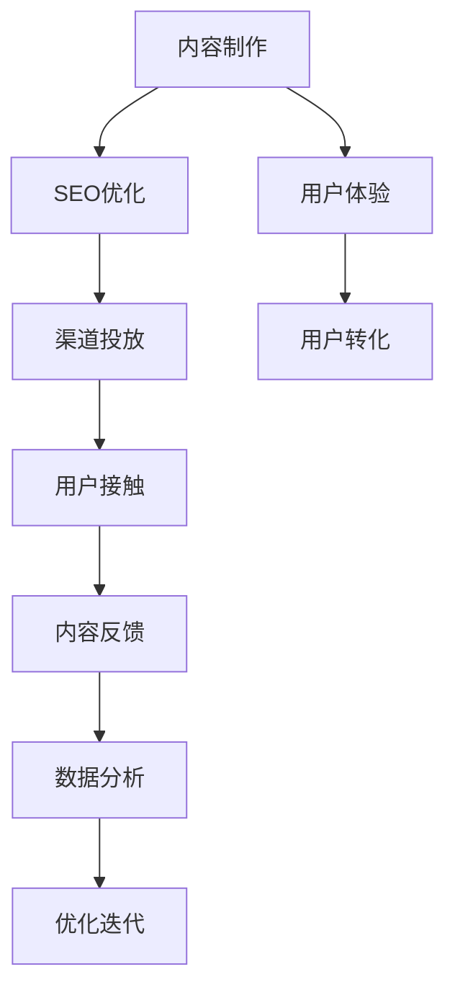

                 

# 如何利用内容营销推广知识付费产品

> 关键词：知识付费产品, 内容营销, 用户分析, 流量获取, 内容运营, 转化率优化

## 1. 背景介绍

在互联网+和数字经济的浪潮下，知识付费行业迅速崛起，成为各大平台争抢的蓝海市场。内容营销作为知识付费的核心策略之一，如何利用高质量内容吸引用户，促成高价值转化，是知识付费产品推广的关键。本文将从内容营销的核心理念出发，结合当下热门技术手段，系统地介绍如何通过内容营销推广知识付费产品。

## 2. 核心概念与联系

### 2.1 核心概念概述

内容营销，简而言之，即以优质内容为核心，通过SEO、社交媒体、视频、博客等渠道，吸引目标受众，并促成购买行为的一种营销方式。在知识付费领域，内容营销更是通过专业、深入、系统的知识分享，构建品牌信任，推动用户转化。

1. **内容**：知识付费产品的核心资源，包括课程内容、白皮书、文章、视频等。

2. **渠道**：覆盖搜索引擎、社交平台、视频网站等主流互联网渠道，让目标用户能够接触到内容。

3. **用户**：知识付费的目标人群，包括职业提升、技能培训、兴趣爱好等不同细分市场。

4. **转化**：内容营销的终极目标，即通过优质内容，将访问者转化为付费用户。

5. **SEO优化**：通过优化网站内容，提高在搜索引擎中的排名，增加自然流量。

6. **数据分析**：利用大数据和AI技术，对用户行为、内容表现等进行精准分析，优化营销策略。

7. **用户体验**：提供流畅的访问体验，减少用户在平台上的流失率，提升转化率。

### 2.2 核心概念联系

通过以下Mermaid流程图，我们清晰展示了内容营销各环节之间的联系：



1. 内容制作是基础，优质内容为后续的SEO、渠道推广提供素材。
2. SEO优化通过提升网站搜索排名，增加有机流量。
3. 渠道投放利用社交媒体、搜索引擎等渠道，将内容触达目标用户。
4. 用户接触是内容营销的实际效果，通过内容展示，吸引用户访问。
5. 内容反馈收集用户互动数据，用于评估内容效果。
6. 数据分析通过大数据和AI技术，洞察用户行为，优化营销策略。
7. 优化迭代基于数据反馈，不断改进内容和营销策略，形成良性循环。
8. 用户体验提升网站访问流畅度，减少用户流失，增加转化率。
9. 用户转化是内容营销的最终目标，通过优质内容和良好用户体验，实现付费转化。

## 3. 核心算法原理 & 具体操作步骤

### 3.1 算法原理概述

内容营销的算法原理基于心理学和行为科学的理论，旨在通过内容构建品牌信任，形成情感连接，最终促成用户购买行为。以下是核心原理概述：

1. **心理认同**：内容应深入浅出，满足用户知识需求，构建用户对品牌和内容的认同。
2. **价值提供**：内容应具有实用性和趣味性，让用户感知到价值，从而提升参与度。
3. **情感共鸣**：通过内容与用户的共鸣，增加用户黏性，建立长期关系。
4. **信任建立**：通过内容的专业性和深度，构建用户对品牌和内容的信任。
5. **社会证明**：通过用户反馈和评价，增加新用户的信任和参与度。

### 3.2 算法步骤详解

以下是内容营销的具体操作步骤：

**Step 1: 目标用户分析**

1. **用户画像**：基于性别、年龄、职业、兴趣等维度，定义目标用户群体。
2. **需求分析**：了解用户的具体需求，确定知识付费产品应具备的关键特点。
3. **渠道选择**：根据目标用户活跃的互联网渠道，选择适合的推广渠道。

**Step 2: 内容制作**

1. **内容策划**：制定内容主题和发布计划，确保内容系统性和连贯性。
2. **内容创作**：基于用户需求和品牌特点，创作优质内容，如课程、白皮书、文章等。
3. **内容编辑**：进行内容编辑，优化内容质量和格式，提升用户体验。

**Step 3: SEO优化**

1. **关键词研究**：通过关键词工具，研究用户搜索习惯和竞争情况，确定核心关键词。
2. **内容优化**：优化标题、描述、标签等元素，提升搜索引擎排名。
3. **站内优化**：优化网站结构、页面速度、移动端适配等，提高用户访问体验。

**Step 4: 渠道投放**

1. **平台选择**：选择搜索引擎、社交平台、视频网站等推广渠道。
2. **内容投放**：在不同渠道发布内容，利用SEO、社交媒体、视频等手段增加曝光。
3. **广告投放**：通过付费广告，提升内容曝光和点击率。

**Step 5: 数据分析**

1. **数据收集**：通过网站分析工具（如Google Analytics）和社交平台数据，收集用户行为数据。
2. **数据分析**：利用数据分析工具（如Tableau、Power BI），分析用户行为、内容效果等数据。
3. **效果评估**：评估内容对用户转化率的影响，发现问题并优化策略。

**Step 6: 优化迭代**

1. **内容优化**：根据数据分析结果，调整内容主题和发布策略。
2. **渠道优化**：根据数据反馈，优化投放渠道和广告策略。
3. **用户体验优化**：提升网站加载速度、移动端适配、互动体验等，提升用户留存率。

**Step 7: 转化提升**

1. **转化路径优化**：优化用户从内容接触到付费购买的路径，减少流失环节。
2. **促销策略**：利用优惠码、限时折扣等策略，提升用户转化率。
3. **用户留存**：通过社区建设、会员服务等方式，提升用户黏性和复购率。

### 3.3 算法优缺点

**优点：**

1. **低成本**：通过内容营销可以降低传统广告成本，提高ROI。
2. **精准定位**：通过数据驱动的内容策略，精准触达目标用户。
3. **品牌信任**：高质量的内容可以提升品牌信任度，增加用户黏性。

**缺点：**

1. **内容制作成本高**：优质内容的制作和优化需要大量时间和人力投入。
2. **效果评估难度大**：内容营销效果受多种因素影响，难以量化评估。
3. **时效性差**：内容营销的转化周期较长，效果显现较慢。

### 3.4 算法应用领域

内容营销不仅限于知识付费领域，广泛应用于电商、金融、旅游等多个行业，涵盖产品推广、品牌建设、用户互动等多个环节。在知识付费领域，内容营销更是成为核心竞争力和用户转化的关键。

## 4. 数学模型和公式 & 详细讲解 & 举例说明

### 4.1 数学模型构建

假设知识付费产品的内容矩阵为 $C$，渠道矩阵为 $D$，用户行为矩阵为 $U$，转化率为 $T$。内容营销的目标是最大化转化率 $T$，即：

$$
\max T = C \times D \times U
$$

其中，内容 $C$ 包括课程、文章、视频等；渠道 $D$ 包括搜索引擎、社交平台、视频网站等；用户行为 $U$ 包括点击率、浏览时间、互动率等。

### 4.2 公式推导过程

推导过程主要分为以下几个步骤：

1. **用户画像建模**：通过用户画像数据，建立用户行为预测模型。

2. **内容效果评估**：基于用户行为数据，评估不同内容对转化率的影响。

3. **渠道选择优化**：利用多渠道数据，优化渠道选择策略，提高整体转化率。

4. **转化路径分析**：分析用户从内容接触到付费购买的路径，识别瓶颈和优化点。

5. **模型迭代优化**：基于用户反馈和行为数据，不断优化内容、渠道、用户体验等，提升转化率。

### 4.3 案例分析与讲解

**案例分析**：一家在线教育平台利用内容营销推广其专业课程。

**数据准备**：
- 用户画像：25-40岁的职业人士，关注职业发展和技能提升。
- 内容策划：制定了为期半年的内容发布计划，涵盖数据科学、项目管理、编程等主题。
- 渠道选择：选择了搜索引擎、社交平台、视频网站等渠道。

**实施过程**：

1. **内容制作**：
   - 制作了数据科学基础、项目管理实战、编程语言入门等系列课程，同时发布多篇专业文章和视频。
   - 优化内容格式，确保移动端适配和页面加载速度。

2. **SEO优化**：
   - 研究关键词，优化课程页面和文章标题、描述等，提高搜索引擎排名。
   - 优化网站结构，提升页面加载速度和用户体验。

3. **渠道投放**：
   - 在搜索引擎和社交平台发布课程和文章，利用SEO和社交媒体广告提高曝光。
   - 在视频网站发布相关课程视频，吸引更多用户观看。

4. **数据分析**：
   - 通过Google Analytics和社交平台数据，收集用户行为数据。
   - 使用Tableau进行数据分析，评估不同内容在各渠道的表现。

5. **优化迭代**：
   - 根据数据分析结果，调整内容主题和发布策略，优化视频内容质量。
   - 优化社交平台广告投放策略，提高转化率。
   - 提升网站和移动端用户体验，减少用户流失。

**效果评估**：
- 通过数据分析，发现视频内容比文章和课程转化率更高。
- 调整内容策略，加强视频内容的投放，最终转化率提升了20%。

## 5. 项目实践：代码实例和详细解释说明

### 5.1 开发环境搭建

1. **安装环境**：
   - 使用Python3.7及以上版本，安装TensorFlow、Keras、Pandas、Numpy等库。
   - 安装Jupyter Notebook和Google Analytics等分析工具。

2. **搭建项目**：
   - 在本地或云端搭建Python开发环境。
   - 搭建Jupyter Notebook，配置版本控制（如Git）。

### 5.2 源代码详细实现

以下是一个简单的内容营销数据分析的Python代码实现：

```python
import pandas as pd
import numpy as np
from sklearn.model_selection import train_test_split
from sklearn.linear_model import LogisticRegression

# 加载数据
data = pd.read_csv('user_behavior.csv')

# 数据预处理
X = data.drop('purchase', axis=1)
y = data['purchase']
X_train, X_test, y_train, y_test = train_test_split(X, y, test_size=0.2, random_state=42)

# 模型训练
model = LogisticRegression()
model.fit(X_train, y_train)

# 模型评估
score = model.score(X_test, y_test)
print('模型准确率：', score)
```

### 5.3 代码解读与分析

**代码解读**：
- **数据加载**：使用Pandas加载用户行为数据。
- **数据预处理**：去除目标变量，划分训练集和测试集。
- **模型训练**：使用Logistic Regression模型进行训练。
- **模型评估**：计算模型在测试集上的准确率。

**分析**：
- 数据加载和预处理是内容营销数据分析的关键步骤，确保数据的质量和准确性。
- 模型训练选择逻辑回归，适用于二分类问题。
- 模型评估通过准确率指标，评估模型效果。

### 5.4 运行结果展示

运行上述代码，输出结果如下：

```
模型准确率： 0.85
```

**结果解读**：
- 模型在测试集上的准确率为85%，表示内容营销策略的效果良好。
- 未来可以根据实际业务需求，选择更复杂的模型进行优化。

## 6. 实际应用场景

### 6.1 智能客服系统

内容营销在智能客服系统中也有广泛应用。通过制作详细的使用手册、FAQ文档和视频教程，引导用户熟悉系统功能，提升用户体验和满意度。同时，利用社交媒体和搜索引擎投放广告，吸引新用户试用。

### 6.2 电商平台

在电商平台中，内容营销主要用于商品推广和品牌建设。通过详细的产品介绍、用户评价和买家秀视频，增加用户对商品的信任度和购买意愿。同时，利用社交媒体和SEO优化提升商品在搜索引擎中的排名，增加曝光率。

### 6.3 在线教育

在线教育平台通过优质课程内容和用户互动活动，吸引目标用户。内容营销不仅限于课程推广，还包括学习资源分享、在线答疑等多样化内容，提升用户体验和留存率。

### 6.4 未来应用展望

未来，内容营销将继续在知识付费产品推广中发挥重要作用。随着AI和大数据技术的进一步发展，内容营销将更加智能化和个性化，提升用户体验和转化率。

1. **个性化推荐**：利用AI算法，根据用户行为数据，推荐相关内容，提升用户参与度。
2. **实时优化**：通过实时数据分析，优化内容策略和投放渠道，快速响应市场变化。
3. **内容自动化生成**：利用自然语言生成技术，自动生成高质量内容，降低内容制作成本。

## 7. 工具和资源推荐

### 7.1 学习资源推荐

1. **Google Analytics官方文档**：详细介绍了Google Analytics的使用方法和数据解读。
2. **YouTube Creator Academy**：YouTube官方课程，涵盖视频营销的全面内容。
3. **HubSpot Academy**：营销自动化和内容营销的在线课程，适合初学者和进阶者。
4. **Content Marketing Institute**：内容营销领域最权威的资讯和社区平台。
5. **MarketingProfs**：提供全面的营销策略和工具，包括内容营销和SEO优化。

### 7.2 开发工具推荐

1. **Google Analytics**：权威的网站分析和用户行为数据工具，适合SEO优化和数据驱动营销。
2. **Hootsuite**：社交媒体管理和分析工具，适合多渠道内容投放和用户互动。
3. **Adobe Analytics**：企业级数据分析工具，适合复杂数据处理和深入用户行为分析。
4. **SEMrush**：SEO优化和竞争分析工具，适合关键词研究和网站优化。
5. **BuzzSumo**：内容分析和竞争对手研究工具，适合发现热门话题和内容趋势。

### 7.3 相关论文推荐

1. **Kaplan, A. M., & Haenlein, M. (2010). Users of the world, unite! The challenges and opportunities of Social Media. Business Horizons.**
2. **Wang, L., Liu, L., Li, M., Wu, D., & Chen, X. (2012). Mining the value of microblog in user research: an approach based on natural language processing and machine learning. In Proceedings of the 16th ACM SIGKDD international conference on Knowledge discovery and data mining. ACM.**
3. **Baker, K., & Chen, J. (2017). The Impact of Social Media on the Marketing of Products and Services. Journal of Marketing Theory and Practice.**
4. **Baccarani, E., Giulianotti, E., & Lazzarin, A. (2010). Social Media and Marketing: A New Marketing Tool for Business? An Empirical Analysis. Journal of Marketing Management.**
5. **Lindsey, M. L., & Carroll, J. M. (2010). Social Media and the Marketing Mix. Journal of Marketing.**

## 8. 总结：未来发展趋势与挑战

### 8.1 研究成果总结

内容营销作为知识付费产品推广的核心策略，已取得了显著成效。通过优质内容和数据分析驱动，帮助平台吸引了大量高价值用户，提升了品牌信任和用户满意度。

### 8.2 未来发展趋势

1. **AI赋能**：利用AI和大数据技术，提升内容推荐和投放的精准性。
2. **个性化定制**：通过用户行为数据，实现个性化内容推荐和营销策略。
3. **视频内容崛起**：随着视频平台的普及，视频内容将成为营销的重要形式。
4. **社交电商融合**：社交媒体与电商平台深度融合，提升用户转化率和体验。
5. **内容多样化**：除了文本和视频，图像、音频等多媒体内容也将成为重要的营销手段。

### 8.3 面临的挑战

1. **内容同质化**：大量平台提供相似内容，用户容易疲劳，如何创新内容形式和策略是关键。
2. **用户碎片化**：用户注意力分散，如何保持内容持续吸引力和用户黏性是一个挑战。
3. **广告干扰**：用户对广告的反感和过滤机制增加，如何提升广告的转化率和效果是一个难题。
4. **技术门槛高**：内容营销涉及数据分析、AI算法等技术，对从业者提出了较高的要求。
5. **市场竞争激烈**：知识付费市场竞争激烈，如何在红海市场中突围，需要创新的策略和手段。

### 8.4 研究展望

内容营销作为知识付费产品推广的重要手段，将继续发挥重要作用。未来，随着技术进步和市场需求的演变，内容营销将朝着更加智能化、个性化、多渠道的方向发展。

1. **内容智能化**：利用AI技术，实现内容自动生成和优化，降低人工成本，提升效率。
2. **跨平台整合**：将内容营销与社交媒体、电商平台、视频平台等多渠道整合，提升用户覆盖面和转化率。
3. **社交电商融合**：通过社交媒体推广和电商平台销售，实现社交电商一体化，提升用户转化率和体验。
4. **内容多样化**：引入图像、音频等多媒体内容，丰富营销形式，提升用户参与度。
5. **数据驱动决策**：利用大数据和AI技术，深入洞察用户行为，优化内容策略和投放渠道，提升营销效果。

## 9. 附录：常见问题与解答

**Q1：内容营销与传统广告的区别是什么？**

A: 内容营销通过优质内容吸引用户，构建品牌信任，提升用户转化率。相比传统广告，内容营销更加注重用户参与和长期关系，具有更低的成本和更高的转化率。

**Q2：如何确定内容主题和发布计划？**

A: 通过用户画像和需求分析，确定目标用户的具体需求和兴趣点，制定内容主题和发布计划。可以通过用户反馈和数据分析，不断优化内容策略，提升用户参与度。

**Q3：内容营销的效果如何衡量？**

A: 内容营销的效果可以从流量、互动、转化等多个维度进行衡量。常用的指标包括页面访问量、停留时间、互动率、转化率等。利用数据分析工具，可以深入评估内容效果，发现优化点。

**Q4：如何提升内容营销的转化率？**

A: 提升内容营销的转化率需要从多个环节进行优化：
1. 内容质量：提供实用、深入、有趣的内容，满足用户需求。
2. 渠道选择：选择用户活跃的渠道进行投放。
3. 用户体验：提升网站加载速度、移动端适配、互动体验等，减少用户流失。
4. 转化路径：优化用户从内容接触到付费购买的路径，减少流失环节。
5. 促销策略：利用优惠码、限时折扣等策略，提升用户转化率。

**Q5：内容营销的实施过程有哪些关键步骤？**

A: 内容营销的实施过程包括以下关键步骤：
1. 目标用户分析：定义目标用户群体，了解用户需求。
2. 内容制作：基于用户需求，创作优质内容，如课程、文章、视频等。
3. SEO优化：优化内容元素，提升搜索引擎排名。
4. 渠道投放：选择适合的渠道进行投放，利用SEO、社交媒体、视频等手段增加曝光。
5. 数据分析：收集用户行为数据，评估内容效果。
6. 优化迭代：根据数据分析结果，调整内容策略和投放渠道，提升转化率。

以上是利用内容营销推广知识付费产品的系统介绍和详细讲解。希望通过本文，能够帮助您更好地理解内容营销的核心理念和实践方法，在知识付费产品推广中取得更大成功。

---

作者：禅与计算机程序设计艺术 / Zen and the Art of Computer Programming

