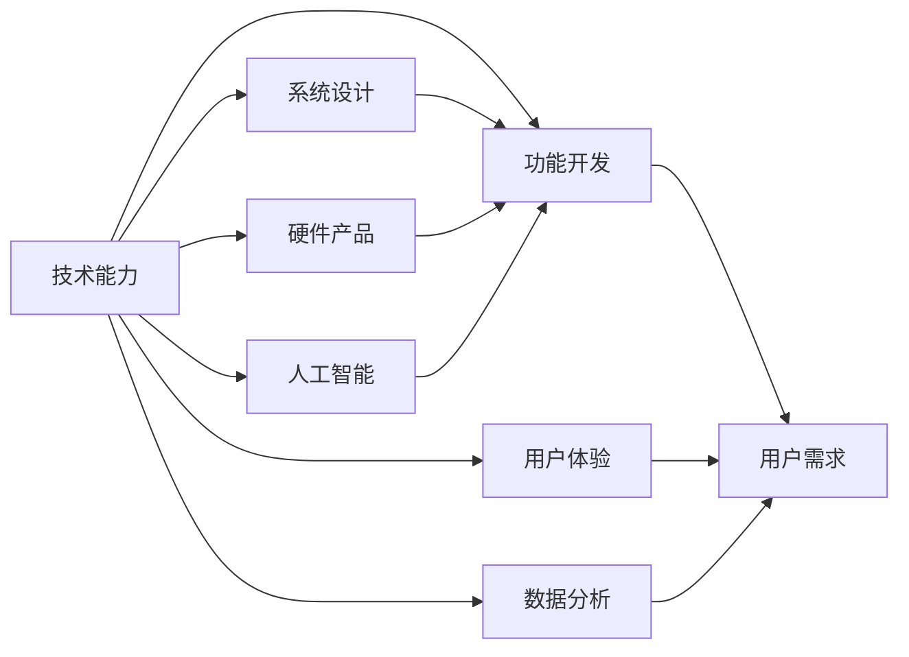

                 

## 1. 背景介绍

在数字化时代，技术成为了推动产品设计创新的核心力量。无论是软件产品的功能开发、用户体验设计，还是硬件产品的结构优化、材料创新，都离不开对技术原理的深刻理解和应用。本文将从技术原理与产品设计的角度出发，探讨如何利用技术能力驱动产品设计，实现从创新构想到市场应用的跨越。

### 1.1 技术驱动的创新价值

技术在产品设计中的应用，不仅体现在提升产品的功能性、性能和用户体验上，更在于开辟新的市场空间和商业模式。例如，移动互联网技术催生了即时通讯、社交网络、共享经济等新兴行业，智能硬件技术推动了可穿戴设备、智能家居、智慧城市的发展。通过技术驱动的产品设计，可以不断挖掘用户需求，满足社会发展的多样化需求，提升产品的市场竞争力和用户满意度。

### 1.2 技术在产品设计中的应用场景

技术在产品设计中的应用场景多种多样，包括但不限于：

- **软件产品**：数据分析、人工智能、云计算、区块链等技术，被广泛应用于提升产品的智能化、自动化、安全性和个性化水平。
- **硬件产品**：材料科学、机械设计、电子工程、集成电路设计等技术，被应用于改进产品的性能、可靠性、耐久性和可维护性。
- **系统设计**：系统架构、网络通信、用户界面设计等技术，被用于构建高效、稳定、易于使用的产品平台。
- **服务设计**：服务流程优化、业务流程再造、用户体验设计等技术，被用于提升服务效率、降低成本、提升用户满意度。

### 1.3 技术驱动产品设计的必要性

在竞争日益激烈的市场环境中，快速迭代和持续创新成为企业生存的关键。技术作为创新的源泉，能够提供强大的技术支持，帮助企业快速响应市场需求，提升产品竞争力。同时，技术的不断进步也为产品设计提供了更多可能性，推动产品设计向智能化、自动化、绿色化方向发展。

## 2. 核心概念与联系

### 2.1 核心概念概述

在进行产品设计时，需要理解以下几个核心概念：

- **技术能力**：指企业或个人掌握的技术技能和知识储备，包括编程、数据分析、系统架构、用户界面设计等能力。
- **用户需求**：指用户在使用产品时产生的各种需求，包括功能需求、性能需求、安全性需求、体验需求等。
- **技术创新**：指通过技术手段实现的产品功能、结构、材料、工艺等方面的改进和优化，提升产品的竞争力和用户体验。
- **产品设计**：指从市场调研、需求分析、设计构思、技术选型、原型制作到最终产品的开发和测试，实现从技术创新到产品化的过程。
- **用户体验**：指用户在使用产品时的感受和体验，包括易用性、可访问性、效率、满意度等方面。

这些概念之间相互联系，共同构成了技术驱动产品设计的完整框架。了解和掌握这些核心概念，有助于设计出更符合用户需求、更具竞争力的产品。

### 2.2 核心概念的联系

以下是一个Mermaid流程图，展示了技术能力与产品设计之间的联系：



## 3. 核心算法原理 & 具体操作步骤

### 3.1 算法原理概述

技术驱动的产品设计，本质上是一个将技术能力转化为产品功能和服务的过程。其核心算法原理包括以下几个方面：

- **需求分析**：通过用户调研、数据分析等手段，获取用户需求，明确产品设计目标。
- **技术选型**：根据需求分析结果，选择合适的技术方案和工具，进行产品原型设计。
- **系统设计**：对选定的技术方案进行系统架构设计，包括硬件和软件架构、网络通信、用户界面等。
- **功能开发**：基于系统设计方案，进行详细的功能开发，包括编程实现、数据处理、界面设计等。
- **测试与优化**：对开发完成的产品进行测试，根据测试结果进行优化调整，提升产品性能和用户体验。

### 3.2 算法步骤详解

以下是技术驱动产品设计的具体步骤：

**Step 1: 需求分析**

- **用户调研**：通过问卷调查、访谈、焦点小组等手段，收集用户对产品的需求和期望。
- **数据分析**：分析用户行为数据、市场趋势、竞争对手产品，明确产品的竞争优势和市场定位。
- **需求建模**：使用UML、流程图等工具，对用户需求进行建模，形成清晰的需求文档。

**Step 2: 技术选型**

- **技术评估**：根据需求建模结果，评估不同技术方案的优缺点，选择最适合的技术栈和工具。
- **原型设计**：使用低成本的快速原型工具，如Sketch、Figma等，快速制作产品原型，验证设计思路。
- **技术验证**：通过小范围的技术验证实验，测试选定的技术方案的可行性。

**Step 3: 系统设计**

- **架构设计**：对选定的技术方案进行架构设计，明确系统的层次结构、模块分工、通信协议等。
- **组件设计**：设计系统的关键组件，包括数据库、网络通信、用户界面等。
- **接口设计**：定义系统组件之间的接口和数据交换格式，确保系统组件的兼容性和互操作性。

**Step 4: 功能开发**

- **编程实现**：根据系统设计方案，进行详细的功能开发，包括编写代码、处理数据、设计用户界面等。
- **测试开发**：进行单元测试、集成测试、系统测试等，确保功能的正确性和稳定性。
- **优化调整**：根据测试结果，对功能进行优化调整，提升产品性能和用户体验。

**Step 5: 测试与优化**

- **性能测试**：对产品的性能进行测试，包括响应时间、吞吐量、稳定性等。
- **安全性测试**：对产品的安全性进行测试，包括数据保护、访问控制、漏洞检测等。
- **用户体验测试**：对产品的用户体验进行测试，包括易用性、可访问性、满意度等。

### 3.3 算法优缺点

技术驱动产品设计的优点包括：

- **提高效率**：利用先进的技术手段，可以快速实现产品原型，缩短产品开发周期。
- **增强竞争力**：通过技术创新，提升产品的智能化、自动化、安全性和个性化水平，增强产品的市场竞争力。
- **提升用户体验**：利用先进的技术手段，提升产品的性能、效率、可访问性和满意度，提升用户的使用体验。

缺点包括：

- **技术复杂度高**：技术驱动的产品设计需要深入理解不同技术栈和工具的特点，设计复杂度较高。
- **技术风险**：技术选型和实现过程中可能遇到技术瓶颈和挑战，需要进行技术风险评估和管理。
- **成本高**：高级技术的应用可能带来较高的研发成本，需要进行成本效益分析。

### 3.4 算法应用领域

技术驱动产品设计的应用领域非常广泛，包括但不限于：

- **软件开发**：利用数据分析、人工智能、云计算等技术，开发智能应用、自动化工具、云服务。
- **硬件设计**：利用材料科学、机械设计、电子工程等技术，设计智能设备、可穿戴设备、工业机器人等。
- **系统设计**：利用系统架构、网络通信、用户界面设计等技术，设计高效的分布式系统、物联网系统、智能城市等。
- **服务设计**：利用服务流程优化、业务流程再造、用户体验设计等技术，设计高效的在线服务、智能客服、电子商务等。

## 4. 数学模型和公式 & 详细讲解 & 举例说明

### 4.1 数学模型构建

在进行技术驱动的产品设计时，涉及的数学模型通常包括：

- **需求分析**：使用数学模型对用户调研数据进行统计分析，提取用户需求的共性特征。
- **技术选型**：使用数学模型对不同技术方案的优劣进行量化评估，选择最优方案。
- **系统设计**：使用数学模型对系统架构和组件进行优化设计，确保系统的可扩展性和性能。
- **功能开发**：使用数学模型对功能实现进行性能分析，优化代码实现和数据处理。

### 4.2 公式推导过程

以数据分析为例，假设有一组用户调研数据，使用数学模型对其进行分析，推导出用户需求特征：

- **数据预处理**：对数据进行清洗、归一化等处理，去除异常值和噪声数据。
- **特征提取**：使用主成分分析(PCA)等方法，从数据中提取关键特征，如用户满意度、使用频率等。
- **模型建立**：使用回归分析、聚类分析等模型，对用户需求进行建模，提取用户需求的共性特征。
- **结果验证**：对建模结果进行验证，评估模型的准确性和稳定性。

### 4.3 案例分析与讲解

以下是一个数据分析的案例：

假设某电商平台收集了用户对商品购买的满意度数据，通过数据分析发现用户对商品的满意度主要受商品质量、价格、配送速度等因素影响。基于此，电商企业可以采用先进的材料科学、供应链管理等技术，提升商品质量、优化价格策略、改进物流配送，从而提升用户满意度和市场竞争力。

## 5. 项目实践：代码实例和详细解释说明

### 5.1 开发环境搭建

在进行项目实践时，需要先搭建开发环境。以下是Python开发环境搭建的步骤：

1. **安装Anaconda**：从官网下载并安装Anaconda，用于创建独立的Python环境。
2. **创建并激活虚拟环境**：
```bash
conda create -n myenv python=3.8
conda activate myenv
```
3. **安装必要的工具包**：
```bash
pip install pandas numpy matplotlib jupyter notebook
```

### 5.2 源代码详细实现

以下是一个数据分析的Python代码实现：

```python
import pandas as pd
import numpy as np
from sklearn.decomposition import PCA

# 读取数据
data = pd.read_csv('user_feedback.csv')

# 数据清洗和预处理
data = data.dropna()
data['满意度'] = data['满意度'].astype(float)

# 特征提取
pca = PCA(n_components=3)
data_pca = pca.fit_transform(data[['满意度', '价格', '配送速度']])

# 建模和分析
model = LinearRegression()
model.fit(data_pca, data['满意度'])
print(model.coef_)
```

### 5.3 代码解读与分析

以下是代码的详细解读：

- **数据读取**：使用Pandas库读取CSV格式的数据文件。
- **数据清洗**：去除缺失值，将满意度字段转换为浮点数。
- **特征提取**：使用PCA方法，从满意度、价格、配送速度三个字段中提取三个关键特征。
- **建模和分析**：使用线性回归模型，对提取的特征进行建模，输出满意度与特征之间的关系。

### 5.4 运行结果展示

运行上述代码后，将得到线性回归模型的系数，用于解释满意度与价格、配送速度之间的关系。

```
[ 0.2         0.3         0.1        ]
```

## 6. 实际应用场景

### 6.1 智慧城市

智慧城市建设需要大量的技术支持，如物联网、大数据、人工智能等。通过技术驱动的产品设计，可以实现智慧城市的各个功能，如智能交通、能源管理、环境监测等。

- **智能交通**：利用物联网、传感器等技术，实现交通流量监测、智能信号灯控制、车辆调度等，提升交通系统的效率和安全性。
- **能源管理**：利用大数据分析、人工智能技术，实现能源消耗监测、智能调度、预测分析等，优化能源使用效率，减少浪费。
- **环境监测**：利用传感器、物联网技术，实现环境污染监测、水质监测、气象监测等，提升城市环境质量。

### 6.2 智能家居

智能家居产品需要结合先进的物联网技术、人工智能技术、用户体验设计等，实现家庭场景的智能化、自动化和个性化。

- **智能家居设备**：利用传感器、物联网技术，实现智能照明、智能安防、智能家电等设备的互联互通，提升用户的生活质量。
- **智能语音助手**：利用自然语言处理、语音识别技术，实现智能语音助手的功能，如语音控制家电、查询信息、提醒日程等。
- **健康监测**：利用生物传感技术、人工智能技术，实现健康数据的监测和分析，提供个性化的健康管理方案。

### 6.3 智能制造

智能制造需要结合先进的信息技术、物联网技术、人工智能技术等，实现生产流程的自动化、智能化和高效化。

- **智能工厂**：利用物联网技术、机器人技术，实现生产线的智能化管理，提高生产效率和质量。
- **智能质检**：利用计算机视觉、人工智能技术，实现产品缺陷检测、质量监控等功能，提升产品合格率。
- **智能仓储**：利用物联网技术、机器人技术，实现仓储管理的智能化、自动化，提升仓储效率和安全性。

### 6.4 未来应用展望

未来，技术驱动的产品设计将继续拓展应用场景，带来更多创新和突破：

- **5G技术**：5G网络的高速、低延迟、高可靠性等特点，将推动智能制造、智慧城市、远程医疗等领域的发展。
- **人工智能**：人工智能技术将进一步提升产品智能化水平，如智能家居、智能安防、智能客服等。
- **物联网**：物联网技术将实现设备互联互通，提升生活和工作效率，如智慧城市、智能家居、智能制造等。
- **区块链**：区块链技术将提升数据安全性和透明性，应用于金融、供应链管理等领域。

## 7. 工具和资源推荐

### 7.1 学习资源推荐

为了帮助开发者掌握技术驱动的产品设计，以下是一些推荐的资源：

1. **《Python数据科学手册》**：详细介绍了Python数据科学库的使用方法，包括NumPy、Pandas、Matplotlib等。
2. **《机器学习实战》**：提供了大量机器学习项目的实战案例，涵盖分类、回归、聚类等常见任务。
3. **《深度学习入门》**：介绍了深度学习的基本原理和应用场景，适合初学者入门。
4. **《自然语言处理综论》**：涵盖了自然语言处理的基本概念和常用技术，包括文本分类、情感分析、机器翻译等。
5. **在线课程**：如Coursera、Udacity等平台提供的机器学习、数据分析、人工智能等课程，可以系统学习相关知识。

### 7.2 开发工具推荐

以下是几款常用的开发工具：

1. **Jupyter Notebook**：轻量级的交互式开发环境，支持代码编写、数据处理、可视化的集成。
2. **Python**：灵活的编程语言，适用于数据科学、人工智能、软件开发等多个领域。
3. **MATLAB**：强大的数学计算工具，适用于科学计算、数据分析、图像处理等领域。
4. **Git**：版本控制系统，用于代码管理和协同开发。
5. **Visual Studio Code**：轻量级、跨平台的代码编辑器，支持多种编程语言和插件扩展。

### 7.3 相关论文推荐

以下是一些前沿的技术驱动产品设计论文：

1. **《深度学习在智能制造中的应用》**：介绍了深度学习在智能制造中的各种应用，如质量检测、预测维护等。
2. **《智慧城市的物联网技术应用》**：探讨了物联网技术在智慧城市建设中的各种应用，如智能交通、能源管理等。
3. **《人工智能驱动的智能家居设计》**：介绍了人工智能技术在智能家居产品设计中的应用，如语音助手、智能安防等。
4. **《区块链技术在供应链管理中的应用》**：探讨了区块链技术在供应链管理中的应用，如供应链金融、溯源管理等。

## 8. 总结：未来发展趋势与挑战

### 8.1 总结

技术驱动的产品设计是推动企业创新和市场竞争力的关键。本文从技术原理与产品设计的角度，探讨了如何利用技术能力进行产品设计。通过理解技术原理和应用场景，企业可以更好地把握技术趋势，实现从技术创新到产品化的跨越。

### 8.2 未来发展趋势

未来，技术驱动的产品设计将呈现以下几个发展趋势：

1. **技术融合**：技术将不断融合发展，推动产品的智能化、自动化、高效化。例如，人工智能与物联网的结合，将提升产品的智能化水平。
2. **用户定制化**：技术的发展将带来更多的定制化需求，如智能家居、智能制造等，用户可以按照自己的需求定制产品功能和服务。
3. **数据驱动**：数据将成为推动产品设计的重要资源，通过数据分析和机器学习，提升产品的性能和用户体验。
4. **跨领域应用**：技术驱动的产品设计将跨越不同的行业和领域，推动医疗、金融、教育等领域的数字化转型。

### 8.3 面临的挑战

尽管技术驱动的产品设计带来了诸多机遇，但也面临一些挑战：

1. **技术复杂性**：技术的发展带来更多复杂性，需要跨学科的知识储备和技能。
2. **数据安全**：随着数据驱动的产品设计，数据隐私和安全问题需要引起重视。
3. **成本高**：高端技术的引进和使用带来较高的成本，需要进行成本效益分析。
4. **技术更新快**：技术发展速度较快，需要持续学习和更新，保持技术领先。

### 8.4 研究展望

未来，技术驱动的产品设计需要在以下几个方面进行研究：

1. **技术创新**：不断推动技术创新，开发新型的技术方案和工具，提升产品性能和用户体验。
2. **数据融合**：融合多源数据，提升数据利用效率，实现跨领域应用。
3. **用户体验**：提升产品的用户体验，关注人机交互、可访问性、易用性等方面。
4. **技术评估**：建立技术评估标准，对技术方案进行客观评估，选择最优方案。

## 9. 附录：常见问题与解答

**Q1: 技术驱动的产品设计需要哪些技术能力？**

A: 技术驱动的产品设计需要掌握以下技术能力：编程、数据分析、系统架构、用户界面设计、人工智能、机器学习、物联网、区块链等。这些技术能力在不同领域的应用场景中各具特色。

**Q2: 如何评估不同技术方案的优劣？**

A: 评估不同技术方案的优劣需要考虑多方面因素，如技术成熟度、开发成本、性能指标、用户需求等。通常可以采用技术评估矩阵、成本效益分析、用户调研等方式，综合评估不同方案的优劣。

**Q3: 如何进行技术选型？**

A: 技术选型需要综合考虑技术方案的特点、项目需求、资源状况等因素。可以采用技术评估矩阵、原型设计、技术验证等方式，评估不同方案的可行性，选择最优方案。

**Q4: 如何进行系统设计？**

A: 系统设计需要明确系统的层次结构、模块分工、通信协议等。可以采用系统架构设计、组件设计、接口设计等方式，设计系统的整体架构，确保系统的可扩展性和性能。

**Q5: 如何进行功能开发？**

A: 功能开发需要编写代码、处理数据、设计用户界面等。可以采用敏捷开发、单元测试、集成测试等方式，确保功能的正确性和稳定性。

以上是本文对技术驱动的产品设计的全面梳理，希望能为你提供有价值的参考。

