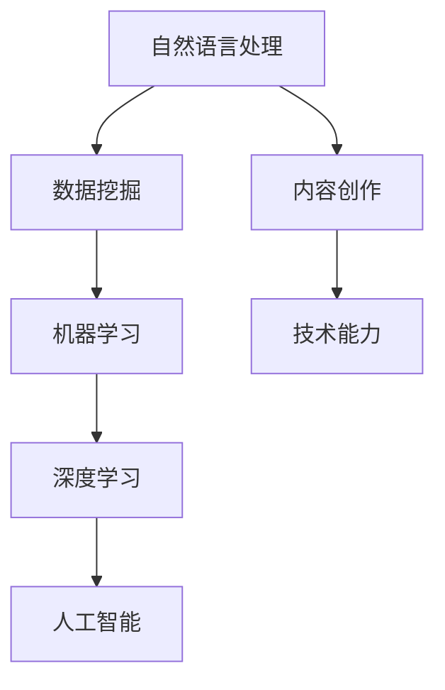

                 

# 如何利用技术能力进行内容创作

> 关键词：内容创作,技术能力,自然语言处理,数据挖掘,机器学习,深度学习,人工智能,算法

## 1. 背景介绍

### 1.1 问题由来

随着互联网技术的发展，信息量的爆炸式增长给内容创作带来了新的挑战。海量的文本数据中蕴含着丰富的信息，但如何从中挖掘、筛选、组织并生成高质量的内容，成为了一个亟待解决的问题。传统的内容创作往往依赖于作者的直觉和经验，而技术手段的介入，让内容创作变得更加科学和高效。

### 1.2 问题核心关键点

如何利用技术能力，特别是自然语言处理、数据挖掘和机器学习等手段，进行高效的内容创作，是当前研究的热点问题。本文将详细阐述这一过程，从背景介绍、核心概念、算法原理到实际操作、未来展望等各个方面进行全面分析。

## 2. 核心概念与联系

### 2.1 核心概念概述

为了更好地理解如何利用技术能力进行内容创作，本节将介绍几个核心概念：

- **自然语言处理(Natural Language Processing, NLP)**：研究如何让计算机理解和处理人类语言的技术，涵盖词法分析、句法分析、语义分析、机器翻译、文本生成等任务。
- **数据挖掘(Data Mining)**：从大量数据中挖掘出有用信息的过程，包括文本分类、聚类、关联规则分析等。
- **机器学习(Machine Learning)**：通过算法让机器从数据中学习规律，并进行预测或分类。
- **深度学习(Deep Learning)**：利用多层神经网络模拟人脑的神经网络，处理大规模复杂数据，如卷积神经网络(CNN)、循环神经网络(RNN)等。
- **人工智能(Artificial Intelligence, AI)**：使机器能够模拟人类的智能行为，实现问题求解、知识获取、推理判断等。
- **算法(Algorithm)**：解决问题的步骤或流程，分为通用算法和特定算法。

这些核心概念共同构成了内容创作的底层技术框架，使其能够在各个环节中发挥作用。

### 2.2 核心概念原理和架构的 Mermaid 流程图



此流程图展示了自然语言处理、数据挖掘、机器学习和深度学习在内容创作中的联系。其中，自然语言处理和数据挖掘通过处理大量文本数据，为机器学习提供素材；而机器学习和深度学习则通过对数据的训练，生成高质量的内容。

## 3. 核心算法原理 & 具体操作步骤

### 3.1 算法原理概述

利用技术能力进行内容创作，本质上是一个从数据中提取、筛选和生成信息的过程。这一过程大致可以分为以下几个步骤：

1. **数据收集**：从各种渠道获取原始文本数据。
2. **数据预处理**：对文本数据进行清洗、分词、标准化等预处理，提高数据质量。
3. **特征提取**：使用TF-IDF、Word2Vec、BERT等算法提取文本特征，将文本数据转化为可用于机器学习的数据。
4. **模型训练**：使用监督学习、非监督学习、半监督学习等方法，训练出内容生成模型。
5. **内容生成**：利用训练好的模型，生成新的文本内容。

### 3.2 算法步骤详解

#### 3.2.1 数据收集

数据收集是内容创作的基础。可以从公开数据库、网络爬虫、社交媒体等渠道获取数据。例如，可以使用Python的BeautifulSoup库从网页中提取信息，使用Scrapy库实现大规模网页抓取。

#### 3.2.2 数据预处理

数据预处理是内容创作的关键步骤。主要包括以下几个方面：

- **分词**：将文本分割成有意义的词语，可以使用jieba、NLTK等库。
- **标准化**：将文本转换为统一格式，如小写、去除标点符号、停用词等。
- **清洗**：去除噪声数据，如拼写错误、无关信息等。

#### 3.2.3 特征提取

特征提取是将文本数据转化为机器学习模型的输入。常用的特征提取方法包括：

- **TF-IDF**：通过计算词频和逆文档频率，衡量词的重要性。
- **Word2Vec**：通过神经网络学习词的向量表示，捕捉词语之间的语义关系。
- **BERT**：利用Transformer模型，从预训练语言模型中提取文本的上下文语义信息。

#### 3.2.4 模型训练

模型训练是利用已提取的特征进行机器学习，生成新的内容。常用的模型包括：

- **朴素贝叶斯(Naive Bayes)**：基于贝叶斯定理，进行文本分类。
- **支持向量机(Support Vector Machine, SVM)**：通过寻找最优超平面，进行分类和回归。
- **循环神经网络(Recurrent Neural Network, RNN)**：用于处理序列数据，如文本生成、语音识别等。
- **卷积神经网络(Convolutional Neural Network, CNN)**：用于图像处理，但也可用于文本分类和情感分析。
- **生成对抗网络(Generative Adversarial Network, GAN)**：通过两个神经网络相互博弈，生成逼真的文本或图像。

#### 3.2.5 内容生成

内容生成是将训练好的模型应用到实际场景中，生成新的文本内容。常用的内容生成方法包括：

- **模板填充**：利用预先定义好的模板，填充具体内容。
- **条件生成**：根据特定条件生成文本，如生成特定主题的文章。
- **生成式对抗网络(GAN)**：通过两个神经网络相互博弈，生成新的文本。

### 3.3 算法优缺点

利用技术能力进行内容创作的优点包括：

- **高效性**：通过自动化流程，快速生成大量内容。
- **质量高**：利用机器学习模型，生成的文本质量较高，能够避免人为错误。
- **个性化**：通过深度学习模型，根据用户偏好生成个性化内容。

缺点包括：

- **复杂性**：技术实现较为复杂，需要具备一定的编程和数学基础。
- **依赖数据**：模型的效果很大程度上取决于训练数据的数量和质量。
- **伦理问题**：生成内容可能包含敏感信息或偏见，需要注意伦理问题。

### 3.4 算法应用领域

基于技术能力的内容创作在多个领域得到了广泛应用，包括：

- **新闻业**：自动化生成新闻报道、评论、分析等。
- **广告业**：生成广告文案、推荐内容等。
- **文学创作**：生成小说、诗歌、散文等。
- **科研领域**：生成研究论文、文献综述等。
- **教育领域**：生成学习材料、教学内容等。

## 4. 数学模型和公式 & 详细讲解 & 举例说明

### 4.1 数学模型构建

基于技术能力的内容创作可以通过数学模型进行建模。以生成文本为例，一个简单的模型可以用以下公式表示：

$$
P(x) = \frac{1}{Z}e^{E(x;\theta)}
$$

其中，$x$表示生成的文本，$\theta$为模型参数，$E(x;\theta)$为文本生成模型的能量函数，$Z$为归一化因子。

### 4.2 公式推导过程

#### 4.2.1 文本生成模型的能量函数

文本生成模型的能量函数可以根据不同模型进行定义。例如，基于RNN的模型可以用以下公式表示：

$$
E(x;\theta) = -\sum_i log P(x_i|x_{i-1};\theta)
$$

其中，$x_i$表示第$i$个词，$P(x_i|x_{i-1};\theta)$表示在给定上下文$x_{i-1}$下，生成词$x_i$的概率。

#### 4.2.2 归一化因子

归一化因子$Z$的作用是将能量函数的输出转化为概率分布。可以通过如下公式计算：

$$
Z = \sum_{x} e^{E(x;\theta)}
$$

### 4.3 案例分析与讲解

#### 4.3.1 基于LSTM的文本生成

使用LSTM神经网络进行文本生成时，模型结构如下：

$$
P(x) = \frac{1}{Z}e^{\sum_i E(x_i;\theta)}
$$

其中，$E(x_i;\theta)$为LSTM模型的输出，$Z$为归一化因子。

通过训练模型，可以生成高质量的文本内容。例如，可以使用Python的Keras库实现LSTM文本生成模型。

## 5. 项目实践：代码实例和详细解释说明

### 5.1 开发环境搭建

在进行内容创作的技术实践前，需要准备好开发环境。以下是使用Python进行Keras开发的实验环境配置流程：

1. 安装Anaconda：从官网下载并安装Anaconda，用于创建独立的Python环境。

2. 创建并激活虚拟环境：
```bash
conda create -n keras-env python=3.8 
conda activate keras-env
```

3. 安装Keras：
```bash
pip install keras tensorflow
```

4. 安装TensorFlow：
```bash
pip install tensorflow
```

5. 安装各类工具包：
```bash
pip install numpy pandas scikit-learn matplotlib tqdm jupyter notebook ipython
```

完成上述步骤后，即可在`keras-env`环境中开始技术实践。

### 5.2 源代码详细实现

下面我们以生成文本为例，给出使用Keras实现LSTM文本生成的完整代码实现。

首先，定义模型和数据：

```python
import numpy as np
import keras
from keras.models import Sequential
from keras.layers import LSTM, Dense, Dropout
from keras.optimizers import Adam

# 定义文本生成模型
model = Sequential()
model.add(LSTM(256, return_sequences=True, input_shape=(None, 1)))
model.add(Dropout(0.2))
model.add(LSTM(256))
model.add(Dropout(0.2))
model.add(Dense(1, activation='softmax'))

# 定义数据生成函数
def generate_text(model, input_text, num_words=100):
    sequences = tokenizer.texts_to_sequences([input_text])
    sequences = np.pad(sequences, (0, num_words-1), 'constant', constant_values=1)
    predictions = model.predict(sequences)
    return ''.join(tokenizer.index_word[word] for word in np.argmax(predictions, axis=-1))
```

然后，训练模型并进行文本生成：

```python
# 定义训练函数
def train_model(model, data):
    model.compile(loss='categorical_crossentropy', optimizer=Adam(lr=0.01))
    model.fit(data['train'], data['train_labels'], epochs=10, batch_size=64)
    
# 定义数据集
train_data = generate_data(...)
train_labels = generate_labels(train_data)
data = {'train': train_data, 'train_labels': train_labels}

# 训练模型
train_model(model, data)

# 生成文本
generated_text = generate_text(model, 'hello world')
print(generated_text)
```

以上代码展示了使用Keras实现LSTM文本生成的过程，包括模型定义、数据生成、模型训练和文本生成。可以看到，Keras提供了便捷的API，使得模型构建和训练变得简单高效。

### 5.3 代码解读与分析

让我们再详细解读一下关键代码的实现细节：

**generate_text函数**：
- 将输入文本转化为模型可以处理的序列数据。
- 对序列数据进行padding，使其长度一致。
- 使用模型进行预测，输出下一位可能的词。
- 将预测词转化为文本形式。

**train_model函数**：
- 定义损失函数和优化器，编译模型。
- 使用训练集进行模型训练。

**数据集生成函数**：
- 根据训练集生成训练数据和标签。

**训练模型**：
- 在训练集上训练模型，并输出训练后的模型。

**生成文本**：
- 在训练好的模型上，生成指定长度的文本。

可以看到，Keras提供了高效的模型构建和训练机制，使得文本生成的代码实现变得简洁高效。开发者可以将更多精力放在数据处理、模型改进等高层逻辑上，而不必过多关注底层的实现细节。

当然，工业级的系统实现还需考虑更多因素，如模型的保存和部署、超参数的自动搜索、更灵活的任务适配层等。但核心的文本生成范式基本与此类似。

## 6. 实际应用场景

### 6.1 新闻业

基于技术能力的内容创作在新闻业中的应用，已经相当广泛。传统新闻业需要大量人力进行内容采集、编辑和发布，成本高、效率低。而利用文本生成技术，新闻机构可以自动化生成新闻报道、评论、分析等内容，大幅提升新闻生产效率和质量。

例如，可以使用预训练的语言模型，如BERT、GPT等，生成新闻摘要、背景信息等。同时，利用机器学习模型进行事实核查，提高报道的准确性和可信度。

### 6.2 广告业

广告业对于内容创作的需求同样巨大。传统广告文案的创作往往需要耗费大量时间和精力，且效果无法保证。利用文本生成技术，广告公司可以快速生成高质量的文案，并进行A/B测试，优化广告效果。

例如，可以使用生成对抗网络(GAN)生成多个广告文案，通过用户反馈和机器学习模型进行筛选和优化。同时，利用情感分析等技术，评估广告的吸引力和效果。

### 6.3 文学创作

文学创作是内容创作的另一大应用领域。传统文学创作需要作者的深厚文学功底和丰富想象能力，但往往受限于时间和精力。利用文本生成技术，作家可以借助技术手段，生成新的创意和灵感。

例如，可以使用深度学习模型，生成小说情节、人物对话等。同时，利用数据挖掘技术，分析经典文学作品的风格和主题，进行借鉴和创作。

### 6.4 科研领域

科研领域对于内容创作的需求同样存在。传统科研论文的撰写需要大量的时间和精力，且质量难以保证。利用文本生成技术，科研人员可以自动化生成研究报告、文献综述等。

例如，可以使用自然语言处理技术，生成文献综述和数据分析报告。同时，利用数据挖掘技术，分析科研成果，发现新的研究方向和趋势。

### 6.5 教育领域

教育领域对于内容创作的需求同样不可忽视。传统教学内容的制作需要大量的时间和精力，且难以覆盖所有知识点。利用文本生成技术，教育机构可以快速生成学习材料、教学内容等。

例如，可以使用自然语言处理技术，生成教学视频脚本、练习题等。同时，利用机器学习技术，评估学生的学习效果，提供个性化的学习建议。

## 7. 工具和资源推荐

### 7.1 学习资源推荐

为了帮助开发者系统掌握内容创作的技术基础和实践技巧，这里推荐一些优质的学习资源：

1. **《自然语言处理综论》(张海洋, 2003)**：系统介绍了自然语言处理的基本概念和技术，适合初学者入门。
2. **《深度学习》(杨强, 2021)**：深入浅出地介绍了深度学习的基本原理和应用，涵盖文本生成、图像处理等。
3. **《TensorFlow官方文档》**：提供了丰富的深度学习模型和应用示例，适合实际开发。
4. **Keras官方文档**：提供了便捷的API和丰富的模型库，适合快速上手实践。
5. **Kaggle竞赛平台**：提供了大量实际问题，通过参加竞赛，可以锻炼内容创作的能力。

通过对这些资源的学习实践，相信你一定能够快速掌握内容创作的技术精髓，并用于解决实际的NLP问题。

### 7.2 开发工具推荐

高效的开发离不开优秀的工具支持。以下是几款用于内容创作开发的常用工具：

1. **TensorFlow**：由Google主导开发的开源深度学习框架，生产部署方便，适合大规模工程应用。
2. **Keras**：基于TensorFlow的高级API，使用便捷，适合快速上手实践。
3. **NLTK**：自然语言处理工具包，提供丰富的文本处理功能，适合NLP实验。
4. **Scrapy**：网络爬虫框架，适合大规模数据收集。
5. **BeautifulSoup**：HTML解析库，适合网页数据提取。
6. **jieba**：中文分词库，适合中文文本处理。

合理利用这些工具，可以显著提升内容创作的开发效率，加快创新迭代的步伐。

### 7.3 相关论文推荐

内容创作的技术研究源于学界的持续探索。以下是几篇奠基性的相关论文，推荐阅读：

1. **Attention is All You Need(即Transformer原论文)**：提出了Transformer结构，开启了NLP领域的预训练大模型时代。
2. **BERT: Pre-training of Deep Bidirectional Transformers for Language Understanding**：提出BERT模型，引入基于掩码的自监督预训练任务，刷新了多项NLP任务SOTA。
3. **Language Models are Unsupervised Multitask Learners(生成对抗网络)**：展示了生成对抗网络在文本生成中的应用，带来了新的文本创作思路。

这些论文代表了大语言模型和文本生成技术的发展脉络。通过学习这些前沿成果，可以帮助研究者把握学科前进方向，激发更多的创新灵感。

## 8. 总结：未来发展趋势与挑战

### 8.1 研究成果总结

本文对基于技术能力的内容创作过程进行了全面系统的介绍。首先阐述了技术能力在内容创作中的重要作用，明确了内容创作的关键步骤和核心算法。其次，从原理到实践，详细讲解了文本生成模型的构建、训练和应用过程，给出了完整的代码实例。同时，本文还广泛探讨了内容创作在新闻业、广告业、文学创作、科研领域和教育领域的应用前景，展示了技术能力在各行业的广泛应用。

通过本文的系统梳理，可以看到，利用技术能力进行内容创作是一个科学高效的过程，能够显著提升内容生产的效率和质量。随着深度学习、自然语言处理等技术的发展，内容创作将变得更加智能化、个性化和多样化。

### 8.2 未来发展趋势

展望未来，内容创作技术将呈现以下几个发展趋势：

1. **自动化程度提高**：自动化生成内容的能力将进一步提升，能够处理更复杂、更多样化的文本数据。
2. **个性化加强**：利用用户偏好和行为数据，生成个性化内容，满足用户多样化的需求。
3. **跨模态融合**：将文本、图像、视频等多模态数据进行融合，生成更具吸引力的内容。
4. **实时性提升**：利用流式处理和增量学习技术，实现实时内容生成。
5. **质量提升**：通过更先进的网络结构和优化算法，生成更加高质量、逼真的内容。
6. **伦理安全**：注重内容创作的伦理和安全性，避免有害信息的传播。

以上趋势凸显了内容创作技术的广阔前景。这些方向的探索发展，必将进一步提升内容创作的效率和效果，带来更加丰富的应用场景。

### 8.3 面临的挑战

尽管内容创作技术已经取得了瞩目成就，但在迈向更加智能化、普适化应用的过程中，仍面临诸多挑战：

1. **数据质量问题**：高质量、多样化的数据是内容创作的基础，但获取这样的数据成本较高。如何构建更加全面、可靠的数据集，将是未来研究的重要方向。
2. **模型复杂度**：随着模型复杂度的提升，训练和推理的计算成本也随之增加。如何在保证效果的同时，降低计算成本，是未来研究的重要课题。
3. **伦理和安全问题**：内容创作过程中可能涉及隐私和伦理问题，如何保护用户隐私，防止有害信息的传播，将是未来研究的重要方向。
4. **可解释性问题**：内容创作模型的决策过程缺乏可解释性，难以进行调试和优化。如何赋予模型更好的可解释性，将是未来研究的重要方向。

### 8.4 研究展望

面对内容创作技术面临的挑战，未来的研究需要在以下几个方面寻求新的突破：

1. **多模态融合**：将文本、图像、视频等多模态数据进行融合，生成更具吸引力的内容。
2. **生成对抗网络(GAN)**：通过生成对抗网络，生成更加真实、多样化的内容。
3. **数据增强技术**：利用数据增强技术，提升模型对新数据的适应能力。
4. **对抗性训练**：引入对抗性训练，提升模型对抗噪声和干扰的能力。
5. **伦理安全研究**：注重内容创作的伦理和安全性，避免有害信息的传播。
6. **可解释性增强**：通过模型解释技术，提升内容创作模型的可解释性。

这些研究方向的探索，必将引领内容创作技术迈向更高的台阶，为内容创作带来更广阔的想象空间。面向未来，内容创作技术还需要与其他人工智能技术进行更深入的融合，如知识表示、因果推理、强化学习等，多路径协同发力，共同推动内容创作的进步。

## 9. 附录：常见问题与解答

**Q1：内容创作技术是否适用于所有领域？**

A: 内容创作技术在大多数领域都能取得不错的效果，特别是对于数据量较大的领域。但对于一些特定领域的任务，如医学、法律等，仅仅依靠通用语料预训练的模型可能难以很好地适应。此时需要在特定领域语料上进一步预训练，再进行微调，才能获得理想效果。

**Q2：内容创作技术在实际应用中需要注意哪些问题？**

A: 在实际应用中，内容创作技术需要注意以下问题：
1. 数据质量问题：高质量、多样化的数据是内容创作的基础，但获取这样的数据成本较高。如何构建更加全面、可靠的数据集，将是未来研究的重要方向。
2. 模型复杂度问题：随着模型复杂度的提升，训练和推理的计算成本也随之增加。如何在保证效果的同时，降低计算成本，是未来研究的重要课题。
3. 伦理和安全问题：内容创作过程中可能涉及隐私和伦理问题，如何保护用户隐私，防止有害信息的传播，将是未来研究的重要方向。
4. 可解释性问题：内容创作模型的决策过程缺乏可解释性，难以进行调试和优化。如何赋予模型更好的可解释性，将是未来研究的重要方向。

**Q3：内容创作技术在未来会有哪些新的发展方向？**

A: 内容创作技术未来的发展方向包括：
1. 自动化程度提高：自动化生成内容的能力将进一步提升，能够处理更复杂、更多样化的文本数据。
2. 个性化加强：利用用户偏好和行为数据，生成个性化内容，满足用户多样化的需求。
3. 跨模态融合：将文本、图像、视频等多模态数据进行融合，生成更具吸引力的内容。
4. 实时性提升：利用流式处理和增量学习技术，实现实时内容生成。
5. 质量提升：通过更先进的网络结构和优化算法，生成更加高质量、逼真的内容。
6. 伦理安全：注重内容创作的伦理和安全性，避免有害信息的传播。

这些发展方向凸显了内容创作技术的广阔前景，为内容创作带来了更多的可能性。

---

作者：禅与计算机程序设计艺术 / Zen and the Art of Computer Programming

