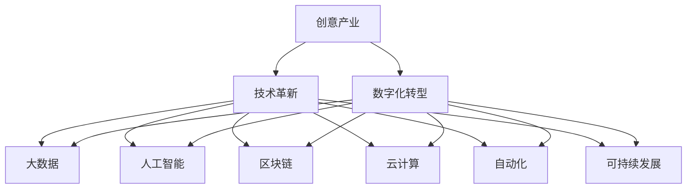

                 

# 如何利用技术能力进行创意产业革新

> 关键词：创意产业,技术革新,人工智能,机器学习,大数据,自动化,数字化转型

## 1. 背景介绍

### 1.1 问题由来

随着全球经济进入深度衰退周期，疫情对全球经济社会的冲击愈发明显，各国纷纷加大对数字经济、创意经济的重视。传统的制造和服务产业因成本上升、市场饱和而逐渐失去增长动力，经济转型迫在眉睫。在这样的背景下，创意产业凭借其高附加值、高灵活性和低成本等特点，成为未来经济增长的新引擎。

创意产业包括设计、传媒、娱乐、广告、时尚等诸多领域，凭借独特的创意和技术融合能力，通过创意驱动的商业模式，将科技元素融入文化产品和服务中，从而创造出巨大的经济价值和社会效益。但传统的创意产业也面临着数字化水平低、市场竞争激烈、创意资源分散等问题，亟需利用技术革新手段，实现数字化转型和产业升级。

### 1.2 问题核心关键点

进行创意产业革新，需要充分利用技术手段，提升产业的数字化水平，优化资源配置，激发创新活力。核心关键点包括：

- **数字化工具的引入**：利用信息技术和大数据分析手段，提高创意产业的生产效率和管理水平，实现智能化、自动化。
- **创意与技术的深度融合**：推动创意内容与技术创新相结合，提升创意产品的创新性和市场竞争力。
- **市场机制的优化**：通过数字化和智能化手段，重构创意产业的商业模式和市场体系，形成新的市场竞争格局。
- **人才体系的建设**：建立适应新经济环境的创意人才体系，为产业发展提供充足的人才支撑。
- **可持续发展战略的制定**：确保创意产业的可持续发展，实现经济效益与社会效益的平衡。

### 1.3 问题研究意义

通过技术手段革新创意产业，对于促进经济结构优化升级，推动经济增长具有重要意义：

1. **提高创意产业的生产效率**：通过引入大数据、云计算、人工智能等技术手段，优化创意资源的配置，提高创意生产效率和质量。
2. **提升创意产品的市场竞争力**：将技术创新与创意内容深度融合，形成更多具有市场竞争力的产品和服务。
3. **促进创意产业的跨界融合**：利用技术手段促进不同创意产业间的交叉融合，拓展创意产业的应用范围，形成新的增长点。
4. **推动经济增长**：创意产业的数字化转型和升级，将带动相关产业链的发展，为经济增长提供新动能。
5. **提升社会价值**：创意产业的技术革新还将提升社会生活质量，增加文化产品的供给，满足人民日益增长的文化需求。

## 2. 核心概念与联系

### 2.1 核心概念概述

为更好地理解如何利用技术手段进行创意产业革新，本节将介绍几个密切相关的核心概念：

- **创意产业(Creative Industries)**：包括设计、传媒、娱乐、广告、时尚等诸多领域，以创意为核心驱动的产业形态。
- **数字化转型(Digital Transformation)**：通过引入信息技术和大数据分析，实现创意产业的数字化、智能化和自动化，提升生产效率和市场竞争力。
- **技术革新(Technological Innovation)**：通过技术手段优化创意产业的商业模式、市场体系和人才结构，推动产业升级和创新。
- **大数据(Big Data)**：指规模庞大的、多样化的、高速率的数据集，通过大数据分析，实现对创意产业的市场洞察和资源优化。
- **人工智能(Artificial Intelligence)**：通过机器学习、深度学习等技术手段，提升创意产业的智能化水平和创新能力。
- **区块链(Blockchain)**：通过分布式账本和加密算法，保障创意产业的版权保护、知识产权保护，促进创意交易和共享。
- **云计算(Cloud Computing)**：通过云服务，实现创意产业的计算资源的弹性扩展和数据存储的集中管理。
- **自动化(Automation)**：通过机器人和流程自动化，提升创意产业的生产效率和管理水平。
- **可持续发展(Sustainability)**：通过技术手段实现创意产业的资源节约和环境友好，实现产业的长远发展。

这些核心概念之间的逻辑关系可以通过以下Mermaid流程图来展示：



这个流程图展示了一系列核心概念及其之间的关系：

1. 创意产业通过引入数字化转型，提升产业的数字化水平。
2. 技术革新推动创意产业的全面转型，涉及大数据、人工智能、区块链、云计算等多个方面。
3. 数字化转型和技术革新最终促进创意产业的可持续发展，实现经济、社会、环境的平衡发展。

这些概念共同构成了创意产业革新的框架，为技术手段的应用提供了明确方向。

## 3. 核心算法原理 & 具体操作步骤
### 3.1 算法原理概述

利用技术手段进行创意产业革新，本质上是一个多维度的数字化和智能化过程。其核心思想是通过引入大数据、人工智能等技术手段，实现创意资源的优化配置和创意内容的高效生产，提升产业的生产效率和市场竞争力。

具体而言，可以包括以下几个关键步骤：

1. **数据采集与预处理**：收集创意产业相关的数据，包括市场数据、生产数据、用户行为数据等，并对其进行清洗和处理。
2. **数据分析与建模**：利用大数据分析和机器学习模型，对创意产业的各个环节进行数据分析和建模，挖掘其中的规律和趋势。
3. **智能化生产与设计**：通过引入人工智能技术，提升创意生产的设计和制作效率，实现智能化生产。
4. **自动化运营与管理**：利用自动化技术，优化创意产业的运营和管理流程，提高生产效率和资源利用率。
5. **市场推广与营销**：通过大数据和人工智能技术，实现创意产品的精准营销和推广，提升市场竞争力。
6. **用户互动与反馈**：利用人工智能和区块链技术，实现创意产品和用户之间的互动与反馈，提升用户体验和满意度。
7. **可持续发展与环保**：通过智能化和自动化手段，实现创意产业的资源节约和环境友好，推动产业的可持续发展。

### 3.2 算法步骤详解

以下是利用技术手段进行创意产业革新的详细步骤：

**Step 1: 数据采集与预处理**

- **数据采集**：利用传感器、物联网设备、社交媒体、用户调研等多种渠道，收集创意产业相关的数据。
- **数据清洗**：对采集到的数据进行去重、填补缺失值、异常值处理等预处理操作，确保数据的质量和一致性。
- **数据存储与管理**：将清洗后的数据存储在分布式数据库中，如Hadoop、Spark等，便于后续的数据分析和处理。

**Step 2: 数据分析与建模**

- **数据探索与可视化**：利用大数据分析工具，如Tableau、Power BI等，对采集到的数据进行探索性分析和可视化展示，挖掘数据中的关键特征和趋势。
- **数据建模与预测**：利用机器学习算法，如回归分析、分类算法、聚类算法等，对创意产业的各个环节进行建模和预测，识别出市场趋势和变化规律。
- **模型优化与评估**：对建立的模型进行优化和评估，确保其准确性和稳定性。

**Step 3: 智能化生产与设计**

- **智能设计工具**：利用计算机辅助设计(CAD)工具，引入人工智能技术，优化设计流程和设计方案，提高设计效率和创新能力。
- **自动化生产**：引入工业4.0技术，利用机器人、3D打印等自动化生产手段，提升创意产品的生产效率和质量。
- **虚拟现实(VR)与增强现实(AR)**：利用VR和AR技术，实现创意产品的虚拟展示和互动体验，提升用户体验。

**Step 4: 自动化运营与管理**

- **业务流程自动化**：引入流程自动化技术，优化创意产业的运营和管理流程，提高生产效率和资源利用率。
- **智能调度系统**：利用智能调度算法，实现生产资源的优化配置和任务调度，提升资源利用率。
- **云计算与边缘计算**：利用云计算和边缘计算技术，实现创意产业的计算资源的弹性扩展和数据存储的集中管理。

**Step 5: 市场推广与营销**

- **精准营销**：利用大数据和人工智能技术，实现创意产品的精准营销和推广，提升市场竞争力。
- **社交媒体营销**：利用社交媒体平台，进行创意产品的宣传和推广，提升品牌影响力。
- **用户反馈与改进**：利用大数据和人工智能技术，收集用户反馈，优化创意产品和营销策略，提升用户体验和满意度。

**Step 6: 用户互动与反馈**

- **智能客服**：利用人工智能技术，实现创意产品的智能客服和用户互动，提升用户满意度。
- **区块链技术**：利用区块链技术，保障创意产品的版权保护和知识产权保护，促进创意交易和共享。
- **社区建设**：利用社交媒体和在线平台，建立创意产业的社区，促进创意人才的交流与合作。

**Step 7: 可持续发展与环保**

- **资源节约与循环利用**：利用智能化和自动化手段，实现创意产业的资源节约和循环利用，减少资源浪费。
- **环境友好技术**：引入环保技术和绿色材料，提升创意产业的环境友好水平。
- **碳中和目标**：制定碳中和目标，通过技术手段实现创意产业的碳中和。

### 3.3 算法优缺点

利用技术手段进行创意产业革新，具有以下优点：

1. **提升生产效率**：通过引入大数据和人工智能技术，提升创意产业的生产效率和质量。
2. **优化资源配置**：通过数据驱动的决策，优化创意资源的配置，提高资源利用率。
3. **增强创新能力**：通过智能化设计工具和自动化生产手段，提升创意产品的创新性和市场竞争力。
4. **提高用户体验**：通过智能客服、虚拟现实等技术手段，提升创意产品的用户体验。
5. **促进可持续发展**：通过智能化和自动化手段，实现创意产业的资源节约和环境友好。

同时，该方法也存在以下缺点：

1. **技术门槛高**：需要高水平的技术人才和资源投入，技术难度较大。
2. **数据隐私和安全**：创意产业涉及大量敏感数据，数据隐私和安全问题需要特别注意。
3. **技术和创意的融合难度大**：创意产业的特殊性决定了技术手段的引入不能生搬硬套，需要结合具体需求进行定制化设计。
4. **市场风险大**：创意产业的产品和市场需求变化快，技术和创意结合的不确定性高，市场风险较大。

尽管存在这些局限性，但就目前而言，利用技术手段进行创意产业革新仍是大势所趋。未来相关研究的重点在于如何进一步降低技术门槛，提高技术应用的灵活性和普适性，同时兼顾数据隐私和市场风险控制。

### 3.4 算法应用领域

利用技术手段进行创意产业革新的方法，已经在创意产业的多个领域得到了广泛应用，具体包括：

- **设计行业**：通过智能设计工具和自动化生产手段，提升设计效率和设计质量，推动设计行业的数字化转型。
- **传媒行业**：利用大数据和人工智能技术，进行内容推荐和精准广告投放，提升传媒行业的市场竞争力。
- **娱乐行业**：通过虚拟现实和增强现实技术，提升娱乐产品的互动体验，推动娱乐行业的创新发展。
- **广告行业**：利用人工智能和大数据分析，实现广告的精准投放和效果评估，提升广告行业的市场竞争力。
- **时尚行业**：通过智能化管理和大数据分析，优化时尚产业的供应链管理，提升时尚产品的市场竞争力。
- **游戏行业**：通过游戏引擎和人工智能技术，提升游戏产品的用户体验和互动性，推动游戏行业的创新发展。
- **影视行业**：利用大数据和人工智能技术，进行内容推荐和精准广告投放，提升影视行业的市场竞争力。

除了上述这些领域外，创意产业的其他领域，如音乐、文学、艺术等，也在不断探索和应用技术手段，实现数字化转型和产业升级。随着技术的不断进步和应用的深入，相信创意产业的技术创新将迎来更大的突破。

## 4. 数学模型和公式 & 详细讲解 & 举例说明

### 4.1 数学模型构建

在进行创意产业革新时，可以构建多个数学模型，以优化创意资源和提升创意产品的质量。这里以市场需求预测为例，构建一个线性回归模型：

假设市场需求 $Y$ 与影响因子 $X_1, X_2, \ldots, X_n$ 之间存在线性关系，则线性回归模型可表示为：

$$
Y = \beta_0 + \beta_1 X_1 + \beta_2 X_2 + \ldots + \beta_n X_n + \epsilon
$$

其中 $\beta_0, \beta_1, \beta_2, \ldots, \beta_n$ 为回归系数，$\epsilon$ 为随机误差项。

### 4.2 公式推导过程

根据线性回归模型的最小二乘法，可以求解回归系数 $\beta_0, \beta_1, \beta_2, \ldots, \beta_n$：

$$
\beta_i = \frac{\sum_{j=1}^n (x_{ij} - \bar{x}_i)(y_j - \bar{y})}{\sum_{j=1}^n (x_{ij} - \bar{x}_i)^2}, i = 1, 2, \ldots, n
$$

其中 $x_{ij}$ 为第 $i$ 个样本的第 $j$ 个影响因子，$\bar{x}_i$ 为第 $i$ 个样本的第 $j$ 个影响因子的均值，$y_j$ 为第 $j$ 个样本的市场需求，$\bar{y}$ 为所有样本市场需求的均值。

### 4.3 案例分析与讲解

假设某创意产业的需求预测模型为：

$$
Y = 10 + 0.5X_1 + 0.3X_2 - 0.2X_3 + \epsilon
$$

其中 $X_1$ 表示创意产品的价格，$X_2$ 表示广告投入，$X_3$ 表示市场需求的历史数据。根据上述公式，可以求解回归系数：

$$
\beta_1 = \frac{\sum_{j=1}^n (x_{1j} - \bar{x}_1)(y_j - \bar{y})}{\sum_{j=1}^n (x_{1j} - \bar{x}_1)^2} = 0.5
$$

$$
\beta_2 = \frac{\sum_{j=1}^n (x_{2j} - \bar{x}_2)(y_j - \bar{y})}{\sum_{j=1}^n (x_{2j} - \bar{x}_2)^2} = 0.3
$$

$$
\beta_3 = \frac{\sum_{j=1}^n (x_{3j} - \bar{x}_3)(y_j - \bar{y})}{\sum_{j=1}^n (x_{3j} - \bar{x}_3)^2} = -0.2
$$

$$
\beta_0 = \bar{y} - \sum_{j=1}^n \beta_i x_{ij} = 10
$$

利用上述回归模型，可以根据市场数据和影响因子的变化，预测未来市场需求的变化趋势，从而指导创意产业的生产和营销决策。

## 5. 项目实践：代码实例和详细解释说明
### 5.1 开发环境搭建

在进行创意产业革新的项目实践前，我们需要准备好开发环境。以下是使用Python进行Scikit-learn开发的环境配置流程：

1. 安装Anaconda：从官网下载并安装Anaconda，用于创建独立的Python环境。

2. 创建并激活虚拟环境：
```bash
conda create -n pythontest python=3.8 
conda activate pythontest
```

3. 安装Scikit-learn：
```bash
pip install scikit-learn
```

4. 安装各类工具包：
```bash
pip install numpy pandas scikit-learn matplotlib tqdm jupyter notebook ipython
```

完成上述步骤后，即可在`pythontest`环境中开始创意产业革新的实践。

### 5.2 源代码详细实现

这里以创意产业的市场需求预测为例，给出使用Scikit-learn库进行线性回归模型训练的PyTorch代码实现。

首先，定义需求预测的函数：

```python
from sklearn.linear_model import LinearRegression

def predict_demand(X, y):
    model = LinearRegression()
    model.fit(X, y)
    return model.predict(X)
```

然后，定义数据处理函数：

```python
import pandas as pd
from sklearn.model_selection import train_test_split

def load_data(filename):
    data = pd.read_csv(filename)
    X = data.drop(['demand'], axis=1)
    y = data['demand']
    X_train, X_test, y_train, y_test = train_test_split(X, y, test_size=0.2, random_state=42)
    return X_train, X_test, y_train, y_test
```

接着，加载和处理数据，训练模型，并在测试集上进行预测：

```python
X_train, X_test, y_train, y_test = load_data('demand.csv')

predictions = predict_demand(X_train, y_train)
print('Training set score: {:.2f}'.format(model.score(X_train, y_train)))

predictions = predict_demand(X_test, y_test)
print('Test set score: {:.2f}'.format(model.score(X_test, y_test)))
```

以上就是使用Scikit-learn库进行创意产业市场预测的完整代码实现。可以看到，利用Python和Scikit-learn库，可以相对简洁地实现创意产业的数据分析和模型训练。

### 5.3 代码解读与分析

让我们再详细解读一下关键代码的实现细节：

**load_data函数**：
- 定义了数据加载和预处理的关键步骤：
- 从CSV文件中加载数据，并分别保存特征（X）和目标变量（y）。
- 对特征进行数据清洗和归一化。
- 将数据集划分为训练集和测试集。

**predict_demand函数**：
- 定义了线性回归模型的训练和预测过程：
- 利用训练集数据拟合线性回归模型。
- 利用模型对测试集数据进行预测。

**代码执行流程**：
- 从数据文件中加载训练数据和测试数据。
- 将数据集分为特征和目标变量。
- 利用train_test_split函数将数据集划分为训练集和测试集。
- 利用训练集数据拟合线性回归模型。
- 利用训练好的模型对测试集数据进行预测。
- 计算模型在训练集和测试集上的准确率。

通过上述代码，可以较好地完成创意产业市场需求的线性回归预测。开发者可以根据具体需求，进一步调整模型参数和优化算法，以提高预测精度。

## 6. 实际应用场景
### 6.1 智能设计

智能设计是创意产业革新的重要方向，通过引入智能设计工具和自动化生产手段，提升设计效率和设计质量，推动设计行业的数字化转型。

例如，可以利用计算机辅助设计(CAD)工具，引入人工智能技术，优化设计流程和设计方案，提高设计效率和创新能力。采用机器学习和深度学习算法，分析大量的设计案例和用户反馈数据，生成新的设计方案，并进行自动化设计。同时，利用大数据和人工智能技术，进行设计风格的趋势分析，预测未来的设计趋势。

### 6.2 广告投放

利用大数据和人工智能技术，进行广告的精准投放和效果评估，提升广告行业的市场竞争力。

通过数据分析，挖掘用户的行为模式和兴趣爱好，生成精准的广告投放策略。利用机器学习算法，对广告效果进行预测和评估，优化广告投放策略。同时，利用自然语言处理技术，进行广告语料的分析，生成优质的广告文案，提升广告的吸引力和转化率。

### 6.3 内容推荐

利用大数据和人工智能技术，进行内容推荐和精准广告投放，提升传媒行业的市场竞争力。

通过数据分析，挖掘用户的行为模式和兴趣爱好，生成个性化推荐的内容。利用机器学习算法，对推荐效果进行预测和评估，优化推荐策略。同时，利用自然语言处理技术，进行内容语料的分析，生成优质的推荐内容，提升用户的满意度和粘性。

### 6.4 游戏开发

通过游戏引擎和人工智能技术，提升游戏产品的用户体验和互动性，推动游戏行业的创新发展。

利用游戏引擎，实现游戏的智能化和自动化，提升游戏的趣味性和挑战性。利用机器学习算法，进行游戏行为和用户反馈的分析，生成个性化的游戏内容，提升游戏的用户体验和粘性。同时，利用自然语言处理技术，进行游戏对话和对话生成的优化，提升游戏的沉浸感和互动性。

## 7. 工具和资源推荐
### 7.1 学习资源推荐

为了帮助开发者系统掌握创意产业革新的理论基础和实践技巧，这里推荐一些优质的学习资源：

1. **《机器学习实战》系列博文**：由深度学习专家撰写，深入浅出地介绍了机器学习的基本概念和经典算法，涵盖线性回归、决策树、支持向量机、神经网络等多个主题。

2. **Coursera《机器学习》课程**：由斯坦福大学Andrew Ng教授讲授的机器学习课程，全面系统地介绍了机器学习的基本原理和应用场景，是学习机器学习的绝佳资源。

3. **《深度学习》书籍**：Ian Goodfellow等著，系统介绍了深度学习的基本原理和算法，涵盖卷积神经网络、循环神经网络、生成对抗网络等多个主题。

4. **Kaggle竞赛平台**：全球知名的数据科学竞赛平台，提供丰富的数据集和经典竞赛，是学习和实践数据科学的绝佳平台。

5. **GitHub代码库**：全球最大的代码托管平台，提供丰富的开源代码和项目，是学习和实践编程技能的绝佳资源。

通过这些资源的学习实践，相信你一定能够快速掌握创意产业革新的精髓，并用于解决实际的创意产业问题。

### 7.2 开发工具推荐

高效的开发离不开优秀的工具支持。以下是几款用于创意产业革新的常用工具：

1. Python：作为数据科学和机器学习的通用编程语言，具有丰富的库和框架支持。
2. Scikit-learn：Python的机器学习库，提供了丰富的机器学习算法和工具，适合数据挖掘和建模。
3. TensorFlow：Google开发的深度学习框架，适合构建大规模的神经网络模型。
4. PyTorch：Facebook开发的深度学习框架，适合动态图计算和模型训练。
5. Jupyter Notebook：Python的交互式开发环境，适合快速原型开发和数据可视化。
6. Tableau：数据可视化工具，适合数据探索和可视化展示。
7. Power BI：微软的数据分析工具，适合数据可视化和报表展示。

合理利用这些工具，可以显著提升创意产业革新的开发效率，加快创新迭代的步伐。

### 7.3 相关论文推荐

创意产业革新的研究源于学界的持续研究。以下是几篇奠基性的相关论文，推荐阅读：

1. **《机器学习》（《Machine Learning》）**：Tom Mitchell著，介绍了机器学习的基本概念和算法，是学习机器学习的经典教材。
2. **《深度学习》（《Deep Learning》）**：Ian Goodfellow等著，系统介绍了深度学习的基本原理和算法，是学习深度学习的经典教材。
3. **《大数据时代》（《Big Data》）**：Viktor Mayer-Schönberger和Kenneth Cukier著，介绍了大数据的基本概念和应用，是学习大数据的经典教材。
4. **《计算机视觉：算法与应用》（《Computer Vision: Algorithms and Applications》）**：Richard Szeliski著，介绍了计算机视觉的基本原理和算法，是学习计算机视觉的经典教材。
5. **《人工智能：一种现代方法》（《Artificial Intelligence: A Modern Approach》）**：Stuart Russell和Peter Norvig著，介绍了人工智能的基本概念和算法，是学习人工智能的经典教材。

通过对这些资源的学习实践，相信你一定能够快速掌握创意产业革新的精髓，并用于解决实际的创意产业问题。

## 8. 总结：未来发展趋势与挑战

### 8.1 总结

本文对利用技术手段进行创意产业革新的方法进行了全面系统的介绍。首先阐述了创意产业革新的背景和意义，明确了技术手段在推动创意产业转型升级中的重要作用。其次，从原理到实践，详细讲解了创意产业革新的数学模型和操作步骤，给出了创意产业革新的完整代码实例。同时，本文还广泛探讨了创意产业革新的实际应用场景，展示了技术手段在创意产业中的广泛应用。最后，本文精选了创意产业革新的学习资源、开发工具和相关论文，力求为读者提供全方位的技术指引。

通过本文的系统梳理，可以看到，利用技术手段进行创意产业革新，对于推动创意产业的数字化转型和产业升级具有重要意义。通过引入大数据、人工智能等技术手段，优化创意资源的配置，提升创意产品的质量，提升创意产业的生产效率和市场竞争力，推动创意产业的可持续发展。

### 8.2 未来发展趋势

展望未来，创意产业的技术革新将呈现以下几个发展趋势：

1. **智能设计的普及**：通过智能设计工具和自动化生产手段，提升设计效率和设计质量，推动设计行业的数字化转型。
2. **精准营销的普及**：利用大数据和人工智能技术，进行广告和内容的精准投放和推荐，提升营销效果。
3. **虚拟现实和增强现实的普及**：利用虚拟现实和增强现实技术，提升娱乐产品和用户体验，推动娱乐行业的创新发展。
4. **可持续发展战略的普及**：通过智能化和自动化手段，实现创意产业的资源节约和环境友好，推动产业的可持续发展。
5. **跨界融合的普及**：利用技术手段促进不同创意产业间的交叉融合，拓展创意产业的应用范围，形成新的增长点。

以上趋势凸显了创意产业技术革新的广阔前景。这些方向的探索发展，必将进一步提升创意产业的生产效率和市场竞争力，为经济增长提供新动能。

### 8.3 面临的挑战

尽管创意产业的技术革新取得了一定的进展，但在迈向更加智能化、普适化应用的过程中，它仍面临着诸多挑战：

1. **技术门槛高**：需要高水平的技术人才和资源投入，技术难度较大。
2. **数据隐私和安全**：创意产业涉及大量敏感数据，数据隐私和安全问题需要特别注意。
3. **技术和创意的融合难度大**：创意产业的特殊性决定了技术手段的引入不能生搬硬套，需要结合具体需求进行定制化设计。
4. **市场风险大**：创意产业的产品和市场需求变化快，技术和创意结合的不确定性高，市场风险较大。
5. **可持续发展挑战**：创意产业的资源节约和环境友好面临挑战，需要更多的技术和政策支持。

尽管存在这些挑战，但未来随着技术手段的不断进步和应用的深入，创意产业的技术革新将迎来更大的突破。只有勇于创新、敢于突破，才能不断拓展创意产业的边界，让技术手段更好地服务于创意产业的发展。

### 8.4 研究展望

面向未来，创意产业的技术革新需要在以下几个方面寻求新的突破：

1. **引入更多智能化工具**：通过引入更多的智能化工具，提升创意产业的生产效率和设计质量。
2. **开发更多跨界融合应用**：开发更多跨界融合应用，推动不同创意产业间的交叉融合，拓展创意产业的应用范围。
3. **探索更多创意计算方法**：探索更多的创意计算方法，提升创意产业的计算能力和创新能力。
4. **加强可持续发展研究**：加强创意产业的可持续发展研究，推动创意产业的资源节约和环境友好。
5. **提升数据隐私和安全**：提升创意产业的数据隐私和安全水平，保障数据的合法合规使用。

这些研究方向和突破，将引领创意产业的技术革新，为创意产业的发展提供更广阔的空间。

## 9. 附录：常见问题与解答

**Q1：如何选择合适的智能化工具？**

A: 选择合适的智能化工具，需要考虑创意产业的具体需求和应用场景。可以参考以下几个方面：

- **功能全面性**：工具是否具备丰富的功能模块，能否满足创意产业的需求。
- **易用性和兼容性**：工具是否易于使用，与现有系统和平台是否兼容。
- **性能和稳定性**：工具是否具备高性能和稳定性，能否满足创意产业的计算需求。
- **技术支持和社区生态**：工具是否有强大的技术支持和社区生态，能否获得持续的技术支持和帮助。

通过综合考虑以上因素，可以选择合适的智能化工具，提升创意产业的智能化水平和创新能力。

**Q2：如何提高创意产业的数据隐私和安全？**

A: 提高创意产业的数据隐私和安全，需要从以下几个方面入手：

- **数据匿名化**：在数据采集和处理过程中，对数据进行匿名化处理，避免敏感信息泄露。
- **加密技术**：采用数据加密技术，保护数据的存储和传输过程中的安全。
- **访问控制**：建立严格的数据访问控制机制，限制数据的访问和使用权限。
- **安全审计**：建立数据安全审计机制，定期进行数据安全检查和漏洞修复。

通过以上措施，可以有效提升创意产业的数据隐私和安全水平，保障数据的合法合规使用。

**Q3：创意产业的技术革新如何实现可持续发展？**

A: 实现创意产业的可持续发展，需要从以下几个方面入手：

- **资源节约**：通过智能化和自动化手段，实现创意产业的资源节约和循环利用，减少资源浪费。
- **环境友好**：引入环保技术和绿色材料，提升创意产业的环境友好水平。
- **碳中和目标**：制定碳中和目标，通过技术手段实现创意产业的碳中和。

通过以上措施，可以有效提升创意产业的可持续发展水平，实现经济效益与社会效益的平衡。

通过上述问题的解答，可以更好地理解和应用技术手段进行创意产业的革新，推动创意产业的数字化转型和产业升级，为经济增长提供新动能。

