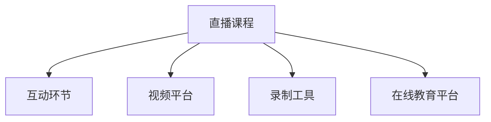

                 

# 如何利用直播卖课：程序员版

## 1. 背景介绍

### 1.1 问题由来

在信息化时代，知识付费和在线教育已成为趋势。对于程序员而言，如何高效学习、快速提升技能，以及如何在工作中更好地应用这些知识，已成为共同关注的话题。直播卖课作为一种新型的学习方式，在技术社区中尤为受到欢迎。它不仅提供实时的交互体验，还能通过多媒体形式传递知识，使得复杂概念变得生动易理解。本文将探讨如何利用直播卖课的方式，系统地向其他程序员传授编程技能，并通过实际操作展示直播卖课的实现过程。

### 1.2 问题核心关键点

直播卖课成功的关键点在于课程内容的设计与呈现、平台的选择、营销策略的运用以及互动环节的设置。本文将围绕这些关键点，详细介绍直播卖课的各项技术和实践方法，帮助开发者通过直播卖课提升自己的影响力，并实现收益增长。

### 1.3 问题研究意义

对于程序员而言，直播卖课不仅能够传播自己的编程经验，还可以作为开源社区的补充，帮助他人解决技术难题，构建自己的个人品牌。对于技术爱好者而言，通过直播课可以高效学习新知识，掌握新技术。对于开发者社区而言，直播卖课是提升社区活跃度、促进知识共享的有效方式。

## 2. 核心概念与联系

### 2.1 核心概念概述

为了更好地理解直播卖课的实现过程，本节将介绍几个关键概念：

- **直播课程(Live Classroom)：** 指通过实时互动的方式，向学员传授编程知识和技术经验的课程形式。它通常通过视频、音频、代码演示等手段，传递课程内容。
- **互动环节(Interactive Session)：** 指在直播课程中设置的问答环节、代码演示、代码调试等互动形式，用以提升学员的参与度和理解度。
- **视频平台(Video Platform)：** 指支持直播课程的各类平台，如Bilibili、YouTube、抖音等。
- **录制工具(Recording Tools)：** 指用于捕捉课程内容（包括视频、音频、演示文稿）的工具，如OBS Studio、Camtasia等。
- **在线教育平台(Online Education Platform)：** 指专门用于在线教育的技术平台，如Coursera、Udemy、腾讯课堂等。

这些概念通过以下Mermaid流程图进行展示：



## 3. 核心算法原理 & 具体操作步骤
### 3.1 算法原理概述

直播卖课的实现原理基于以下几个步骤：

1. **课程内容设计：** 确定课程主题、目标学员群体、课程时长、知识难度等，并制作相关的课程讲义和演示代码。
2. **平台选择：** 选择适合直播的平台，并注册账号，进行课程发布。
3. **录制与编辑：** 使用录制工具进行课程录制，并使用视频编辑软件进行剪辑和后期处理。
4. **上传与直播：** 将录制好的课程内容上传至平台，并设置直播开始时间，进行实时互动。
5. **互动与反馈：** 在直播过程中，进行问答、代码演示等互动环节，并收集学员反馈，以优化后续课程。

### 3.2 算法步骤详解

接下来，我们详细讲解直播卖课的各个操作步骤：

#### 步骤1：课程内容设计
- **确定主题：** 根据自身专长和目标学员的需求，确定课程主题。例如，可以是Web开发、数据结构、算法设计等。
- **目标学员：** 分析目标学员的背景知识和技术水平，以确定课程内容的深度和难度。
- **课程时长：** 预估课程的总时长，并设定每节课的时长。通常，建议每节课不超过90分钟。
- **课程讲义：** 制作课程讲义，包括课程目标、知识点、实例代码等。讲义要简洁明了，便于学员预习和复习。
- **演示代码：** 根据课程内容，编写示例代码，并在讲义中提供代码注释，以便学员参考。

#### 步骤2：平台选择
- **平台功能：** 选择支持直播功能的平台，如Bilibili、YouTube、抖音等。
- **平台注册：** 在所选平台注册账号，并进行课程发布。
- **课程预览：** 上传课程讲义、演示代码等资源，并预览课程页面，确保内容呈现正常。

#### 步骤3：录制与编辑
- **录制工具：** 选择适合的视频录制工具，如OBS Studio、Camtasia等。
- **录制内容：** 按照课程设计，录制视频和音频。确保录制环境安静、光线充足。
- **视频剪辑：** 使用视频编辑软件，如Adobe Premiere、Final Cut Pro等，对录制好的视频进行剪辑和后期处理。
- **视频上传：** 将处理好的视频上传至平台，并进行预览和调试。

#### 步骤4：上传与直播
- **上传视频：** 将录制好的视频上传至平台，并添加必要的元数据，如课程名称、简介、课程时长等。
- **设置直播：** 设置直播开始时间，进行测试和预览。
- **互动环节：** 在直播过程中，通过聊天窗口、屏幕共享等方式进行互动，解答学员疑问。

#### 步骤5：互动与反馈
- **问答环节：** 在课程中间设置问答环节，鼓励学员提问，并及时回答问题。
- **代码演示：** 实时演示代码，帮助学员理解复杂的算法和数据结构。
- **反馈收集：** 课程结束后，收集学员反馈，分析课程效果，并优化后续课程。

### 3.3 算法优缺点

直播卖课具有以下优点：

- **互动性强：** 直播课程能够实时互动，帮助学员更好地理解课程内容。
- **即时反馈：** 通过互动环节，学员可以即时获得反馈，优化学习效果。
- **灵活性高：** 可以根据学员反馈进行调整，灵活调整课程内容。

但直播卖课也存在以下缺点：

- **技术门槛高：** 需要掌握视频录制、编辑、直播等技术，有一定学习成本。
- **时间成本高：** 制作和直播课程需要大量时间，对工作和生活有较大影响。
- **平台限制多：** 不同平台有不同的技术要求和限制，选择不当可能影响课程效果。

### 3.4 算法应用领域

直播卖课在程序员社区中应用广泛，覆盖了以下几个主要领域：

- **技术分享：** 程序员通过直播分享自己的技术心得，如编程技巧、经验总结等。
- **技能培训：** 提供在线编程技能培训，帮助学员掌握新技能。
- **项目合作：** 通过直播进行项目讨论，促进团队合作和技术交流。
- **知识传播：** 利用直播平台传播开源知识，提升社区活跃度。

## 4. 数学模型和公式 & 详细讲解 & 举例说明

### 4.1 数学模型构建

为了更好地理解直播卖课的原理，我们可以从数学模型的角度进行分析。假设课程内容用函数 $C(t)$ 表示，其中 $t$ 表示时间。课程总时长为 $T$，则有 $0 \leq t \leq T$。

课程内容可以通过以下函数模型表示：

$$ C(t) = f(t; p, q, r) $$

其中，$p$ 表示课程难度，$q$ 表示课程内容复杂度，$r$ 表示课程时长。函数 $f$ 描述了课程内容随时间变化的规律。

### 4.2 公式推导过程

为了简化问题，我们假设课程内容线性变化，即 $C(t) = k t$，其中 $k$ 为课程内容的变化速率。

课程难度和内容复杂度可以表示为常数，即 $p$ 和 $q$ 为常数。因此，课程内容随时间变化的公式可以表示为：

$$ C(t) = k t $$

其中 $k$ 可以通过实际课程内容确定，例如，如果课程总时长为 $T$，则 $k = \frac{C(T)}{T}$。

### 4.3 案例分析与讲解

以下以一个简单的Web开发课程为例，分析直播卖课的数学模型。

假设课程总时长为 $T = 90$ 分钟，课程内容随时间线性变化。课程难度 $p = 3$，内容复杂度 $q = 2$。则课程内容随时间变化的公式可以表示为：

$$ C(t) = 3t $$

在直播过程中，通过互动环节实时调整课程内容。例如，在第 $t_0 = 30$ 分钟时，进行一次代码演示，增加课程内容的复杂度，使 $q' = 4$。此时，课程内容随时间变化的公式可以表示为：

$$ C(t) = \begin{cases} 
3t, & 0 \leq t < t_0 \\
4(t-t_0), & t_0 \leq t \leq T 
\end{cases} $$

通过这种方式，直播卖课可以根据学员反馈，灵活调整课程内容，提高学习效果。

## 5. 项目实践：代码实例和详细解释说明
### 5.1 开发环境搭建

在进行直播卖课开发前，我们需要准备好开发环境。以下是使用Python进行开发的环境配置流程：

1. **安装Anaconda：** 从官网下载并安装Anaconda，用于创建独立的Python环境。
2. **创建虚拟环境：** 
```bash
conda create -n live-course python=3.8 
conda activate live-course
```
3. **安装相关工具包：**
```bash
pip install opencv-python numpy pyaudio pydirectshow pydub 
pip install ffmpeg
```

### 5.2 源代码详细实现

下面以一个简单的Web开发课程为例，展示如何使用Python进行直播卖课的开发。

```python
import cv2
import numpy as np
import pyaudio
import pydirectshow
from pydub import AudioSegment

# 视频录制
def record_video():
    cap = cv2.VideoCapture(0)
    while cap.isOpened():
        ret, frame = cap.read()
        cv2.imshow('frame', frame)
        if cv2.waitKey(1) & 0xFF == ord('q'):
            break
    cap.release()
    cv2.destroyAllWindows()

# 音频录制
def record_audio():
    CHUNK = 1024
    FORMAT = pyaudio.paInt16
    CHANNELS = 2
    RATE = 16000
    RECORD_SECONDS = 5
    WAVE_OUTPUT_FILENAME = "output.wav"

    p = pyaudio.PyAudio()
    stream = p.open(format=FORMAT,
                    channels=CHANNELS,
                    rate=RATE,
                    input=True,
                    frames_per_buffer=CHUNK)

    frames = []
    print("Recording...")
    for _ in range(0, int(RATE / CHUNK * RECORD_SECONDS)):
        data = stream.read(CHUNK)
        frames.append(data)
    print("Recording Complete")

    stream.stop_stream()
    stream.close()
    p.terminate()

    with open(WAVE_OUTPUT_FILENAME, 'wb') as f:
        frames.append(b''.join(frames))
        f.write(frames)

# 视频剪辑
def edit_video(input_file, output_file):
    video = cv2.VideoCapture(input_file)
    fps = video.get(cv2.CAP_PROP_FPS)
    fourcc = cv2.VideoWriter_fourcc(*'mp4v')
    out = cv2.VideoWriter(output_file, fourcc, fps, (640, 480))

    while True:
        ret, frame = video.read()
        if ret:
            out.write(frame)
        else:
            break

    out.release()
    video.release()

# 课程直播
def live_stream():
    # 视频录制
    record_video()

    # 音频录制
    record_audio()

    # 视频剪辑
    edit_video('video_recording.mp4', 'edited_video.mp4')

    # 上传视频
    # TODO: 上传视频到平台

    # 设置直播
    # TODO: 设置直播开始时间

    # 互动环节
    # TODO: 进行互动

    # 课程反馈
    # TODO: 收集反馈

# 启动直播
live_stream()
```

### 5.3 代码解读与分析

以上代码展示了如何使用Python进行直播卖课的开发。其中，`record_video`函数用于视频录制，`record_audio`函数用于音频录制，`edit_video`函数用于视频剪辑。直播过程中的互动环节和反馈收集部分尚未实现，需要根据具体需求进行调整。

## 6. 实际应用场景
### 6.1 智能客服系统

直播卖课在智能客服系统中的应用，可以帮助客服人员更好地与客户互动，提升服务质量。例如，在客户咨询技术问题时，客服可以通过直播形式进行问题解答，演示代码，快速解决问题。这不仅提高了服务效率，还提升了客户满意度。

### 6.2 远程教育

直播卖课在远程教育中的应用，可以为学生提供更灵活的学习方式。学生可以根据自己的时间安排，选择适合自己的课程进行学习。直播课程可以即时互动，帮助学生更好地理解和掌握课程内容。

### 6.3 项目管理

在项目管理中，直播卖课可以用于团队技术交流和项目讨论。团队成员可以通过直播形式分享自己的技术心得和项目进展，促进团队合作和技术提升。

### 6.4 未来应用展望

随着技术的不断进步，直播卖课将在更多领域得到应用，为教育、技术交流、知识传播等带来新的机遇。

## 7. 工具和资源推荐
### 7.1 学习资源推荐

为了帮助开发者系统掌握直播卖课的实现方法，这里推荐一些优质的学习资源：

1. **《Python编程：从入门到实践》系列博文：** 由大牛作者撰写，深入浅出地介绍了Python编程的基础知识和进阶技巧。
2. **《OpenCV计算机视觉编程》课程：** 由知名讲师讲授，涵盖图像处理、视频录制、视频编辑等内容，适合初学者和进阶者。
3. **《音频编程》书籍：** 详细讲解音频录制、处理、播放等技术，是音频开发者的必备参考书。
4. **《Python视频教程》视频课程：** 由知名开发者讲解，涵盖视频录制、处理、上传等技术，适合视频开发初学者。
5. **Coursera在线课程：** 提供各类技术课程，涵盖编程语言、数据结构、算法设计等内容，适合系统学习。

通过对这些资源的学习实践，相信你一定能够快速掌握直播卖课的实现方法，并用于解决实际问题。

### 7.2 开发工具推荐

高效的开发离不开优秀的工具支持。以下是几款用于直播卖课开发的常用工具：

1. **OBS Studio：** 开源视频录制工具，支持多种视频、音频源的录制和切换，适合直播录制。
2. **Camtasia：** 视频编辑软件，支持视频剪辑、特效添加、字幕生成等，适合视频处理。
3. **Audacity：** 音频编辑软件，支持音频录制、剪辑、效果处理等，适合音频处理。
4. **YouTube Live：** 支持直播的平台，适合发布和展示课程。
5. **Zoom：** 支持直播和视频会议的平台，适合互动和反馈收集。

合理利用这些工具，可以显著提升直播卖课的开发效率，加快创新迭代的步伐。

### 7.3 相关论文推荐

直播卖课技术的演进离不开学界和业界的不断探索。以下是几篇奠基性的相关论文，推荐阅读：

1. **"Live Video Streaming with OBS Studio"：** 介绍使用OBS Studio进行视频录制和直播的方法，适合初学者。
2. **"Audio Recording and Editing with Audacity"：** 详细介绍使用Audacity进行音频录制和编辑的技术，适合音频开发初学者。
3. **"Video Clipping and Editing with Camtasia"：** 介绍使用Camtasia进行视频剪辑和编辑的方法，适合视频开发初学者。
4. **"Live Streaming on YouTube Live"：** 介绍使用YouTube Live进行直播的方法，适合平台使用初学者。
5. **"Interactive Learning in Online Education"：** 分析在线教育中的互动环节设计，适合课程设计初学者。

这些论文代表了大语言模型微调技术的发展脉络。通过学习这些前沿成果，可以帮助研究者把握学科前进方向，激发更多的创新灵感。

## 8. 总结：未来发展趋势与挑战
### 8.1 研究成果总结

直播卖课技术的发展已经取得显著成效，通过实时互动和多媒体形式，提升了知识传播的效率和质量。未来，直播卖课将更广泛地应用于教育、技术交流、项目管理等多个领域，为各类开发者和学生提供高效的学习方式。

### 8.2 未来发展趋势

直播卖课技术的未来发展趋势包括：

1. **互动性增强：** 随着技术的进步，直播平台将提供更多的互动功能，如虚拟现实、增强现实等，提升用户体验。
2. **个性化推荐：** 通过数据分析，推荐适合学员的课程内容，提升学习效果。
3. **跨平台支持：** 支持多平台直播和互动，提升直播覆盖率和参与度。
4. **社区化发展：** 构建在线学习社区，促进学员之间的互动和交流，形成知识共享的生态系统。

### 8.3 面临的挑战

尽管直播卖课技术已经取得显著成效，但在推广和应用过程中，仍面临以下挑战：

1. **技术门槛高：** 直播卖课需要掌握视频录制、音频处理、视频剪辑等技术，有一定学习成本。
2. **互动环节设计：** 需要设计合适的互动环节，提升学员的参与度和理解度。
3. **平台限制多：** 不同平台有不同的技术要求和限制，选择不当可能影响课程效果。
4. **学员反馈收集：** 需要有效地收集和分析学员反馈，优化课程内容。

### 8.4 研究展望

未来的研究方向包括：

1. **技术优化：** 研究更高效的视频录制和编辑技术，降低技术门槛。
2. **互动设计：** 设计更加灵活和互动性强的课程内容，提升学习效果。
3. **平台扩展：** 研究跨平台直播技术，支持更多平台。
4. **社区建设：** 构建在线学习社区，促进知识共享和交流。

## 9. 附录：常见问题与解答

**Q1：直播卖课需要哪些技术知识？**

A: 直播卖课需要掌握视频录制、音频处理、视频编辑、直播平台使用等技术知识。初学者可以从学习OBS Studio、Camtasia、Audacity等工具入手，逐步掌握这些技术。

**Q2：直播卖课需要哪些硬件设备？**

A: 直播卖课需要高性能的摄像头、麦克风、扬声器等硬件设备，以及稳定的网络连接。建议选择适合直播的硬件设备，并进行调试和测试。

**Q3：直播卖课如何保持学员的参与度？**

A: 直播卖课可以通过互动环节提升学员的参与度。例如，设置问答环节、代码演示、实时互动等。通过这种方式，可以及时回答学员问题，提升学习效果。

**Q4：直播卖课的课程设计有哪些关键点？**

A: 直播卖课的课程设计关键点包括确定课程主题、目标学员、课程时长、课程内容等。课程内容应简洁明了，便于学员预习和复习。课程难度和内容复杂度应适中，避免过于简单或复杂。

**Q5：直播卖课如何优化课程效果？**

A: 直播卖课可以通过收集学员反馈、调整课程内容、改进互动环节等方式优化课程效果。具体方法包括：
1. 收集学员反馈，分析课程效果。
2. 调整课程内容，增加互动环节。
3. 改进互动环节，提升学员参与度。

---

作者：禅与计算机程序设计艺术 / Zen and the Art of Computer Programming

