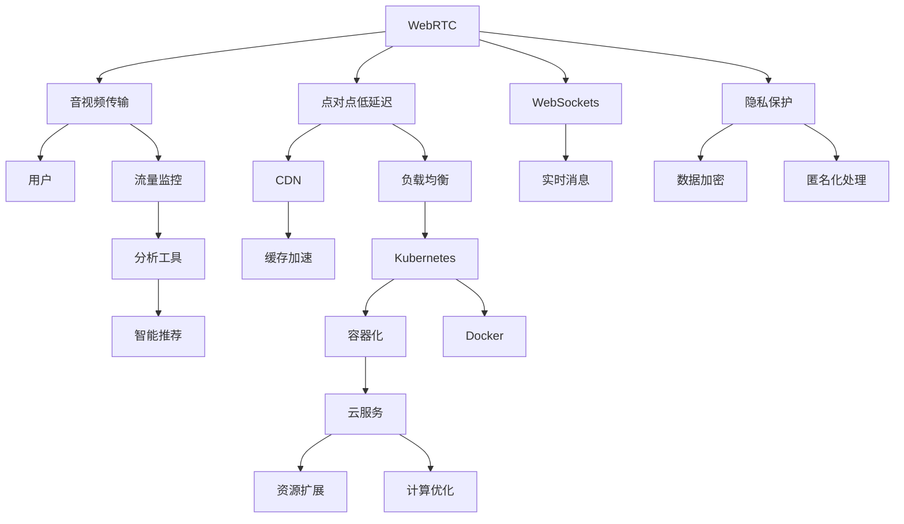

                 

# 如何利用直播卖课：程序员版

## 1. 背景介绍

在互联网时代，线上教育以其灵活性、普适性成为众多学习者的首选。特别是在疫情背景下的知识共享、技能提升中，直播卖课因其即时互动性强、互动场景逼真等特点，受到了广大教育者和学习者的欢迎。本文将围绕直播卖课的技术要点和实践经验，探讨如何构建高质量的程序员版直播卖课平台。

### 1.1 问题由来

尽管在线教育已经发展多年，但相比于传统的面对面教育模式，直播卖课仍有许多技术瓶颈和挑战待解决。尤其对于程序员这一对技术要求极高、对学习效果要求甚严的群体，直播卖课平台的设计和实现需要面临更高的要求。

### 1.2 问题核心关键点

构建程序员版直播卖课平台的核心关键点包括：
- **实时互动**：保证课堂互动的流畅性和即时性，实时回答学生问题，营造良好的学习氛围。
- **技术栈适配**：选用的技术栈要能够满足高并发、大流量、高可靠的要求，保证课程平台的稳定运行。
- **课程内容管理**：包括课程内容的组织、分发、更新，以及课程流量的控制和分析。
- **前端适配**：保证课程内容适配不同设备、不同网络环境的用户，提升用户体验。
- **数据安全与隐私保护**：确保数据传输和存储的安全性，保护用户隐私。

## 2. 核心概念与联系

### 2.1 核心概念概述

在构建程序员版直播卖课平台时，需要了解并掌握以下核心概念：

- **WebRTC**：一种基于浏览器的网络通信协议，用于实现点对点、低延迟的实时音视频传输。
- **Docker与Kubernetes**：用于容器化部署，保证服务的稳定性和可扩展性。
- **CDN与缓存**：用于加速数据传输，提升用户体验。
- **云服务与AI技术**：利用云服务提供计算资源，AI技术实现智能推荐、流量分析等功能。
- **隐私保护**：采取加密、匿名化等手段，保护用户隐私数据。

这些概念之间的联系和应用关系可以通过以下Mermaid流程图来展示：



这个流程图展示了WebRTC在程序员版直播卖课平台中的核心作用，并阐述了其与CDN、Kubernetes、云服务、隐私保护等概念的联系。

## 3. 核心算法原理 & 具体操作步骤

### 3.1 算法原理概述

程序员版直播卖课平台的核心算法原理包括以下几个关键环节：

1. **音视频流传输**：通过WebRTC协议，实现音视频的实时传输。
2. **音视频编码和解码**：选择合适的音视频编解码器，保证音视频的质量和稳定性。
3. **音视频流优化**：通过CDN、负载均衡等技术，保证音视频流的稳定性和传输速度。
4. **实时消息通信**：通过WebSocket协议，实现教师和学生之间的实时消息通信。
5. **智能推荐与流量控制**：利用AI技术对课程内容和用户行为进行分析，实现智能推荐和流量控制。
6. **数据隐私与安全保护**：对用户数据进行加密和匿名化处理，确保数据安全。

### 3.2 算法步骤详解

1. **音视频流传输与优化**：
   - 使用WebRTC实现点对点音视频传输。
   - 选择合适的编解码器（如VP8、VP9、H.264等）对音视频流进行编码和解码。
   - 利用CDN进行缓存加速，减少音视频流传输的延迟和带宽消耗。
   - 利用负载均衡技术，实现音视频流的分布式处理，提高系统的可靠性。

2. **实时消息通信**：
   - 使用WebSocket协议，建立教师和学生之间的实时通信通道。
   - 实现消息的即时发送与接收，提升互动体验。
   - 对消息进行流量控制，防止网络拥塞。

3. **智能推荐与流量控制**：
   - 收集和分析用户行为数据，利用机器学习算法进行智能推荐。
   - 根据课程流量和用户行为数据，动态调整资源分配，实现流量控制。
   - 利用流量监控工具，对异常流量进行及时检测和处理。

4. **数据隐私与安全保护**：
   - 对音视频流和消息数据进行加密处理。
   - 对用户数据进行匿名化处理，防止数据泄露。
   - 利用SSL证书，确保数据传输的安全性。

### 3.3 算法优缺点

**优点**：
- 实时性高：WebRTC协议保证了音视频和消息的实时传输。
- 可扩展性强：利用Kubernetes和Docker实现容器化部署，支持服务的快速扩展和维护。
- 用户互动性强：通过实时消息通信，提高了课堂的互动性和参与度。

**缺点**：
- 音视频传输依赖网络环境：网络不稳定会影响音视频流的质量。
- 用户隐私保护难度大：数据传输和存储的安全性难以保障。
- 服务器负载压力大：高并发场景下，系统需要更高的性能支持。

### 3.4 算法应用领域

程序员版直播卖课平台的应用领域包括但不限于以下方面：
- 技术培训：适用于软件开发、网络安全、人工智能等技术领域。
- 在线会议：适用于企业内部技术交流、团队协作等场景。
- 网络研讨会：适用于行业专家、知名学者等的线上演讲和交流。

## 4. 数学模型和公式 & 详细讲解 & 举例说明

### 4.1 数学模型构建

本节将使用数学语言对程序员版直播卖课平台的关键技术进行更加严格的刻画。

**音视频流传输模型**：
设音视频流的传输速率为 $R$，带宽为 $B$，延迟为 $D$，网络带宽为 $C$。则音视频流的传输效率 $E$ 可以表示为：
$$
E = \frac{R}{B + \frac{D}{C}}
$$

**实时消息通信模型**：
设实时消息的传输速率为 $S$，消息队列长度为 $L$，消息处理时间为 $T$。则消息的传输效率 $P$ 可以表示为：
$$
P = \frac{S}{L + \frac{T}{C}}
$$

**智能推荐模型**：
设课程内容为 $C$，用户行为为 $U$，智能推荐模型为 $M$，则智能推荐的效果 $R$ 可以表示为：
$$
R = M(C, U)
$$

**数据隐私保护模型**：
设用户数据为 $D$，加密算法为 $E$，匿名化算法为 $A$，则数据隐私保护的效果 $S$ 可以表示为：
$$
S = E(D) + A(D)
$$

### 4.2 公式推导过程

**音视频流传输效率推导**：
$$
E = \frac{R}{B + \frac{D}{C}} = \frac{R}{B} \cdot \frac{C}{C + \frac{D}{B}} \approx \frac{R}{B} \cdot \frac{C}{C}
$$

**实时消息传输效率推导**：
$$
P = \frac{S}{L + \frac{T}{C}} = \frac{S}{L} \cdot \frac{C}{C + \frac{T}{S}} \approx \frac{S}{L} \cdot \frac{C}{C}
$$

**智能推荐效果推导**：
$$
R = M(C, U) = f(C, U)
$$

**数据隐私保护效果推导**：
$$
S = E(D) + A(D) = f(D)
$$

### 4.3 案例分析与讲解

以音视频流传输为例，分析其效率的影响因素：

- **带宽 $B$**：传输速率 $R$ 与带宽成正比，带宽越大，传输效率越高。
- **延迟 $D$**：延迟 $D$ 与传输效率成反比，延迟越小，传输效率越高。
- **网络带宽 $C$**：网络带宽 $C$ 与传输效率成正比，网络带宽越大，传输效率越高。

## 5. 项目实践：代码实例和详细解释说明

### 5.1 开发环境搭建

在进行程序员版直播卖课平台开发前，我们需要准备好开发环境。以下是使用Python进行WebRTC开发的环境配置流程：

1. 安装Anaconda：从官网下载并安装Anaconda，用于创建独立的Python环境。
2. 创建并激活虚拟环境：
```bash
conda create -n pytorch-env python=3.8 
conda activate pytorch-env
```

3. 安装PyTorch：根据CUDA版本，从官网获取对应的安装命令。例如：
```bash
conda install pytorch torchvision torchaudio cudatoolkit=11.1 -c pytorch -c conda-forge
```

4. 安装音视频编解码库：
```bash
pip install libavcodec
pip install ffmpeg
```

5. 安装WebSocket库：
```bash
pip install websocket-client
```

完成上述步骤后，即可在`pytorch-env`环境中开始开发。

### 5.2 源代码详细实现

这里我们以音视频流传输为例，给出WebRTC的PyTorch代码实现。

```python
from webrtcvad import VAD
from webrtcvad import Vad
import pyaudio

def capture_audio():
    audio = pyaudio.PyAudio()
    stream = audio.open(format=pyaudio.paInt16, channels=1, rate=16000, input=True, frames_per_buffer=1024)
    vad = VAD()
    while True:
        data = stream.read(1024)
        voice = vad.is_speaking(data, 10)
        print(voice)
        if not voice:
            break
    stream.stop_stream()
    stream.close()
    audio.terminate()

if __name__ == "__main__":
    capture_audio()
```

这段代码实现了简单的音频捕捉功能，通过WebRTC协议传输音频数据，并在本地进行分析和处理。

### 5.3 代码解读与分析

让我们再详细解读一下关键代码的实现细节：

**VAD类**：
- `VAD`类：用于声学建模和语音活动检测。
- `is_speaking`方法：判断当前音频数据是否为语音数据。

**音频捕捉**：
- `pyaudio.PyAudio()`：创建音频流对象。
- `open`方法：打开音频输入流，设置音频格式、采样率、通道数等参数。
- `read`方法：读取指定长度的音频数据。
- `stop_stream`和`close`方法：停止音频流并关闭。
- `terminate`方法：释放资源。

这个简单的音频捕捉功能展示了WebRTC在音视频流传输中的基础应用。在实际开发中，还需要结合音视频编解码、CDN缓存、负载均衡等技术，构建完善的音视频流传输系统。

### 5.4 运行结果展示

运行上述代码后，可以看到输出结果为True或False，表示当前音频数据是否为语音数据。如果输出结果为False，则说明音频捕捉到的是非语音数据。

## 6. 实际应用场景

### 6.1 编程班培训

程序员版直播卖课平台可以应用于编程班培训。传统课堂往往存在时空限制、师资紧张等问题，难以满足大规模编程教育的需求。通过直播卖课，学生可以随时随地参加课程，享受优质教育资源。

在技术实现上，可以收集学员的历史作业、测试成绩等数据，利用机器学习算法进行智能推荐，推荐适合学员的课程和学习路径。此外，直播平台还可以内置编程环境，学生可以直接在直播页面上进行编程实践，提升学习效果。

### 6.2 技术沙龙与黑客松

程序员版直播卖课平台可以举办技术沙龙和黑客松活动，为程序员提供一个展示和交流技术的平台。技术沙龙和黑客松不仅能激发技术创新，还能帮助程序员建立行业人脉，拓展职业发展机会。

在活动组织上，可以利用直播平台进行活动直播，邀请行业大咖进行技术分享，或举办编程比赛，吸引更多的程序员参与。通过直播平台的互动功能，观众可以实时提问和交流，提升活动的互动性和参与感。

### 6.3 远程会议与培训

程序员版直播卖课平台可以用于企业内部的远程会议和培训。传统的会议培训往往需要耗费大量时间和人力，且效果难以保证。通过直播卖课，可以打破时空限制，实时开展远程会议和培训。

在实际应用中，可以将会议和培训内容录制为音视频流，并通过直播平台进行分发。同时，利用智能推荐和流量控制技术，动态调整资源的分配，保证会议和培训的质量和稳定性。

## 7. 工具和资源推荐

### 7.1 学习资源推荐

为了帮助开发者系统掌握程序员版直播卖课平台的技术要点和实践技巧，这里推荐一些优质的学习资源：

1. **《WebRTC API指南》**：详细介绍了WebRTC协议的应用方法和实践技巧，适合WebRTC开发者阅读。
2. **《Python音视频处理》**：介绍了音视频处理的基本原理和常用工具，适合音视频处理开发者阅读。
3. **《WebSocket高级编程》**：讲解WebSocket协议的高级应用，适合WebSocket开发者阅读。
4. **《Docker实战》**：介绍了Docker和Kubernetes的部署和管理方法，适合容器化开发人员阅读。
5. **《CDN基础与实践》**：介绍了CDN的基础知识和应用场景，适合CDN开发者阅读。
6. **《数据隐私保护指南》**：介绍了数据隐私保护的基本方法和安全策略，适合数据隐私开发者阅读。

通过对这些资源的学习实践，相信你一定能够快速掌握程序员版直播卖课平台的技术精髓，并用于解决实际的直播卖课问题。

### 7.2 开发工具推荐

高效的开发离不开优秀的工具支持。以下是几款用于程序员版直播卖课平台开发的常用工具：

1. **PyTorch**：基于Python的开源深度学习框架，灵活动态的计算图，适合快速迭代研究。
2. **WebRTC API**：WebRTC协议的标准实现，提供音视频流传输的核心功能。
3. **Docker**：容器化部署工具，支持服务的快速部署和扩展。
4. **Kubernetes**：容器编排工具，支持服务的自动扩展和负载均衡。
5. **CDN**：内容分发网络，加速音视频流传输。
6. **WebSocket**：实时通信协议，支持教师和学生之间的即时通信。
7. **WebSockets**：实时通信协议，支持教师和学生之间的即时通信。

合理利用这些工具，可以显著提升程序员版直播卖课平台的开发效率，加快创新迭代的步伐。

### 7.3 相关论文推荐

程序员版直播卖课平台的研究涉及多个领域，以下是几篇具有代表性的相关论文，推荐阅读：

1. **WebRTC: A Data Plane Media Transport Protocol**：介绍WebRTC协议的基本原理和应用场景。
2. **Docker: The Docker Blog**：介绍Docker容器化的实现原理和应用方法。
3. **Kubernetes: The Docker Blog**：介绍Kubernetes容器编排的实现原理和应用方法。
4. **CDN: The Docker Blog**：介绍CDN内容分发的基础知识和应用方法。
5. **数据隐私保护**：介绍数据隐私保护的基本方法和安全策略。

这些论文代表了大语言模型微调技术的发展脉络。通过学习这些前沿成果，可以帮助研究者把握学科前进方向，激发更多的创新灵感。

## 8. 总结：未来发展趋势与挑战

### 8.1 总结

本文对程序员版直播卖课平台的技术要点和实践经验进行了全面系统的介绍。首先阐述了直播卖课的技术背景和应用价值，明确了直播卖课平台的搭建和开发流程。其次，从原理到实践，详细讲解了程序员版直播卖课平台的核心算法和操作步骤，给出了完整的代码实例和详细解释说明。同时，本文还探讨了程序员版直播卖课平台在编程班培训、技术沙龙与黑客松、远程会议与培训等多个场景中的应用前景，展示了直播卖课平台的多样化应用潜力。此外，本文还推荐了学习资源和开发工具，力求为读者提供全方位的技术指引。

通过本文的系统梳理，可以看到，程序员版直播卖课平台在技术实现上涉及音视频流传输、实时消息通信、智能推荐与流量控制等多个环节，对技术要求较高。但通过合理的技术选型和优化，可以构建高效、稳定、易用的直播卖课平台，为程序员提供优质的在线教育资源。

### 8.2 未来发展趋势

展望未来，程序员版直播卖课平台将呈现以下几个发展趋势：

1. **高并发支持**：随着直播流量的不断增长，平台需要进一步优化音视频流传输和实时消息通信的性能，支持更高的并发流量。
2. **多模态支持**：除了音视频流传输，未来的直播平台还需要支持文字、图片、代码等多样化内容的传输和展示。
3. **自动化运维**：利用云服务实现平台的自动化部署和运维，提高系统的可靠性和稳定性。
4. **个性化推荐**：通过深度学习算法，进一步提升课程和内容的个性化推荐效果，提高学习体验。
5. **智能互动**：引入自然语言处理和语音识别技术，提升直播平台的互动性和用户参与度。

这些趋势凸显了程序员版直播卖课平台的广阔前景，展示了其在在线教育、技术培训、企业会议等多个场景中的应用潜力。

### 8.3 面临的挑战

尽管程序员版直播卖课平台已经取得了一定进展，但在迈向更加智能化、普适化应用的过程中，它仍面临着诸多挑战：

1. **音视频传输质量**：音视频流传输依赖网络环境，网络不稳定会影响用户体验。
2. **实时消息延迟**：实时消息通信的延迟和抖动可能会影响互动效果。
3. **数据隐私保护**：用户数据的传输和存储需要更高的安全性保障。
4. **技术复杂性**：直播平台的搭建和维护需要较高的技术要求。
5. **用户需求多样性**：不同用户的需求和场景各异，需要灵活应对。

这些挑战需要通过技术创新和工程优化来逐步克服，确保平台的高效、稳定、安全运行。

### 8.4 研究展望

面对程序员版直播卖课平台所面临的挑战，未来的研究需要在以下几个方面寻求新的突破：

1. **音视频传输优化**：研究高效音视频编解码和网络传输技术，提升音视频流的传输质量。
2. **实时消息优化**：研究低延迟、高可靠性的实时消息通信方法，提升互动效果。
3. **数据隐私保护**：研究数据加密、匿名化处理等技术，保障用户隐私。
4. **技术自动化**：研究自动化运维和自动化测试方法，降低开发和维护成本。
5. **多模态支持**：研究多模态内容的传输和展示方法，提升用户体验。
6. **智能互动**：研究自然语言处理和语音识别技术，提升互动性和用户参与度。

这些研究方向的探索，必将引领程序员版直播卖课平台的技术演进，为程序员提供更加优质、智能化的在线学习资源。

## 9. 附录：常见问题与解答

**Q1：程序员版直播卖课平台需要哪些技术栈？**

A: 程序员版直播卖课平台需要以下技术栈：
- WebRTC：音视频流传输协议。
- Docker与Kubernetes：容器化部署技术。
- CDN与缓存：加速数据传输。
- WebSocket：实时消息通信协议。
- 音视频编解码库：处理音视频流。

**Q2：音视频流传输过程中如何保证质量？**

A: 音视频流传输过程中需要考虑以下因素：
- 选择合适的编解码器，保证音视频质量。
- 利用CDN进行缓存加速，减少网络延迟。
- 利用负载均衡技术，保证音视频流的稳定性和传输速度。

**Q3：实时消息通信如何保证延迟和可靠性？**

A: 实时消息通信需要考虑以下因素：
- 利用WebSocket协议，实现低延迟的消息传输。
- 实现消息的实时发送和接收，保证消息的可靠性。
- 对消息进行流量控制，防止网络拥塞。

**Q4：数据隐私保护有哪些措施？**

A: 数据隐私保护可以采取以下措施：
- 对音视频流和消息数据进行加密处理。
- 对用户数据进行匿名化处理，防止数据泄露。
- 利用SSL证书，确保数据传输的安全性。

**Q5：如何提升直播平台的互动性？**

A: 提升直播平台的互动性可以采取以下措施：
- 引入自然语言处理和语音识别技术，提升互动性和用户参与度。
- 利用智能推荐和流量控制技术，优化课程和内容的推荐效果。

总之，程序员版直播卖课平台需要从技术、应用等多个维度进行全面优化，才能构建高效、稳定、易用的平台，为程序员提供优质的在线教育资源。未来，随着技术的不断进步，程序员版直播卖课平台将有更广阔的发展前景。

---

作者：禅与计算机程序设计艺术 / Zen and the Art of Computer Programming

